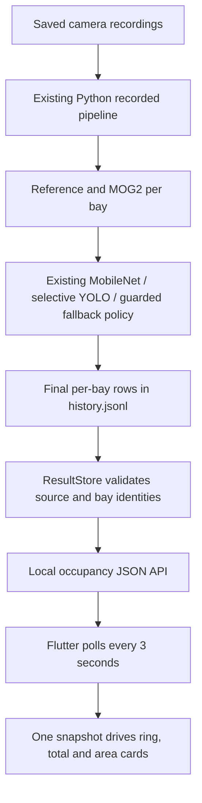

# Flutter connection to the Python parking system

Implemented 27 September 2026 (Malaysia local time).

## What is connected

The Flutter home page now reads actual per-bay **Final** decisions from the existing Python OpenCV-first pipeline. The default app no longer uses the 52/78 demo fixture. Opening the page reads saved results immediately; it does not wait for model loading or a complete video replay. A local Python server serves both the compiled Flutter assets and a JSON API. Flutter polls the API every three seconds.

**This is recorded analysis, not live parking availability.** CHAD and Overhead recordings represent separate periods, and original camera capture times are not supplied. The page explicitly labels recorded results, shows each recording position and analysis time, and explains that combined counts are not simultaneous live observations. A recent analysis timestamp means the file was processed recently; it does not mean the recording is recent.

CHAD uses the nine mapped Camera 1 bays, with a selector for recordings 1–4. Overhead uses its 69 mapped bays. Other CHAD camera views are excluded because their correspondence overlaps or remains unverified; summing them would create false capacity. The total capacity is 78 mapped bays, not a claim about the entire physical CHAD site.

## Running the connected website

From the repository root in PowerShell, with the existing `.venv` and installed Flutter SDK:

```powershell
./apps/parking_web/run-web.ps1
```

This builds Flutter and starts the website/API at `http://127.0.0.1:8765/`. To reuse a current build:

```powershell
./apps/parking_web/run-web.ps1 -SkipBuild
# Optional separate port:
./apps/parking_web/run-web.ps1 -SkipBuild -Port 8766
```

Equivalent server command:

```powershell
./.venv/Scripts/python.exe -m parking_probe.web_server --port 8765
```

Leave the terminal running; Ctrl+C stops it. The server binds only to loopback, serves assets only from `apps/parking_web/build/web`, and does not expose the repository or camera URLs. This is a local application host, not a public production deployment. A plain static file server or `flutter run -d web-server` does not supply the API. The Python popup remains separately launched by `main.py`.

Click **Run new analysis** to run the established recorded inference pipeline in a background worker. The server accepts one job at a time; the website stays responsive and displays progress. It analyzes the four Camera 1 recordings and Overhead at three-second sample intervals, using the same reference preparation, MOG2 calibration, MobileNet empty evidence, YOLO thresholds/profiles and OpenCV-first decision policy as the popup. Latest completed samples appear while processing continues. CHAD and Overhead can therefore temporarily show different run IDs/times; they are explicitly independent recorded samples. The initial model/reference preparation may still take time. Existing cached recordings/models are used; the existing acquisition helpers can fetch missing pinned inputs. Do not run multiple inference hosts against the shared prepared-data directory concurrently.

## IDE preview reminder — 28 September 2026

In VS Code, open the outer `Capstone Project Implementation` folder and use **Terminal → New Terminal** with PowerShell. Run `./apps/parking_web/run-web.ps1 -SkipBuild`, then open `http://127.0.0.1:8765/`. Keep that terminal running; Ctrl+C stops the host. Remove `-SkipBuild` after Flutter source changes to rebuild first. Add `-Port 8766` if the current preview already uses 8765, and open the matching URL.

The existing VS Code F5 configuration launches `main.py` (the Python popup), not Flutter. The script serves a compiled preview with the backend; it is not a hot-reload development session. See [PROPOSAL_PROGRESS.md](PROPOSAL_PROGRESS.md) for the proposal comparison and the full IDE commands.

## Data flow and decision semantics



No decision thresholds, bay polygons, or inference decision rules were changed for this connection. See [OPENCV_FIRST.md](OPENCV_FIRST.md) for the exact per-bay order and guarded fallback. `occupied (P)` is included in occupied totals and visibly identified as provisional. Any provisional vacancy remains separately identifiable. Available spaces are counted from **vacant Final states**, never `capacity - occupied` when unknown/uncertain states exist. Unknown and uncertain segments are gray in the ring and area indicators and are labelled unresolved.

The adapter checks recording/frame/camera identity, physical bay membership, duplicate rows and supported states. Missing bays become unknown. A stale, failed, or misaligned recorded frame has no definite counts. A malformed latest compatible sample becomes unknown rather than silently reviving an older successful sample. Incomplete trailing JSONL writes are ignored until complete. Results using earlier decision policies are excluded. Per-file revision caching avoids repeatedly parsing unchanged history files.

The frontend validates state totals and provenance, discards an out-of-order response after a recording switch, and rejects a response for the wrong requested recording. On connection or response validation failure it hides numeric availability, displays an unavailable message and retry action, and automatically retries on the polling interval. It never falls back to fabricated demo values. Existing saved results retained after an analysis-start failure remain explicitly historical with their original timestamps.

## API contract

- `GET /api/occupancy?chad=chad-1`: selected CHAD recording plus Overhead. Allowed selection: `chad-1` through `chad-4`. Invalid selection returns 400; result-read failure returns 503.
- Response: `schema_version: 1`, `mode: recorded`, `live_availability: false`, `basis`, `served_at`, `chad_recording`, available selection IDs, `areas`, `totals`, and `analysis` job state/message.
- Each area contains `capacity`, `occupied`, `vacant`, `uncertain`, `unknown`, `provisional_occupied`, `provisional_vacant`, `has_sample`, optional `issue`, and `source` with run/recording/frame IDs, sample seconds, processing timestamp, and decision-policy identifier. `bays` retains each bay's state, provisional flag, decision source and reason.
- Totals are recomputed from those bay states and checked by the frontend against the area aggregates. Provisional counts are subsets, not additional bays.
- `POST /api/analysis` requires `X-Parking-Client: web` and an absent or matching local Origin. Returns 202 when started or 409 for an already running job. These guards prevent arbitrary websites from initiating inference; this is not a remote authentication system.
- JSON responses use `Cache-Control: no-store`. Job state is process-local; completed run artifacts remain on disk when the server restarts.

## Implementation files

- `src/parking_probe/web_server.py`: local HTTP host, validated recorded-result store, background job adapter.
- `apps/parking_web/lib/data/parking_api.dart`: HTTP client, polling, request ordering and error state.
- `apps/parking_web/lib/data/parking_snapshot.dart`: typed backend counts, validation and explicitly injected demo fixtures.
- `apps/parking_web/lib/backend_home.dart`: connection status, recording selection, analysis and retry actions.
- `home_page.dart`, `widgets/occupancy_ring.dart`, `widgets/area_card.dart`: consistent recorded/provisional/unresolved presentation and timestamps.
- `run-web.ps1`: build and serve the connected application. The only added Dart runtime package is `http`; no Python runtime package was added.

## Verification and recorded evidence

A fresh analysis was initiated through the HTTP API and completed successfully in `runs/areas/20260926T174542_362312Z` (UTC run identifier). Every API count was checked against its per-bay Final records. Latest results:

| CHAD selection | CHAD occupied / vacant / occupied P | Overhead occupied / vacant / occupied P | Combined occupied / 78 | Combined vacant |
| --- | --- | --- | ---: | ---: |
| Recording 1, 27 s | 2 / 7 / 0 | 54 / 15 / 6 at 27 s | 56 | 22 |
| Recording 2, 30 s | 2 / 7 / 0 | 54 / 15 / 6 at 27 s | 56 | 22 |
| Recording 3, 18 s | 3 / 6 / 1 | 54 / 15 / 6 at 27 s | 57 | 21 |
| Recording 4, 30 s | 2 / 7 / 0 | 54 / 15 / 6 at 27 s | 56 | 22 |

All these latest samples have zero unresolved bays. Their counts match the earlier saved run. **The known pedestrian-obstructed B08 sample in chad-4 at 15 seconds still returns vacant via `mobilenet_reviewed_empty`: it remains a false-vacant result.** Integration correctness does not establish occupancy accuracy or fix that known detector limitation.

Evidence: `runs/verification/flutter-backend/chad-1-response.json` through `chad-4-response.json` and `verification.json`. The API includes provenance and bay reasons for inspection; the driver home page shows compact recording/time and provisional summaries.

Checks: 13 new Python API/store/job tests plus the 16 existing OpenCV-first tests passed (29 total). Flutter analysis reported no issues and 27 model/widget tests passed, including backend counts, invalid payloads, request ordering, failure/recovery, analysis POST behavior, desktop/tablet/phone layouts, keyboard actions, reduced motion, and enlarged text. Tests caught and fixed header overflow at 200% text. Build and browser inspection details are recorded in WORK_LOG.md.

## Future live integration boundary

A live service must acquire an authorized camera feed, process the latest frame continuously without a queued replay, preserve frame-age/error semantics and physical bay identity, and publish timestamped per-bay Final results. The current popup Live camera tab is a viewer and does not provide that service. Do not relabel recorded mode as live or treat polling saved files as a live feed. A future API version can provide live mode only when those requirements are implemented and verified.
