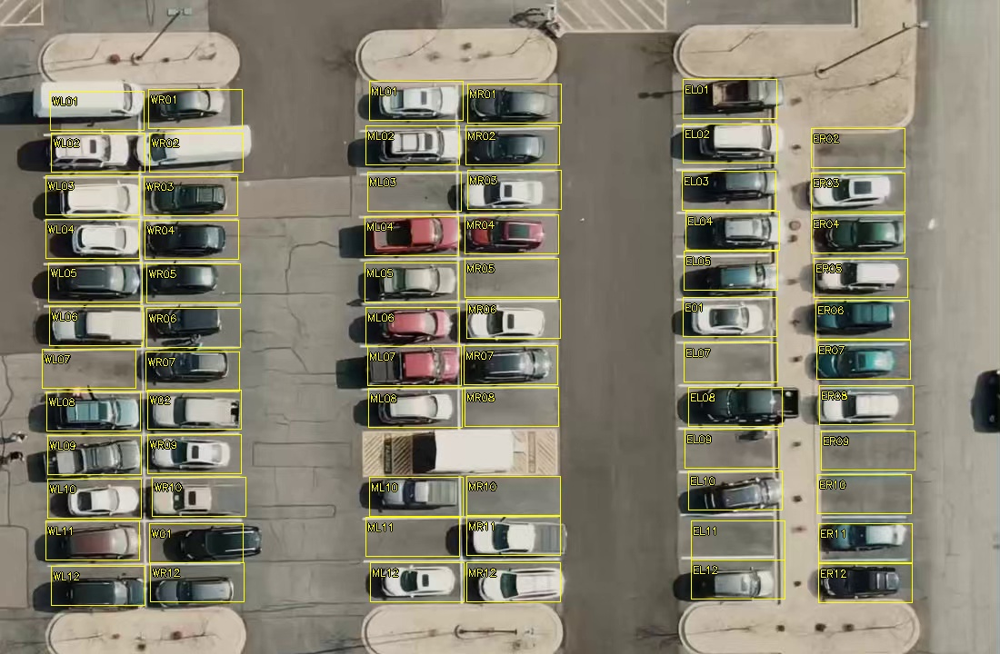

# Every visible overhead parking bay

> **22 September correction:** Final now requires definite Reference/MOG2 agreement or a qualifying YOLO vehicle. The separate empty-image override has been removed; all three unresolved can no longer produce vacant. Reviewed images remain available for calibration. See [DECISION_FIX.md](DECISION_FIX.md) for the rule and [FINAL_RESULTS.md](FINAL_RESULTS.md) for current results.

Updated 19 September 2026. **Overhead demo car park** now monitors **all 69 visible painted parking bays**, including cars and empty bays that never change during the clip. The camera's field of view defines the denominator; this does not establish off-camera whole-site capacity.

## Inventory and identifiers

The map has three areas and six columns. Rows are numbered from top to bottom. Permanent physical IDs have prefix `OVER-`; polygons use the suffix as their local ID.

| Area | Column | IDs, top to bottom | Count |
| --- | --- | --- | ---: |
| West | WL | WL01, WL02, WL03, WL04, WL05, WL06, WL07, WL08, WL09, WL10, WL11, WL12 | 12 |
| West | WR | WR01, WR02, WR03, WR04, WR05, WR06, WR07, W02, WR09, WR10, W01, WR12 | 12 |
| Middle | ML | ML01, ML02, ML03, ML04, ML05, ML06, ML07, ML08, ML10, ML11, ML12 | 11 |
| Middle | MR | MR01, MR02, MR03, MR04, MR05, MR06, MR07, MR08, MR10, MR11, MR12 | 11 |
| East | EL | EL01, EL02, EL03, EL04, EL05, E01, EL07, EL08, EL09, EL10, EL11, EL12 | 12 |
| East | ER | ER02, ER03, ER04, ER05, ER06, ER07, ER08, ER09, ER10, ER11, ER12 | 11 |

Totals: **west 24 + middle 22 + east 23 = 69**. Existing W01, W02 and E01 IDs are preserved for continuity: W01 is west-right row 11, W02 west-right row 8, and E01 east-left row 6. These are aliases, not extra bays. Middle row 9 is a hatched loading/access zone; east-right row 1 is outside the marked bay inventory. Roadway, hatched access areas and the central loading vehicle are excluded.

Coordinates are explicit in [presets/overhead-all-bays.json](presets/overhead-all-bays.json), recipe version 3. The source publisher's 69-coordinate inventory was inspected as data, then checked visually against the video. Rectangles span 103×43 coordinate units inside each bay. Coordinates came from `CarParkPos` at the pinned source commit; only allowed list/tuple/integer pickle opcodes were inspected with `pickletools.genops`. No `pickle.load`, source repository code or serialized callable was executed. Provenance is in [OVERHEAD-SOURCE.md](third_party/OVERHEAD-SOURCE.md); the inspection record is under `data/yolo-overhead-review/`.

## References and calibration

Mapping a bay does not invent training evidence. Three bays have separately selected references and at least five vacant plus five occupied examples. All times below are video seconds:

| Bay | Empty reference | Vacant calibration | Occupied calibration |
| --- | ---: | --- | --- |
| W01 | 12 | 9.5, 10, 10.5, 11, 11.5 | 0.125, 0.375, 0.625, 0.875, 1.125 |
| W02 | 27 | 24, 24.5, 25.5, 26, 26.5 | 0.125, 0.375, 0.625, 0.875, 1.125 |
| E01 | 12 | 9.5, 10, 10.5, 11, 11.5 | 1, 2, 3, 4, 5 |

Reference frames are excluded from calibration. Each classic branch fits its own vacant 95th-percentile and occupied 5th-percentile bounds; overlap prevents calibration. The other **66 bays lack full two-state calibration**. Their missing Reference/MOG2 evidence is visible, while YOLO assesses them at every sample. Stationary cars are included. No predicted state is used as a manual label or empty reference.

## Correcting this video's small camera drift

The earlier three-bay demo became unavailable after 12 seconds because the camera moved. The new recipe explicitly registers each frame to the first-frame setup using ORB matches and RANSAC partial affine estimation. Reference/sample extraction, MOG2 calibration, runtime analysis and playback overlays all use that same setup view.

Registration requires at least 80 inliers, at least 60% match consensus, inliers spanning half the image in both directions, median reprojection error at most 1.5 pixels, corner displacement at most 35 pixels, scale change at most 3%, rotation at most 2 degrees and unchanged resolution. RANSAC uses a 3-pixel reprojection threshold. A 2-pixel development trial rejected a valid 25-second frame; the final guard retains the independent consensus, distribution and median-error checks. Warp padding may not intersect any monitored bay. The existing post-registration alignment guard still applies.

All **227 frames sampled at stride three** passed the final registration check, with maximum median reprojection error **1.086 pixels**. All ten analysis samples remained usable. This is evidence for this clip only; registration uses dominant image features, including stationary vehicles, and does not replace camera recalibration after a large change. CHAD does not opt into this registration recipe.

## Measured last sample

At video 27 seconds:

| Area | Mapped | Occupied | Vacant | Uncertain |
| --- | ---: | ---: | ---: | ---: |
| West | 24 | 17 | 1 | 6 |
| Middle | 22 | 17 | 0 | 5 |
| East | 23 | 14 | 1 | 8 |
| Total | 69 | 48 | 2 | 19 |

The chart therefore shows **48 / 69 occupied**, two identified vacant bays and 19 unresolved bays, with an occupancy range **69.6–97.1%**. Zero identified vacancies in one area does not prove that area is full. The upper range assumes every unresolved bay is occupied; the lower assumes none is. These are algorithm outputs, not an independently measured accuracy result. See [YOLOV8.md](YOLOV8.md) and [VALIDATION.md](VALIDATION.md).
