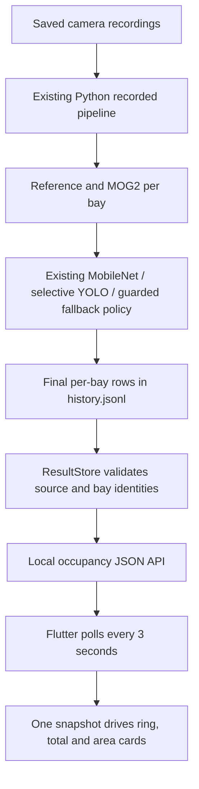
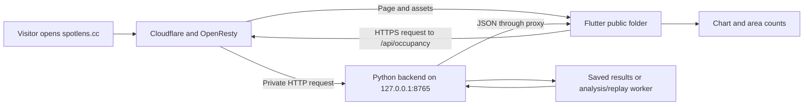

# Spotlens project documentation

Updated **5 October 2026** (Malaysia). This is the single reference for implementation, experiments, deployment, attribution and work history. Installation and IDE entry points are in [README.md](README.md).

## Current operating guide

The visualization version launches from `main.py`; the connected Flutter preview launches with `apps/parking_web/run-web.ps1`. The production policy is OpenCV-first: matching or sole definite Reference/MOG2 evidence settles a bay; opposite definite results request YOLO; two unresolved classic results use MobileNet plus reviewed-empty evidence before selective YOLO. Qualifying YOLO vehicles establish occupied. A valid unresolved result can be provisional occupied, while failed/unusable frames remain unknown. Passing people are not parking occupancy. Current recordings/replay do not establish live availability or independently measured target-site accuracy.

Website capacity is 9 CHAD Camera 1 bays and 69 Overhead bays, from separate periods. The public-host connection was verified on **2 October**, with a separate failed analysis job documented below. That historical observation has not been rechecked as part of this documentation/storage task.

## How to use the consolidated record

- [Decision flow](#doc-opencv-first)
- [Frontend/API integration](#doc-backend-integration)
- [Replay and public-data evaluation](#doc-public-replay-evaluation)
- [Accuracy readiness and limitations](#doc-accuracy-readiness)
- [1Panel browser steps and reasons](#doc-1panel-backend-connect-guide)
- [PKLot external validation](#doc-external-validation)
- [Attribution and licenses](#attribution-and-licenses)
- [Complete earlier work log](#doc-work-log)
- [Changes after consolidation](#consolidated-change-log)

The detailed records retain their original dates, outcomes, examples, source citations and limitations. **Earlier algorithms, demo-only screens, withdrawn audits and old commands are historical**, even where the original document said “current.” Use the operating guide/README for today's entry points and the OpenCV-first section for active decisions. Preservation is not endorsement of obsolete behavior. Source Markdown links now point to sections in this file; artifact links continue to refer to their original files in the full research workspace. Some historical evidence is excluded from the smaller upload package.

<details>
<summary>All migrated documents</summary>

- [OpenCV-first recorded parking estimates](#doc-opencv-first) — former `OPENCV_FIRST.md`
- [Flutter connection to the Python parking system](#doc-backend-integration) — former `BACKEND_INTEGRATION.md`
- [Flutter parking home page](#doc-flutter-ui) — former `FLUTTER_UI.md`
- [Public-data evaluation and replay-first monitor](#doc-public-replay-evaluation) — former `PUBLIC_REPLAY_EVALUATION.md`
- [Parking occupancy accuracy and readiness assessment](#doc-accuracy-readiness) — former `ACCURACY_READINESS.md`
- [Proposal progress and remaining goals](#doc-proposal-progress) — former `PROPOSAL_PROGRESS.md`
- [1Panel backend connection guide for Spotlens](#doc-1panel-backend-connect-guide) — former `1panel backend connect guide.md`
- [Spotlens upload package](#doc-spotlens-package) — former `SPOTLENS_PACKAGE.md`
- [Run the parking test](#doc-quick-start) — former `QUICK_START.md`
- [Occupancy chart and video interface](#doc-interface) — former `INTERFACE.md`
- [Reference + MOG2 comparison for CHAD 1–4](#doc-mog2) — former `MOG2.md`
- [Selective YOLOv8 verification](#doc-yolov8) — former `YOLOV8.md`
- [Guarded vacancy in the recorded parking prototype](#doc-guarded-vacancy) — former `GUARDED_VACANCY.md`
- [Reviewed empty examples (retained calibration material)](#doc-empty-references) — former `EMPTY_REFERENCES.md`
- [Mapped CHAD cameras and vehicle evidence](#doc-camera-mapping) — former `CAMERA_MAPPING.md`
- [Every visible overhead parking bay](#doc-overhead-mapping) — former `OVERHEAD_MAPPING.md`
- [Parking sites, camera views and areas](#doc-parking-areas) — former `PARKING_AREAS.md`
- [Physical bay identity and ten-second summaries](#doc-multicamera) — former `MULTICAMERA.md`
- [Drawing parking bays and handling a neighbour's car at the edge](#doc-bay-drawing-guide) — former `BAY_DRAWING_GUIDE.md`
- [Review or edit a bay](#doc-bay-boundary-review-guide) — former `BAY_BOUNDARY_REVIEW_GUIDE.md`
- [External validation: PKLot UFPR04](#doc-external-validation) — former `EXTERNAL_VALIDATION.md`
- [Four elevated parking-camera recordings](#doc-video-sources) — former `VIDEO_SOURCES.md`
- [Experimental Reference priority comparison](#doc-reference-priority) — former `REFERENCE_PRIORITY.md`
- [Mapping, calibration and YOLO audit from the original version](#doc-mapping-calibration-audit) — former `MAPPING_CALIBRATION_AUDIT.md`
- [Bay-boundary audit and overlap experiment — 24 September 2026](#doc-bay-boundary-audit) — former `BAY_BOUNDARY_AUDIT.md`
- [Per-bay visual audit — 24 September 2026](#doc-bay-boundary-per-bay) — former `BAY_BOUNDARY_PER_BAY.md`
- [Quick check: why bays remain unresolved](#doc-unresolved-check) — former `UNRESOLVED_CHECK.md`
- [Final decisions must be supported by the displayed methods](#doc-decision-fix) — former `DECISION_FIX.md`
- [Final recorded parking estimates](#doc-final-results) — former `FINAL_RESULTS.md`
- [Prototype validation results](#doc-validation) — former `VALIDATION.md`
- [Troubleshooting](#doc-troubleshooting) — former `TROUBLESHOOTING.md`
- [AI Consultation Log](#doc-ai-consultation-log) — former `AI_CONSULTATION_LOG.md`
- [Next implementation prompt: bay-boundary audit and overlap-aware guarded vacancy](#doc-edge-overlap-and-bay-audit-prompt) — former `EDGE_OVERLAP_AND_BAY_AUDIT_PROMPT.md`
- [Parking occupancy prototype](#doc-readme) — former `README.md`
- [Parking home page](#doc-apps-parking-web-readme) — former `apps/parking_web/README.md`
- [Spotlens website package](#doc-scripts-spotlens-readme) — former `scripts/spotlens/README.md`
- [1Panel: make spotlens.cc show backend data](#doc-scripts-spotlens-deploy-1panel-setup) — former `scripts/spotlens/deploy/1PANEL_SETUP.md`
- [spotlens.cc: verified 1Panel setup](#doc-scripts-spotlens-deploy-1panel-spotlens-cc) — former `scripts/spotlens/deploy/1PANEL_SPOTLENS_CC.md`
- [Connect spotlens.cc to its Python backend](#doc-scripts-spotlens-deploy-backend-setup) — former `scripts/spotlens/deploy/BACKEND_SETUP.md`
- [Parking home page](#doc-spotlens-apps-parking-web-readme) — former `spotlens/apps/parking_web/README.md`
- [Parking occupancy accuracy and readiness assessment](#doc-spotlens-docs-accuracy-readiness) — former `spotlens/docs/ACCURACY_READINESS.md`
- [Flutter connection to the Python parking system](#doc-spotlens-docs-backend-integration) — former `spotlens/docs/BACKEND_INTEGRATION.md`
- [Reviewed empty examples (retained calibration material)](#doc-spotlens-docs-empty-references) — former `spotlens/docs/EMPTY_REFERENCES.md`
- [Reference + MOG2 comparison for CHAD 1–4](#doc-spotlens-docs-mog2) — former `spotlens/docs/MOG2.md`
- [Every visible overhead parking bay](#doc-spotlens-docs-overhead-mapping) — former `spotlens/docs/OVERHEAD_MAPPING.md`
- [Public-data evaluation and replay-first monitor](#doc-spotlens-docs-public-replay-evaluation) — former `spotlens/docs/PUBLIC_REPLAY_EVALUATION.md`
- [Four elevated parking-camera recordings](#doc-spotlens-docs-video-sources) — former `spotlens/docs/VIDEO_SOURCES.md`
- [Parking prototype work log](#doc-spotlens-docs-work-log) — former `spotlens/docs/WORK_LOG.md`
- [Selective YOLOv8 verification](#doc-spotlens-docs-yolov8) — former `spotlens/docs/YOLOV8.md`
- [MobileNet-SSD model attribution](#doc-spotlens-third-party-mobilenet-ssd) — former `spotlens/third_party/MOBILENET-SSD.md`
- [Overhead demonstration video provenance](#doc-spotlens-third-party-overhead-source) — former `spotlens/third_party/OVERHEAD-SOURCE.md`
- [YOLOv8s model provenance and conversion](#doc-spotlens-third-party-yolov8-sources) — former `spotlens/third_party/YOLOV8-SOURCES.md`
- [MobileNet-SSD model attribution](#doc-third-party-mobilenet-ssd) — former `third_party/MOBILENET-SSD.md`
- [Parked motorcycle regression photograph](#doc-third-party-motorcycle-regression) — former `third_party/MOTORCYCLE_REGRESSION.md`
- [Overhead demonstration video provenance](#doc-third-party-overhead-source) — former `third_party/OVERHEAD-SOURCE.md`
- [PKLot dataset attribution](#doc-third-party-pklot-license) — former `third_party/PKLOT-LICENSE.md`
- [YOLOv8s model provenance and conversion](#doc-third-party-yolov8-sources) — former `third_party/YOLOV8-SOURCES.md`
- [Parking prototype work log](#doc-work-log) — former `WORK_LOG.md`

</details>

<a id="doc-opencv-first"></a>

## OpenCV-first recorded parking estimates

Former document: `OPENCV_FIRST.md`. Historical source wording is preserved below with navigable headings and relocated links.

<!-- BEGIN DOCUMENT: OPENCV_FIRST.md -->
<a id="doc-opencv-first--opencv-first-recorded-parking-estimates"></a>
### OpenCV-first recorded parking estimates

The normal popup now shows **Reference, MOG2, MobileNet + empty, YOLOv8, and Final** for each mapped bay. The older MobileNet-SSD model is loaded locally through OpenCV DNN. Its reviewed-empty appearance result is displayed under MobileNet, not misreported as a calibrated Reference classification. YOLOv8 is requested for a bay only when all three OpenCV routes are unresolved or when definite Reference and MOG2 results conflict. A full-frame YOLO pass may still run when another bay in the same frame needs verification.

<a id="doc-opencv-first--decision-flow-for-each-bay"></a>
#### Decision flow for each bay

The program samples each recording every three video seconds. It analyzes the same sample with the calibrated empty-image **Reference** comparison, the **MOG2** foreground model, and the local **MobileNet-SSD + reviewed-empty** route. Reference compares the bay image with its reviewed empty image and uses calibrated vacant/occupied score boundaries; a score between boundaries is uncertain, and missing valid calibration is unknown. MOG2 measures foreground in the bay against its own calibrated boundaries; a boundary gap, missing calibration, or restabilization can leave it uncertain. MobileNet detects and assigns vehicles to bay polygons; where no vehicle overlaps ambiguously, a close match to a reviewed empty appearance can instead establish vacancy. No vehicle detection by itself does **not** establish vacancy.

```mermaid
flowchart TD
    A[Valid sampled frame: Reference, MOG2, MobileNet + empty] --> B{Reference and MOG2 definite?}
    B -->|Same state| C[Final = their shared state; skip YOLO for this bay]
    B -->|Opposite states| D[Request YOLO for this bay]
    B -->|Only one definite| E[Final = that definite state; skip YOLO for this bay]
    B -->|Neither definite| F{MobileNet + empty definite?}
    F -->|Yes| G[Final = MobileNet occupied or reviewed-empty vacant; skip YOLO]
    F -->|No| D
    D --> H{Qualifying YOLO vehicle in this bay?}
    H -->|Yes| I[Final = occupied; source YOLO]
    H -->|No, classic methods conflict| J[Final = Reference state; record conflict and YOLO outcome]
    H -->|No, all OpenCV unresolved| K{Eligible reviewed-empty guard: three clean samples?}
    K -->|Yes| L[Final = vacant; source reviewed-empty guard]
    K -->|No, valid frame and successful YOLO pass| M[Final = OCCUPIED (P); provisional]
    K -->|No, frame or model unusable| N[Final = unknown]
```

YOLO keeps its existing vehicle confidence and bay-association checks. A full-frame model pass may be needed when **any** bay requests it, but its detections cannot change another bay already resolved by OpenCV. A YOLO non-detection is not evidence of vacancy. The guarded vacancy branch requires a reviewed empty match and three consecutive clean observations; the old no-reference provisional vacancy route is disabled in normal OpenCV-first runs.

<a id="doc-opencv-first--why-the-camera-can-show-uncertain-boxes-while-the-overview-says-occupied"></a>
#### Why the camera can show uncertain boxes while the overview says occupied

The **Reference, MOG2, MobileNet, and YOLOv8 columns are separate method outputs**; an uncertain result in one column does not mean Final is uncertain. Another method may be definite. If all methods fail to decide on a valid sample, the user-selected occupied fallback makes Final **OCCUPIED (P)**. This is a conservative availability assumption, **not** a confirmed vehicle or a measured accuracy improvement. It contributes to the occupied count but remains separately counted as provisional. If the frame or verification is unusable, Final stays **unknown** instead of guessing.

In the popup's **Watch video** view, the bay outline reflects **Final**, not the Reference column. A provisional occupied outline is amber and carries `O(P)`; its color can look like an uncertain outline at a glance. Check the **Final estimate** column and click the bay to read its exact source and reason. If viewing a separately saved Reference or MOG2 image, its uncertain boxes are that method's raw result and may legitimately differ from Final. The overview chart, areas, Watch video outlines, ten-second summaries, and saved Final rows use the same Final decision. Camera footage between three-second samples retains the most recent sampled estimate, so a momentary view can also differ from the last analysis frame.

Final uses matching Reference/MOG2 results first, then either definite classic result, then MobileNet for two unresolved classic results. A Reference/MOG2 conflict requests YOLO; a qualifying vehicle means occupied, otherwise Reference wins. For all-OpenCV-unresolved bays, a qualifying YOLO vehicle means occupied; a reviewed-empty three-sample guard can still establish vacancy. With a valid frame and successful YOLO pass but no definite result, Final is **OCCUPIED (P)**: a provisional occupied guess, counted as occupied and shown separately in the popup, areas, video, ten-second reports and saved rows. Failed or unusable frames remain unknown. The former no-reference provisional vacancy route is disabled under this policy.

The 24 September B08 curb-edge geometry and active alignment/overlap diagnostics were rolled back to the pre-audit preset. Saved audit evidence remains available under `runs/verification/bay-boundary-audit/`; that geometry is historical, not the normal Run preset. Other preset polygons, IDs, model weights and detection thresholds were not changed.

The full replay report is [report.json](runs/verification/opencv-first/report.json), and the [GUI check](runs/verification/opencv-first/interface/result.json) loads its saved results without inference. Across 1,088 sampled bay observations, the previous Final was **582 occupied / 221 vacant / 285 uncertain / 0 unknown**. OpenCV-first produced **684 occupied / 404 vacant / 0 uncertain / 0 unknown**, including **96 provisional occupied** observations. YOLO requests fell from **987 to 573** bay observations, including **262 to 15** across Camera 1's four recordings. These are repeated observations, not unique bays or independent accuracy trials. Reference and MOG2 states match the saved baseline for every paired frame.

**Known limitation:** B08/CHAD-P008 in `chad-4` at 15 seconds is marked vacant by MobileNet's reviewed-empty route even though a pedestrian partly obscures the bay. The old MobileNet model did not detect that person; the empty score remains below the fitted limit. This is an **unsafe vacancy claim under occlusion**. The visual review labels the underlying occupancy *unknown*, so it is not a confirmed occupied-to-vacant error for a binary accuracy calculation. Do not interpret zero uncertain results as validated accuracy. Independent labelled frames, particularly pedestrians, shadows, small vehicles and neighbour spill, are needed before making an accuracy claim. See [ACCURACY_READINESS.md](#doc-accuracy-readiness).

<a id="doc-opencv-first--processing-time-and-live-use-scope"></a>
#### Processing time and live-use scope

The current popup is a **recorded-video review application**. It completes all selected recordings' analysis before enabling playback; the Live camera tab is a viewer and does not yet run this occupancy pipeline on incoming frames. That full-recording wait is an application workflow choice, **not** the time needed to analyze one new camera frame. A true live version would need to capture and analyze frames continuously, update the display as results arrive, and handle frames that are late or unavailable.

The following are measured **per sampled frame, not per bay**, from the local OpenCV-first run at `runs/areas/20260924T195956_624775Z`. It contains 50 CHAD frame analyses (39 Camera 1, 5 Camera 2, 4 Camera 3, 2 Camera 4) and 10 overhead frame analyses, at three-video-second intervals. These are observed desktop timings, not a live-camera benchmark or a guaranteed frame rate. Medians and 95th-percentile sample values are rounded to milliseconds.

| Stage | CHAD median / p95 | Overhead median / p95 | Scope |
| --- | ---: | ---: | --- |
| Video frame decode | 120 / 171 ms | 92 / 108 ms | Local MP4 retrieval; live camera capture/network cost would differ |
| Reference | 32 / 43 ms | 25 / 27 ms | Includes frame validation/alignment and empty-image comparison |
| MOG2 | 11 / 15 ms | 23 / 31 ms | Foreground model and per-bay scoring |
| MobileNet + empty match | 87 / 104 ms | 83 / 88 ms | Detector plus reviewed-empty comparison and bay assignment |
| YOLOv8 **when requested** | 182 / 275 ms (11 frames) | 209 / 263 ms (10 frames) | Entire selective verification branch; skipped calls excluded |
| YOLOv8 model inference within requested calls | 182 / 275 ms | 195 / 250 ms | Inference only; overhead branch also has association work |

Adding local video decode to the saved Final branch's summed method times gives an **approximate** median per-frame processing cost of **241 ms** for Camera 1 frames without YOLO (28 frames), **431 ms** for Camera 1 frames with YOLO (11 frames), and **437 ms** for overhead frames (all 10 requested YOLO). These estimates exclude popup rendering, file/report writing, model startup, calibration, and any live-camera capture or network delay. They should not be read as independently measured end-to-end live latency. The current sampling interval is three video seconds, so these per-frame measurements alone do not make the existing popup a live occupancy monitor.
<!-- END DOCUMENT: OPENCV_FIRST.md -->

---

<a id="doc-backend-integration"></a>

## Flutter connection to the Python parking system

Former document: `BACKEND_INTEGRATION.md`. Historical source wording is preserved below with navigable headings and relocated links.

<!-- BEGIN DOCUMENT: BACKEND_INTEGRATION.md -->
<a id="doc-backend-integration--flutter-connection-to-the-python-parking-system"></a>
### Flutter connection to the Python parking system

**2 October packaging:** `spotlens/` contains the compiled Flutter website, editable source, Python API/inference, required models, recordings, reference caches and saved overview results. It includes a Python/Docker hosting entry point with explicit public origin configuration. See [SPOTLENS_PACKAGE.md](#doc-spotlens-package) and `spotlens/README.md`. This is a local upload package; no remote deployment was performed. Static-only hosting cannot run the detection API.

Implemented 27 September 2026 (Malaysia local time).

<a id="doc-backend-integration--what-is-connected"></a>
#### What is connected

The Flutter home page now reads actual per-bay **Final** decisions from the existing Python OpenCV-first pipeline. The default app no longer uses the 52/78 demo fixture. Opening the page reads saved results immediately; it does not wait for model loading or a complete video replay. A local Python server serves both the compiled Flutter assets and a JSON API. Flutter polls the API every three seconds.

**This is recorded analysis, not live parking availability.** CHAD and Overhead recordings represent separate periods, and original camera capture times are not supplied. The page explicitly labels recorded results, shows each recording position and analysis time, and explains that combined counts are not simultaneous live observations. A recent analysis timestamp means the file was processed recently; it does not mean the recording is recent.

CHAD uses the nine mapped Camera 1 bays, with a selector for recordings 1–4. Overhead uses its 69 mapped bays. Other CHAD camera views are excluded because their correspondence overlaps or remains unverified; summing them would create false capacity. The total capacity is 78 mapped bays, not a claim about the entire physical CHAD site.

<a id="doc-backend-integration--running-the-connected-website"></a>
#### Running the connected website

From the repository root in PowerShell, with the existing `.venv` and installed Flutter SDK:

```powershell
./apps/parking_web/run-web.ps1
```

This builds Flutter and starts the website/API at `http://127.0.0.1:8765/`. To reuse a current build:

```powershell
./apps/parking_web/run-web.ps1 -SkipBuild
# Optional separate port:
./apps/parking_web/run-web.ps1 -SkipBuild -Port 8766
```

Equivalent server command:

```powershell
./.venv/Scripts/python.exe -m parking_probe.web_server --port 8765
```

Leave the terminal running; Ctrl+C stops it. The server binds only to loopback, serves assets only from `apps/parking_web/build/web`, and does not expose the repository or camera URLs. This is a local application host, not a public production deployment. A plain static file server or `flutter run -d web-server` does not supply the API. The Python popup remains separately launched by `main.py`.

Click **Run new analysis** to run the established recorded inference pipeline in a background worker. The server accepts one job at a time; the website stays responsive and displays progress. It analyzes the four Camera 1 recordings and Overhead at three-second sample intervals, using the same reference preparation, MOG2 calibration, MobileNet empty evidence, YOLO thresholds/profiles and OpenCV-first decision policy as the popup. Latest completed samples appear while processing continues. CHAD and Overhead can therefore temporarily show different run IDs/times; they are explicitly independent recorded samples. The initial model/reference preparation may still take time. Existing cached recordings/models are used; the existing acquisition helpers can fetch missing pinned inputs. Do not run multiple inference hosts against the shared prepared-data directory concurrently.

<a id="doc-backend-integration--ide-preview-reminder--28-september-2026"></a>
#### IDE preview reminder — 28 September 2026

In VS Code, open the outer `Capstone Project Implementation` folder and use **Terminal → New Terminal** with PowerShell. Run `./apps/parking_web/run-web.ps1 -SkipBuild`, then open `http://127.0.0.1:8765/`. Keep that terminal running; Ctrl+C stops the host. Remove `-SkipBuild` after Flutter source changes to rebuild first. Add `-Port 8766` if the current preview already uses 8765, and open the matching URL.

The existing VS Code F5 configuration launches `main.py` (the Python popup), not Flutter. The script serves a compiled preview with the backend; it is not a hot-reload development session. See [PROPOSAL_PROGRESS.md](#doc-proposal-progress) for the proposal comparison and the full IDE commands.

<a id="doc-backend-integration--data-flow-and-decision-semantics"></a>
#### Data flow and decision semantics



No decision thresholds, bay polygons, or inference decision rules were changed for this connection. See [OPENCV_FIRST.md](#doc-opencv-first) for the exact per-bay order and guarded fallback. `occupied (P)` is included in occupied totals and visibly identified as provisional. Any provisional vacancy remains separately identifiable. Available spaces are counted from **vacant Final states**, never `capacity - occupied` when unknown/uncertain states exist. Unknown and uncertain segments are gray in the ring and area indicators and are labelled unresolved.

The adapter checks recording/frame/camera identity, physical bay membership, duplicate rows and supported states. Missing bays become unknown. A stale, failed, or misaligned recorded frame has no definite counts. A malformed latest compatible sample becomes unknown rather than silently reviving an older successful sample. Incomplete trailing JSONL writes are ignored until complete. Results using earlier decision policies are excluded. Per-file revision caching avoids repeatedly parsing unchanged history files.

The frontend validates state totals and provenance, discards an out-of-order response after a recording switch, and rejects a response for the wrong requested recording. On connection or response validation failure it hides numeric availability, displays an unavailable message and retry action, and automatically retries on the polling interval. It never falls back to fabricated demo values. Existing saved results retained after an analysis-start failure remain explicitly historical with their original timestamps.

<a id="doc-backend-integration--api-contract"></a>
#### API contract

- `GET /api/occupancy?chad=chad-1`: selected CHAD recording plus Overhead. Allowed selection: `chad-1` through `chad-4`. Invalid selection returns 400; result-read failure returns 503.
- Response: `schema_version: 1`, `mode: recorded`, `live_availability: false`, `basis`, `served_at`, `chad_recording`, available selection IDs, `areas`, `totals`, and `analysis` job state/message.
- Each area contains `capacity`, `occupied`, `vacant`, `uncertain`, `unknown`, `provisional_occupied`, `provisional_vacant`, `has_sample`, optional `issue`, and `source` with run/recording/frame IDs, sample seconds, processing timestamp, and decision-policy identifier. `bays` retains each bay's state, provisional flag, decision source and reason.
- Totals are recomputed from those bay states and checked by the frontend against the area aggregates. Provisional counts are subsets, not additional bays.
- `POST /api/analysis` requires `X-Parking-Client: web` and an absent or matching local Origin. Returns 202 when started or 409 for an already running job. These guards prevent arbitrary websites from initiating inference; this is not a remote authentication system.
- JSON responses use `Cache-Control: no-store`. Job state is process-local; completed run artifacts remain on disk when the server restarts.

<a id="doc-backend-integration--implementation-files"></a>
#### Implementation files

- `src/parking_probe/web_server.py`: local HTTP host, validated recorded-result store, background job adapter.
- `apps/parking_web/lib/data/parking_api.dart`: HTTP client, polling, request ordering and error state.
- `apps/parking_web/lib/data/parking_snapshot.dart`: typed backend counts, validation and explicitly injected demo fixtures.
- `apps/parking_web/lib/backend_home.dart`: connection status, recording selection, analysis and retry actions.
- `home_page.dart`, `widgets/occupancy_ring.dart`, `widgets/area_card.dart`: consistent recorded/provisional/unresolved presentation and timestamps.
- `run-web.ps1`: build and serve the connected application. The only added Dart runtime package is `http`; no Python runtime package was added.

<a id="doc-backend-integration--verification-and-recorded-evidence"></a>
#### Verification and recorded evidence

A fresh analysis was initiated through the HTTP API and completed successfully in `runs/areas/20260926T174542_362312Z` (UTC run identifier). Every API count was checked against its per-bay Final records. Latest results:

| CHAD selection | CHAD occupied / vacant / occupied P | Overhead occupied / vacant / occupied P | Combined occupied / 78 | Combined vacant |
| --- | --- | --- | ---: | ---: |
| Recording 1, 27 s | 2 / 7 / 0 | 54 / 15 / 6 at 27 s | 56 | 22 |
| Recording 2, 30 s | 2 / 7 / 0 | 54 / 15 / 6 at 27 s | 56 | 22 |
| Recording 3, 18 s | 3 / 6 / 1 | 54 / 15 / 6 at 27 s | 57 | 21 |
| Recording 4, 30 s | 2 / 7 / 0 | 54 / 15 / 6 at 27 s | 56 | 22 |

All these latest samples have zero unresolved bays. Their counts match the earlier saved run. **The pedestrian-obstructed B08 sample in chad-4 at 15 seconds still returns vacant via `mobilenet_reviewed_empty`.** No parked vehicle is established there; the user explicitly chose to preserve that passing-person behavior. Its visual-review label was indeterminate, so it is not a confirmed binary false-vacant error. Integration correctness does not establish occupancy accuracy. See [ACCURACY_READINESS.md](#doc-accuracy-readiness).

Evidence: `runs/verification/flutter-backend/chad-1-response.json` through `chad-4-response.json` and `verification.json`. The API includes provenance and bay reasons for inspection; the driver home page shows compact recording/time and provisional summaries.

Checks: 13 new Python API/store/job tests plus the 16 existing OpenCV-first tests passed (29 total). Flutter analysis reported no issues and 27 model/widget tests passed, including backend counts, invalid payloads, request ordering, failure/recovery, analysis POST behavior, desktop/tablet/phone layouts, keyboard actions, reduced motion, and enlarged text. Tests caught and fixed header overflow at 200% text. Build and browser inspection details are recorded in WORK_LOG.md.

<a id="doc-backend-integration--future-live-integration-boundary"></a>
#### Future live integration boundary

A live service must acquire an authorized camera feed, process the latest frame continuously without a queued replay, preserve frame-age/error semantics and physical bay identity, and publish timestamped per-bay Final results. The current popup Live camera tab is a viewer and does not provide that service. Do not relabel recorded mode as live or treat polling saved files as a live feed. A future API version can provide live mode only when those requirements are implemented and verified.

<a id="doc-backend-integration--29-september-replay-simulation-extension"></a>
#### 29 September replay simulation extension

The connected website now also offers **Open replay demo**. This is a separate route from the combined recorded overview above. `POST /api/replay/start` selects exactly one of `chad-1`…`chad-4` or `overhead-1`; the body is `{"source_id":"chad-1"}` and the existing same-origin `X-Parking-Client: web` guard applies. `GET /api/replay` returns the latest paced one-frame result, and `POST /api/replay/stop` ends the session. The response always has `mode: replay`, `simulation: true`, and `live_availability: false`. No separate-period sources are combined into a simultaneous count.

Each bay has raw Final, candidate state/streak, confirmed state, source/reason, provisional flag, freshness age and advertised availability. Three consecutive valid observations confirm a change; an initial possible occupied result blocks a previously vacant bay immediately. Invalid frames do not confirm. Ten seconds after the last valid observation, a bay is stale/unavailable. Original capture time is explicitly unknown; source time is the historical video position and local processing time is separate. SQLite `runs/replay/events.sqlite3` persists event/status history, but a restarted server does not revive stale vacancies. Flutter validates displayed counts against all returned bay rows, and shows provisional/stale labels. Start/stop errors and connection loss do not turn into demo or live data.

The worker uses the same per-frame OpenCV-first production pipeline as the recorded analysis job, with a three-second wall-clock replay target and immediate publication after each processed frame. It processes one historical frame sequentially; this is not a separate live camera sending frames. Reference, MOG2 and MobileNet evidence are processed for a sample, while YOLO is selectively requested. Three seconds is not a proven worst-case processing bound: an overdue sample tick is skipped instead of building a backlog. Loading models/calibration before frame 0 still takes time; the measured CHAD smoke run reached its first result at 43.8 seconds under concurrent archive/test load and 9.92 seconds on a later unloaded local HTTP run. A longer intended-hardware latency and failure study remains necessary. The Flutter replay page is also directly reachable at `http://127.0.0.1:8765/#/replay`. See [PUBLIC_REPLAY_EVALUATION.md](#doc-public-replay-evaluation) for dataset provenance, comparison results, exact API/status semantics, tests and limitations.

<a id="doc-backend-integration--2-october-public-host-deployment-follow-up"></a>
#### 2 October public-host deployment follow-up

The packaged frontend at `https://spotlens.cc/` was reachable, but public occupancy/replay API requests returned OpenResty HTML/404. The authenticated 1Panel session confirmed a complete upload at `/opt/1panel/www/sites/spotlens/index/spotlens`, a host-network OpenResty container, Run Directory `/spotlens/public`, and no reverse proxy rules. Prepared a new Spotlens Compose **Edit** form with the absolute package build context and a loopback-only API listener. Build/start approval and a preserving `/api/` proxy are still pending; form preparation does not verify remote operation. See [the exact server steps](#doc-scripts-spotlens-deploy-1panel-spotlens-cc). This deployment work changes no inference rule or live-data claim.

The user subsequently completed the setup. Public GET checks now return HTTP 200/JSON for both occupancy and replay, and 1Panel shows a running backend and an enabled `/api/` proxy preserving the URI and forwarding Host `spotlens.cc`. The returned 78-bay totals are 56 occupied / 22 vacant, with six provisional occupied; replay is idle and `live_availability` remains false. A recent new-analysis job reports failed, with recent CHAD results and older packaged Overhead results. Connectivity is verified; full job completion and the exception cause are not. The browser helper stopped before its error log could be read. The requested [1Panel backend connection guide](#doc-1panel-backend-connect-guide) records every setup/review step, reasons, evidence and the mounted-volume error-log path.
<!-- END DOCUMENT: BACKEND_INTEGRATION.md -->

---

<a id="doc-flutter-ui"></a>

## Flutter parking home page

Former document: `FLUTTER_UI.md`. Historical source wording is preserved below with navigable headings and relocated links.

<!-- BEGIN DOCUMENT: FLUTTER_UI.md -->
<a id="doc-flutter-ui--flutter-parking-home-page"></a>
### Flutter parking home page

**29 September extension:** The default home page now uses recorded Python results, and the new **Open replay demo** action shows one paced historical recording with bay-level candidate, confirmed, provisional and stale states. Replay counts come from the separate `/api/replay` response and are always labelled simulation. See [BACKEND_INTEGRATION.md](#doc-backend-integration) and [PUBLIC_REPLAY_EVALUATION.md](#doc-public-replay-evaluation). The original demo design/verification notes below describe the first UI milestone and remain as historical design evidence.

<a id="doc-flutter-ui--current-status--27-september-2026"></a>
#### Current status — 27 September 2026

The home page is now connected to actual Python **recorded** Final results. The default demo is replaced by an API client, a recording selector, background analysis action, provisional/unknown states and source timestamps. It remains explicitly **not live availability**. Use `./apps/parking_web/run-web.ps1` from the repository root to build and serve both frontend and API; add `-SkipBuild` to reuse the build. A standalone Flutter development/static server no longer supplies all required functionality. See [BACKEND_INTEGRATION.md](#doc-backend-integration) for the current commands, architecture, counts, verification and future live boundary.

The following sections preserve the original 26 September UI design and demo-stage record for the paper. Their standalone launch instructions and future-integration wording describe that earlier stage.

<a id="doc-flutter-ui--original-purpose-and-scope"></a>
#### Original purpose and scope

Implemented on 26 September 2026 in `apps/parking_web/` with Flutter 3.44.6 / Dart 3.12.2. This is a new driver-facing, responsive website, designed independently of the Python prototype's popup. It is a home-page preview with deterministic **demo data**, not a live occupancy system. Opening it does not start video analysis, load detection models, or read the PKLot dataset.

The design combines warm white surfaces, navy text, blue actions and occupancy arcs, and mint/green availability indicators. Locally bundled Manrope typography, rounded cards, subtle shadows, and decorative parking illustrations provide a consistent visual style. The illustrations are schematic decorations, not site maps or representations of individual bays. The Google Fonts Manrope source is distributed under the SIL Open Font License in `assets/fonts/OFL.txt`.

<a id="doc-flutter-ui--data-and-behavior"></a>
#### Data and behavior

| Area | Total spaces | Occupied | Available |
| --- | ---: | ---: | ---: |
| CHAD | 9 | 7 | 2 |
| Overhead | 69 | 45 | 24 |
| **Combined demo** | **78** | **52** | **26** |

The circular chart, headline availability count, legend, and area cards derive from the same snapshot. The chart displays **52 / 78 occupied**, approximately **67% full**. Area cards display **2 spaces left | 7/9 occupied** and **24 spaces left | 45/69 occupied**. These are chosen example values, not measured results or synchronized camera observations.

The **Demo data** button explains the preview. **View parking areas** scrolls to the area section and transfers keyboard focus to its heading. There are no placeholder links, automatic count changes, or simulated live indicators. Empty and fully occupied examples render correctly; zero capacity uses a neutral ring and explicit configuration text.

<a id="doc-flutter-ui--layout-animation-and-accessibility"></a>
#### Layout, animation, and accessibility

- The main content is centered with a maximum outer width of 1,176 logical pixels. Cards sit side by side when the available content width is at least 680 pixels and stack on smaller screens or at large text sizes. The main overview changes to a vertical layout below 680 pixels of card width, placing the circular chart first on phones.
- The circular arc and numeric counters share a 650 ms entrance animation. Cards enter with a short stagger and respond subtly to pointer hover. The scroll action takes 450 ms.
- The operating system/browser reduced-motion preference is respected through Flutter's accessibility settings: entrance, hover, and scroll animation are disabled.
- The chart has a screen-reader summary; area labels express counts without relying on color. Buttons support keyboard focus and activation, and interactive targets are at least 48 logical pixels. The interface adapts to enlarged text.

<a id="doc-flutter-ui--run-and-build"></a>
#### Run and build

From a PowerShell terminal in the project root:

```powershell
cd apps/parking_web
flutter pub get
flutter run -d web-server --web-hostname 127.0.0.1 --web-port 8765
```

Then open `http://127.0.0.1:8765` in a browser. Alternatively run `apps/parking_web/run-web.ps1`. If another preview already uses that port, stop that preview or pass another port to the script. The Python application's `main.py` continues to launch its existing popup; it does not launch this website.

```powershell
flutter analyze
flutter test
flutter build web --no-web-resources-cdn
```

The production website is in `apps/parking_web/build/web/`. Serve that directory over HTTP rather than opening `index.html` directly. The build bundles Flutter's web engine locally; Manrope is also a local asset. The Flutter SDK and package versions are recorded in the project metadata and lockfile. No production runtime dependency beyond Flutter was added.

<a id="doc-flutter-ui--implementation-structure-and-future-integration"></a>
#### Implementation structure and future integration

- `lib/data/parking_snapshot.dart`: typed demo areas and aggregate calculations.
- `lib/home_page.dart`: responsive home page, navigation within the page, demo explanation, and entrance motion.
- `lib/widgets/occupancy_ring.dart` and `area_card.dart`: reusable visualization components and decorative illustrations.
- `lib/theme.dart`: shared colors, typeface, and button styling; `lib/main.dart`: application entry point.

Replace the demo snapshot with an explicit data service in a later integration. A live data model must account for unknown/stale frames, provisional occupancy, timestamps, and physical bay identity before combining camera results. The demo's `available = capacity - occupied` assumes every sample bay has a complete known state and must not be applied blindly to unresolved live bays. This first version makes no changes to Reference, MOG2, MobileNet, YOLOv8, Python dependencies, or existing replay results.

<a id="doc-flutter-ui--verification"></a>
#### Verification

The implementation includes 14 model/widget checks: derived totals, empty/full/zero capacity, chart/card agreement, layouts at 1,440 / 768 / 390 / 320 logical pixels, area scrolling and focus, keyboard dialog operation, reduced motion, 200% text at phone width, chart semantics, text contrast, and labelled 48-pixel tap targets. All 14 passed. Initial testing found an invalid textual progress-bar semantics value under Flutter 3.44; it was corrected to a numeric value before delivery.

Final validation: `flutter analyze --no-pub` reported no issues, all 14 tests passed, and `flutter build web --no-web-resources-cdn` succeeded. The build emitted an optional Cupertino font warning; the app uses Material icons, and its visible icons rendered correctly in the browser review.

Inspected the running production build at desktop (1,440 pixels), tablet (768 pixels), and phone (390 pixels) widths. Confirmed the keyboard-operated demo dialog, its Escape dismissal, the phone scroll action and destination focus, and the screen-reader counts in the browser accessibility tree. No browser warning/error logs were reported. Reduced motion and 200% text were checked in widget tests. Saved [desktop preview](runs/verification/flutter-ui/desktop.png) and [phone area cards](runs/verification/flutter-ui/phone-areas.png).
<!-- END DOCUMENT: FLUTTER_UI.md -->

---

<a id="doc-public-replay-evaluation"></a>

## Public-data evaluation and replay-first monitor

Former document: `PUBLIC_REPLAY_EVALUATION.md`. Historical source wording is preserved below with navigable headings and relocated links.

<!-- BEGIN DOCUMENT: PUBLIC_REPLAY_EVALUATION.md -->
<a id="doc-public-replay-evaluation--public-data-evaluation-and-replay-first-monitor"></a>
### Public-data evaluation and replay-first monitor

**Implemented 29 September 2026.** The production decision order remains OpenCV Reference → MOG2 → MobileNet reviewed-empty/vehicle evidence → selective YOLOv8, per bay. A passing pedestrian does not itself occupy a bay. Cars, vans, trucks, buses and motorcycles count when parked inside mapped geometry. No blanket pedestrian visibility veto or detector threshold change was made. `OCCUPIED (P)` remains visibly provisional.

<a id="doc-public-replay-evaluation--additional-public-evidence-and-provenance"></a>
#### Additional public evidence and provenance

The cached original [PKLot archive](https://web.inf.ufpr.br/vri/databases/parking-lot-database/) was verified against SHA-256 `e89bbc1dc735298c478688d50c7a682fb3b0076a87b6634923132709f2d2fa9b` (4,898,276,304 bytes). It came from the pinned [mirror revision](https://huggingface.co/datasets/teenygrad/pklot/tree/9604b05ad6dfd5ab5817b5fa6600d375754562fb). The source permits research with attribution to Almeida et al., *PKLot – A robust dataset for parking lot classification*, Expert Systems with Applications 42(11):4937–4949 (2015), and is [CC BY 4.0](https://creativecommons.org/licenses/by/4.0/). The importer extracts only original 1280×720 JPEGs and matching XML, hashes every member, validates bay polygons, and keeps the frozen UFPR04 experiment untouched. UFPR05 is another view of the UFPR lot; **PUCPR is a different physical lot**. Neither is CHAD/Overhead ground truth.

The deterministic seed is `20260922`. Whole dates are assigned to setup/fit, calibration, and untouched test partitions separately for each view. The same date and adjacent frames cannot cross partitions. The original XML truth is retained; missing labels are excluded.

| View | Bays at most | Setup/fit frames | Calibration frames | Test frames | Paired originals | XML/image issue |
| --- | ---: | ---: | ---: | ---: | ---: | --- |
| UFPR05 | 40 | 2,346 | 1,023 | 730 | 4,099 | None |
| PUCPR | 100 | 2,688 | 766 | 874 | 4,328 | One JPEG without XML, excluded |

The orphan is `PUCPR/Sunny/2012-11-06/2012-11-06_18_48_46.jpg`. Exact days, frame identities, original JPEG/XML hashes, slot polygons and labels are in ignored local manifests `data/pklot/ufpr05-split.json`, `data/pklot/pucpr-split.json`, and `data/pklot/additional-summary.json`. The extraction receipt records all member hashes. Reproduce with `.\.venv\Scripts\python.exe checks/prepare_public_pklot.py --view both` from the project root. It verifies the complete archive and extracted cache, so a repeat can take time.

The two new extracted views occupy **2,820,280,723 bytes** locally, in addition to the 4.90 GB archive and existing UFPR04 extraction. They are research data under ignored `data/pklot/`, not Flutter runtime assets; normal website/replay operation does not read these new files.

[CNRPark+EXT](https://cnrpark.it/) is a useful second-site image benchmark: its authors publish full images, bay boxes/patch labels, varied weather and viewpoints, and an ODbL 1.0 license. It has spaced images rather than continuous video; it can test per-image occupancy transfer but cannot measure three-second replay timing or arrival/departure latency. No CNRPark files or mixed-license MetaPKLot collection were downloaded in this release. The [Zenodo smart-city record](https://zenodo.org/records/10663664) lists a 150.3 MB parking clip, but the record/API does not state a license and a preview did not establish stable mappable bays. It was not ingested or republished. The public [university camera viewer](https://sc.edu/about/offices_and_divisions/parking/parking/information/garages_and_lots/cameras.php) also does not establish automated polling/reuse permission. The service therefore has no third-party live-camera ingestion.

<a id="doc-public-replay-evaluation--real-personmotorcycle-regression"></a>
#### Real person/motorcycle regression

At `chad-4` 15 seconds, the B08 pedestrian sample produced no MobileNet `motorbike` or YOLO `motorcycle` detection. The same saved sample remains `vacant` through `mobilenet_reviewed_empty`; full YOLO-only is unresolved for B08. The 30-second B08 sample also had no YOLO motorcycle detection. The `chad-4` pedestrian frames have visually indeterminate labels because the person covers part of the view; they are **not labelled parked-vehicle false vacancies**. This preserves the desired minor-obstruction behavior.

A real [photograph of three parked motorcycles](https://commons.wikimedia.org/wiki/File:Motorcycle_parking_on_a_pedestrianised_street_in_Sheffield.jpg) is credited in [third_party/MOTORCYCLE_REGRESSION.md](#doc-third-party-motorcycle-regression). MobileNet detected two motorcycles at 0.955 and 0.910. YOLO returned motorcycle candidates at 0.798, 0.647, and 0.554; **none reached the existing 0.80 occupied threshold**. This is a concrete YOLO motorcycle-recall weakness on one different viewpoint. Lowering the threshold now could create person/vehicle false positives and would alter the frozen UFPR04 algorithm fingerprint. The rule remains unchanged until a larger separate development and test set supports a class-specific adjustment. `checks/check_pedestrian_motorcycle.py` reproduces these measurements. Unit tests also verify that a person class is filtered, a motorcycle can occupy a uniquely associated bay, and valid Reference/MOG2 evidence skips YOLO.

<a id="doc-public-replay-evaluation--calibration-candidates"></a>
#### Calibration candidates

`checks/audit_candidate_calibrations.py` inventories existing verified examples. Only **3/9 CHAD Camera 1** and **3/69 Overhead** bays have both empty and occupied examples; 6 CHAD and 66 Overhead bays have no two-state candidate evidence. [calibration-candidates.json](runs/evaluation/calibration-candidates.json) records each bay and the hold reason. `calibration_gate.review_candidate` requires matching development observations, both truth states, no increase in binary vehicle errors, and no loss of definite coverage. No new candidate calibration was promoted, because no separate qualifying examples and isolated development replay exist for the fallback-only bays. The active presets were preserved. This prevents an apparent coverage gain from being mistaken for a validated accuracy gain.

<a id="doc-public-replay-evaluation--four-policy-development-pilot"></a>
#### Four-policy development pilot

`checks/compare_development_policies.py` joined **37** saved selected visual-review observations to their exact recording/second/bay in the latest OpenCV-first run. Six labels from CHAD Cameras 2/3 were outside the currently mapped Camera 1 replay and excluded explicitly. Full YOLO-only was run on **all eight corresponding full frames**, including bays for which production selective YOLO was skipped. The four policies used identical labels and fixed bay geometry: OpenCV-only, full YOLO-only, saved current hybrid, and a derived hybrid without MobileNet. Provisional decisions were excluded from the definite confusion matrix. Full row-level output, conditions, per-bay source/timings, label hash, and model hash are in `runs/evaluation/development-policy-pilot.json`.

| View / selected truth | Policy | Definite correct | Definite wrong | Provisional | YOLO bay requests |
| --- | --- | ---: | ---: | ---: | ---: |
| CHAD: 3 vacant, 4 indeterminate | OpenCV-only | 0 | 0 | 0 | 0 |
| CHAD | Full YOLO-only | 0 | 0 | 0 | 7 |
| CHAD | Current hybrid | 3 | 0 | 1 | 1 |
| CHAD | Hybrid without MobileNet | 0 | 0 | 6 | 6 |
| Overhead: 21 occupied, 8 vacant, 1 indeterminate | OpenCV-only | 6 | 0 | 0 | 0 |
| Overhead | Full YOLO-only | 8 | 0 | 0 | 30 |
| Overhead | Current hybrid | 17 | 0 | 13 | 19 |
| Overhead | Hybrid without MobileNet | 12 | 0 | 18 | 24 |

There were **no definite binary errors in these selected examples**, but the apparent correctness is not an accuracy estimate. CHAD's selected subset has no occupied truth, the observations are correlated and were used during development, and visually indeterminate rows cannot be scored as binary correct. The no-MobileNet row derives policy results from saved OpenCV observations and newly run full YOLO; it is not a complete independent rerun of the guarded-vacancy time state. Per-bay timing sums are cost indicators, not capture-to-display latency; full-frame YOLO cost is shared across requested bays. The JSON reports confusion matrices, definite coverage, false-vacant/false-occupied rates where denominators exist, vacancy reliability, provisional counts, YOLO requests, and median/p95 branch time by view and condition.

<a id="doc-public-replay-evaluation--external-yolo-only-pilot"></a>
#### External YOLO-only pilot

Before running inference, `checks/evaluate_public_yolo_pilot.py` saved a fixed protocol: first/middle/last test frame per held-out date, one setup-day fixed polygon set per view, aerial YOLO profile and the production 0.80 confidence/0.25 overlap rules. All sampled test images had zero polygon differences from the selected setup geometry. This is external image evidence, **not CHAD or Overhead accuracy** and not a four-policy comparison because those views do not yet have fitted Reference/MOG2/MobileNet presets.

| View | Test days | Full frames / YOLO calls | Labelled bay observations | True occupied detected | Abstained | Vacant predicted | Median / p95 inference+association |
| --- | ---: | ---: | ---: | ---: | ---: | ---: | ---: |
| UFPR05 | 6 | 18 | 719 | 402 / 476 | 317 | 0 | 790 / 946 ms |
| PUCPR | 7 | 21 | 2,098 | 762 / 905 | 1,336 | 0 | 1,124 / 1,539 ms |

There were zero false-occupied decisions on the 1,436 truly vacant sampled bays, but every one was **unresolved**, not correctly predicted vacant. Zero false-vacant decisions is therefore a property of YOLO-only's no-vacancy rule, not proof of safety or completeness. PUCPR's definite coverage was 36.3%; UFPR05's was 55.9%. The frame/bay/weather denominators and source hashes are in `runs/evaluation/public-yolo-pilot/results.json`. These spaced still images cannot validate temporal confirmation or replay latency.

<a id="doc-public-replay-evaluation--replay-simulation-and-status-contract"></a>
#### Replay simulation and status contract

The Python API now exposes `GET /api/replay`, `POST /api/replay/start` with `{"source_id":"chad-1"}` or another listed recording, and `POST /api/replay/stop`. A start/stop POST requires the existing same-origin `X-Parking-Client: web` header. The existing `GET /api/occupancy` recorded overview is unchanged. The Flutter home page opens **Replay demo**, which polls the separate response every three seconds. It shows source, video position, processing time, individual bays, candidate streak, decision source, provisional/stale labels, and consistent single-source counts. It never combines CHAD and Overhead periods or sets `live_availability: true`.

After model/reference preparation, the existing production OpenCV-first pipeline decodes **one next frame at a time** at a three-video-second cadence, emits its bay rows immediately, and stores an event per bay in `runs/replay/events.sqlite3`. This is one local worker reading historical video, not a camera sending network frames. Reference and MOG2 run for the sample, MobileNet supplies its evidence, and YOLO is requested only for bays that need it; the full-frame YOLO model may run when any bay requests it. Processing is sequential, so the three-second cadence is a target, **not a guarantee that all inference finishes within three seconds**. The worker skips an overdue sample tick rather than queueing unlimited frames when it falls behind. No full-recording analysis is required before the first result. Duplicate or out-of-order frame indexes/video times are rejected. Three consecutive valid same-state observations confirm a change. A first possible occupied result immediately blocks a previously confirmed vacant bay and appears as provisional; vacancy is advertised only after confirmation. Failed, stale or unresolved samples cannot confirm a new state. A prior confirmed result survives only while its last valid observation is fresh; after **10 seconds** it becomes stale/unavailable. At startup or after restart, old SQLite events remain for audit but the service starts with no fresh advertised bays. The API states original capture time is unknown; `replay_seconds` is historical video position, and `last_processed_at` is local processing time.

The real CHAD smoke run published frame 0 at **43.8 s after start while archive extraction and tests were running**; model/calibration preparation caused the startup delay. Frames at video seconds 3 and 6 appeared at wall elapsed 46.4 and 50.5 s. After three observations, five bays were available and one occupied bay remained marked provisional. A separate local HTTP smoke run on the rebuilt server saw the first API result at **9.92 s** after start without archive extraction; frames 3 and 6 appeared at 13.14 and 16.45 s, with observed GET round trips of 16–31 ms. Both runs preserved single-source counts. See `runs/evaluation/replay-smoke.json` and `runs/evaluation/replay-http-smoke.json`. These samples do not measure actual camera capture-to-Flutter paint latency or p95 production behavior. Longer runs and intended-hardware profiling remain necessary.

<a id="doc-public-replay-evaluation--verification-and-use"></a>
#### Verification and use

Python: the final full suite passed **321 tests** in 94.06 seconds. These cover archive path/annotation handling, day separation, four-policy denominators, person/motorcycle routing, temporal confirmation, occupied blocking, invalid-frame handling, ordering, stale expiry, and local API. Flutter: **33 widget/unit tests passed**, including replay checks at 320, 390, 768 and 1440 logical pixels. `flutter analyze --no-pub` reported no issues, and the production web build succeeded. The replay screen validates that API totals equal the displayed bays and rejects a live-availability flag. A running desktop Chrome capture at `runs/verification/replay-browser/replay-active-desktop.png` showed five vacant, four occupied (one provisional), and nine consistent bay cards. Headless Chrome enforces a 512-logical-pixel minimum viewport when asked for 390, so its cropped output was discarded; phone width was checked with Flutter widget layout tests rather than claimed as browser visual evidence.

From the project root, build and serve:

```powershell
cd apps/parking_web
flutter build web --no-pub --no-web-resources-cdn
cd ../..
.\.venv\Scripts\python.exe -m parking_probe.web_server --port 8765
```

Open `http://127.0.0.1:8765/`, then **Open replay demo** and **Start paced replay**. The replay page also has a direct local route at `http://127.0.0.1:8765/#/replay`. The first visit remains the recorded overview. No real camera adapter, image republication, live availability claim, PostgreSQL, FastAPI, or WebSocket deployment is enabled. A later authorized camera source can feed the same per-frame processor/status rules only after target-site labels, permission, timestamps, retention, and load testing are settled.
<!-- END DOCUMENT: PUBLIC_REPLAY_EVALUATION.md -->

---

<a id="doc-accuracy-readiness"></a>

## Parking occupancy accuracy and readiness assessment

Former document: `ACCURACY_READINESS.md`. Historical source wording is preserved below with navigable headings and relocated links.

<!-- BEGIN DOCUMENT: ACCURACY_READINESS.md -->
<a id="doc-accuracy-readiness--parking-occupancy-accuracy-and-readiness-assessment"></a>
### Parking occupancy accuracy and readiness assessment

**29 September 2026.** The chosen implementation is **OpenCV-first**. This review now includes a small four-policy development pilot, external PKLot transfer pilot, and paced replay simulation; it does not establish target-site accuracy. The final paper should describe the change from the proposal's logistic fusion, its reason, and measured trade-offs rather than imply the proposed fusion was implemented. Full configurations and results are in [PUBLIC_REPLAY_EVALUATION.md](#doc-public-replay-evaluation).

<a id="doc-accuracy-readiness--judgment"></a>
#### Judgment

The system is a **functional research prototype** with traceable per-bay decisions, selective YOLO, failure handling, saved results, and a connected Flutter display. There is **not enough independent ground truth to state a CHAD/Overhead detection accuracy or to certify its vacant counts for live driver guidance**. A complete set of occupied/vacant outputs is not the same as a correct set. The current popup replays recordings, and the website shows latest recorded decisions from separate capture periods; neither is yet an end-to-end live occupancy service.

The B08 frames at `chad-4` 15 and 30 seconds were labelled visually indeterminate because a pedestrian covers part of the bay. The user explicitly prefers to keep the existing reviewed-empty **vacant** decision when a person walks through an otherwise empty bay; no parked vehicle is established in those frames. They are **not measured vehicle false-vacant errors**, and this implementation adds no blanket pedestrian visibility veto. They remain separate indeterminate-view diagnostics. A future independently labelled case with a parked vehicle hidden by a person would be a real false-vacant error and should trigger a targeted correction.

<a id="doc-accuracy-readiness--evidence-and-denominators"></a>
#### Evidence and denominators

I recounted `observations.csv` for the latest compatible saved run, `runs/areas/20260928T013811_543214Z/{chad,overhead}/`, without running new inference. Its `run.json` reports policy `opencv_first_mobilenet_then_selective_yolov8_v1`, no sample errors, and a three-video-second sampling interval. The observations are **repeated bay appearances in short recordings**, not 1,041 independent parking events. CHAD Camera 1 and Overhead were recorded at separate times.

| Saved replay sample | CHAD Camera 1 | Overhead | Combined |
| --- | ---: | ---: | ---: |
| Sampled frames | 39 | 10 | 49 |
| Bay observations | 351 | 690 | 1,041 |
| Final occupied | 99 | 565 | 664 |
| Final vacant | 252 | 125 | 377 |
| Final unknown/uncertain | 0 | 0 | 0 |
| Occupied marked provisional (P) | 15 | 81 | 96 |
| Bay-level YOLO requests | 15 | 558 | 573 |
| Frames requesting one shared YOLO pass | 11 | 10 | 21 |
| Vacant via MobileNet reviewed-empty | 182 | 113 | 295 |

Thus **96/1,041 (9.2%)** of Final observations are occupied guesses explicitly marked provisional, and **295/377 (78.2%)** of vacant observations come from the MobileNet reviewed-empty route. Those fractions describe decision provenance, **not correctness**. Overhead requests YOLO for 558/690 bay observations and all 10 sampled frames; OpenCV-first remains the priority rule, but overhead's incomplete calibration makes fallback inference dominant. A full-frame YOLO pass can run for bays that need it without changing bays already resolved by Reference/MOG2.

For mapped bays, the existing [calibration audit](#doc-mapping-calibration-audit) found **3/9 CHAD Camera 1** and **3/69 Overhead** with full two-state Reference/MOG2 calibration; 8/9 and 15/69 respectively have usable empty references. The other mapped bays rely heavily on later branches. Missing two-state calibration is not evidence that a calibrated OpenCV branch suddenly became inaccurate; it means that branch cannot decide many added bays.

I also joined the 43 saved [development visual labels](runs/verification/bay-boundary-audit/development-visual-labels.csv) by recording, bay and video second to normal OpenCV-first `observations.csv` in `runs/areas/20260924T195956_624775Z/` (excluding its experimental folder). All 43 joined uniquely:

| Visual review label | Final vacant | Final occupied |
| --- | ---: | ---: |
| Visibly vacant | 17 | 0 |
| Visibly occupied | 0 | 21 |
| Unknown/occluded | 2 | 3 |

The **38/38 agreement on visibly classifiable selected cases is not an accuracy estimate**: this is a small, selected, temporally correlated development review; examples may overlap setup/tuning, and labels were not independently adjudicated. All five visually unknown cases nevertheless got definite outputs. Two are the B08 vacancy cases the user prefers; two occupied outputs are visibly marked provisional, and one came from MOG2. A parked vehicle hidden in an advertised vacant bay remains an unmeasured risk.

The separate [PKLot external experiment](#doc-external-validation) used an **older policy, a different site, and limited classified coverage**. It must not be presented as the current CHAD/Overhead accuracy. Likewise, lower YOLO request counts, zero uncertain states, and agreement with a few reviewed frames do not demonstrate increased accuracy.

<a id="doc-accuracy-readiness--why-opencv-first-is-reasonable-and-how-to-justify-it"></a>
#### Why OpenCV-first is reasonable, and how to justify it

The present decision flow is per bay: definite Reference/MOG2 agreement or a sole definite classical result resolves the bay first; a classical conflict requests YOLO and otherwise falls back to Reference; if both are unresolved, MobileNet vehicle/empty evidence is considered, then selective YOLO; a valid unresolved frame can become `OCCUPIED (P)`. Failed or unusable frames remain unknown. This preserves the behavior the user found useful on calibrated bays and reduces avoidable YOLO decisions. It does **not** make all branches accurate by ordering alone.

For the paper, state that early testing exposed limited two-state calibration and excessive uncertain/fallback behavior on the expanded mapped inventory, so the implementation changed to a transparent per-bay priority policy with MobileNet reviewed-empty evidence and explicit provisional status. Keep the original proposal as the planned method and record this as an implementation revision. Test the revision against the original classical-only baseline, YOLO-only baseline, and current hybrid **on the same untouched labelled sessions**. If the proposed logistic fusion is not built, do not claim its accuracy; explain why the revised method better met the implementation constraints and what evidence supports that choice. The prior replay's lower YOLO request count is an efficiency result, not an accuracy result.

<a id="doc-accuracy-readiness--highest-value-improvements"></a>
#### Highest-value improvements

1. **Establish independent target-site ground truth before changing thresholds.** Capture new CHAD and Overhead sessions not used for references, calibration, geometry, branch selection, or earlier visual review. Label exact frame, view, bay and time as occupied, vacant, or visually indeterminate; include entry/exit transitions, small/offset vehicles, pedestrians, neighbouring vehicles, shadow, rain and lighting changes. Obtain a second review/adjudication for difficult cases. Freeze configuration before evaluation and split by capture session/day, not random adjacent frames. Report each site and condition separately.
2. **Distinguish people from parked motor vehicles.** Preserve harmless pedestrian passage and B08's useful reviewed-empty result. Test whether a person is classified as a motorcycle before touching vehicle thresholds or bay association. Count real motorcycles when qualifying detections place them in a mapped bay; measure missed motorcycles and pedestrian false positives on larger labelled sets. No YOLO non-detection should be described as proof of vacancy.
3. **Complete calibration or narrow the declared service area.** Collect verified empty **and occupied** examples for each bay/camera intended to receive a two-state Reference/MOG2 decision, with separate fitting and test sessions. Check the polygon against the physical stall and neighbouring-car spill. Until that is done, present uncalibrated bays as relying on MobileNet/YOLO, and avoid calling all 78 bays equally validated.
4. **Keep provisional, unknown and confirmed states distinct over time.** A provisional occupied guess should not be counted as a confirmed detection in evaluation. Add a per-bay temporal confirmation and freshness rule for live use, with faster conservative blocking of a possibly occupied bay and stronger clear-frame evidence before publishing vacancy. Maintain a visible capture time and stale/unavailable state if frames or models fail.
5. **Run one controlled ablation and live-load test.** On the frozen labelled sessions, compare classical Reference/MOG2-only, YOLO-only on every valid sampled frame, and the current hybrid, with an additional hybrid-without-MobileNet row if feasible. Report occupied/vacant confusion, false-vacant errors among genuinely occupied bays, errors among predicted vacant bays, false-occupied rate, unknown/provisional coverage, and 95% intervals grouped by session. Measure p50/p95 capture-to-display latency, CPU/RAM, queue drops, and stale duration on the intended multi-camera host. Existing desktop per-frame timings in [OPENCV_FIRST.md](#doc-opencv-first) exclude camera capture, network, persistence and UI delivery.

There is **no universal numerical accuracy threshold** that makes a parking detector “good enough.” Choose an acceptance criterion for the actual use: a research demonstration may tolerate explicitly marked unknown/provisional bays, while driver guidance must constrain unsafe vacant announcements and stale data. Pre-register thresholds for both error and decision coverage with the supervisor/operator, then evaluate them on untouched sessions. Do not tune to the held-out test set.

<a id="doc-accuracy-readiness--concrete-work-plan-and-paper-evidence"></a>
#### Concrete work plan and paper evidence

The five improvements above are interdependent. **Freeze labelled evidence first; develop any vehicle-specific correction and calibration on development examples; then run an untouched comparison.** A rule chosen after reading test-set errors would need a new held-out test set.

<a id="doc-accuracy-readiness--1-create-target-site-ground-truth"></a>
##### 1. Create target-site ground truth

**Work.** Record permitted fixed-camera sessions at CHAD and Overhead across different days and conditions. Retain capture timestamps and a stable physical-bay ID. Make a label sheet with `session_id`, `camera_id`, `frame_time`, `bay_id`, `vehicle_occupancy` (`occupied`, `vacant`, `indeterminate`), `visibility` (`clear`, `partly_obscured`, `unusable`), condition tags, reviewer ID and adjudicated label. “Occupied” means a vehicle physically occupies the mapped stall; a pedestrian alone is not a vehicle, but can make occupancy indeterminate from the image. Sample transitions and difficult cases deliberately, while preserving a separate representative sample so challenge-case selection does not distort the reported normal-operation rate. Have a second reviewer resolve disagreements without seeing model predictions. Split by session or day before threshold fitting; adjacent three-second frames from the same event must remain in one partition.

**Output.** A versioned label manifest, image/session provenance, written labelling rules, reviewer agreement and frozen development/test partitions. Report the number of *unique sessions, bays and parking events* in addition to frame-bay observations. The test set must contain enough genuinely occupied, genuinely vacant and obscured cases per site to make the intended risk claim meaningful; do not choose its size from an attractive accuracy percentage.

**Completion check.** Every scored model row joins to one immutable label by camera, bay and time; ambiguous labels are retained, not silently converted to vacant or occupied. The saved 43-case visual review is a development regression set, not the new test set.

<a id="doc-accuracy-readiness--2-check-pedestrian-and-motorcycle-behavior-without-a-blanket-veto"></a>
##### 2. Check pedestrian and motorcycle behavior without a blanket veto

**Work.** Use person-only crossings, parked motorcycles, and parked cars as separate regression conditions. Check MobileNet and YOLO class outputs and the existing bay-association thresholds. Retain a valid Reference/MOG2 result even when full-frame YOLO runs for another bay. If a person is misclassified as a motorcycle, develop a specific fix on development examples and verify that motorcycle recall does not collapse. Keep B08's pedestrian-pass vacancy; do not introduce a blanket occlusion or visibility veto.

**Output.** Per-class detections, thresholds, source photographs/frames, bay association, and per-bay final decisions in a reproducible regression report. Preserve `OCCUPIED (P)` as a separate estimate, not as a verified occupancy label.

**Completion check.** B08 `chad-4` at 15 and 30 seconds stays vacant under the current reviewed-empty route; no motorcycle is spuriously detected there. A real parked-motorcycle example remains recognizable, and failures are reported rather than concealed. The current single-photo result exposes a YOLO threshold miss, so motorcycle recall still needs a larger development and held-out set. Failed/late frames never turn into fresh vacancies.

<a id="doc-accuracy-readiness--3-complete-or-explicitly-limit-calibration"></a>
##### 3. Complete or explicitly limit calibration

**Work.** Inventory each physical bay/view as mapped, polygon reviewed, empty reference present, occupied examples present, and two-state Reference/MOG2 fitted. Capture new verified empty and occupied examples for missing sites/bays. Recheck polygons for curb, road, adjacent car and perspective spill. Fit thresholds or model parameters using the development sessions only and freeze them before the test run. An empty image alone cannot establish a two-state occupied/vacant boundary. If a bay cannot be calibrated, document its actual MobileNet/YOLO route and consider excluding it from the validated availability service.

**Output.** A versioned calibration manifest per bay, training-example counts by state, polygon/reference provenance, selected thresholds and an inventory of supported versus fallback-only bays.

**Completion check.** Recount the calibrated fraction rather than assuming all 78 mapped bays are equivalent; on held-out sessions, report performance separately for calibrated and fallback-only bays. Improving calibration coverage is useful only if that test performance also holds.

<a id="doc-accuracy-readiness--4-run-the-controlled-accuracy-comparison"></a>
##### 4. Run the controlled accuracy comparison

**Work.** Freeze polygons, weights, thresholds, branch routing and the exact test manifest. Replay the *same* frames/bays through: (A) Reference+MOG2 OpenCV-only, (B) YOLO-only applied to every valid sampled frame, and (C) current OpenCV-first/MobileNet/selective-YOLO. A fourth hybrid-without-MobileNet ablation identifies what the reviewed-empty route adds. Use the same physical occupancy labels and bay-association rules. Keep raw occupied, vacant, unknown and provisional outputs; do not turn unknown or `OCCUPIED (P)` into correct predictions for a headline accuracy statistic.

**Output.** Per-site and per-condition confusion matrices for definite predictions; decision coverage and provisional rate; false-vacant rate among truly occupied bays; error fraction among predicted vacant bays; false-occupied rate among truly vacant bays; inference requests and processing cost. State all denominators. Analyse session/event-level intervals because adjacent frames are correlated. Separately report **vacant announcements on visually indeterminate or stale views** as a safety metric, not a binary confusion-matrix error. Report a time-to-correct-state measure around arrival/departure events.

**Completion check.** An untouched test replay reproduces every count from saved labelled rows and an analysis script. Choose practical acceptance limits for unsafe vacancy, coverage, provisional status and latency *before* opening those results. If the current policy misses the chosen limits, identify which branch and site caused the misses, revise on development data, and collect a new untouched test period.

<a id="doc-accuracy-readiness--5-make-and-test-the-live-service"></a>
##### 5. Make and test the live service

**Work.** Replace recorded-file replay as the source of public availability with timestamped permitted camera snapshots/streams. For each camera, acquire a frame, validate and align it, run the existing per-bay OpenCV-first pipeline, request YOLO only for unresolved/conflicting bays, update a per-bay confirmed/candidate state, persist the result, and publish a fresh API view to Flutter. The proposal's three-snapshot confirmation is a reasonable starting experiment, but at a three-second cadence it can delay a change; evaluate asymmetric timing so possible occupancy blocks unsafe guidance quickly while vacancy requires repeated clear evidence. Ensure jobs cannot publish late results out of order, and turn missed frames or failed models into stale/unavailable status rather than silently retaining a current-looking vacancy.

**Output.** A slot-level Flutter view with bay ID, final/confirmed/provisional/unknown status, capture time and stale warning; a durable event/status store; health and queue diagnostics; and a reproducible deployment configuration. The current aggregate home page can then count only fresh, eligible vacancies. Document access control and image retention for any deployed service.

**Completion check.** Test actual camera or approved equivalent acquisition, disconnection/reconnection, worker overload, application restart, timestamp ordering and stale expiry. On the intended host and planned camera count, measure p50/p95 *capture-to-visible-update* latency, CPU/RAM, YOLO queue saturation and availability correctness during arrival/departure events. Offline model milliseconds alone do not establish a live service.

<a id="doc-accuracy-readiness--further-project-work"></a>
#### Further project work

The local recorded replay now exercises the continuous per-bay decision → confirmed/stale state → SQLite/API → Flutter path, but is labelled simulation. Genuine live acquisition still requires an authorized camera source, target-site labels, and an intended-hardware performance study. See [PROPOSAL_PROGRESS.md](#doc-proposal-progress) for the broader requirement/evidence matrix.

External research context: parking-occupancy studies explicitly test transfer to unseen lots and difficult view/lighting/occlusion conditions; contemporary evaluation also treats generalization and compute cost as part of a useful result. See the primary [image-based parking occupancy dataset and baseline paper](https://arxiv.org/abs/2107.12207) and [MetaPKLot research article](https://link.springer.com/article/10.1007/s00521-026-12398-0). Their reported metrics are not comparable to this implementation without a matched evaluation protocol.
<!-- END DOCUMENT: ACCURACY_READINESS.md -->

---

<a id="doc-proposal-progress"></a>

## Proposal progress and remaining goals

Former document: `PROPOSAL_PROGRESS.md`. Historical source wording is preserved below with navigable headings and relocated links.

<!-- BEGIN DOCUMENT: PROPOSAL_PROGRESS.md -->
<a id="doc-proposal-progress--proposal-progress-and-remaining-goals"></a>
### Proposal progress and remaining goals

Review date: 28 September 2026, updated 29 September 2026 after the replay/data implementation.

<a id="doc-proposal-progress--assessment"></a>
#### Assessment

The project has a working **recorded parking-analysis prototype, a connected Flutter home page, and a single-source paced replay demo with per-bay confirmed/stale state in SQLite**. It has substantial image processing, OpenCV-first routing, selective YOLO, provenance, and tests. An authorized live camera, target-site independent accuracy, PostgreSQL/FastAPI/WebSocket deployment, and mobile acceptance are not yet demonstrated. See [PUBLIC_REPLAY_EVALUATION.md](#doc-public-replay-evaluation) for the new measured scope.

The original 28 September assessment compared the proposal's Chapters 1, 3 and 4 with the active outer workspace. The nested project copy is not treated as current. The 29 September update adds the documented replay, public-data pilot and newly run tests. Absence of local deployment evidence means deployment is **not verified here**, rather than proof that nothing exists elsewhere.

Source: [NgJiYeung_23026479_proposal.docx](NgJiYeung_23026479_proposal.docx). SHA-256: `23eb3797f805394ddea5ef7af5a48b83f3f89291bb24eaaa73265031134b369e`.

The proposal schedules Capstone 2 implementation from 28 September 2026, with final evaluation and delivery in January 2027. These are remaining acceptance requirements; this assessment does not imply they are already overdue. Actual module deadlines take precedence over the draft schedule. No completion percentage is assigned because implementation volume and accepted research outcomes have different weights.

<a id="doc-proposal-progress--what-is-already-implemented"></a>
#### What is already implemented

- Polygonal bay mapping, empty-reference comparison, stateful MOG2 analysis, image validation, alignment checks, branch provenance, and recorded chronological processing.
- Local MobileNet-SSD plus reviewed-empty evidence and the user-approved OpenCV-first decision policy. This is an additional method beyond the original proposal.
- Selective YOLOv8s vehicle verification, a bounded single-worker queue, one shared inference per requested frame, confidence/association checks, and handling of full queues, failures, timeouts and superseded responses.
- Saved per-bay Final states, decision reasons, JSON/CSV histories, annotated review output and ten-second summaries.
- A responsive Flutter web home page connected to actual recorded Final results through a local JSON API. It shows counts, provisional results, recording selection, analysis timestamps, retry states and a background analysis action.
- Automated tests for the existing implementation and a separate day-separated PKLot external experiment. These are valuable evidence, with the limitations below.

<a id="doc-proposal-progress--requirement-comparison"></a>
#### Requirement comparison

| Proposal requirement | Status | Current evidence | Remaining acceptance work |
| --- | --- | --- | --- |
| Permitted fixed-camera acquisition and ONVIF GetSnapshotUri (§3.2) | Partial | `sources.py` supports configured HTTP snapshots/streams, authentication, timestamps, timeouts and bounded retries. Local HTTP fixtures test acquisition. A legacy Reference-only online CLI exists. | Add ONVIF profile/snapshot-URI acquisition or formally document an approved change. Connect periodic acquisition to the complete current hybrid pipeline and Flutter. Validate a permitted camera or declared fallback test feed, with traceable timestamps and errors. |
| Representative target scope and all required references (§1, §3.2, §3.7) | Partial | CHAD and Overhead mappings and reviewed reference banks exist. | Establish the final study zone/views and unique physical bays. Proposal intends about 20–40 bays across up to four views; current website aggregates 9 CHAD and 69 Overhead bays from different recorded periods. This is not one simultaneous target zone. Complete or explicitly limit reference/calibration coverage. |
| Reference and MOG2 evidence extraction (§3.3) | Implemented foundation | `vision.py`, `mog2.py`, calibration code and chronology/failure tests. | Validate the selected final dataset and camera conditions. The implementation does not itself establish acceptable detection accuracy for every mapped bay. The proposal's parallel branch execution/join is not demonstrated as a separate deployed parallel stage. |
| Calibrated logistic occupancy probability (§3.3) | Not implemented; method changed | `opencv_first.py` selects discrete states using a priority rule. No fitted logistic occupancy model or probability calibration report was found in the active source. | Either implement fitting/calibration and probability-boundary tests, or revise the methodology to the approved OpenCV-first/MobileNet policy with supervisor agreement. Raw difference, foreground ratio and object confidence must not be called occupancy probability. |
| Selective YOLOv8s and bounded verifier (§3.4) | Largely implemented for recorded operation | `yolo.py` uses a single worker and a queue with one waiting frame; tests cover threshold, shared inference, ambiguity, saturation, failure and supersession. | Complete concurrent-camera/VPS load evidence, sustained queue monitoring and end-to-end publication tests. Record the current fallback policy differences rather than claiming exact adherence to the proposal. |
| General three-snapshot state confirmation (§3.5) | Implemented for replay, not live camera | `replay_service.py` tracks per-bay candidate/streak/confirmed state, interrupts on invalid frames, immediately blocks possible occupancy and expires stale results after ten seconds; tests cover ordering and failure. | Validate transition timing and recovery on authorized live footage and sustained load. A processing restart conservatively starts unknown rather than restoring old vacancies. |
| Transactional PostgreSQL persistence (§3.5) | Local SQLite substitute; PostgreSQL later | Replay bay events and session status are committed to `runs/replay/events.sqlite3` with per-session/bay/frame uniqueness; original JSON/CSV history remains. | Implement PostgreSQL schema/migrations, multi-worker transactions and recovery if the proposal's deployment architecture remains a required deliverable. SQLite is only for the local replay phase. |
| FastAPI REST and WebSocket delivery (§3.6) | Local HTTP/polling substitute by current decision | `web_server.py` adds separate replay read/start/stop routes; Flutter polls every three seconds. | FastAPI/WebSocket and reconnect semantics remain the later proposal-alignment phase; the present server is local HTTP, not a remote authenticated service. |
| Zone and individual-slot Flutter presentation (§3.6) | Replay slot view implemented; live/mobile pending | The new Replay demo shows individual bay candidate/confirmed/provisional/stale labels, source time and consistent one-source counts, while the original aggregate recorded page remains. | Validate authorized live age/health, intended phone platform, physical user tasks and usability; a responsive web viewport is not a native mobile build. |
| Security and retention controls (§3.6, §3.9) | Partial foundation | Local-only host, origin/header guard for starting analysis, source secret support and restricted web-asset serving. Browser receives status metadata rather than camera images. Some file output is bounded. | Deployed authentication/authorization, TLS, database least privilege, controlled research-image retention and ordinary-frame cleanup, disk bounds/alerts, and access/recovery checks. Local origin checks are not user authentication. |
| Ground truth and frozen 60/20/20 partitions (§3.7) | External setup improved; target site incomplete | UFPR04 remains frozen; UFPR05 and PUCPR original JPEG/XML were imported with separate whole-day fit/calibration/test splits and hashes. The current CHAD/Overhead visual labels remain selected development examples. | Obtain independent target-site sessions, second review and a frozen current-policy target-site test. Public lots cannot establish CHAD/Overhead accuracy. |
| OpenCV-only versus YOLO-only versus hybrid experiment (§3.8) | Four-row development pilot, full held-out comparison still needed | A 37-observation selected development pilot runs full YOLO-only on all eight sampled frames and compares four policies on the same labelled bays; a separate public YOLO-only transfer pilot covers 39 held-out images. | Fit comparable public-site classical/MobileNet presets or collect independent target-site labels, then run all policies on that frozen test. The no-MobileNet pilot is derived, and current selected CHAD labels contain no occupied truth. |
| Environmental, calibration and statistical evidence (§3.8) | Partial external evidence | Public UFPR05/PUCPR pilot records weather strata, fixed geometry, coverage and timing; CHAD/Overhead have only 3/9 and 3/69 bays with both example states. B08 person behavior and a real motorcycle photo were checked. | Evaluate adequately represented target conditions, motorbike recall and person false positives, and session-level intervals. Brier score applies only if a calibrated probability is implemented. |
| CPU-only VPS and operational evaluation (§3.8–3.9) | Not verified/completed here | Desktop per-frame processing timings exist; no final deployment/load evidence for the proposal's Debian VPS was found. | Deploy the selected workflow on the stated 4-vCPU/3.8-GiB server and measure CPU/RAM/disk, queue depth, retrieval success, p50/p95 acquisition-to-display latency, stale duration and recovery. Benchmark the proposal's candidate runtimes or document a justified scope change. Test up to four cameras at the three-second capture interval. |
| Complete end-to-end reliability and mobile acceptance (§3.8) | Local replay path tested | Three real paced frames reached SQLite/API state; tests cover first candidate, confirmation, duplicate/late rejection, invalid frame and stale expiry; Flutter validates bay/count consistency at phone/tablet/desktop widths. | Exercise authorized camera → candidates → confirmed service → mobile under outages, reconnect and sustained load on target hardware. Add predefined user tasks, subject to institutional approval/consent. |
| Final configuration freeze and research delivery (§4) | Not demonstrated complete | Detailed work logs and implementation Markdown exist. | Freeze the final code/configuration/dataset baseline, finish comparative results and limitations, and complete the final report, poster, demonstration and required submissions. Proposal presentation/submission completion cannot be inferred solely from the local DOCX. |

<a id="doc-proposal-progress--important-methodology-differences"></a>
#### Important methodology differences

These differences follow deliberate implementation choices and the user's later instructions. They should not be silently undone merely to match an earlier document.

1. **Probability fusion versus priority rules.** The proposal combines Reference and MOG2 scores into logistic `p(occupied)` and initially uses 0.40/0.60 boundaries. Current normal operation uses definite Reference/MOG2 first, then MobileNet plus reviewed-empty evidence, then selective YOLO. This is a valid experimental method to describe and evaluate, but is a different method.
2. **Unresolved fallback.** The proposal retains the previous confirmed state when YOLO is absent, weak or ambiguous. Current policy can use Reference after a conflict check, reviewed-empty guarded vacancy, or valid-frame **OCCUPIED (P)**. Provisional occupied is an availability assumption, not proof of a vehicle and not the proposal's confirmed-state rule.
3. **Temporal confirmation.** The original guarded vacancy streak still differs from service confirmation. The new replay service separately stores raw, candidate and three-sample confirmed states, and shows all three in its API/UI. This is not yet a validated live-camera state service.
4. **Recorded delivery versus current live state.** Loading latest JSONL results and polling every three seconds updates the page, but does not capture a new real-world image every three seconds. Analysis time and recording position are not source capture freshness. The legacy online Reference command and Live viewer do not form the complete current hybrid-to-Flutter pipeline.
5. **Study scope.** The current 78-bay sum is drawn from two separate sites/periods. It demonstrates data aggregation, not the proposal's 20–40-bay synchronized university deployment. The proposal explicitly allows permitted prerecorded indoor footage and a fallback test feed when camera access is unavailable; that contingency still needs documented scope and operational limitations.

Recommendation: agree the final method and study scope with the supervisor before adding probability fusion or changing the now-preferred OpenCV-first behavior. A documented, evaluated change is clearer than presenting the implementation as if it still exactly follows the original five phases.

<a id="doc-proposal-progress--existing-evaluation-must-be-described-accurately"></a>
#### Existing evaluation must be described accurately

The historical PKLot UFPR04 experiment reported 100% accuracy **among classified observations**, but only 25.26% decision coverage for its selected aerial profile, and no final vacant decisions. It is a separate outdoor experiment using an earlier policy. It does not establish 100% accuracy for the current CHAD/Overhead system, prove the current MobileNet/provisional fallback, or replace the complete three-way comparison.

The current policy's zero uncertain counts are also not an accuracy measurement. The pedestrian-obstructed B08 in `chad-4` at 15 seconds still returns vacant through `mobilenet_reviewed_empty`, as the user prefers when no parked vehicle is established. Its indeterminate visual-review label must be kept separate from binary errors. Count provisional outcomes separately rather than using them to inflate confirmed decision coverage.

<a id="doc-proposal-progress--suggested-order-of-remaining-work"></a>
#### Suggested order of remaining work

1. **Re-baseline the research method and scope.** Record the OpenCV-first/MobileNet and provisional-state deviations, the intended deployment/test feed, mapped inventory and what constitutes confirmed availability.
2. **Start the final dataset work immediately.** Collect and review independent occupied/vacant/ambiguous sessions and reserve the final test partition. Data access and condition coverage take time; do this alongside the service work.
3. **Extend replay confirmation to an authorized source.** The generic per-bay state machine and local SQLite events now work for historical replay. Validate source capture timestamps, stale/restart behavior and transactions on the intended live host before calling it live availability.
4. **Connect continuous acquisition and publication.** Route permitted camera snapshots through the same frame worker and selected API transport, with freshness and recovery. FastAPI/PostgreSQL/WebSocket are a later alignment phase under the current project decision.
5. **Validate the driver-facing slot view.** Replay already shows bay identity, candidates and stale/provisional states. Add authorized camera health and test the intended phone platform and user tasks.
6. **Freeze and evaluate.** Run the three-way held-out comparison, the resource/latency and failure experiments on the target server, and the mobile tasks. Use those results for the report and demonstration.

No payment, reservation, face recognition, licence-plate recognition, driver profiling, MQTT, edge deployment or full-campus scaling is needed to satisfy the stated baseline. Those are exclusions or optional future alternatives. YOLO fine-tuning/YOLO Medium and participant usability studies are conditional, not automatic missing features.

<a id="doc-proposal-progress--how-to-run-the-connected-flutter-preview-in-the-ide"></a>
#### How to run the connected Flutter preview in the IDE

Open the outer project folder in VS Code (or use another IDE's integrated PowerShell terminal). The existing VS Code F5 launch configuration starts `main.py`, the Python popup; it is not the Flutter launch command.

From the integrated terminal:

```powershell
cd "C:\Users\Ji Yeung\Downloads\Capstone Project Implementation"
.\apps\parking_web\run-web.ps1 -SkipBuild
```

Open `http://127.0.0.1:8765/`. Keep the terminal open; Ctrl+C stops the host. This uses the last built Flutter files and starts the Python API on the same origin.

After changing Flutter code, rebuild and launch:

```powershell
.\apps\parking_web\run-web.ps1
```

If the current preview already occupies 8765, reuse it, stop its own running terminal, or use a different port:

```powershell
.\apps\parking_web\run-web.ps1 -SkipBuild -Port 8766
```

Then open `http://127.0.0.1:8766/`. This workflow serves a compiled preview; it does not provide Flutter hot reload. A plain `flutter run -d web-server` alone lacks the connected API under the current same-origin configuration. If `flutter` is not on the IDE terminal's PATH, restart the IDE after SDK setup; this machine's SDK is `C:\src\flutter`.

<a id="doc-proposal-progress--evidence-inspected"></a>
#### Evidence inspected

- [Proposal](NgJiYeung_23026479_proposal.docx), especially §§3.2–3.9 and Chapter 4 acceptance tables.
- [Current decision policy](#doc-opencv-first), [mapping/calibration audit](#doc-mapping-calibration-audit), [external validation](#doc-external-validation), and [validation history](#doc-validation).
- [Backend integration](#doc-backend-integration), [Flutter design/history](#doc-flutter-ui), [work log](#doc-work-log).
- `src/parking_probe/{sources,cli,vision,mog2,opencv_first,vacancy_guard,yolo,bay_fusion,web_server}.py` and source/MOG2/YOLO tests.
- Flutter `lib/`, `run-web.ps1`, `.vscode/launch.json` and active `pyproject.toml`.

Only this assessment, the IDE launch guidance and the work-log entry were added for this review. The proposal and application behavior were not changed.
<!-- END DOCUMENT: PROPOSAL_PROGRESS.md -->

---

<a id="doc-1panel-backend-connect-guide"></a>

## 1Panel backend connection guide for Spotlens

Former document: `1panel backend connect guide.md`. Historical source wording is preserved below with navigable headings and relocated links.

<!-- BEGIN DOCUMENT: 1panel backend connect guide.md -->
<a id="doc-1panel-backend-connect-guide--1panel-backend-connection-guide-for-spotlens"></a>
### 1Panel backend connection guide for Spotlens

Updated: **2 October 2026**, Malaysia time. Website: [spotlens.cc](https://spotlens.cc/).

<a id="doc-1panel-backend-connect-guide--current-result"></a>
#### Current result

The website-to-backend connection is working. The user's reverse proxy settings are correct for this server. Independent HTTPS checks returned:

| Request | Observed result |
| --- | --- |
| Homepage | HTTP 200, compiled Flutter HTML |
| `/api/occupancy?chad=chad-1` | HTTP 200, JSON recorded occupancy |
| `/api/replay` | HTTP 200, JSON replay status `idle` |

The occupancy response contains **78 mapped bays, 56 occupied and 22 vacant**. CHAD has **2/9 occupied and 7 vacant**; Overhead has **54/69 occupied and 15 vacant**. Six of the occupied Overhead results are explicitly provisional. Unknown and uncertain counts are zero in this snapshot. These are recorded estimates from separate periods, with `live_availability: false`.

There is a separate processing issue: the latest **Run new analysis** job reports `failed`, run ID `20261001T195144_718482Z`. The API still serves compatible recorded results with their source times. CHAD's latest source belongs to that recent run; Overhead's source remains the packaged `20260929T033708_733100Z` run. A working connection therefore does not establish that the entire latest analysis completed. The exact exception has not yet been read; it should not be guessed from the HTTP status.

<a id="doc-1panel-backend-connect-guide--why-uploading-the-folder-was-not-enough"></a>
#### Why uploading the folder was not enough

Flutter's compiled files display the page in a browser. Python runs the detection pipeline and supplies JSON data. Uploading the folder makes files available to the server, but does not automatically start Python or tell the website where API requests should go.

There are three necessary pieces:

1. **The Flutter frontend** serves the page, chart and area cards.
2. **The Python backend** reads recorded results and runs new analysis/replay when requested.
3. **The reverse proxy** forwards the website's `/api/` requests to Python.



The `127.0.0.1` address in this diagram is **the private server's loopback address**. It is not the visitor's computer. The browser calls `https://spotlens.cc/api/...`; OpenResty makes the private request to Python.

<a id="doc-1panel-backend-connect-guide--what-i-did-in-the-browser-step-by-step"></a>
#### What I did in the browser, step by step

<a id="doc-1panel-backend-connect-guide--1-read-the-existing-compose-form"></a>
##### 1. Read the existing Compose form

I opened the already authenticated 1Panel tab and inspected **Containers → Composes → Create**. The initial form had **Source: Path** selected and an empty required filename.

**Reason:** Path expects an existing Compose YAML file on the server. A Windows path or the uploaded folder alone would not satisfy this field. I needed to locate the real server folder and choose a configuration compatible with its networking.

<a id="doc-1panel-backend-connect-guide--2-check-openrestys-network"></a>
##### 2. Check OpenResty's network

I opened **Containers**, selected the existing OpenResty container, and read its **Network** tab. It reports the `host` network.

**Reason:** Containers on isolated bridge networks have their own loopback addresses. Using `127.0.0.1` between isolated containers can point at the wrong process. Here, OpenResty uses the host network, so a Spotlens service using the same host network can listen privately on the server's `127.0.0.1:8765`.

The earlier table showed alternative network arrangements for different servers. Your inspected server uses the host arrangement; the shared `1panel-network` alternative is unnecessary for this setup.

<a id="doc-1panel-backend-connect-guide--3-locate-the-complete-upload"></a>
##### 3. Locate the complete upload

I opened **System → File Browser** and inspected the uploaded folder:

```text
/opt/1panel/www/sites/spotlens/index/spotlens
```

It contains `Dockerfile`, `serve.py`, `src`, `data`, `assets`, `presets`, `runs`, and `public`, including the backend's model/video inputs. The original upload has `compose.yaml`; it lacks the newer 1Panel-specific deployment files added locally afterward.

**Reason:** This established that the full application was already uploaded. Uploading hundreds of megabytes again was unnecessary. It also supplied the exact build path, rather than assuming the example `/opt/spotlens` path from the generic instructions.

<a id="doc-1panel-backend-connect-guide--4-check-the-websites-public-folder"></a>
##### 4. Check the website's public folder

I inspected **WebSites → spotlens.cc → Configuration → Basic → Directory**. The configuration shows:

```text
Root directory: /opt/1panel/www/sites/spotlens/index
Run Directory:  /spotlens/public
```

**Reason:** Only the compiled Flutter files should be served as website assets. Python source, models, recorded videos and run storage are backend inputs. The existing Run Directory already pointed to the correct `public` folder, so I did not change it.

<a id="doc-1panel-backend-connect-guide--5-check-whether-an-api-proxy-already-existed"></a>
##### 5. Check whether an API proxy already existed

I opened the website's **Reverse proxy** tab. During the initial inspection, its list showed **No Data**.

**Reason:** The homepage could load while `/api/occupancy` and `/api/replay` returned OpenResty HTML/404. That indicated that requests to those API paths were not reaching Python through the domain. A proxy rule was needed in addition to a running backend.

<a id="doc-1panel-backend-connect-guide--6-prepare-a-new-spotlens-compose-form"></a>
##### 6. Prepare a new Spotlens Compose form

I returned to **Containers → Composes → Create**, used **Source: Edit**, entered **Name: spotlens**, and filled the editor with:

```yaml
services:
  spotlens:
    build:
      context: /opt/1panel/www/sites/spotlens/index/spotlens
      dockerfile: Dockerfile
    container_name: spotlens-backend
    restart: unless-stopped
    network_mode: host
    environment:
      SPOTLENS_HOST: 127.0.0.1
      PORT: "8765"
      SPOTLENS_ORIGINS: https://spotlens.cc,http://127.0.0.1:8765
    volumes:
      - spotlens-runs:/app/runs
volumes:
  spotlens-runs:
```

I left the separate **Environments** field empty because the values are already in this YAML. **Always pull image** stayed unchecked. I read back the entered name and YAML to verify them.

**Reason for each setting:**

| Setting | Purpose |
| --- | --- |
| Absolute `build.context` | Points to the existing uploaded package even when 1Panel saves the Compose file elsewhere. The form reported `/opt/1panel/docker/compose/spotlens` as its save directory. |
| `dockerfile: Dockerfile` | Uses the supplied Python 3.12/OpenCV runtime build instructions. Flutter is already compiled and does not need rebuilding on the host. |
| `container_name` | Gives the backend a recognizable name in the container list. |
| `restart: unless-stopped` | Requests automatic restart after process failure or Docker restart, unless the administrator explicitly stops it. |
| `network_mode: host` | Matches the inspected OpenResty networking arrangement. |
| `SPOTLENS_HOST: 127.0.0.1` | Keeps the backend listener on the server's loopback interface. |
| `PORT: "8765"` | Uses the backend's configured HTTP port. |
| `SPOTLENS_ORIGINS` | Allows the public domain's Host/HTTPS Origin through the backend's request validation. |
| `spotlens-runs:/app/runs` | Persists analysis results and SQLite replay events across container replacement. |

I stopped before clicking **Save** in the earlier browser session because the computer-use policy required confirmation before installing/running newly acquired software. This record does not attribute the subsequent build or proxy creation to me. You completed the setup and reported that Retry worked; the later checks below confirm the resulting service and route.

<a id="doc-1panel-backend-connect-guide--7-check-the-proxy-you-created"></a>
##### 7. Check the proxy you created

In the current session, I inspected your **Reverse proxy** list and opened **View source**. It shows:

```text
Name:       spotlens-api
Proxy path: /api/
Target URL: http://127.0.0.1:8765
Cache:      Server Cache: Disable
Status:     Enabled
```

The generated source is:

```nginx
location /api/ {
    proxy_pass http://127.0.0.1:8765;
    proxy_set_header Host spotlens.cc;
    proxy_set_header X-Real-IP $remote_addr;
    proxy_set_header X-Forwarded-For $proxy_add_x_forwarded_for;
    proxy_set_header REMOTE-HOST $remote_addr;
    proxy_set_header Upgrade $http_upgrade;
    proxy_set_header Connection $http_connection;
    proxy_set_header X-Forwarded-Proto $scheme;
    proxy_set_header X-Forwarded-Port $server_port;
    proxy_http_version 1.1;
    add_header X-Cache $upstream_cache_status;
    proxy_ssl_server_name off;
    proxy_ssl_name $proxy_host;
}
```

**Why this is correct:** `/api/` selects API requests while the existing public directory continues serving Flutter. `proxy_pass` has no URI suffix, so the upstream receives `/api/occupancy`, rather than a rewritten `/occupancy`. `Host spotlens.cc` matches the domain allowed by the backend. The public browser uses HTTPS, and the proxy connects to the private HTTP listener. The panel's additional forwarding headers are compatible with this configuration; no proxy edit was necessary.

The generated rule does not explicitly replace the Origin header. The server accepted the current public requests, and the analysis status indicates that a job was started. This check did not initiate another job or claim that all replay POST operations were tested.

<a id="doc-1panel-backend-connect-guide--8-verify-the-running-container-and-its-storage"></a>
##### 8. Verify the running container and its storage

I inspected **Containers** and confirmed `spotlens-backend` has status **Running**, using image `spotlens-spotlens`. Its **Volume** tab shows a read/write mount:

```text
Host:      /var/lib/docker/volumes/spotlens_spotlens-runs/_data
Container: /app/runs
Access:    RW
```

**Reason:** This confirms that the backend process exists and identifies where analysis logs are stored. Source files in the original upload's `runs` folder are not the current Docker volume's active storage. Runtime failures should be investigated in the mounted run directory.

<a id="doc-1panel-backend-connect-guide--9-verify-the-public-response"></a>
##### 9. Verify the public response

I independently requested the homepage, occupancy API and replay API over HTTPS. The API responses have `Content-Type: application/json; charset=utf-8`, `Cache-Control: no-store`, and Cloudflare cache status `DYNAMIC`. I checked the occupancy aggregates against the returned individual bay rows.

**Reason:** A successful page load alone could only prove that Flutter is being served. JSON at the expected public API URLs demonstrates that the domain now reaches Python. Comparing totals with bay rows verifies that the displayed numbers have consistent backend inputs.

<a id="doc-1panel-backend-connect-guide--10-stop-browser-control-when-the-automation-helper-stopped"></a>
##### 10. Stop browser control when the automation helper stopped

While navigating toward the analysis error log, the computer-use helper stopped because it could not determine the current browser URL reliably enough to enforce its policy. I stopped browser control. I did not change the working proxy, container, application source or detection rules during this review.

**Reason:** The proxy checks were already complete; the remaining failure must be reported as undiagnosed rather than pretending that its log was inspected.

<a id="doc-1panel-backend-connect-guide--what-retry-run-new-analysis-and-replay-do"></a>
#### What Retry, Run new analysis and Replay do

**Retry connection** repeats the frontend's request for backend data. It does not build Docker, start Python or rerun the detectors. It succeeded because the backend and public route had become reachable.

**Run new analysis** starts the recorded-analysis worker. It loads the existing MobileNet and YOLO models, prepares Reference/MOG2 evidence, and processes the configured recordings using the existing OpenCV-first policy. Results are written into the Docker `runs` volume. The latest complete-job status is currently failed, even though recent CHAD results are present.

**Open replay demo** opens the replay screen. Its worker processes one historical source incrementally, aiming for a three-second cadence and publishing processed samples. The checked replay API is currently idle. Neither mode provides genuine current live parking availability.

<a id="doc-1panel-backend-connect-guide--investigate-the-separate-analysis-failure"></a>
#### Investigate the separate analysis failure

Using **System → File Browser**, open the following existing file in the mounted volume:

```text
/var/lib/docker/volumes/spotlens_spotlens-runs/_data/areas/20261001T195144_718482Z/web-analysis-error.txt
```

This path follows the observed volume mount and the application's error-log convention. Its contents have **not** been verified in this session. Read the traceback before choosing a fix; the API's `failed` status does not identify the cause. The neighboring `web-analysis-status.json` records job status. If a future job fails, use its own returned run ID instead of this older ID.

Do not replace a working proxy to fix a model-processing exception. HTTP connectivity and detector execution are separate checks.

<a id="doc-1panel-backend-connect-guide--evidence-and-scope"></a>
#### Evidence and scope

HTTP observations were captured at approximately **03:54 on 2 October 2026, Malaysia time** (19:54 UTC on 1 October). Local evidence is saved under `runs/verification/1panel-backend-connect/`: `public-http-check.json`, `occupancy-response.json`, `replay-response.json`, and `count-consistency.json`.

The user uploaded the complete package and subsequently created the working route. I inspected the original setup, prepared the Compose form, reviewed the resulting proxy/container, and verified public API connectivity. I did not inspect Docker build logs, measure server inference latency, prove occupancy accuracy, modify thresholds or mappings, or confirm completion of the failed analysis run.

Relevant references: [1Panel Compose](https://1panel.pro/docs/v2/user_manual/containers/composes/), [1Panel website configuration](https://1panel.pro/docs/v2/user_manual/websites/website_config_basic/), [Nginx proxy URI behavior](https://nginx.org/en/docs/http/ngx_http_proxy_module.html#proxy_pass), and the existing [backend integration documentation](#doc-backend-integration).
<!-- END DOCUMENT: 1panel backend connect guide.md -->

---

<a id="doc-spotlens-package"></a>

## Spotlens upload package

Former document: `SPOTLENS_PACKAGE.md`. Historical source wording is preserved below with navigable headings and relocated links.

<!-- BEGIN DOCUMENT: SPOTLENS_PACKAGE.md -->
<a id="doc-spotlens-package--spotlens-upload-package"></a>
### Spotlens upload package

Created 2 October 2026 at `spotlens/` for the requested portable Flutter website and required Python backend/functions/videos. This is a packaging milestone, not a remote deployment or an accuracy claim. See `spotlens/README.md` for hosting and launch instructions.

**Deployment follow-up:** The user identified `spotlens.cc` and the 1Panel manager. Public homepage requests succeeded, but both parking API routes returned 404/OpenResty HTML. Added `spotlens/deploy/1PANEL_SETUP.md`, API proxy/service templates and two network-specific Compose files. These are copied from the reproducible `scripts/spotlens/` sources. Compose YAML parsing and the package's local HTTP/API check passed; remote configuration/build remain unapplied. The domain must route `/api/` to a running Python service before counts can appear.

**Authenticated server inspection:** Confirmed the original upload at `/opt/1panel/www/sites/spotlens/index/spotlens`, OpenResty's `host` network, and website Run Directory `/spotlens/public`. The original upload lacks the newer deployment templates. Prepared the 1Panel **Edit** form using an absolute build context, without requiring another full upload. [The server-specific numbered guide](#doc-scripts-spotlens-deploy-1panel-spotlens-cc) records the exact values and pending build/proxy verification. Form entry alone has not started the backend.

**Connection now verified after the user's setup:** The running backend and enabled preserving `/api/` proxy were inspected, and both public API routes returned HTTP 200/JSON. Current recorded counts are 56 occupied / 22 vacant out of 78 bays. A recent new-analysis job reports failed; the exception cause was not read before browser control stopped. [The requested browser-action guide](#doc-1panel-backend-connect-guide) separates connection success from analysis completion. The local package now includes that guide under `docs/`; the administrator's already uploaded files were not replaced by this documentation update.

The build output goes in `spotlens/public/`. The editable Flutter app, complete Python package, bay presets, current reference/calibration caches, four CHAD Camera 1 recordings, Overhead recording, MobileNet-SSD, two YOLO ONNX profiles and selected compatible saved overview histories are included outside the public asset directory. Saved run IDs, frame times and decision provenance are preserved. New replay sessions start idle and do not revive old SQLite freshness. All counts remain recorded evidence/simulation with `live_availability: false`.

The package excludes PKLot/external benchmark data, the nonportable Windows `.venv`, Git/IDE caches, obsolete prepared caches, source-model checkpoints used only for export and popup/research assets. This avoids uploading the 4.90 GB PKLot archive and multiple gigabytes of evaluation imagery that website inference never reads. Python 3.12 and the pinned `requirements-runtime.txt` dependencies are installed on the host.

`scripts/package_spotlens.py` creates the folder reproducibly after a successful Flutter build and refuses to overwrite an existing package. It verifies the five videos' pinned size/SHA-256, chooses the two current caches using the production recipe/OpenCV/source signature, selects saved histories by current decision policy, and writes `package-manifest.json` with per-file hashes and original result provenance. The `scripts/spotlens/` templates add Windows startup, static-site rebuild, Python deployment, Docker/Compose and verification commands.

Added `_same_origin_request()` to the existing HTTP handler as an extension point. Local behavior is preserved. The package-only deployment handler uses explicit `SPOTLENS_ORIGINS` for its Host/browser Origin checks, supports HTTPS behind a proxy, and optionally enables Basic authentication. It serves only built assets from `public/`; model/video/source paths are not web downloads. The user did not request a specific host, so no hosting account, upload, domain or remote service was changed. Static-only hosting can display Flutter but cannot run the required Python detection/replay API. Deployment targets must keep assets and API on the same origin and supply persistent writable `runs/` storage.

Existing source/attribution notices are copied. The existing Overhead source record has not established media redistribution clearance; bundling private backend inputs does not change that status. Runtime inference, thresholds, bay maps and confirmation rules are unchanged.

Verification: Flutter's production build succeeded. **17 HTTP/deployment tests passed**, covering local behavior, configured public Host, HTTPS Origin, cross-origin rejection, optional Basic authentication and keeping source/video files outside web-served assets. The generated manifest initially verified **262 files / 612,039,442 bytes** (approximately 612 MB). All five video first frames decoded, MobileNet and both YOLO models loaded, the home page returned HTTP 200, every saved CHAD selector loaded compatible recorded data and its counts matched bay rows. The copied package imported its own backend rather than the original project. With outbound requests disabled, the real packaged CHAD replay published its first frame after **62.733 seconds**. MOG2's existing cache includes absolute sample paths in its fingerprint, so relocation required rebuilding that calibration; this startup limitation is explicitly recorded in the package README. No pre-existing manifest file changed during replay. The smoke-test result is in `spotlens/verification-results.json`; generated replay logs are preserved separately under the original project's `runs/verification/`.

The manifest is refreshed after copying the final documentation and includes the MOG2 cache generated during verification. A second basic check validated all finalized manifest files; `verification-results.json` holds this latest check, while `verification-replay-smoke.json` preserves the initial offline replay measurement. This is a single Windows Python 3.12 runtime check, not Linux, remote hosting or a per-frame latency study. Docker is unavailable on this machine, so its build and remote deployment remain untested. No external website was published. The executable/source/templates remain reproducible through the packaging script.
<!-- END DOCUMENT: SPOTLENS_PACKAGE.md -->

---

<a id="doc-quick-start"></a>

## Run the parking test

Former document: `QUICK_START.md`. Historical source wording is preserved below with navigable headings and relocated links.

<!-- BEGIN DOCUMENT: QUICK_START.md -->
<a id="doc-quick-start--run-the-parking-test"></a>
### Run the parking test

1. In VS Code, open **main.py**, select this project's **.venv** Python interpreter, and click **Run Python File ▶** or press **F5**.
2. Wait for preparation to finish; allow **about 2–3 minutes**, especially when new references are prepared. Progress appears at the bottom.
3. Choose **SITE → Overhead demo car park**. All **69 visible bays** are mapped. CHAD's four camera angles remain available under its site.
4. Open **Occupancy overview** for the circle chart and **Reference / MOG2 / MobileNet + empty / YOLOv8 / Final estimate** table. Scroll to see every bay; click a row for its method source and reason. **Watch video** shows the outlines. **Areas & availability** splits overhead into west/middle/east: 24/22/23 bays.
5. Press **Play**, **Replay**, or move the slider. Results change every **3 video seconds**; **10-second summaries** shows completed windows. **Open saved results** opens the JSON/CSV output folder.

**What you need to do now:** run the updated `main.py` and select the overhead site. Videos, the local MobileNet-SSD model and both YOLO models are already available on this computer; no manual URL, API key, download or additional installation is needed.

**Why video appears after a wait:** opening the popup automatically starts a fresh analysis of all mapped CHAD and overhead recordings before playback is enabled. The app loads MobileNet and YOLO locally, prepares/validates references and MOG2 calibration, samples the recordings every three video seconds, computes each method and Final for every mapped bay, then writes new summaries and report files. Existing MOG2 calibration may be reused, but the recording analysis is run again on each launch. Once the status says **Ready**, the selected local video opens and its first frame is decoded; switching recordings may add a smaller opening/decoding delay. The PKLot archive is unrelated to this startup. This wait is expected when the status says **Preparing** or **Analyzing**; an error or a long stall at one status should be investigated separately.

**Read Final estimate.** A definite Reference or MOG2 result is used before MobileNet. MobileNet's vehicle and reviewed-empty check handles bays where both classic methods are unresolved. YOLO runs only for still-unresolved bays or a definite Reference/MOG2 conflict. **OCCUPIED (P)** is a provisional guess when a valid frame has no definite method result; it counts as occupied but is not model-confirmed. Click a bay to see which method supplied the result.

The current replay has zero uncertain observations across the eight recordings, but includes provisional occupied guesses and a known pedestrian-obscured false vacancy at B08. Accuracy has not been established. See [OPENCV_FIRST.md](#doc-opencv-first) and [the replay report](runs/verification/opencv-first/report.json).

These are recorded estimates, not live availability. The **Live camera** tab is a viewer for an authorized endpoint. Earlier `--terminal` mode keeps the original three-bay Reference/MOG2 comparison; `--check` tests OpenCV without calculating occupancy. Use normal Run for all 69 bays and YOLO.

[Guarded vacancy and results](#doc-guarded-vacancy) · [Empty examples](#doc-empty-references) · [Mapping](#doc-overhead-mapping) · [Full work record](#doc-work-log)

To draw or adjust a bay yourself, follow the mouse controls and safe practice-config steps in [BAY_DRAWING_GUIDE.md](#doc-bay-drawing-guide). The normal interface uses the built-in presets, so a practice drawing does not change its results until the matching preset is reviewed and updated.
<!-- END DOCUMENT: QUICK_START.md -->

---

<a id="doc-interface"></a>

## Occupancy chart and video interface

Former document: `INTERFACE.md`. Historical source wording is preserved below with navigable headings and relocated links.

<!-- BEGIN DOCUMENT: INTERFACE.md -->
<a id="doc-interface--occupancy-chart-and-video-interface"></a>
### Occupancy chart and video interface

**Current Final policy (23 September):** guarded vacancy can resolve an otherwise uncertain bay after three consecutive clean observations. `VACANT (P)` is provisional no-reference evidence. See [GUARDED_VACANCY.md](#doc-guarded-vacancy) for the rule and measured replay; older strict-policy descriptions below are historical where they differ.

Run `main.py` in VS Code. The native Tkinter interface uses the existing Python/OpenCV environment. The latest full preparation took **about 2–3 minutes** with cached media/models. It analyzes all eight recordings in a background thread before review starts. No URL, API key, CUDA or extra installation is needed here. The interface was inspected on this computer's 1280×720 screen.

<a id="doc-interface--navigation"></a>
#### Navigation

**Optional comparison:** in Occupancy overview, enable **Show alternate: Reference priority (experimental)** to show `EXP: Alternate` beside primary Final. It starts OFF. Scroll right for the alternate confirmation source; select a bay for both sources, and scroll the overview down on smaller windows. This can accept calibrated Reference occupied or vacant even when another method differs. The chart, areas, video labels and summaries retain primary Final. Enabling it saves a separate comparison under `experimental-reference-priority/` in the run folder. See [the short guide and measured risks](#doc-reference-priority).

**Read the external test:** **Reports → View external validation report** opens the Markdown report in a read-only window. PKLot is a discrete-snapshot dataset; it is not added as a playable video.

| Control | Action |
| --- | --- |
| Site / View / Recording | Select the car park, real camera angle and recording. |
| Areas & availability | Counts and source/sample times for up to five area rows: CHAD far/near and overhead west/middle/east. Double-click to watch. |
| Occupancy overview | Circle chart, counts/range and Reference/MOG2/YOLOv8/Final states. Scroll for every bay and select a row for its reason. |
| Watch video | Actual footage with all mapped outlines, short bay IDs and count strip. |
| Play / Pause / Replay / slider | Control playback and the displayed observations together. |
| 10-second summaries | Completed windows, all methods, all bays and occupied-time percentages/ranges. Final short windows are labelled partial. |
| Open saved results | Open the current run's JSON/CSV and annotated-image folder. |
| Analyze again | Save a fresh run without replacing empty references. |
| Live camera | Pause review and open the separate authorized-endpoint viewer. |

<a id="doc-interface--reading-the-results"></a>
#### Reading the results

Overhead monitors **69 bays**: west 24, middle 22 and east 23. All are in the chart, scrollable table, video and summaries, even if they never change. Only W01/W02/E01 have full two-state Reference/MOG2 calibration; the remaining 66 use YOLO verification with their missing classic evidence visible. Fifteen overhead bays have reviewed empty images; their guarded matching evidence can now support vacancy after three clean observations. The camera's small drift is registered to the setup view with explicit limits; unusable registration remains an error. See [GUARDED_VACANCY.md](#doc-guarded-vacancy).

CHAD Cameras 1/2/3/4 monitor 9/5/4/3 bays. P009 is manually shared across the views; Camera 2/3 far-row IDs remain view-local. The four Camera 1 files are different recording periods of the same view. Their counts are not added together. See [CAMERA_MAPPING.md](#doc-camera-mapping).

Matching definite Reference/MOG2 results are kept, with YOLO marked **SKIPPED** for that bay. Any uncertain, unknown or opposing result triggers YOLO. A vehicle score at least 0.80 plus unique polygon association gives occupied. A single no-detection remains uncertain; three consecutive clean no-detections can give guarded vacancy when reviewed empty evidence matches, or a clearly labelled provisional vacancy when no reference exists. Weak/nearby boxes, conflicts, occlusion, stale frames and reference mismatches block the guard. Select a bay to read its evidence. Red/green show final occupied/vacant, amber uncertain and provisional, grey unknown. See [GUARDED_VACANCY.md](#doc-guarded-vacancy).

Exact occupancy is `occupied / total × 100` only if every bay is resolved. Otherwise the range runs from `occupied / total` to `(occupied + unresolved) / total`, multiplied by 100. Unresolved bays are not free. The latest replay's last overhead frame is 48 occupied, 9 vacant and 12 uncertain / 69. Original source capture times are unknown; the footer labels source position and actual processing time.

<a id="doc-interface--timing-and-outputs"></a>
#### Timing and outputs

Preparation samples each recording chronologically at 0, 3, 6... video seconds. One YOLO worker handles at most one running and one waiting frame. Playback reveals each precomputed result at its video timestamp, holding it until the next sample. Completed summaries appear at 10, 20... seconds. Seeking/replay resets the displayed vacancy streak and requires three newly played clean samples; saved ten-second windows remain labelled historical analysis and MOG2 is not updated backwards. The overhead preview is registered into the same setup coordinate system as analysis.

Area rows remember the last selected recording/position for each site and show their own sample times. They represent independent historical observations, not simultaneous live availability. At EOF the last estimate remains historical. Decoder/source failure clears current occupancy; previous results remain timestamped history. This is recorded review, not a hard real-time live throughput claim.

Runs save to `runs/areas/<UTC-run-time>/`, with `chad/`, `chad-camera-2/`, `chad-camera-3/`, `chad-camera-4/` and `overhead/` subfolders. Each includes observations/history, windows, final summaries and per-recording `reference/`, `mog2/`, `yolo/`, `final/` reports/images. `bay-inventory.json` stores all polygons/IDs and calibration status; `area-summary.json` has `live_availability: false`; `source-status.json` records issues. Terminal results remain under `runs/comparison/` and retain their older three-bay scope.

<a id="doc-interface--optional-live-camera"></a>
#### Optional live camera

1. Obtain an operator-authorized direct camera endpoint. A webpage containing a player is not a direct endpoint. In `config.local.json`, use `source.type: "snapshot"` for HTTP JPEG/PNG, or `"stream"` for a direct HTTP/MJPEG/HLS/RTSP stream. Keep addresses and credentials in environment variables, not this JSON file.
2. In the VS Code PowerShell terminal, set your endpoint and launch from **that same terminal**:

   ```powershell
   $env:PARKING_CAMERA_URL = 'https://your-authorized-camera.example/current.jpg'
   .\.venv\Scripts\python.exe main.py
   ```

   The example URL is a placeholder. Run/F5 may not inherit variables set only inside an existing terminal, so use the command above for this setup.
3. Select **Live camera**, choose the configuration if necessary, and click **Connect**. Use **Disconnect** when finished.

Snapshots refresh at the configured `interval_seconds` (default three seconds); direct stream previews can refresh faster. Existing bounded timeouts/retries apply. Optional existing credential variables are `PARKING_CAMERA_USERNAME`, `PARKING_CAMERA_PASSWORD`, and snapshot-only `PARKING_CAMERA_HEADERS`. Addresses and credentials are not echoed or saved by the viewer.

The viewer displays retrieval and capture times, with unknown capture time explicitly labelled. Failed, expired or stale frames clear the preview. Disconnect invalidates late packets. If an earlier connection is still stopping, wait for its bounded read to finish before reconnecting.

**This tab provides live viewing only; live occupancy is unavailable.** A new camera needs its own polygons, empty references and calibration; CHAD settings cannot be transferred automatically. Existing camera setup/analysis commands remain in README. No authorized external parking camera is configured, so external live parking validation remains outstanding. Synthetic local HTTP snapshot and MJPEG tests verify the viewer without claiming real parking-camera access.

<a id="doc-interface--launch-modes-and-implementation"></a>
#### Launch modes and implementation

`main.py` and `--dashboard` open the interface. `--video chad-4`, `--video chad-camera-2` or `--video overhead-1` chooses the initial video; preparation still includes both sites. `--no-autostart` waits for Prepare recordings. `START_VIDEO` selects the initial recording, while `RUN_ALL_VIDEOS` applies only to terminal mode.

`--terminal` restores the earlier timed console comparison; append `--video chad-2` for one clip. Existing `--fast`, `--frames`, `--site` and `--headless` also select terminal behavior for compatibility. `--terminal --help` lists terminal options. `--check` remains the basic diagnostic. `--legacy-dashboard` opens the earlier reference-only window.

`src/parking_probe/interface.py` implements the window, local decoder and live worker. `interface_model.py` implements time/recording selection and chart data. `areas.py` defines sites, recordings, inventories, area reports and the additional sources. `view_presets.py` prepares per-view recipes; `yolo.py` provides selective YOLO inference, bounded job handling and the final decision rule; `registration.py` aligns the overhead view. `vehicle.py` remains legacy SSD code. `main.py` and `.vscode/launch.json` select the default. The previous `desktop.py` remains available unchanged.

`tests/test_interface.py` and `tests/test_areas.py` test arithmetic, inventory IDs, missing/unknown evidence states, site separation, past-only selection, stale/error states, disconnection, bounded queues and local snapshot/MJPEG decoding. `checks/check_interface.py` runs actual analysis and verifies all eight video decoders, final counts, seeking, pause/resume, tab switching all 69 overhead bays, guarded registration, selective routing and preserved definite agreement. It captures only its own application window for visual inspection. Reports/screenshots are in `runs/verification/`. See [WORK_LOG.md](#doc-work-log) and [VALIDATION.md](#doc-validation) for measured results.
<!-- END DOCUMENT: INTERFACE.md -->

---

<a id="doc-mog2"></a>

## Reference + MOG2 comparison for CHAD 1–4

Former document: `MOG2.md`. Historical source wording is preserved below with navigable headings and relocated links.

<!-- BEGIN DOCUMENT: MOG2.md -->
<a id="doc-mog2--reference--mog2-comparison-for-chad-14"></a>
### Reference + MOG2 comparison for CHAD 1–4

> **22 September correction:** Final now requires definite Reference/MOG2 agreement or a qualifying YOLO vehicle. The separate empty-image override has been removed; all three unresolved can no longer produce vacant. Reviewed images remain available for calibration. See [DECISION_FIX.md](#doc-decision-fix) for the rule and [FINAL_RESULTS.md](#doc-final-results) for current results.

<a id="doc-mog2--current-selective-yolo-implementation--19-september-2026"></a>
#### Current selective-YOLO implementation — 19 September 2026

Normal Run now uses **Reference / MOG2 / YOLOv8 / Final estimate**. Matching definite classic results are retained; uncertain, missing or conflicting evidence triggers YOLOv8s. No qualifying detection remains uncertain. This supersedes the earlier SSD Vehicle/empty-bank decision rule and its vacancy counts below. CHAD mappings remain 9/5/4/3 bays across Cameras 1/2/3/4; overlapping periods are not fused.

The overhead site now maps **all 69 visible painted bays**, divided west 24 / middle 22 / east 23. Guarded registration corrects this clip's small drift; all ten samples remain usable. Only three bays have full classic calibration; YOLO verifies the others. The former three-bay subset and later-drift failure below are historical.

Current details: [YOLOV8.md](#doc-yolov8), [OVERHEAD_MAPPING.md](#doc-overhead-mapping), [FINAL_RESULTS.md](#doc-final-results), [QUICK_START.md](#doc-quick-start). YOLO verification is now implemented; later probability fusion, temporal confirmation and persistence remain deferred.

<a id="doc-mog2--earlier-implementation-and-source-history"></a>
#### Earlier implementation and source history

The following dated record preserves the prior algorithms, measurements and source research. Its descriptions of no YOLO, Vehicle fallback, three overhead bays and unavailable later overhead frames are superseded above.

**19 September interface update:** all mapped CHAD views now also have a separate Vehicle column. This does not train MOG2 or create missing empty references; its unresolved states remain visible. Final combines method evidence conservatively. See [CAMERA_MAPPING.md](#doc-camera-mapping). The original MOG2 algorithm and terminal comparison described below remain available.

<a id="doc-mog2--scope-and-proposal-alignment"></a>
#### Scope and proposal alignment

Normal VS Code Run now compares **all four CHAD recordings together** at corresponding relative playback times. Each recording has its own MOG2 model and both methods produce a result for every marked bay at every three-second sample. Ten-second reports retain separate states, rates and counts for each method and recording. The recordings show different periods from camera 1; they are not synchronized camera views and their occupancy counts are never summed or fused together.

The implementation follows the MOG2 evidence portion of proposal sections 3.2–3.3: one stateful full-frame model per camera/recording, chronological updates, shadow exclusion, morphological opening/closing, then foreground proportion within each slot polygon. Both branches receive the same decoded frame. Their camera, frame, position and slot identifiers must match before the output joins them. CPU execution is sequential within a sample; the evidence branches are separate, but this does not claim parallel worker execution.

The proposal also describes logistic probability fusion, YOLO, three-snapshot confirmation, database transactions and app publication. Those are outside this request. Neither branch score nor their agreement is reported as a calibrated probability or confirmed parking state. The existing custom --site workflow remains reference-only; the new dual-branch workflow is the built-in CHAD comparison.

<a id="doc-mog2--mog2-processing"></a>
#### MOG2 processing

1. Check the same frame resolution, stable-view alignment and freshness used by the reference branch. Unusable frames produce unknown and do not update MOG2.
2. Apply a 5×5 Gaussian blur to BGR pixels.
3. Apply one OpenCV BackgroundSubtractorMOG2 update to the full frame, in increasing video-time order. Never update once per bay or reuse one model across unrelated clips.
4. Keep only mask value 255 as foreground; remove the shadow label 127. OpenCV documents these labels and the learning-rate behavior in its [MOG2 API reference](https://docs.opencv.org/4.x/d7/d7b/classcv_1_1BackgroundSubtractorMOG2.html).
5. Apply a 3×3 elliptical morphological opening followed by closing.
6. For each bay, compute foreground_ratio = cleaned foreground pixels inside polygon / polygon pixels. Also record the raw shadow proportion separately.
7. Apply that bay's MOG2-specific calibrated boundaries: at/below the vacant boundary is vacant, at/above the occupied boundary is occupied, and the middle is uncertain. Missing/overlapping calibration is uncertain; missing empty reference or unusable frame is unknown.

The MOG2 mask is evidence about background/foreground, not semantic vehicle recognition. People, shadows that escape removal, reflections and lighting changes can affect it. See OpenCV's [background-subtraction tutorial](https://docs.opencv.org/4.x/d1/dc5/tutorial_background_subtraction.html).

<a id="doc-mog2--initialization-learning-and-recovery"></a>
#### Initialization, learning and recovery

Simply learning the first frame could treat an already parked vehicle as background. Instead, this experiment builds a full-frame **empty-bay mosaic**: stable setup pixels outside the bays, with each bay's polygon filled from its existing manually verified vacant reference. References may come from different moments. This mosaic is an initialization artifact, not a claimed capture of the entire lot empty at once.

The model receives 30 bootstrap applications of that mosaic (first learning rate 1, then 0.1). These are repeated initialization operations, not 30 independent training frames. After initialization, each valid three-second snapshot updates the model once with an explicit learning rate of 0.001. Settings are versioned in src/parking_probe/mog2.py:

| Setting | Value |
| --- | --- |
| History | 500 observations |
| Variance threshold | 16 |
| Detect shadows | true |
| Runtime learning rate | 0.001 per accepted sampled frame |
| Gaussian filter | 5×5, BGR |
| Opening / closing | 3×3 ellipse, one operation each |
| Gap requiring model reset | more than 15 video seconds |
| Uncertain observations after reset | two accepted updates |

Duplicate or backwards updates are rejected. After a long interruption or a MOG2 processing failure, the model is reinitialized and returns uncertain during restabilization. If only MOG2 fails, the valid reference result is retained. Decode/resolution failures affect both branches, while other recordings continue.

This is adaptive MOG2 with a verified-empty starting point, not a frozen background. An object that remains stationary can eventually be absorbed into an adaptive background model, as described in the OpenCV API reference. The supplied 20–33-second recordings do not validate long-duration occupied-car retention. The slow learning rate reduces adaptation during this short experiment; it does not establish long-term reliability. Initialization, kernel and learning settings are experimental choices, not independently optimized hyperparameters.

<a id="doc-mog2--calibration-and-data-separation"></a>
#### Calibration and data separation

MOG2 has its own percentile boundaries; reference-distance thresholds are never applied to foreground proportions. The existing 99 visually reviewed bay labels across 39 images from CHAD 1–3 are reused as fitting data. No prediction becomes a label. CHAD 4 remains excluded. Reference images and duplicate bay-image content are rejected as calibration samples.

Each calibration recording starts a fresh seeded model. Normal model updates use exactly the same nearest-frame three-second schedule as replay. Labelled times between those updates are read-only probes with learningRate=0; they do not teach the model another background. A test compares subsequent masks with and without those probes. The original labelled PNG is checked against the decoded source frame. This preserves the chronological model state while allowing the already-reviewed labels at additional times to be used.

Each bay needs at least five vacant and five occupied examples. The vacant boundary is their 95th-percentile foreground proportion; the occupied boundary is the occupied examples' 5th percentile. Overlap keeps the bay uncertain. Measured boundaries with OpenCV 4.14.0 and a three-second interval:

| Bay | Vacant examples | Occupied examples | Vacant maximum | Occupied minimum |
| --- | --- | --- | --- | --- |
| CHAD-P001 | 10 | 25 | 0.3147566521 | 0.8357864601 |
| CHAD-P002 | 21 | 11 | 0.0004180602 | 0.7727006689 |
| CHAD-P003 | 26 | 6 | 0.2386392010 | 0.8988764045 |

All three distributions separated under these fitting conditions. That does not imply every replay frame will be classified. For example, CHAD 4's red-SUV bay is often uncertain under MOG2 even when the reference method says occupied; the output preserves that distinction.

The calibration cache includes model parameters, OpenCV version, sampling interval, setup/mosaic/reference hashes, polygon signatures and labelled image content. Files are saved under data/chad/preset-&lt;signature&gt;/mog2-calibration-&lt;signature&gt;.json and copied into each comparison run. The original reference calibration is unchanged. Real held-out accuracy, false-vacant/false-occupied rates and the planned independent 30-frame/two-period evaluation remain pending.

<a id="doc-mog2--running-and-reading-results"></a>
#### Running and reading results

```powershell
# Timed terminal comparison: all four recordings, samples every three seconds.
.\.venv\Scripts\python.exe main.py --terminal
# Only CHAD 2, with both methods:
.\.venv\Scripts\python.exe main.py --terminal --video chad-2
# Verification without playback waits:
.\.venv\Scripts\python.exe main.py --video all --fast
# Stop after five sample ticks across all active recordings:
.\.venv\Scripts\python.exe main.py --frames 5
```

At a sample, **REFERENCE** and **MOG2** are separate occupied/vacant/uncertain/unknown states. **DIFF** is normalized mean absolute difference; **FG %** is foreground_ratio × 100. **AGREEMENT** says agree/disagree only when both methods make binary decisions; otherwise it says unresolved. Neither agreeing methods nor a high FG percentage establish confidence.

Each ten-second report shows latest state and occupied-time bounds for both methods. Rates use the earlier sampled-state-duration definition: the last observation holds until the next sample or explicit failure/end, with uncertainty expanding the upper bound. Actual changes between samples are unobserved. Counts below the table are the latest states per recording/method, not an average across unrelated recording periods. Final short windows are labelled partial. Shorter recordings finish without looping or retaining misleading current estimates.

The end-of-run **FINAL HISTORICAL ESTIMATE** joins the last paired observation in each recording. Both methods occupied means occupied; both vacant means vacant. A disagreement, uncertain method or one unavailable method means uncertain; both unavailable means unknown. This conservative summary is not the proposal's logistic probability fusion or three-snapshot confirmation. It preserves both original method states and each source-frame time alongside the final estimate. It is also produced for a stopped/limited run with historical samples, with the run status recorded.

<a id="doc-mog2--output-files"></a>
#### Output files

Each run creates runs/comparison/&lt;UTC-time&gt;/:

| File | Contents |
| --- | --- |
| observations.csv | Both methods' states, scores, reasons, processing durations, common IDs and times, one row per recording/bay/sample |
| final-summary.json / final-summary.csv | Last paired observation per recording, conservative final estimate and per-recording counts; explicitly historical |
| history.jsonl | Complete paired results at each sample tick |
| windows.jsonl | Ten-second/partial summaries for each recording, including both methods |
| summary.csv | Counts and occupancy bounds per recording/method/window |
| bay-windows.csv | Per-bay duration/rate/coverage summaries for both methods |
| mog2-calibration.json | Exact parameters, fitted boundaries, fitting samples and provenance |
| chad-N/reference/ | Reference annotated latest.png, latest.json and per-frame JSON/CSV history |
| chad-N/mog2/ | MOG2 annotated image, JSON/CSV history and cleaned foreground.png |
| chad-N/latest-window.json | Last historical summary for that recording, both methods |
| run.json | Selected recordings, sample counts, skipped ticks/errors and run timing |

Original recording capture dates remain unknown. Processing/decode times are recorded separately. Top-level latest.json explicitly marks current occupancy unavailable when the run ends; per-recording files remain timestamped history. Invalid masks are cleared on failures. No new packages, URLs, API keys or Windows setting changes are required on this machine.
<!-- END DOCUMENT: MOG2.md -->

---

<a id="doc-yolov8"></a>

## Selective YOLOv8 verification

Former document: `YOLOV8.md`. Historical source wording is preserved below with navigable headings and relocated links.

<!-- BEGIN DOCUMENT: YOLOV8.md -->
<a id="doc-yolov8--selective-yolov8-verification"></a>
### Selective YOLOv8 verification

**Current normal Run (23 September):** YOLOv8s model and occupied-detection thresholds below are unchanged, but Final now also has a guarded three-observation vacancy route. See [GUARDED_VACANCY.md](#doc-guarded-vacancy). The strict Final policy described below records the 22 September baseline.

**22 September audit:** the original three calibrated CHAD bays retain all 117 Reference/MOG2 observations unchanged. Additional mapped bays have incomplete reference/calibration coverage. Both active profiles are YOLOv8s (small). See [MAPPING_CALIBRATION_AUDIT.md](#doc-mapping-calibration-audit) for the per-view table, exact models and score/mapping checks.

> **22 September correction:** Final now requires definite Reference/MOG2 agreement or a qualifying YOLO vehicle. The separate empty-image override has been removed; all three unresolved can no longer produce vacant. Reviewed images remain available for calibration. See [DECISION_FIX.md](#doc-decision-fix) for the rule and [FINAL_RESULTS.md](#doc-final-results) for current results.

Implemented 19 September 2026. Normal VS Code **Run** now shows Reference, MOG2, YOLOv8 and Final estimate for every mapped bay. See [QUICK_START.md](#doc-quick-start) for use, [OVERHEAD_MAPPING.md](#doc-overhead-mapping) for all 69 overhead bays, and [FINAL_RESULTS.md](#doc-final-results) for measured outputs.

<a id="doc-yolov8--decision-rule-requested-by-the-user"></a>
#### Decision rule requested by the user

| Reference | MOG2 | Action | Final estimate |
| --- | --- | --- | --- |
| Occupied | Occupied | Skip YOLO for this bay | Occupied |
| Vacant | Vacant | Skip YOLO for this bay | Vacant |
| Occupied | Vacant (or reversed) | Request YOLO | Occupied if verified; otherwise uncertain |
| Either uncertain or unknown | Any state | Request YOLO | Occupied if verified; otherwise uncertain/unknown |

Missing evidence is also routed to YOLO. One full-frame inference serves all requested bays in that frame. Other bays are marked **SKIPPED** in the YOLO column; a detection elsewhere in the same image cannot override their matching definite Reference/MOG2 decisions. Original method results remain visible. If all evidence is unavailable, the result is unknown. Invalid/stale source frames are never submitted as fresh evidence.

The final rule does not average grayscale differences, MOG2 ratios and detector scores: these are different measurements, not calibrated occupancy probabilities. `final_decision()` and `needs_verification()` in [yolo.py](src/parking_probe/yolo.py) implement the rule.

<a id="doc-yolov8--what-a-yolo-result-means"></a>
#### What a YOLO result means

The implementation follows the proposal's phase-three **YOLOv8s**, 640-pixel full-frame, batch-one verification. A retained vehicle box must have object score **at least 0.80**, including exactly 0.80; intersect at least **25% of the bay polygon's area**; and have its association point inside exactly one qualifying bay. All polygons, including already settled neighbours, participate in association to prevent assigning their cars to another bay. The association point is the box centre in the overhead view and 82% down the box in oblique CHAD views.

Vehicle candidates are parsed at 0.15 and suppressed with class-agnostic NMS IoU 0.45. This lower candidate threshold does not lower the final 0.80 occupied threshold. Weak boxes, ambiguous assignment, or no qualifying box leave the requested bay **uncertain**. Occluded bays or unavailable inference produce unknown verification evidence. **No detection does not establish vacancy.** Therefore a permanently empty bay without sufficient Reference/MOG2 calibration can remain uncertain despite being mapped correctly.

Vacancy currently requires agreement between the two calibrated classic branches. The former MobileNet-SSD/reviewed-empty-bank supplement is retained as legacy code, but is not used by normal Run. This deliberately changes some previously reported vacancies into uncertain results under the newly requested rule.

<a id="doc-yolov8--models-and-runtime"></a>
#### Models and runtime

Both profiles use YOLOv8s architecture through **OpenCV DNN on CPU**, with 640×640 letterboxed RGB input, scale 1/255 and padding 114. They are separate fixed view profiles, not two detector votes or two inference passes per frame:

| Profile | Used for | Weights |
| --- | --- | --- |
| `coco` | CHAD Cameras 1–4 | Official Ultralytics YOLOv8s COCO |
| `aerial` | Overhead demo | `dronefreak/visdrone-yolov8s`, trained on VisDrone aerial imagery |

The standard COCO weights produced no vehicle detections above 0.25 on the initial overhead frame, including additional orientation/size/crop development trials. A known bus control image produced a strong bus detection, confirming that inference itself worked. The aerial profile detected overhead vehicles without training on this clip or changing the proposal's threshold. Neither that development check nor the model publisher's metrics establish accuracy on these parking bays.

The two ONNX files are bundled under `assets/models/` (about 85 MiB together). [The manifest](assets/models/yolov8s-manifest.json) pins checkpoint provenance and exported file sizes/SHA-256; runtime verifies integrity before loading. Full source, licensing and export details are in [YOLOV8-SOURCES.md](#doc-third-party-yolov8-sources). No account, API key, CUDA or model download is required for normal Run on this computer. PyTorch/Ultralytics were installed for conversion, but normal inference imports neither.

<a id="doc-yolov8--queue-timing-and-provenance"></a>
#### Queue, timing and provenance

One daemon worker serves a bounded queue with **one pending frame** (at most one executing plus one waiting). Jobs carry camera ID, frame ID, requested slot IDs, profile and timestamps. Superseded jobs/responses are rejected; completed identity must match the requesting observation. Queue-full, closed worker, inference failure and a five-second wait timeout preserve unresolved results. This recorded prototype waits for each frame's verification before joining its output; it is not a live asynchronous service.

JSON includes requested/skipped slots, model profile, qualifying detections, object scores, queue delay, inference duration, processing completion and source/frame identities. CSV/history, annotated frames and ten-second windows include all four methods. Final processing duration sums the three branch durations; decoding/registration, report writing and rendering are outside that sum. Original camera capture timestamps are unknown; local decode time and video offsets remain explicit.

The interface analyzes recordings chronologically before review, then reveals samples every **three video seconds** and summaries every **ten video seconds**. Seeking reads saved observations rather than teaching MOG2 backwards. Recorded periods and different cameras are not fused into live availability.

<a id="doc-yolov8--proposal-scope"></a>
#### Proposal scope

Implemented: selective verification, YOLOv8s inference, full-frame batching, threshold/association checks, bounded worker, provenance, stale/superseded rejection, separate evidence columns and final per-frame estimates. The user's explicit definite-agreement trigger is used instead of the proposal's probability-trigger stage.

Not implemented in this task: learned logistic probability fusion, three-snapshot confirmation, persistent state transitions, database, Flutter, network service, deployment or automatic cross-view identity matching. These remain later stages. No proposal text was treated as permission to expand those stages.

<a id="doc-yolov8--validation-and-limitations"></a>
#### Validation and limitations

Automated tests cover the routing matrix, exact threshold boundaries, unique/ambiguous bay association, no-hit uncertainty, failure/stale evidence, queue capacity, timeout, superseded responses, matching identities and full-frame inference reuse. The actual interface check covers all eight recordings and all 69 overhead polygons; details and measurements are in [VALIDATION.md](#doc-validation).

Many stationary bays never show both states in the short clip. Only three overhead bays have verified empty references and two-state calibration; the other 66 are still analyzed through selective YOLO. The last measured overhead sample has **48 occupied, 2 vacant and 19 uncertain out of 69**. These are experimental predictions, not manually labelled ground truth. Independent accuracy, false-vacant and false-occupied rates still require at least 30 separately captured, manually labelled evaluation frames.

To improve unresolved bays, obtain verified empty references and at least five separate vacant and five occupied calibration examples per bay, or develop/validate a better detector for this view. Do not mark a bay vacant simply because a vehicle was missed.
<!-- END DOCUMENT: YOLOV8.md -->

---

<a id="doc-guarded-vacancy"></a>

## Guarded vacancy in the recorded parking prototype

Former document: `GUARDED_VACANCY.md`. Historical source wording is preserved below with navigable headings and relocated links.

<!-- BEGIN DOCUMENT: GUARDED_VACANCY.md -->
<a id="doc-guarded-vacancy--guarded-vacancy-in-the-recorded-parking-prototype"></a>
### Guarded vacancy in the recorded parking prototype

**Historical primary policy:** normal Run now uses [OpenCV-first decisions](#doc-opencv-first). The guarded reviewed-empty route remains as a fallback; this document records the earlier YOLO-first replay.

Implemented and replayed on 23 September 2026. This is the current **normal Run / F5** policy for the recorded CHAD and overhead views. The restored `Capstone Implementation_19Sep (1)` folder was left unchanged. The earlier strict decision result and its documentation remain historical baselines.

<a id="doc-guarded-vacancy--what-final-now-means"></a>
#### What Final now means

At each 3-second sample, definite matching Reference and MOG2 decisions remain immediate. If they disagree or either is unresolved, YOLOv8s still runs. A clear, uniquely associated vehicle detection keeps its existing **occupied** route. No model, detector threshold, overlap threshold, polygon or empty reference was relaxed to obtain additional vacant decisions.

For an otherwise unresolved bay, a candidate vacant observation requires all of these:

1. A successfully retrieved, non-stale image of the configured resolution, aligned to the setup view; the mapped bay must be in the reviewed visible inventory and not marked occluded.
2. Neither Reference nor MOG2 says occupied. Any definite occupied/vacant conflict blocks vacancy.
3. Successful YOLO inference on that same camera/frame; no qualifying detection, no ambiguous/weak overlap, and no raw vehicle box touching the polygon or its conservative surrounding band. The existing raw vehicle-box floor remains 0.15. A box near a bay is a reason to **withhold** vacancy, never a reason to mark occupied.
4. If an empty reference is configured, a valid reviewed empty-evidence bank or full two-state calibration must be available and the current appearance must match its existing limit. A mismatch or invalid/missing metadata leaves Final unresolved. The program never replaces an empty reference automatically.

The same bay must pass for **three consecutive samples in the same camera and recording**: typically 0, 3 and 6 seconds. The first two stay uncertain. Failed/missed/duplicate frames, a time gap, changed camera/recording, replay, or backward seek reset the streak. Streaks never transfer between the four CHAD recording periods. Unknown remains unknown when all usable evidence is absent. On GUI seeking/replay, the chart, current bay table, video overlay and current area counts recount three played samples; the saved ten-second windows remain clearly labelled analysis history.

When a reviewed empty reference matches, the reason is `guarded_vacant_reviewed_empty_three_no_detections`. When **no** reviewed empty reference exists, three clean no-detection samples may yield `provisional_vacant_three_no_detections`. The latter is explicitly labelled **VACANT (P)** / *provisional, based on repeated no detection* in the current interface; `final_confirmed_by` remains null. Neither type is an occupancy probability. The single-frame Reference, MOG2 and YOLO columns remain visible. The Final column, JSON/CSV rows, annotated images and ten-second bay summaries preserve the evidence and provisional flag.

<a id="doc-guarded-vacancy--measured-replay"></a>
#### Measured replay

Used the saved strict baseline `runs/areas/20260922T152412_835535Z` and replayed all five source groups to `runs/areas/20260923T114108_587187Z` with the same YOLOv8s COCO/aerial profiles. This is **60 sampled frames and 1,088 bay observations** across eight recordings. Counts below are per-frame bay observations, **not** unique physical spaces, and recordings from different times are not fused. Reference, MOG2, YOLO states and YOLO reasons matched the baseline for every corresponding observation.

| Recording | Observations | Before O / V / U / ? | After O / V / U / ? | Uncertain → vacant |
| --- | ---: | ---: | ---: | ---: |
| CHAD-1 | 90 | 22 / 10 / 58 / 0 | 22 / 21 / 47 / 0 | 11 |
| CHAD-2 | 99 | 22 / 18 / 59 / 0 | 22 / 45 / 32 / 0 | 27 |
| CHAD-3 | 63 | 14 / 12 / 37 / 0 | 14 / 28 / 21 / 0 | 16 |
| CHAD-4 | 99 | 22 / 22 / 55 / 0 | 22 / 58 / 19 / 0 | 36 |
| CHAD camera 2 | 25 | 10 / 0 / 15 / 0 | 10 / 3 / 12 / 0 | 3 |
| CHAD camera 3 | 16 | 8 / 0 / 8 / 0 | 8 / 2 / 6 / 0 | 2 |
| CHAD camera 4 | 6 | 2 / 0 / 4 / 0 | 2 / 0 / 4 / 0 | 0 |
| Overhead | 690 | 482 / 8 / 200 / 0 | 482 / 64 / 144 / 0 | 56 |
| **All observations** | **1,088** | **582 / 70 / 436 / 0** | **582 / 221 / 285 / 0** | **151** |

O = occupied, V = vacant, U = uncertain, ? = unknown. Every one of the 151 changes was an uncertain-to-vacant decision with a reviewed empty-reference match and three clean observations. **Zero no-reference provisional vacancies occurred in these recordings**, although the rule and tests support that route. No occupied result changed. The final sampled overhead frame is **48 occupied, 9 vacant, 12 uncertain, 0 unknown out of 69**; its occupancy range is **69.6–87.0%**, since the 12 unresolved bays might be occupied. These remain historical experimental estimates.

Changed bays, with number of changed observations in each recording:

| Recording | Bay IDs and changed observations | Reason |
| --- | --- | --- |
| CHAD-1 | P005: 2, P006: 5, P007: 4 | Reviewed empty match + three clean YOLO no-detections |
| CHAD-2 | P005: 9, P006: 9, P007: 9 | Same |
| CHAD-3 | P004: 3, P005: 5, P006: 4, P007: 4 | Same |
| CHAD-4 | P004: 9, P005: 9, P006: 9, P007: 9 | Same |
| CHAD camera 2 | C2-F04: 3 | Same |
| CHAD camera 3 | C3-F03: 2 | Same |
| Overhead | EL11: 8, ER02: 8, ER09: 8, ER10: 8, ML11: 8, MR05: 8, W01: 3, WL07: 5 | Same |

Full physical IDs, changed frame IDs and reasons are in [guarded-vacancy-report.json](runs/verification/guarded-vacancy-report.json). The replay audit also checked the decision policy, exact frame/bay pairing, the eight completed recording summaries and **20** ten-second/partial windows. The added guard's recorded processing duration was **8.51 ms median / 9.99 ms 95th percentile** across 60 sample pairs; this excludes YOLO, Reference/MOG2, decoding, report writing and GUI rendering. The replay took about 50 seconds with `fast=True`; that is offline processing, not a measured live frame rate. GUI playback still reveals results at three-second video intervals.

<a id="doc-guarded-vacancy--tests-limits-and-files"></a>
#### Tests, limits and files

`python -m pytest -q` passed **278 tests** in 90.59 seconds. The focused guard tests cover a matching/mismatching reviewed reference; missing-reference provisional labelling; occupied/conflicting classic evidence; clear/weak/nearby vehicle boxes; stale and failed inference; occluded or unreviewed bay mapping; missed/gapped/duplicate/backward samples; separate camera/recording streaks; replay reset; unchanged definite base decisions; and GUI playback recounting. The full replay report verified identical underlying Reference/MOG2/YOLO results and that all changes follow the permitted guarded route.

A separate saved-run GUI check (`checks/check_guarded_interface.py`) loaded all eight recordings without inference, exercised the real overview and video widgets at 0/3/6 seconds, verified the bay becomes vacant only on the third played sample, then sought back to 6 seconds and verified it returns to uncertain until a fresh streak is played. It reported no Tk callback errors. [GUI check result](runs/verification/guarded-vacancy-interface/result.json), [overview](runs/verification/guarded-vacancy-interface/guarded-overview.png), [video](runs/verification/guarded-vacancy-interface/guarded-video.png).

There is **no independent ground-truth label set for these exact CHAD/overhead replay observations**. Thus false-vacant errors and accuracy **have not been established**. Calibration labels and reviewed empty examples cannot be reused as independent evaluation. The separate PKLot labelled experiment is a different source/cadence and does not validate this new recorded-video rule. A small, distant or occluded car can evade full-frame YOLOv8s, especially if its score falls below the existing 0.15 raw box floor; three missed detections do not prove empty space. A setup alignment check and reviewed bay map do not guarantee that a person or other object never occludes a bay. The reviewed empty appearance check adds a guard but can vary with lighting. No live indoor camera was tested.

Implementation: `src/parking_probe/vacancy_guard.py` adds the scoped streak and evidence guard; `comparison.py` applies it to normal verification, final results and windows; `interface_model.py` resets displayed streaks on replay/seek; `interface.py`, `areas.py` and `output.py` label provisional results and keep chart/video/area counts consistent. `checks/check_guarded_vacancy.py` replays or audits saved runs; `tests/test_vacancy_guard.py` contains focused tests. The normal CHAD preparation now loads its reviewed empty-evidence metadata. The strict baseline checker `checks/check_decisions.py` and dated result documents remain for the earlier policy.

To reproduce the audit without new inference:

```powershell
.\.venv\Scripts\python.exe checks/check_guarded_vacancy.py --existing-run runs/areas/20260923T114108_587187Z
```

To rerun inference on all built-in views:

```powershell
.\.venv\Scripts\python.exe checks/check_guarded_vacancy.py
```

For the application, select this project's `.venv` interpreter in VS Code, open `main.py` and press Run. Wait for preparation, choose a site/recording, and use Occupancy overview or Watch video. Selecting a bay shows its Final reason; **VACANT (P)** means provisional no-reference evidence. The source videos and both YOLOv8s model files are already cached on this computer. No camera URL or API key is needed for recorded testing.
<!-- END DOCUMENT: GUARDED_VACANCY.md -->

---

<a id="doc-empty-references"></a>

## Reviewed empty examples (retained calibration material)

Former document: `EMPTY_REFERENCES.md`. Historical source wording is preserved below with navigable headings and relocated links.

<!-- BEGIN DOCUMENT: EMPTY_REFERENCES.md -->
<a id="doc-empty-references--reviewed-empty-examples-retained-calibration-material"></a>
### Reviewed empty examples (retained calibration material)

> **22 September correction:** Final now requires definite Reference/MOG2 agreement or a qualifying YOLO vehicle. The separate empty-image override has been removed; all three unresolved can no longer produce vacant. Reviewed images remain available for calibration. See [DECISION_FIX.md](#doc-decision-fix) for the rule and [FINAL_RESULTS.md](#doc-final-results) for current results.

Originally implemented **21 September 2026** after the user asked to find suitable empty examples and help the system recognize vacant bays.

<a id="doc-empty-references--what-was-found"></a>
#### What was found

The existing recordings contain usable examples from the **same physical bay and camera view**. No unrelated stock photograph, generated background or detector prediction was used as an empty label. Reference images were extracted from the already downloaded source videos; no manual download, API key or new installation is needed.

There is reviewed empty evidence for **30 bay/view entries**: 15 overhead, 8 CHAD Camera 1, 3 Camera 2, 2 Camera 3 and 2 Camera 4. A bay that stays occupied in all supplied footage still has no verified empty reference. Cross-view images are not interchangeable; the counts are reference coverage, not a combined car-park capacity.

| Source | Bays with empty examples |
| --- | --- |
| Overhead | WL07, ML03, ML11, MR05, MR08, MR10, EL07, EL09, EL11, ER02, ER09, ER10, W01, W02, E01 |
| CHAD Camera 1 | B01–B08; B09's SUV never provides an empty reference |
| CHAD Camera 2 | F02, F03, F04 |
| CHAD Camera 3 | F02, F03 |
| CHAD Camera 4 | N10, N11 |

These are assistant-reviewed examples for an experimental demonstration. They are not an independent human-labelled accuracy dataset.

<a id="doc-empty-references--inspect-the-saved-examples"></a>
#### Inspect the saved examples

The actual masked bay crops, their full-frame paths, pixel hashes and fitted limits are saved under `assets/empty-review/`. [manifest.json](assets/empty-review/manifest.json) connects each crop to the exact original reference frame and polygon. Adjacent pixels outside a bay polygon are neutralized in the review crop; analysis still uses the unchanged full frame and polygon mask.

- [Overhead empty reference gallery](assets/empty-review/overhead-empty-gallery.jpg)
- [CHAD Camera 1 gallery](assets/empty-review/chad-empty-gallery.jpg)
- [Camera 2 gallery](assets/empty-review/chad-camera-2-empty-gallery.jpg)
- [Camera 3 gallery](assets/empty-review/chad-camera-3-empty-gallery.jpg)
- [Camera 4 gallery](assets/empty-review/chad-camera-4-empty-gallery.jpg)

Contact sheets preserve the visual selection process: [overhead group 1](assets/empty-review/overhead-candidates-1.jpg), [group 2](assets/empty-review/overhead-candidates-2.jpg), [group 3](assets/empty-review/overhead-candidates-3.jpg), [EL09 late clear examples](assets/empty-review/overhead-EL09-late.jpg), and [CHAD late examples](assets/empty-review/chad-late-candidates.jpg).

<a id="doc-empty-references--exact-selections-and-rejected-examples"></a>
#### Exact selections and rejected examples

Overhead recipe version 4 adds twelve bays to the three that already had references:

- WL07, ML03, ML11, MR05, MR08, MR10, EL07, EL11, ER02, ER09 and ER10: reference at **0 seconds**, separate reviewed vacant examples at **5, 10, 15, 20 and 26 seconds**.
- EL09: reference at **27 seconds**, separate clear examples at **24, 24.5, 25.5, 26 and 26.5 seconds**. Earlier crops contain passing objects/shadows, so they were not used as added clean references.
- W01 retains its 12-second reference and gains a **27-second** empty image in its reference bank. W02 and E01 retain their verified reference/calibration sets detailed in [OVERHEAD_MAPPING.md](#doc-overhead-mapping).

All frames use the existing guarded registration into the setup view. Empty examples do not bypass resolution/alignment checks. The twelve vacant-only bays do **not** become fully two-state calibrated: the original minimum of five vacant and five occupied examples still applies to Reference/MOG2. The empty-image fallback is separate evidence.

CHAD Camera 1 recipe versions 5–6 add a clear late empty image at **recording 3, 18 seconds** for B05–B08, extending the previously reviewed lighting examples. B05–B07 also include the reviewed clear 15-second frame to cover their intermediate lighting appearance. B04 at 15/18 seconds and B08 in recording 4 at 27 seconds contain people; these were **not** added as clean references. Existing Camera 2–4 empty examples were reused and their views inspected. Original references and historical generated presets remain on disk.

The demonstrations use reference images selected from the same recordings being replayed, including later moments. This is offline setup followed by recorded review, not proof that an unattended live system could learn these references from future frames.

<a id="doc-empty-references--retired-21-september-decision-process---historical-only"></a>
#### Retired 21 September decision process - historical only

1. Matching definite Reference/MOG2 states remain unchanged. An unresolved or conflicting pair still requests YOLO, as the user specified.
2. A qualifying YOLO vehicle gives occupied. The vehicle threshold remains **0.80**.
3. After successful YOLO verification, an unresolved bay can become an **empty candidate** only when its pixels match a verified empty reference, no weak/ambiguous vehicle overlap touches the bay, neither classic branch says occupied, and the source is valid and visible.
4. **Three consecutive supporting observations** at the three-second sample interval confirm vacant. Checks at 0, 3 and 6 seconds can confirm at 6 seconds. This is not a nine-second delay.
5. New conflicting evidence, failed/stale input, a large time gap, backward time or a repeated frame resets the candidate streak. A previously confirmed fallback vacancy is not carried through missing or contradictory evidence. Each recording has its own tracker. Matching definite classic vacancy can support the streak while keeping its original result.

An empty match alone, a missed detection alone or elapsed time alone cannot establish vacancy. A source/model failure does not allow the empty fallback. Original YOLO cells remain uncertain when there is no qualifying vehicle; **Final estimate** can then say vacant because of the additional positive empty-image evidence. Selecting the bay shows its empty difference, threshold and confirmation count.

<a id="doc-empty-references--empty-match-threshold-and-provenance"></a>
#### Empty-match threshold and provenance

The matcher uses the same Gaussian-smoothed grayscale normalized absolute difference as the reference branch, taking the best match in the manually reviewed reference bank. Each bank needs a verified reference plus at least five distinct, aligned vacant examples separate from its own reference images. Duplicate/reference examples are excluded. Its experimental tolerance is:

`min(0.04, max(0.012, percentile95(empty_scores) * 1.5 + 0.005))`

This restores the earlier conservative empty-appearance heuristic; it is not a learned probability or full two-state calibration. If supplied occupied examples fall inside that tolerance, the empty fallback is disabled for that bay. Setup/reference/polygon hashes and preprocessing version must match. Additional bank images are accepted only with recorded pixel hashes. References are not automatically replaced or learned from predicted vacancy.

<a id="doc-empty-references--historical-testing-and-remaining-limits"></a>
#### Historical testing and remaining limits

The new tests cover missing/tampered references, a parked car missed by the detector, low-score vehicle overlap, opposing classic occupancy, failed verification, stale frames, three-sample confirmation, independent trackers, duplicate frames, gaps and backward time. The actual replay checks every new vacant decision for successful verification, a valid match, no conflicting vehicle/occupied evidence and a three-sample streak. Detailed measured results are in [FINAL_RESULTS.md](#doc-final-results) and [VALIDATION.md](#doc-validation).

Short recordings can end before confirmation: Camera 4 contains samples at 0 and 3 seconds only. EL09 clears late and may also have only two clean supporting samples before the overhead clip ends. People crossing bays and changing appearance can correctly interrupt a streak. Six overhead occupied bays still have detector scores below 0.80; this task does not lower that cutoff or fabricate empty examples for them.

A confirmed three-check demo vacancy is not the proposal's full persistent state/transaction stage. There is no database, automatic cross-camera identity discovery or live availability claim. Independent accuracy and false-vacant/false-occupied rates still require a separate labelled evaluation set.

<a id="doc-empty-references--run-and-reproduce"></a>
#### Run and reproduce

Current normal use: restart `main.py` and read Final with its displayed-method confirmation. The fallback described above is retired. Original crops and the historical manifest are preserved; the exporter uses that historical reference-review run. Existing three-second samples, ten-second summaries, area totals and video navigation remain.

```powershell
.\.venv\Scripts\python.exe checks/check_decisions.py
.\.venv\Scripts\python.exe checks/export_empty_examples.py
.\.venv\Scripts\python.exe -m pytest -q
```

The current replay creates a fresh results directory and [decision-check.json](runs/verification/decision-check.json). The exporter retains [empty-replay-check.json](runs/verification/empty-replay-check.json) as its historical reviewed-reference source. Historical implementation: [empty_evidence.py](src/parking_probe/empty_evidence.py), [view_presets.py](src/parking_probe/view_presets.py), and [comparison.py](src/parking_probe/comparison.py). Every change and measurement is recorded in [WORK_LOG.md](#doc-work-log).
<!-- END DOCUMENT: EMPTY_REFERENCES.md -->

---

<a id="doc-camera-mapping"></a>

## Mapped CHAD cameras and vehicle evidence

Former document: `CAMERA_MAPPING.md`. Historical source wording is preserved below with navigable headings and relocated links.

<!-- BEGIN DOCUMENT: CAMERA_MAPPING.md -->
<a id="doc-camera-mapping--mapped-chad-cameras-and-vehicle-evidence"></a>
### Mapped CHAD cameras and vehicle evidence

**22 September audit:** the original three calibrated CHAD bays retain all 117 Reference/MOG2 observations unchanged. Additional mapped bays have incomplete reference/calibration coverage. Both active profiles are YOLOv8s (small). See [MAPPING_CALIBRATION_AUDIT.md](#doc-mapping-calibration-audit) for the per-view table, exact models and score/mapping checks.

> **22 September correction:** Final now requires definite Reference/MOG2 agreement or a qualifying YOLO vehicle. The separate empty-image override has been removed; all three unresolved can no longer produce vacant. Reviewed images remain available for calibration. See [DECISION_FIX.md](#doc-decision-fix) for the rule and [FINAL_RESULTS.md](#doc-final-results) for current results.

<a id="doc-camera-mapping--current-selective-yolo-implementation--19-september-2026"></a>
#### Current selective-YOLO implementation — 19 September 2026

Normal Run now uses **Reference / MOG2 / YOLOv8 / Final estimate**. Matching definite classic results are retained; uncertain, missing or conflicting evidence triggers YOLOv8s. No qualifying detection remains uncertain. This supersedes the earlier SSD Vehicle/empty-bank decision rule and its vacancy counts below. CHAD mappings remain 9/5/4/3 bays across Cameras 1/2/3/4; overlapping periods are not fused.

The overhead site now maps **all 69 visible painted bays**, divided west 24 / middle 22 / east 23. Guarded registration corrects this clip's small drift; all ten samples remain usable. Only three bays have full classic calibration; YOLO verifies the others. The former three-bay subset and later-drift failure below are historical.

Current details: [YOLOV8.md](#doc-yolov8), [OVERHEAD_MAPPING.md](#doc-overhead-mapping), [FINAL_RESULTS.md](#doc-final-results), [QUICK_START.md](#doc-quick-start). YOLO verification is now implemented; later probability fusion, temporal confirmation and persistence remain deferred.

<a id="doc-camera-mapping--earlier-implementation-and-source-history"></a>
#### Earlier implementation and source history

The following dated record preserves the prior algorithms, measurements and source research. Its descriptions of no YOLO, Vehicle fallback, three overhead bays and unavailable later overhead frames are superseded above.

Updated **19 September 2026**. Cameras 2–4 now have their own polygons, stable local IDs, frame analysis, per-bay states, annotated playback and summaries. Camera 1 analyzes all nine mapped bays. The user explicitly authorized adding a pretrained OpenCV vehicle detector when incomplete examples prevented Reference/MOG2 calibration.

<a id="doc-camera-mapping--views-and-identity"></a>
#### Views and identity

| Actual camera | Recording(s) | Mapped inventory | Identity limits |
| --- | --- | --- | --- |
| Camera 1 | 1_029_0, 1_038_0, 1_049_0, 1_054_0 | P001–P007 far row; P008/P009 near row | Four periods of this same view; not four cameras. |
| Camera 2 | 2_036_0 | P009; C2-F01–C2-F04 | Far-row IDs are view-local pending verified correspondence. |
| Camera 3 | 3_073_0 | P009; C3-F01–C3-F03 | Far-row IDs are view-local pending verified correspondence. |
| Camera 4 | 4_075_0 | P009/P010/P011 | Three storefront-row bays; hatched access area excluded. |

All IDs above have the `CHAD-` prefix. These are visible subsets, not full camera/site capacity. Polygons are at 1280x720 analysis resolution. Camera 3 mapping was corrected against painted boundaries and a clipped fourth far-row region was removed. Camera 2's last polygon excludes the foreground shrub.

P009 is the storefront SUV bay, manually associated across all four views using the storefront/patio layout and the [publisher's camera diagram](https://github.com/TeCSAR-UNCC/CHAD). P008 is the adjacent near bay in Camera 1; it is **not** Camera 4's P010/P011. Camera 1 can assess P008/P009 directly, so no alternate-view state is substituted. Camera 4 does not provide a reliable unobstructed P008 polygon.

Cross-view SIFT/homography trials produced too few reliable correspondences and were rejected. The code does not automatically identify arbitrary matching bays. Camera 2/3 far-row correspondence remains unverified and is explicitly labelled view-local; their capacities are never added to Camera 1's capacity.

Selected recordings have no verified synchronized capture offsets. A view's P009 observation is historical for that recording only. Even when two clips show the same SUV, this does not establish simultaneous recording times. Final method fusion happens within the same frame; cross-camera/time averaging is not performed. A proper synchronized installation still needs a surveyed bay registry and verified time alignment.

<a id="doc-camera-mapping--why-reference-and-mog2-can-remain-unresolved"></a>
#### Why Reference and MOG2 can remain unresolved

The original P001–P003 retain two-state calibration. Several added bays show only empty ground; P009 never supplies a verified empty reference in the selected clips. The original requirement of at least five empty and five occupied examples remains in force. Reference reports unknown without valid calibration/reference; MOG2 reports its own missing-reference or uncalibrated state. An occupied vehicle is not used as an empty MOG2 background.

The new **Vehicle** column uses [MobileNet-SSD](https://github.com/chuanqi305/MobileNet-SSD) through OpenCV DNN, with no YOLO. It can recognize visible vehicles without a bay-specific empty image. Model attribution, revision and integrity hashes are in [third_party/MOBILENET-SSD.md](#doc-third-party-mobilenet-ssd).

<a id="doc-camera-mapping--supplemental-evidence-and-final-decision"></a>
#### Supplemental evidence and final decision

1. Decode/validate the frame using the existing resolution, freshness and setup-alignment guards. Failure yields unknown; no stale occupancy is asserted.
2. Run CPU detection on the full image and four overlapping crops. Remove duplicates using overlap/containment. Keep car, bus and motorbike candidates from score 0.25.
3. Associate a detection to one convex bay polygon using a lower-box anchor at 82% of box height. An occupied match requires score at least 0.65, anchor at least 3 pixels inside the bay, and box intersection at least 20% of bay area. Ambiguous or weak overlaps block vacancy.
4. Vacancy requires a manually reviewed empty-image match **and** no conflicting vehicle overlap. No vehicle detected is insufficient. Gaussian/grayscale normalized mean absolute difference is used, not an occupancy probability.
5. Opposing definite states from any methods yield **uncertain**. Otherwise agreement between Reference and MOG2 is used; a definite Vehicle result can supplement incomplete Reference/MOG2 evidence. All methods unavailable yields **unknown**; remaining incomplete evidence is **uncertain**.

The detector score and empty-difference score measure different things and are never averaged. A model can miss vehicles or mistake objects for vehicles; ground polygons and box anchors are approximate, especially with oblique views. These are per-frame occupancy estimates, not proof that a vehicle has remained parked. Temporal confirmation and independent accuracy evaluation remain outstanding.

<a id="doc-camera-mapping--reviewed-empty-images"></a>
#### Reviewed empty images

`presets/chad-camera-1-expanded.json` preserves the original three-bay calibration and adds B04–B08 with reviewed vacant examples. Their empty bank contains Camera 1 recording 1 at 0s, recording 2 at 0s, recording 3 at 10s, and recording 4 at 0s, subject to alignment/hash checks. Reference images are distinct from the five vacant example frames per period. B09 has no empty bank. Other cameras use reviewed frame-0 empty images with five distinct vacant examples where available.

This is explicitly a **vacant-only supplemental heuristic**, not two-state calibration. The per-bay tolerance is `min(0.04, max(0.012, 1.5 * vacant-score 95th percentile + 0.005))`. It measures the minimum difference to the reviewed bank. Pixel hashes bind references/setup/polygons to the tolerance; mismatches disable that evidence. References are never replaced automatically. All recipe times, labels and polygons are in the four preset JSON files; generated manifests/configs are under `data/chad-mapped/Camera-N/preset-.../`.

Camera 1 recording 4 contributes empty examples to the expanded vehicle demonstration. It therefore is **not an independent held-out evaluation** of that branch. Historical held-out descriptions for the original three-bay terminal experiment do not apply to this expanded demo.

At the last sample of Camera 1 recording 3, P004–P008 still differ from the reviewed empty bank beyond their tolerances. They remain uncertain rather than being forced vacant. The near SUV P009 remains occupied. This is recorded explicitly in [FINAL_RESULTS.md](#doc-final-results).

<a id="doc-camera-mapping--output-and-validation"></a>
#### Output and validation

The interface shows **Bay ID / Reference / MOG2 / Vehicle / Final estimate**, with selectable explanations, a circle chart, coloured video overlays and scrolling ten-second summaries for all mapped CHAD bays. Empty/occupied counts and unresolved ranges refer only to that selected view. Area rows follow its selected recording and show sample time.

Runs are saved under `runs/areas/<UTC-run>/`, with `chad/`, `chad-camera-2/`, `chad-camera-3/`, `chad-camera-4/` and `overhead/` subfolders. CHAD reports include four method folders, per-sample JSON/CSV, detections, reasons, difference/model scores, processing timings, ten-second histories and final summaries. Top-level inventory/source-status/area-summary files document scope and failures. The overhead branch remains Reference/MOG2 only. Original source capture times remain unknown.

Recorded analysis is prepared chronologically before playback to preserve MOG2 state and allow safe seeking. The interface reveals estimates every three video seconds; completed windows appear at ten seconds or at the end of a shorter clip. A 4.97-second Camera 4 clip only produces a final partial window, not an invented ten-second observation.

Automated and actual-video results are in [VALIDATION.md](#doc-validation). Demonstration coverage is measurable; independent accuracy, false-vacant and false-occupied rates are not yet established for this expanded detector. A suitable next evaluation needs separately captured, manually labelled occupied and vacant examples for every target bay, without reusing the setup/empty bank or calibration periods. No external live camera has been tested.
<!-- END DOCUMENT: CAMERA_MAPPING.md -->

---

<a id="doc-overhead-mapping"></a>

## Every visible overhead parking bay

Former document: `OVERHEAD_MAPPING.md`. Historical source wording is preserved below with navigable headings and relocated links.

<!-- BEGIN DOCUMENT: OVERHEAD_MAPPING.md -->
<a id="doc-overhead-mapping--every-visible-overhead-parking-bay"></a>
### Every visible overhead parking bay

> **22 September correction:** Final now requires definite Reference/MOG2 agreement or a qualifying YOLO vehicle. The separate empty-image override has been removed; all three unresolved can no longer produce vacant. Reviewed images remain available for calibration. See [DECISION_FIX.md](#doc-decision-fix) for the rule and [FINAL_RESULTS.md](#doc-final-results) for current results.

Updated 19 September 2026. **Overhead demo car park** now monitors **all 69 visible painted parking bays**, including cars and empty bays that never change during the clip. The camera's field of view defines the denominator; this does not establish off-camera whole-site capacity.


<a id="doc-overhead-mapping--inventory-and-identifiers"></a>
#### Inventory and identifiers

The map has three areas and six columns. Rows are numbered from top to bottom. Permanent physical IDs have prefix `OVER-`; polygons use the suffix as their local ID.

| Area | Column | IDs, top to bottom | Count |
| --- | --- | --- | ---: |
| West | WL | WL01, WL02, WL03, WL04, WL05, WL06, WL07, WL08, WL09, WL10, WL11, WL12 | 12 |
| West | WR | WR01, WR02, WR03, WR04, WR05, WR06, WR07, W02, WR09, WR10, W01, WR12 | 12 |
| Middle | ML | ML01, ML02, ML03, ML04, ML05, ML06, ML07, ML08, ML10, ML11, ML12 | 11 |
| Middle | MR | MR01, MR02, MR03, MR04, MR05, MR06, MR07, MR08, MR10, MR11, MR12 | 11 |
| East | EL | EL01, EL02, EL03, EL04, EL05, E01, EL07, EL08, EL09, EL10, EL11, EL12 | 12 |
| East | ER | ER02, ER03, ER04, ER05, ER06, ER07, ER08, ER09, ER10, ER11, ER12 | 11 |

Totals: **west 24 + middle 22 + east 23 = 69**. Existing W01, W02 and E01 IDs are preserved for continuity: W01 is west-right row 11, W02 west-right row 8, and E01 east-left row 6. These are aliases, not extra bays. Middle row 9 is a hatched loading/access zone; east-right row 1 is outside the marked bay inventory. Roadway, hatched access areas and the central loading vehicle are excluded.

Coordinates are explicit in [presets/overhead-all-bays.json](presets/overhead-all-bays.json), recipe version 3. The source publisher's 69-coordinate inventory was inspected as data, then checked visually against the video. Rectangles span 103×43 coordinate units inside each bay. Coordinates came from `CarParkPos` at the pinned source commit; only allowed list/tuple/integer pickle opcodes were inspected with `pickletools.genops`. No `pickle.load`, source repository code or serialized callable was executed. Provenance is in [OVERHEAD-SOURCE.md](#doc-third-party-overhead-source); the inspection record is under `data/yolo-overhead-review/`.

<a id="doc-overhead-mapping--references-and-calibration"></a>
#### References and calibration

Mapping a bay does not invent training evidence. Three bays have separately selected references and at least five vacant plus five occupied examples. All times below are video seconds:

| Bay | Empty reference | Vacant calibration | Occupied calibration |
| --- | ---: | --- | --- |
| W01 | 12 | 9.5, 10, 10.5, 11, 11.5 | 0.125, 0.375, 0.625, 0.875, 1.125 |
| W02 | 27 | 24, 24.5, 25.5, 26, 26.5 | 0.125, 0.375, 0.625, 0.875, 1.125 |
| E01 | 12 | 9.5, 10, 10.5, 11, 11.5 | 1, 2, 3, 4, 5 |

Reference frames are excluded from calibration. Each classic branch fits its own vacant 95th-percentile and occupied 5th-percentile bounds; overlap prevents calibration. The other **66 bays lack full two-state calibration**. Their missing Reference/MOG2 evidence is visible, while YOLO assesses them at every sample. Stationary cars are included. No predicted state is used as a manual label or empty reference.

<a id="doc-overhead-mapping--correcting-this-videos-small-camera-drift"></a>
#### Correcting this video's small camera drift

The earlier three-bay demo became unavailable after 12 seconds because the camera moved. The new recipe explicitly registers each frame to the first-frame setup using ORB matches and RANSAC partial affine estimation. Reference/sample extraction, MOG2 calibration, runtime analysis and playback overlays all use that same setup view.

Registration requires at least 80 inliers, at least 60% match consensus, inliers spanning half the image in both directions, median reprojection error at most 1.5 pixels, corner displacement at most 35 pixels, scale change at most 3%, rotation at most 2 degrees and unchanged resolution. RANSAC uses a 3-pixel reprojection threshold. A 2-pixel development trial rejected a valid 25-second frame; the final guard retains the independent consensus, distribution and median-error checks. Warp padding may not intersect any monitored bay. The existing post-registration alignment guard still applies.

All **227 frames sampled at stride three** passed the final registration check, with maximum median reprojection error **1.086 pixels**. All ten analysis samples remained usable. This is evidence for this clip only; registration uses dominant image features, including stationary vehicles, and does not replace camera recalibration after a large change. CHAD does not opt into this registration recipe.

<a id="doc-overhead-mapping--measured-last-sample"></a>
#### Measured last sample

At video 27 seconds:

| Area | Mapped | Occupied | Vacant | Uncertain |
| --- | ---: | ---: | ---: | ---: |
| West | 24 | 17 | 1 | 6 |
| Middle | 22 | 17 | 0 | 5 |
| East | 23 | 14 | 1 | 8 |
| Total | 69 | 48 | 2 | 19 |

The chart therefore shows **48 / 69 occupied**, two identified vacant bays and 19 unresolved bays, with an occupancy range **69.6–97.1%**. Zero identified vacancies in one area does not prove that area is full. The upper range assumes every unresolved bay is occupied; the lower assumes none is. These are algorithm outputs, not an independently measured accuracy result. See [YOLOV8.md](#doc-yolov8) and [VALIDATION.md](#doc-validation).
<!-- END DOCUMENT: OVERHEAD_MAPPING.md -->

---

<a id="doc-parking-areas"></a>

## Parking sites, camera views and areas

Former document: `PARKING_AREAS.md`. Historical source wording is preserved below with navigable headings and relocated links.

<!-- BEGIN DOCUMENT: PARKING_AREAS.md -->
<a id="doc-parking-areas--parking-sites-camera-views-and-areas"></a>
### Parking sites, camera views and areas

> **22 September correction:** Final now requires definite Reference/MOG2 agreement or a qualifying YOLO vehicle. The separate empty-image override has been removed; all three unresolved can no longer produce vacant. Reviewed images remain available for calibration. See [DECISION_FIX.md](#doc-decision-fix) for the rule and [FINAL_RESULTS.md](#doc-final-results) for current results.

<a id="doc-parking-areas--current-selective-yolo-implementation--19-september-2026"></a>
#### Current selective-YOLO implementation — 19 September 2026

Normal Run now uses **Reference / MOG2 / YOLOv8 / Final estimate**. Matching definite classic results are retained; uncertain, missing or conflicting evidence triggers YOLOv8s. No qualifying detection remains uncertain. This supersedes the earlier SSD Vehicle/empty-bank decision rule and its vacancy counts below. CHAD mappings remain 9/5/4/3 bays across Cameras 1/2/3/4; overlapping periods are not fused.

The overhead site now maps **all 69 visible painted bays**, divided west 24 / middle 22 / east 23. Guarded registration corrects this clip's small drift; all ten samples remain usable. Only three bays have full classic calibration; YOLO verifies the others. The former three-bay subset and later-drift failure below are historical.

Current details: [YOLOV8.md](#doc-yolov8), [OVERHEAD_MAPPING.md](#doc-overhead-mapping), [FINAL_RESULTS.md](#doc-final-results), [QUICK_START.md](#doc-quick-start). YOLO verification is now implemented; later probability fusion, temporal confirmation and persistence remain deferred.

<a id="doc-parking-areas--earlier-implementation-and-source-history"></a>
#### Earlier implementation and source history

The following dated record preserves the prior algorithms, measurements and source research. Its descriptions of no YOLO, Vehicle fallback, three overhead bays and unavailable later overhead frames are superseded above.

<a id="doc-parking-areas--current-behavior--19-september-2026"></a>
#### Current behavior — 19 September 2026

All four CHAD views now have analyzed polygons: Camera 1 has 9 bays; Cameras 2/3/4 have 5/4/3. Reference and MOG2 remain visible, supplemented by the approved OpenCV Vehicle branch and a Final estimate. P009 is manually shared across all views; Camera 2/3 far-row identities remain view-local. Recordings are not synchronized and counts are never summed across overlapping views. See [CAMERA_MAPPING.md](#doc-camera-mapping), [FINAL_RESULTS.md](#doc-final-results) and [QUICK_START.md](#doc-quick-start) for current mappings, measured results and use.

The overhead site's subset/drift limitations below still apply. Current runs include separate subfolders for Cameras 2–4. Areas follow the selected CHAD view/recording and retain its sample time.

<a id="doc-parking-areas--historical-source-and-implementation-record--18-september"></a>
#### Historical source and implementation record — 18 September

The following describes the earlier state before the approved Vehicle supplement. Statements about view-only cameras, six pending final states and two-method consensus have been superseded above.

Updated **18 September 2026**. Normal Run now supports two car parks, actual CHAD camera-angle selection, and an area availability table. See [QUICK_START.md](#doc-quick-start) for the short usage guide.

<a id="doc-parking-areas--correcting-the-four-video-labels"></a>
#### Correcting the four-video labels

The [CHAD authors](https://github.com/TeCSAR-UNCC/CHAD) provide four camera views. The four previously selected videos were all from **camera 1**, recorded at different times. Their old CHAD 1–4 labels were recording numbers, not camera numbers. The new interface separates **Site**, **View** and **Recording**, displaying the actual filename.

| Site / camera | Included recordings | Occupancy support |
| --- | --- | --- |
| CHAD / Camera 1 | `1_029_0.mp4`, `1_038_0.mp4`, `1_049_0.mp4`, `1_054_0.mp4` | Three calibrated bays; nine-bay visible inventory |
| CHAD / Camera 2 | `2_036_0.mp4`, 15.00 s, 1920×1080 | View only |
| CHAD / Camera 3 | `3_073_0.mp4`, 9.64 s, 1920×1080 | View only |
| CHAD / Camera 4 | `4_075_0.mp4`, 4.97 s, 1280×720 | View only |
| Overhead demo / Overhead camera | `carPark.mp4`, 28.29 s, 1100×720 | Two calibrated bays; three-bay demonstration inventory |

All eight recordings were downloaded/cached and successfully decoded in the interface check. The three additional CHAD clips total about 67.65 MB. The existing downloader fetched only their ZIP byte ranges; it did not download the roughly 87.97 GB archive. Pinned sizes, offsets, CRCs and SHA-256 hashes are in `src/parking_probe/areas.py`; the original four remain in `catalog.py`.

Although CHAD was recorded with multiple cameras, these selected clip numbers have **not** been matched to the same capture period. Do not fuse them as simultaneous views. The new angles require their own polygons, verified shared bay correspondence, empty references and calibration. Merely selecting another camera does not infer physical bay identity.

<a id="doc-parking-areas--nine-visible-chad-bays"></a>
#### Nine visible CHAD bays

Camera 1 has seven identifiable far-row bays and two near-row bays. IDs P001–P003 retain their existing meanings and calibration. The near bays are partially clipped at the bottom; unidentified edge slivers are excluded. Nine is the mapped visible inventory, not the entire site's capacity.

| Area | Physical bay IDs | Calibration |
| --- | --- | --- |
| CHAD / Far row | CHAD-P001–CHAD-P007 | P001–P003 calibrated; P004–P007 pending |
| CHAD / Near row | CHAD-P008–CHAD-P009 | Both pending |

Pending bays have polygons and stable IDs, but both methods and the final estimate stay **unknown**. They contribute to the chart denominator and unresolved range, never to known-vacant counts. At Camera 1 recording `1_029_0.mp4`, sample 27 s, the display gives **1 occupied, 2 vacant, 6 unknown out of 9**, or **11.1–77.8% occupied**. The three calibrated bays retain their previous results.

These short videos do not supply verified empty and occupied examples for all nine bays. To enable another bay, obtain a verified empty reference plus at least five distinct empty and five occupied calibration examples, separately from its reference. Keep the same view and valid alignment. Do not label a bay vacant merely because it has no calibration.

<a id="doc-parking-areas--a-different-car-park"></a>
#### A different car park

The integrated overhead recording comes from [Harsh Bafna's parking detection repository](https://github.com/harshbafnaa/car-parking-detection). The README credits inspiration to Murtaza's Computer Vision Zone. The code contains this [pinned direct MP4 link](https://raw.githubusercontent.com/harshbafnaa/car-parking-detection/a35ce5055beb2d50eac971254720892944e0f7fb/carPark.mp4); no API key or manual URL entry is required.

- Local file: `data/other-parking/carPark.mp4`, 10,607,736 bytes, 679 frames at 24 fps.
- SHA-256: `f2d804e9b2e8ff7e0ae9776068a9cbc8126b6bce2e09ef6f56d3ad9c8fe84069`.
- Download verification: bounded requests/deadline, exact byte cap and SHA-256 before atomic cache replacement.
- Only the video is used. No external detector, model or pickle is loaded. See `third_party/OVERHEAD-SOURCE.md` for provenance limits.

The view is overhead and shows many bays. **Only three demonstration bays are mapped**, not the entire car park:

| Area | Bay IDs | Calibration |
| --- | --- | --- |
| Overhead / West sample | OVER-W01, OVER-W02 | W01 calibrated; W02 pending |
| Overhead / East sample | OVER-E01 | E01 calibrated |

Recipe: `presets/overhead-demo.json`, version 2. W01 and E01 each use five vacant and five occupied examples, separate from the 12-second empty reference. Their 20 labels come from this one short recording and are highly correlated. They demonstrate the pipeline; they are not an independent accuracy evaluation.

<a id="doc-parking-areas--camera-movement-matters"></a>
##### Camera movement matters

The overhead video drifts relative to its setup frame. The existing 8-pixel alignment limit remains enforced. Samples at 15, 18, 21, 24 and 27 seconds fail `camera_view_changed`, making both methods unknown. No automatic reference replacement or relaxed alignment threshold was introduced.

At 12 seconds, both calibrated bays report vacant and W02 remains unknown: **0 occupied / 2 vacant / 1 unknown**, range **0–33.3%**. That sample is the reference instant, so it is a functional check, not independent validation. At the last sampled instant, all three displayed bays are unknown and occupancy is unavailable. Earlier usable results remain timestamped history.

An initial three-bay calibration attempt used later frames and failed alignment. It was replaced with two bays having valid examples near the setup view. W02 was deliberately left pending. Unlabelled invalid MOG2 update frames are skipped through the existing runtime guard; labelled invalid calibration frames still cause an error.

<a id="doc-parking-areas--how-area-availability-works"></a>
#### How area availability works

The **Areas & availability** tab shows each area's known-vacant, known-occupied, unresolved and mapped-bay counts. Unresolved includes uncertain plus unknown. Areas with no usable evidence display unavailable, not zero occupancy. Double-click a row to watch that area's selected recording.

The table remembers a selected recording and playback position for each site. Sample time is displayed per area, so results from independent recordings are not represented as one live instant. There is no summed cross-site live total. Camera overlap never creates more physical bays. The circle chart covers the selected mapped camera inventory; uncalibrated additional views are explicitly view only.

Reference and MOG2 must both say occupied or both say vacant for a definite final state. Mixed evidence is uncertain; both unavailable is unknown. An exact percentage requires every mapped bay to be resolved. Otherwise bounds are `occupied / total` through `(occupied + unresolved) / total`; wholly unavailable evidence has no rate.

Three-second samples and ten-second summaries still run chronologically before review playback, preserving MOG2's state order. Ten-second method tables cover the calibrated subset and say so; pending inventory is shown as unknown in the main chart/area table. The previous terminal mode still covers its original three calibrated CHAD bays.

<a id="doc-parking-areas--saved-outputs-and-verification"></a>
#### Saved outputs and verification

Interface runs now write `runs/areas/<UTC-time>/`:

- `chad/` and `overhead/`: method results, annotated images, paired history/CSV, ten-second windows and final historical summaries for the calibrated subsets.
- `bay-inventory.json`: mapped IDs, polygons and pending calibration status.
- `area-summary.json`: the most recently displayed area observations, with recording/sample positions and `live_availability: false`.
- `source-status.json`: per-source preparation issues. One unavailable additional source does not prevent other usable sources from preparing.

Full suite: **125 tests passed in 56.17 s**. The actual interface check decoded eight recordings and analyzed **49 sampled frames / 137 paired bay observations** across the five analyzed recordings. Two checks took 17.66 s and 15.16 s with cached media/calibrations. The latest is `runs/areas/20260918T135145_877105Z`; `runs/verification/interface-check.json` records zero source issues and zero Tk callback errors. Navigation, seeking, unknown-state handling, area arithmetic and later overhead drift were checked. Own-window screenshots were inspected on the 1280×720 screen and the video count strip layout was corrected.

Research also checked the [Computer Vision Engineer tutorial](https://github.com/computervisioneng/parking-space-counter): its linked Drive listing did not provide a verified accessible video during this attempt. The [DLP dataset](https://sites.google.com/berkeley.edu/dlp-dataset) has overhead parking footage, but full raw access requires a request and its sample could not be retrieved here. Neither was added, and no access request/message was sent.

Remaining work for validated full-area availability: suitable stable footage, calibration for all intended bays, manually verified cross-view mapping and synchronized capture if fusing views, and held-out labels from separate capture periods. External live parking input and independent accuracy/error rates remain unverified. The current update does not require a Windows setting change or a manual download.
<!-- END DOCUMENT: PARKING_AREAS.md -->

---

<a id="doc-multicamera"></a>

## Physical bay identity and ten-second summaries

Former document: `MULTICAMERA.md`. Historical source wording is preserved below with navigable headings and relocated links.

<!-- BEGIN DOCUMENT: MULTICAMERA.md -->
<a id="doc-multicamera--physical-bay-identity-and-ten-second-summaries"></a>
### Physical bay identity and ten-second summaries

**Mode distinction:** normal Run opens the chart/video interface for four actual CHAD views with Reference, MOG2, YOLOv8 and Final columns. P009 has a shared manual mapping; asynchronous clips are not fused. Selective verification is detailed in [YOLOV8.md](#doc-yolov8); the overhead site now covers [69 bays](#doc-overhead-mapping). See [CAMERA_MAPPING.md](#doc-camera-mapping). This page documents the earlier **--site site.local.json** synchronized-camera mode, which remains reference-only.

<a id="doc-multicamera--what-is-implemented"></a>
#### What is implemented

A physical bay has one permanent ID in a site registry. Each camera has its own polygon and reference for that bay. For example:

| Camera | Local polygon ID | Physical bay ID |
| --- | --- | --- |
| camera-a | A01 | P001 |
| camera-b | B07 | P001 |
| camera-a | A02 | P002 |
| camera-b | B08 | P003 |

This is **three physical bays**, seen through four polygons. The software counts P001 once. The mapping is entered after visual inspection of bay markings, position and a site plan if available. It does not automatically recognize matching spaces across unfamiliar views or identify individual vehicles. Similar-looking spaces alone are insufficient evidence that they are the same bay.

The built-in recordings use CHAD-P001/CHAD-P002/CHAD-P003 for local B01/B02/B03. These IDs remain the same in all four CHAD clips. They show one physical camera during different periods. The original terminal comparison keeps those recordings separate; it does not validate cross-camera identification or fuse their states.

<a id="doc-multicamera--how-camera-results-are-combined"></a>
#### How camera results are combined

Each camera first runs the existing OpenCV reference comparison with its own calibration. Only fresh, usable observations for the same relative recording time are considered.

| Observations for one bay | Fused result |
| --- | --- |
| All usable views occupied | Occupied |
| All usable views vacant | Vacant |
| At least one occupied and another vacant | Uncertain: views disagree |
| Any usable view uncertain | Uncertain: view uncertain |
| Only one usable view, others unavailable | Use that view, explicitly flag missing view(s) |
| No usable view | Unknown; never count as vacant |
| Usable frame times differ by more than 0.1 seconds | Uncertain: views not synchronized |

Three cameras do not outvote a conflicting fourth camera. Raw appearance-difference scores are preserved per view, but never averaged into a probability: cameras have different perspectives, references and thresholds. This conservative policy makes conflicts visible. It does not guarantee that agreeing cameras are correct.

VIEWS 1/2 means one of two mapped views is usable, not 50% confidence. Missing/failed views are recorded with their reasons. A remaining usable view is an experimental fallback. Observations older than 1.5 sampling intervals are unusable; a missed scheduled sample immediately supplies unknown for that tick. Source capture date/time remains unknown for these recordings.

<a id="doc-multicamera--meaning-of-the-rate-and-ten-second-window"></a>
#### Meaning of the rate and ten-second window

The terminal prints estimates at video times 0, 3, 6, 9, 12... seconds. It closes windows at **10, 20, 30... seconds**, independent of those sample times. Normal replay waits on a monotonic clock; --fast skips waits solely for verification.

A window is [start, end). A sample exactly on a ten-second boundary belongs to the next window. The most recent sampled state is held until the next observation, camera end or failure event. This estimates time between samples; actual changes within a three-second gap are unobserved. The implementation does not add the proposal's confirmation/persistence stages.

For each physical bay:

- **Latest state**: the final fused decision before the window ends. Counts below the table use these states, counting each physical bay once.
- **Occupied time**: occupied seconds / actual window seconds × 100.
- With unresolved time, show a range from occupied seconds / duration to (occupied + uncertain + unknown seconds) / duration.
- **Classified**: (occupied + vacant seconds) / duration × 100. This is decision coverage, not accuracy.

Example: a bay occupied for six sampled seconds, uncertain for three, then vacant for one has latest state **vacant**, occupied time **60–90%**, and classified time **70%**. Majority voting over the window would obscure the most recent departure.

Site occupancy at window end is occupied bays / total monitored bays if all are resolved; otherwise it is a range including uncertain/unknown bays. If every bay is unknown, current site occupancy is unavailable. Historical occupied-time bounds can still show 0–100% when a whole window was unknown; this means no resolved evidence, not a measured 50%.

A final incomplete window is labelled with its actual duration. CHAD Video 1 lasts 29.996633 seconds, so its last window is 9.996633 seconds. Displayed clocks round to whole seconds; exact times remain in JSON. Decode/reporting work and OS scheduling can delay a report; each summary records late_by_seconds. Late replay ticks produce unknown instead of reusing earlier decisions.

<a id="doc-multicamera--what-to-do-for-actual-multiple-camera-testing"></a>
#### What to do for actual multiple-camera testing

The existing demo requires no setup. For additional views:

1. Obtain two or more authorized **fixed-camera recordings from the same car park and same period**, with shared visible bays. Different periods cannot be fused.
2. Prepare a separate normal parking configuration for each camera using the README's polygon, empty-reference and calibration commands. Set source_id to the matching camera ID, and source type to recorded_video. Use the correct setup image resolution. Each view needs its own polygon/reference and at least five vacant and five occupied calibration examples per bay; do not copy another camera's thresholds. Existing CLI commands also accept saved video frames as PNG files. Example: `python -m parking_probe --config data/camera-a/config.json configure --frame data/camera-a/setup.png --slot A01`.
3. Copy **site.example.json** to **site.local.json**. Set each local video path, calibration-config path and [width, height] sizes. Paths are relative to the site JSON. source_resolution is the original decoded size; analysis_resolution must match that camera's calibrated setup image. Original frames are checked before resizing.
4. Assign slot_map values after verifying the physical bays. In the example, A01 and B07 both map to P001. Include every configured polygon exactly once. Give different physical cameras different IDs; do not duplicate a recording as another camera. Mark mapping_verified true only after inspection.
5. Choose a common start instant. video_offset_seconds is the position in that file corresponding to site time zero. For example, offsets 5 and 2 align camera-a's second 5 with camera-b's second 2. Both videos must cover that real instant. Record how this was established in the synchronization note, then set synchronization.verified true. Filenames and file creation times do not establish synchronization. The program checks numerical offsets but cannot verify an operator's assertion; drifting/variable-rate footage needs additional timestamp validation.
6. Run:

```powershell
.\.venv\Scripts\python.exe main.py --site site.local.json
```

The example starts unverified and has placeholder paths. It is not a ready-to-run two-camera dataset. The four built-in clips should not be entered as separate cameras. There is no automatic discovery, live multistream connector, tracking, machine-learning detector or new dashboard in this extension. The existing single-camera live CLI remains available separately.

<a id="doc-multicamera--saved-results"></a>
#### Saved results

Each Run creates runs/sites/&lt;site-id&gt;/&lt;UTC-run-time&gt;/:

| File | Meaning |
| --- | --- |
| site.json | Physical IDs, view mapping, local file paths and synchronization assertion used |
| history.jsonl / latest.json | Fused snapshots, per-view decisions/scores, timestamps and view health |
| windows.jsonl / latest-window.json | Historical windows, per-bay state seconds, rates and counts |
| summary.csv | Window boundaries, unique-bay counts and site occupancy bounds |
| bays.csv | Per-bay durations, rates, coverage, state and view support |
| cameras/&lt;camera-id&gt;/ | Per-camera JSON, CSV and annotated PNG with physical bay IDs |
| run.json | Camera/sample/window counts, skipped ticks/errors, status and elapsed time |

At EOF/stop/failure the fused latest result becomes unavailable and run_active=false; previous estimates remain timestamped history. latest-window.json is the last **historical** summary. A shorter camera becomes unavailable when its recording ends, while remaining recordings continue. A failed camera does not prevent a usable camera from supplying a flagged fallback. Decode failures do not replace references or silently reuse old occupancy.

Real cross-camera correspondence, agreement accuracy, false-vacant/false-occupied rates and the planned independent 30-frame evaluation remain unmeasured. Automated two-video fixtures test software behavior, not real-world accuracy. See [VALIDATION.md](#doc-validation) and [WORK_LOG.md](#doc-work-log).
<!-- END DOCUMENT: MULTICAMERA.md -->

---

<a id="doc-bay-drawing-guide"></a>

## Drawing parking bays and handling a neighbour's car at the edge

Former document: `BAY_DRAWING_GUIDE.md`. Historical source wording is preserved below with navigable headings and relocated links.

<!-- BEGIN DOCUMENT: BAY_DRAWING_GUIDE.md -->
<a id="doc-bay-drawing-guide--drawing-parking-bays-and-handling-a-neighbours-car-at-the-edge"></a>
### Drawing parking bays and handling a neighbour's car at the edge

<a id="doc-bay-drawing-guide--why-the-current-result-becomes-uncertain"></a>
#### Why the current result becomes uncertain

The current YOLOv8s detector returns **vehicle bounding boxes**, not a pixel-by-pixel statement that a bay is empty. The existing vehicle-association step computes box/polygon overlap and an anchor point to decide whether a detection belongs to a particular bay. The guarded vacancy step is deliberately stricter: any raw vehicle box touching the polygon or a narrow band around it prevents a new vacant decision. A car protruding from the adjacent bay can therefore leave Final **uncertain** even when most of your bay looks clear. See `src/parking_probe/yolo.py` (`associate`) and `src/parking_probe/vacancy_guard.py` (`near_vehicle_box`). Ultralytics documents boxes and segmentation masks as different output types in its [prediction guide](https://docs.ultralytics.com/modes/predict/).

“70% looks like empty parking” is **not** a quantity this YOLOv8s box detector currently measures. A box covering 30% of a bay does not prove that the remaining area is vacant: the box may be imprecise, another car may be missed, and a person or shadow may hide evidence. A sensible experiment would calculate the actual vehicle-box overlap fraction **inside the bay polygon**, check whether the vehicle's ground-contact/anchor lies in the neighbouring bay, and compare against reviewed empty appearance across three consecutive observations. The 70% boundary would need testing on independently labelled empty, occupied and edge-overlap frames before changing Final. A pixel-level vehicle mask would require a segmentation model, which is a separate, untested model choice ([Ultralytics segmentation task](https://docs.ultralytics.com/tasks/segment/)). No detector setting or vacancy threshold was changed in this discussion.

<a id="doc-bay-drawing-guide--draw-one-bay-yourself-on-a-built-in-recording"></a>
#### Draw one bay yourself on a built-in recording

The project already has an OpenCV mouse-based polygon tool. These steps let you practise without changing the built-in analysis. Use the **project root** as your VS Code terminal folder: `C:\Users\Ji Yeung\Downloads\Capstone Project Implementation`.

1. Pick the **local slot ID**, not just its displayed physical ID. For the overhead example, the displayed `OVER-EL11` uses local `EL11`. The existing slots and IDs are in `presets/overhead-all-bays.json`. CHAD Camera 1 uses local IDs `B01`–`B09` in `presets/chad-camera-1-expanded.json`.
2. In a PowerShell terminal, make a separate practice configuration. Do this once; keep the file for later bays:

   ```powershell
   Copy-Item .\config.example.json .\drawing-overhead.json
   ```

3. Open the actual **setup frame** in the drawing tool. This cached overhead frame exists on this computer and is already at the analysis resolution of 1100 × 720 pixels:

   ```powershell
   .\.venv\Scripts\python.exe -m parking_probe --config .\drawing-overhead.json configure --frame 'data/overhead-all/preset-6cf3e5ced65301e7/frames/overhead-1-000000.png' --slot EL11
   ```

   To practise on CHAD Camera 1 instead, start a **different** practice config copied from `config.example.json`, and use its 1280 × 720 setup frame:

   ```powershell
   .\.venv\Scripts\python.exe -m parking_probe --config .\drawing-chad1.json configure --frame 'data/chad-mapped/Camera-1/preset-36a2f03813a8db2c/frames/chad-1-000000.png' --slot B08
   ```

   For that second example, first copy `config.example.json` to `drawing-chad1.json`. Other camera views each need their own setup frame and config because their pixel coordinates differ.

4. In the window, **left-click** the visible corners of that bay in order around its outline. Usually four clicks make a quadrilateral. **Right-click** removes the last point. Press **Enter** to save; press **Esc** to cancel. The tool validates that points are inside the frame and the edges do not cross. It automatically converts clicks on the resized preview back to original image coordinates. OpenCV's mouse-event mechanism is described in its [mouse tutorial](https://docs.opencv.org/4.11.0/db/d5b/tutorial_py_mouse_handling.html).
5. Draw the **painted parking-space footprint** in the setup view, leaving only a modest margin from the shared painted line. Avoid swallowing a large part of the neighbouring space, roadway or hatched access zone. Keep enough of your own bay that a small or offset vehicle would still overlap it. Check the outline against frames where the bay is empty **and** occupied; a shape that looks good on only one frame may be misleading. If markings are hidden in the setup frame, use other frames as visual guides but keep the final coordinates aligned to this setup view.
6. Open `drawing-overhead.json` (or `drawing-chad1.json`) in VS Code. Find the slot's `polygon` array. It contains integer `[x, y]` corners in the analysis frame. Redraw the same slot ID with the same command if needed; changing its polygon removes the practice config's old reference/calibration. Use distinct local IDs for distinct bays.

**Important:** this practice config is **not** read by the normal `main.py` chart/video interface. Normal Run builds its mapped bays from `presets/overhead-all-bays.json` and the corresponding CHAD preset files. To use your drawing there, copy only the `polygon` array into the matching slot in the appropriate preset, preserving its `id`, `bay_id`, `area`, reference and example entries. Back up the preset first. A changed polygon changes what each old reference and calibration label measures, so review those examples again and rerun the analysis before trusting new counts. You can send me the practice JSON and the slot ID for that review and integration.

For your **own live camera**, the documented `configure`, `reference`, `label` and `calibrate` commands in [README.md](#doc-readme) form a separate setup workflow. One camera/view needs its own polygons and verified empty examples; a polygon from the overhead video cannot be reused at a new camera angle.
<!-- END DOCUMENT: BAY_DRAWING_GUIDE.md -->

---

<a id="doc-bay-boundary-review-guide"></a>

## Review or edit a bay

Former document: `BAY_BOUNDARY_REVIEW_GUIDE.md`. Historical source wording is preserved below with navigable headings and relocated links.

<!-- BEGIN DOCUMENT: BAY_BOUNDARY_REVIEW_GUIDE.md -->
<a id="doc-bay-boundary-review-guide--review-or-edit-a-bay"></a>
### Review or edit a bay

**Historical guide:** its B08 alignment-exclusion and overlap-diagnostic instructions describe the 24 September experiment, which was rolled back. For normal Run behavior, see [OPENCV_FIRST.md](#doc-opencv-first).

Normal Run remains **guarded vacancy (YOLO-assisted)**. The overlap experiment is disabled for normal decisions. “70% outside vehicle boxes” does not mean 70% confidence that a bay is empty.

1. Find the camera, local slot and physical ID in [the 90-bay audit](#doc-bay-boundary-per-bay). `B08` in Camera 1 is `CHAD-P008`; `F02` is view-local in Camera 2. Do not transfer polygons between camera views or combine recording periods.
2. Open the linked contact sheet, then the native `*-raw.png`, `*-before.png` and `*-after.png` images in `runs/verification/bay-boundary-audit/<camera>/`. CHAD uses 1280×720; overhead uses registered 1100×720. Compare setup and start/middle/end frames; inspect moving cars, people and shadows separately. An occupied vehicle silhouette is not the painted footprint.
3. Read that bay's `issue`, `excluded_own_bay`, `marking_obscured` and seven non-bay categories in `per-bay-review.csv`. “Not observed” is not proof when markings are hidden. Read `production-per-bay.csv` for actual blocker counts by recording. `replay-final/<source>/observations.csv` and `history.jsonl` retain each sample's scores and reasons.
4. To practise drawing, use the existing [drawing guide](#doc-bay-drawing-guide) with a separate practice config. Back up the preset before integration. Normal Run reads `presets/*.json`, not the practice config. Preserve `id`, `bay_id` and site inventory. Trace the visible footprint with a modest margin; retain enough asphalt for a small or offset vehicle. A curved edge can use more than four ordered vertices.
5. A polygon change requires re-review of **every affected reference and calibration example**, with the new outline. Retain only labels supported by visible pixels; never manufacture the missing state. Updating the preset creates a new cache. Verify that the Reference polygon signature, empty-match signature and MOG2 model signature changed. Full two-state calibration still needs both states. B08 currently has 20 vacant and zero occupied examples, so it remains incompletely calibrated.
6. `alignment_exclusion_polygon`, where present, excludes a broader region from background alignment feature matching. It is **not** the displayed bay or the occupancy-scoring mask. B08 retains the old exclusion over the adjacent curb to preserve the established alignment checks. Do not relax alignment limits to force acceptance of another recording.
7. The old overlap scripts were retired with the rollback. Replay the current OpenCV-first policy to a fresh dated directory and compare all four state counts:

   ```powershell
   .\.venv\Scripts\python.exe checks/check_opencv_first.py
   .\.venv\Scripts\python.exe checks/check_opencv_first_interface.py
   .\.venv\Scripts\python.exe -m pytest -q
   ```

The saved overlap fields report actual intersection/bay area, both anchor estimates, neighbouring overlaps, candidate ownership and blockers. These are geometry diagnostics. A weak box, uncertain owner, large spill, missing/failed inference, invalid frame, classic occupied evidence, unusable/mismatching reference, or interrupted three-sample streak prevents the corresponding guarded vacancy. No-reference vacancy, when allowed by the existing guard, is explicitly **provisional, based on repeated no detection**.

In the interface, inspect the separate Reference/MOG2/YOLO/Final columns. Seeking or replaying resets the displayed three-sample guard; saved ten-second summaries remain analysis history. Camera 4's original 4.97-second clip supplies only 0s and 3s and cannot finish a streak. The additional 13.27-second clip is separate and currently rejected for alignment; it supplies no extra observations to the original streak.
<!-- END DOCUMENT: BAY_BOUNDARY_REVIEW_GUIDE.md -->

---

<a id="doc-external-validation"></a>

## External validation: PKLot UFPR04

Former document: `EXTERNAL_VALIDATION.md`. Historical source wording is preserved below with navigable headings and relocated links.

<!-- BEGIN DOCUMENT: EXTERNAL_VALIDATION.md -->
<a id="doc-external-validation--external-validation-pklot-ufpr04"></a>
### External validation: PKLot UFPR04

**22 September comparison update:** the original frozen results below are retained. The current source tree adds an opt-in alternate policy, so the old strict frozen-run commands reject its changed whole-file hash. For the saved-data comparison, run `checks/compare_reference_priority.py`; see the [post-hoc section](#doc-external-validation--post-hoc-experimental-reference-priority-comparison) and [consultation verification notes](#doc-ai-consultation-log--verification-notes-added-22-september-2026).

Measured 22 September 2026. This is a separate, reproducible validation of the existing production Reference, MOG2 and selective YOLOv8s branches.

**Scope:** outdoor UFPR04 only. These results do not establish, change or improve CHAD/overhead accuracy, their missing calibration, or performance on any indoor/live camera. This experiment can reveal failures; adequate example counts do not guarantee separable scores.

**Measured outcome:** the selected `aerial` pipeline achieved **100.0000% accuracy on classified decisions**, at **25.2600% coverage**. Fitting calibrated **19/28 Reference** bays and **0/28 MOG2** bays. Final confirmed **0 vacant observations**. These results do not demonstrate a generally accurate, complete parking-occupancy system.

<a id="doc-external-validation--run-it"></a>
#### Run it

From the project folder in the VS Code PowerShell terminal:

```powershell
.\.venv\Scripts\python.exe checks/evaluate_pklot.py
```

The delivered test is already complete: this command checks the frozen experiment and displays its saved measurements rather than fitting or testing it again. It does not open or change the parking interface. Normal `main.py` behavior is unchanged.

On a fresh checkout, the same command downloads the 4.90 GB archive, verifies it, extracts UFPR04, prepares the day split, fits thresholds, compares profiles on calibration data, freezes settings and evaluates both profiles on the test days. No API key, GPU or new dependency is required; use the existing Python environment. Allow about 7 GB of disk space for the archive, extracted data and results.

Optional staged commands on an **unopened experiment**:

```powershell
.\.venv\Scripts\python.exe checks/evaluate_pklot.py --phase prepare
.\.venv\Scripts\python.exe checks/evaluate_pklot.py --phase fit
.\.venv\Scripts\python.exe checks/evaluate_pklot.py --phase calibrate
.\.venv\Scripts\python.exe checks/evaluate_pklot.py --phase test
```

Once `test-started.json` exists, fitting/calibration are locked. Implementation, runtime, references, thresholds, model manifest and partition hashes must match the freeze. Completed test days are reused from checkpoints. A process interrupted inside a day may repeat that unfinished day under the identical freeze; it cannot retune parameters. Do not delete the lock and reuse these test days for model selection.

<a id="doc-external-validation--verified-production-interfaces-and-proposal-scope"></a>
#### Verified production interfaces and proposal scope

Before changes, read the current `catalog.py`, `areas.py`, `view_presets.py`, `comparison.py`, `yolo.py`, `mog2.py`, `mog2_calibration.py`, `monitor.py`, `evaluation.py` and `output.py`. Also checked the proposal sections 3.7–3.8, configuration, vision, source and registration code.

- `prepare_preset`, `prepare_mog2` and `run_comparison` expect video files/frame indexes, not XML snapshot sequences. The closest equivalent is `SnapshotRecording`: it supplies chronological real `Frame` objects to the unchanged `Analyzer.analyze`, `MOG2Branch.analyze`, `YOLOBranch.analyze` and `yolo.final_decision` algorithms. It uses the existing classic `consensus` function as an OpenCV-only baseline.
- Recipes/configurations use string `id` values, integer-coordinate `polygon` entries and individual `reference_image` files. Reference calibration carries setup/reference/polygon/preprocessing hashes. MOG2 calibration carries a model signature. The new converter and fitter produce these existing formats.
- Existing evaluation supported multiple labelled slots but computed single-branch metrics inline. `ClassificationMetrics` is now shared by both evaluators; `reference_boundaries` shares the existing percentile fitting and metadata. No duplicate Reference or MOG2 classifier was introduced.
- The proposal also describes probability fusion, fine-tuning, a full-frame YOLO-only comparator, temporal confirmation, Brier score, deployment and operational experiments. This scoped addition measures the currently implemented selective pipeline. Its YOLO rows are **selective verification**, not a YOLO-only whole-dataset classifier; appearance scores are not occupancy probabilities. Those broader proposal stages remain separate.

<a id="doc-external-validation--dataset-license-and-integrity"></a>
#### Dataset, license and integrity

Dataset: [PKLot](https://web.inf.ufpr.br/vri/databases/parking-lot-database/), Almeida et al., *Expert Systems with Applications* 42(11):4937–4949 (2015), [CC BY 4.0](https://creativecommons.org/licenses/by/4.0/). See [local attribution](#doc-third-party-pklot-license). UFPR04 and UFPR05 are two views of one UFPR car park; PUCPR is another car park. Only UFPR04 is used here.

The university domain did not resolve locally. The [pinned original-archive mirror](https://huggingface.co/datasets/teenygrad/pklot/tree/9604b05ad6dfd5ab5817b5fa6600d375754562fb) supplied the original JPEG/XML archive. This is not a resized/reshuffled Roboflow export.

- Archive size: **4,898,276,304 bytes**; SHA-256 `e89bbc1dc735298c478688d50c7a682fb3b0076a87b6634923132709f2d2fa9b`.
- The downloaded bytes matched the mirror’s published Git LFS hash. No independent university-side checksum was available. Source revision is pinned in code; extracted member hashes are recorded and checked.
- Extracted **3,791 original 1280×720 images and 3,791 XML files**, with 28 stable slot IDs. The parser accepts original `<point>` and `<Point>` spelling. Unknown/missing occupancy annotations are excluded from binary ground truth, not silently labelled vacant.
- Labelled slot observations: **105,845**; unlabelled slot/frame pairs: **303**.
- Frames retain their filename capture timestamp with an unspecified dataset timezone. Historical capture time is separate from local decode/processing time, so old dataset dates do not trigger the live stale-frame guard.

<a id="doc-external-validation--fixed-day-split"></a>
#### Fixed day split

Random seed **20260922**, sorted unique dates shuffled with Python `random.Random`, largest-remainder 60/20/20 allocation. Weather folders do not define sessions: the same date always remains in one partition. No image sampling was used. Byte-content duplication is rejected during partitioning; decoded-content overlap/duplication is rejected during analysis.

| Partition | Days | Frames | Labelled bays | Occupied truth | Vacant truth | Unlabelled | Sunny / cloudy / rainy frames |
|---|---:|---:|---:|---:|---:|---:|---|
| fit | 18 | 2341 | 65355 | 24046 | 41309 | 193 | 1228 / 974 / 139 |
| calibrate | 6 | 709 | 19817 | 6971 | 12846 | 35 | 439 / 158 / 112 |
| test | 6 | 741 | 20673 | 15118 | 5555 | 75 | 431 / 276 / 34 |

**fit dates:** 2012-12-08, 2012-12-13, 2012-12-14, 2012-12-15, 2012-12-16, 2012-12-17, 2012-12-18, 2012-12-19, 2012-12-21, 2012-12-22, 2012-12-23, 2012-12-24, 2012-12-27, 2012-12-28, 2012-12-29, 2013-01-16, 2013-01-18, 2013-01-19.

**calibrate dates:** 2012-12-07, 2012-12-11, 2012-12-25, 2012-12-26, 2013-01-20, 2013-01-21.

**test dates:** 2012-12-12, 2012-12-20, 2013-01-15, 2013-01-17, 2013-01-22, 2013-01-29.

These are 60/20/20 percentages of days, not necessarily of frames. The class mix differs materially across partitions; this is reported rather than balanced using test labels. The authors’ original split protocol differs; this experiment uses the user-requested proposal split.

<a id="doc-external-validation--fitting-data-and-geometry"></a>
#### Fitting data and geometry

All **28 / 28** references come from XML-labelled vacant fitting frames that passed the production alignment check. The first complete fitting frame supplies the fixed setup geometry. A reference may be shared across bays when all those bays are labelled empty; every frame used as any reference is excluded from threshold-fitting scores for every bay. Other images pass unchanged at original resolution.

The fitting set contains three distinct polygon/camera arrangements. Fitting-image inspection confirmed that the camera moved between periods. A fixed first-fit setup is deliberately retained: the production eight-pixel alignment guard rejects displaced views. No test geometry is used to move a polygon or create a new reference. Consequently this is a test of a fixed-configuration pipeline on the whole UFPR04 sequence, including its changed-view failure handling, not a claim that every dataset image has a calibrated camera configuration.

Reviewed fitting-only geometry examples:


The existing fitter uses the 95th percentile of vacant scores and 5th percentile of occupied scores. At least five examples of each state are necessary, but overlapping distributions remain uncalibrated regardless of sample count. There is no threshold lowering or automatic empty override.


| Bay | Reference vacant / occupied | Reference status | MOG2 vacant / occupied | MOG2 status |
|---|---:|---|---:|---|
| UFPR04-P01 | 705 / 869 | uncalibrated: overlapping_score_distributions | 705 / 869 | uncalibrated: overlapping_score_distributions |
| UFPR04-P02 | 752 / 821 | uncalibrated: overlapping_score_distributions | 752 / 821 | uncalibrated: overlapping_score_distributions |
| UFPR04-P03 | 693 / 881 | uncalibrated: overlapping_score_distributions | 693 / 881 | uncalibrated: overlapping_score_distributions |
| UFPR04-P04 | 760 / 813 | calibrated | 760 / 813 | uncalibrated: overlapping_score_distributions |
| UFPR04-P05 | 784 / 790 | calibrated | 784 / 790 | uncalibrated: overlapping_score_distributions |
| UFPR04-P06 | 853 / 721 | calibrated | 853 / 721 | uncalibrated: overlapping_score_distributions |
| UFPR04-P07 | 811 / 759 | calibrated | 811 / 759 | uncalibrated: overlapping_score_distributions |
| UFPR04-P08 | 835 / 727 | uncalibrated: overlapping_score_distributions | 835 / 727 | uncalibrated: overlapping_score_distributions |
| UFPR04-P09 | 812 / 746 | calibrated | 812 / 746 | uncalibrated: overlapping_score_distributions |
| UFPR04-P10 | 697 / 839 | uncalibrated: overlapping_score_distributions | 697 / 839 | uncalibrated: overlapping_score_distributions |
| UFPR04-P11 | 842 / 728 | calibrated | 842 / 728 | uncalibrated: overlapping_score_distributions |
| UFPR04-P12 | 825 / 746 | calibrated | 825 / 746 | uncalibrated: overlapping_score_distributions |
| UFPR04-P13 | 859 / 688 | calibrated | 859 / 688 | uncalibrated: overlapping_score_distributions |
| UFPR04-P14 | 789 / 778 | calibrated | 789 / 778 | uncalibrated: overlapping_score_distributions |
| UFPR04-P15 | 840 / 719 | uncalibrated: overlapping_score_distributions | 840 / 719 | uncalibrated: overlapping_score_distributions |
| UFPR04-P16 | 849 / 723 | calibrated | 849 / 723 | uncalibrated: overlapping_score_distributions |
| UFPR04-P17 | 854 / 718 | calibrated | 854 / 718 | uncalibrated: overlapping_score_distributions |
| UFPR04-P18 | 842 / 731 | calibrated | 842 / 731 | uncalibrated: overlapping_score_distributions |
| UFPR04-P19 | 855 / 718 | calibrated | 855 / 718 | uncalibrated: overlapping_score_distributions |
| UFPR04-P20 | 978 / 592 | calibrated | 978 / 592 | uncalibrated: overlapping_score_distributions |
| UFPR04-P21 | 902 / 666 | calibrated | 902 / 666 | uncalibrated: overlapping_score_distributions |
| UFPR04-P22 | 800 / 770 | uncalibrated: overlapping_score_distributions | 800 / 770 | uncalibrated: overlapping_score_distributions |
| UFPR04-P23 | 828 / 745 | uncalibrated: overlapping_score_distributions | 828 / 745 | uncalibrated: overlapping_score_distributions |
| UFPR04-P24 | 824 / 749 | calibrated | 824 / 749 | uncalibrated: overlapping_score_distributions |
| UFPR04-P25 | 790 / 783 | calibrated | 790 / 783 | uncalibrated: overlapping_score_distributions |
| UFPR04-P26 | 789 / 786 | uncalibrated: overlapping_score_distributions | 789 / 786 | uncalibrated: overlapping_score_distributions |
| UFPR04-P27 | 828 / 747 | calibrated | 828 / 747 | uncalibrated: overlapping_score_distributions |
| UFPR04-P28 | 837 / 735 | calibrated | 837 / 735 | uncalibrated: overlapping_score_distributions |

Skipped fitting frames (scores excluded; invalid images never update MOG2): `{"background_alignment_failed": 231, "background_matches_too_concentrated": 46, "camera_view_changed": 484, "insufficient_background_matches": 4, "reference_source_frames": 1}`.

Exact percentile boundaries, reference frame identities, per-slot sample hashes and per-day MOG2 counts are in the JSON report and `data/pklot/experiment/fit.json`. All fitting scores are retained in `fit-scores.json`.

For scale comparison only, the original CHAD B01/B02/B03 MOG2 calibration used vacant/occupied counts **10/25, 21/11 and 26/6** (see [FINAL_RESULTS.md](#doc-final-results) and its stored calibration). Those are different cameras/data and are not combined here. Example quantity alone cannot be compared as accuracy.

<a id="doc-external-validation--calibration-and-frozen-profile-selection"></a>
#### Calibration and frozen profile selection

Both fixed **YOLOv8s (small)** profiles use OpenCV DNN, 640×640 full-frame input, a 0.80 qualifying vehicle score and the existing unique-bay overlap/anchor association. COCO uses the existing 0.82 vertical anchor; aerial uses 0.50. Weights, cutoffs, classic thresholds and final-decision policy are unchanged during calibration and testing.

Calibration chooses the profile with the largest fraction of all labelled observations decided correctly; ties prefer fewer false-vacant errors, then COCO. This penalizes abstention rather than rewarding 100% accuracy on very few decisions. No thresholds or neural weights are fitted using calibration/test labels.

**Selected before test: `aerial`.** This is the empirically better operating profile under these fixed settings, not an isolated proof that anchor geometry alone caused the difference.

| Profile | Calibration accuracy on classified % | Coverage % | Correct / all truth % | False vacant | False occupied |
|---|---:|---:|---:|---:|---:|
| coco | 100.0000 | 1.1505 | 1.1505 | 0 | 0 |
| aerial | 100.0000 | 12.4540 | 12.4540 | 0 | 0 |

Freeze SHA-256: `bd4aed4bcd178a52cc27712ff770ff8674bae1ff8252c3c5547cab81b2d3a112`. Both test profiles below were specified in advance; the primary profile is not reselected by test performance.

<a id="doc-external-validation--held-out-test-metrics"></a>
#### Held-out test metrics

**Definitions:** occupied is positive. Accuracy, precision, recall and F1 below are computed on definite occupied/vacant predictions. Coverage is definite predictions divided by all labelled observations. The full 2×4 matrix retains uncertain and unknown predictions. “Correct / all” also penalizes abstentions. Undefined means the denominator is zero, not an unmeasured placeholder.

False-vacant (FV) = true occupied predicted vacant; false-occupied (FO) = true vacant predicted occupied. Rates labelled “all” use **all** occupied/vacant ground truth respectively; conditional rates use only the corresponding classified ground truth. A zero FV rate with low coverage is not proof of safe vacancy detection.

| Method | Accuracy % | Precision % | Recall % | F1 % | Coverage % | Correct / all % |
|---|---:|---:|---:|---:|---:|---:|
| reference | 97.2881 | 99.8427 | 97.2918 | 98.5507 | 19.9777 | 19.4360 |
| mog2 | undefined | undefined | undefined | undefined | 0.0000 | 0.0000 |
| opencv_consensus | undefined | undefined | undefined | undefined | 0.0000 | 0.0000 |
| yolo_coco | 100.0000 | 100.0000 | 100.0000 | 100.0000 | 0.6772 | 0.6772 |
| yolo_aerial | 100.0000 | 100.0000 | 100.0000 | 100.0000 | 25.2600 | 25.2600 |
| final_coco | 100.0000 | 100.0000 | 100.0000 | 100.0000 | 0.6772 | 0.6772 |
| final_aerial | 100.0000 | 100.0000 | 100.0000 | 100.0000 | 25.2600 | 25.2600 |

**Abstention-sensitive occupied detection:** conditional recall/F1 can be 100% when the system only confirms a few cars and never decides vacant. The following recall counts unresolved occupied observations as missed positives. Its F1 combines that recall with occupied precision; unresolved observations remain unknown/uncertain in the confusion matrix and are not relabelled vacant.

| Method | Occupied precision % | Occupied recall over all true occupied % | F1 including missed occupied observations % |
|---|---:|---:|---:|
| reference | 99.8427 | 25.1885 | 40.2282 |
| mog2 | undefined | 0.0000 | 0.0000 |
| opencv_consensus | undefined | 0.0000 | 0.0000 |
| yolo_coco | 100.0000 | 0.9260 | 1.8351 |
| yolo_aerial | 100.0000 | 34.5416 | 51.3471 |
| final_coco | 100.0000 | 0.9260 | 1.8351 |
| final_aerial | 100.0000 | 34.5416 | 51.3471 |

These additional values are saved in [pklot-abstention-metrics.json](runs/verification/pklot-abstention-metrics.json). The primary report retains the original conditional metrics and full confusion matrices.

| Method | TP | TN | FV | FO | FV/all occupied % | FO/all vacant % | Conditional FV % | Conditional FO % |
|---|---:|---:|---:|---:|---:|---:|---:|---:|
| reference | 3808 | 210 | 106 | 6 | 0.7012 | 0.1080 | 2.7082 | 2.7778 |
| mog2 | 0 | 0 | 0 | 0 | 0.0000 | 0.0000 | undefined | undefined |
| opencv_consensus | 0 | 0 | 0 | 0 | 0.0000 | 0.0000 | undefined | undefined |
| yolo_coco | 140 | 0 | 0 | 0 | 0.0000 | 0.0000 | 0.0000 | undefined |
| yolo_aerial | 5222 | 0 | 0 | 0 | 0.0000 | 0.0000 | 0.0000 | undefined |
| final_coco | 140 | 0 | 0 | 0 | 0.0000 | 0.0000 | 0.0000 | undefined |
| final_aerial | 5222 | 0 | 0 | 0 | 0.0000 | 0.0000 | 0.0000 | undefined |

The YOLO rows include all labelled bays; `not_requested_opencv_agreement` appears as unknown for that branch and is not a failed inference. Requested-only measurements are also reported in JSON:

| Selective verifier | Requested labelled observations | Classified | Accuracy % | Coverage within requests % |
|---|---:|---:|---:|---:|
| coco | 20673 | 140 | 100.0000 | 0.6772 |
| aerial | 20673 | 5222 | 100.0000 | 25.2600 |

<a id="doc-external-validation--full-confusion-matrices"></a>
##### Full confusion matrices

| Method | Truth | Predicted occupied | Predicted vacant | Uncertain | Unknown |
|---|---|---:|---:|---:|---:|
| reference | occupied | 3808 | 106 | 262 | 10942 |
| reference | vacant | 6 | 210 | 19 | 5320 |
| mog2 | occupied | 0 | 0 | 6189 | 8929 |
| mog2 | vacant | 0 | 0 | 318 | 5237 |
| opencv_consensus | occupied | 0 | 0 | 6189 | 8929 |
| opencv_consensus | vacant | 0 | 0 | 318 | 5237 |
| yolo_coco | occupied | 140 | 0 | 6049 | 8929 |
| yolo_coco | vacant | 0 | 0 | 318 | 5237 |
| yolo_aerial | occupied | 5222 | 0 | 967 | 8929 |
| yolo_aerial | vacant | 0 | 0 | 318 | 5237 |
| final_coco | occupied | 140 | 0 | 6049 | 8929 |
| final_coco | vacant | 0 | 0 | 318 | 5237 |
| final_aerial | occupied | 5222 | 0 | 967 | 8929 |
| final_aerial | vacant | 0 | 0 | 318 | 5237 |

<a id="doc-external-validation--weather-stratified-test-metrics"></a>
##### Weather-stratified test metrics

| Method | Weather | N | Accuracy % | Precision % | Recall % | F1 % | Coverage % | FV / FO | FV/all occupied % | FO/all vacant % |
|---|---|---:|---:|---:|---:|---:|---:|---|---:|---:|
| reference | sunny | 12016 | 97.1690 | 99.8236 | 97.1674 | 98.4776 | 30.8672 | 99 / 6 | 1.0739 | 0.2145 |
| reference | cloudy | 7720 | 98.3373 | 100.0000 | 98.3294 | 99.1576 | 5.4534 | 7 / 0 | 0.1215 | 0.0000 |
| reference | rainy | 937 | undefined | undefined | undefined | undefined | 0.0000 | 0 / 0 | 0.0000 | 0.0000 |
| mog2 | sunny | 12016 | undefined | undefined | undefined | undefined | 0.0000 | 0 / 0 | 0.0000 | 0.0000 |
| mog2 | cloudy | 7720 | undefined | undefined | undefined | undefined | 0.0000 | 0 / 0 | 0.0000 | 0.0000 |
| mog2 | rainy | 937 | undefined | undefined | undefined | undefined | 0.0000 | 0 / 0 | 0.0000 | 0.0000 |
| opencv_consensus | sunny | 12016 | undefined | undefined | undefined | undefined | 0.0000 | 0 / 0 | 0.0000 | 0.0000 |
| opencv_consensus | cloudy | 7720 | undefined | undefined | undefined | undefined | 0.0000 | 0 / 0 | 0.0000 | 0.0000 |
| opencv_consensus | rainy | 937 | undefined | undefined | undefined | undefined | 0.0000 | 0 / 0 | 0.0000 | 0.0000 |
| yolo_coco | sunny | 12016 | 100.0000 | 100.0000 | 100.0000 | 100.0000 | 0.9571 | 0 / 0 | 0.0000 | 0.0000 |
| yolo_coco | cloudy | 7720 | 100.0000 | 100.0000 | 100.0000 | 100.0000 | 0.3238 | 0 / 0 | 0.0000 | 0.0000 |
| yolo_coco | rainy | 937 | undefined | undefined | undefined | undefined | 0.0000 | 0 / 0 | 0.0000 | 0.0000 |
| yolo_aerial | sunny | 12016 | 100.0000 | 100.0000 | 100.0000 | 100.0000 | 38.4820 | 0 / 0 | 0.0000 | 0.0000 |
| yolo_aerial | cloudy | 7720 | 100.0000 | 100.0000 | 100.0000 | 100.0000 | 7.7461 | 0 / 0 | 0.0000 | 0.0000 |
| yolo_aerial | rainy | 937 | undefined | undefined | undefined | undefined | 0.0000 | 0 / 0 | 0.0000 | 0.0000 |
| final_coco | sunny | 12016 | 100.0000 | 100.0000 | 100.0000 | 100.0000 | 0.9571 | 0 / 0 | 0.0000 | 0.0000 |
| final_coco | cloudy | 7720 | 100.0000 | 100.0000 | 100.0000 | 100.0000 | 0.3238 | 0 / 0 | 0.0000 | 0.0000 |
| final_coco | rainy | 937 | undefined | undefined | undefined | undefined | 0.0000 | 0 / 0 | 0.0000 | 0.0000 |
| final_aerial | sunny | 12016 | 100.0000 | 100.0000 | 100.0000 | 100.0000 | 38.4820 | 0 / 0 | 0.0000 | 0.0000 |
| final_aerial | cloudy | 7720 | 100.0000 | 100.0000 | 100.0000 | 100.0000 | 7.7461 | 0 / 0 | 0.0000 | 0.0000 |
| final_aerial | rainy | 937 | undefined | undefined | undefined | undefined | 0.0000 | 0 / 0 | 0.0000 | 0.0000 |

The JSON contains each weather stratum’s complete confusion matrix and conditional/unconditional error rates. Rainy test coverage is based on only 34 snapshots; do not infer broad weather robustness from this small subset. Adjacent observations remain correlated within days.

<a id="doc-external-validation--alignment-abstentions-and-mog2-cadence"></a>
#### Alignment, abstentions and MOG2 cadence

| Partition | Frames | Alignment failures | MOG2 updates | MOG2 gap resets |
|---|---:|---|---:|---:|
| calibrate | 709 | `{"background_alignment_failed": 209, "background_matches_too_concentrated": 28, "camera_view_changed": 103, "insufficient_background_matches": 1}` | 368 | 2 |
| test | 741 | `{"background_alignment_failed": 214, "background_matches_too_concentrated": 100, "camera_view_changed": 188, "insufficient_background_matches": 6}` | 233 | 0 |

Selected final profile `aerial`, stratified by the **unchanged** alignment guard:

| Alignment | Labelled observations | Accuracy % | Coverage % | Correct / all % |
|---|---:|---:|---:|---:|
| alignment_accepted | 6507 | 100.0000 | 80.2520 | 80.2520 |
| alignment_rejected | 14166 | undefined | 0.0000 | 0.0000 |

- Reference score distributions can overlap because of lighting, reflections, shadows and different vehicle appearances. An occupied score below the empty distribution cannot be repaired merely by collecting more copies of the same states.
- Reference calibration is unknown when invalid/overlapping; MOG2 is uncertain when uncalibrated. YOLO is requested for any unresolved or conflicting pair, but frame alignment failure prevents inference. A qualifying vehicle can confirm occupied. No detection remains uncertain and cannot establish vacancy. Definite classic agreement is retained exactly.
- `MOG2Branch(..., expected_sample_interval=300)` resets after a gap **greater than 1,500 seconds** (five expected intervals). Omitting this new keyword preserves the previous 15-second video limit and existing calibration signatures, including other replay sampling intervals. CHAD/overhead settings/assets are unchanged.
- Every dataset day starts a fresh model seeded from **fitting-only** empty reference patches. Updates follow the chronological snapshots, including unlabelled bays, at the existing 0.001 per-observation learning rate. The model adapts unsupervised during a held-out day; labels never enter its updates. No model state crosses days or partitions.
- Five minutes of unseen movement occur between snapshots. At this cadence, 500 samples span roughly 41.7 hours rather than 25 minutes at three seconds. MOG2 does not store a literal 500-image buffer: the explicit 0.001 learning rate controls adaptation and is not rescaled to wall time. Do not present this as continuous-video motion performance. Two observations after a gap reset retain the existing restabilizing behavior.
- The legacy 15-second limit would reset at ordinary 300-second intervals. Regression tests verify zero such resets at 300-second spacing and a reset only beyond the new limit; actual counts above also include real larger gaps and gaps caused by unusable images. This is a cadence behavior check, not a measured continuous-video accuracy comparison.

<a id="doc-external-validation--processing-latency"></a>
#### Processing latency

Milliseconds on this Windows computer with the existing Python/OpenCV environment, CPU DNN and two OpenCV threads. Per-profile pipeline sums include image decoding/checksum, Reference, MOG2 and that selective verifier. Both profiles were executed sequentially for this experiment; this is not a dedicated production throughput benchmark. File reporting and UI rendering are excluded. Failures/skipped inference can make unconditional latency look faster.

| Stage | Samples | Median ms | P95 ms | Maximum ms |
|---|---:|---:|---:|---:|
| decode | 741 | 8.5632 | 10.7759 | 102.3501 |
| reference | 741 | 52.5423 | 73.9460 | 140.4696 |
| mog2 | 233 | 31.9082 | 43.9000 | 54.9403 |
| yolo_coco | 741 | 0.1266 | 592.2760 | 1155.6231 |
| pipeline_coco | 741 | 62.0721 | 709.0466 | 1329.1166 |
| yolo_aerial | 741 | 0.1198 | 584.0328 | 1127.8765 |
| pipeline_aerial | 741 | 62.0672 | 712.9336 | 1301.3700 |
| both_profiles_wall | 741 | 65.0641 | 1305.2398 | 2461.3150 |

Test YOLO error/skip reasons: `{"aerial:background_alignment_failed": 214, "aerial:background_matches_too_concentrated": 100, "aerial:camera_view_changed": 188, "aerial:insufficient_background_matches": 6, "coco:background_alignment_failed": 214, "coco:background_matches_too_concentrated": 100, "coco:camera_view_changed": 188, "coco:insufficient_background_matches": 6}`. Alignment-rejection reasons are propagated by the verifier and mean inference was blocked by the source/view guard, not that ONNX inference crashed.

<a id="doc-external-validation--artifacts-and-reproducibility"></a>
#### Artifacts and reproducibility

- [`checks/evaluate_pklot.py`](checks/evaluate_pklot.py): staged/runnable check, independent of the app.
- [`runs/verification/pklot-evaluation.json`](runs/verification/pklot-evaluation.json): complete measured report, exact unrounded metrics and per-bay counts.
- [`data/pklot/partitions.json`](data/pklot/partitions.json): immutable split, original image/XML hashes, truth labels and original polygons. Individual phase manifests are under `data/pklot/manifests/`.
- [`data/pklot/experiment/`](data/pklot/experiment/): derived recipe, setup, reference copies, config, fit scores and MOG2 calibration. No examples are added to existing cameras.
- [`runs/verification/pklot/frozen.json`](runs/verification/pklot/frozen.json): exact selected profile, code/runtime/model/artifact fingerprints and calibration measurements.
- [`runs/verification/pklot/test-started.json`](runs/verification/pklot/test-started.json): test-opening receipt. `calibrate/` and `test/` retain per-day, per-frame, per-bay predictions, branch reasons, scores and timing.
- [`checks/render_pklot_report.py`](checks/render_pklot_report.py): regenerate this document from saved measurements without inference.
- [`checks/plot_pklot_fit.py`](checks/plot_pklot_fit.py): regenerate the fitting-only geometry views and score histograms. This optional plotting command needs Matplotlib (already installed here); evaluation itself needs only the existing core dependencies.
- [`checks/check_pklot_results.py`](checks/check_pklot_results.py): independently audit saved label identities, decision routing, confusion counts, ratios, freeze and protected files without inference.
- [`tests/test_pklot.py`](tests/test_pklot.py): XML formats, day leakage, metric denominators, gap behavior/signature compatibility, snapshot chronology, profile selection, test locks and real-branch adapter/checkpoint integration.

Verification: **254 tests passed in 64.16 seconds**; [test report](runs/verification/pklot-tests-final.xml). The [saved-result audit](runs/verification/pklot-delivery-check.json) checks all calibration/test observations against original labels, branch routing, matrix arithmetic, disjoint dates/content and the freeze. It confirms **636 protected existing files unchanged**. [Legacy signature checks](runs/verification/pklot-legacy-signatures.json) also confirm existing current-camera MOG2 calibration signatures still match. The application UI was not relaunched for this checks-only addition.

Model manifest: [`assets/models/yolov8s-manifest.json`](assets/models/yolov8s-manifest.json). No fine-tuning occurred. The existing COCO/VisDrone pretrained weights are used as supplied; this experiment does not audit their complete upstream training provenance.

<a id="doc-external-validation--local-archive-and-disk-space"></a>
##### Local archive and disk space

`data/pklot/PKLot.tar.gz` is the pinned original PKLot dataset download used to prepare this independent validation experiment. It is **4,898,276,304 bytes (about 4.56 GiB)**. The project extracted only UFPR04's **3,791 full-resolution JPEG images and 3,791 XML annotations** into `data/pklot/UFPR04/`; the archive also contains data outside the subset used in the experiment. The extracted files and other local PKLot metadata currently occupy about **1.25 GB** separately from the archive.

Normal CHAD/overhead camera operation, opening saved validation reports, and checks that read the already-extracted UFPR04 files do not read the tarball. The acquisition code first checks `data/pklot/extraction.json` and verifies the extracted member hashes; with that receipt and files intact, it does not reopen or download the archive. Therefore, after confirming the extracted files are retained, the tarball can be removed to recover about 4.56 GiB **without affecting normal parking operation or the saved results**. Keep it if an offline, byte-for-byte copy of the original source is needed. If the extraction receipt or source files are lost, rebuilding from scratch will require the same pinned archive again (or a new download). Do not remove `UFPR04/`, `extraction.json`, `partitions.json`, or `experiment/` when only reclaiming archive space.

<a id="doc-external-validation--interpretation-and-next-work"></a>
#### Interpretation and next work

Use the measured classified accuracy **together with coverage and error counts**. Low coverage or poor metrics are an experimental finding, not grounds to retune against these test dates. Large per-bay calibration counts do not prove that simple single-reference difference and MOG2 features separate occupancy under changing illumination or camera geometry.

A later, separately designed experiment could fit camera-position-specific configurations or guarded registration using development data, and compare a parking-specific occupied/vacant classifier. That would need new untouched test data or an explicitly new validation protocol; it must not be reported as an improvement on this already-used holdout. This deliverable preserves the current algorithm and records its limits.

No live camera, indoor accuracy, current parking availability, deployment, or CHAD/overhead accuracy improvement is claimed. No hardware installation, web service, database or Flutter work was performed.


<!-- REFERENCE_PRIORITY_POSTHOC -->
<a id="doc-external-validation--post-hoc-experimental-reference-priority-comparison"></a>
#### Post-hoc experimental Reference priority comparison

Added 22 September 2026. **Opt-in comparison; primary Final is unchanged and remains the GUI default.** This policy was specified after inspecting the original test report. It is a post-hoc re-derivation of saved predictions, not a new preregistered held-out experiment. No inference, fitting, profile selection or freeze update was performed. The pre-test selected `aerial` profile is retained.

A valid calibrated Reference occupied **or vacant** decision takes priority; otherwise the existing Final rule applies. Confirmation is `reference_only_experimental`. Missing YOLO detection never establishes vacancy. This policy can override a YOLO occupied confirmation; the errors below include those conflicts.

| Partition / policy | Labelled observations | Classified | Coverage % | Classified accuracy % | Correct vacant | False-vacant | False-occupied | Conditional false-vacant % | False-vacant / all occupied % |
|---|---:|---:|---:|---:|---:|---:|---:|---:|---:|
| calibrate / Primary Final | 19,817 | 2,468 | 12.4540 | 100.0000 | 0 | 0 | 0 | 0.0000 | 0.0000 |
| calibrate / EXP: Reference priority | 19,817 | 7,643 | 38.5679 | 94.0076 | 4,620 | 155 | 303 | 5.6985 | 2.2235 |
| test / Primary Final | 20,673 | 5,222 | 25.2600 | 100.0000 | 0 | 0 | 0 | 0.0000 | 0.0000 |
| test / EXP: Reference priority | 20,673 | 6,030 | 29.1685 | 98.1426 | 210 | 106 | 6 | 1.8232 | 0.7012 |

Conditional false-vacant = FN / (TP + FN), with occupied as positive. For Reference alone the original value is 106 / 3,914 = **2.7082%**. The alternate keeps those 106 errors but gains additional occupied confirmations through fallback, giving 106 / 5,814 = **1.8232%**. Both yield **0.7012%** over all 15,118 occupied test labels. A lower conditional percentage here does not mean fewer false-vacant errors.

On test, the alternate changes **84 correct primary YOLO occupied confirmations into false-vacant**, resolves 232 uncertain observations to vacant and 576 to occupied. Of its 316 predicted-vacant observations, 210 are correct and 106 wrong (**33.54% of its vacancy predictions are wrong**). On calibration, 152 YOLO occupied confirmations are overridden to vacant, with 155 total false-vacant and 303 false-occupied results. The calibration/test contrast is reported without retuning.

Full alternate test matrix:

| Truth / predicted | Occupied | Vacant | Uncertain | Unknown |
|---|---:|---:|---:|---:|
| occupied | 5,708 | 106 | 375 | 8,929 |
| vacant | 6 | 210 | 102 | 5,237 |

The [MOG2 diagnostic](runs/verification/reference-priority/mog2-contribution.json) used only existing logs for the six jointly calibrated CHAD/overhead bays. It found 101/101 agreement among overlapping definite decisions, 10/147 MOG2-only definite observations (6.80%), and 22/147 Reference-only definite (14.97%). The 101 primary classic confirmations have no other confirming route in recorded evidence; YOLO was skipped, so hypothetical unrun YOLO outcomes are unknown. This is an agreement/coverage diagnostic, not accuracy or proof of causal necessity.

On those selected bays, CHAD coverage changes 88.03% → 93.16% and overhead 50.00% → 60.00%, with seven more vacant and two more occupied observations in total. **CHAD/overhead have no independent labels beyond the calibration set; accuracy and false-vacant rate remain unmeasured.**

Run `.\.venv\Scripts\python.exe checks/compare_reference_priority.py` to reproduce this opt-in table data without inference. Combined primary/alternate observations are in [JSONL](runs/verification/reference-priority/pklot-observations.jsonl) and [CSV](runs/verification/reference-priority/pklot-observations.csv); full metrics and input hashes are in [pklot-reference-priority.json](runs/verification/reference-priority/pklot-reference-priority.json). The [independent audit](runs/verification/reference-priority/delivery-check.json) checked all 40,490 selected-profile calibration/test observations and 927 protected files.

**Frozen-source compatibility:** adding provenance/optional exports changed `comparison.py`, which the old freeze fingerprints as a whole file. The original matching code was archived [before editing](runs/verification/reference-priority/frozen-source); the freeze and original predictions are unchanged. The original strict `evaluate_pklot.py` and `check_pklot_results.py` commands reject the modified current tree. Use this new post-hoc command or the saved report for historical results; do not replace frozen hashes or remove the test lock.

GUI instructions and exact export semantics: [REFERENCE_PRIORITY.md](#doc-reference-priority). Questions, preserved consultation reasoning, completed status and factual corrections: [AI_CONSULTATION_LOG.md](#doc-ai-consultation-log). Implementation/testing record: [WORK_LOG.md](#doc-work-log).
<!-- END DOCUMENT: EXTERNAL_VALIDATION.md -->

---

<a id="doc-video-sources"></a>

## Four elevated parking-camera recordings

Former document: `VIDEO_SOURCES.md`. Historical source wording is preserved below with navigable headings and relocated links.

<!-- BEGIN DOCUMENT: VIDEO_SOURCES.md -->
<a id="doc-video-sources--four-elevated-parking-camera-recordings"></a>
### Four elevated parking-camera recordings

**21 September:** empty reference examples were extracted and visually reviewed from these same cached videos. No substitute source, generic empty-lot image or model-generated reference was used. Exact bay IDs/times and crop galleries are in [EMPTY_REFERENCES.md](#doc-empty-references).

<a id="doc-video-sources--current-selective-yolo-implementation--19-september-2026"></a>
#### Current selective-YOLO implementation — 19 September 2026

Normal Run now uses **Reference / MOG2 / YOLOv8 / Final estimate**. Matching definite classic results are retained; uncertain, missing or conflicting evidence triggers YOLOv8s. No qualifying detection remains uncertain. This supersedes the earlier SSD Vehicle/empty-bank decision rule and its vacancy counts below. CHAD mappings remain 9/5/4/3 bays across Cameras 1/2/3/4; overlapping periods are not fused.

The overhead site now maps **all 69 visible painted bays**, divided west 24 / middle 22 / east 23. Guarded registration corrects this clip's small drift; all ten samples remain usable. Only three bays have full classic calibration; YOLO verifies the others. The former three-bay subset and later-drift failure below are historical.

Current details: [YOLOV8.md](#doc-yolov8), [OVERHEAD_MAPPING.md](#doc-overhead-mapping), [FINAL_RESULTS.md](#doc-final-results), [QUICK_START.md](#doc-quick-start). YOLO verification is now implemented; later probability fusion, temporal confirmation and persistence remain deferred.

<a id="doc-video-sources--earlier-implementation-and-source-history"></a>
#### Earlier implementation and source history

The following dated record preserves the prior algorithms, measurements and source research. Its descriptions of no YOLO, Vehicle fallback, three overhead bays and unavailable later overhead frames are superseded above.

**19 September update:** all four actual CHAD cameras now have mapped occupancy results, with the approved OpenCV MobileNet-SSD model supplementing Reference/MOG2. See [CAMERA_MAPPING.md](#doc-camera-mapping). The original media-only import descriptions and three-bay calibration below apply to the earlier terminal experiment. Video 4 is now also used for reviewed empty examples in the expanded Vehicle demo and is not its held-out evaluation.

**18 September update:** these four original files are all Camera 1 periods. The interface now also includes real CHAD Cameras 2–4 and a different overhead car park, with nine mapped CHAD bays (three calibrated). See [PARKING_AREAS.md](#doc-parking-areas) for current source links, exact files, area inventory and limitations. The three-bay previews/calibration below document the original calibrated subset, not the current nine-bay interface denominator.

Selected and checked on **15 September 2026**. All four are real recordings from **camera 1 of the same outdoor commercial car park** in the [CHAD publisher repository](https://github.com/TeCSAR-UNCC/CHAD). This fixed, elevated view shows several painted bays. It is an oblique downward CCTV view, not a perfectly vertical aerial view. Clear fixed bays were prioritized over the earlier low-angle indoor clip.

| Selector | Original recording | Duration | Dimensions | Download size |
| --- | --- | --- | --- | --- |
| Video 1 / `chad-1` | `1_029_0.mp4` | 30.00 s | 1920 × 1080 | 75.94 MB |
| Video 2 / `chad-2` | `1_038_0.mp4` | 33.00 s | 1920 × 1080 | 83.01 MB |
| Video 3 / `chad-3` | `1_049_0.mp4` | 19.99 s | 1920 × 1080 | 50.62 MB |
| Video 4 / `chad-4` | `1_054_0.mp4` | 33.00 s | 1920 × 1080 | 83.25 MB |

All four downloads passed pinned size, ZIP CRC32 and SHA-256 checks. A separate FFmpeg inspection decoded every frame successfully: **899, 989, 599 and 989 frames**, respectively, at approximately 29.97 fps. OpenCV subsequently processed occupancy samples from all four videos successfully after the earlier import block stopped occurring. See `VALIDATION.md` for measured results. Container creation dates describe encoded files and are not asserted as camera capture dates.

<a id="doc-video-sources--video-access-is-already-in-the-code"></a>
#### Video access is already in the code

The [public video archive](https://drive.google.com/file/d/13am4hfhicErcozAYgkmQm02_K-cCmtkQ/view) is linked by the CHAD authors. `src/parking_probe/catalog.py` contains its public download URL and the four exact member names, byte locations and checksums. There is no API key, account, manual URL input, or YouTube extraction step.

The publisher distributes an approximately **87.97 GB ZIP**. The downloader requests only the compressed byte ranges for these four files (about **293 MB** altogether), then verifies each extracted MP4. It rejects servers that ignore HTTP Range instead of downloading the entire archive. If the publisher changes the archive, the code stops on range/header/hash checks; it does not silently switch footage.

Your local copies are in `data/chad/`. They can be opened in a video player independently of the detector. No third-party detection code, anomaly labels, or pickled annotations are used.

<a id="doc-video-sources--views-and-monitored-area"></a>
#### Views and monitored area

The cyan polygons below are **configuration previews**, not computed occupancy states. The three adjacent far-row bays are B01, B02 and B03. The other visible spaces and foreground SUV are outside the monitored total.

<a id="doc-video-sources--video-1"></a>
##### Video 1


<a id="doc-video-sources--video-2"></a>
##### Video 2


<a id="doc-video-sources--video-3"></a>
##### Video 3


<a id="doc-video-sources--video-4"></a>
##### Video 4


<a id="doc-video-sources--reference-and-sample-choices"></a>
#### Reference and sample choices

The editable source recipe is `presets/chad-camera-1.json`. Analysis is at 1280 × 720, after validating the original 1920 × 1080 resolution. The setup view is Video 1 at 0 seconds.

| Bay | Verified empty reference | Original five vacant examples | Original five occupied examples |
| --- | --- | --- | --- |
| B01, gray SUV bay | Video 3, 0 s | Video 3, 1/2/3/4/5 s | Video 1, 1/2/3/4/5 s |
| B02, red SUV bay | Video 1, 0 s | Video 1, 1/2/3/4/5 s | Video 3, 1/2/3/4/5 s |
| B03, dark sedan bay | Video 2, 0 s | Video 2, 1/2/3/4/5 s | Video 1, 1/2/3/4/5 s |

First/middle/end views from all four clips and the original 15 unique calibration frames were visually inspected. The dark sedan leaves B03 in Video 1; intermediate departure observations may be uncertain. These are demonstration labels, not an independent accuracy test. The original first-five-second samples proved too narrow for later frames, so the recipe was expanded with the reviewed examples below. All three bays now pass the existing alignment, reference-separation and percentile calibration checks.


<a id="doc-video-sources--recipe-version-2-wider-calibration-examples"></a>
##### Recipe version 2: wider calibration examples

Additional sample times are stored under `additional_samples` in `presets/chad-camera-1.json`. The unchanged 0-second references are not calibration samples. The recipe contains **99 labelled bay observations across 39 unique full frames**; all examples are from Videos 1–3. Video 4 is not used for calibration.

| Bay | Additional vacant examples | Additional occupied examples | Final vacant / occupied count |
| --- | --- | --- | --- |
| B01 | Video 3: 7, 10, 13, 16, 19 s | Video 1: 0.5, 7, 10, 13, 16, 19, 22, 25, 28 s; Video 2: 1, 4, 7, 10, 13, 16, 19, 22, 25, 28, 31 s | 10 / 25 |
| B02 | Video 1: 0.5, 19, 22, 25, 28 s; Video 2: 1, 4, 7, 10, 13, 16, 19, 22, 25, 28, 31 s | Video 3: 0.5, 7, 10, 13, 16, 19 s | 21 / 11 |
| B03 | Video 2: 7, 10, 13, 16, 19, 22, 25, 28, 31 s; Video 1: 19, 22, 25, 28 s; Video 3: 0.5, 1, 4, 7, 10, 13, 16, 19 s | Video 1: 0.5 s | 26 / 6 |

The extended review covers changes later in each clip and includes pedestrians in otherwise vacant bays. No moving-car departure frame is labelled as a confidently vacant B03 sample. Grayscale smoothing, polygons, references and the 95th/5th-percentile decision rules are unchanged.


The program generates its configuration, reference frames, sample CSV and `calibration-report.json` under `data/chad/preset-<signature>/` once OpenCV runs. Original recipes and references are never replaced because a car enters or the view changes. Threshold overlap, missing references or failed alignment must not be turned into guessed vacant/occupied states.

To extend counts to additional bays later, supply a verified empty reference and at least five examples of each state for each additional bay. The selected clips do not supply both states for every visible bay.

<a id="doc-video-sources--attribution"></a>
#### Attribution

**CHAD: Charlotte Anomaly Dataset**, Armin Danesh Pazho, Ghazal Alinezhad Noghre, Babak Rahimi Ardabili, Christopher Neff and Hamed Tabkhi, SCIA 2023, pages 50–66. [Author repository](https://github.com/TeCSAR-UNCC/CHAD) · [Paper](https://arxiv.org/abs/2212.09258).

The publisher repository includes an [Apache 2.0 license](https://github.com/TeCSAR-UNCC/CHAD/blob/main/LICENSE); a copy is retained in `third_party/CHAD-LICENSE.txt`. The preview images are resized, labelled excerpts from the selected videos and remain attributed to CHAD. The original videos are cached unchanged. Refer to the publisher's terms before redistributing footage beyond this local academic experiment.
<!-- END DOCUMENT: VIDEO_SOURCES.md -->

---

<a id="doc-reference-priority"></a>

## Experimental Reference priority comparison

Former document: `REFERENCE_PRIORITY.md`. Historical source wording is preserved below with navigable headings and relocated links.

<!-- BEGIN DOCUMENT: REFERENCE_PRIORITY.md -->
<a id="doc-reference-priority--experimental-reference-priority-comparison"></a>
### Experimental Reference priority comparison

22 September 2026. This is an opt-in comparison beside the existing Final estimate. MOG2 remains in use. The normal Final policy and [DECISION_FIX.md](#doc-decision-fix) remain unchanged.

<a id="doc-reference-priority--use-it"></a>
#### Use it

1. Run `main.py` in VS Code using the project's `.venv` interpreter and wait for preparation.
2. Open **Occupancy overview** and enable **Show alternate: Reference priority (experimental)**. It starts OFF each time you launch the app.
3. Compare **Final estimate** with **EXP: Alternate**. Scroll the table right if needed. Select a bay to see both confirmation sources; scroll the overview down on smaller windows.
4. Use **Reports → View external validation report** for the read-only report. **Open saved results → experimental-reference-priority** contains the opt-in JSONL/CSV comparison.

The chart, video labels, area availability and 10-second summaries always use the primary Final. Turning the toggle off hides the comparison; an already exported historical comparison is retained. No new inference runs when toggling. No download, installation or new URL is needed. The Live camera tab remains a viewer; this feature compares recorded observations, not live parking availability.

<a id="doc-reference-priority--exact-rule-and-exports"></a>
#### Exact rule and exports

`final_decision_reference_priority(reference, mog2, verified, *, reference_calibrated=False)` is in [alternate_policy.py](src/parking_probe/alternate_policy.py). It uses a calibrated definite Reference **occupied or vacant** result, with `confirmed_by: reference_only_experimental`. Otherwise it delegates to the existing `final_decision` unchanged. In particular, missing YOLO detections do not establish vacancy.

This implements the detailed requested rule, which is broader than the shorthand “Reference-alone vacant.” It can replace a primary YOLO occupied confirmation with Reference vacant. That conflict is deliberately exposed in the comparison and error counts below.

Calibration validity comes from the existing Analyzer's reference/setup/polygon/preprocessing hash checks and valid separated thresholds, captured as `reference_calibrated` in each new replay row. Reference image presence alone is insufficient. The saved-log diagnostic uses the matching saved calibration/config files and checks MOG2 model signatures. Missing provenance defaults to ineligible, never assumed calibrated.

Normal GUI runs save their original primary results plus calibration provenance. Only enabling the toggle writes a separate `experimental-reference-priority/history.jsonl`, `observations.csv` and manifest. Each enriched JSON observation retains primary `final` and adds `final_alt` with `experimental: true`, `primary: false` and the alternate slots/summary. CSV retains all primary fields and adds `final_alt_state`, `final_alt_reason`, `final_alt_confirmed_by`, `final_alt_policy`, `final_alt_experimental`, and `final_alt_is_primary`. No primary field is repurposed. New worker samples also refresh this export while the toggle is on.

Programmatic replay callers can explicitly pass `run_comparison(..., verification=True, alternate_policy=True)` to save both fields directly in that run's combined JSON/CSV. The keyword defaults to False. Branch images and time-window summaries remain primary. `yolo.py`, `mog2.py`, and `output.py` required no changes.

<a id="doc-reference-priority--mog2-contribution-from-existing-calibrated-bay-logs"></a>
#### MOG2 contribution from existing calibrated-bay logs

Input: [the existing strict-policy run](runs/areas/20260921T161408_115721Z), not a new replay. The selected sets are CHAD Camera 1 B01/B02/B03 and overhead W01/W02/E01. Cameras 2–4 have no jointly calibrated bays and are excluded. Observations are repeated sampled bay/time pairs, not independent trials or unique capacity.

| Selected set | Observations | Definite agreement / overlap | MOG2 definite, Ref unresolved | Ref definite, MOG2 unresolved | Classic confirmations with no other recorded route |
|---|---:|---:|---:|---:|---:|
| CHAD B01–B03 | 117 | 89/89 (100%) | 7 (5.98%) | 18 (15.38%) | 89 |
| Overhead W01/W02/E01 | 30 | 12/12 (100%) | 3 (10.00%) | 4 (13.33%) | 12 |
| Combined | 147 | 101/101 (100%) | 10 (6.80%) | 22 (14.97%) | 101 |

One-branch percentages use all observations in that row; agreement uses only overlapping definite decisions. The 101 classic confirmations comprise 31 occupied and 70 vacant observations. They have no alternate confirmation **in recorded evidence** when the classic agreement route is removed. YOLO was skipped on these bays, so this cannot establish what an unrun detector would have returned. Allowing Reference alone is a separate policy change; the diagnostic does not prove MOG2 is necessary under every possible policy or supplies independent statistical evidence.

| Selected set | Primary occupied / vacant / unresolved | EXP occupied / vacant / unresolved | Primary → EXP coverage |
|---|---:|---:|---:|
| CHAD B01–B03 | 41 / 62 / 14 | 41 / 68 / 8 | 88.03% → 93.16% |
| Overhead W01/W02/E01 | 7 / 8 / 15 | 9 / 9 / 12 | 50.00% → 60.00% |
| Combined | 48 / 70 / 29 | 50 / 77 / 20 | 80.27% → 86.39% |

The nine additional definite results comprise seven vacant and two occupied observations. **CHAD/overhead have no independent labels beyond the calibration set; this measures agreement and coverage, not accuracy.** Their false-vacant rate is unmeasured, not zero. Accepting one branch increases reliance on its sensitivity to lighting, shadows and vehicle appearance. The alternate cannot repair uncalibrated bays.

<a id="doc-reference-priority--frozen-pklot-comparison"></a>
#### Frozen PKLot comparison

Only already-saved calibration/test predictions are re-derived. The selected aerial profile, thresholds, partitions, original predictions and freeze are unchanged. The policy was requested after the original test results were inspected, so this is a **post-hoc comparison**, not a newly preregistered held-out result.

On the 20,673 test observations, primary coverage is **25.26%**; experimental coverage is **29.17%**. Classified accuracy changes from **100.00%** to **98.14%**. The alternate produces **106 false-vacant and 6 false-occupied** observations, versus zero recorded errors in the primary's smaller classified subset. It changes **84 correct YOLO occupied confirmations to false-vacant**, resolves 232 uncertain observations as vacant and 576 as occupied. Of its 316 vacant predictions, 106 are wrong (**33.54%**); this denominator differs from the standard false-vacant rate.

Conditional false-vacant rate = false-vacant / (correct occupied + false-vacant). For the alternate it is **106 / 5,814 = 1.82%**; Reference alone was **106 / 3,914 = 2.71%**. The lower alternate percentage reflects extra occupied confirmations from YOLO in its fallback route, not fewer false-vacant errors. Both have **0.70%** false-vacant over all 15,118 occupied test labels. See [EXTERNAL_VALIDATION.md](#doc-external-validation--post-hoc-experimental-reference-priority-comparison) for calibration and test tables and confusion counts.

<a id="doc-reference-priority--reproduce-without-inference"></a>
#### Reproduce without inference

```powershell
.\.venv\Scripts\python.exe checks/diagnose_mog2_contribution.py
.\.venv\Scripts\python.exe checks/compare_reference_priority.py
.\.venv\Scripts\python.exe checks/check_reference_priority_results.py
```

Results: [MOG2 diagnostic](runs/verification/reference-priority/mog2-contribution.json), [selected replay comparison](runs/verification/reference-priority/calibrated-bay-comparison.csv), [PKLot metrics](runs/verification/reference-priority/pklot-reference-priority.json), [PKLot per-observation comparison](runs/verification/reference-priority/pklot-observations.csv), and [delivery audit](runs/verification/reference-priority/delivery-check.json).

The old freeze fingerprints whole source files, including `comparison.py`. Its new additive export/provenance support necessarily changes that file's hash. Original matching sources were copied to [frozen-source](runs/verification/reference-priority/frozen-source) **before editing**. The new comparison checks those archived hashes, the unchanged frozen artifacts, exact frame/truth sets and original primary metrics. The existing strict `evaluate_pklot.py`/`check_pklot_results.py` checks will reject the changed current source tree; they were intentionally not weakened or used to reopen the experiment. Use the saved report or the commands above for this historical comparison. No frozen hash was updated.

For the supplied questions, reasoning and verification corrections, see [AI_CONSULTATION_LOG.md](#doc-ai-consultation-log). Implementation and test details are in [WORK_LOG.md](#doc-work-log).
<!-- END DOCUMENT: REFERENCE_PRIORITY.md -->

---

<a id="doc-mapping-calibration-audit"></a>

## Mapping, calibration and YOLO audit from the original version

Former document: `MAPPING_CALIBRATION_AUDIT.md`. Historical source wording is preserved below with navigable headings and relocated links.

<!-- BEGIN DOCUMENT: MAPPING_CALIBRATION_AUDIT.md -->
<a id="doc-mapping-calibration-audit--mapping-calibration-and-yolo-audit-from-the-original-version"></a>
### Mapping, calibration and YOLO audit from the original version

**22 September 2026.** The user asked why the original Reference/MOG2 display looked better, whether missing reference mappings cause uncertainty, which YOLOv8 size is running, and why its results vary. This is a diagnostic audit; it does not change production polygons, thresholds, reference labels, models or decision rules.

<a id="doc-mapping-calibration-audit--findings"></a>
#### Findings

The main implementation gap is **incomplete calibration of the expanded bay inventory**, combined with a strict vehicle-detection cutoff and the successive changes to the extra empty-image decision path. Drawing a polygon, assigning an ID, attaching an empty reference and calibrating a classifier are four distinct steps. The expanded interface includes bays that completed only the first two or three steps.

<a id="doc-mapping-calibration-audit--the-original-working-bays-did-not-regress"></a>
##### The original working bays did not regress

Compared original Reference/MOG2 run `runs/comparison/20260917T161258_089149Z` with the current actual UI run `runs/areas/20260921T161408_115721Z`, matching recording, source frame and bay ID:

- **117 matching observations** of B01/B02/B03 across the four original Camera 1 recordings.
- **Zero Reference or MOG2 state changes.** Every original recipe field for these three bays, including polygons and label selections, is preserved.
- All **62 original vacant** and **27 original occupied** consensus results remain the same.
- Of 28 original unresolved observations, YOLO now supplies occupied for 14; 14 remain unresolved. This is a decision comparison, not independent accuracy measurement.

The early display monitored only these three selected, calibrated bays. Later changes expanded Camera 1 to nine bays, added the other camera angles and expanded overhead to 69. Comparing the earlier small calibrated subset with that full inventory made the system look as though the original methods had stopped working.

<a id="doc-mapping-calibration-audit--exact-current-setup-coverage"></a>
##### Exact current setup coverage

| View | Mapped polygons | Usable empty references | Fully calibrated Reference + MOG2 | Reference present but incomplete calibration | No empty reference |
| --- | ---: | ---: | ---: | ---: | ---: |
| CHAD Camera 1 | 9 | 8 | 3 | 5 | 1 |
| CHAD Camera 2 | 5 | 3 | 0 | 3 | 2 |
| CHAD Camera 3 | 4 | 2 | 0 | 2 | 2 |
| CHAD Camera 4 | 3 | 2 | 0 | 2 | 1 |
| Overhead | 69 | 15 | 3 | 12 | 54 |

These are bay/view entries, not additive unique site capacity. All configured reference files load at the correct resolution; no configured reference was lost or broken. The missing entries are genuinely absent from the configuration.

- Camera 1: B01-B03 are calibrated. B04-B08 each have **20 vacant and zero occupied examples**. B09's SUV bay has no empty reference.
- Camera 2: F02/F03/F04 each have five vacant and zero occupied examples. N09/F01 have no empty reference.
- Camera 3: F02/F03 each have five vacant and zero occupied examples. N09/F01 have no empty reference.
- Camera 4: N10/N11 each have five vacant and zero occupied examples. N09 has no empty reference.
- Overhead: W01/W02/E01 are calibrated. Twelve additional bays have reviewed empty-only examples; 54 have no empty reference.

Reference requires a valid reference and separate vacant/occupied score distributions before assigning a state. MOG2 also requires a verified empty background and fitted per-bay boundaries. Thus an existing empty image can still produce Reference **unknown** (`missing_or_invalid_calibration`) and MOG2 **uncertain** (`mog2_uncalibrated`). Missing references produce unknown directly. A stationary empty image cannot supply the missing occupied examples.

This is a setup-completeness issue in my implementation. The UI's mapped-bay count should not be read as a count of fully calibrated classifiers.

<a id="doc-mapping-calibration-audit--polygon-and-reference-image-inspection"></a>
#### Polygon and reference-image inspection

Checked all **90 bay/view polygons** for valid coordinates at the actual analysis resolution, matching runtime/recipe geometry and unique local/physical IDs within each view. Reviewed the five annotated last-frame views and the saved empty-reference galleries. CHAD frames and overlays use the same 1280x720 coordinate system; overhead uses 1100x720 with guarded registration. The latest 60 sampled frames have **zero alignment errors and zero YOLO inference errors**.

There is no broad coordinate-scale error or shifted mapping explaining the unresolved bays. This is a visual/code sanity check, not a surveyed ground-truth polygon validation.

Two local details deserve distinction:

- Overhead WR07 and W02 overlap by a **one-pixel-high strip**, about 2.28% of the smaller continuous polygon area. A diagnostic-only in-memory trim of WR07's bottom edge removes the overlap and changes **zero YOLO bay states across all ten overhead samples**. It does not explain the widespread uncertainty. The production preset remains unchanged in this audit.
- Camera 2 F02 is physically empty in the inspected last frame, but the axis-aligned detection box of the neighbouring F01 vehicle touches it. The conservative association rule reports weak/ambiguous overlap. This is a box-to-bay association limitation; making that box disappear or moving the painted bay polygon to fit it would be misleading.

Reviewed reference crops show the correct bay surfaces. Neighbouring vehicle edges, shadows, people and lighting can still alter those pixels in later frames. In particular, an empty reference is not a guarantee that every later empty frame falls below the calibrated difference boundary.

Annotated coverage maps (green = both calibrated, amber = empty reference only, purple = no empty reference; white rectangles are vehicle detections):

- [Camera 1](runs/verification/mapping-calibration-audit/chad-last.jpg)
- [Camera 2](runs/verification/mapping-calibration-audit/chad-camera-2-last.jpg)
- [Camera 3](runs/verification/mapping-calibration-audit/chad-camera-3-last.jpg)
- [Camera 4](runs/verification/mapping-calibration-audit/chad-camera-4-last.jpg)
- [Overhead](runs/verification/mapping-calibration-audit/overhead-last.jpg)

The same directory includes setup-frame overlays, [per-bay.csv](runs/verification/mapping-calibration-audit/per-bay.csv) and [report.json](runs/verification/mapping-calibration-audit/report.json), with every bay's reference status, counts, method reasons, final state and detector evidence. Actual empty crops are linked in [EMPTY_REFERENCES.md](#doc-empty-references).

<a id="doc-mapping-calibration-audit--which-model-is-running"></a>
#### Which model is running

Both current profiles are **YOLOv8s (small)**, not YOLOv8n. Normal Run uses one chosen YOLO profile per camera frame, through OpenCV DNN on the CPU. The earlier MobileNet-SSD supplement is a separate historical path; it is not stacked before YOLO in normal Run.

| Camera group | Weights | Exported file | Classes |
| --- | --- | --- | ---: |
| CHAD | Official Ultralytics YOLOv8s trained on COCO | `assets/models/yolov8s-coco.onnx` | 80 |
| Overhead | `dronefreak/visdrone-yolov8s`, fine-tuned for aerial imagery | `assets/models/yolov8s-aerial.onnx` | 11 |

Both use static **640x640 input, batch 1, FP32, ONNX opset 12**. Verified file SHA-256 values, ONNX names metadata and all vehicle class indices against [the manifest](assets/models/yolov8s-manifest.json). There is no detected wrong-class-index mix-up. COCO vehicle IDs are 2/3/5/7; aerial vehicle IDs are 3/4/5/8/9. Neither model has a vacant-parking-bay class. Source details and pinned checkpoint revisions are in [YOLOV8-SOURCES.md](#doc-third-party-yolov8-sources).

Primary references: [Ultralytics YOLOv8 variants](https://docs.ultralytics.com/models/yolov8/), [the aerial model publisher](https://huggingface.co/dronefreak/visdrone-yolov8s). Publisher benchmark numbers are not this parking prototype's accuracy.

<a id="doc-mapping-calibration-audit--why-an-occupied-looking-bay-can-remain-uncertain-or-change-state"></a>
#### Why an occupied-looking bay can remain uncertain or change state

The application accepts a vehicle only at score **0.80 or higher**, with its anchor uniquely inside one bay and sufficient polygon overlap. This cutoff is an application choice, not a built-in requirement of YOLOv8. Ultralytics' prediction API exposes a configurable confidence threshold; its documented default is 0.25. That default is not automatically a suitable parking threshold either. [Prediction settings](https://docs.ultralytics.com/modes/predict/)

At overhead time 27 seconds, six visually occupied unresolved bays have unique candidate vehicle detections:

| Bay | Detector score | Why not accepted |
| --- | ---: | --- |
| WL03 | 0.6981 | Below 0.80 |
| WL09 | 0.5883 | Below 0.80 |
| WL11 | 0.6590 | Below 0.80 |
| WR02 | 0.6652 | Below 0.80 |
| ER05 | 0.7883 | Below 0.80 |
| ER08 | 0.6456 | Below 0.80 |

This is different from YOLO detecting nothing. The box is present but fails the acceptance rule. The other 13 overhead unresolved bays have no qualifying vehicle and cannot get a definite vacancy from the current calibrated branches. No vehicle detection alone is not a vacant prediction.

There is also real threshold-related variation across video frames. For example, the ML05 vehicle has scores **0.814, 0.794, 0.811** at 0/3/6 seconds: Final becomes occupied/uncertain/occupied under the unchanged 0.80 rule. EL05 similarly crosses the boundary: 0.828/0.798/0.820. Full timelines for nine affected overhead bays are saved in the report. These are not occupancy probabilities.

Each approximately 103x43-pixel overhead polygon becomes only about **60x25 pixels** at the model's input scale. Detail loss, camera angle, frame changes and the difference between training imagery and this scene are plausible contributors to score variation. This audit did not perform a controlled larger-resolution/model comparison, so it does not attribute every fluctuation to one of those factors.

Repeated the identical last frame **three times for each of five views**: detections were exactly identical, and all freshly derived YOLO states matched the saved states. There is no evidence of random inference results or a model-loading failure in those checks. Reproducibility does not prove detection accuracy, and distinct video frames can still receive different scores.

<a id="doc-mapping-calibration-audit--why-the-intermediate-version-looked-more-complete"></a>
#### Why the intermediate version looked more complete

The MobileNet-SSD version had an additional empty-reference matching fallback. Comparing 398 CHAD observations from its recorded run to the current version gives **zero Reference/MOG2 state changes**, but **207 previously vacant Final results now uncertain**. Those vacancies came from the extra empty-appearance decision path, not from newly completed two-state calibration.

The first YOLO integration removed that path; the later empty-reference work reinstated it with three-check confirmation; the 22 September correction removed it again after the user required visible method confirmation. That sequence changed the final decision coverage without fixing the underlying missing calibration. The previous apparent completeness was not proof that all bays had been reliably classified by the three displayed methods.

<a id="doc-mapping-calibration-audit--what-should-be-fixed-next"></a>
#### What should be fixed next

1. Keep the original calibrated B01-B03 as the regression baseline and explicitly track **mapping, reference availability and calibration readiness separately** for every additional bay.
2. For Reference/MOG2, collect separate occupied and vacant examples for the affected bay/view and verify separable score distributions. The current rule needs at least five examples of each state, separate from its reference. A bay that never changes in these short clips cannot supply its missing state; more suitable same-camera footage is required.
3. Evaluate the YOLO cutoff and bay association against manually labelled frames from separate capture periods. Include stationary cars, neighbouring boxes and truly vacant bays. A smaller cutoff may recover detections but must be checked for false occupied assignments; changing it blindly does not solve vacancy recognition.
4. Test more image detail, tiled inference or parking-specific fine-tuning if occupied-bay recall remains inadequate. A larger model alone does not supply a vacant class or missing calibration. If positive vacant classification is required beyond the classic methods, train/evaluate a dedicated occupied/vacant bay classifier with representative labelled crops.

No production threshold, model or occupancy label was changed during this investigation. The audit identifies missing setup and decision-policy limitations instead of forcing certainty. Independent accuracy, false-vacant/false-occupied rates and the planned separate-period evaluation remain outstanding.

<a id="doc-mapping-calibration-audit--reproduce"></a>
#### Reproduce

```powershell
.\.venv\Scripts\python.exe checks/audit_mapping_calibration.py
```

Uses cached footage/models, saved runs and the existing ONNX package from the model-export environment. It writes only to `runs/verification/mapping-calibration-audit/`. It does not require new media, new weights or an external inference API.
<!-- END DOCUMENT: MAPPING_CALIBRATION_AUDIT.md -->

---

<a id="doc-bay-boundary-audit"></a>

## Bay-boundary audit and overlap experiment — 24 September 2026

Former document: `BAY_BOUNDARY_AUDIT.md`. Historical source wording is preserved below with navigable headings and relocated links.

<!-- BEGIN DOCUMENT: BAY_BOUNDARY_AUDIT.md -->
<a id="doc-bay-boundary-audit--bay-boundary-audit-and-overlap-experiment--24-september-2026"></a>
### Bay-boundary audit and overlap experiment — 24 September 2026

**Historical audit, rolled back 25 September:** the B08 geometry and active alignment/overlap diagnostics described below are no longer used by normal Run. The saved evidence and results remain for review. See [OPENCV_FIRST.md](#doc-opencv-first) for the current policy.

All **90 bay/view entries** were visually inspected before the production geometry edit. Camera-1 **B08 / CHAD-P008** included a strip of concrete beside the curved curb; its left edge now follows visible asphalt. The other 89 polygons and all IDs remain unchanged. The overlap implementation is available for offline experiments and records diagnostics in normal Run, but **no neighbour exemption was enabled in production**: the experiment failed a reviewed occlusion case. Higher vacancy counts are not evidence of improved accuracy.

The restored sibling `Capstone Implementation_19Sep (1)` and the nested historical project were not modified. Pre-existing edits to `QUICK_START.md`, `BAY_DRAWING_GUIDE.md`, `EDGE_OVERLAP_AND_BAY_AUDIT_PROMPT.md` and `drawing-overhead.json` were left intact.

<a id="doc-bay-boundary-audit--evidence-and-geometry"></a>
#### Evidence and geometry

- [Per-bay audit table](#doc-bay-boundary-per-bay): all 90 local/physical IDs, issues, decisions and contact-sheet links.
- [Structured visual review](assets/bay-boundary-review/visual-review.json): camera, analysis resolution, recording/time evidence, separate sidewalk/roadway/curb/shrub/hatched-zone/neighbour/other categories, excluded footprint, obscured markings and before/after vertices. The same data are exported as [CSV](runs/verification/bay-boundary-audit/per-bay-review.csv).
- [Evidence index](runs/verification/bay-boundary-audit/evidence-index.json): native analysis frames for **all 60 samples**. Each bay was inspected in setup plus selected start/middle/end crops from each of its recordings; Camera 4 has only two samples. This is a Codex visual review of image pixels, not an independent human ground-truth survey.
- [Camera-1 before](runs/verification/bay-boundary-audit/chad/setup-before.png), [after](runs/verification/bay-boundary-audit/chad/chad-1-000.0s-after.png), [B08 temporal evidence](runs/verification/bay-boundary-audit/chad/B08-contact.png), [B08 corrected comparison](runs/verification/bay-boundary-audit/b08-before-after.png).
- [Camera-2 F02](runs/verification/bay-boundary-audit/chad-camera-2/F02-contact.png): the exposed painted footprint is retained. At 12s, F01's box overlaps **15.858%** of F02, while covering **98.474%** of F01. Its lower anchor is 9.97px inside F01, less than the experimental 10.30px ownership margin. All tested candidate cutoffs therefore retain uncertainty for F02. Changing the polygon to remove this box would misrepresent the bay.
- Overhead rectangles remain approximate analysis regions. Many perimeters are hidden by parked vehicles; some east-left rectangles may include a thin median/curb strip. These are explicitly unresolved in the table. No unseen boundary was guessed and no occupied silhouette was used as a substitute for paint. The WR07/W02 one-pixel overlap was tested in memory: **zero YOLO state, production-veto or candidate-veto changes** across ten frames and all five cutoffs. No production trim was made.

B08's other three edges were retained. The new eight-vertex outline follows the asphalt beside the curved concrete boundary, with a small margin, rather than shrinking toward the neighbouring car. [Original recipe bytes](assets/bay-boundary-review/chad-camera-1-expanded-before.json) are preserved. The updated preset is recipe v7.

All five B08 reference/bank images and twenty vacant-labelled examples were re-extracted and visually rechecked using the proposed polygon: [sheet 1](runs/verification/bay-boundary-audit/b08-proposal/labels-1.png), [sheet 2](runs/verification/bay-boundary-audit/b08-proposal/labels-2.png), [sheet 3](runs/verification/bay-boundary-audit/b08-proposal/labels-3.png), [sheet 4](runs/verification/bay-boundary-audit/b08-proposal/labels-4.png). No occupied examples were added. Reference and MOG2 two-state calibration still report insufficient occupied examples.

The final cache is `data/chad-mapped/Camera-1/preset-6c74713aff4fc87e/`; the old `preset-36a2f03813a8db2c/` is retained. Polygon-bound Reference, MOG2 and empty-match metadata were regenerated. B08's fitted empty-match limit changed from **0.0140923606 to 0.0142640484** under the existing fitting formula and reviewed samples. This is geometry-dependent recalibration, not a manually selected threshold change. The image hashes are unchanged because these are the same source frames; the polygon signature changed from `58e327f5…` to `2359fcd2…`.

The first geometry replay exposed an alignment side effect: adding curb pixels to the background feature mask rejected Camera-1 recording `chad-4` at 12s. That run is retained under `runs/verification/bay-boundary-audit/replay/`. B08 now has a separate `alignment_exclusion_polygon` equal to the old broad exclusion. Only background feature selection uses it; bay scoring/display use the corrected asphalt polygon. Alignment limits remain unchanged. The successful replays preserve all original alignment decisions and raw detections.

<a id="doc-bay-boundary-audit--overlap-rule-and-safety-decision"></a>
#### Overlap rule and safety decision

`src/parking_probe/bay_overlap.py` computes continuous box intersection divided by actual bay area, the existing profile anchor, the estimated lower-box anchor at 82% box height, and overlaps with all mapped bays, including settled neighbours. Concave footprints use rectangle clipping; convex footprints retain the existing OpenCV calculation. This lets B08 follow the curb without measuring its bounding rectangle as the bay.

The candidate may exempt a small spill only when both anchors are safely inside the same unique neighbouring bay, the existing **0.80** detector threshold and **0.25** owner-coverage requirement pass, no competing near-anchor ownership exists, and the target spill is below the experimental cutoff. Weak detections, small own-bay detections, uncertain ownership, edge anchors and large/spanning boxes block vacancy. Every other guard remains required: same-frame successful inference, aligned non-stale image, reviewed visibility, no classic occupied conflict, usable matching reviewed reference when configured, and three consecutive three-second samples scoped to camera/recording/bay. Missing references retain the explicitly provisional route; configured unusable references cannot use that route.

Normal Run retains its existing padded-box veto and occupied/agreement precedence. `vacancy_overlap_mode=diagnostic_only` records the candidate explanation without changing Final. Offline `GuardedVacancy(..., experimental_spill=...)` is the only opt-in; it marks the decision policy experimental. No UI control silently enables it. YOLOv8s COCO/aerial weights, input size, classes, raw floor, NMS and production occupied thresholds were unchanged.

Using identical saved raw boxes, the candidate comparisons were:

| Maximum spill / bay area | Extra vacancies with old geometry | Extra vacancies with corrected geometry | Reviewed occlusion violations |
| --- | ---: | ---: | ---: |
| 0% | 38 | 41 | 1 |
| 5% | 54 | 57 | 1 |
| 10% | 55 | 58 | 1 |
| 20% | 55 | 58 | 1 |
| 30% (“70% outside boxes”) | 55 | 58 | 1 |

These are experimental uncertain-to-vacant observations, not accuracy gains. Geometry alone changes **zero production decisions**; its three additional experimental vacancies occur in B08 in `chad-2`, through changed empty-appearance measurements after removing the curb.

Every candidate cutoff calls **B08 in `chad-4` at 15s vacant despite a pedestrian partially obscuring it**. The reference average still matches, showing why vehicle-box ownership plus average appearance cannot guarantee a clearly visible bay. This is a failed visibility safeguard, not a claim that a parked car was present. Production keeps that observation uncertain. None of the candidates was promoted. A small vehicle below the raw detection floor, or a small obstruction diluted in an average pixel score, remains a risk; no segmentation model or pedestrian detector was silently introduced.

The [43-case development review](runs/verification/bay-boundary-audit/development-visual-labels.csv) includes neighbouring spill, moving cars, small/offset parked vehicles, pedestrians and shadows. There are 38 cases with visible occupancy and five explicitly unresolved/occluded cases. Production makes 12/38 definite decisions (**31.58% coverage**); candidates make 16/38 (**42.11%**). There are zero observed false vacancies among four production and eight candidate vacant predictions on those known cases, but every candidate fails the occluded case above. These selected, correlated development examples are not independent validation. Synthetic missed-detection/occlusion tests supplement them; they do not establish real-world recall.

<a id="doc-bay-boundary-audit--full-production-replay"></a>
#### Full production replay

Baseline: `runs/areas/20260923T114108_587187Z`. Final replay: `runs/verification/bay-boundary-audit/replay-final/`.

All eight recordings, **60 frames / 1,088 bay observations**, were replayed with the unchanged YOLOv8s profiles. **Every raw detection list and model configuration field matches the corresponding baseline frame exactly.** Reference/MOG2/YOLO states and YOLO reasons also match. All 20 ten-second/partial windows reconcile with their bay counts.

| Recording | Before occupied / vacant / uncertain / unknown | After occupied / vacant / uncertain / unknown |
| --- | --- | --- |
| CHAD-1 | 22 / 21 / 47 / 0 | 22 / 21 / 47 / 0 |
| CHAD-2 | 22 / 45 / 32 / 0 | 22 / 45 / 32 / 0 |
| CHAD-3 | 14 / 28 / 21 / 0 | 14 / 28 / 21 / 0 |
| CHAD-4 | 22 / 58 / 19 / 0 | 22 / 58 / 19 / 0 |
| Camera 2 | 10 / 3 / 12 / 0 | 10 / 3 / 12 / 0 |
| Camera 3 | 8 / 2 / 6 / 0 | 8 / 2 / 6 / 0 |
| Camera 4 | 2 / 0 / 4 / 0 | 2 / 0 / 4 / 0 |
| Overhead | 482 / 64 / 144 / 0 | 482 / 64 / 144 / 0 |
| **Total** | **582 / 221 / 285 / 0** | **582 / 221 / 285 / 0** |

[Full comparison](runs/verification/bay-boundary-audit/replay-comparison.json), [per-recording/per-bay counts and blockers](runs/verification/bay-boundary-audit/production-per-bay.csv), [production changed decisions](runs/verification/bay-boundary-audit/production-changes.csv). There are no changed production decisions. Each candidate has its own `*-changes.csv` with every changed recording/frame/bay, old/new state, streak, reference score/limit, actual overlaps and owner evidence. The JSON includes all candidate counts for every bay, including unchanged ones.

B08's actual production blocker is the nearby vehicle box on all 39 Camera-1 samples. Camera-2 F02 has weak/ambiguous YOLO overlap on all five samples; F03 has the nearby-box veto. Camera-3 F02 also has the nearby-box veto. Camera-2 F04 and Camera-3 F03 complete their guarded streaks. Camera-4 N10/N11 stop at streak 2. Other bay-specific blockers are listed in the CSV; uncertainty is not attributed wholesale to a missing guard.

<a id="doc-bay-boundary-audit--camera-4-and-held-out-limits"></a>
#### Camera 4 and held-out limits

The original `4_075_0.mp4` is 4.9667s and supplies only 0s and 3s. Its two unresolved bays cannot complete a three-sample streak.

A longer same-camera member, **`4_074_0.mp4` (13.2667s, 398 frames, 30fps)**, was legitimately retrieved by byte ranges from the already pinned public CHAD archive and verified against the cached member name/size/CRC. Its SHA-256 is `29705d20211d9f81141b64c3cca9a1459dad509f7027e545a9788fe783574556`. [Source/provenance record](runs/verification/bay-boundary-audit/camera4-longer-source.json). It is stored separately under `data/chad-boundary-review/` and is not added to normal Run or combined with the original clip.

Five frames (0/3/6/9/12s) were visually labelled before inference: N09 and N11 have parked vehicles; N10's ground is obscured by the foreground sedan. [Labels](runs/verification/bay-boundary-audit/camera4-holdout-labels.csv), [annotated last frame](runs/verification/bay-boundary-audit/camera4-longer-12s-bays.png). The existing setup alignment detects approximately **29–31px displacement**, beyond its unchanged 8px limit. All 15 bay observations therefore remain **unknown**, with no completed streak and no YOLO inference applied. References/calibration were not fitted on these frames.

This gives **0% decision coverage**, zero vacant predictions, and an undefined false-vacant-per-vacant-prediction rate. It demonstrates rejection of an incompatible view, not successful occupancy accuracy. Although it is a separate file withheld from fitting, publisher capture times are unknown and its labels are Codex visual review rather than independent human adjudication. **Accuracy and general false-vacant risk have not been established on held-out, manually labelled separate capture periods across the views.** Additional independently adjudicated data, including small/missed vehicles and occlusion, are required before enabling a neighbour exemption.

<a id="doc-bay-boundary-audit--verification-and-reproduction"></a>
#### Verification and reproduction

`python -m pytest -q`: **304 passed**. The 26 added focused tests cover own-bay/small/weak vehicles, neighbour spill, spanning/competing/edge anchors, concave intersection, missed detections with a reference mismatch, pedestrian-like/shadow appearance changes, explicit occlusion, reference/calibration invalidation, separate alignment masks, invalid times and Camera 4's two-sample limit. Existing tests cover failed inference, stale frames, gaps, camera/recording resets, backward seeking, playback, provisional labelling and occupied precedence. An initial GUI run hit a transient missing Tk runtime file; the GUI module retry and subsequent complete test run passed without code or runtime-file changes for that issue.

The actual interface was exercised on **all 60 samples in all eight recordings**: three-second hold behavior, separate Reference/MOG2/YOLO/Final columns, chart legends, video overlays, areas, ten-second summaries and seek resets. [GUI result](runs/verification/bay-boundary-audit/interface/result.json), [Camera-1 overlay](runs/verification/bay-boundary-audit/interface/chad-1-video.png), [overhead overview](runs/verification/bay-boundary-audit/interface/overhead-1-overview.png). No Tk callback errors occurred.

```powershell
# Re-export native before evidence using the archived baseline recipe.
.\.venv\Scripts\python.exe checks/bay_boundary_audit.py
.\.venv\Scripts\python.exe checks/write_boundary_review.py
# Audit an existing replay, or omit --existing-run and choose a fresh --out.
.\.venv\Scripts\python.exe checks/check_bay_overlap.py --existing-run runs/verification/bay-boundary-audit/replay-final
.\.venv\Scripts\python.exe checks/review_boundary_labels.py
.\.venv\Scripts\python.exe checks/check_boundary_interface.py --run runs/verification/bay-boundary-audit/replay-final
.\.venv\Scripts\python.exe -m pytest -q
```

[Brief review/edit guide](#doc-bay-boundary-review-guide). The tracked visual-review JSON and archived preset preserve the review decisions; large native images, replays and model/data caches remain in the existing ignored `runs/` and `data/` directories. No model, source recording, production detector threshold, physical ID or site inventory was replaced.
<!-- END DOCUMENT: BAY_BOUNDARY_AUDIT.md -->

---

<a id="doc-bay-boundary-per-bay"></a>

## Per-bay visual audit — 24 September 2026

Former document: `BAY_BOUNDARY_PER_BAY.md`. Historical source wording is preserved below with navigable headings and relocated links.

<!-- BEGIN DOCUMENT: BAY_BOUNDARY_PER_BAY.md -->
<a id="doc-bay-boundary-per-bay--per-bay-visual-audit--24-september-2026"></a>
### Per-bay visual audit — 24 September 2026

**Historical review:** the proposed B08 curb-edge correction was rolled back. Normal Run uses the pre-audit preset; the table below records the audit at that time.

All 90 entries were inspected using image pixels, independently of detector output. This is a development review by Codex, **not independent accuracy ground truth**. Native frames and full category fields are in `runs/verification/bay-boundary-audit/per-bay-review.json` and `.csv`. “Not observed” does not certify an obscured perimeter. Overhead rectangles remain approximate analysis regions.

| Camera | Local / physical ID | Non-bay inclusion observed or possible | Excluded own footprint / obscuration | Decision and evidence |
| --- | --- | --- | --- | --- |
| chad | B01 / CHAD-P001 | None observed | Only small paint/edge inset observed; no demonstrated meaningful loss of own bay. Vehicle hides part of footprint in occupied frames; inspect corresponding empty period where available. Transient pedestrian obstruction occurs; those frames cannot demonstrate clear empty appearance. | retain. Painted sides and curb end visible in chad-3/4; SUV in chad-1/2; pedestrians cross at chad-3 9/18s. [Frames](runs/verification/bay-boundary-audit/chad/B01-contact.png) |
| chad | B02 / CHAD-P002 | None observed | Only small paint/edge inset observed; no demonstrated meaningful loss of own bay. Vehicle hides part of footprint in occupied frames; inspect corresponding empty period where available. | retain. Empty chad-1/2 and occupied chad-3/4; visible paint supports the existing inset. [Frames](runs/verification/bay-boundary-audit/chad/B02-contact.png) |
| chad | B03 / CHAD-P003 | None observed | Only small paint/edge inset observed; no demonstrated meaningful loss of own bay. Vehicle hides part of footprint in occupied frames; inspect corresponding empty period where available. | retain. Car departs in chad-1 (15s foreground intrusion); later empty frames expose both painted sides. [Frames](runs/verification/bay-boundary-audit/chad/B03-contact.png) |
| chad | B04 / CHAD-P004 | None observed | Only small paint/edge inset observed; no demonstrated meaningful loss of own bay. No persistent obstruction in the selected empty frames. Transient pedestrian obstruction occurs; those frames cannot demonstrate clear empty appearance. | retain. Empty bay; neighbouring SUV projects across right edge in chad-1/2; people in chad-3 18s. [Frames](runs/verification/bay-boundary-audit/chad/B04-contact.png) |
| chad | B05 / CHAD-P005 | None observed | Only small paint/edge inset observed; no demonstrated meaningful loss of own bay. No persistent obstruction in the selected empty frames. | retain. Empty footprint; moving car projects across bottom edge at chad-1 15s; surface lighting varies. [Frames](runs/verification/bay-boundary-audit/chad/B05-contact.png) |
| chad | B06 / CHAD-P006 | None observed | Only small paint/edge inset observed; no demonstrated meaningful loss of own bay. No persistent obstruction in the selected empty frames. | retain. Empty footprint; moving neighbour at chad-1 15s and chad-2 30s; faded right paint. [Frames](runs/verification/bay-boundary-audit/chad/B06-contact.png) |
| chad | B07 / CHAD-P007 | None observed | Only small paint/edge inset observed; no demonstrated meaningful loss of own bay. No persistent obstruction in the selected empty frames. | retain. Empty footprint; moving neighbour at chad-2 30s; covered object outside right boundary. [Frames](runs/verification/bay-boundary-audit/chad/B07-contact.png) |
| chad | B08 / CHAD-P008 | sidewalk: yes_before_removed_after; curb: yes_before_removed_after | Other three edges retained; new left edge follows curb with about 3-7px asphalt margin except retained upper inset. No persistent obstruction in the selected empty frames. Transient pedestrian obstruction occurs; those frames cannot demonstrate clear empty appearance. | correct_left_edge_to_visible_asphalt. Near-left CHAD-P008 confirmed. Old left chord includes concrete curb/sidewalk strip; curved asphalt edge visible across four periods. People at chad-4 15/30s are not empty references. [Frames](runs/verification/bay-boundary-audit/chad/B08-contact.png) |
| chad | B09 / CHAD-P009 | None observed | Not fully verifiable while occupied; visible paint retained. Vehicle hides part of footprint in occupied frames; inspect corresponding empty period where available. | retain. SUV throughout all four periods. Painted sides visible; far/end footprint partly hidden by vehicle. No empty example. [Frames](runs/verification/bay-boundary-audit/chad/B09-contact.png) |
| chad-camera-2 | N09 / CHAD-P009 | None observed | Full perimeter not independently verifiable; no empty frame in this recording. Vehicle hides substantial interior/end markings in every sampled frame. | retain. SUV throughout; partly hidden paint near storefront. No empty example; no demonstrated sidewalk intrusion. [Frames](runs/verification/bay-boundary-audit/chad-camera-2/N09-contact.png) |
| chad-camera-2 | F01 / CHAD-C2-F01 | None observed | Full perimeter not independently verifiable; no empty frame in this recording. Image-edge clipping limits footprint completeness. Vehicle hides substantial interior/end markings in every sampled frame. | retain. Vehicle throughout; left footprint clipped at image edge and hidden by vehicle. Keep unresolved boundary extent; do not infer entire bay from car box. [Frames](runs/verification/bay-boundary-audit/chad-camera-2/F01-contact.png) |
| chad-camera-2 | F02 / CHAD-C2-F02 | None observed | Only small paint/edge inset observed; no demonstrated meaningful loss of own bay. No persistent obstruction in the selected empty frames. | retain. Empty asphalt between painted sides at 0/6/12s; strong shadow and neighbouring F01 vehicle. Keep footprint; bounding-box spill is an attribution issue. [Frames](runs/verification/bay-boundary-audit/chad-camera-2/F02-contact.png) |
| chad-camera-2 | F03 / CHAD-C2-F03 | None observed | Only small paint/edge inset observed; no demonstrated meaningful loss of own bay. No persistent obstruction in the selected empty frames. | retain. Empty painted footprint at 0/6/12s; shadow over lower-right asphalt; no demonstrated non-bay inclusion. [Frames](runs/verification/bay-boundary-audit/chad-camera-2/F03-contact.png) |
| chad-camera-2 | F04 / CHAD-C2-F04 | shrub: possible_at_lower_right_boundary | Only small paint/edge inset observed; no demonstrated meaningful loss of own bay. Shrub and shadow partly conceal lower-right boundary; exact edge unresolved. | retain. Empty painted footprint at 0/6/12s; strong shadow; shrub masks a small part of the lower-right perimeter. [Frames](runs/verification/bay-boundary-audit/chad-camera-2/F04-contact.png) |
| chad-camera-3 | N09 / CHAD-P009 | None observed | Full perimeter not independently verifiable; no empty frame in this recording. Vehicle hides substantial interior/end markings in every sampled frame. | retain. SUV throughout; side paint visible, far boundary hidden. No empty example. [Frames](runs/verification/bay-boundary-audit/chad-camera-3/N09-contact.png) |
| chad-camera-3 | F01 / CHAD-C3-F01 | None observed | Full perimeter not independently verifiable; no empty frame in this recording. Image-edge clipping limits footprint completeness. Vehicle hides substantial interior/end markings in every sampled frame. | retain. Silver car throughout; side paint visible, far/right perimeter partly hidden/clipped. No empty example. [Frames](runs/verification/bay-boundary-audit/chad-camera-3/F01-contact.png) |
| chad-camera-3 | F02 / CHAD-C3-F02 | None observed | Only small paint/edge inset observed; no demonstrated meaningful loss of own bay. No persistent obstruction in the selected empty frames. | retain. Empty long oblique bay; both side lines visible at 0/6/9s; adjacent parked car remains outside painted footprint. [Frames](runs/verification/bay-boundary-audit/chad-camera-3/F02-contact.png) |
| chad-camera-3 | F03 / CHAD-C3-F03 | None observed | Only small paint/edge inset observed; no demonstrated meaningful loss of own bay. No persistent obstruction in the selected empty frames. | retain. Empty oblique bay; curb outside right end, shadow near lower edge; no demonstrated non-bay inclusion. [Frames](runs/verification/bay-boundary-audit/chad-camera-3/F03-contact.png) |
| chad-camera-4 | N09 / CHAD-P009 | None observed | Full perimeter not independently verifiable; no empty frame in this recording. Vehicle hides substantial interior/end markings in every sampled frame. | retain. SUV throughout both samples; side paint visible, far boundary hidden. No empty example. [Frames](runs/verification/bay-boundary-audit/chad-camera-4/N09-contact.png) |
| chad-camera-4 | N10 / CHAD-P010 | None observed | Only small paint/edge inset observed; no demonstrated meaningful loss of own bay. No persistent obstruction in the selected empty frames. | retain. Empty narrow perspective footprint at 0/3s; neighbouring vehicle shadow at far edge. Clip too short for a three-sample streak. [Frames](runs/verification/bay-boundary-audit/chad-camera-4/N10-contact.png) |
| chad-camera-4 | N11 / CHAD-P011 | None observed | Only small paint/edge inset observed; no demonstrated meaningful loss of own bay. No persistent obstruction in the selected empty frames. | retain. Empty footprint at 0/3s; hatched zone below bottom line is excluded. Clip too short for a three-sample streak. [Frames](runs/verification/bay-boundary-audit/chad-camera-4/N11-contact.png) |
| overhead | WL01 / OVER-WL01 | None observed | Rectangular analysis ROI approximates angled painted footprint; narrow edge strips may be excluded. Exact completeness unverified at this resolution. Vehicle obscures interior and some paint throughout; complete physical perimeter remains unverified. | retain_pending_precise_perimeter_review. Parked vehicle at setup/0/15/27s; visible adjacent white lines support row/column identity. Large van hides upper paint; body projects above ROI. Do not enlarge solely to fit vehicle silhouette. [Frames](runs/verification/bay-boundary-audit/overhead/WL01-contact.png) |
| overhead | WL02 / OVER-WL02 | None observed | Rectangular analysis ROI approximates angled painted footprint; narrow edge strips may be excluded. Exact completeness unverified at this resolution. Vehicle obscures interior and some paint throughout; complete physical perimeter remains unverified. | retain_pending_precise_perimeter_review. Parked vehicle at setup/0/15/27s; visible adjacent white lines support row/column identity. [Frames](runs/verification/bay-boundary-audit/overhead/WL02-contact.png) |
| overhead | WL03 / OVER-WL03 | None observed | Rectangular analysis ROI approximates angled painted footprint; narrow edge strips may be excluded. Exact completeness unverified at this resolution. Vehicle obscures interior and some paint throughout; complete physical perimeter remains unverified. | retain_pending_precise_perimeter_review. Parked vehicle at setup/0/15/27s; visible adjacent white lines support row/column identity. [Frames](runs/verification/bay-boundary-audit/overhead/WL03-contact.png) |
| overhead | WL04 / OVER-WL04 | None observed | Rectangular analysis ROI approximates angled painted footprint; narrow edge strips may be excluded. Exact completeness unverified at this resolution. Vehicle obscures interior and some paint throughout; complete physical perimeter remains unverified. | retain_pending_precise_perimeter_review. Parked vehicle at setup/0/15/27s; visible adjacent white lines support row/column identity. [Frames](runs/verification/bay-boundary-audit/overhead/WL04-contact.png) |
| overhead | WL05 / OVER-WL05 | None observed | Rectangular analysis ROI approximates angled painted footprint; narrow edge strips may be excluded. Exact completeness unverified at this resolution. Vehicle obscures interior and some paint throughout; complete physical perimeter remains unverified. | retain_pending_precise_perimeter_review. Parked vehicle at setup/0/15/27s; visible adjacent white lines support row/column identity. [Frames](runs/verification/bay-boundary-audit/overhead/WL05-contact.png) |
| overhead | WL06 / OVER-WL06 | None observed | Rectangular analysis ROI approximates angled painted footprint; narrow edge strips may be excluded. Exact completeness unverified at this resolution. Vehicle obscures interior and some paint throughout; complete physical perimeter remains unverified. | retain_pending_precise_perimeter_review. Parked vehicle at setup/0/15/27s; visible adjacent white lines support row/column identity. [Frames](runs/verification/bay-boundary-audit/overhead/WL06-contact.png) |
| overhead | WL07 / OVER-WL07 | None observed | Rectangular analysis ROI approximates angled painted footprint; narrow edge strips may be excluded. Exact completeness unverified at this resolution. Some faint paint/vehicle shadows; exposed footprint inspectable. | retain_pending_precise_perimeter_review. Empty asphalt at setup/0/15/27s. [Frames](runs/verification/bay-boundary-audit/overhead/WL07-contact.png) |
| overhead | WL08 / OVER-WL08 | None observed | Rectangular analysis ROI approximates angled painted footprint; narrow edge strips may be excluded. Exact completeness unverified at this resolution. Vehicle obscures interior and some paint throughout; complete physical perimeter remains unverified. | retain_pending_precise_perimeter_review. Parked vehicle at setup/0/15/27s; visible adjacent white lines support row/column identity. [Frames](runs/verification/bay-boundary-audit/overhead/WL08-contact.png) |
| overhead | WL09 / OVER-WL09 | None observed | Rectangular analysis ROI approximates angled painted footprint; narrow edge strips may be excluded. Exact completeness unverified at this resolution. Vehicle obscures interior and some paint throughout; complete physical perimeter remains unverified. | retain_pending_precise_perimeter_review. Parked vehicle at setup/0/15/27s; visible adjacent white lines support row/column identity. [Frames](runs/verification/bay-boundary-audit/overhead/WL09-contact.png) |
| overhead | WL10 / OVER-WL10 | None observed | Rectangular analysis ROI approximates angled painted footprint; narrow edge strips may be excluded. Exact completeness unverified at this resolution. Vehicle obscures interior and some paint throughout; complete physical perimeter remains unverified. | retain_pending_precise_perimeter_review. Parked vehicle at setup/0/15/27s; visible adjacent white lines support row/column identity. [Frames](runs/verification/bay-boundary-audit/overhead/WL10-contact.png) |
| overhead | WL11 / OVER-WL11 | None observed | Rectangular analysis ROI approximates angled painted footprint; narrow edge strips may be excluded. Exact completeness unverified at this resolution. Vehicle obscures interior and some paint throughout; complete physical perimeter remains unverified. | retain_pending_precise_perimeter_review. Parked vehicle at setup/0/15/27s; visible adjacent white lines support row/column identity. Pedestrian/door or neighbour projection changes near perimeter in later frames. [Frames](runs/verification/bay-boundary-audit/overhead/WL11-contact.png) |
| overhead | WL12 / OVER-WL12 | None observed | Rectangular analysis ROI approximates angled painted footprint; narrow edge strips may be excluded. Exact completeness unverified at this resolution. Vehicle obscures interior and some paint throughout; complete physical perimeter remains unverified. | retain_pending_precise_perimeter_review. Parked vehicle at setup/0/15/27s; visible adjacent white lines support row/column identity. [Frames](runs/verification/bay-boundary-audit/overhead/WL12-contact.png) |
| overhead | WR01 / OVER-WR01 | None observed | Rectangular analysis ROI approximates angled painted footprint; narrow edge strips may be excluded. Exact completeness unverified at this resolution. Vehicle obscures interior and some paint throughout; complete physical perimeter remains unverified. | retain_pending_precise_perimeter_review. Parked vehicle at setup/0/15/27s; visible adjacent white lines support row/column identity. [Frames](runs/verification/bay-boundary-audit/overhead/WR01-contact.png) |
| overhead | WR02 / OVER-WR02 | None observed | Rectangular analysis ROI approximates angled painted footprint; narrow edge strips may be excluded. Exact completeness unverified at this resolution. Vehicle obscures interior and some paint throughout; complete physical perimeter remains unverified. | retain_pending_precise_perimeter_review. Parked vehicle at setup/0/15/27s; visible adjacent white lines support row/column identity. [Frames](runs/verification/bay-boundary-audit/overhead/WR02-contact.png) |
| overhead | WR03 / OVER-WR03 | None observed | Rectangular analysis ROI approximates angled painted footprint; narrow edge strips may be excluded. Exact completeness unverified at this resolution. Vehicle obscures interior and some paint throughout; complete physical perimeter remains unverified. | retain_pending_precise_perimeter_review. Parked vehicle at setup/0/15/27s; visible adjacent white lines support row/column identity. [Frames](runs/verification/bay-boundary-audit/overhead/WR03-contact.png) |
| overhead | WR04 / OVER-WR04 | None observed | Rectangular analysis ROI approximates angled painted footprint; narrow edge strips may be excluded. Exact completeness unverified at this resolution. Vehicle obscures interior and some paint throughout; complete physical perimeter remains unverified. | retain_pending_precise_perimeter_review. Parked vehicle at setup/0/15/27s; visible adjacent white lines support row/column identity. [Frames](runs/verification/bay-boundary-audit/overhead/WR04-contact.png) |
| overhead | WR05 / OVER-WR05 | None observed | Rectangular analysis ROI approximates angled painted footprint; narrow edge strips may be excluded. Exact completeness unverified at this resolution. Vehicle obscures interior and some paint throughout; complete physical perimeter remains unverified. | retain_pending_precise_perimeter_review. Parked vehicle at setup/0/15/27s; visible adjacent white lines support row/column identity. [Frames](runs/verification/bay-boundary-audit/overhead/WR05-contact.png) |
| overhead | WR06 / OVER-WR06 | None observed | Rectangular analysis ROI approximates angled painted footprint; narrow edge strips may be excluded. Exact completeness unverified at this resolution. Vehicle obscures interior and some paint throughout; complete physical perimeter remains unverified. | retain_pending_precise_perimeter_review. Parked vehicle at setup/0/15/27s; visible adjacent white lines support row/column identity. [Frames](runs/verification/bay-boundary-audit/overhead/WR06-contact.png) |
| overhead | WR07 / OVER-WR07 | neighbour_painted_bay: one_pixel_shared_ROI_strip_not_proven_paint_intrusion | Rectangular analysis ROI approximates angled painted footprint; narrow edge strips may be excluded. Exact completeness unverified at this resolution. Vehicle obscures interior and some paint throughout; complete physical perimeter remains unverified. | retain_pending_precise_perimeter_review. Parked vehicle at setup/0/15/27s; visible adjacent white lines support row/column identity. WR07/W02 rectangles overlap for one pixel in y. Counterfactual tested separately; no production trim. [Frames](runs/verification/bay-boundary-audit/overhead/WR07-contact.png) |
| overhead | W02 / OVER-W02 | neighbour_painted_bay: one_pixel_shared_ROI_strip_not_proven_paint_intrusion | Rectangular analysis ROI approximates angled painted footprint; narrow edge strips may be excluded. Exact completeness unverified at this resolution. Some faint paint/vehicle shadows; exposed footprint inspectable. | retain_pending_precise_perimeter_review. Car present at 0s; departing vehicle overlaps view at 15s; clear empty asphalt at 27s. WR07/W02 rectangles overlap for one pixel in y. Counterfactual tested separately; no production trim. [Frames](runs/verification/bay-boundary-audit/overhead/W02-contact.png) |
| overhead | WR09 / OVER-WR09 | None observed | Rectangular analysis ROI approximates angled painted footprint; narrow edge strips may be excluded. Exact completeness unverified at this resolution. Vehicle obscures interior and some paint throughout; complete physical perimeter remains unverified. | retain_pending_precise_perimeter_review. Parked vehicle at setup/0/15/27s; visible adjacent white lines support row/column identity. [Frames](runs/verification/bay-boundary-audit/overhead/WR09-contact.png) |
| overhead | WR10 / OVER-WR10 | None observed | Rectangular analysis ROI approximates angled painted footprint; narrow edge strips may be excluded. Exact completeness unverified at this resolution. Vehicle obscures interior and some paint throughout; complete physical perimeter remains unverified. | retain_pending_precise_perimeter_review. Parked vehicle at setup/0/15/27s; visible adjacent white lines support row/column identity. [Frames](runs/verification/bay-boundary-audit/overhead/WR10-contact.png) |
| overhead | W01 / OVER-W01 | None observed | Rectangular analysis ROI approximates angled painted footprint; narrow edge strips may be excluded. Exact completeness unverified at this resolution. Some faint paint/vehicle shadows; exposed footprint inspectable. | retain_pending_precise_perimeter_review. SUV departs between 0 and 15s; asphalt empty at 15/27s; roadway neighbour shadow at 27s. [Frames](runs/verification/bay-boundary-audit/overhead/W01-contact.png) |
| overhead | WR12 / OVER-WR12 | None observed | Rectangular analysis ROI approximates angled painted footprint; narrow edge strips may be excluded. Exact completeness unverified at this resolution. Vehicle obscures interior and some paint throughout; complete physical perimeter remains unverified. | retain_pending_precise_perimeter_review. Parked vehicle at setup/0/15/27s; visible adjacent white lines support row/column identity. [Frames](runs/verification/bay-boundary-audit/overhead/WR12-contact.png) |
| overhead | ML01 / OVER-ML01 | None observed | Rectangular analysis ROI approximates angled painted footprint; narrow edge strips may be excluded. Exact completeness unverified at this resolution. Vehicle obscures interior and some paint throughout; complete physical perimeter remains unverified. | retain_pending_precise_perimeter_review. Parked vehicle at setup/0/15/27s; visible adjacent white lines support row/column identity. [Frames](runs/verification/bay-boundary-audit/overhead/ML01-contact.png) |
| overhead | ML02 / OVER-ML02 | None observed | Rectangular analysis ROI approximates angled painted footprint; narrow edge strips may be excluded. Exact completeness unverified at this resolution. Vehicle obscures interior and some paint throughout; complete physical perimeter remains unverified. | retain_pending_precise_perimeter_review. Parked vehicle at setup/0/15/27s; visible adjacent white lines support row/column identity. [Frames](runs/verification/bay-boundary-audit/overhead/ML02-contact.png) |
| overhead | ML03 / OVER-ML03 | None observed | Rectangular analysis ROI approximates angled painted footprint; narrow edge strips may be excluded. Exact completeness unverified at this resolution. Some faint paint/vehicle shadows; exposed footprint inspectable. | retain_pending_precise_perimeter_review. Empty asphalt at setup/0/15/27s. [Frames](runs/verification/bay-boundary-audit/overhead/ML03-contact.png) |
| overhead | ML04 / OVER-ML04 | None observed | Rectangular analysis ROI approximates angled painted footprint; narrow edge strips may be excluded. Exact completeness unverified at this resolution. Vehicle obscures interior and some paint throughout; complete physical perimeter remains unverified. | retain_pending_precise_perimeter_review. Parked vehicle at setup/0/15/27s; visible adjacent white lines support row/column identity. [Frames](runs/verification/bay-boundary-audit/overhead/ML04-contact.png) |
| overhead | ML05 / OVER-ML05 | None observed | Rectangular analysis ROI approximates angled painted footprint; narrow edge strips may be excluded. Exact completeness unverified at this resolution. Vehicle obscures interior and some paint throughout; complete physical perimeter remains unverified. | retain_pending_precise_perimeter_review. Parked vehicle at setup/0/15/27s; visible adjacent white lines support row/column identity. Pedestrian/door or neighbour projection changes near perimeter in later frames. [Frames](runs/verification/bay-boundary-audit/overhead/ML05-contact.png) |
| overhead | ML06 / OVER-ML06 | None observed | Rectangular analysis ROI approximates angled painted footprint; narrow edge strips may be excluded. Exact completeness unverified at this resolution. Vehicle obscures interior and some paint throughout; complete physical perimeter remains unverified. | retain_pending_precise_perimeter_review. Parked vehicle at setup/0/15/27s; visible adjacent white lines support row/column identity. [Frames](runs/verification/bay-boundary-audit/overhead/ML06-contact.png) |
| overhead | ML07 / OVER-ML07 | None observed | Rectangular analysis ROI approximates angled painted footprint; narrow edge strips may be excluded. Exact completeness unverified at this resolution. Vehicle obscures interior and some paint throughout; complete physical perimeter remains unverified. | retain_pending_precise_perimeter_review. Parked vehicle at setup/0/15/27s; visible adjacent white lines support row/column identity. [Frames](runs/verification/bay-boundary-audit/overhead/ML07-contact.png) |
| overhead | ML08 / OVER-ML08 | None observed | Rectangular analysis ROI approximates angled painted footprint; narrow edge strips may be excluded. Exact completeness unverified at this resolution. Vehicle obscures interior and some paint throughout; complete physical perimeter remains unverified. | retain_pending_precise_perimeter_review. Parked vehicle at setup/0/15/27s; visible adjacent white lines support row/column identity. Adjacent central hatched/service zone stays outside mapped rectangle. [Frames](runs/verification/bay-boundary-audit/overhead/ML08-contact.png) |
| overhead | ML10 / OVER-ML10 | None observed | Rectangular analysis ROI approximates angled painted footprint; narrow edge strips may be excluded. Exact completeness unverified at this resolution. Vehicle obscures interior and some paint throughout; complete physical perimeter remains unverified. | retain_pending_precise_perimeter_review. Parked vehicle at setup/0/15/27s; visible adjacent white lines support row/column identity. Adjacent central hatched/service zone stays outside mapped rectangle. [Frames](runs/verification/bay-boundary-audit/overhead/ML10-contact.png) |
| overhead | ML11 / OVER-ML11 | None observed | Rectangular analysis ROI approximates angled painted footprint; narrow edge strips may be excluded. Exact completeness unverified at this resolution. Some faint paint/vehicle shadows; exposed footprint inspectable. | retain_pending_precise_perimeter_review. Empty asphalt at setup/0/15/27s. [Frames](runs/verification/bay-boundary-audit/overhead/ML11-contact.png) |
| overhead | ML12 / OVER-ML12 | None observed | Rectangular analysis ROI approximates angled painted footprint; narrow edge strips may be excluded. Exact completeness unverified at this resolution. Vehicle obscures interior and some paint throughout; complete physical perimeter remains unverified. | retain_pending_precise_perimeter_review. Parked vehicle at setup/0/15/27s; visible adjacent white lines support row/column identity. [Frames](runs/verification/bay-boundary-audit/overhead/ML12-contact.png) |
| overhead | MR01 / OVER-MR01 | None observed | Rectangular analysis ROI approximates angled painted footprint; narrow edge strips may be excluded. Exact completeness unverified at this resolution. Vehicle obscures interior and some paint throughout; complete physical perimeter remains unverified. | retain_pending_precise_perimeter_review. Parked vehicle at setup/0/15/27s; visible adjacent white lines support row/column identity. [Frames](runs/verification/bay-boundary-audit/overhead/MR01-contact.png) |
| overhead | MR02 / OVER-MR02 | None observed | Rectangular analysis ROI approximates angled painted footprint; narrow edge strips may be excluded. Exact completeness unverified at this resolution. Vehicle obscures interior and some paint throughout; complete physical perimeter remains unverified. | retain_pending_precise_perimeter_review. Parked vehicle at setup/0/15/27s; visible adjacent white lines support row/column identity. [Frames](runs/verification/bay-boundary-audit/overhead/MR02-contact.png) |
| overhead | MR03 / OVER-MR03 | None observed | Rectangular analysis ROI approximates angled painted footprint; narrow edge strips may be excluded. Exact completeness unverified at this resolution. Vehicle obscures interior and some paint throughout; complete physical perimeter remains unverified. | retain_pending_precise_perimeter_review. Parked vehicle at setup/0/15/27s; visible adjacent white lines support row/column identity. [Frames](runs/verification/bay-boundary-audit/overhead/MR03-contact.png) |
| overhead | MR04 / OVER-MR04 | None observed | Rectangular analysis ROI approximates angled painted footprint; narrow edge strips may be excluded. Exact completeness unverified at this resolution. Vehicle obscures interior and some paint throughout; complete physical perimeter remains unverified. | retain_pending_precise_perimeter_review. Parked vehicle at setup/0/15/27s; visible adjacent white lines support row/column identity. [Frames](runs/verification/bay-boundary-audit/overhead/MR04-contact.png) |
| overhead | MR05 / OVER-MR05 | None observed | Rectangular analysis ROI approximates angled painted footprint; narrow edge strips may be excluded. Exact completeness unverified at this resolution. Some faint paint/vehicle shadows; exposed footprint inspectable. | retain_pending_precise_perimeter_review. Empty asphalt at setup/0/15/27s. [Frames](runs/verification/bay-boundary-audit/overhead/MR05-contact.png) |
| overhead | MR06 / OVER-MR06 | None observed | Rectangular analysis ROI approximates angled painted footprint; narrow edge strips may be excluded. Exact completeness unverified at this resolution. Vehicle obscures interior and some paint throughout; complete physical perimeter remains unverified. | retain_pending_precise_perimeter_review. Parked vehicle at setup/0/15/27s; visible adjacent white lines support row/column identity. [Frames](runs/verification/bay-boundary-audit/overhead/MR06-contact.png) |
| overhead | MR07 / OVER-MR07 | None observed | Rectangular analysis ROI approximates angled painted footprint; narrow edge strips may be excluded. Exact completeness unverified at this resolution. Vehicle obscures interior and some paint throughout; complete physical perimeter remains unverified. | retain_pending_precise_perimeter_review. Parked vehicle at setup/0/15/27s; visible adjacent white lines support row/column identity. [Frames](runs/verification/bay-boundary-audit/overhead/MR07-contact.png) |
| overhead | MR08 / OVER-MR08 | None observed | Rectangular analysis ROI approximates angled painted footprint; narrow edge strips may be excluded. Exact completeness unverified at this resolution. Some faint paint/vehicle shadows; exposed footprint inspectable. | retain_pending_precise_perimeter_review. Empty asphalt at setup/0/15/27s. Adjacent central hatched/service zone stays outside mapped rectangle. [Frames](runs/verification/bay-boundary-audit/overhead/MR08-contact.png) |
| overhead | MR10 / OVER-MR10 | None observed | Rectangular analysis ROI approximates angled painted footprint; narrow edge strips may be excluded. Exact completeness unverified at this resolution. Some faint paint/vehicle shadows; exposed footprint inspectable. | retain_pending_precise_perimeter_review. Empty asphalt at setup/0/15/27s. Adjacent central hatched/service zone stays outside mapped rectangle. [Frames](runs/verification/bay-boundary-audit/overhead/MR10-contact.png) |
| overhead | MR11 / OVER-MR11 | None observed | Rectangular analysis ROI approximates angled painted footprint; narrow edge strips may be excluded. Exact completeness unverified at this resolution. Vehicle obscures interior and some paint throughout; complete physical perimeter remains unverified. | retain_pending_precise_perimeter_review. Parked vehicle at setup/0/15/27s; visible adjacent white lines support row/column identity. [Frames](runs/verification/bay-boundary-audit/overhead/MR11-contact.png) |
| overhead | MR12 / OVER-MR12 | None observed | Rectangular analysis ROI approximates angled painted footprint; narrow edge strips may be excluded. Exact completeness unverified at this resolution. Vehicle obscures interior and some paint throughout; complete physical perimeter remains unverified. | retain_pending_precise_perimeter_review. Parked vehicle at setup/0/15/27s; visible adjacent white lines support row/column identity. [Frames](runs/verification/bay-boundary-audit/overhead/MR12-contact.png) |
| overhead | EL01 / OVER-EL01 | sidewalk: possible_thin_right_edge_median_strip; curb: possible_thin_right_edge_median_strip | Rectangular analysis ROI approximates angled painted footprint; narrow edge strips may be excluded. Exact completeness unverified at this resolution. Vehicle obscures interior and some paint throughout; complete physical perimeter remains unverified. | retain_pending_precise_perimeter_review. Parked vehicle at setup/0/15/27s; visible adjacent white lines support row/column identity. Right edge approaches/slightly crosses the pale central median in some rows; do not silently treat this rectangular ROI as a surveyed footprint. [Frames](runs/verification/bay-boundary-audit/overhead/EL01-contact.png) |
| overhead | EL02 / OVER-EL02 | sidewalk: possible_thin_right_edge_median_strip; curb: possible_thin_right_edge_median_strip | Rectangular analysis ROI approximates angled painted footprint; narrow edge strips may be excluded. Exact completeness unverified at this resolution. Vehicle obscures interior and some paint throughout; complete physical perimeter remains unverified. | retain_pending_precise_perimeter_review. Parked vehicle at setup/0/15/27s; visible adjacent white lines support row/column identity. Right edge approaches/slightly crosses the pale central median in some rows; do not silently treat this rectangular ROI as a surveyed footprint. [Frames](runs/verification/bay-boundary-audit/overhead/EL02-contact.png) |
| overhead | EL03 / OVER-EL03 | sidewalk: possible_thin_right_edge_median_strip; curb: possible_thin_right_edge_median_strip | Rectangular analysis ROI approximates angled painted footprint; narrow edge strips may be excluded. Exact completeness unverified at this resolution. Vehicle obscures interior and some paint throughout; complete physical perimeter remains unverified. | retain_pending_precise_perimeter_review. Parked vehicle at setup/0/15/27s; visible adjacent white lines support row/column identity. Right edge approaches/slightly crosses the pale central median in some rows; do not silently treat this rectangular ROI as a surveyed footprint. [Frames](runs/verification/bay-boundary-audit/overhead/EL03-contact.png) |
| overhead | EL04 / OVER-EL04 | sidewalk: possible_thin_right_edge_median_strip; curb: possible_thin_right_edge_median_strip | Rectangular analysis ROI approximates angled painted footprint; narrow edge strips may be excluded. Exact completeness unverified at this resolution. Vehicle obscures interior and some paint throughout; complete physical perimeter remains unverified. | retain_pending_precise_perimeter_review. Parked vehicle at setup/0/15/27s; visible adjacent white lines support row/column identity. Right edge approaches/slightly crosses the pale central median in some rows; do not silently treat this rectangular ROI as a surveyed footprint. Pedestrian/door or neighbour projection changes near perimeter in later frames. [Frames](runs/verification/bay-boundary-audit/overhead/EL04-contact.png) |
| overhead | EL05 / OVER-EL05 | sidewalk: possible_thin_right_edge_median_strip; curb: possible_thin_right_edge_median_strip | Rectangular analysis ROI approximates angled painted footprint; narrow edge strips may be excluded. Exact completeness unverified at this resolution. Vehicle obscures interior and some paint throughout; complete physical perimeter remains unverified. | retain_pending_precise_perimeter_review. Parked vehicle at setup/0/15/27s; visible adjacent white lines support row/column identity. Right edge approaches/slightly crosses the pale central median in some rows; do not silently treat this rectangular ROI as a surveyed footprint. [Frames](runs/verification/bay-boundary-audit/overhead/EL05-contact.png) |
| overhead | E01 / OVER-E01 | sidewalk: possible_thin_right_edge_median_strip; curb: possible_thin_right_edge_median_strip | Rectangular analysis ROI approximates angled painted footprint; narrow edge strips may be excluded. Exact completeness unverified at this resolution. Some faint paint/vehicle shadows; exposed footprint inspectable. | retain_pending_precise_perimeter_review. Car present at 0s; empty asphalt at 15/27s. Right edge approaches/slightly crosses the pale central median in some rows; do not silently treat this rectangular ROI as a surveyed footprint. [Frames](runs/verification/bay-boundary-audit/overhead/E01-contact.png) |
| overhead | EL07 / OVER-EL07 | sidewalk: possible_thin_right_edge_median_strip; curb: possible_thin_right_edge_median_strip | Rectangular analysis ROI approximates angled painted footprint; narrow edge strips may be excluded. Exact completeness unverified at this resolution. Some faint paint/vehicle shadows; exposed footprint inspectable. | retain_pending_precise_perimeter_review. Empty asphalt at setup/0/15/27s. Right edge approaches/slightly crosses the pale central median in some rows; do not silently treat this rectangular ROI as a surveyed footprint. [Frames](runs/verification/bay-boundary-audit/overhead/EL07-contact.png) |
| overhead | EL08 / OVER-EL08 | sidewalk: possible_thin_right_edge_median_strip; curb: possible_thin_right_edge_median_strip | Rectangular analysis ROI approximates angled painted footprint; narrow edge strips may be excluded. Exact completeness unverified at this resolution. Vehicle obscures interior and some paint throughout; complete physical perimeter remains unverified. | retain_pending_precise_perimeter_review. Parked vehicle at setup/0/15/27s; visible adjacent white lines support row/column identity. Right edge approaches/slightly crosses the pale central median in some rows; do not silently treat this rectangular ROI as a surveyed footprint. Pedestrian/door or neighbour projection changes near perimeter in later frames. [Frames](runs/verification/bay-boundary-audit/overhead/EL08-contact.png) |
| overhead | EL09 / OVER-EL09 | sidewalk: possible_thin_right_edge_median_strip; curb: possible_thin_right_edge_median_strip | Rectangular analysis ROI approximates angled painted footprint; narrow edge strips may be excluded. Exact completeness unverified at this resolution. Some faint paint/vehicle shadows; exposed footprint inspectable. | retain_pending_precise_perimeter_review. Empty asphalt at setup/0/15/27s. Right edge approaches/slightly crosses the pale central median in some rows; do not silently treat this rectangular ROI as a surveyed footprint. Pedestrian/door or neighbour projection changes near perimeter in later frames. [Frames](runs/verification/bay-boundary-audit/overhead/EL09-contact.png) |
| overhead | EL10 / OVER-EL10 | sidewalk: possible_thin_right_edge_median_strip; curb: possible_thin_right_edge_median_strip | Rectangular analysis ROI approximates angled painted footprint; narrow edge strips may be excluded. Exact completeness unverified at this resolution. Vehicle obscures interior and some paint throughout; complete physical perimeter remains unverified. | retain_pending_precise_perimeter_review. Parked vehicle at setup/0/15/27s; visible adjacent white lines support row/column identity. Right edge approaches/slightly crosses the pale central median in some rows; do not silently treat this rectangular ROI as a surveyed footprint. [Frames](runs/verification/bay-boundary-audit/overhead/EL10-contact.png) |
| overhead | EL11 / OVER-EL11 | sidewalk: possible_thin_right_edge_median_strip; curb: possible_thin_right_edge_median_strip | Rectangular analysis ROI approximates angled painted footprint; narrow edge strips may be excluded. Exact completeness unverified at this resolution. Some faint paint/vehicle shadows; exposed footprint inspectable. | retain_pending_precise_perimeter_review. Empty asphalt at setup/0/15/27s. Right edge approaches/slightly crosses the pale central median in some rows; do not silently treat this rectangular ROI as a surveyed footprint. [Frames](runs/verification/bay-boundary-audit/overhead/EL11-contact.png) |
| overhead | EL12 / OVER-EL12 | sidewalk: possible_thin_right_edge_median_strip; curb: possible_thin_right_edge_median_strip | Rectangular analysis ROI approximates angled painted footprint; narrow edge strips may be excluded. Exact completeness unverified at this resolution. Vehicle obscures interior and some paint throughout; complete physical perimeter remains unverified. | retain_pending_precise_perimeter_review. Parked vehicle at setup/0/15/27s; visible adjacent white lines support row/column identity. Right edge approaches/slightly crosses the pale central median in some rows; do not silently treat this rectangular ROI as a surveyed footprint. [Frames](runs/verification/bay-boundary-audit/overhead/EL12-contact.png) |
| overhead | ER02 / OVER-ER02 | None observed | Rectangular analysis ROI approximates angled painted footprint; narrow edge strips may be excluded. Exact completeness unverified at this resolution. Some faint paint/vehicle shadows; exposed footprint inspectable. | retain_pending_precise_perimeter_review. Empty asphalt at setup/0/15/27s. [Frames](runs/verification/bay-boundary-audit/overhead/ER02-contact.png) |
| overhead | ER03 / OVER-ER03 | None observed | Rectangular analysis ROI approximates angled painted footprint; narrow edge strips may be excluded. Exact completeness unverified at this resolution. Vehicle obscures interior and some paint throughout; complete physical perimeter remains unverified. | retain_pending_precise_perimeter_review. Parked vehicle at setup/0/15/27s; visible adjacent white lines support row/column identity. [Frames](runs/verification/bay-boundary-audit/overhead/ER03-contact.png) |
| overhead | ER04 / OVER-ER04 | None observed | Rectangular analysis ROI approximates angled painted footprint; narrow edge strips may be excluded. Exact completeness unverified at this resolution. Vehicle obscures interior and some paint throughout; complete physical perimeter remains unverified. | retain_pending_precise_perimeter_review. Parked vehicle at setup/0/15/27s; visible adjacent white lines support row/column identity. [Frames](runs/verification/bay-boundary-audit/overhead/ER04-contact.png) |
| overhead | ER05 / OVER-ER05 | None observed | Rectangular analysis ROI approximates angled painted footprint; narrow edge strips may be excluded. Exact completeness unverified at this resolution. Vehicle obscures interior and some paint throughout; complete physical perimeter remains unverified. | retain_pending_precise_perimeter_review. Parked vehicle at setup/0/15/27s; visible adjacent white lines support row/column identity. [Frames](runs/verification/bay-boundary-audit/overhead/ER05-contact.png) |
| overhead | ER06 / OVER-ER06 | None observed | Rectangular analysis ROI approximates angled painted footprint; narrow edge strips may be excluded. Exact completeness unverified at this resolution. Vehicle obscures interior and some paint throughout; complete physical perimeter remains unverified. | retain_pending_precise_perimeter_review. Parked vehicle at setup/0/15/27s; visible adjacent white lines support row/column identity. [Frames](runs/verification/bay-boundary-audit/overhead/ER06-contact.png) |
| overhead | ER07 / OVER-ER07 | None observed | Rectangular analysis ROI approximates angled painted footprint; narrow edge strips may be excluded. Exact completeness unverified at this resolution. Vehicle obscures interior and some paint throughout; complete physical perimeter remains unverified. | retain_pending_precise_perimeter_review. Parked vehicle at setup/0/15/27s; visible adjacent white lines support row/column identity. [Frames](runs/verification/bay-boundary-audit/overhead/ER07-contact.png) |
| overhead | ER08 / OVER-ER08 | None observed | Rectangular analysis ROI approximates angled painted footprint; narrow edge strips may be excluded. Exact completeness unverified at this resolution. Vehicle obscures interior and some paint throughout; complete physical perimeter remains unverified. | retain_pending_precise_perimeter_review. Parked vehicle at setup/0/15/27s; visible adjacent white lines support row/column identity. [Frames](runs/verification/bay-boundary-audit/overhead/ER08-contact.png) |
| overhead | ER09 / OVER-ER09 | None observed | Rectangular analysis ROI approximates angled painted footprint; narrow edge strips may be excluded. Exact completeness unverified at this resolution. Some faint paint/vehicle shadows; exposed footprint inspectable. | retain_pending_precise_perimeter_review. Empty asphalt at setup/0/15/27s. [Frames](runs/verification/bay-boundary-audit/overhead/ER09-contact.png) |
| overhead | ER10 / OVER-ER10 | None observed | Rectangular analysis ROI approximates angled painted footprint; narrow edge strips may be excluded. Exact completeness unverified at this resolution. Some faint paint/vehicle shadows; exposed footprint inspectable. | retain_pending_precise_perimeter_review. Empty asphalt at setup/0/15/27s. [Frames](runs/verification/bay-boundary-audit/overhead/ER10-contact.png) |
| overhead | ER11 / OVER-ER11 | None observed | Rectangular analysis ROI approximates angled painted footprint; narrow edge strips may be excluded. Exact completeness unverified at this resolution. Vehicle obscures interior and some paint throughout; complete physical perimeter remains unverified. | retain_pending_precise_perimeter_review. Parked vehicle at setup/0/15/27s; visible adjacent white lines support row/column identity. [Frames](runs/verification/bay-boundary-audit/overhead/ER11-contact.png) |
| overhead | ER12 / OVER-ER12 | None observed | Rectangular analysis ROI approximates angled painted footprint; narrow edge strips may be excluded. Exact completeness unverified at this resolution. Vehicle obscures interior and some paint throughout; complete physical perimeter remains unverified. | retain_pending_precise_perimeter_review. Parked vehicle at setup/0/15/27s; visible adjacent white lines support row/column identity. [Frames](runs/verification/bay-boundary-audit/overhead/ER12-contact.png) |
<!-- END DOCUMENT: BAY_BOUNDARY_PER_BAY.md -->

---

<a id="doc-unresolved-check"></a>

## Quick check: why bays remain unresolved

Former document: `UNRESOLVED_CHECK.md`. Historical source wording is preserved below with navigable headings and relocated links.

<!-- BEGIN DOCUMENT: UNRESOLVED_CHECK.md -->
<a id="doc-unresolved-check--quick-check-why-bays-remain-unresolved"></a>
### Quick check: why bays remain unresolved

> **22 September correction:** Final now requires definite Reference/MOG2 agreement or a qualifying YOLO vehicle. The separate empty-image override has been removed; all three unresolved can no longer produce vacant. Reviewed images remain available for calibration. See [DECISION_FIX.md](#doc-decision-fix) for the rule and [FINAL_RESULTS.md](#doc-final-results) for current results.

Checked **20 September 2026** at the user's request. This was a diagnostic check; production thresholds, classification rules, models, calibration and UI were not changed.

<a id="doc-unresolved-check--finding"></a>
#### Finding

**YOLO inference works, but the integration removed the previous vacancy evidence path.** This is the main regression in how useful the output appears. The new policy can establish occupied from YOLO, but cannot establish vacant from YOLO. If Reference/MOG2 are missing or uncertain, a genuinely empty bay can therefore remain uncertain for the entire video. Long duration alone does not change that decision: temporal confirmation has not been implemented.

The earlier version was not only Reference/MOG2. It also used MobileNet-SSD through OpenCV and a guarded, manually reviewed empty-image bank. That bank could provide vacancy evidence when full classic two-state calibration was missing. When introducing selective YOLO, I disabled that bank, instead of retaining a vacancy-verification stage after the requested YOLO check. This explains the large increase in unresolved vacancies. The user's rule about routing unresolved cases to YOLO did not inherently require losing all empty-image evidence; the integration choice created this limitation.

<a id="doc-unresolved-check--checks-performed"></a>
#### Checks performed

- Read the current `yolo.py`, earlier `vehicle.py`, Reference and MOG2 paths, integration code and saved observations.
- Audited the user's newer completed run, `runs/areas/20260919T161628_245646Z`: **60 of 60 inference jobs completed**, no inference errors and no source issues. The overhead source has ten valid samples; its unresolved states are not caused by camera drift rejection in this run.
- Matched **398 CHAD bay observations** to the same recording/frame/bay in the previous SSD run, `runs/areas/20260918T185845_684414Z`. **Zero Reference/MOG2 state changes** occurred. **Zero matching definite classic agreements were overwritten** by YOLO.
- Loaded both actual bundled ONNX models through OpenCV 4.14.0 and ran fresh inference on the last Camera 1 recording-one frame (27 seconds) and last overhead frame (27 seconds). Both reproduced their saved per-bay YOLO states. Model integrity checks passed as part of loading.
- Re-ran the focused YOLO suite: **18 passed in 1.30 seconds**, including trigger, threshold, no-hit, association, queue/error and stale-identity behavior. Passing tests verify the implemented rule, not its usefulness or independently measured accuracy.
- Visually inspected the last overhead frame with the 19 unresolved polygons highlighted. Six contain visible vehicles; the other 13 appear empty. This is a single-frame visual diagnostic, not the planned independent labelled accuracy study.

<a id="doc-unresolved-check--exact-beforeafter-chad-comparison"></a>
#### Exact before/after CHAD comparison

These counts are repeated bay observations over 50 sampled frames, not 398 different parking spaces.

| Earlier final state | Current final state | Observations |
| --- | --- | ---: |
| Occupied | Occupied | 100 |
| Vacant | Vacant | 62 |
| Vacant | Uncertain | 207 |
| Uncertain | Uncertain | 29 |

The classic branches themselves did not regress. The 207 lost vacancy decisions came from removing the previous supplemental empty-evidence policy. For example, Camera 1 recording one now leaves B04–B08 uncertain at 27 seconds: Reference is unknown, MOG2 uncalibrated/uncertain, and YOLO has no uniquely assigned vehicle. Previously these bays could be declared vacant when their reviewed empty appearance matched.

<a id="doc-unresolved-check--the-19-unresolved-overhead-bays-at-27-seconds"></a>
#### The 19 unresolved overhead bays at 27 seconds

**Six occupied-looking bays have detections but fail the 0.80 object-score cutoff:**

| Bay | Best uniquely assigned vehicle score | Reason |
| --- | ---: | --- |
| OVER-WL03 | 0.698 | Below 0.800 |
| OVER-WL09 | 0.588 | Below 0.800 |
| OVER-WL11 | 0.659 | Below 0.800 |
| OVER-WR02 | 0.665 | Below 0.800 |
| OVER-ER05 | 0.788 | Below 0.800 |
| OVER-ER08 | 0.646 | Below 0.800 |

Thus these six are not missing detections; the final acceptance threshold rejects them. Object scores are model outputs, not calibrated parking occupancy probabilities. Lowering a global cutoff without checking false positives would change the trade-off, not establish correctness.

**Thirteen empty-looking bays have no uniquely assigned candidate and no accepted vacancy result:** WL07, W01, ML03, ML11, MR05, MR08, MR10, EL07, EL09, EL11, ER02, ER09 and ER10. Twelve lack the complete classic reference/calibration path. W01 is calibrated but its current appearance lies inside both uncertain bands:

| W01 evidence | Current value | Vacant maximum | Occupied minimum |
| --- | ---: | ---: | ---: |
| Reference difference | 0.017694 | 0.009008 | 0.196856 |
| MOG2 foreground fraction | 0.037587 | 0.017920 | 0.588112 |

A small appearance change relative to the narrow vacant calibration range is sufficient to make W01 uncertain. This check did not isolate which lighting, shadow, interpolation or scene factor caused its score change. Most overhead bays have no full two-state calibration at all: **66 out of 69**. Mapping their polygons includes them in the total, but does not supply missing references or labels.


<a id="doc-unresolved-check--why-waiting-does-not-resolve-it"></a>
#### Why waiting does not resolve it

Reference computes appearance difference, MOG2 computes foreground evidence, and selective YOLO independently verifies each requested sample. The ten-second summary reports the existing observations; it does not convert repeated uncertainty into certainty. The proposal's temporal confirmation/persistence stage remains deferred. An unchanging empty scene supplies no vehicle detection, and the current verifier has no positive empty-state evidence path, so uncertainty can repeat indefinitely. An unchanging car with a score below the cutoff can do the same.

<a id="doc-unresolved-check--appropriate-correction-after-this-diagnosis"></a>
#### Appropriate correction after this diagnosis

Retain the requested rule: definite Reference/MOG2 agreement is kept, and any unresolved/disagreeing case still reaches YOLO. Restore **verified empty-reference evidence after verification** to resolve genuinely empty bays when geometry, visibility and appearance match and there is no conflicting vehicle evidence. Populate missing empty evidence from visually checked examples, without using predictions as labels or treating a missed detection alone as vacancy. Keep the evidence/reasons visible.

For low-score occupied bays, inspect labelled examples for this view and evaluate the detector cutoff/association before adopting a different threshold. Temporal confirmation can reduce flicker after usable occupied/vacant evidence exists; repeated uncertainty alone is insufficient. No thresholds were loosened and no states were forced during this quick check.

<a id="doc-unresolved-check--reproduction-and-files"></a>
#### Reproduction and files

Added [checks/diagnose_unresolved.py](checks/diagnose_unresolved.py), a read-only audit that writes diagnostic files under `runs/verification/unresolved-audit/`. It compares saved states, re-runs both models on the selected frames, checks per-bay reproduction and reports weak uniquely assigned candidate scores. The report is [report.json](runs/verification/unresolved-audit/report.json); test results are [tests-yolo-quick-check.xml](runs/verification/tests-yolo-quick-check.xml).

```powershell
.\.venv\Scripts\python.exe checks/diagnose_unresolved.py
.\.venv\Scripts\python.exe -m pytest tests/test_yolo.py -q
```

The audit defaults to the diagnosed run and also accepts another run directory as its first argument. It expects the same built-in recordings/recipes and a previous SSD run for comparison. Source code for production inference was left unchanged; the check explains the current limitation rather than claiming it has been fixed.
<!-- END DOCUMENT: UNRESOLVED_CHECK.md -->

---

<a id="doc-decision-fix"></a>

## Final decisions must be supported by the displayed methods

Former document: `DECISION_FIX.md`. Historical source wording is preserved below with navigable headings and relocated links.

<!-- BEGIN DOCUMENT: DECISION_FIX.md -->
<a id="doc-decision-fix--final-decisions-must-be-supported-by-the-displayed-methods"></a>
### Final decisions must be supported by the displayed methods

**Historical strict policy (22 September).** Normal Run now uses the 23 September guarded three-observation vacancy rule described in [GUARDED_VACANCY.md](#doc-guarded-vacancy). This document preserves the earlier correction and baseline comparison.

Updated **22 September 2026** after the user reported that Reference, MOG2 and YOLOv8 could all remain uncertain/unknown while Final said vacant.

<a id="doc-decision-fix--cause"></a>
#### Cause

The 21 September empty-reference change added a fourth, undisplayed decision path. It compared the bay against reviewed empty images and, after three supporting samples plus a successful no-hit YOLO pass, could override Final to vacant. This was an experimental appearance heuristic, **not a YOLOv8 vacant classification**. It did not change the three displayed branch states. The confusing result reported by the user was therefore possible by design, and that design did not meet the user's requested method-confirmed result.

The problem was shared across camera views in `comparison.py`, rather than a failure to load OpenCV or YOLO. All camera mappings, models and actual branch measurements are retained.

<a id="doc-decision-fix--corrected-rule"></a>
#### Corrected rule

| Reference / MOG2 | YOLOv8 | Final |
| --- | --- | --- |
| Both vacant | Skipped | Vacant; confirmed by Reference + MOG2 |
| Both occupied | Skipped | Occupied; confirmed by Reference + MOG2 |
| Either unresolved, or disagreement | Qualifying vehicle in this bay | Occupied; confirmed by YOLOv8 |
| Either unresolved, or disagreement | No/weak/ambiguous detection | Uncertain |
| All evidence unavailable | Unknown | Unknown |

The current detector outputs vehicle classes; it has no vacant-parking-space class. Consequently no YOLO detection, a long unchanged image, an empty-bank match, or repeated uncertain samples cannot confirm vacancy. A future vacant classifier must be independently validated before adding a new definite decision path. The score cutoff remains 0.80, with existing unique-bay association and overlap safeguards.

“Confirmed” here identifies which implemented methods support the estimate; it is not a guarantee of correctness or an accuracy claim.

<a id="doc-decision-fix--code-and-output-changes"></a>
#### Code and output changes

- Removed the empty-match override and its parameter from `yolo.final_decision`.
- Removed empty scoring/streak tracking from normal Run's comparison pipeline. Preparation no longer fits the unused bank for each normal replay.
- Kept the reviewed source images, polygons, labels and historical diagnostic utility. They remain useful calibration material; they are not relabelled as model confirmations. The original Reference branch still uses its validated two-state calibration.
- JSON/CSV rows record `final_confirmed_by` as `reference_and_mog2`, `yolov8`, or null. Per-bay final JSON also records `confirmed_by`. Results carry policy `definite_opencv_agreement_else_yolov8_vehicle_else_unresolved_v2`.
- The same final result feeds the chart, area counts, video overlays, saved summaries and ten-second windows. Selecting a bay states its confirming method or “No method confirmation”. YOLO shows SKIPPED when classic agreement made inference unnecessary.
- Historical output directories are retained. Restarting the interface creates a new run with the corrected rule; an already-running Python process continues using the code it loaded earlier.

<a id="doc-decision-fix--what-is-still-needed-to-recognize-more-empty-bays"></a>
#### What is still needed to recognize more empty bays

Only three overhead bays currently have full two-state classic calibration. Fifteen overhead bays have reviewed empty examples, but empty examples alone cannot demonstrate that the classifier distinguishes a parked vehicle from an empty bay. CHAD's additional bays have the same data limitation where recordings show only one state.

For the current Reference/MOG2 approach, obtain at least five separate vacant and five occupied examples for each affected bay, separate from the reference, and check that their score distributions separate. If they overlap, retain uncertainty and use better viewing conditions or a different classifier. A parking-specific vacant/occupied classifier trained and evaluated on representative labelled bay crops is another route; the existing vehicle-only YOLO weights cannot be renamed into such a classifier. Independent accuracy and false-vacant/false-occupied rates still require separate labelled capture periods.

No reference was invented, no prediction was converted into a ground-truth label, and no confidence threshold was reduced to make the output definite.

<a id="doc-decision-fix--run-and-verify"></a>
#### Run and verify

1. Close the old parking window and run `main.py` again in VS Code with the project's `.venv` interpreter.
2. Wait for preparation, then select the site/view/recording. Open Occupancy overview and click a bay to see its confirmation source.
3. Read uncertain as **not confirmed**, never as available parking. No additional download or installation is needed here.

Reproducible all-view check:

```powershell
.\.venv\Scripts\python.exe checks/check_decisions.py --baseline runs/areas/20260920T171708_941751Z
.\.venv\Scripts\python.exe -m pytest -q
```

The checker validates all eight recordings, charts and final window states, audits the prior run by camera/recording, and writes [decision-check.json](runs/verification/decision-check.json). See [FINAL_RESULTS.md](#doc-final-results), [VALIDATION.md](#doc-validation) and [WORK_LOG.md](#doc-work-log) for measured results and the full record.

<a id="doc-decision-fix--measured-all-camera-audit"></a>
#### Measured all-camera audit

| Recording | Prior vacant without classic agreement | Prior vacant with all three unresolved |
| --- | ---: | ---: |
| Camera 1 / recording 1 | 28 | 27 |
| Camera 1 / recording 2 | 46 | 44 |
| Camera 1 / recording 3 | 21 | 19 |
| Camera 1 / recording 4 | 43 | 43 |
| Camera 2 | 6 | 6 |
| Camera 3 | 4 | 4 |
| Camera 4 | 0 | 0 |
| Overhead | 97 | 94 |

These count bay observations across sampled frames, not unique parking spaces. The corrected real UI replay has zero unsupported definite decisions across 1,088 observations. All 244 tests passed. Current overhead: 48 occupied, 2 vacant, 19 uncertain; removing the unsupported confirmations does not by itself improve the models' ability to recognize vacant bays.

The before/after match found zero Reference, MOG2 or YOLO state changes; 245 heuristic vacant observations became uncertain. See [decision-before-after.json](runs/verification/decision-before-after.json). This correction enforces honest method-supported results; it does not solve missing vacant-state training/calibration data.
<!-- END DOCUMENT: DECISION_FIX.md -->

---

<a id="doc-final-results"></a>

## Final recorded parking estimates

Former document: `FINAL_RESULTS.md`. Historical source wording is preserved below with navigable headings and relocated links.

<!-- BEGIN DOCUMENT: FINAL_RESULTS.md -->
<a id="doc-final-results--final-recorded-parking-estimates"></a>
### Final recorded parking estimates

**Current normal Run:** see [OpenCV-first decisions](#doc-opencv-first). The dated sections below preserve earlier policy results and are not current accuracy measurements.

<a id="doc-final-results--current-guarded-vacancy-replay--23-september-2026"></a>
#### Current guarded-vacancy replay — 23 September 2026

The latest all-view replay changed **151 of 1,088** per-frame bay observations from uncertain to vacant after three consecutive clean observations with reviewed empty matches. Occupied observations stayed at 582; totals changed from **582 occupied / 70 vacant / 436 uncertain / 0 unknown** to **582 / 221 / 285 / 0**. No no-reference provisional vacancy occurred in these recordings. Reference, MOG2 and YOLO evidence remained unchanged. The final overhead sample is **48 occupied / 9 vacant / 12 uncertain / 0 unknown** out of 69, an occupancy range of **69.6–87.0%**. These recorded estimates have no independent accuracy or false-vacant measurement. The full per-view/per-bay comparison, rule, risks and reproducible checks are in [GUARDED_VACANCY.md](#doc-guarded-vacancy) and [the saved report](runs/verification/guarded-vacancy-report.json).

<a id="doc-final-results--historical-strict-policy-result--22-september-2026"></a>
#### Historical strict-policy result — 22 September 2026

Removed the separate empty-image override. Every definite Final now has support from displayed Reference/MOG2 agreement or a qualifying YOLO vehicle. All three unknown/uncertain cannot produce vacant. See [DECISION_FIX.md](#doc-decision-fix). These remain experimental estimates, not guaranteed ground truth.

| View / recording | Total | Occupied | Vacant | Uncertain | Unknown |
| --- | ---: | ---: | ---: | ---: | ---: |
| Camera 1 / recording 1 | 9 | 2 | 2 | 5 | 0 |
| Camera 1 / recording 2 | 9 | 2 | 2 | 5 | 0 |
| Camera 1 / recording 3 | 9 | 2 | 2 | 5 | 0 |
| Camera 1 / recording 4 | 9 | 2 | 2 | 5 | 0 |
| Camera 2 | 5 | 2 | 0 | 3 | 0 |
| Camera 3 | 4 | 2 | 0 | 2 | 0 |
| Camera 4 | 3 | 1 | 0 | 2 | 0 |
| Overhead | 69 | 48 | 2 | 19 | 0 |

Overhead at 27 seconds: **48 occupied, 2 vacant, 19 uncertain / 69**, occupancy range **69.6-97.1%**. The previous 21 September 48/14/7 count used the now-retired heuristic. Its twelve additional final vacancies are no longer called model-confirmed. Area counts remain west 17/1/6 of 24, middle 17/0/5 of 22, east 14/1/8 of 23 (occupied/vacant/uncertain).

Current actual interface run: [runs/areas/20260921T161408_115721Z](runs/areas/20260921T161408_115721Z), all eight recordings complete and no source issues. [decision-check.json](runs/verification/decision-check.json) validates **60 sampled frames / 1,088 bay observations**, including chart and ten-second final-state consistency. All **652 definite observations** have displayed-method support; that measures policy consistency, not accuracy. Independent accuracy/error rates remain unmeasured. Results from different CHAD periods/views are not summed as live capacity.

<a id="doc-final-results--historical-results-below"></a>
#### Historical results below

The following dated runs are retained for audit. Their counts and policies do not override the current section.

<a id="doc-final-results--19-september-all-overhead-bays-and-selective-yolov8"></a>
#### 19 September: all overhead bays and selective YOLOv8

Measured **19 September 2026**, documentation completed **20 September 2026**. These are the last sampled frames of separate recordings, not synchronized live availability or manually labelled ground truth. Do not add overlapping CHAD view capacities.

| View / recording | Last sample | Mapped | Occupied | Vacant | Uncertain | Unknown | Occupancy range |
| --- | ---: | ---: | ---: | ---: | ---: | ---: | --- |
| Camera 1 / 1_029_0 | 27s | 9 | 2 | 2 | 5 | 0 | 22.2-77.8% |
| Camera 1 / 1_038_0 | 30s | 9 | 2 | 2 | 5 | 0 | 22.2-77.8% |
| Camera 1 / 1_049_0 | 18s | 9 | 2 | 2 | 5 | 0 | 22.2-77.8% |
| Camera 1 / 1_054_0 | 30s | 9 | 2 | 2 | 5 | 0 | 22.2-77.8% |
| Camera 2 / 2_036_0 | 12s | 5 | 2 | 0 | 3 | 0 | 40.0-100.0% |
| Camera 3 / 3_073_0 | 9s | 4 | 2 | 0 | 2 | 0 | 50.0-100.0% |
| Camera 4 / 4_075_0 | 3s | 3 | 1 | 0 | 2 | 0 | 33.3-100.0% |
| Overhead / carPark | 27s | 69 | 48 | 2 | 19 | 0 | 69.6-97.1% |

The overhead site includes **all 69 visible painted bays**, even stationary occupied/empty bays. Its west/middle/east areas have 24/22/23 bays; final counts are respectively **17/1/6**, **17/0/5**, **14/1/8** occupied/vacant/uncertain. The final chart reads **48 / 69 occupied**, **2 vacant**, **19 uncertain**, range **69.6-97.1%**. Uncertain does not mean free; zero identified vacancies does not prove an area full.

Matching definite Reference/MOG2 results are retained; either uncertain/unknown or disagreement triggers YOLO. YOLO requires score at least 0.80 and unique bay association to establish occupied. No qualifying detection cannot establish vacancy. Only three overhead bays have full two-state classic calibration; the other 66 still receive YOLO assessment. Thus every bay is mapped and included, without pretending every result is definite.

CHAD's near SUV P009 is assessed directly and is occupied in the sampled views. Camera 1 P008 remains uncertain under the new policy. Earlier SSD/empty-bank vacancy results below are **superseded**, because one-sided empty matching is no longer part of normal Run. Original Reference/MOG2 states remain visible; inference does not manufacture empty references or copy another recording's result.

Actual run: [runs/areas/20260919T085852_114918Z](runs/areas/20260919T085852_114918Z). Evidence: [interface-yolo-check.json](runs/verification/interface-yolo-check.json), [yolo-measurements.json](runs/verification/yolo-measurements.json), [annotated 69-bay map](assets/previews/overhead-69-bays.jpg). The run saved all four branches, IDs, timing, per-frame rows, ten-second windows and annotated output. Source capture times remain unknown; video positions and local processing timestamps are recorded.

The interface check processed **60 sampled frames / 1,088 bay observations**, with zero source issues or Tk callback errors. Decision coverage over the full sampled sequence was **40.70% CHAD** and **71.01% overhead**; these differ from a last-frame coverage and are **not accuracy**. Independent accuracy, false-vacant and false-occupied rates still need separate manually labelled evaluation frames. See [VALIDATION.md](#doc-validation) and [YOLOV8.md](#doc-yolov8).

<a id="doc-final-results--historical-ssd-supplement-results--superseded"></a>
#### Historical SSD supplement results — superseded

The following records the previous implementation. Its counts and decision rule do not describe current normal Run.

Updated **19 September 2026**. All four CHAD camera views now have mapped results using Reference, MOG2 and the approved OpenCV Vehicle supplement. These are the **last sampled frames of separate recordings**, not simultaneous live availability. Do not add these overlapping inventories into one car-park total.

| View / recording | Last sample | Mapped | Occupied | Vacant | Uncertain | Unknown | Occupancy |
| --- | ---: | ---: | ---: | ---: | ---: | ---: | --- |
| Camera 1 / 1_029_0 | 27s | 9 | 2 | 7 | 0 | 0 | 22.2% |
| Camera 1 / 1_038_0 | 30s | 9 | 2 | 7 | 0 | 0 | 22.2% |
| Camera 1 / 1_049_0 | 18s | 9 | 2 | 2 | 5 | 0 | 22.2–77.8% |
| Camera 1 / 1_054_0 | 30s | 9 | 2 | 7 | 0 | 0 | 22.2% |
| Camera 2 / 2_036_0 | 12s | 5 | 2 | 3 | 0 | 0 | 40.0% |
| Camera 3 / 3_073_0 | 9s | 4 | 2 | 2 | 0 | 0 | 50.0% |
| Camera 4 / 4_075_0 | 3s | 3 | 1 | 2 | 0 | 0 | 33.3% |

Camera 1's near row is assessed directly: **P009 occupied** in every sampled CHAD view; **P008 vacant** at the final samples of Camera 1 recordings 1/2/4, and **uncertain** in recording 3. Its final P004–P008 differences exceed the reviewed empty-match tolerances. No failed calibration is hidden and no other-period result is substituted.

Final occupied bays are P001/P009 in Camera 1 recordings 1/2, and P002/P009 in recordings 3/4. Camera 2's occupied IDs are P009/C2-F01; Camera 3's are P009/C3-F01; Camera 4's is P009. Other mapped bays are vacant except the five stated uncertain bays. All IDs use prefix `CHAD-`.

**Decision rule:** opposing definite methods produce uncertain. Otherwise Reference/MOG2 agreement is retained or a definite Vehicle result supplies the estimate. Missing vehicle detection alone cannot establish vacancy. This is an experimental method combination, not calibrated probability or temporal confirmation. Reference/MOG2 may remain unknown/uncertain because added bays lack full two-state examples.

The overhead site still shows two vacant/one unknown at 12s (0–33.3%). Later camera drift invalidates its final observation: all inventory bays unknown and occupancy unavailable. Three example bays do not describe its entire visible car park.

Measured run: `runs/areas/20260918T185845_684414Z`. Per-recording final summaries and annotated images are saved under each camera's folder. Combined measurements: [mapped-measurements.json](runs/verification/mapped-measurements.json). UI check: [interface-mapped-check.json](runs/verification/interface-mapped-check.json). There were no source issues or callback errors.

CHAD produced **50 sampled frames / 398 bay observations**, with **92.71% decision coverage**. This is the proportion receiving a definite result, not accuracy. Independent accuracy and false-vacant/false-occupied rates remain unmeasured. Setup/calibration periods are reused in this demonstration.

[Short guide](#doc-quick-start) · [Mapping and evidence](#doc-camera-mapping) · [Validation](#doc-validation) · [Work log](#doc-work-log)

<a id="doc-final-results--earlier-calibrated-subset-results"></a>
#### Earlier calibrated-subset results

Verified combined run: `runs/comparison/20260917T161258_089149Z`.
These are the **last sampled frames of separate recordings**, covering only three marked bays per recording. They are historical experimental estimates, not current live availability.

| Recording | Last sampled video time | CHAD-P001 | CHAD-P002 | CHAD-P003 | Final counts |
| --- | --- | --- | --- | --- | --- |
| CHAD 1 | about 27 s | Occupied | Vacant | Vacant | 1 occupied, 2 vacant |
| CHAD 2 | about 30 s | Uncertain | Vacant | Vacant | 2 vacant, 1 uncertain |
| CHAD 3 | about 18 s | Vacant | Occupied | Vacant | 1 occupied, 2 vacant |
| CHAD 4 | about 30 s | Vacant | Uncertain | Vacant | 2 vacant, 1 uncertain |

**Decision rule:** occupied/vacant requires agreement between reference comparison and MOG2. A disagreement or incomplete decision is uncertain; both methods unavailable remains unknown. There were no unknown final bays in this run.

For CHAD 2 P001 and CHAD 4 P002, reference comparison says occupied while MOG2 says uncertain. The final estimate therefore remains uncertain. Occupancy across the three monitored bays is 33.3% for CHAD 1 and CHAD 3, and 0–33.3% for CHAD 2 and CHAD 4. Counts are never summed across these separate periods.

Normal Run opens the chart/video interface, prepares all four recordings and displays the selected recording's estimates every three video seconds. Use `main.py --terminal` for the timed console tables and printed final historical summary. Each run saves `final-summary.json` and `final-summary.csv` alongside detailed branch results. Source capture dates remain unknown. The new interface check reproduced the final states above; see [INTERFACE.md](#doc-interface).

[Short guide](#doc-quick-start) · [MOG2 details](#doc-mog2) · [Validation](#doc-validation) · [Work log](#doc-work-log)
<!-- END DOCUMENT: FINAL_RESULTS.md -->

---

<a id="doc-validation"></a>

## Prototype validation results

Former document: `VALIDATION.md`. Historical source wording is preserved below with navigable headings and relocated links.

<!-- BEGIN DOCUMENT: VALIDATION.md -->
<a id="doc-validation--prototype-validation-results"></a>
### Prototype validation results

<a id="doc-validation--current-guarded-vacancy-check--23-september-2026"></a>
#### Current guarded-vacancy check — 23 September 2026

All **278 tests passed in 90.59 seconds**, including new targeted guards for invalid/stale/model-failure frames, weak/nearby boxes, classic conflicts, reviewed empty mismatch, provisional labelling, camera/recording/time-gap/reset isolation and GUI playback seeking. The all-view YOLOv8s replay completed eight recordings, 60 sample pairs and 1,088 bay observations. The saved comparison with the strict baseline found **151 uncertain-to-vacant** changes (all reviewed-empty matches), zero occupied changes, unchanged Reference/MOG2/YOLO state/reason inputs and 20 consistent ten-second/partial windows. The final overhead frame is **48 occupied, 9 vacant, 12 uncertain / 69**. The replay and full per-bay report are linked in [GUARDED_VACANCY.md](#doc-guarded-vacancy). No independent labels for these exact observations were available: **false-vacant errors and accuracy have not been established**.

<a id="doc-validation--22-september-separate-pklot-ufpr04-external-validation"></a>
#### 22 September separate PKLot UFPR04 external validation

Completed the day-disjoint 60/20/20 experiment in [EXTERNAL_VALIDATION.md](#doc-external-validation), using the actual production branches. It is independent of the application footage and does not establish CHAD/overhead or indoor accuracy. The runnable entry point is `checks/evaluate_pklot.py`; the complete measured report is [pklot-evaluation.json](runs/verification/pklot-evaluation.json).

All 28 bays have fitting-only references and hundreds of vacant/occupied examples. Reference thresholds calibrated for 19 bays, MOG2 for zero: the latter distributions overlap despite ample examples. Fitting-image inspection also found three camera positions; the existing fixed-view guard was retained. No test-based retuning.

The held-out set has 741 frames and 20,673 labelled observations. Calibration selected aerial YOLOv8s before test. Final aerial made **5,222 correct occupied decisions, zero vacant decisions and 15,451 unresolved decisions**: 100% classified accuracy/precision, **25.2600% coverage**. Recall counting unresolved occupied observations as missed positives is **34.5416%**, and corresponding F1 **51.3471%**. Conditional recall/F1 are 100%, explicitly distinguished in the report. False-vacant/false-occupied counts are 0/0 because the branch only confirmed cars; this is not evidence of successful vacancy recognition. Reference alone achieved 97.2881% classified accuracy at 19.9777% coverage, with 106 false-vacant and six false-occupied errors. All weather matrices, exact counts, denominators and latency are documented.

Final suite: **254 passed in 64.16 seconds**, [test XML](runs/verification/pklot-tests-final.xml). The [saved-result audit](runs/verification/pklot-delivery-check.json) passed 80,980 decision-policy checks, day/content leakage checks, matrix/ratio checks and frozen configuration checks; all **636 protected existing files were unchanged**. Existing MOG2 signatures remain compatible. Rerunning the default check returned saved measurements without new test inference. This addition did not change or relaunch the normal UI.

<a id="doc-validation--22-september-diagnostic-audit-of-mapping-and-model-consistency"></a>
#### 22 September diagnostic audit of mapping and model consistency

[The audit](#doc-mapping-calibration-audit) checked all 90 bay/view polygons and generated reference/calibration status, matched 117 original observations with zero classic state changes, and matched 398 SSD-era CHAD observations with zero classic changes. Repeated actual inference on each of five views' last frame three times; detections were identical and saved states reproduced. All 60 current sample frames have zero alignment/inference errors. Both ONNX hashes/class mappings verified. One one-pixel mapping overlap was investigated with an in-memory trim; zero YOLO state changes across ten overhead samples. This was a read-only diagnostic: production remains unchanged and the preceding 244-test suite was not rerun unnecessarily.

Evidence: [report.json](runs/verification/mapping-calibration-audit/report.json), [per-bay.csv](runs/verification/mapping-calibration-audit/per-bay.csv). Recognition accuracy remains unmeasured independently; deterministic repeated inference and policy checks are not accuracy.

<a id="doc-validation--current-verification---22-september-2026"></a>
#### Current verification - 22 September 2026

- **244 tests passed in 97.35 seconds**: [tests-decision-full.xml](runs/verification/tests-decision-full.xml). Added 64 combinations of Reference/MOG2/verifier states plus an end-to-end three-sample regression proving that a valid empty bank and successful no-detection YOLO cannot override unresolved displayed methods. Existing failure, calibration, threshold, association, chronology and occupancy checks also pass.
- Replayed all four CHAD angles (four Camera 1 periods, one each for Cameras 2-4) and the overhead video: **60 sampled frames / 1,088 observations**. Verified the selective trigger, every final confirmation source, classic agreement retention, per-bay final JSON, chart arithmetic and ten-second/final-partial window states. **Zero unsupported definite decisions** under the corrected policy.
- Current actual UI run: [runs/areas/20260921T161408_115721Z](runs/areas/20260921T161408_115721Z); all five source groups completed with no source issues. Independently checked its saved data using `checks/check_decisions.py --existing-run ...`. Native Computer Use inspection verified the 48/69 chart, 2 vacant/19 uncertain, all-area totals, formerly overridden WL07 now uncertain with "No method confirmation", completed-window totals and video count strip. The test's own window was closed afterward.
- The separate headless replay `runs/areas/20260921T161321_173938Z` also passed; it took **112.23 seconds** for preparation/analysis/reporting. The actual UI run's preparation duration was not instrumented. These runs overlapped tests/each other on the CPU, so timings are descriptive, not a controlled performance comparison.
- Audited the previous run: **245 vacant observations lacked classic agreement**, including **237 with all three displayed methods unresolved**. Affected: Camera 1's four periods, Cameras 2/3 and overhead. Camera 4 had zero observed occurrences because the old three-sample rule could not complete in its short clip; the shared code is corrected for it too. No new state is presented as ground truth.

| Group | Frames | Bay observations | Decision coverage | Branch median / p95 |
| --- | ---: | ---: | ---: | --- |
| CHAD | 50 | 398 | 40.70% | 432.80 / 533.98 ms |
| OVERHEAD | 10 | 690 | 71.01% | 514.78 / 577.85 ms |

Branch timing is Reference + MOG2 + YOLO only, excluding decoding/registration, report writing and rendering. Full-sequence decision coverage is not accuracy or final-frame coverage. Source capture time remains unknown and no external live parking source was tested. Independent labelled accuracy and false-vacant/false-occupied rates remain unmeasured. Existing empty examples are retained; no YOLO class, model threshold, polygon or reference label was changed in this correction.

Evidence: [decision-check.json](runs/verification/decision-check.json), [DECISION_FIX.md](#doc-decision-fix), [FINAL_RESULTS.md](#doc-final-results).

<a id="doc-validation--earlier-validation-historical"></a>
#### Earlier validation (historical)

<a id="doc-validation--19-september-selective-yolo-and-69-bay-verification"></a>
#### 19 September selective-YOLO and 69-bay verification

Measured 19 September 2026; documentation completed 20 September. Final actual run: [runs/areas/20260919T085852_114918Z](runs/areas/20260919T085852_114918Z).

- **161 automated tests passed in 102.61 seconds**: [tests-yolo-full.xml](runs/verification/tests-yolo-full.xml). They cover source/image/reference/polygon validation, resolution/alignment guards, classic thresholds, occupancy arithmetic, MOG2 chronology and calibration, missing/stale evidence, site/time separation and the new YOLO routing/association/queue paths.
- YOLO-specific checks include definite agreement bypass, either/both uncertain, conflicting occupied/vacant, unknown evidence, exactly 0.80 accepted versus below rejected, ambiguous polygons, no-hit uncertainty, one full-frame inference for all requested bays, stale/wrong identity rejection, bounded queue, timeout, supersession, worker failure and close.
- The first full regression attempt had **159 passes and two failures** because a calibration test still patched the former `Recording` constructor after production moved to `recording_for_recipe`. The fixture now patches the new factory; its assertions that invalid labelled frames fail and invalid unlabelled frames do not update MOG2 were preserved. The final suite above passed. The first focused check passed 56 tests; a reserved pytest parameter name was corrected during initial collection.
- The reproducible export script successfully rebuilt both pinned YOLOv8s ONNX profiles. The full interface was then rechecked using those rebuilt models, including file-integrity checks. There is no manual model-download prerequisite for normal Run here.
- **All eight recordings** decoded and analyzed: 50 CHAD samples and 10 overhead samples, totalling **1,088 bay observations**. No source issues or Tk callback errors occurred. Every actual row was checked against the selective trigger, including preservation of matching definite classic results.
- **227 overhead registration samples** at stride three had zero failures; maximum median reprojection error was **1.086 pixels**. Synthetic tests also reject changed resolution, large motion and featureless frames. Registration does not bypass the post-registration alignment guard or allow black warp padding inside bays.
- Actual UI checks covered site/view/recording selection, all 69 polygons, table scrolling, chart counts, area totals, video playback, forward/backward seek, window reset, pause/resume and live-tab pause. Own-window screenshots were inspected, and a clipped area footer was shortened and rechecked. The test closes its own window.

<a id="doc-validation--measured-timing-and-decision-coverage"></a>
#### Measured timing and decision coverage

Cached preparation took **73.19 seconds** in the final run; an earlier equivalent run took 68.28 seconds. Preparation includes calibration/cache checks, decoding, registration, analysis, report writing and UI handling. The final run overlapped automated tests on this CPU, so these are descriptive observations, not a controlled speed benchmark.

| Group | Frames | Bay observations | Decision coverage | Branch sum median / p95 | YOLO inference median / p95 |
| --- | ---: | ---: | ---: | --- | --- |
| CHAD | 50 | 398 | 40.70% | 424.50 / 492.16 ms | 342.02 / 391.68 ms |
| OVERHEAD | 10 | 690 | 71.01% | 447.72 / 503.72 ms | 339.79 / 402.33 ms |

Branch-sum latency is Reference + MOG2 + YOLO processing and excludes frame decoding/registration, file writes and UI rendering. Each sampled frame had at least one unresolved bay: **60 full-frame inferences completed**, serving **987 requested bay observations**, with **101 bay observations skipped** because the two classic branches agreed. Inference was shared per frame, not repeated per bay. Queue waiting was below 0.7 ms in this sequential recorded run; this does not establish concurrent-camera throughput.

Final overhead estimate at 27 seconds: **48 occupied, 2 vacant, 19 uncertain / 69**. Full-sequence coverage counts classified observations divided by all bay observations. It is not the final-frame percentage and is not accuracy. Detailed metrics: [yolo-measurements.json](runs/verification/yolo-measurements.json), produced by [checks/measure_yolo_run.py](checks/measure_yolo_run.py). UI evidence: [interface-yolo-check.json](runs/verification/interface-yolo-check.json). Registration evidence: [registration-overhead-check.json](runs/verification/registration-overhead-check.json).

**Not measured:** independent labelled accuracy, false-vacant errors and false-occupied errors for the new model/policy. At least 30 manually labelled frames from separate capture periods, covering both bay states and excluding reference/calibration material, are still needed. No live external parking camera was tested. The earlier local HTTP tests exercise retrieval mechanics, not an authorized live parking source. No new YOLO training or automatic ground-truth generation was performed.

```powershell
.\.venv\Scripts\python.exe -m pytest -q
.\.venv\Scripts\python.exe checks/check_interface.py
.\.venv\Scripts\python.exe checks/measure_yolo_run.py
```

Final delivery checks on 20 September also passed: 50 Python files parsed, 69 unique convex bay polygons validated, both ONNX file sizes/digests verified, and all root/third-party Markdown local links resolved. Evidence: [yolo-delivery-check.json](runs/verification/yolo-delivery-check.json).

<a id="doc-validation--historical-validation-before-selective-yolo--retained-for-audit"></a>
#### Historical validation before selective YOLO — retained for audit

The following dated results concern earlier stages and do not replace the current measurements above.

<a id="doc-validation--current-mapped-camera-verification--19-september-2026"></a>
#### Current mapped-camera verification — 19 September 2026

- **142 tests passed in 108.31s**: `runs/verification/tests-mapped-full.xml`. Coverage includes model/frame failure, no-detection vacancy safeguards, weak/ambiguous overlaps, duplicate boxes, evidence conflicts, provenance, four-method output/windows, per-view inventory and source separation, plus the existing frame/calibration/MOG2/timing checks.
- A subsequent failure-guard check passed **25 focused tests in 29.51s**, including unavailable/stale frames whose error text is missing (`tests-mapped-final.xml`). Processing timestamps were then made consistent with the Vehicle branch completion; **42 focused tests then passed in 34.32s** (`tests-mapped-timestamps.xml`), including joined completion timestamps. Python syntax, convex preset polygons and local documentation links also passed.
- Actual UI integration decoded and analyzed **all eight recordings**, producing **60 sampled frames**: 50 CHAD and 10 overhead. CHAD has **398 mapped bay observations**; overhead has 20 analyzed observations plus its third pending inventory bay.
- Preparation took **119.45s** with cached media/model, including setup/empty-bank checks, analysis, reporting and UI handling. This includes work beyond detector inference; it is not a live throughput benchmark. No source issues or Tk callback errors occurred.
- Across CHAD samples, the sum of Reference/MOG2/Vehicle processing had median **237.73ms** and 95th percentile **313.44ms**. These per-frame timings exclude decoding, report writes and UI rendering. Results come from this computer/run, not a real-time guarantee.
- Final decision coverage across CHAD observations was **92.71%**. **Accuracy, false-vacant and false-occupied rates were not measured independently.** Reviewed reference/calibration periods appear in the replay, so a model accuracy claim would be unsupported.

Measured outputs: `runs/areas/20260918T185845_684414Z`. Machine-readable summaries: [mapped-measurements.json](runs/verification/mapped-measurements.json), [interface-mapped-check.json](runs/verification/interface-mapped-check.json). See [FINAL_RESULTS.md](#doc-final-results) for the per-view final counts and uncertainties.

The actual UI check verified each view's own states, the shared P009 ID, the new Vehicle column, nine Camera 1 bays, backward/forward seeking, completed-window reset, playback pause/resume, live-tab pause and overhead alignment rejection. Camera 1's near-row P009 is occupied via the detector even when Reference/MOG2 are unknown. The adjacent P008 is not forced vacant when empty-image evidence fails.

Inspected `mapped-near-row.png`, `mapped-summary.png`, `mapped-chad-camera-2.png` and the corrected Camera 3 polygon annotation. The chart, five-column table, selectable reason text, video count strip and scrolling summaries fit the 1280x720 display. Screenshots capture only the test's own application window. Additional screenshots for Cameras 3/4, areas, video and live view are in `runs/verification/mapped-*.png`.

The original 8-pixel alignment guard was not loosened. Camera 2/3 far-row identity across views is unverified, and capture offsets are unknown. No real synchronized multicamera fusion or external live parking test is claimed. Source videos remain prerecorded. The remaining evaluation needs at least 30 independently captured/manual-labelled frames, with occupied and vacant examples across separate periods, excluded from the empty bank and calibration. Document both classified accuracy and coverage/error counts before claiming reliability.

<a id="doc-validation--historical-validation-records"></a>
#### Historical validation records

The sections below describe earlier versions. Their smaller inventories, two-method results, timings and test totals are historical; current behavior is above.

Latest update: **18 September 2026**. **Default Run opens the parking areas, chart and video interface.** It provides two sites, actual CHAD camera selection, and recorded Reference/MOG2/final estimates every three video seconds, with ten-second summaries. The timed terminal comparison is available with `--terminal`. Independent parking accuracy and real cross-camera correspondence remain unmeasured.

<a id="doc-validation--areas-and-additional-source-validation"></a>
#### Areas and additional source validation

The full suite passed **125 tests in 56.17 seconds** (`runs/verification/tests-areas-full.xml`). New checks cover nine unique CHAD bay IDs, six pending bays expanding the occupancy range, separate site/recording totals, three overhead inventory bays, invalid site mappings and clearing counts when selecting a view-only camera. After the video layout fix and adding two explicit calibration-guard cases, **19 focused tests passed in 4.87 seconds** (`tests-areas-final.xml`): invalid unlabelled MOG2 frames cannot update the model; invalid labelled frames still abort calibration.

The actual interface check analyzed **49 sampled frames / 137 paired bay observations** across five analyzed recordings and decoded all **eight** selectable recordings. Latest preparation took **15.16 seconds**, versus 17.66 seconds in the previous check, using cached media/calibration. There were no source issues or Tk callback errors. Tests exercised final counts, seeking, pause/resume, area navigation and later overhead drift. The corrected video layout keeps the count strip visible on the 1280×720 screen. This measures integrated preparation, not standalone detector latency.

Current evidence: `runs/areas/20260918T135145_877105Z`, `runs/verification/interface-check.json`, and screenshots `interface-areas.png`, `interface-overview.png`, `interface-watch.png`, `interface-overhead.png`, `interface-chad-camera-2.png` through `-4.png`. Only the test application's window was captured.

CHAD final states for its three calibrated bays are unchanged; the nine-bay interface adds six unknowns. The overhead recipe has 20 reviewed labels (five per state for each of two bays), separate from the empty reference, but all from one short recording. At 12 seconds both calibrated bays are vacant and the third is unknown. This is also the reference instant and is **not independent validation**. Samples 15–27 seconds fail alignment and become unknown. No alignment threshold was relaxed. Additional views are view only, not validated synchronized fusion. See [PARKING_AREAS.md](#doc-parking-areas).

The following sections retain earlier measurements and their original three-bay scope.

<a id="doc-validation--earlier-interface-validation"></a>
#### Earlier interface validation

The full automated suite passed **120 tests in 48.52 seconds** (`runs/verification/tests-interface-full.xml`), including 12 interface tests covering chart arithmetic, unknown-state rendering, past-only sample/window lookup, stale/disconnected/error previews, sanitized errors, bounded queues, and actual local HTTP snapshot/MJPEG input. Local synthetic camera input does not establish external parking-camera access.

The actual four-recording UI check (`checks/check_interface.py`) completed **39 sampled frames / 117 paired bay observations** in preparation, then verified all four video decoders, their final chart counts, seeking backward/forward, summary reset, pause/resume and live-tab navigation. Latest preparation took **13.58 seconds** with cached media/calibrations (an earlier check took 12.95 seconds); timings are illustrative, not a standalone method benchmark. No Tk callback errors were reported. Final counts match the table below.

Latest interface evidence: `runs/comparison/20260917T171824_811397Z`, `runs/verification/interface-check.json`, and `interface-overview.png`, `interface-watch.png`, `interface-live.png`. Screenshots were inspected and the layout adjusted for the actual 1280×720 screen so playback controls, chart percentage and bay scope remain visible. Only the check's own application window was captured. Terminal compatibility was verified with `main.py --terminal --video chad-2 --fast --frames 1` (exit 0).

The interface precomputes chronological recorded observations before playback; its review/seek behavior is not an end-to-end live analysis test. Real authorized live input, live occupancy for a newly configured camera, and independent accuracy evaluation remain outstanding. Detector logic and calibration were not changed for the interface.

<a id="doc-validation--both-methods-across-all-four-recordings"></a>
#### Both methods across all four recordings

The normal timed run completed all four clips: **39 sampled frames, 117 paired bay observations, 13 per-recording window summaries, no skipped ticks, no errors**. Playback/reporting elapsed time was **33.062 seconds**, excluding preparation. The first ten-second summaries were emitted approximately 78–94 ms after the target; all measured window lateness was between 0 and 94 ms. Processing was sequential across recordings at each common relative sample time; this is not a hard real-time guarantee or synchronized capture from four cameras.

| Recording | Reference occupied / vacant / uncertain | MOG2 occupied / vacant / uncertain | Reference / MOG2 decision coverage |
| --- | --- | --- | --- |
| CHAD 1 | 12 / 14 / 4 | 16 / 10 / 4 | 86.67% / 86.67% |
| CHAD 2 | 10 / 19 / 4 | 10 / 19 / 4 | 87.88% / 87.88% |
| CHAD 3 | 6 / 13 / 2 | 6 / 13 / 2 | 90.48% / 90.48% |
| CHAD 4 | 11 / 22 / 0 | 0 / 22 / 11 | 100.00% / 66.67% |

Aggregate reference counts were **39 occupied / 68 vacant / 10 uncertain**, and MOG2 counts **32 occupied / 64 vacant / 21 uncertain**, with zero unknown observations for either branch. Reference coverage was **91.45%**, MOG2 **82.05%**. There were 89 pairs with agreeing binary decisions and 28 with at least one unresolved decision. There were no binary occupied-versus-vacant disagreements in this run; different uncertain/definite decisions remain visible. These are decision distributions/coverage, **not accuracy**.

Reference median processing durations for clips 1–4 were 32.16, 32.25, 31.74 and 32.80 ms; MOG2 medians were 10.38, 8.71, 10.04 and 9.72 ms. Reference timing includes shared validation/alignment; MOG2 timing is the incremental foreground/scoring stage after that check. Neither includes decoding, image/CSV writing or waiting, so these figures do not compare standalone end-to-end method speed. Some software tests ran concurrently.

MOG2 calibration used 99 existing reviewed labels from CHAD 1–3, with separate 95th/5th percentile boundaries for foreground proportions. CHAD 4 was excluded. All three bay distributions separated; MOG2 nonetheless leaves CHAD 4's red-SUV bay uncertain throughout the tested sequence. That outcome is retained rather than lowering thresholds for an agreeable result. See [MOG2.md](#doc-mog2) for initialization, morphology, chronology, exact boundaries and background-absorption limits.

Final historical estimates use each recording's last sampled frame, with both methods required to agree for a definite state:

| Recording | Last frame time | CHAD-P001 | CHAD-P002 | CHAD-P003 | Final counts: occupied / vacant / uncertain |
| --- | --- | --- | --- | --- | --- |
| CHAD 1 | 26.993633 s | Occupied | Vacant | Vacant | 1 / 2 / 0 |
| CHAD 2 | 29.996633 s | Uncertain | Vacant | Vacant | 0 / 2 / 1 |
| CHAD 3 | 17.984633 s | Vacant | Occupied | Vacant | 1 / 2 / 0 |
| CHAD 4 | 29.996633 s | Vacant | Uncertain | Vacant | 0 / 2 / 1 |

CHAD 2 P001 and CHAD 4 P002 are occupied under reference comparison and uncertain under MOG2, so their final consensus is uncertain. These are three monitored bays across different recording periods, not twelve distinct bays or a current live occupancy claim.

The full automated suite passed **101 tests in 48.23 seconds**, including 12 new MOG2/comparison tests. They exercise removal of shadow labels and isolated noise, first-frame parked-car handling, short static-car retention, departure, one model update per frame, chronological/duplicate rejection, read-only calibration probes, interruption recovery, missing references/calibration, identity joins, four actual synthetic video decoders, isolated failures and unequal clip lengths. The later final-summary addition passed **19 focused tests in 17.39 seconds**, including seven consensus cases and saved-summary checks. A further accelerated run reproduced all final states and saved the historical estimates in `runs/comparison/20260917T161258_089149Z/final-summary.json`. The prior independent-camera workflow remains tested and unchanged.

Evidence:

- `runs/verification/tests-mog2-comparison.xml`: full 101-test result.
- `runs/verification/tests-mog2-final-summary.xml`: focused post-summary checks.
- `runs/verification/mog2-all-first.txt`: initial accelerated run, including actual calibration.
- `runs/verification/mog2-all-timed.txt`: normal combined playback console output.
- `runs/verification/mog2-comparison-measurements.json`: normal run path, per-method metrics, exact timing and counts.
- `runs/verification/mog2-single-chad2.txt`: individual-recording CLI check.
- `runs/verification/mog2-final-summary.txt`: final combined-run output with the final historical table.
- `runs/verification/mog2-annotated-example.png`: visually inspected MOG2 annotation with an explicit method label; the cleaned foreground mask was also inspected.

No independent real-world accuracy, false-vacant/false-occupied error rate, long-duration parked-car retention, live indoor performance or actual cross-camera correspondence is claimed. Prior measurements below are retained as historical records of earlier modes.

<a id="doc-validation--shared-bay-ids-and-ten-second-reporting-17-september"></a>
#### Shared bay IDs and ten-second reporting: 17 September

The extension keeps each camera's calibrated appearance comparison, then maps local polygons onto physical IDs. The built-in B01/B02/B03 polygons map to CHAD-P001/CHAD-P002/CHAD-P003 across all four supplied recordings. These recordings are from one physical camera, not four synchronized views. Real footage tests therefore validate the default one-camera path; two-video synthetic fixtures validate fusion behavior only.

Normal timed command: `python main.py`. The first two summaries closed at video seconds 10 and 20, approximately **10.015 and 20.000 wall-clock seconds** after replay scheduling began. The final 9.996633-second partial window was reported approximately 18.4 ms after the video's end. Ten samples, three summaries, no skipped ticks and no camera errors were recorded; elapsed replay/reporting time was **30.047 seconds**. Setup/download time is excluded from this replay clock.

Actual Video 1 summaries:

| Video window | Latest states P001 / P002 / P003 | P003 occupied-time estimate | Latest occupied / vacant / uncertain / unknown |
| --- | --- | --- | --- |
| 0–10 s | occupied / vacant / uncertain | 60–100% | 1 / 1 / 1 / 0 |
| 10–20 s | occupied / vacant / vacant | 0–80% | 1 / 2 / 0 / 0 |
| 20–29.996633 s, partial | occupied / vacant / vacant | 0% | 1 / 2 / 0 / 0 |

P001's estimated occupied time was 100% and P002's 0% in each window. These are percentages of sampled-state duration, not probabilities or independent accuracy. The final state is kept distinct from historical duration.

All four recordings completed through the new shared-ID runner:

| Clip | Sample ticks | Window summaries, including partial | Occupied / vacant / uncertain bay observations | Median detector ms |
| --- | --- | --- | --- | --- |
| chad-1 | 10 | 3 | 12 / 14 / 4 | 31.32 |
| chad-2 | 11 | 4 | 10 / 19 / 4 | 41.03 |
| chad-3 | 7 | 2 | 6 / 13 / 2 | 48.10 |
| chad-4 | 11 | 4 | 11 / 22 / 0 | 28.81 |

No unknown/failed camera observations occurred in these footage runs. The counts match the prior detector results: the calibration, references and thresholds were unchanged. Timings vary with concurrent testing and exclude decoding, writing and waiting; this is not a controlled performance benchmark. The whole-frame annotation was visually checked; shared-ID labels were then separated into two lines below their bays to prevent overlap and the corrected image was inspected again.

The full suite passed **88 tests in 31.38 s** after the initial extension. A subsequent resolution-error regression check was added; the final focused suite passed **30 tests in 11.93 s**, covering this and the revised annotations/fusion/replay path. The separate support suite passed **21 checks in 1.022 s**. Tests cover agreement, disagreement, uncertain evidence, stale/future observations, synchronization, duplicate/missing mappings, unique counts, exact window boundaries, duration arithmetic, actual decoding of two synthetic videos, decode failures, shorter camera recordings and unavailable camera fallback. Synthetic fixtures do not measure real parking accuracy.

Evidence:

- `runs/verification/multiview-measurements.json`: actual run directories, counts, windows and latencies.
- `runs/verification/multiview-timed.txt`: normal wall-clock Video 1 console run.
- `runs/verification/multiview-chad-2.txt`, `multiview-chad-3.txt`, `multiview-chad-4.txt`: accelerated footage checks.
- `runs/verification/tests-multiview.xml`, `tests-multiview-final.xml`: automated checks.
- `runs/verification/multiview-support-tests.txt`: unchanged display/download support checks.
- Each referenced `runs/sites/CHAD-carpark/...` folder contains site mapping, fused history, window JSON/CSV and per-camera annotated outputs. Fused latest occupancy is unavailable after the run ends; the historical window file retains the last estimate.

**Still required for real multi-camera validation:** synchronized authorized recordings of shared physical bays, a visually verified polygon-to-bay mapping, separate calibration for each perspective, and independent manually labelled periods. No automatic visual re-identification, live multicamera acquisition, vehicle-recognition model or confidence averaging was added. See [MULTICAMERA.md](#doc-multicamera).

<a id="doc-validation--current-opencv-and-occupancy-checks"></a>
#### Current OpenCV and occupancy checks

The user's basic check loaded OpenCV 4.14.0 with Python 3.12.14, decoded and processed all **899 frames** of Video 1, and displayed them successfully. Its saved report is `runs/opencv-check/result.json` with `status=passed` and `occupancy_tested=false`. This proves the basic image pipeline works; it does not itself classify parking.

The subsequent occupancy runs used the existing Gaussian/grayscale, per-polygon empty-reference difference, percentile boundaries and alignment checks. All four recordings completed with **39 sampled frames / 117 bay observations**, zero unknown results and zero unavailable frames.

| Recording | Frames | Occupied / vacant / uncertain observations | Decision coverage | Median / p95 detector time |
| --- | --- | --- | --- | --- |
| Video 1 | 10 | 12 / 14 / 4 | 86.67% | 28.90 / 33.17 ms |
| Video 2 | 11 | 10 / 19 / 4 | 87.88% | 29.74 / 37.88 ms |
| Video 3 | 7 | 6 / 13 / 2 | 90.48% | 28.99 / 30.44 ms |
| Video 4 | 11 | 11 / 22 / 0 | 100.00% | 28.36 / 39.90 ms |

Overall **107 of 117 observations were classified (91.45% coverage)**; 10 remained uncertain. Coverage measures how often a decision is made, not whether it is correct. Maximum measured setup-view displacement across these runs was **0.9824 pixels**, below the unchanged 8-pixel limit. Original source capture timestamps and source frame age remain unknown.

The table counts bay observations across time, not unique cars. Latency includes the analyzer's alignment/comparison work and excludes downloads, frame decoding, PNG/CSV writes and waiting.

Artifacts:

- `runs/verification/chad-occupancy-measurements.json`: full measurements, per-video run directories and calibration metadata.
- `runs/verification/occupancy-chad-1-expanded.txt` through `occupancy-chad-4-expanded.txt`: full terminal output from accelerated verification runs.
- Each listed run directory contains `latest.png`, `latest.json`, `history.jsonl`, `summary.csv`, `slots.csv` and `run.json`.

The final annotated images from Videos 1 and 4 were visually inspected. Their labels/counts correspond to the marked bays: Video 1 ends with B01 occupied and B02/B03 vacant; Video 4 ends with B02 occupied and B01/B03 vacant. The foreground SUV is outside the monitored scope. This spot inspection is not a full accuracy evaluation.

<a id="doc-validation--three-second-timing"></a>
#### Three-second timing

Command: `python main.py --frames 5` (no `--fast`).

Five actual observations were processed at source positions **0.000, 3.003, 6.006, 9.009 and 12.012 seconds**, with no skipped samples. Consecutive processing starts were separated by **2.9352, 3.0125, 3.0433 and 2.9523 wall-clock seconds**. This meets the approximate three-second replay target with ordinary decode/processing jitter. It is not a hard real-time guarantee.

Evidence: `runs/verification/occupancy-timing.json` and `runs/verification/occupancy-three-second-run.txt`. Millisecond precision was then added to terminal timestamps to avoid whole-second truncation making approximately three-second intervals appear as two or four seconds. Exact source-frame positions stay in the output files; displayed video labels round to 00:00, 00:03, 00:06, etc.

<a id="doc-validation--calibration-coverage-and-limits"></a>
#### Calibration coverage and limits

The first recipe's five samples per state came only from seconds 1–5. Actual full-clip runs exposed many later uncertain observations. The samples were expanded after visual review across more of Videos 1–3; no arbitrary threshold adjustment, forced binary state, new detector, or reference replacement was introduced. The initial accelerated runs are retained as `occupancy-chad-<n>-fast.txt` for diagnosis.

Recipe version 2 has **99 labelled bay examples in 39 unique full images**:

| Bay | Vacant examples | Occupied examples | Vacant maximum (95th percentile) | Occupied minimum (5th percentile) |
| --- | --- | --- | --- | --- |
| B01 | 10 | 25 | 0.0928724103 | 0.4275638460 |
| B02 | 21 | 11 | 0.0195616106 | 0.4484225195 |
| B03 | 26 | 6 | 0.0144162118 | 0.3318076261 |

All three calibrated successfully. The setup frame, polygons, zero-second empty references and original decision rules are unchanged. Additional labels include vacant bays with pedestrians, so pedestrian presence is not labelled as a parked vehicle. Reference frames are excluded from calibration and duplicate frame/slot pairs are rejected.

The exact samples are in `presets/chad-camera-1.json` and `VIDEO_SOURCES.md`; the reviewed contact sheet is `assets/calibration-review-expanded.jpg`. Generated files are under `data/chad/preset-608ae95f8e05c30d/`; the old preset was retained.

**No independent accuracy claim is made.** Videos 1–3 contribute calibration examples; replaying them is a demonstration. Video 4 does not contribute calibration images, but one separate clip still does not satisfy the planned two-period, 30-labelled-frame evaluation. Accuracy on classified observations, false-vacant errors and false-occupied errors remain pending that evaluation.

<a id="doc-validation--automated-checks"></a>
#### Automated checks

- **63 pytest tests passed in 21.87 seconds**, including four new terminal/replay cases. XML: `runs/verification/tests-terminal-occupancy.xml`.
- **21 support checks passed in 0.763 seconds**, covering source downloads, recipe sample separation, scheduling and display support. Log: `runs/verification/desktop-support-tests.txt`.
- New tests check explicit per-bay/partial-rate formatting, unavailable occupancy rather than false zero counts, and real local lossless-video decoding through the replay/analyzer/reporter. A simulated second-frame decode failure verifies unavailable latest results while retaining the prior timestamped history. Synthetic fixtures are software checks, not real parking accuracy evidence.
- The restored pre-change suite also passed all 59 original tests before the new terminal tests were added. XML: `runs/verification/tests-opencv-restored.xml`.

<a id="doc-validation--source-transport-checks-and-earlier-loading-failure"></a>
#### Source transport checks and earlier loading failure

The four author-published CHAD MP4s passed size/CRC32/SHA-256 validation after selective ZIP range downloads. Separate FFmpeg inspection decoded **899, 989, 599 and 989 frames**, respectively, at 1920×1080 and approximately 29.97 fps. Evidence: `runs/verification/chad-media-inspection.json`.

Earlier on 15 September, the same installed OpenCV extension failed Windows Application Control during import. Those failed diagnostics are retained in `basic-opencv-check.txt`, `desktop-headless-current.txt` and `opencv-suite-current.txt` under `runs/verification/`. They describe an earlier state and must not be read as the current result. No security setting was changed by the assistant during the successful occupancy work.

<a id="doc-validation--historical-opencv-evidence"></a>
#### Historical OpenCV evidence

<a id="doc-validation--recorded-indoor-demo-10-september-update"></a>
#### Recorded indoor demo: 10 September update

The hardcoded [Pexels indoor clip](https://www.pexels.com/video/a-car-stopping-in-a-parking-lot-4707190/) was downloaded successfully by the new `demo` command and checked against its pinned SHA-256. It contains 543 frames at approximately 23.976 fps, 1920×1080, lasting 22.647625 seconds. Analysis uses a 960×540 copy. The camera is fixed, but the low angle does not reveal clear painted bay boundaries, so the preset measures one test region rather than a verified parking bay.

Command: `.\.venv\Scripts\python.exe -m parking_probe demo --headless`

Artifacts: `runs/demo-indoor/20260909T195706_985660Z/`.

| Measurement | Actual result |
| --- | --- |
| Sampled frames processed | 46 |
| Actual sample interval | 0.5005 video seconds |
| Vacant / occupied / uncertain / unknown | 5 / 20 / 21 / 0 |
| Unavailable frames | 0 |
| Classified coverage | 54.35% |
| Maximum setup-view displacement | 0.154 pixels |
| Detector processing median / p95 | 18.66 / 21.40 ms |
| Original source capture timestamp | Unknown; not replaced with download time |
| Saved annotated MP4 | Reopened successfully: 46 frames, 1000×710, approximately 1.998 fps |

Latency is the analyzer duration, including alignment and difference scoring; it excludes the initial download, preset preparation, PNG/CSV/MP4 writing and preview waits. These are measurements on this machine, not a performance guarantee.

Five visually inspected empty examples and five occupied examples were used for the agreed percentile calibration, separate from the reference. Resulting boundaries: vacant maximum `0.0121277913`; occupied minimum `0.1338345277`. Differences between those remain uncertain. All examples and playback are from the same short recording. **Accuracy and false-vacant/false-occupied error rates were not calculated as independent validation.** At least 30 labelled frames from separate capture periods are still required for that evaluation.

The complete calibration contact sheet and final annotated PNG were opened and visually inspected. A three-frame run also exercised the actual OpenCV preview window and verified cache reuse; its artifacts are at `runs/demo-indoor/20260909T195926_397593Z/`. Keyboard/mouse early-stop interaction was not automated.

The expanded automated suite passed **59 tests in 14.91 seconds** using `.\.venv\Scripts\python.exe -m pytest -q --junitxml=runs/verification/tests-video.xml`. The ten new cases cover download caching/corruption recovery, bounded network failure and partial-file cleanup, actual local video decoding, frame bounds, normal EOF versus decoding failure, output metadata and CSV fields, preserving separate runs, rejecting recorded input as live camera input, and invalid sample intervals. Dependency consistency and Python compilation checks also passed.

Use [QUICK_START.md](#doc-quick-start) to launch the demo. The sections below retain the original controlled-test evidence; synthetic results must not be confused with the real-video measurements above.

<a id="doc-validation--environment"></a>
#### Environment

| Component | Tested version |
| --- | --- |
| Python | 3.12.14 |
| OpenCV package | opencv-python 4.14.0.94 |
| OpenCV library | 4.14.0 |
| NumPy | 2.5.3 |
| Requests | 2.34.2 |
| pytest | 9.1.1 |
| Operating system | Windows 11, build 26200 |
| Video backend | FFmpeg available |
| Preview backend | Win32 UI available |

Dependencies are isolated in `.venv`. Exact tested package versions are in `requirements-tested.txt`.

<a id="doc-validation--automated-tests"></a>
#### Automated tests

Command: `.\.venv\Scripts\python.exe -m pytest -q --junitxml=runs/verification/tests.xml`

**49 tests passed in 15.56 seconds.** The machine-readable result is saved in `runs/verification/tests.xml`.

Coverage includes:

- Valid polygon geometry and rejection of crossing, touching, duplicate, undersized, noninteger, or out-of-bounds corners.
- Vacant and occupied decision boundaries, intermediate uncertainty, overlapping calibration distributions, and the minimum sample count.
- Per-bay reference comparison, missing references, null calibration, changed polygons, and occupancy arithmetic with unresolved bays.
- Resolution changes, camera movement, featureless images, stale frames, and source timestamps in the future.
- HTTP image retrieval and explicit capture timestamps from a local simulator.
- HTTP authentication headers, unauthorized responses, malformed images, redirects, response-size limits, read timeouts, and retry recovery.
- MJPEG decoding through a separate stream worker, repeated reads with recent frames, and worker cleanup.
- Rejection of local recording paths as live URLs and omission of credentials from reported errors.
- Calibration and held-out synthetic evaluation; rejection of reference-image reuse, copied calibration images, and overlapping session IDs.
- JSON/CSV/image reporting, successful-history retention after a failure, missing-camera reports, headless polygon import, explicit empty-reference confirmation, and offline-mode identification.
- The complete online command-line path from a local HTTP simulator through analysis and saved reports, followed by a source failure that clears current occupancy while preserving history.

`pip check` found no broken dependency requirements. Python compilation checks passed for the source, scripts and tests. The Windows setup script was rerun successfully using the pinned versions, and the Windows launcher successfully displayed the command help. A fresh installation on a separate computer was not tested.

<a id="doc-validation--synthetic-detector-exercise"></a>
#### Synthetic detector exercise

Command: `.\.venv\Scripts\python.exe scripts/verify_prototype.py`

This exercise generated artificial image patterns, two artificial bay polygons, 20 calibration frames, and 30 held-out frames. Session names were simulated labels, not real recording periods. Occupancy labels were known from generation, not manually assessed parking images.

| Measurement | Synthetic result |
| --- | --- |
| Held-out generated frames | 30 |
| Bay observations | 60 |
| Classified observations | 55 |
| Unresolved observations | 5 |
| Decision coverage | 91.67% |
| Correct classified observations | 55 of 55 |
| False-vacant / false-occupied observations | 0 / 0 |
| Median processing duration | 15.28 ms per generated frame |
| 95th percentile processing duration | 17.77 ms |
| Maximum processing duration | 21.11 ms |

These timing measurements exclude live retrieval, file reporting, and GUI display. They apply only to the generated 800×480 images on this computer. **The synthetic accuracy is not a real parking accuracy estimate and does not satisfy the planned real-camera evaluation.** The synthetic report explicitly sets `minimum_evaluation_requirements_met` to false.

Artifacts:

- `runs/self-test/synthetic-report.json`: full measurements and provenance.
- `runs/self-test/calibration-report.json`: sample counts and fitted boundaries.
- `runs/self-test/preview/latest.png`: annotated synthetic example.
- `runs/self-test/failure-preview/latest.png`: unavailable/stale example.
- Associated JSON and CSV reports in the preview directories.

Both rendered images were visually inspected. Labels, percentages, timestamps, and status text are readable. The synthetic image is prominently labelled as a software test. The failure panel shows unavailable occupancy and unresolved bays rather than reusing the prior percentage.

<a id="doc-validation--not-yet-validated"></a>
#### Not yet validated

- An actual owner-authorized live indoor camera endpoint, its credentials, its permitted sampling rate, its image quality, and its genuine update behavior.
- Real parking polygons, manually confirmed empty references, or thresholds fitted to that camera.
- At least 30 manually labelled real frames across separate recording periods.
- Real false-vacant/false-occupied rates, lighting/glare/occlusion robustness, and long-running behavior with the chosen source.
- Provider-specific RTSP/HLS compatibility. The stream integration test used local MJPEG.
- Interactive mouse drawing in an actual camera setup session; polygon import and rendered output were tested.

The next step is to supply an authorized existing indoor camera URL through the documented environment variable, run the connection check, and inspect its captured view. No new camera installation is needed.
<!-- END DOCUMENT: VALIDATION.md -->

---

<a id="doc-troubleshooting"></a>

## Troubleshooting

Former document: `TROUBLESHOOTING.md`. Historical source wording is preserved below with navigable headings and relocated links.

<!-- BEGIN DOCUMENT: TROUBLESHOOTING.md -->
<a id="doc-troubleshooting--troubleshooting"></a>
### Troubleshooting

> **22 September correction:** Final now requires definite Reference/MOG2 agreement or a qualifying YOLO vehicle. The separate empty-image override has been removed; all three unresolved can no longer produce vacant. Reviewed images remain available for calibration. See [DECISION_FIX.md](#doc-decision-fix) for the rule and [FINAL_RESULTS.md](#doc-final-results) for current results.


**Why did all three methods say unresolved but Final say vacant?** The 21 September implementation used a separate reviewed-empty-image heuristic after YOLO. It has now been removed. Final vacancy needs Reference + MOG2 agreement. Restart the old window to load the corrected code. The current vehicle-only YOLO cannot confirm vacancy from no detection; the [empty examples](#doc-empty-references) are retained for future calibration.

**Current status:** OpenCV and YOLOv8 work locally. All eight recordings were checked successfully; no Windows setting change or manual download is needed. Restart the old interface and run `main.py`. See [QUICK_START.md](#doc-quick-start).

**Preparation looks paused:** analysis happens before recorded playback. The latest cached check took about 73 seconds. Follow the bottom status; when ready choose Watch video and Play. First media retrieval/calibration on another computer may take longer.

**Only three overhead bays appear:** an old window or legacy mode is running. Close it, run current `main.py` normally, then select SITE → Overhead demo car park. The table scrolls through all 69 bays. `--terminal` intentionally retains its original three-bay CHAD comparison; `--check` only tests decoding and has no occupancy calculation.

**Many Reference/MOG2 cells are UNKNOWN:** 66 overhead bays do not have verified empty references plus enough examples of both states. They are mapped, counted and passed to YOLO; missing evidence is not hidden. Click a bay to read the reason. Stationary occupied cars are included.

**YOLO says SKIPPED:** both classic branches already agree on occupied or vacant, so their result is kept. YOLO may still run once for another bay in the same frame.

**YOLO/Final remains UNCERTAIN:** no sufficiently strong, uniquely associated vehicle was found. A missed car does not prove vacancy. The proposal's 0.80 vehicle threshold is retained, and normal Run no longer uses the old one-sided empty-image fallback. Therefore some previous CHAD vacancies now remain uncertain. More verified references and separate vacant/occupied calibration examples are needed; do not label uncertain bays free or lower thresholds to force a result.

**Camera 1 near row:** P009's SUV is detected directly. P008 remains uncertain under the stricter rule. Other selected clips are not time-synchronized and cannot provide a contemporaneous substitute result. Camera 2/3 far-row IDs are still view-local.

**Overhead drift:** the current recipe applies guarded registration and all ten analysis samples passed. A substantially changed view, featureless image, wrong resolution or warp padding inside a bay still fails. Use the recorded error reason and recalibrate a changed camera; references are never silently replaced.

**YOLO model integrity error:** normal Run expects both ONNX assets and `yolov8s-manifest.json` under `assets/models/`. Keep them together when copying the project. The optional rebuild recipe is in [YOLOV8-SOURCES.md](#doc-third-party-yolov8-sources); it is not needed for the supplied copy. Model failure leaves unresolved evidence rather than fake vacancy. Check `source-status.json` through Open saved results.

**Live camera:** this tab is a viewer for an authorized endpoint, not live occupancy. The supplied videos and their mappings cannot establish current live vacancy. See [INTERFACE.md](#doc-interface).

The following historical Windows discussion is retained as a record of the earlier resolved issue. It is not a required setup action for the working version.

<a id="doc-troubleshooting--earlier-windows-loading-issue-resolved-in-the-current-run"></a>
#### Earlier Windows loading issue (resolved in the current run)

**Earlier diagnosis:** the files had downloaded successfully, but Windows refused to load the installed OpenCV `cv2.pyd` library before it could read video. A repeated download was not a verified remedy for that trust/signing failure.

That earlier popup was a separate Tkinter dashboard whose static preview could appear even when OpenCV failed. The user subsequently ran the basic check successfully. The current chart/video interface was later added at the user's request; it is expected to open on normal Run. The basic diagnostic remains available behind `--check`.

On **15 September 2026**, Python reported:

```text
ImportError: DLL load failed while importing cv2:
An Application Control policy has blocked this file.
```

Windows Code Integrity events identify `.venv/Lib/site-packages/cv2/cv2.pyd` as blocked. This happens before a video is processed. The same project environment passed earlier tests on 10 September; those historical results do not establish that OpenCV works now.

<a id="doc-troubleshooting--your-personal-computer-available-choices"></a>
#### Your personal computer: available choices

You confirmed that this is your own computer. Microsoft documents turning Smart App Control off as an available user setting. That can remove this particular loading restriction, but it removes this additional protection for **all apps**, not just OpenCV. Keep Microsoft Defender antivirus and real-time protection enabled. If you want Smart App Control to remain on, the alternative is a publisher-supported trusted/signed OpenCV build; no such replacement has been verified for this project. [Microsoft's FAQ](https://support.microsoft.com/en-us/windows/security/threat-malware-protection/smart-app-control-frequently-asked-questions).

If you accept the security trade-off and choose to change the setting yourself:

1. Open **Start → Windows Security**.
2. Select **App & browser control → Smart App Control settings**.
3. Select **Off**. Read the confirmation carefully before accepting, especially any warning about turning it back on. Microsoft says recent Windows updates permit re-enabling without reinstalling, but this should not be assumed for an older installation. If Windows warns that restoring it requires a reset, pause before confirming; a PC reset is not needed to perform this project check.
4. Start a fresh Python run: reopen VS Code, open **main.py**, and click **Run Python File**.

The settings path is documented in [Microsoft's Windows Security guide](https://support.microsoft.com/en-us/windows/security/windows-security/app-browser-control-in-the-windows-security-app). This is manual guidance; the assistant has not changed any Windows setting. No additional video or OpenCV download is currently required.

The basic check should get past the diagnosed import block if that restriction is removed. Success is established only when its terminal messages show OpenCV loading and actual video frames being decoded/processed. If a different error appears, retain that exact error for diagnosis.

Smart App Control does not offer a per-app allow exception, according to [Microsoft's FAQ](https://support.microsoft.com/en-US/Windows/Security/threat-malware-protection/smart-app-control-frequently-asked-questions). Publisher code signing is described in [Microsoft's developer guidance](https://learn.microsoft.com/en-us/windows/apps/develop/smart-app-control/code-signing-for-smart-app-control). No Windows protection settings were changed, and no blocked library was relocated or loaded through a different runtime.

After the compatibility issue is resolved, open `main.py` and press Run again. To verify from the project terminal:

```powershell
.\.venv\Scripts\python.exe -c "import cv2; print(cv2.__version__)"
.\.venv\Scripts\python.exe main.py --headless --frames 3
```

Run `main.py --check` to see the numbered basic checks. Its report is `runs/opencv-check/result.json`. Run `main.py` without that flag for the three-second occupancy table. The original MP4s can also be watched in a video player independently of either mode.

<a id="doc-troubleshooting--other-messages"></a>
#### Other messages

- **Missing dependency:** run `setup.ps1` using Python 3.12. Reinstalling packages alone is not an established fix for the Application Control block.
- **Public archive unavailable / range rejected:** check the connection and retry. Cached, verified videos work offline. The program deliberately refuses a whole-archive download.
- **Unknown bays:** inspect the generated `calibration-report.json`. Reference samples, alignment or separated thresholds could not be validated.
- **Camera view changed / resolution changed:** results become unavailable. Review the setup and bay configuration; references are not automatically refreshed.
- **Different recording selected:** the Site / View / Recording selectors switch playback after preparation. During preparation, wait for the ready message. Use Analyze again to create a new analysis run.
- **Video finished:** the last frame is timestamped recorded history. Replay or select another clip to continue; it is not a live camera.
<!-- END DOCUMENT: TROUBLESHOOTING.md -->

---

<a id="doc-ai-consultation-log"></a>

## AI Consultation Log

Former document: `AI_CONSULTATION_LOG.md`. Historical source wording is preserved below with navigable headings and relocated links.

<!-- BEGIN DOCUMENT: AI_CONSULTATION_LOG.md -->
<a id="doc-ai-consultation-log--ai-consultation-log"></a>
### AI Consultation Log

22 September 2026. This file preserves the **user-supplied synthesized consultation** below. Its reasoning text is retained verbatim; only the requested results/status placeholders are completed. Historical phrases such as “implementation in progress” in the supplied narrative describe the discussion before completion. They do not describe the delivered status above Q1 and under Q5.

**Verification warning:** several supplied claims do not match the repository. In particular, uncalibrated bays can still be confirmed occupied by YOLO; Reference did predict vacant on PKLot; and the occupied example range was 592–881. These statements remain in the supplied text as requested. Read the [verification notes](#doc-ai-consultation-log--verification-notes-added-22-september-2026) before citing them. The new alternate prioritizes both occupied and vacant Reference decisions.

Implementation: [WORK_LOG.md](#doc-work-log). Measured results: [EXTERNAL_VALIDATION.md](#doc-external-validation) and [REFERENCE_PRIORITY.md](#doc-reference-priority). The supplied questions are the user's recollection of an AI-assisted consultation; this file does not claim to reproduce an independently retrieved conversation transcript.


<a id="doc-ai-consultation-log--current-state-read-this-first"></a>
#### Current state (read this first)
- CHAD/overhead: only 3/9 Camera-1 bays and 3/69 overhead bays are fully
  two-state calibrated. The remaining bays are structurally unable to reach a
  definite Final state under the current AND-gate rule. This is expected
  behavior, not a bug (Q1).
- An out-of-domain but fully-labelled validation (PKLot UFPR04, see
  EXTERNAL_VALIDATION.md) confirmed: Reference works reasonably well when
  calibrated (97.29% accuracy on classified decisions), and YOLO has zero false
  positives in this test. But MOG2 failed to calibrate on all 28 bays despite
  abundant data, and the combined Final policy produced zero vacant
  confirmations across the entire test set, because Final requires
  Reference+MOG2 agreement and YOLO cannot emit vacant (Q4).
- Decision in progress: keep MOG2 (its PKLot failure looks cadence/domain
  specific, and it has real evidence of separating classes on CHAD itself). Do
  not treat "no YOLO detection" as vacant (quantifiably risks false-vacant
  errors). Instead, test a Reference-alone opt-in vacant path with a disclosed
  false-vacant trade-off (Q5, implementation in progress in this same task).
- Completed 22 September 2026: on the selected calibrated bays, MOG2 alone was
  definite in 7/117 CHAD observations (5.98%) and 3/30 overhead observations
  (10.00%); Reference alone was definite in 18/117 (15.38%) and 4/30 (13.33%).
  Overlapping definite decisions agreed in 89/89 CHAD and 12/12 overhead cases.
  There were 101 classic confirmations without another confirming route in the
  recorded evidence; YOLO was skipped, so its hypothetical output is unknown.
  Experimental Reference priority changes calibrated-subset coverage from
  88.03% to 93.16% on CHAD and 50.00% to 60.00% overhead, resolving seven more
  vacant and two more occupied observations overall. CHAD/overhead have no
  independent labels beyond the calibration set; their accuracy and false-vacant
  rate remain unmeasured, not zero. See the [measured diagnostic](runs/verification/reference-priority/mog2-contribution.json).

<a id="doc-ai-consultation-log--q1-22-sept--why-do-bays-that-never-change-stay-uncertain-instead-of"></a>
#### Q1 (22 Sept) — Why do bays that never change stay "uncertain" instead of
"vacant", and why did results get worse after adding the OpenCV vehicle
detector and YOLOv8s?

**Asked because:** results looked acceptable with Reference+MOG2 alone; adding
the pretrained detector and YOLOv8s made nearly all non-changing bays uncertain.

**Evidence:** MAPPING_CALIBRATION_AUDIT.md coverage table (3/9 CHAD-1, 0/5
Camera 2, 0/4 Camera 3, 0/3 Camera 4, 3/69 overhead fully two-state
calibrated); DECISION_FIX.md's removal of the 21 Sept empty-image override and
its before/after audit (245 observations flipped from vacant to uncertain with
zero underlying Reference/MOG2/YOLO state change).

**Reasoning:** Reference and MOG2 calibration both require at least 5 examples
of each state per bay with separable score distributions. A bay that never
shows a car in the available footage structurally cannot supply an occupied
example, so it can never calibrate, regardless of clip length. YOLOv8 (and the
earlier MobileNet-SSD) can only supply positive evidence of occupied, a
qualifying detection. It has no vacant class, so absence of a detection is not
evidence of vacancy. The Final rule requires Reference AND MOG2 to
independently agree vacant, or a qualifying YOLO detection, before committing
to a definite state. An uncalibratable bay with no qualifying detection is
therefore permanently uncertain by construction. A prior version (21 Sept)
worked around this with an appearance-match heuristic that let Final claim
vacant without genuine two-branch support. It was removed on 22 Sept because it
produced unsupported confidence. The "it got worse" experience is the intended
consequence of that correctness fix, not a regression from adding the
detector/YOLO themselves.

**Conclusion:** four options presented: accept uncertain as honest, obtain real
two-state footage, reintroduce a disclosed separate heuristic, or train a
dedicated classifier.

**Status:** Partially superseded by Q5, where the AND-gate structure itself,
not only missing calibration data, was shown to independently cap vacant
coverage even with abundant calibration data.

<a id="doc-ai-consultation-log--q2-22-sept--can-ai-generated-synthetic-emptyfull-images-supply-missing"></a>
#### Q2 (22 Sept) — Can AI-generated synthetic empty/full images supply missing
calibration examples? Can indoor parking video sources be found?

**Reasoning (synthetic images):** Reference and MOG2 are pixel-difference
methods, not semantic ones. A usable calibration example needs to match the
exact camera's noise, compression artifacts, lighting and shadow behavior, with
only the vehicle differing. AI-generated images are very unlikely to match this
closely enough, and a threshold fit on them would likely not transfer to real
frames. Using generated images as real camera evidence would also conflict with
this project's own documented standard of never inventing references or
converting predictions into ground truth (see WORK_LOG.md, multiple entries).

**Reasoning (indoor sources):** searched public datasets. Confirmed PKLot (all
three lots) and CNRPark are outdoor. Found only static-image, not continuous
video, indoor datasets, which could not feed MOG2's need for a continuous frame
stream. This matched the project's own prior research (WORK_LOG.md, 15 Sept
entry: MEVA, VIRAT, CNRPark, Pexels, a Toronto webcam already investigated and
rejected).

**Conclusion:** recommended recording real indoor footage if access exists, and
otherwise using PKLot/CNRPark as an algorithm-level, not indoor-specific,
validation track, since they carry full two-state ground truth CHAD/overhead
lack.

**Status:** Resolved. Led to Q3.

<a id="doc-ai-consultation-log--q3-22-sept--i-dont-care-indoor-vs-outdoor-i-want-to-prove-opencv-and"></a>
#### Q3 (22 Sept) — "I don't care indoor vs outdoor, I want to prove OpenCV and
YOLOv8 are working. Give me a prompt for this, with reasoning."

**Reasoning:** PKLot chosen because it supplies the accuracy, precision,
recall, F1, false-vacant, false-occupied and coverage metrics required by
NgJiYeung_23026479_proposal.docx Section 3.8, which CHAD/overhead have never
been able to produce due to Q1's calibration gap. Designed as an additive,
separate validation track. Flagged in advance that MOG2's gap-reset logic,
built for continuous video, would misfire against PKLot's roughly 5-minute
sampling cadence unless generalized. Scoped to one lot, UFPR04, first.

**Conclusion:** full engineering prompt provided: verify real code first, use a
day-based 60/20/20 split with no leakage, freeze before testing, reuse real
production Reference/MOG2/YOLO code unmodified, do not touch CHAD/overhead
files, report real measured numbers only.

**Status:** Resolved, implemented. Results reviewed in Q4.

<a id="doc-ai-consultation-log--q4-22-sept--is-terminal-only-output-correct-why-didnt-the-interactive"></a>
#### Q4 (22 Sept) — Is terminal-only output correct? Why didn't the interactive
review interface appear? Are the PKLot results valid and useful?

**Evidence:** user-provided EXTERNAL_VALIDATION.md and WORK_LOG.md, full
held-out test tables, confusion matrices, MOG2/alignment/cadence sections.

**Reasoning:** terminal-only output is correct and intended. checks/
evaluate_pklot.py was built as a standalone, checks-only script per the Q3
prompt, confirmed unchanged (636 protected files hash-verified identical,
main.py behavior unchanged). PKLot is roughly 3,791 discrete JPEG snapshots
about 5 minutes apart across many days, not continuous video, so there is no
timeline for a periodic-review interface to display. CHAD/overhead's existing
review interface is untouched.

Verified engineering rigor: genuine day-based split, a real freeze-before-test
lock, 254 passing tests, an 80,980-check independent result audit, and
hand-verified confusion-matrix arithmetic (Reference: (3808+210)/(3808+106+6+210)
= 97.2881%, matching the report).

Central finding: MOG2 calibrated 0 of 28 bays despite 693 to 978 examples per
state per bay, a genuine separability failure, not a data shortage or a bug
(MOG2's own counters show it ran correctly: 1,576 updates, 9 gap resets under
the generalized 300-second cadence). Reference calibrated 19 of 28 bays at
97.29% accuracy on classified observations, but only about 20% coverage,
explained by the PKLot camera having physically moved partway through its
roughly two-month collection, and the project's fixed single-setup alignment
guard correctly rejecting about 68.5% of test frames as camera_view_changed or
alignment-failed rather than mis-scoring them. YOLO showed 100% precision,
accuracy, recall and F1 on the narrow slice of observations it committed to
(0.68% coverage for coco, 25.26% for aerial), but the full confusion matrices
show zero predicted-vacant observations across the entire 5,555-observation
true-vacant test set, for every method including Final. This is because
Final's classic-agreement route is mathematically unreachable whenever MOG2
never resolves, and YOLO structurally cannot emit vacant, so final_aerial and
final_coco are byte-identical to yolo_aerial and yolo_coco across every
reported number.

**Conclusion:** individual branches validate reasonably well in isolation on
this out-of-domain but fully-labelled dataset. The fused Final policy has a
structural AND-gate coverage bottleneck, demonstrated here with abundant
calibration data. This is stronger evidence than the original CHAD
data-scarcity framing from Q1: the ceiling is not only missing examples but
also the decision rule's requirement that two branches agree before any vacant
result is allowed.

**Status:** Resolved as diagnosis. Led to Q5.

<a id="doc-ai-consultation-log--q5-22-sept--should-mog2-be-removed-given-proposal-implications-can-no"></a>
#### Q5 (22 Sept) — Should MOG2 be removed, given proposal implications? Can "no
YOLO detection" be treated as vacant?

**Reasoning (MOG2 removal):** recommended against it. The PKLot failure
occurred in a domain MOG2 was never built for, under a cadence, 5-minute
snapshots with a fresh model reset per day, fundamentally unlike the continuous
video it was previously validated against. On the project's actual target
domain, MOG2 has already shown real class separation: MOG2.md documents clean
separation for CHAD-P001/P002/P003, and the original all-CHAD comparison run
measured 82.05% MOG2 decision coverage. A genuine, citable limitation
regardless of the removal decision: MOG2 shares Reference's same minimum
five-examples-per-state requirement, and PKLot demonstrates abundant examples
do not guarantee separability, so collecting more data is not a guaranteed
fix. Also noted: removing MOG2 is not standalone, since it is currently the
only co-signer that lets Final ever emit vacant. Removing it without also
changing the vacant rule would make Final's vacant path impossible for every
bay, permanently. Recommended running a new diagnostic directly on the
project's own calibrated bays, measuring MOG2's real-world agreement rate with
Reference and its independent marginal decisive contribution, as a more
on-target basis for this decision than the out-of-domain PKLot result.

**Reasoning (no-detection = vacant):** recommended against it. This was already
tried in spirit (the 21 Sept empty-image override) and deliberately reverted on
22 Sept for the same reason. PKLot's confusion matrix quantifies the risk: under
the aerial profile, 967 of 6,189 truly-occupied test observations were left
uncertain rather than confirmed occupied. Roughly one in six real occupied
spaces produced no accepted detection. If uncertain had defaulted to vacant,
all 967 would have been misreported as free. Consistent with the project's own
prior documented YOLO threshold-flicker evidence (MAPPING_CALIBRATION_AUDIT.md:
ML05 scored 0.814/0.794/0.811 across three consecutive samples of a car that
never moved, crossing the 0.80 cutoff from measurement noise alone). Absence of
a YOLO detection and a calibrated Reference vacant score are different
epistemic categories: the latter is a positive measurement against a known
empty appearance, the former is only the absence of a different kind of
positive evidence.

**Conclusion:** recommended allowing Reference alone, when calibrated, to
confirm vacant, as a new, explicitly labeled, opt-in experimental path shown
alongside, never replacing, the existing default Final. Disclosed trade-off
from the frozen PKLot data: Reference-alone had a 2.71% conditional
false-vacant rate among the decisions it made on that test set.

**Status:** Implemented and checked, 22 September 2026. The default-OFF GUI
comparison and separate JSON/CSV exports preserve the primary Final. For CHAD's
117 calibrated-bay observations, counts change from 41 occupied / 62 vacant /
14 unresolved to 41 / 68 / 8; for overhead's 30, from 7 / 8 / 15 to 9 / 9 / 12.
No CHAD/overhead accuracy or false-vacant rate can be calculated without
independent labels. Frozen PKLot test coverage changes from 25.26% to 29.17%,
classified accuracy from 100.00% to 98.14%, with 106 false-vacant and 6
false-occupied observations under the alternate. Its conditional false-vacant
rate is 1.82% (106/5,814); Reference alone remains 2.71% (106/3,914). Of the
106 false-vacant observations, 84 replace correct YOLO occupied confirmations.
This is a post-hoc comparison, with no new inference or freeze changes. See
[REFERENCE_PRIORITY.md](#doc-reference-priority) and the
[PKLot comparison](#doc-external-validation--post-hoc-experimental-reference-priority-comparison).

<a id="doc-ai-consultation-log--verification-notes-added-22-september-2026"></a>
#### Verification notes added 22 September 2026

These notes are separate from the preserved consultation text. No inaccurate source claim was silently corrected.

<a id="doc-ai-consultation-log--discrepancies-and-limits"></a>
##### Discrepancies and limits

1. **Current state / Q1: “structurally unable to reach a definite Final.”** Too broad. Missing two-state calibration blocks classic agreement and its vacant route. A qualifying YOLO detection can still confirm occupied. The [mapping audit](#doc-mapping-calibration-audit) and [saved run](runs/areas/20260921T161408_115721Z) include such occupied results. Q1's narrower statement about an uncalibrated bay *without* a qualifying detection is consistent with the code.
2. **Q2: “all three lots.”** The repository records three views of **two physical car parks**: UFPR04 and UFPR05 view the same UFPR site, while PUCPR is another site. [Dataset description](#doc-external-validation--dataset-license-and-integrity).
3. **Q2: static images “could not feed MOG2.”** Ordered snapshots can feed the existing MOG2 implementation, as the PKLot adapter demonstrates. They omit intervening motion and differ substantially from continuous video. The record supports cadence limitations, not impossibility. [Cadence implementation and results](#doc-external-validation).
4. **Q2 source-search attribution.** The 15 September [work log](#doc-work-log--2026-09-15-elevated-camera-sources-vs-code-run-and-a-three-second-display) documents MEVA, VIRAT, CNRPark and Pexels review; the Toronto webcam rejection is in the earlier source-research entry. The repository does not independently establish the complete 22 September search described in the supplied consultation, or an exhaustive absence of usable indoor datasets. Those remain user-supplied recollections; no fresh source search was performed in this task.
5. **Q3: reuse “unmodified.”** The production branch algorithms were reused, but `MOG2Branch` gained an optional `expected_sample_interval` parameter for the PKLot cadence. Its omitted/default behavior remained unchanged. This addition was documented before the freeze. [Original implementation log](#doc-work-log--22-september-2026---separate-pklot-ufpr04-external-validation).
6. **Q4: 693–978 examples “per state.”** That range describes **vacant** examples. Occupied examples range from **592 to 881** per bay. Both still exceed the five-per-state minimum. [Exact fitting counts](data/pklot/experiment/fit.json) and [28-bay table](#doc-external-validation).
7. **Q4: zero predicted vacant “for every method.”** Incorrect for Reference: it predicted **316 vacant** observations, comprising **210 correct vacant + 106 false-vacant**. On the 5,555 truly vacant observations, Reference predicted 210 vacant, 6 occupied, 19 uncertain and 5,320 unknown. Zero vacant applies to MOG2, classic consensus, the selective YOLO rows and primary Final. [Original evaluation JSON](runs/verification/pklot/evaluation.json).
8. **Q4: Final and YOLO “byte-identical across every reported number.”** Their state counts and classification metrics match in this experiment because MOG2 never supplies classic agreement. Their reason strings, method identifiers and pipeline latency are different. This is not byte identity of the raw records. [Saved test observations](runs/verification/pklot/test) and [processing latency](#doc-external-validation--processing-latency).
9. **Q4 interpretation.** MOG2's update counters verify that updates occurred; they do not prove there is no possible implementation issue. The measured fact is overlapping score distributions on all 28 bays under this protocol. “Individual branches validate reasonably well” should not be read as a successful MOG2 accuracy result: MOG2 classified no test observations, so its classified accuracy is undefined. Alignment rejection is a major coverage limit, alongside uncalibrated bays and between-boundary scores; it is not the sole explanation for Reference abstention. The exact contribution of cadence, lighting and geometry was not experimentally isolated.
10. **Q5: “measurement noise alone.”** ML05's 0.814/0.794/0.811 sequence and crossing of 0.80 are verified. The [audit](#doc-mapping-calibration-audit) does not isolate measurement noise as the sole cause; compression, changing frame content, scale and viewpoint are plausible contributors. Same-image repeated inference was deterministic in that audit.
11. **Q5 denominator and conflict warning.** 967/6,189 refers to **alignment-accepted occupied** test observations; there were 15,118 occupied labels in the full test set, including 8,929 unknown after rejected alignment. The 967 unresolved cases are not all necessarily zero raw detections: some detections fail confidence or association checks. Also, 2.71% is Reference's conditional false-vacant rate, not the newly measured hybrid alternate's 1.82%. The same 106 errors remain; a larger occupied denominator lowers the percentage. The requested alternate can override YOLO occupied with Reference vacant and does so incorrectly in **84 test observations**.
12. **Historical versus current verification.** The supplied 636 protected-file / 254-test / 80,980-check figures describe the original PKLot delivery and remain intact. This addition passed **259 tests**, audited **40,490** selected-profile PKLot observations and **147** calibrated replay observations, and verified **927** protected files unchanged. The GUI check covered **1,088** saved bay observations across eight recordings. Original `comparison.py` is archived because its additive export support changes the current whole-file hash. The old strict frozen-run commands therefore reject today's source tree; the new read-only post-hoc scripts verify the original archive and frozen inputs. [Current delivery check](runs/verification/reference-priority/delivery-check.json), [tests](runs/verification/reference-priority/tests.xml), [GUI check](runs/verification/reference-priority/interface/result.json).

<a id="doc-ai-consultation-log--citation-and-numerical-checks"></a>
##### Citation and numerical checks

| Source claim | Repository evidence and result |
|---|---|
| 3/9 Camera 1, 0/5 Camera 2, 0/4 Camera 3, 0/3 Camera 4, 3/69 overhead; minimum 5 of each state | Verified against [mapping audit](#doc-mapping-calibration-audit), saved configs/MOG2 calibrations and the new [inventory diagnostic](runs/verification/reference-priority/mog2-contribution.json). |
| 245 vacant → uncertain, zero Reference/MOG2/YOLO state changes | Verified in [before/after JSON](runs/verification/decision-before-after.json); [DECISION_FIX.md](#doc-decision-fix) and [UNRESOLVED_CHECK.md](#doc-unresolved-check) both exist. These are observations, not unique bays or measured classification errors. |
| 60/20/20 day split; 3,791 UFPR04 frames; about 5 minutes | Verified as 18/6/6 dates and 2,341/709/741 frames in [partitions](data/pklot/partitions.json), with timestamp intervals and gaps documented in [external validation](#doc-external-validation). |
| Proposal filename and section 3.8 metrics | [NgJiYeung_23026479_proposal.docx](NgJiYeung_23026479_proposal.docx) exists. Its extracted section 3.8 lists accuracy, precision, recall, F1, confusion matrix, false-vacant, false-occupied and coverage. [Read-only extracted text](runs/verification/proposal-text.txt). Full proposal validation remains broader than this experiment. |
| 636 files, 254 tests, 80,980 checks | Verified in [original delivery audit](runs/verification/pklot-delivery-check.json) and [original test XML](runs/verification/pklot-tests-final.xml); 39,634 calibration + 41,346 test policy checks cover two detector profiles. |
| Reference arithmetic: (3808+210)/(3808+106+6+210) | 4,018/4,130 = 97.2881355932%; coverage 4,130/20,673 = 19.9777487544%. [Original evaluation](runs/verification/pklot/evaluation.json). |
| 19/28 Reference, 0/28 MOG2; 1,576 updates, 9 fitting gap resets; 300-second cadence | Verified against [fit.json](data/pklot/experiment/fit.json), [frozen config](data/pklot/experiment/config.json) and [MOG2 calibration](data/pklot/experiment/mog2-calibration.json). Empty-count range is 693–978; occupied range 592–881, as flagged above. |
| About 68.5% rejected alignment | 508/741 = 68.5560%; reasons are 188 camera_view_changed, 214 background_alignment_failed, 100 background_matches_too_concentrated and 6 insufficient_background_matches. [Original evaluation](runs/verification/pklot/evaluation.json). |
| YOLO 100% classified accuracy/precision/recall/F1; 0.68% COCO, 25.26% aerial coverage; 5,555 vacant truth labels | Verified in the original test metrics: COCO classified 140; aerial 5,222; no false positives in those classified subsets. These conditional metrics do not mean all occupied bays were detected or any vacancy was recognized. |
| MOG2 original CHAD coverage 82.05%; separated P001/P002/P003 fitting distributions | Recomputed 96/117 = 82.0512820513%, comprising 32 occupied, 64 vacant, 21 uncertain in [original observations.csv](runs/comparison/20260917T161258_089149Z/observations.csv). Three positive percentile gaps are documented in [MOG2.md](#doc-mog2). This is coverage, not accuracy. |
| 967/6,189 unresolved occupied; 0.814/0.794/0.811; 0.80; 2.71% | Verified against original PKLot confusion matrices and the [mapping audit](#doc-mapping-calibration-audit). See notes 10–11 for causal/denominator limits. |
| Current completion numbers | [MOG2 contribution](runs/verification/reference-priority/mog2-contribution.json), [PKLot alternate metrics](runs/verification/reference-priority/pklot-reference-priority.json) and [independent arithmetic audit](runs/verification/reference-priority/delivery-check.json). No CHAD/overhead false-vacant rate was invented. |

The title and reasoning of Q1–Q5 above remain the supplied source material; the verification notes are the implementation audit. No additional model training, source research, synthetic calibration or new dataset inference was performed for this task.
<!-- END DOCUMENT: AI_CONSULTATION_LOG.md -->

---

<a id="doc-edge-overlap-and-bay-audit-prompt"></a>

## Next implementation prompt: bay-boundary audit and overlap-aware guarded vacancy

Former document: `EDGE_OVERLAP_AND_BAY_AUDIT_PROMPT.md`. Historical source wording is preserved below with navigable headings and relocated links.

<!-- BEGIN DOCUMENT: EDGE_OVERLAP_AND_BAY_AUDIT_PROMPT.md -->
<a id="doc-edge-overlap-and-bay-audit-prompt--next-implementation-prompt-bay-boundary-audit-and-overlap-aware-guarded-vacancy"></a>
### Next implementation prompt: bay-boundary audit and overlap-aware guarded vacancy

Work in `C:\Users\Ji Yeung\Downloads\Capstone Project Implementation`. Leave the restored `Capstone Implementation_19Sep (1)` folder unchanged. This document is a **prompt for a future implementation task**; creating it does not authorize or perform changes to models, polygons, references, thresholds, or application code now.

<a id="doc-edge-overlap-and-bay-audit-prompt--starting-facts-to-verify"></a>
#### Starting facts to verify

The current branch is best called **guarded vacancy (YOLO-assisted)**, because YOLOv8s detects vehicles and does not itself predict an empty parking space. `src/parking_probe/comparison.py` calls `GuardedVacancy.apply` for every verification run, and the normal interface sends CHAD Cameras 1–4 and overhead through that run. The saved guarded replay at `runs/areas/20260923T114108_587187Z` contains all eight recordings. Compared with the strict baseline, the guard changed 3 Camera-2 observations, 2 Camera-3 observations and 56 overhead observations from uncertain to vacant. Camera 4 has only two three-second sampled frames (0 and 3 seconds), so its three-observation rule cannot complete in that recording. Do not claim that guard absence explains every uncertain result; establish each bay's blocker from saved data and frames.

The current `near_vehicle_box` check in `src/parking_probe/vacancy_guard.py` withholds guarded vacancy if any raw vehicle box touches the bay's padded bounding rectangle. This can be triggered by a car belonging to the neighbouring space, even when its anchor is elsewhere. Camera 2's F02 already has an observed neighbouring-box issue in `MAPPING_CALIBRATION_AUDIT.md`. The user also reports that the **CHAD Camera-1 near-left bay (likely local B08 / physical CHAD-P008)** appears to include sidewalk. Treat that identity and geometry as a hypothesis to inspect, not as a verified defect. An earlier audit noted a one-pixel WR07/W02 overlap overhead; check whether it matters in the current rule.

<a id="doc-edge-overlap-and-bay-audit-prompt--task"></a>
#### Task

1. **Audit every mapped bay visually before editing.** There are 90 bay/view polygons: CHAD Camera 1 has 9, Cameras 2/3/4 have 5/4/3, and overhead has 69. Inspect each at its configured analysis resolution (CHAD 1280×720; overhead 1100×720 after registration), using the setup frame plus sampled frames from different points in each recording. Include empty, occupied, moving-neighbour, pedestrian, shadow and lighting examples where the footage supplies them. For every local slot and physical `bay_id`, record whether the polygon includes sidewalk, roadway, curb, shrub, hatched zone, neighbouring painted bay or other non-bay pixels; whether it excludes meaningful parts of its own bay; and whether its marking is obscured. Save an annotated before image and an audit table with camera, recording/time, issue, decision and evidence. Specifically inspect B08/P008 and Camera-2 F02. Do not infer ground truth solely from the detector output.

2. **Correct only visually justified polygons.** Keep stable bay IDs and the site inventory. Draw the painted bay footprint with a small, consistent margin; do not shrink a bay merely to make a particular neighbour's detection disappear, and do not crop away where a small/offset vehicle could park. If useful, separate the displayed physical footprint from a conservative analysis region rather than silently changing what “one bay” means. Confirm candidate geometry over multiple frames and perspectives. A changed polygon invalidates hash-bound empty references and Reference/MOG2/empty-match calibration: regenerate and manually recheck the affected references and labels. Do not invent empty or occupied examples. Preserve prior presets and results for comparison.

3. **Experiment with neighbour-aware overlap, without assuming 70% proves vacancy.** Using the existing YOLOv8s boxes, measure intersection area with the *actual polygon* divided by bay area, plus the box's estimated lower-box anchor and overlap with adjacent bays. Distinguish a small spill from a vehicle clearly belonging to the neighbouring bay from a box plausibly belonging to this bay. “At least 70% apparently clear” is a candidate geometry hypothesis, **not** a YOLO empty-space confidence or an automatic vacant rule. Compare candidate cutoffs and attribution rules on independently reviewed edge-overlap examples, including small vehicles and missed detections; select a rule only if false-vacant risk is acceptably measured. If a box is weak, ambiguous, spans two bays, or has uncertain ownership, keep Final uncertain. Do not switch models or lower/raise production thresholds just to obtain more definite states. A segmentation model may be evaluated separately, but must not be assumed available or silently substituted for the existing detector.

4. **Keep the existing vacancy safeguards in every view.** Definite Reference/MOG2 agreement and clear YOLO occupied detections retain their precedence. For unresolved classic results, require a valid aligned non-stale frame, clearly visible bay, successful same-frame YOLO inference, no classic occupied/conflicting evidence, no qualifying or ambiguous *own-bay* vehicle evidence, and a matching reviewed empty reference when one exists. Keep three consecutive three-second observations scoped to camera, recording and bay; reset after bad/missed frames, gaps, replay and backward seeking. If no reviewed empty reference exists, label any allowed vacancy as **provisional, based on repeated no detection**, never model-confirmed. A mismatching or configured-but-unusable reference blocks vacancy. For Camera 4, report that this short clip cannot complete a three-sample streak; obtain a longer same-camera recording if one is legitimately available, or leave the bay unresolved. Never combine separate CHAD periods or other camera views to manufacture a streak.

5. **Validate all views and the interface.** Add focused tests for correctly assigned own-bay cars, a neighbour's partial box, a box spanning both bays, pedestrians/shadows/occlusion, polygon changes invalidating reference/calibration, failed inference, time/recording resets, and Camera 4's two-sample limit. Replay all eight recordings using the unchanged YOLOv8s profiles. Report before/after occupied, vacant, uncertain and unknown counts by recording and bay, every changed decision and its evidence. Distinguish changes caused by new polygon geometry from changes caused by overlap attribution; verify that the raw detector boxes and model configuration for identical frames did not change unintentionally. Verify the three-second table, separate Reference/MOG2/YOLO/Final columns, chart, video overlay, areas and ten-second summaries. Use held-out manually labelled frames from separate capture periods to measure decision coverage and false-vacant errors; if such labels are unavailable, state plainly that accuracy has not been established.

<a id="doc-edge-overlap-and-bay-audit-prompt--deliverables"></a>
#### Deliverables

Provide a per-bay audit table and annotated before/after images, justified preset changes (if any), the overlap-rule implementation and focused tests, a full replay comparison, a brief user guide for reviewing/editing a bay, and a Markdown record of every change, remaining uncertainty and measured risk. Do not present higher vacancy counts alone as evidence of improvement.
<!-- END DOCUMENT: EDGE_OVERLAP_AND_BAY_AUDIT_PROMPT.md -->

---

<a id="doc-readme"></a>

## Parking occupancy prototype

Former document: `README.md`. Historical source wording is preserved below with navigable headings and relocated links.

<!-- BEGIN DOCUMENT: README.md -->
> **Connected Flutter website (27 September 2026):** Run `./apps/parking_web/run-web.ps1` from this folder, then open `http://127.0.0.1:8765/`. The home page now displays actual recorded Python Final results, supports CHAD recording selection and a background analysis action, and labels provisional/unknown states. These are **recorded estimates, not live availability**. See [BACKEND_INTEGRATION.md](#doc-backend-integration) and [FLUTTER_UI.md](#doc-flutter-ui).

<a id="doc-readme--parking-occupancy-prototype"></a>
### Parking occupancy prototype

**26 September UI design history:** the responsive occupancy ring and CHAD/Overhead cards were originally delivered with labelled demo data. The 27 September connection above supersedes that default; the design history remains in [FLUTTER_UI.md](#doc-flutter-ui). The current Python decision policy is documented in [OPENCV_FIRST.md](#doc-opencv-first); the dated results below preserve earlier experiment history.

**23 September guarded vacancy:** normal Run now allows an unresolved bay to become vacant after three consecutive clean three-second observations, successful YOLOv8s no-detection without even a weak nearby vehicle box, and a matching reviewed empty reference when one exists. Without a reference, any such vacancy is explicitly provisional. See [GUARDED_VACANCY.md](#doc-guarded-vacancy) for the exact rule, risks, all-view replay and usage. The old strict result below is historical.

**Separate external validation:** run `.\.venv\Scripts\python.exe checks/evaluate_pklot.py` for the saved, day-separated PKLot UFPR04 experiment. See [EXTERNAL_VALIDATION.md](#doc-external-validation) for measured branch/profile/weather metrics and calibration counts. This checks-only track leaves the application and CHAD/overhead calibration unchanged; outdoor PKLot results are not their accuracy results.

**22 September audit:** the original three calibrated CHAD bays retain all 117 Reference/MOG2 observations unchanged. Additional mapped bays have incomplete reference/calibration coverage. Both active profiles are YOLOv8s (small). See [MAPPING_CALIBRATION_AUDIT.md](#doc-mapping-calibration-audit) for the per-view table, exact models and score/mapping checks.

**Open `main.py` in VS Code and press Run** for the parking areas, circle chart and video interface. Choose **Site → Overhead demo car park** to monitor **all 69 visible bays**, split into west (24), middle (22) and east (23). CHAD Cameras 1/2/3/4 still monitor 9/5/4/3 bays respectively. See [QUICK_START.md](#doc-quick-start) for the brief guide.

Every three video seconds, the table shows **Reference / MOG2 / YOLOv8 / Final estimate**. Matching definite Reference/MOG2 states are kept. Either uncertain/unknown or disagreement sends the bay to one shared full-frame YOLOv8s pass. A strong uniquely assigned vehicle detection can establish occupied. Guarded vacancy needs three consecutive clean samples and an empty-reference match where available; missing detections in a single frame remain uncertain. Ten-second summaries cover every mapped bay. See [GUARDED_VACANCY.md](#doc-guarded-vacancy) for the rule.

The latest replay's last overhead sample has **48 occupied, 9 vacant and 12 uncertain out of 69**, giving a 69.6–87.0% occupancy range. These are experimental recorded estimates, not ground truth or live availability. All bays are mapped, but 66 still lack full two-state classic calibration. Fifteen overhead bays have reviewed empty images. See [GUARDED_VACANCY.md](#doc-guarded-vacancy) and [FINAL_RESULTS.md](#doc-final-results).

Video URLs are built in, cached media and two ONNX model profiles are already available here, and no API key or extra installation is needed on this computer. Normal inference uses **Python 3.12 / OpenCV DNN CPU**. Standard YOLOv8s COCO weights serve CHAD; aerial-trained YOLOv8s weights serve the overhead clip. Model sizes/hashes, source credits and the optional conversion recipe are documented in [third_party/YOLOV8-SOURCES.md](#doc-third-party-yolov8-sources). Initial preparation took about **2–3 minutes** in recent reference-preparation/replay checks; then playback reveals saved chronological analysis.

The overhead camera's small drift is corrected with guarded registration, keeping all ten sampled frames usable. The chart and video show all 69 polygons. Large changes and unusable images still fail validation. CHAD cross-view IDs are manually mapped; overlapping inventories and unsynchronized periods are never summed as one live total. The optional Live camera tab remains a viewer requiring an authorized endpoint.

**Application validation:** 278 automated tests passed; a fresh headless replay processed all eight recordings and 1,088 bay observations. Compared with the strict baseline, 151 uncertain observations became guarded vacant with reviewed empty matches; underlying Reference/MOG2/YOLO states were unchanged. Independent CHAD/overhead accuracy and false-vacant/false-occupied rates remain unmeasured. See [GUARDED_VACANCY.md](#doc-guarded-vacancy) and [VALIDATION.md](#doc-validation).

The guarded rule records the evidence behind each definite Final decision, including temporal streaks. Logistic probability fusion, persistence/database, live camera occupancy integration and public deployment remain deferred. The local recorded-results API and connected Flutter home page are described above. The earlier MobileNet-SSD supplement and terminal modes are preserved for historical comparison. The rest of this README describes those earlier commands and the original calibrated baseline where stated.

<a id="doc-readme--run-and-read-the-terminal-output"></a>
#### Run and read the terminal output

This earlier mode retains its **three calibrated CHAD bays** and four Camera 1 recording periods. Its results exclude the six additional mapped bays and the additional source; use the interface for the full mapped inventory and area display.

```powershell
.\.venv\Scripts\python.exe main.py --terminal  # All four recordings, both methods
.\.venv\Scripts\python.exe main.py --terminal --video chad-4
# Stop after five sample ticks across active recordings (0, 3, 6, 9, 12 seconds):
.\.venv\Scripts\python.exe main.py --frames 5
# Verification only: retain the sampled video times but skip wall-clock waits.
.\.venv\Scripts\python.exe main.py --fast
# Original library/decoding/playback diagnostic, without occupancy:
.\.venv\Scripts\python.exe main.py --check
```

Each three-second table shows recording ID, physical bay ID, REFERENCE state and normalized difference, MOG2 state and foreground percentage, and method agreement. Ten-second tables show each method's latest state and estimated occupied-time percentage/range. Counts below the table are separate for each recording and method. Time rates summarize the preceding window; they are not probabilities. Ctrl+C stops playback. A shorter recording finishes while others continue. Exact frame positions and processing timings remain in JSON/CSV.

At the end, a final historical table reports occupied/vacant only when both methods agree, uncertain for mixed/incomplete evidence, and unknown if both are unavailable. It uses each recording's last sampled frame and saves final-summary.json/csv. This is an experimental consensus estimate, not a calibrated probability or temporally confirmed state.

Only **CHAD-P001–CHAD-P003**, mapped from local polygons B01–B03, contribute to each recording's three-bay total. Other visible bays and the foreground SUV are excluded. OCCUPIED and VACANT are feature-threshold decisions. UNCERTAIN includes between-threshold evidence or an uncalibrated/restabilizing MOG2 model. UNKNOWN indicates unusable frame/reference evidence. Unresolved time produces ranges. All four clips show different periods from one camera, so counts are never added into an apparent twelve-space car park. The same bay can correctly have different states in different recordings.

The earlier custom multicamera mode remains available through `python main.py --site site.local.json`, using the reference method. It maps multiple polygons to one physical bay and leaves conflicting views uncertain. Configure [site.example.json](site.example.json) as explained in [MULTICAMERA.md](#doc-multicamera). That mode requires synchronized footage; the built-in comparison uses independent recording periods. Automatic cross-view identity recognition and real multicamera accuracy remain unvalidated.

The supplied four public recordings are from the same elevated outdoor parking camera. Their addresses, archive members and checksums are in `src/parking_probe/catalog.py`; no URL or API key input is needed. Already verified local videos are reused offline. `test_video.cmd` opens the new interface; `test_video.cmd --terminal` selects text output.

<a id="doc-readme--calibration-and-outputs"></a>
#### Calibration and outputs

The following describes the original CHAD analysis. Interface runs save all views under **`runs/areas/<UTC-time>/`**, with `chad/`, `chad-camera-2/`, `chad-camera-3/`, `chad-camera-4/` and `overhead/` subfolders, alongside inventory, source-status and displayed area-summary JSON. All interface sources now save YOLO and Final branches; the expanded setup is documented in [YOLOV8.md](#doc-yolov8) and [OVERHEAD_MAPPING.md](#doc-overhead-mapping). Terminal runs retain `runs/comparison/`. See [PARKING_AREAS.md](#doc-parking-areas) for the overhead recipe and inventory history.

The first three selected recordings provide the supplied reference and calibration frames. Recipe version 2 contains **99 labelled bay examples across 39 distinct full frames**, selected after visual inspection to cover more of each recording. There are 10/25 vacant/occupied examples for B01, 21/11 for B02 and 26/6 for B03. Video 4 is excluded from calibration. The minimum remains five examples per state, with the 95th percentile of vacant scores and 5th percentile of occupied scores as boundaries.

The existing grayscale/Gaussian masked absolute-difference method, empty references, polygons and alignment guards are unchanged. Missing references and invalid or overlapping calibrations remain unknown. The generated preset is versioned by recipe, source checksums and OpenCV version; old presets remain available. See `presets/chad-camera-1.json` and [VIDEO_SOURCES.md](#doc-video-sources) for the exact sample times and visual review.

MOG2 uses one full-frame stateful model per recording, initialized with a mosaic of the same verified empty bay references. It updates once per valid chronological sample, excludes shadow labels, applies 3×3 opening/closing and scores the cleaned foreground fraction in each bay. Its own percentile calibration uses the same reviewed labels with chronological runtime updates and read-only probes at extra labelled times. Settings, provenance, measured thresholds and stationary-object/background-adaptation limitations are documented in [MOG2.md](#doc-mog2). A MOG2-only failure preserves usable reference evidence.

Terminal replay targets 0, 3, 6, 9... seconds on a monotonic clock and samples the nearest source frames. Summaries close independently at 10, 20, 30... seconds. Overdue samples produce unknown; the final short window is explicitly partial. Processing/writing can introduce timing jitter, recorded as late_by_seconds. The interface precomputes chronological samples before recorded playback and reveals each result/window only when its video time is reached. This is not a hard real-time service.

Default outputs go to `runs/comparison/<UTC-run-time>/`: paired `observations.csv`/`history.jsonl`, `windows.jsonl`, `summary.csv`, `bay-windows.csv`, calibration and run metadata. Each `chad-N/reference/` and `chad-N/mog2/` folder contains annotated `latest.png` and per-frame JSON/CSV; MOG2 also saves the cleaned `foreground.png`. Each clip has `latest-window.json`. Capture time remains unknown; received_at is local decode time. Top-level latest.json marks current occupancy unavailable after the run ends; timestamped history is retained. Custom --site mode still writes `runs/sites/...`, and the older dashboard writes `runs/chad/...`.

The generated configuration, reference/sample PNGs, label manifest and both calibration reports are under `data/chad/preset-<signature>/`. Demonstration replay is not independent accuracy evaluation. Reference decision coverage across the four clips is 91.45%; MOG2 coverage is 82.05% in the measured run. Neither is accuracy. Independent labels/periods are still required to measure accuracy and false-vacant/false-occupied rates.

<a id="doc-readme--interface-and-earlier-dashboard"></a>
#### Interface and earlier dashboard

Normal Run and `--dashboard` open the new chart/video interface; see [INTERFACE.md](#doc-interface). The earlier reference-only window remains available separately:

```powershell
.\.venv\Scripts\python.exe main.py --legacy-dashboard
.\.venv\Scripts\python.exe main.py --legacy-dashboard --video chad-4
```

It includes a camera preview, count cards and reference-method states/scores. It remains a single-recording, reference-only display and is not launched by normal Run.

<a id="doc-readme--legacy-single-area-indoor-demo-optional"></a>
#### Legacy single-area indoor demo (optional)

The earlier 23-second Pexels example is retained through the CLI below. Its low-angle view measures one test region, not clearly marked parking bays. Its recorded results in the validation document are historical, from 10 September. It uses a different interval and output directory from the new `main.py` display.

```powershell
.\.venv\Scripts\python.exe -m parking_probe demo
.\.venv\Scripts\python.exe -m parking_probe demo --headless
```

`demo` ignores `--config` and camera environment variables. Its reviewed public URL, SHA-256, polygon and label times are in `src/parking_probe/video_demo.py`. Each run recreates its generated preset under `data/video-demo/indoor-v1`, leaving `config.local.json` and camera references alone. Do not edit the generated preset expecting changes to survive another demo run.

The default sample interval is about 0.5 video seconds, rounded to whole frames (0.5005 seconds for this clip). Live sampling remains three seconds by default. Use `--step 1` for fewer recorded samples, `--frames 10` to stop early, or `--out runs/my-new-demo` for an empty output directory. Omitting `--out` creates a separate timestamped run in `runs/demo-indoor`.

Each run saves `annotated.mp4`, `latest.png`, `latest.json`, `history.jsonl`, `summary.csv`, `slots.csv` and `run.json`. The video is sampled, silent, and may play less smoothly than the original. `run.json` records completion versus early stopping and aggregate latency/state counts. Normal end-of-file is completion, not a stale-camera error. Download/decode failures never assert current occupancy.

Recorded results include `input_mode=recorded_video`, `monitoring_scope=test_regions`, `video_frame_index`, `video_position_seconds` and `video_duration_seconds`. `received_at` means local frame decode time. `source_captured_at` and `frame_age_seconds` remain null because the original recording time is unknown. Download time is stored separately in `data/video-demo/indoor-v1/download.json`. In this demo, `total_monitored_regions=1` and `total_monitored_bays=0`; counts and rate bounds refer to that one region.

The reference is frame 0. Five empty examples at 0.5, 1, 1.5, 2 and 2.5 seconds and five occupied examples at 14, 15, 16, 17 and 18 seconds supply the agreed percentile calibration. See the generated `review-labels.png`. All examples come from the same clip, so playback is a demonstration, not held-out evaluation. The existing evaluation command continues to reject reuse of reference/calibration images or sessions.

Source: [Ricky Esquivel / Pexels](https://www.pexels.com/video/a-car-stopping-in-a-parking-lot-4707190/), under the [Pexels license](https://www.pexels.com/license/). This legacy indoor demo uses only the recorded media. The separate CHAD interface now also uses the approved MobileNet-SSD model.

<a id="doc-readme--getting-started-on-windows"></a>
#### Getting started on Windows

Use PowerShell from this project folder. A Python 3.12 environment is already installed here. To recreate it on another computer, install Python 3.12 from [python.org](https://www.python.org/downloads/windows/), then run:

```powershell
.\setup.ps1
.\run.ps1 --help
```

The setup script creates `.venv`, installs the tested dependency versions, and copies `config.example.json` to `config.local.json` only if the local configuration does not already exist. It does not change your PowerShell execution policy. If your machine blocks scripts, use `.\.venv\Scripts\python.exe -m parking_probe` instead of `.\run.ps1`.

The dependency versions used for verification are recorded in `requirements-tested.txt`. Reproduce them with:

```powershell
.\.venv\Scripts\python.exe -m pip install -r requirements-tested.txt
.\.venv\Scripts\python.exe -m pip install --no-deps -e .
```

<a id="doc-readme--1-connect-an-authorized-existing-camera"></a>
#### 1. Connect an authorized existing camera

Obtain an operator-authorized direct image or live-stream URL for a fixed indoor parking view. A normal webpage containing a video player is not a camera endpoint. No hardware installation or ONVIF discovery is performed.

In `config.local.json`, set `source.type` to `snapshot` for an HTTP JPEG/PNG endpoint, or `stream` for an operator-confirmed HTTP MJPEG/HLS or RTSP stream. OpenCV's installed FFmpeg backend handles streams; actual codec/provider compatibility needs testing with the selected camera. Snapshot endpoints support custom headers and HTTP Basic authentication. Streams support URL credentials or the username/password environment variables, but not custom HTTP headers.

Set the address in your current PowerShell session. In PowerShell 7, masked input avoids printing a signed URL or token:

```powershell
$env:PARKING_CAMERA_URL = Read-Host 'Authorized camera URL' -MaskInput
```

If required, set credentials or an HTTP header JSON object using the same approach:

```powershell
$env:PARKING_CAMERA_USERNAME = Read-Host 'Camera username' -MaskInput
$env:PARKING_CAMERA_PASSWORD = Read-Host 'Camera password' -MaskInput
$env:PARKING_CAMERA_HEADERS = Read-Host 'Header JSON, for example an Authorization or X-API-Key header' -MaskInput
```

Leave unnecessary environment variables unset. They are read from the current process environment; `.env` files are **not** loaded automatically. Do not put secrets in the configuration or command arguments. Error logs omit URLs, credentials, response bodies, and raw network exceptions. HTTP redirects are rejected; configure the provider's final endpoint. TLS verification stays enabled.

If the provider explicitly supplies a frame-capture timestamp header, set `source.capture_time_header` to its name. Supported formats are timezone-aware ISO 8601 and HTTP date format. Do **not** use the ordinary HTTP `Date` header as a camera capture timestamp unless the provider documents that meaning.

```powershell
.\run.ps1 check --count 3
```

Read `runs/connection-check.json`. Successful decoding does not prove that the image is current, that the camera is indoors, or that its bay visibility is adequate. Inspect the source and capture images before continuing. An unchanged image might be a quiet scene or a frozen feed; without source timestamps the prototype cannot distinguish those reliably.

<a id="doc-readme--2-capture-and-mark-the-view"></a>
#### 2. Capture and mark the view

```powershell
.\run.ps1 capture --session setup --count 1
```

The command prints a saved PNG path under `data/captures/setup`. Its adjacent JSON contains source and retrieval metadata. Use that actual PNG path below:

```powershell
.\run.ps1 configure --frame 'data/captures/setup/YOUR_FRAME.png' --slot P01
.\run.ps1 configure --frame 'data/captures/setup/YOUR_FRAME.png' --slot P02
```

Click each bay's corners in order. Right-click removes the last point, Enter saves, and Escape cancels. Mark only clearly visible bays; the occupancy denominator is the number you configure, not the whole garage's capacity. Leave stable background detail outside the bay polygons so alignment can be checked.

For a headless setup, import a JSON list using `configure --frame ... --polygons-file polygons.json`:

```json
[{"id": "P01", "polygon": [[100,150], [240,150], [240,300], [100,300]]}]
```

These example coordinates are illustrative and must be replaced with coordinates from your camera. Editing a polygon clears that bay's reference and calibration. A different setup view requires a new configuration file.

<a id="doc-readme--3-save-each-bays-empty-reference"></a>
#### 3. Save each bay's empty reference

Capture a frame when a particular bay is visibly empty. Different bays can use references captured at different times. After inspecting the relevant bay:

```powershell
.\run.ps1 capture --session references --count 1
.\run.ps1 reference --slot P01 --frame 'data/captures/references/YOUR_FRAME.png' --confirm-empty
```

Repeat for each bay. The assertion is manual; the software does not decide that its own reference is empty. References are never updated automatically. A changed reference invalidates its calibration.

<a id="doc-readme--4-label-samples-and-calibrate"></a>
#### 4. Label samples and calibrate

Collect a recording period containing both vacant and occupied examples:

```powershell
.\run.ps1 capture --session calibration-morning --count 30
```

Inspect and label the captured PNGs. One command can label multiple bays in a frame:

```powershell
.\run.ps1 label --frame 'data/captures/calibration-morning/YOUR_FRAME.png' --session calibration-morning --labels P01=vacant P02=occupied --manifest data/calibration.csv
.\run.ps1 calibrate --manifest data/calibration.csv
```

Continue until each bay has at least five unique vacant and five unique occupied samples. More varied examples are preferable to adjacent near-identical images. Use `ambiguous` for ground truth you cannot determine; those observations are excluded from fitting and binary accuracy metrics. CSV columns are `frame_path,slot_id,label,session_id`; image paths are relative to the CSV. You can edit this CSV directly to correct labels.

The pipeline converts the image to grayscale, applies a 5×5 Gaussian filter, and computes the mean absolute difference inside the bay divided by 255. The vacant boundary is the 95th percentile of vacant sample scores; the occupied boundary is the 5th percentile of occupied scores. Scores at the lower boundary are vacant; scores at the upper boundary are occupied; scores between them are uncertain. If boundaries overlap or samples are insufficient, the bay remains uncalibrated/unknown. No arbitrary default occupancy threshold is used.

Camera resolution, stable background features, polygon definition, reference image, and preprocessing version must match. ORB feature matching and a RANSAC transform check alignment outside the bays; by default at least 12 inliers, 50% inlier ratio, background coverage in both dimensions, and no more than 8 pixels of corner displacement are required. Alignment failure pauses interpretation; the program does not move polygons or replace references to hide a change. Feature-poor or obstructed backgrounds may remain unavailable.

<a id="doc-readme--5-run-the-experiment"></a>
#### 5. Run the experiment

```powershell
.\run.ps1 run --frames 20 --preview
```

`--frames 0` runs until Ctrl+C or Q in the preview. Omit `--preview` for a terminal-only run. The default interval is three seconds; increase it to match the provider's permitted frequency. No requests overlap. Slow retrieval stretches the effective interval.

Saved under `runs/live`:

| File | Contents |
| --- | --- |
| `latest.png` | Annotated frame, bay IDs/states, timestamps and occupancy summary |
| `latest.json` | Latest structured per-frame result, including failure states |
| `history.jsonl` | Timestamped history of full results |
| `summary.csv` | Counts, occupancy bounds, timing and source health per attempt |
| `slots.csv` | Per-bay state, appearance difference score and reason |

Only the latest annotated image is retained during a run. Each history file rotates at approximately 10 MiB with three backups. Explicitly captured setup/evaluation frames remain in `data` until you remove them. Treat these as local research files.

Occupancy is `occupied / total monitored bays × 100` only when all bays are classified. Otherwise the lower bound is `occupied / total` and the upper bound is `(occupied + unresolved) / total`; uncertain and unknown bays count as unresolved. The software never silently counts unknown bays as vacant.

`source_captured_at` and `frame_age_seconds` are null when unavailable. `received_at`, processing start/end time, retrieval age, and processing duration are recorded separately. Timestamps use UTC with an explicit offset. `freshness_basis: retrieval_only` means source freshness is unverified. Frames older than the default 15 seconds are stale when their age can be established; timestamps over five seconds in the future are rejected.

Retrieval errors make current occupancy unavailable and write a fresh error panel instead of retaining a misleading current percentage. Historical successful results remain timestamped in the logs. Three attempts are allowed by default, with 1- and 2-second backoffs. Snapshot workers enforce a total attempt deadline of connect timeout + read timeout + 3 seconds of startup allowance; stream workers have a connect + read deadline. Stalled workers are terminated and stream buffers are bounded to one pending frame. These are experimental estimates, without temporal confirmation or persistence services.

<a id="doc-readme--6-evaluate-real-performance-when-access-is-available"></a>
#### 6. Evaluate real performance when access is available

Collect and manually label at least 30 distinct frames from at least two new recording periods, with both occupied and vacant ground truth. Use new session IDs and place their labels in `data/evaluation.csv`:

```powershell
.\run.ps1 evaluate --manifest data/evaluation.csv --out runs/real-evaluation.json
```

Reference and calibration image content cannot be reused for evaluation. Calibration/evaluation session IDs must not overlap; keeping adjacent frames from the same real event in one partition is your responsibility. Evaluation reports accuracy **on classified observations**, decision coverage, false-vacant/false-occupied counts and rates, ambiguous exclusions, and median/p95/max processing latency. Error-rate denominators are explicitly named in the JSON. A structurally sufficient CSV does not independently prove its labels or recording-period provenance.

For a single saved image diagnostic, use `analyze-image --frame ...`. Its output is explicitly marked offline. That command and the synthetic verification below are not substitutes for the required live indoor test.

<a id="doc-readme--tests-and-limitations"></a>
#### Tests and limitations

```powershell
.\.venv\Scripts\python.exe -m pytest -q
.\.venv\Scripts\python.exe scripts/verify_prototype.py
```

The second command generates controlled test patterns under `runs/self-test`; it never contacts a real camera. Its report is explicitly synthetic.

Appearance differences can be caused by cars, people, objects, shadows, glare, wet surfaces, or lighting changes. This baseline cannot reliably distinguish those causes. The empty reference and calibrated boundaries are view-specific. Small controlled samples establish software behavior, not real-world parking accuracy. No real camera performance or public API availability is claimed.

Exit codes: `0` completed; `2` invalid input, source/analysis failure, incomplete calibration, or insufficient evaluation dataset; `130` stopped with Ctrl+C. An uncertain/unknown bay alone does not fail a run when acquisition and view validation work.

<a id="doc-readme--source-research-and-backend-choice"></a>
#### Source research and backend choice

The user's requirements are live indoor footage from an authorized existing camera, without installing camera hardware. The [Toronto underground webcam listing](https://camguide.net/canada/ontario/toronto/parking/) was inspected during planning; its embedded player reported that the camera was no longer available publicly. It is not configured as an input.

[Pexels](https://www.pexels.com/api/) offers recorded stock media and [personal API keys](https://help.pexels.com/hc/en-us/articles/900004904026-How-do-I-get-an-API-key); [PKLot](https://web.inf.ufpr.br/vri/databases/parking-lot-database/) provides labelled outdoor research images. They do not satisfy the selected live indoor requirement and are not used here. An API key from a media catalogue would not by itself grant access to a suitable camera.

Python keeps image acquisition, numerical work and [OpenCV operations](https://docs.opencv.org/4.x/d6/d00/tutorial_py_root.html) in one small program. It remains a suitable language for a later FastAPI backend, and the later Flutter stage adds a local standard-library HTTP service; see BACKEND_INTEGRATION.md. The proposal supplied context; its broader architecture and document instructions did not expand this implementation's scope.
<!-- END DOCUMENT: README.md -->

---

<a id="doc-apps-parking-web-readme"></a>

## Parking home page

Former document: `apps/parking_web/README.md`. Historical source wording is preserved below with navigable headings and relocated links.

<!-- BEGIN DOCUMENT: apps/parking_web/README.md -->
<a id="doc-apps-parking-web-readme--parking-home-page"></a>
### Parking home page

A responsive Flutter web preview for drivers. The chart and area cards share deterministic demo data: 52 of 78 spaces occupied, with 2 available at CHAD and 24 at Overhead. Live detection is not connected.

Run `flutter run -d web-server --web-hostname 127.0.0.1 --web-port 8765`, then open the displayed URL. On Windows, `./run-web.ps1` runs the same command.

Use `flutter analyze`, `flutter test`, and `flutter build web --no-web-resources-cdn` for verification and production output. See [FLUTTER_UI.md](#doc-flutter-ui) for design choices, demo values, architecture, accessibility, and integration limitations.
<!-- END DOCUMENT: apps/parking_web/README.md -->

---

<a id="doc-scripts-spotlens-readme"></a>

## Spotlens website package

Former document: `scripts/spotlens/README.md`. Historical source wording is preserved below with navigable headings and relocated links.

<!-- BEGIN DOCUMENT: scripts/spotlens/README.md -->
<a id="doc-scripts-spotlens-readme--spotlens-website-package"></a>
### Spotlens website package

Packaged 2 October 2026 from the working Flutter parking website and OpenCV-first Python backend. Both the home page and Replay demo are included. Counts are historical recorded evidence or paced replay simulation; they never claim live parking availability.

<a id="doc-scripts-spotlens-readme--what-to-upload"></a>
#### What to upload

Upload this **whole `spotlens` folder** to a host that can run Python 3.12 or Docker. Run one backend process for this demo and serve the Flutter assets and `/api/` on the same origin. The API reads local videos and model files and writes status/events/results under `runs/`.

`public/` is the compiled Flutter website (`index.html` is its entry point). Static hosting can serve those files, but detection/replay requires the Python API. A static-only upload will show the backend-unavailable state. Keep videos, models, source and results outside the public document root; the included server serves only `public/`.

For the current `spotlens.cc` private-server deployment, see [deploy/BACKEND_SETUP.md](#doc-scripts-spotlens-deploy-backend-setup). It includes an API proxy snippet, process/service setup and a way to distinguish 404, 502 and Host/Origin errors.

The server is managed through **1Panel**. Use [deploy/1PANEL_SETUP.md](#doc-scripts-spotlens-deploy-1panel-setup) for the panel workflow and the two network-specific `compose.1panel*.yml` templates. Choose the one matching the existing OpenResty network; run one backend.

| Folder/file | Purpose |
| --- | --- |
| `public/` | Built website; no Flutter SDK needed to serve it |
| `apps/parking_web/` | Editable Flutter source, assets, tests and dependency lockfile |
| `src/parking_probe/` | Reference, MOG2, MobileNet, selective YOLO, replay, SQLite and API functions |
| `presets/` | Bay maps and verified example recipes |
| `data/chad/` | Four Camera 1 periods: `1_029_0.mp4`, `1_038_0.mp4`, `1_049_0.mp4`, `1_054_0.mp4` |
| `data/other-parking/` | Overhead `carPark.mp4` |
| `data/chad-mapped/`, `data/overhead-all/` | Current prepared reference frames, labels and calibration caches |
| `data/models/mobilenet-ssd/`, `assets/models/` | Pinned MobileNet and two YOLO ONNX models |
| `runs/areas/` | Selected existing historical results, so the home page opens with actual saved data |
| `serve.py`, `start.ps1`, `Dockerfile`, `compose.yaml` | Hosting entry points |
| `package-manifest.json`, `verify_package.py` | File hashes, original result provenance and package verification |
| `docs/`, `third_party/` | Implementation notes, source attribution, licensing and measured limitations |

PKLot's 4.90 GB archive, external evaluation images, Python virtual environment, model-export checkpoints, Git history, prototype popup assets and obsolete caches are excluded because website operation does not require them. Python and its pip packages are installed on the target host; a Windows virtual environment is not portable to a Linux host. Bundled calibration caches are versioned by recipe, clip hash and OpenCV version; a different runtime can regenerate them from the included videos.

MOG2's existing calibration cache also includes absolute sample paths in its fingerprint, so relocating the folder can trigger a one-time calibration rebuild. The packaging smoke test published the first replay frame after **62.733 seconds** in the copied location with downloads disabled. This is initialization time, not a per-frame timing guarantee. Allow preparation to finish on a new host before demonstrating replay; results are still published one frame at a time afterward.

<a id="doc-scripts-spotlens-readme--local-windows-preview"></a>
#### Local Windows preview

Install Python **3.12**. Open PowerShell inside this folder and run:

```powershell
./start.ps1
```

It installs pinned runtime dependencies into a new local `.venv` on first use and serves `http://127.0.0.1:8765/`. Keep the terminal running. Replay is at `http://127.0.0.1:8765/#/replay` or the home page's **Open replay demo** action.

If Python is installed without the Windows launcher, create `.venv` using its Python 3.12 executable, install `requirements-runtime.txt`, then run `.venv/Scripts/python.exe serve.py`.

<a id="doc-scripts-spotlens-readme--python-hosting"></a>
#### Python hosting

From this folder on a Linux Python 3.12 host:

```sh
python3.12 -m venv .venv
.venv/bin/pip install -r requirements-runtime.txt
SPOTLENS_HOST=0.0.0.0 PORT=8765 SPOTLENS_ORIGINS=https://parking.example.com .venv/bin/python serve.py
```

OpenCV needs the system libraries `libgl1`, `libglib2.0-0` and `libgomp1` on Debian/Ubuntu. `Dockerfile` supplies these. Replace the example origin with the actual URL. A host may supply `PORT` automatically. Configure its HTTPS proxy to forward **both website assets and `/api/`** to this one service, preserve the public `Host` and browser `Origin`, and provide writable persistent `runs/` storage. No `X-Forwarded-*` headers are trusted for the allowlist. Separate Flutter CDN/API domains are not configured in this release.

Optional `SPOTLENS_USER` and `SPOTLENS_PASSWORD` enable browser Basic authentication for the entire shared demo. Set both or neither; do not put real credentials into the package or source control. Replay/start/stop controls affect a single shared session. This is a single-process demonstration host; multi-worker production hosting and real camera ingestion remain future work.

<a id="doc-scripts-spotlens-readme--docker-hosting"></a>
#### Docker hosting

For a local Docker preview:

```sh
docker compose up --build -d
```

Open `http://localhost:8765/`. Compose binds its published port to loopback and retains `runs/` in a named volume. For a website domain, copy `.env.example` to `.env`, set the actual `SPOTLENS_ORIGINS`, and forward the HTTPS domain to port 8765 through the host's reverse proxy. On managed container hosting, use this Dockerfile, set the origin environment variable, and configure its HTTP service port. Docker build/remote deployment were not run on the packaging computer; the installed local Python runtime was used for package verification.

<a id="doc-scripts-spotlens-readme--verify-and-edit"></a>
#### Verify and edit

After installing the runtime, run:

```sh
python verify_package.py
python verify_package.py --replay
```

The first command checks packaged file hashes, all five video first-frame decodes, both YOLO model loads, MobileNet, prepared reference/calibration paths and HTTP/API totals. `--replay` also starts the packaged CHAD replay and waits for the first published frame. Outputs are written to `verification-results.json`. Normal replay changes `runs/` and prepared caches, so a later integrity check can report intentional changes to those files; preserve the original manifest for provenance.

To edit Flutter, install the Flutter SDK, then:

```sh
cd apps/parking_web
flutter pub get
flutter analyze
flutter test
flutter build web --no-web-resources-cdn
```

Copy the **contents** of `apps/parking_web/build/web/` into this package's `public/` after rebuilding. On Windows, `./rebuild-web.ps1` performs the build and copy. This build is intended for a website's domain root. A `/spotlens/` subpath needs a matching Flutter `--base-href` and API proxy paths; simply placing these files in a subfolder is insufficient.

The top-level package can be recreated from the original project with `scripts/package_spotlens.py`. `docs/PUBLIC_REPLAY_EVALUATION.md` and `docs/WORK_LOG.md` record the implementation and evidence limits. Bundled third-party notices remain applicable; the original Overhead-video redistribution clearance was not established by the existing source record. Videos/models are packaged as private backend inputs and are not exposed as downloadable website assets. This packaging step does not publish or upload them.
<!-- END DOCUMENT: scripts/spotlens/README.md -->

---

<a id="doc-scripts-spotlens-deploy-1panel-setup"></a>

## 1Panel: make spotlens.cc show backend data

Former document: `scripts/spotlens/deploy/1PANEL_SETUP.md`. Historical source wording is preserved below with navigable headings and relocated links.

<!-- BEGIN DOCUMENT: scripts/spotlens/deploy/1PANEL_SETUP.md -->
<a id="doc-scripts-spotlens-deploy-1panel-setup--1panel-make-spotlenscc-show-backend-data"></a>
### 1Panel: make spotlens.cc show backend data

**The existing server was subsequently inspected in its authenticated 1Panel browser session.** For the verified uploaded path, `host` network and a step-by-step **Edit** form setup, follow [1PANEL_SPOTLENS_CC.md](#doc-scripts-spotlens-deploy-1panel-spotlens-cc). That guide avoids needing the newer Compose files in the original upload. The alternatives below remain a reusable guide for other upload locations/network arrangements.

**Diagnosis, 2 October 2026:** `https://spotlens.cc/` returned Flutter HTML/HTTP 200. `https://spotlens.cc/api/occupancy?chad=chad-1` and `/api/replay` returned OpenResty HTML/HTTP 404. The website's API route is missing/unreachable through the domain. Uploading files through 1Panel does not create a running Python API process. We must both start the backend and route its API requests.

This guide uses the included Dockerfile through 1Panel's Compose manager, which supplies Python 3.12, OpenCV system libraries and the pinned runtime packages. The actual host OS need not be guessed. The [official Compose documentation](https://1panel.pro/docs/v2/user_manual/containers/composes/) supports selecting an existing local Compose file. Menu translations/version labels can differ.

<a id="doc-scripts-spotlens-deploy-1panel-setup--1-upload-the-complete-package"></a>
#### 1. Upload the COMPLETE package

In 1Panel **Files**, upload the complete `spotlens` folder to a private location such as `/opt/spotlens`. You must see `Dockerfile`, `serve.py`, `src`, `data`, `assets/models`, `presets`, `runs/areas` and `public` inside it. Uploading only the contents of `public` serves Flutter but cannot run its detectors.

Keep the website's existing public directory serving the built Flutter files. The private package includes videos and models, which should remain outside that public document root. Do not overwrite current TLS/site configuration.

<a id="doc-scripts-spotlens-deploy-1panel-setup--2-check-how-openresty-reaches-other-processes"></a>
#### 2. Check how OpenResty reaches other processes

Open **Containers**, select the existing **OpenResty** container and inspect its network mode/networks. Choose one arrangement:

| OpenResty network | Compose file to select | API proxy target |
| --- | --- | --- |
| `host` | `/opt/spotlens/compose.1panel.yml` | `http://127.0.0.1:8765` |
| Attached to `1panel-network` | `/opt/spotlens/compose.1panel-network.yml` | `http://spotlens-backend:8765` |

The second arrangement requires **both** OpenResty and Spotlens to be attached to the same existing network. If OpenResty is isolated in another bridge network, use its actual shared network in the alternative file and attach Spotlens to it. Do not run both Compose files. These are network alternatives, not two backend workers.

This distinction matters: in an isolated container, `127.0.0.1` is that container itself. The [official 1Panel network documentation](https://1panel.pro/docs/v2/user_manual/containers/network/) explains host/bridge isolation. No public host port is exposed by either template: the host variant binds loopback, and the shared-network variant exposes its port only internally to the network.

<a id="doc-scripts-spotlens-deploy-1panel-setup--3-build-and-start-the-backend"></a>
#### 3. Build and start the backend

Go to **Containers → Composes → Create** (容器 → 编排 → 创建). Choose **Path Selection**, select the appropriate file from the table, name the project `spotlens`, and create/start it. The build must finish successfully before the backend can run.

The selected file lives directly alongside the Dockerfile. If your 1Panel version copies it to a different working directory, change `build.context` to the **absolute server path** of the complete package (for example `/opt/spotlens`). The named volume retains runtime results/SQLite data across container recreation. Use one backend process.

In **Containers → spotlens-backend → Logs**, look for `Spotlens is ready`. The host variant listens on `127.0.0.1:8765`, and the shared-network variant listens on `0.0.0.0:8765` inside its own container. The Compose files already set `SPOTLENS_ORIGINS=https://spotlens.cc,...` so the backend accepts the actual website's Host and HTTPS Origin. If the build/start fails, use these logs to identify the missing image, dependency, model/input or runtime error; a reverse proxy cannot fix a stopped container.

<a id="doc-scripts-spotlens-deploy-1panel-setup--4-add-the-api-route-to-the-existing-website"></a>
#### 4. Add the API route to the existing website

Open **Websites → spotlens.cc → Settings → Reverse Proxy**. The [official website settings guide](https://1panel.pro/docs/v2/user_manual/websites/website_config_basic/#5-reverse-proxy) documents this function. Add a rule with:

| Setting | Value |
| --- | --- |
| Name | `spotlens-api` |
| Proxy directory/path | `/api/` |
| Target address | The target in step 2 |
| Forwarded Host / proxy domain | `spotlens.cc` (the original public Host) |
| Cache | Disabled |
| URL rewrite / removal of `/api/` prefix | Disabled |

Preserve the incoming Origin and HTTP method. Do not use the backend target's host as the forwarded Host; that can cause 403. Do not rewrite `/api/occupancy` into `/occupancy`; that causes 404. The browser continues using HTTPS on `spotlens.cc`, and OpenResty forwards to the private HTTP backend.

If the panel's form does not expose these controls, use the website's configuration editor and insert the `location ^~ /api/ { ... }` block from `deploy/nginx-api.conf` **inside the existing spotlens.cc server block**. For the shared-network variant, change its `proxy_pass` line to:

```nginx
proxy_pass http://spotlens-backend:8765;
```

Keep the existing frontend/TLS configuration and avoid a duplicate `/api/` location. Test/save/reload using 1Panel's OpenResty controls; no system-wide `systemctl nginx` command is assumed for this container-managed installation. The [official Nginx documentation](https://nginx.org/en/docs/http/ngx_http_proxy_module.html#proxy_pass) explains why a `proxy_pass` with no URI suffix preserves the complete API path.

<a id="doc-scripts-spotlens-deploy-1panel-setup--5-verify-and-show-counts"></a>
#### 5. Verify and show counts

Open [the occupancy API](https://spotlens.cc/api/occupancy?chad=chad-1) in the browser. It must return JSON, with fields such as `mode`, `areas` and `totals`, instead of an HTML 404 page. Also check [the replay API](https://spotlens.cc/api/replay).

Then return to the homepage and click **Retry connection**. Saved results should display immediately once the API is connected. **Run new analysis** starts fresh historical inference; **Open replay demo** starts paced historical replay. Model/calibration initialization can take longer than the three-second sampling interval; this preparation delay is separate from the current missing HTTP route. `live_availability` stays false.

If the API becomes 502, the route is now present but cannot reach the target; check step 2 and whether the container is running. If it becomes 403, check the Host/Origin settings. If it still returns 404, check the correct domain/site configuration and whether `/api/` was stripped. More diagnostics are in `deploy/BACKEND_SETUP.md`.

<a id="doc-scripts-spotlens-deploy-1panel-setup--verification-boundary"></a>
#### Verification boundary

The public endpoint responses were checked, and the copied backend worked locally with its own recordings/models. The authenticated 1Panel session subsequently confirmed the uploaded path, host network and public run directory; see the specific guide linked above for the current deployment status. Inspection and form preparation do not verify a successful remote build. No model, threshold, frontend API URL or bay decision was changed to hide the failure.
<!-- END DOCUMENT: scripts/spotlens/deploy/1PANEL_SETUP.md -->

---

<a id="doc-scripts-spotlens-deploy-1panel-spotlens-cc"></a>

## spotlens.cc: verified 1Panel setup

Former document: `scripts/spotlens/deploy/1PANEL_SPOTLENS_CC.md`. Historical source wording is preserved below with navigable headings and relocated links.

<!-- BEGIN DOCUMENT: scripts/spotlens/deploy/1PANEL_SPOTLENS_CC.md -->
<a id="doc-scripts-spotlens-deploy-1panel-spotlens-cc--spotlenscc-verified-1panel-setup"></a>
### spotlens.cc: verified 1Panel setup

<a id="doc-scripts-spotlens-deploy-1panel-spotlens-cc--what-was-checked-on-2-october-2026"></a>
#### What was checked on 2 October 2026

The existing 1Panel browser session shows the complete uploaded package at:

```text
/opt/1panel/www/sites/spotlens/index/spotlens
```

The folder contains the Dockerfile, Python source, models, data, presets, saved runs and compiled Flutter `public` directory. The original upload contains `compose.yaml`, but does not contain the newer `compose.1panel.yml` alternatives. Re-uploading the whole package is unnecessary for the setup below.

OpenResty's container Network tab reports `host`. The website Directory tab shows root `/opt/1panel/www/sites/spotlens/index` and Run Directory `/spotlens/public`. This serves only the Flutter public folder. The website Reverse proxy tab currently has no rules. Its initial public occupancy and replay API checks returned OpenResty HTML/404.

The earlier table describes alternative network arrangements. This server uses the host arrangement, so use the following single configuration. `127.0.0.1` here means the private server, not the visitor's computer.

<a id="doc-scripts-spotlens-deploy-1panel-spotlens-cc--start-the-backend"></a>
#### Start the backend

1. Open **Containers → Composes → Create**.
2. Under **Source**, select **Edit**. This avoids selecting a configuration file missing from the original upload.
3. Enter `spotlens` in **Name**.
4. Paste the complete block below into the large Compose editor. The absolute `context` points to the existing uploaded folder, even though 1Panel saves the Compose file in `/opt/1panel/docker/compose/spotlens`.

```yaml
services:
  spotlens:
    build:
      context: /opt/1panel/www/sites/spotlens/index/spotlens
      dockerfile: Dockerfile
    container_name: spotlens-backend
    restart: unless-stopped
    network_mode: host
    environment:
      SPOTLENS_HOST: 127.0.0.1
      PORT: "8765"
      SPOTLENS_ORIGINS: https://spotlens.cc,http://127.0.0.1:8765
    volumes:
      - spotlens-runs:/app/runs
volumes:
  spotlens-runs:
```

5. Leave **Environments** empty. The required values are already inside the block. Leave **Always pull image** unchecked.
6. Click **Save**. This requests a Docker build and startup, downloading Python/system libraries and installing the pinned Python dependencies. The first build can take several minutes; its actual duration has not yet been measured on this server.
7. Read the build output. A successful build must create a running `spotlens-backend` container. In **Containers → spotlens-backend → Logs**, look for `Spotlens is ready`. If the build fails, preserve the error rather than repeatedly creating another project.

The named volume retains generated analysis and SQLite status data. The API binds only the server's loopback address. Flutter continues to use `https://spotlens.cc/api/...`, and OpenResty connects to the private backend.

<a id="doc-scripts-spotlens-deploy-1panel-spotlens-cc--connect-the-website"></a>
#### Connect the website

After the container is running, open **WebSites → WebSites → spotlens.cc → Configuration → Basic → Reverse proxy → Create**. Configure the `/api/` path to target `http://127.0.0.1:8765`, forward Host `spotlens.cc`, and keep caching and path replacement disabled. Panel form labels may differ.

The generated rule must retain the `/api/` prefix and original HTTP method. It should match this Nginx block inside the existing website server configuration:

```nginx
location ^~ /api/ {
    proxy_pass http://127.0.0.1:8765;
    proxy_http_version 1.1;
    proxy_set_header Host $host;
    proxy_set_header Origin $http_origin;
    proxy_set_header Connection "";
    proxy_cache off;
    proxy_connect_timeout 5s;
    proxy_read_timeout 30s;
    proxy_send_timeout 30s;
}
```

Do not append a URI slash to `proxy_pass`: that would remove `/api/` from the forwarded URL. Retain the current frontend and HTTPS configuration. If the panel's generated proxy rule differs, review that specific rule; avoid inserting a duplicate location or replacing the whole website configuration.

<a id="doc-scripts-spotlens-deploy-1panel-spotlens-cc--check-the-result"></a>
#### Check the result

1. Open [the occupancy API](https://spotlens.cc/api/occupancy?chad=chad-1). It should return JSON containing `areas` and `totals`.
2. Open [the replay API](https://spotlens.cc/api/replay). It should return JSON status.
3. Open [Spotlens](https://spotlens.cc/) and click **Retry connection**. Saved recorded results should appear without waiting for new inference.
4. Use **Run new analysis** for fresh recorded inference or **Open replay demo** for paced replay. Model/calibration initialization can delay the first replay result. These remain historical simulations with `live_availability: false`.

A 502 means the proxy cannot reach the running backend target. A 403 points to Host/Origin validation. An HTML 404 means the requested API route still does not reach the backend, or its prefix was rewritten. Build logs diagnose image/package/build errors separately.

<a id="doc-scripts-spotlens-deploy-1panel-spotlens-cc--status-and-verification-boundary"></a>
#### Status and verification boundary

Initially, the browser form was filled and its values read back; the assistant stopped before Save. The user subsequently completed the setup. On 2 October 2026, authenticated panel inspection confirmed a running `spotlens-backend` and the enabled `/api/` proxy with the correct loopback target and Host. Public occupancy and replay API requests both returned HTTP 200/JSON. The occupancy snapshot has 56 occupied and 22 vacant out of 78 bays; replay is idle. The latest new-analysis job reports failed, so full new-run completion remains unverified. See [the browser action and verification guide](#doc-1panel-backend-connect-guide) for the action history, purpose of each setting, volume path and separate failure investigation. No detector or website configuration was changed during that review.

Official references: [1Panel Compose](https://1panel.pro/docs/v2/user_manual/containers/composes/), [1Panel website settings](https://1panel.pro/docs/v2/user_manual/websites/website_config_basic/), [Nginx proxy URI behavior](https://nginx.org/en/docs/http/ngx_http_proxy_module.html#proxy_pass).
<!-- END DOCUMENT: scripts/spotlens/deploy/1PANEL_SPOTLENS_CC.md -->

---

<a id="doc-scripts-spotlens-deploy-backend-setup"></a>

## Connect spotlens.cc to its Python backend

Former document: `scripts/spotlens/deploy/BACKEND_SETUP.md`. Historical source wording is preserved below with navigable headings and relocated links.

<!-- BEGIN DOCUMENT: scripts/spotlens/deploy/BACKEND_SETUP.md -->
<a id="doc-scripts-spotlens-deploy-backend-setup--connect-spotlenscc-to-its-python-backend"></a>
### Connect spotlens.cc to its Python backend

**1Panel clarification:** The user manages this private server using 1Panel. [1PANEL_SETUP.md](#doc-scripts-spotlens-deploy-1panel-setup) is the preferred panel workflow and handles Docker/OpenResty networking. The Linux/systemd commands below are an alternative for a backend installed directly on the host, not instructions to run inside an arbitrary 1Panel container.

Checked 2 October 2026. `https://spotlens.cc/` returned HTTP 200 and Flutter HTML, but both `/api/occupancy?chad=chad-1` and `/api/replay` returned HTTP 404 with an OpenResty HTML error page. The API requests are not reaching the packaged Python API through the public domain. This does not reveal whether a Python process already exists on the private server; that must be checked on the server. Changing detector settings or waiting for model loading cannot repair an HTTP route that returns 404.

The browser requests `/api/` on the same domain as the website. Deployment needs a running Python process and an Nginx/OpenResty route to that process. The existing static Flutter home page can stay in place. No Flutter rebuild, browser CORS exception or public port 8765 is needed for this configuration.

<a id="doc-scripts-spotlens-deploy-backend-setup--1-start-the-backend-on-the-private-server"></a>
#### 1. Start the backend on the PRIVATE SERVER

These command examples use Linux with Python 3.12 and a folder at `/opt/spotlens`; substitute the actual uploaded path. They are commands for the private server terminal, not the Windows development laptop. The server must have the whole package: `src/`, `presets/`, `data/`, `assets/models/`, `runs/areas/`, `public/`, `serve.py` and `requirements-runtime.txt`.

```sh
cd /opt/spotlens
python3.12 -m venv .venv
.venv/bin/python -m pip install -r requirements-runtime.txt
SPOTLENS_ORIGINS=https://spotlens.cc,http://127.0.0.1:8765 .venv/bin/python serve.py --host 127.0.0.1 --port 8765
```

The final command stays running in that terminal. Python must be 3.12; the project currently declares `>=3.12,<3.13`. OpenCV requires `libgl1`, `libglib2.0-0` and `libgomp1` on Debian/Ubuntu; install those with that OS's package manager if they are absent. A hosting panel may provide a Python environment/process manager instead of this terminal setup. The existing Dockerfile/Compose setup is another way to supply the runtime. Do not copy the development computer's Windows `.venv` to Linux.

Open a second server terminal and check:

```sh
curl -i 'http://127.0.0.1:8765/api/occupancy?chad=chad-1'
```

Expected: HTTP 200, `Content-Type: application/json`, `mode: recorded`, `live_availability: false`, and totals/bay rows. If connection is refused, the Python process has not started or is on another port. If import/model/file errors appear in its terminal, fix those before proceeding. The packaged saved overview should return data without starting a new analysis; new inference/replay prepares models in a background worker afterward.

<a id="doc-scripts-spotlens-deploy-backend-setup--2-forward-the-websites-api-requests"></a>
#### 2. Forward the website's /api/ requests

Insert `nginx-api.conf` **inside the existing server block for spotlens.cc**, or configure equivalent routing in the hosting panel. It sends `/api/` to `http://127.0.0.1:8765` on the same server, preserving the browser Host, Origin, API path and HTTP method. Keep the existing website/TLS configuration. Do not replace the entire server configuration with this small location snippet, and do not create a second duplicate `/api/` location.

Test and reload using the server's actual Nginx/OpenResty command or the hosting panel's configuration test/reload button. On a standard Nginx system:

```sh
sudo nginx -t
sudo systemctl reload nginx
```

OpenResty or a panel-managed installation may use a different executable/service name. A backend in a different container cannot be reached using the Nginx container's loopback address; use its private container/service address in `proxy_pass` in that arrangement. `SPOTLENS_ORIGINS` should still contain the public browser origin.

The [official Nginx proxy documentation](https://nginx.org/en/docs/http/ngx_http_proxy_module.html#proxy_pass) documents this routing and the URI behavior: the `proxy_pass` here has no trailing URI slash so the `/api/` prefix is retained. Its [Host header documentation](https://nginx.org/en/docs/http/ngx_http_proxy_module.html#proxy_set_header) explains the explicit original Host header.

<a id="doc-scripts-spotlens-deploy-backend-setup--3-verify-the-public-url"></a>
#### 3. Verify the PUBLIC URL

```sh
curl -i 'https://spotlens.cc/api/occupancy?chad=chad-1'
curl -i 'https://spotlens.cc/api/replay'
```

Both should return JSON and HTTP 200. Then select **Retry connection** on the home page. **Run new analysis** should receive HTTP 202 (or 409 if already running), and **Open replay demo** can start the shared historical replay session. Never use `127.0.0.1` as the API address in the remote browser: it refers to each visitor's own machine. The included Flutter client already uses the correct same-domain URLs.

| Result | Meaning / next check |
| --- | --- |
| Public API 404 / HTML | API location not configured, wrong virtual host/location, or path rewritten incorrectly |
| Public API 502 | Proxy route exists, but backend process/address/port is unreachable |
| Public API 403 | Backend Host/Origin allowlist mismatch; preserve Host and set `SPOTLENS_ORIGINS` |
| Public API 401 | Optional browser authentication is enabled; sign in using the configured credentials |
| HTTP 200 / JSON but missing samples | Check uploaded `runs/areas/` histories and bay presets |
| GET succeeds but analysis POST fails | Check the proxy preserves Origin/method and the browser sends `X-Parking-Client: web` |

Cloudflare is in front of the current domain. Keep `/api/` responses uncached; the API already sends `Cache-Control: no-store`. If a custom cache-everything rule exists, exclude `/api/` from it. The observed 404 is a routing response, not an indication that the YOLO/MobileNet models are slow.

<a id="doc-scripts-spotlens-deploy-backend-setup--4-keep-the-python-process-running"></a>
#### 4. Keep the Python process running

After a foreground launch succeeds, configure the panel's process manager or a systemd service. `spotlens.service` is an editable systemd template. Change its user/group and folder/executable paths to an existing account with read access to the package and write access to `runs/` and the prepared caches under `data/`. Copy `spotlens.env.example` to `/etc/spotlens.env`, and the adjusted service to `/etc/systemd/system/spotlens.service`, then:

```sh
sudo systemctl daemon-reload
sudo systemctl enable --now spotlens
sudo systemctl status spotlens
sudo journalctl -u spotlens -n 50 --no-pager
```

Stop the temporary foreground process first so only one service owns port 8765. A service/process manager is necessary for the backend to survive closing SSH or rebooting. All observations remain recorded results or replay simulation; a public website does not make the source a genuine live camera feed.

<a id="doc-scripts-spotlens-deploy-backend-setup--what-was-actually-verified"></a>
#### What was actually verified

The public homepage/API statuses above were observed with read-only HTTP requests. The packaged backend was restarted on the development computer and locally returned 78 mapped bays, 56 occupied and 22 vacant from saved recorded evidence. The new proxy/service files are deployment templates; the private server's configuration, installed Python runtime, account, operating system and filesystem were not available to this session, so they were not applied or tested remotely. No detector thresholds, model decisions or Flutter code were changed.
<!-- END DOCUMENT: scripts/spotlens/deploy/BACKEND_SETUP.md -->

---

<a id="doc-spotlens-apps-parking-web-readme"></a>

## Parking home page

Former document: `spotlens/apps/parking_web/README.md`. Historical source wording is preserved below with navigable headings and relocated links.

<!-- BEGIN DOCUMENT: spotlens/apps/parking_web/README.md -->
<a id="doc-spotlens-apps-parking-web-readme--parking-home-page"></a>
### Parking home page

A responsive Flutter web preview for drivers. The chart and area cards share deterministic demo data: 52 of 78 spaces occupied, with 2 available at CHAD and 24 at Overhead. Live detection is not connected.

Run `flutter run -d web-server --web-hostname 127.0.0.1 --web-port 8765`, then open the displayed URL. On Windows, `./run-web.ps1` runs the same command.

Use `flutter analyze`, `flutter test`, and `flutter build web --no-web-resources-cdn` for verification and production output. See [FLUTTER_UI.md](#doc-flutter-ui) for design choices, demo values, architecture, accessibility, and integration limitations.
<!-- END DOCUMENT: spotlens/apps/parking_web/README.md -->

---

<a id="doc-spotlens-docs-accuracy-readiness"></a>

## Parking occupancy accuracy and readiness assessment

Former document: `spotlens/docs/ACCURACY_READINESS.md`. Historical source wording is preserved below with navigable headings and relocated links.

<!-- BEGIN DOCUMENT: spotlens/docs/ACCURACY_READINESS.md -->
<a id="doc-spotlens-docs-accuracy-readiness--parking-occupancy-accuracy-and-readiness-assessment"></a>
### Parking occupancy accuracy and readiness assessment

**29 September 2026.** The chosen implementation is **OpenCV-first**. This review now includes a small four-policy development pilot, external PKLot transfer pilot, and paced replay simulation; it does not establish target-site accuracy. The final paper should describe the change from the proposal's logistic fusion, its reason, and measured trade-offs rather than imply the proposed fusion was implemented. Full configurations and results are in [PUBLIC_REPLAY_EVALUATION.md](#doc-public-replay-evaluation).

<a id="doc-spotlens-docs-accuracy-readiness--judgment"></a>
#### Judgment

The system is a **functional research prototype** with traceable per-bay decisions, selective YOLO, failure handling, saved results, and a connected Flutter display. There is **not enough independent ground truth to state a CHAD/Overhead detection accuracy or to certify its vacant counts for live driver guidance**. A complete set of occupied/vacant outputs is not the same as a correct set. The current popup replays recordings, and the website shows latest recorded decisions from separate capture periods; neither is yet an end-to-end live occupancy service.

The B08 frames at `chad-4` 15 and 30 seconds were labelled visually indeterminate because a pedestrian covers part of the bay. The user explicitly prefers to keep the existing reviewed-empty **vacant** decision when a person walks through an otherwise empty bay; no parked vehicle is established in those frames. They are **not measured vehicle false-vacant errors**, and this implementation adds no blanket pedestrian visibility veto. They remain separate indeterminate-view diagnostics. A future independently labelled case with a parked vehicle hidden by a person would be a real false-vacant error and should trigger a targeted correction.

<a id="doc-spotlens-docs-accuracy-readiness--evidence-and-denominators"></a>
#### Evidence and denominators

I recounted `observations.csv` for the latest compatible saved run, `runs/areas/20260928T013811_543214Z/{chad,overhead}/`, without running new inference. Its `run.json` reports policy `opencv_first_mobilenet_then_selective_yolov8_v1`, no sample errors, and a three-video-second sampling interval. The observations are **repeated bay appearances in short recordings**, not 1,041 independent parking events. CHAD Camera 1 and Overhead were recorded at separate times.

| Saved replay sample | CHAD Camera 1 | Overhead | Combined |
| --- | ---: | ---: | ---: |
| Sampled frames | 39 | 10 | 49 |
| Bay observations | 351 | 690 | 1,041 |
| Final occupied | 99 | 565 | 664 |
| Final vacant | 252 | 125 | 377 |
| Final unknown/uncertain | 0 | 0 | 0 |
| Occupied marked provisional (P) | 15 | 81 | 96 |
| Bay-level YOLO requests | 15 | 558 | 573 |
| Frames requesting one shared YOLO pass | 11 | 10 | 21 |
| Vacant via MobileNet reviewed-empty | 182 | 113 | 295 |

Thus **96/1,041 (9.2%)** of Final observations are occupied guesses explicitly marked provisional, and **295/377 (78.2%)** of vacant observations come from the MobileNet reviewed-empty route. Those fractions describe decision provenance, **not correctness**. Overhead requests YOLO for 558/690 bay observations and all 10 sampled frames; OpenCV-first remains the priority rule, but overhead's incomplete calibration makes fallback inference dominant. A full-frame YOLO pass can run for bays that need it without changing bays already resolved by Reference/MOG2.

For mapped bays, the existing [calibration audit](#doc-mapping-calibration-audit) found **3/9 CHAD Camera 1** and **3/69 Overhead** with full two-state Reference/MOG2 calibration; 8/9 and 15/69 respectively have usable empty references. The other mapped bays rely heavily on later branches. Missing two-state calibration is not evidence that a calibrated OpenCV branch suddenly became inaccurate; it means that branch cannot decide many added bays.

I also joined the 43 saved [development visual labels](runs/verification/bay-boundary-audit/development-visual-labels.csv) by recording, bay and video second to normal OpenCV-first `observations.csv` in `runs/areas/20260924T195956_624775Z/` (excluding its experimental folder). All 43 joined uniquely:

| Visual review label | Final vacant | Final occupied |
| --- | ---: | ---: |
| Visibly vacant | 17 | 0 |
| Visibly occupied | 0 | 21 |
| Unknown/occluded | 2 | 3 |

The **38/38 agreement on visibly classifiable selected cases is not an accuracy estimate**: this is a small, selected, temporally correlated development review; examples may overlap setup/tuning, and labels were not independently adjudicated. All five visually unknown cases nevertheless got definite outputs. Two are the B08 vacancy cases the user prefers; two occupied outputs are visibly marked provisional, and one came from MOG2. A parked vehicle hidden in an advertised vacant bay remains an unmeasured risk.

The separate [PKLot external experiment](#doc-external-validation) used an **older policy, a different site, and limited classified coverage**. It must not be presented as the current CHAD/Overhead accuracy. Likewise, lower YOLO request counts, zero uncertain states, and agreement with a few reviewed frames do not demonstrate increased accuracy.

<a id="doc-spotlens-docs-accuracy-readiness--why-opencv-first-is-reasonable-and-how-to-justify-it"></a>
#### Why OpenCV-first is reasonable, and how to justify it

The present decision flow is per bay: definite Reference/MOG2 agreement or a sole definite classical result resolves the bay first; a classical conflict requests YOLO and otherwise falls back to Reference; if both are unresolved, MobileNet vehicle/empty evidence is considered, then selective YOLO; a valid unresolved frame can become `OCCUPIED (P)`. Failed or unusable frames remain unknown. This preserves the behavior the user found useful on calibrated bays and reduces avoidable YOLO decisions. It does **not** make all branches accurate by ordering alone.

For the paper, state that early testing exposed limited two-state calibration and excessive uncertain/fallback behavior on the expanded mapped inventory, so the implementation changed to a transparent per-bay priority policy with MobileNet reviewed-empty evidence and explicit provisional status. Keep the original proposal as the planned method and record this as an implementation revision. Test the revision against the original classical-only baseline, YOLO-only baseline, and current hybrid **on the same untouched labelled sessions**. If the proposed logistic fusion is not built, do not claim its accuracy; explain why the revised method better met the implementation constraints and what evidence supports that choice. The prior replay's lower YOLO request count is an efficiency result, not an accuracy result.

<a id="doc-spotlens-docs-accuracy-readiness--highest-value-improvements"></a>
#### Highest-value improvements

1. **Establish independent target-site ground truth before changing thresholds.** Capture new CHAD and Overhead sessions not used for references, calibration, geometry, branch selection, or earlier visual review. Label exact frame, view, bay and time as occupied, vacant, or visually indeterminate; include entry/exit transitions, small/offset vehicles, pedestrians, neighbouring vehicles, shadow, rain and lighting changes. Obtain a second review/adjudication for difficult cases. Freeze configuration before evaluation and split by capture session/day, not random adjacent frames. Report each site and condition separately.
2. **Distinguish people from parked motor vehicles.** Preserve harmless pedestrian passage and B08's useful reviewed-empty result. Test whether a person is classified as a motorcycle before touching vehicle thresholds or bay association. Count real motorcycles when qualifying detections place them in a mapped bay; measure missed motorcycles and pedestrian false positives on larger labelled sets. No YOLO non-detection should be described as proof of vacancy.
3. **Complete calibration or narrow the declared service area.** Collect verified empty **and occupied** examples for each bay/camera intended to receive a two-state Reference/MOG2 decision, with separate fitting and test sessions. Check the polygon against the physical stall and neighbouring-car spill. Until that is done, present uncalibrated bays as relying on MobileNet/YOLO, and avoid calling all 78 bays equally validated.
4. **Keep provisional, unknown and confirmed states distinct over time.** A provisional occupied guess should not be counted as a confirmed detection in evaluation. Add a per-bay temporal confirmation and freshness rule for live use, with faster conservative blocking of a possibly occupied bay and stronger clear-frame evidence before publishing vacancy. Maintain a visible capture time and stale/unavailable state if frames or models fail.
5. **Run one controlled ablation and live-load test.** On the frozen labelled sessions, compare classical Reference/MOG2-only, YOLO-only on every valid sampled frame, and the current hybrid, with an additional hybrid-without-MobileNet row if feasible. Report occupied/vacant confusion, false-vacant errors among genuinely occupied bays, errors among predicted vacant bays, false-occupied rate, unknown/provisional coverage, and 95% intervals grouped by session. Measure p50/p95 capture-to-display latency, CPU/RAM, queue drops, and stale duration on the intended multi-camera host. Existing desktop per-frame timings in [OPENCV_FIRST.md](#doc-opencv-first) exclude camera capture, network, persistence and UI delivery.

There is **no universal numerical accuracy threshold** that makes a parking detector “good enough.” Choose an acceptance criterion for the actual use: a research demonstration may tolerate explicitly marked unknown/provisional bays, while driver guidance must constrain unsafe vacant announcements and stale data. Pre-register thresholds for both error and decision coverage with the supervisor/operator, then evaluate them on untouched sessions. Do not tune to the held-out test set.

<a id="doc-spotlens-docs-accuracy-readiness--concrete-work-plan-and-paper-evidence"></a>
#### Concrete work plan and paper evidence

The five improvements above are interdependent. **Freeze labelled evidence first; develop any vehicle-specific correction and calibration on development examples; then run an untouched comparison.** A rule chosen after reading test-set errors would need a new held-out test set.

<a id="doc-spotlens-docs-accuracy-readiness--1-create-target-site-ground-truth"></a>
##### 1. Create target-site ground truth

**Work.** Record permitted fixed-camera sessions at CHAD and Overhead across different days and conditions. Retain capture timestamps and a stable physical-bay ID. Make a label sheet with `session_id`, `camera_id`, `frame_time`, `bay_id`, `vehicle_occupancy` (`occupied`, `vacant`, `indeterminate`), `visibility` (`clear`, `partly_obscured`, `unusable`), condition tags, reviewer ID and adjudicated label. “Occupied” means a vehicle physically occupies the mapped stall; a pedestrian alone is not a vehicle, but can make occupancy indeterminate from the image. Sample transitions and difficult cases deliberately, while preserving a separate representative sample so challenge-case selection does not distort the reported normal-operation rate. Have a second reviewer resolve disagreements without seeing model predictions. Split by session or day before threshold fitting; adjacent three-second frames from the same event must remain in one partition.

**Output.** A versioned label manifest, image/session provenance, written labelling rules, reviewer agreement and frozen development/test partitions. Report the number of *unique sessions, bays and parking events* in addition to frame-bay observations. The test set must contain enough genuinely occupied, genuinely vacant and obscured cases per site to make the intended risk claim meaningful; do not choose its size from an attractive accuracy percentage.

**Completion check.** Every scored model row joins to one immutable label by camera, bay and time; ambiguous labels are retained, not silently converted to vacant or occupied. The saved 43-case visual review is a development regression set, not the new test set.

<a id="doc-spotlens-docs-accuracy-readiness--2-check-pedestrian-and-motorcycle-behavior-without-a-blanket-veto"></a>
##### 2. Check pedestrian and motorcycle behavior without a blanket veto

**Work.** Use person-only crossings, parked motorcycles, and parked cars as separate regression conditions. Check MobileNet and YOLO class outputs and the existing bay-association thresholds. Retain a valid Reference/MOG2 result even when full-frame YOLO runs for another bay. If a person is misclassified as a motorcycle, develop a specific fix on development examples and verify that motorcycle recall does not collapse. Keep B08's pedestrian-pass vacancy; do not introduce a blanket occlusion or visibility veto.

**Output.** Per-class detections, thresholds, source photographs/frames, bay association, and per-bay final decisions in a reproducible regression report. Preserve `OCCUPIED (P)` as a separate estimate, not as a verified occupancy label.

**Completion check.** B08 `chad-4` at 15 and 30 seconds stays vacant under the current reviewed-empty route; no motorcycle is spuriously detected there. A real parked-motorcycle example remains recognizable, and failures are reported rather than concealed. The current single-photo result exposes a YOLO threshold miss, so motorcycle recall still needs a larger development and held-out set. Failed/late frames never turn into fresh vacancies.

<a id="doc-spotlens-docs-accuracy-readiness--3-complete-or-explicitly-limit-calibration"></a>
##### 3. Complete or explicitly limit calibration

**Work.** Inventory each physical bay/view as mapped, polygon reviewed, empty reference present, occupied examples present, and two-state Reference/MOG2 fitted. Capture new verified empty and occupied examples for missing sites/bays. Recheck polygons for curb, road, adjacent car and perspective spill. Fit thresholds or model parameters using the development sessions only and freeze them before the test run. An empty image alone cannot establish a two-state occupied/vacant boundary. If a bay cannot be calibrated, document its actual MobileNet/YOLO route and consider excluding it from the validated availability service.

**Output.** A versioned calibration manifest per bay, training-example counts by state, polygon/reference provenance, selected thresholds and an inventory of supported versus fallback-only bays.

**Completion check.** Recount the calibrated fraction rather than assuming all 78 mapped bays are equivalent; on held-out sessions, report performance separately for calibrated and fallback-only bays. Improving calibration coverage is useful only if that test performance also holds.

<a id="doc-spotlens-docs-accuracy-readiness--4-run-the-controlled-accuracy-comparison"></a>
##### 4. Run the controlled accuracy comparison

**Work.** Freeze polygons, weights, thresholds, branch routing and the exact test manifest. Replay the *same* frames/bays through: (A) Reference+MOG2 OpenCV-only, (B) YOLO-only applied to every valid sampled frame, and (C) current OpenCV-first/MobileNet/selective-YOLO. A fourth hybrid-without-MobileNet ablation identifies what the reviewed-empty route adds. Use the same physical occupancy labels and bay-association rules. Keep raw occupied, vacant, unknown and provisional outputs; do not turn unknown or `OCCUPIED (P)` into correct predictions for a headline accuracy statistic.

**Output.** Per-site and per-condition confusion matrices for definite predictions; decision coverage and provisional rate; false-vacant rate among truly occupied bays; error fraction among predicted vacant bays; false-occupied rate among truly vacant bays; inference requests and processing cost. State all denominators. Analyse session/event-level intervals because adjacent frames are correlated. Separately report **vacant announcements on visually indeterminate or stale views** as a safety metric, not a binary confusion-matrix error. Report a time-to-correct-state measure around arrival/departure events.

**Completion check.** An untouched test replay reproduces every count from saved labelled rows and an analysis script. Choose practical acceptance limits for unsafe vacancy, coverage, provisional status and latency *before* opening those results. If the current policy misses the chosen limits, identify which branch and site caused the misses, revise on development data, and collect a new untouched test period.

<a id="doc-spotlens-docs-accuracy-readiness--5-make-and-test-the-live-service"></a>
##### 5. Make and test the live service

**Work.** Replace recorded-file replay as the source of public availability with timestamped permitted camera snapshots/streams. For each camera, acquire a frame, validate and align it, run the existing per-bay OpenCV-first pipeline, request YOLO only for unresolved/conflicting bays, update a per-bay confirmed/candidate state, persist the result, and publish a fresh API view to Flutter. The proposal's three-snapshot confirmation is a reasonable starting experiment, but at a three-second cadence it can delay a change; evaluate asymmetric timing so possible occupancy blocks unsafe guidance quickly while vacancy requires repeated clear evidence. Ensure jobs cannot publish late results out of order, and turn missed frames or failed models into stale/unavailable status rather than silently retaining a current-looking vacancy.

**Output.** A slot-level Flutter view with bay ID, final/confirmed/provisional/unknown status, capture time and stale warning; a durable event/status store; health and queue diagnostics; and a reproducible deployment configuration. The current aggregate home page can then count only fresh, eligible vacancies. Document access control and image retention for any deployed service.

**Completion check.** Test actual camera or approved equivalent acquisition, disconnection/reconnection, worker overload, application restart, timestamp ordering and stale expiry. On the intended host and planned camera count, measure p50/p95 *capture-to-visible-update* latency, CPU/RAM, YOLO queue saturation and availability correctness during arrival/departure events. Offline model milliseconds alone do not establish a live service.

<a id="doc-spotlens-docs-accuracy-readiness--further-project-work"></a>
#### Further project work

The local recorded replay now exercises the continuous per-bay decision → confirmed/stale state → SQLite/API → Flutter path, but is labelled simulation. Genuine live acquisition still requires an authorized camera source, target-site labels, and an intended-hardware performance study. See [PROPOSAL_PROGRESS.md](#doc-proposal-progress) for the broader requirement/evidence matrix.

External research context: parking-occupancy studies explicitly test transfer to unseen lots and difficult view/lighting/occlusion conditions; contemporary evaluation also treats generalization and compute cost as part of a useful result. See the primary [image-based parking occupancy dataset and baseline paper](https://arxiv.org/abs/2107.12207) and [MetaPKLot research article](https://link.springer.com/article/10.1007/s00521-026-12398-0). Their reported metrics are not comparable to this implementation without a matched evaluation protocol.
<!-- END DOCUMENT: spotlens/docs/ACCURACY_READINESS.md -->

---

<a id="doc-spotlens-docs-backend-integration"></a>

## Flutter connection to the Python parking system

Former document: `spotlens/docs/BACKEND_INTEGRATION.md`. Historical source wording is preserved below with navigable headings and relocated links.

<!-- BEGIN DOCUMENT: spotlens/docs/BACKEND_INTEGRATION.md -->
<a id="doc-spotlens-docs-backend-integration--flutter-connection-to-the-python-parking-system"></a>
### Flutter connection to the Python parking system

**2 October packaging:** `spotlens/` contains the compiled Flutter website, editable source, Python API/inference, required models, recordings, reference caches and saved overview results. It includes a Python/Docker hosting entry point with explicit public origin configuration. See [SPOTLENS_PACKAGE.md](#doc-spotlens-package) and `spotlens/README.md`. This is a local upload package; no remote deployment was performed. Static-only hosting cannot run the detection API.

Implemented 27 September 2026 (Malaysia local time).

<a id="doc-spotlens-docs-backend-integration--what-is-connected"></a>
#### What is connected

The Flutter home page now reads actual per-bay **Final** decisions from the existing Python OpenCV-first pipeline. The default app no longer uses the 52/78 demo fixture. Opening the page reads saved results immediately; it does not wait for model loading or a complete video replay. A local Python server serves both the compiled Flutter assets and a JSON API. Flutter polls the API every three seconds.

**This is recorded analysis, not live parking availability.** CHAD and Overhead recordings represent separate periods, and original camera capture times are not supplied. The page explicitly labels recorded results, shows each recording position and analysis time, and explains that combined counts are not simultaneous live observations. A recent analysis timestamp means the file was processed recently; it does not mean the recording is recent.

CHAD uses the nine mapped Camera 1 bays, with a selector for recordings 1–4. Overhead uses its 69 mapped bays. Other CHAD camera views are excluded because their correspondence overlaps or remains unverified; summing them would create false capacity. The total capacity is 78 mapped bays, not a claim about the entire physical CHAD site.

<a id="doc-spotlens-docs-backend-integration--running-the-connected-website"></a>
#### Running the connected website

From the repository root in PowerShell, with the existing `.venv` and installed Flutter SDK:

```powershell
./apps/parking_web/run-web.ps1
```

This builds Flutter and starts the website/API at `http://127.0.0.1:8765/`. To reuse a current build:

```powershell
./apps/parking_web/run-web.ps1 -SkipBuild
# Optional separate port:
./apps/parking_web/run-web.ps1 -SkipBuild -Port 8766
```

Equivalent server command:

```powershell
./.venv/Scripts/python.exe -m parking_probe.web_server --port 8765
```

Leave the terminal running; Ctrl+C stops it. The server binds only to loopback, serves assets only from `apps/parking_web/build/web`, and does not expose the repository or camera URLs. This is a local application host, not a public production deployment. A plain static file server or `flutter run -d web-server` does not supply the API. The Python popup remains separately launched by `main.py`.

Click **Run new analysis** to run the established recorded inference pipeline in a background worker. The server accepts one job at a time; the website stays responsive and displays progress. It analyzes the four Camera 1 recordings and Overhead at three-second sample intervals, using the same reference preparation, MOG2 calibration, MobileNet empty evidence, YOLO thresholds/profiles and OpenCV-first decision policy as the popup. Latest completed samples appear while processing continues. CHAD and Overhead can therefore temporarily show different run IDs/times; they are explicitly independent recorded samples. The initial model/reference preparation may still take time. Existing cached recordings/models are used; the existing acquisition helpers can fetch missing pinned inputs. Do not run multiple inference hosts against the shared prepared-data directory concurrently.

<a id="doc-spotlens-docs-backend-integration--ide-preview-reminder--28-september-2026"></a>
#### IDE preview reminder — 28 September 2026

In VS Code, open the outer `Capstone Project Implementation` folder and use **Terminal → New Terminal** with PowerShell. Run `./apps/parking_web/run-web.ps1 -SkipBuild`, then open `http://127.0.0.1:8765/`. Keep that terminal running; Ctrl+C stops the host. Remove `-SkipBuild` after Flutter source changes to rebuild first. Add `-Port 8766` if the current preview already uses 8765, and open the matching URL.

The existing VS Code F5 configuration launches `main.py` (the Python popup), not Flutter. The script serves a compiled preview with the backend; it is not a hot-reload development session. See [PROPOSAL_PROGRESS.md](#doc-proposal-progress) for the proposal comparison and the full IDE commands.

<a id="doc-spotlens-docs-backend-integration--data-flow-and-decision-semantics"></a>
#### Data flow and decision semantics


No decision thresholds, bay polygons, or inference decision rules were changed for this connection. See [OPENCV_FIRST.md](#doc-opencv-first) for the exact per-bay order and guarded fallback. `occupied (P)` is included in occupied totals and visibly identified as provisional. Any provisional vacancy remains separately identifiable. Available spaces are counted from **vacant Final states**, never `capacity - occupied` when unknown/uncertain states exist. Unknown and uncertain segments are gray in the ring and area indicators and are labelled unresolved.

The adapter checks recording/frame/camera identity, physical bay membership, duplicate rows and supported states. Missing bays become unknown. A stale, failed, or misaligned recorded frame has no definite counts. A malformed latest compatible sample becomes unknown rather than silently reviving an older successful sample. Incomplete trailing JSONL writes are ignored until complete. Results using earlier decision policies are excluded. Per-file revision caching avoids repeatedly parsing unchanged history files.

The frontend validates state totals and provenance, discards an out-of-order response after a recording switch, and rejects a response for the wrong requested recording. On connection or response validation failure it hides numeric availability, displays an unavailable message and retry action, and automatically retries on the polling interval. It never falls back to fabricated demo values. Existing saved results retained after an analysis-start failure remain explicitly historical with their original timestamps.

<a id="doc-spotlens-docs-backend-integration--api-contract"></a>
#### API contract

- `GET /api/occupancy?chad=chad-1`: selected CHAD recording plus Overhead. Allowed selection: `chad-1` through `chad-4`. Invalid selection returns 400; result-read failure returns 503.
- Response: `schema_version: 1`, `mode: recorded`, `live_availability: false`, `basis`, `served_at`, `chad_recording`, available selection IDs, `areas`, `totals`, and `analysis` job state/message.
- Each area contains `capacity`, `occupied`, `vacant`, `uncertain`, `unknown`, `provisional_occupied`, `provisional_vacant`, `has_sample`, optional `issue`, and `source` with run/recording/frame IDs, sample seconds, processing timestamp, and decision-policy identifier. `bays` retains each bay's state, provisional flag, decision source and reason.
- Totals are recomputed from those bay states and checked by the frontend against the area aggregates. Provisional counts are subsets, not additional bays.
- `POST /api/analysis` requires `X-Parking-Client: web` and an absent or matching local Origin. Returns 202 when started or 409 for an already running job. These guards prevent arbitrary websites from initiating inference; this is not a remote authentication system.
- JSON responses use `Cache-Control: no-store`. Job state is process-local; completed run artifacts remain on disk when the server restarts.

<a id="doc-spotlens-docs-backend-integration--implementation-files"></a>
#### Implementation files

- `src/parking_probe/web_server.py`: local HTTP host, validated recorded-result store, background job adapter.
- `apps/parking_web/lib/data/parking_api.dart`: HTTP client, polling, request ordering and error state.
- `apps/parking_web/lib/data/parking_snapshot.dart`: typed backend counts, validation and explicitly injected demo fixtures.
- `apps/parking_web/lib/backend_home.dart`: connection status, recording selection, analysis and retry actions.
- `home_page.dart`, `widgets/occupancy_ring.dart`, `widgets/area_card.dart`: consistent recorded/provisional/unresolved presentation and timestamps.
- `run-web.ps1`: build and serve the connected application. The only added Dart runtime package is `http`; no Python runtime package was added.

<a id="doc-spotlens-docs-backend-integration--verification-and-recorded-evidence"></a>
#### Verification and recorded evidence

A fresh analysis was initiated through the HTTP API and completed successfully in `runs/areas/20260926T174542_362312Z` (UTC run identifier). Every API count was checked against its per-bay Final records. Latest results:

| CHAD selection | CHAD occupied / vacant / occupied P | Overhead occupied / vacant / occupied P | Combined occupied / 78 | Combined vacant |
| --- | --- | --- | ---: | ---: |
| Recording 1, 27 s | 2 / 7 / 0 | 54 / 15 / 6 at 27 s | 56 | 22 |
| Recording 2, 30 s | 2 / 7 / 0 | 54 / 15 / 6 at 27 s | 56 | 22 |
| Recording 3, 18 s | 3 / 6 / 1 | 54 / 15 / 6 at 27 s | 57 | 21 |
| Recording 4, 30 s | 2 / 7 / 0 | 54 / 15 / 6 at 27 s | 56 | 22 |

All these latest samples have zero unresolved bays. Their counts match the earlier saved run. **The pedestrian-obstructed B08 sample in chad-4 at 15 seconds still returns vacant via `mobilenet_reviewed_empty`.** No parked vehicle is established there; the user explicitly chose to preserve that passing-person behavior. Its visual-review label was indeterminate, so it is not a confirmed binary false-vacant error. Integration correctness does not establish occupancy accuracy. See [ACCURACY_READINESS.md](#doc-accuracy-readiness).

Evidence: `runs/verification/flutter-backend/chad-1-response.json` through `chad-4-response.json` and `verification.json`. The API includes provenance and bay reasons for inspection; the driver home page shows compact recording/time and provisional summaries.

Checks: 13 new Python API/store/job tests plus the 16 existing OpenCV-first tests passed (29 total). Flutter analysis reported no issues and 27 model/widget tests passed, including backend counts, invalid payloads, request ordering, failure/recovery, analysis POST behavior, desktop/tablet/phone layouts, keyboard actions, reduced motion, and enlarged text. Tests caught and fixed header overflow at 200% text. Build and browser inspection details are recorded in WORK_LOG.md.

<a id="doc-spotlens-docs-backend-integration--future-live-integration-boundary"></a>
#### Future live integration boundary

A live service must acquire an authorized camera feed, process the latest frame continuously without a queued replay, preserve frame-age/error semantics and physical bay identity, and publish timestamped per-bay Final results. The current popup Live camera tab is a viewer and does not provide that service. Do not relabel recorded mode as live or treat polling saved files as a live feed. A future API version can provide live mode only when those requirements are implemented and verified.

<a id="doc-spotlens-docs-backend-integration--29-september-replay-simulation-extension"></a>
#### 29 September replay simulation extension

The connected website now also offers **Open replay demo**. This is a separate route from the combined recorded overview above. `POST /api/replay/start` selects exactly one of `chad-1`…`chad-4` or `overhead-1`; the body is `{"source_id":"chad-1"}` and the existing same-origin `X-Parking-Client: web` guard applies. `GET /api/replay` returns the latest paced one-frame result, and `POST /api/replay/stop` ends the session. The response always has `mode: replay`, `simulation: true`, and `live_availability: false`. No separate-period sources are combined into a simultaneous count.

Each bay has raw Final, candidate state/streak, confirmed state, source/reason, provisional flag, freshness age and advertised availability. Three consecutive valid observations confirm a change; an initial possible occupied result blocks a previously vacant bay immediately. Invalid frames do not confirm. Ten seconds after the last valid observation, a bay is stale/unavailable. Original capture time is explicitly unknown; source time is the historical video position and local processing time is separate. SQLite `runs/replay/events.sqlite3` persists event/status history, but a restarted server does not revive stale vacancies. Flutter validates displayed counts against all returned bay rows, and shows provisional/stale labels. Start/stop errors and connection loss do not turn into demo or live data.

The worker uses the same per-frame OpenCV-first production pipeline as the recorded analysis job, with a three-second wall-clock replay target and immediate publication after each processed frame. It processes one historical frame sequentially; this is not a separate live camera sending frames. Reference, MOG2 and MobileNet evidence are processed for a sample, while YOLO is selectively requested. Three seconds is not a proven worst-case processing bound: an overdue sample tick is skipped instead of building a backlog. Loading models/calibration before frame 0 still takes time; the measured CHAD smoke run reached its first result at 43.8 seconds under concurrent archive/test load and 9.92 seconds on a later unloaded local HTTP run. A longer intended-hardware latency and failure study remains necessary. The Flutter replay page is also directly reachable at `http://127.0.0.1:8765/#/replay`. See [PUBLIC_REPLAY_EVALUATION.md](#doc-public-replay-evaluation) for dataset provenance, comparison results, exact API/status semantics, tests and limitations.

<a id="doc-spotlens-docs-backend-integration--2-october-public-host-deployment-follow-up"></a>
#### 2 October public-host deployment follow-up

The packaged frontend at `https://spotlens.cc/` was reachable, but public occupancy/replay API requests returned OpenResty HTML/404. The authenticated 1Panel session confirmed a complete upload at `/opt/1panel/www/sites/spotlens/index/spotlens`, a host-network OpenResty container, Run Directory `/spotlens/public`, and no reverse proxy rules. Prepared a new Spotlens Compose **Edit** form with the absolute package build context and a loopback-only API listener. Build/start approval and a preserving `/api/` proxy are still pending; form preparation does not verify remote operation. See [the exact server steps](#doc-scripts-spotlens-deploy-1panel-spotlens-cc). This deployment work changes no inference rule or live-data claim.

The user subsequently completed the setup. Public GET checks now return HTTP 200/JSON for both occupancy and replay, and 1Panel shows a running backend and an enabled `/api/` proxy preserving the URI and forwarding Host `spotlens.cc`. The returned 78-bay totals are 56 occupied / 22 vacant, with six provisional occupied; replay is idle and `live_availability` remains false. A recent new-analysis job reports failed, with recent CHAD results and older packaged Overhead results. Connectivity is verified; full job completion and the exception cause are not. The browser helper stopped before its error log could be read. The requested [1Panel backend connection guide](#doc-1panel-backend-connect-guide) records every setup/review step, reasons, evidence and the mounted-volume error-log path.
<!-- END DOCUMENT: spotlens/docs/BACKEND_INTEGRATION.md -->

---

<a id="doc-spotlens-docs-empty-references"></a>

## Reviewed empty examples (retained calibration material)

Former document: `spotlens/docs/EMPTY_REFERENCES.md`. Historical source wording is preserved below with navigable headings and relocated links.

<!-- BEGIN DOCUMENT: spotlens/docs/EMPTY_REFERENCES.md -->
<a id="doc-spotlens-docs-empty-references--reviewed-empty-examples-retained-calibration-material"></a>
### Reviewed empty examples (retained calibration material)

> **22 September correction:** Final now requires definite Reference/MOG2 agreement or a qualifying YOLO vehicle. The separate empty-image override has been removed; all three unresolved can no longer produce vacant. Reviewed images remain available for calibration. See [DECISION_FIX.md](#doc-decision-fix) for the rule and [FINAL_RESULTS.md](#doc-final-results) for current results.

Originally implemented **21 September 2026** after the user asked to find suitable empty examples and help the system recognize vacant bays.

<a id="doc-spotlens-docs-empty-references--what-was-found"></a>
#### What was found

The existing recordings contain usable examples from the **same physical bay and camera view**. No unrelated stock photograph, generated background or detector prediction was used as an empty label. Reference images were extracted from the already downloaded source videos; no manual download, API key or new installation is needed.

There is reviewed empty evidence for **30 bay/view entries**: 15 overhead, 8 CHAD Camera 1, 3 Camera 2, 2 Camera 3 and 2 Camera 4. A bay that stays occupied in all supplied footage still has no verified empty reference. Cross-view images are not interchangeable; the counts are reference coverage, not a combined car-park capacity.

| Source | Bays with empty examples |
| --- | --- |
| Overhead | WL07, ML03, ML11, MR05, MR08, MR10, EL07, EL09, EL11, ER02, ER09, ER10, W01, W02, E01 |
| CHAD Camera 1 | B01–B08; B09's SUV never provides an empty reference |
| CHAD Camera 2 | F02, F03, F04 |
| CHAD Camera 3 | F02, F03 |
| CHAD Camera 4 | N10, N11 |

These are assistant-reviewed examples for an experimental demonstration. They are not an independent human-labelled accuracy dataset.

<a id="doc-spotlens-docs-empty-references--inspect-the-saved-examples"></a>
#### Inspect the saved examples

The actual masked bay crops, their full-frame paths, pixel hashes and fitted limits are saved under `assets/empty-review/`. [manifest.json](assets/empty-review/manifest.json) connects each crop to the exact original reference frame and polygon. Adjacent pixels outside a bay polygon are neutralized in the review crop; analysis still uses the unchanged full frame and polygon mask.

- [Overhead empty reference gallery](assets/empty-review/overhead-empty-gallery.jpg)
- [CHAD Camera 1 gallery](assets/empty-review/chad-empty-gallery.jpg)
- [Camera 2 gallery](assets/empty-review/chad-camera-2-empty-gallery.jpg)
- [Camera 3 gallery](assets/empty-review/chad-camera-3-empty-gallery.jpg)
- [Camera 4 gallery](assets/empty-review/chad-camera-4-empty-gallery.jpg)

Contact sheets preserve the visual selection process: [overhead group 1](assets/empty-review/overhead-candidates-1.jpg), [group 2](assets/empty-review/overhead-candidates-2.jpg), [group 3](assets/empty-review/overhead-candidates-3.jpg), [EL09 late clear examples](assets/empty-review/overhead-EL09-late.jpg), and [CHAD late examples](assets/empty-review/chad-late-candidates.jpg).

<a id="doc-spotlens-docs-empty-references--exact-selections-and-rejected-examples"></a>
#### Exact selections and rejected examples

Overhead recipe version 4 adds twelve bays to the three that already had references:

- WL07, ML03, ML11, MR05, MR08, MR10, EL07, EL11, ER02, ER09 and ER10: reference at **0 seconds**, separate reviewed vacant examples at **5, 10, 15, 20 and 26 seconds**.
- EL09: reference at **27 seconds**, separate clear examples at **24, 24.5, 25.5, 26 and 26.5 seconds**. Earlier crops contain passing objects/shadows, so they were not used as added clean references.
- W01 retains its 12-second reference and gains a **27-second** empty image in its reference bank. W02 and E01 retain their verified reference/calibration sets detailed in [OVERHEAD_MAPPING.md](#doc-overhead-mapping).

All frames use the existing guarded registration into the setup view. Empty examples do not bypass resolution/alignment checks. The twelve vacant-only bays do **not** become fully two-state calibrated: the original minimum of five vacant and five occupied examples still applies to Reference/MOG2. The empty-image fallback is separate evidence.

CHAD Camera 1 recipe versions 5–6 add a clear late empty image at **recording 3, 18 seconds** for B05–B08, extending the previously reviewed lighting examples. B05–B07 also include the reviewed clear 15-second frame to cover their intermediate lighting appearance. B04 at 15/18 seconds and B08 in recording 4 at 27 seconds contain people; these were **not** added as clean references. Existing Camera 2–4 empty examples were reused and their views inspected. Original references and historical generated presets remain on disk.

The demonstrations use reference images selected from the same recordings being replayed, including later moments. This is offline setup followed by recorded review, not proof that an unattended live system could learn these references from future frames.

<a id="doc-spotlens-docs-empty-references--retired-21-september-decision-process---historical-only"></a>
#### Retired 21 September decision process - historical only

1. Matching definite Reference/MOG2 states remain unchanged. An unresolved or conflicting pair still requests YOLO, as the user specified.
2. A qualifying YOLO vehicle gives occupied. The vehicle threshold remains **0.80**.
3. After successful YOLO verification, an unresolved bay can become an **empty candidate** only when its pixels match a verified empty reference, no weak/ambiguous vehicle overlap touches the bay, neither classic branch says occupied, and the source is valid and visible.
4. **Three consecutive supporting observations** at the three-second sample interval confirm vacant. Checks at 0, 3 and 6 seconds can confirm at 6 seconds. This is not a nine-second delay.
5. New conflicting evidence, failed/stale input, a large time gap, backward time or a repeated frame resets the candidate streak. A previously confirmed fallback vacancy is not carried through missing or contradictory evidence. Each recording has its own tracker. Matching definite classic vacancy can support the streak while keeping its original result.

An empty match alone, a missed detection alone or elapsed time alone cannot establish vacancy. A source/model failure does not allow the empty fallback. Original YOLO cells remain uncertain when there is no qualifying vehicle; **Final estimate** can then say vacant because of the additional positive empty-image evidence. Selecting the bay shows its empty difference, threshold and confirmation count.

<a id="doc-spotlens-docs-empty-references--empty-match-threshold-and-provenance"></a>
#### Empty-match threshold and provenance

The matcher uses the same Gaussian-smoothed grayscale normalized absolute difference as the reference branch, taking the best match in the manually reviewed reference bank. Each bank needs a verified reference plus at least five distinct, aligned vacant examples separate from its own reference images. Duplicate/reference examples are excluded. Its experimental tolerance is:

`min(0.04, max(0.012, percentile95(empty_scores) * 1.5 + 0.005))`

This restores the earlier conservative empty-appearance heuristic; it is not a learned probability or full two-state calibration. If supplied occupied examples fall inside that tolerance, the empty fallback is disabled for that bay. Setup/reference/polygon hashes and preprocessing version must match. Additional bank images are accepted only with recorded pixel hashes. References are not automatically replaced or learned from predicted vacancy.

<a id="doc-spotlens-docs-empty-references--historical-testing-and-remaining-limits"></a>
#### Historical testing and remaining limits

The new tests cover missing/tampered references, a parked car missed by the detector, low-score vehicle overlap, opposing classic occupancy, failed verification, stale frames, three-sample confirmation, independent trackers, duplicate frames, gaps and backward time. The actual replay checks every new vacant decision for successful verification, a valid match, no conflicting vehicle/occupied evidence and a three-sample streak. Detailed measured results are in [FINAL_RESULTS.md](#doc-final-results) and [VALIDATION.md](#doc-validation).

Short recordings can end before confirmation: Camera 4 contains samples at 0 and 3 seconds only. EL09 clears late and may also have only two clean supporting samples before the overhead clip ends. People crossing bays and changing appearance can correctly interrupt a streak. Six overhead occupied bays still have detector scores below 0.80; this task does not lower that cutoff or fabricate empty examples for them.

A confirmed three-check demo vacancy is not the proposal's full persistent state/transaction stage. There is no database, automatic cross-camera identity discovery or live availability claim. Independent accuracy and false-vacant/false-occupied rates still require a separate labelled evaluation set.

<a id="doc-spotlens-docs-empty-references--run-and-reproduce"></a>
#### Run and reproduce

Current normal use: restart `main.py` and read Final with its displayed-method confirmation. The fallback described above is retired. Original crops and the historical manifest are preserved; the exporter uses that historical reference-review run. Existing three-second samples, ten-second summaries, area totals and video navigation remain.

```powershell
.\.venv\Scripts\python.exe checks/check_decisions.py
.\.venv\Scripts\python.exe checks/export_empty_examples.py
.\.venv\Scripts\python.exe -m pytest -q
```

The current replay creates a fresh results directory and [decision-check.json](runs/verification/decision-check.json). The exporter retains [empty-replay-check.json](runs/verification/empty-replay-check.json) as its historical reviewed-reference source. Historical implementation: [empty_evidence.py](src/parking_probe/empty_evidence.py), [view_presets.py](src/parking_probe/view_presets.py), and [comparison.py](src/parking_probe/comparison.py). Every change and measurement is recorded in [WORK_LOG.md](#doc-work-log).
<!-- END DOCUMENT: spotlens/docs/EMPTY_REFERENCES.md -->

---

<a id="doc-spotlens-docs-mog2"></a>

## Reference + MOG2 comparison for CHAD 1–4

Former document: `spotlens/docs/MOG2.md`. Historical source wording is preserved below with navigable headings and relocated links.

<!-- BEGIN DOCUMENT: spotlens/docs/MOG2.md -->
<a id="doc-spotlens-docs-mog2--reference--mog2-comparison-for-chad-14"></a>
### Reference + MOG2 comparison for CHAD 1–4

> **22 September correction:** Final now requires definite Reference/MOG2 agreement or a qualifying YOLO vehicle. The separate empty-image override has been removed; all three unresolved can no longer produce vacant. Reviewed images remain available for calibration. See [DECISION_FIX.md](#doc-decision-fix) for the rule and [FINAL_RESULTS.md](#doc-final-results) for current results.

<a id="doc-spotlens-docs-mog2--current-selective-yolo-implementation--19-september-2026"></a>
#### Current selective-YOLO implementation — 19 September 2026

Normal Run now uses **Reference / MOG2 / YOLOv8 / Final estimate**. Matching definite classic results are retained; uncertain, missing or conflicting evidence triggers YOLOv8s. No qualifying detection remains uncertain. This supersedes the earlier SSD Vehicle/empty-bank decision rule and its vacancy counts below. CHAD mappings remain 9/5/4/3 bays across Cameras 1/2/3/4; overlapping periods are not fused.

The overhead site now maps **all 69 visible painted bays**, divided west 24 / middle 22 / east 23. Guarded registration corrects this clip's small drift; all ten samples remain usable. Only three bays have full classic calibration; YOLO verifies the others. The former three-bay subset and later-drift failure below are historical.

Current details: [YOLOV8.md](#doc-yolov8), [OVERHEAD_MAPPING.md](#doc-overhead-mapping), [FINAL_RESULTS.md](#doc-final-results), [QUICK_START.md](#doc-quick-start). YOLO verification is now implemented; later probability fusion, temporal confirmation and persistence remain deferred.

<a id="doc-spotlens-docs-mog2--earlier-implementation-and-source-history"></a>
#### Earlier implementation and source history

The following dated record preserves the prior algorithms, measurements and source research. Its descriptions of no YOLO, Vehicle fallback, three overhead bays and unavailable later overhead frames are superseded above.

**19 September interface update:** all mapped CHAD views now also have a separate Vehicle column. This does not train MOG2 or create missing empty references; its unresolved states remain visible. Final combines method evidence conservatively. See [CAMERA_MAPPING.md](#doc-camera-mapping). The original MOG2 algorithm and terminal comparison described below remain available.

<a id="doc-spotlens-docs-mog2--scope-and-proposal-alignment"></a>
#### Scope and proposal alignment

Normal VS Code Run now compares **all four CHAD recordings together** at corresponding relative playback times. Each recording has its own MOG2 model and both methods produce a result for every marked bay at every three-second sample. Ten-second reports retain separate states, rates and counts for each method and recording. The recordings show different periods from camera 1; they are not synchronized camera views and their occupancy counts are never summed or fused together.

The implementation follows the MOG2 evidence portion of proposal sections 3.2–3.3: one stateful full-frame model per camera/recording, chronological updates, shadow exclusion, morphological opening/closing, then foreground proportion within each slot polygon. Both branches receive the same decoded frame. Their camera, frame, position and slot identifiers must match before the output joins them. CPU execution is sequential within a sample; the evidence branches are separate, but this does not claim parallel worker execution.

The proposal also describes logistic probability fusion, YOLO, three-snapshot confirmation, database transactions and app publication. Those are outside this request. Neither branch score nor their agreement is reported as a calibrated probability or confirmed parking state. The existing custom --site workflow remains reference-only; the new dual-branch workflow is the built-in CHAD comparison.

<a id="doc-spotlens-docs-mog2--mog2-processing"></a>
#### MOG2 processing

1. Check the same frame resolution, stable-view alignment and freshness used by the reference branch. Unusable frames produce unknown and do not update MOG2.
2. Apply a 5×5 Gaussian blur to BGR pixels.
3. Apply one OpenCV BackgroundSubtractorMOG2 update to the full frame, in increasing video-time order. Never update once per bay or reuse one model across unrelated clips.
4. Keep only mask value 255 as foreground; remove the shadow label 127. OpenCV documents these labels and the learning-rate behavior in its [MOG2 API reference](https://docs.opencv.org/4.x/d7/d7b/classcv_1_1BackgroundSubtractorMOG2.html).
5. Apply a 3×3 elliptical morphological opening followed by closing.
6. For each bay, compute foreground_ratio = cleaned foreground pixels inside polygon / polygon pixels. Also record the raw shadow proportion separately.
7. Apply that bay's MOG2-specific calibrated boundaries: at/below the vacant boundary is vacant, at/above the occupied boundary is occupied, and the middle is uncertain. Missing/overlapping calibration is uncertain; missing empty reference or unusable frame is unknown.

The MOG2 mask is evidence about background/foreground, not semantic vehicle recognition. People, shadows that escape removal, reflections and lighting changes can affect it. See OpenCV's [background-subtraction tutorial](https://docs.opencv.org/4.x/d1/dc5/tutorial_background_subtraction.html).

<a id="doc-spotlens-docs-mog2--initialization-learning-and-recovery"></a>
#### Initialization, learning and recovery

Simply learning the first frame could treat an already parked vehicle as background. Instead, this experiment builds a full-frame **empty-bay mosaic**: stable setup pixels outside the bays, with each bay's polygon filled from its existing manually verified vacant reference. References may come from different moments. This mosaic is an initialization artifact, not a claimed capture of the entire lot empty at once.

The model receives 30 bootstrap applications of that mosaic (first learning rate 1, then 0.1). These are repeated initialization operations, not 30 independent training frames. After initialization, each valid three-second snapshot updates the model once with an explicit learning rate of 0.001. Settings are versioned in src/parking_probe/mog2.py:

| Setting | Value |
| --- | --- |
| History | 500 observations |
| Variance threshold | 16 |
| Detect shadows | true |
| Runtime learning rate | 0.001 per accepted sampled frame |
| Gaussian filter | 5×5, BGR |
| Opening / closing | 3×3 ellipse, one operation each |
| Gap requiring model reset | more than 15 video seconds |
| Uncertain observations after reset | two accepted updates |

Duplicate or backwards updates are rejected. After a long interruption or a MOG2 processing failure, the model is reinitialized and returns uncertain during restabilization. If only MOG2 fails, the valid reference result is retained. Decode/resolution failures affect both branches, while other recordings continue.

This is adaptive MOG2 with a verified-empty starting point, not a frozen background. An object that remains stationary can eventually be absorbed into an adaptive background model, as described in the OpenCV API reference. The supplied 20–33-second recordings do not validate long-duration occupied-car retention. The slow learning rate reduces adaptation during this short experiment; it does not establish long-term reliability. Initialization, kernel and learning settings are experimental choices, not independently optimized hyperparameters.

<a id="doc-spotlens-docs-mog2--calibration-and-data-separation"></a>
#### Calibration and data separation

MOG2 has its own percentile boundaries; reference-distance thresholds are never applied to foreground proportions. The existing 99 visually reviewed bay labels across 39 images from CHAD 1–3 are reused as fitting data. No prediction becomes a label. CHAD 4 remains excluded. Reference images and duplicate bay-image content are rejected as calibration samples.

Each calibration recording starts a fresh seeded model. Normal model updates use exactly the same nearest-frame three-second schedule as replay. Labelled times between those updates are read-only probes with learningRate=0; they do not teach the model another background. A test compares subsequent masks with and without those probes. The original labelled PNG is checked against the decoded source frame. This preserves the chronological model state while allowing the already-reviewed labels at additional times to be used.

Each bay needs at least five vacant and five occupied examples. The vacant boundary is their 95th-percentile foreground proportion; the occupied boundary is the occupied examples' 5th percentile. Overlap keeps the bay uncertain. Measured boundaries with OpenCV 4.14.0 and a three-second interval:

| Bay | Vacant examples | Occupied examples | Vacant maximum | Occupied minimum |
| --- | --- | --- | --- | --- |
| CHAD-P001 | 10 | 25 | 0.3147566521 | 0.8357864601 |
| CHAD-P002 | 21 | 11 | 0.0004180602 | 0.7727006689 |
| CHAD-P003 | 26 | 6 | 0.2386392010 | 0.8988764045 |

All three distributions separated under these fitting conditions. That does not imply every replay frame will be classified. For example, CHAD 4's red-SUV bay is often uncertain under MOG2 even when the reference method says occupied; the output preserves that distinction.

The calibration cache includes model parameters, OpenCV version, sampling interval, setup/mosaic/reference hashes, polygon signatures and labelled image content. Files are saved under data/chad/preset-&lt;signature&gt;/mog2-calibration-&lt;signature&gt;.json and copied into each comparison run. The original reference calibration is unchanged. Real held-out accuracy, false-vacant/false-occupied rates and the planned independent 30-frame/two-period evaluation remain pending.

<a id="doc-spotlens-docs-mog2--running-and-reading-results"></a>
#### Running and reading results

```powershell
# Timed terminal comparison: all four recordings, samples every three seconds.
.\.venv\Scripts\python.exe main.py --terminal
# Only CHAD 2, with both methods:
.\.venv\Scripts\python.exe main.py --terminal --video chad-2
# Verification without playback waits:
.\.venv\Scripts\python.exe main.py --video all --fast
# Stop after five sample ticks across all active recordings:
.\.venv\Scripts\python.exe main.py --frames 5
```

At a sample, **REFERENCE** and **MOG2** are separate occupied/vacant/uncertain/unknown states. **DIFF** is normalized mean absolute difference; **FG %** is foreground_ratio × 100. **AGREEMENT** says agree/disagree only when both methods make binary decisions; otherwise it says unresolved. Neither agreeing methods nor a high FG percentage establish confidence.

Each ten-second report shows latest state and occupied-time bounds for both methods. Rates use the earlier sampled-state-duration definition: the last observation holds until the next sample or explicit failure/end, with uncertainty expanding the upper bound. Actual changes between samples are unobserved. Counts below the table are the latest states per recording/method, not an average across unrelated recording periods. Final short windows are labelled partial. Shorter recordings finish without looping or retaining misleading current estimates.

The end-of-run **FINAL HISTORICAL ESTIMATE** joins the last paired observation in each recording. Both methods occupied means occupied; both vacant means vacant. A disagreement, uncertain method or one unavailable method means uncertain; both unavailable means unknown. This conservative summary is not the proposal's logistic probability fusion or three-snapshot confirmation. It preserves both original method states and each source-frame time alongside the final estimate. It is also produced for a stopped/limited run with historical samples, with the run status recorded.

<a id="doc-spotlens-docs-mog2--output-files"></a>
#### Output files

Each run creates runs/comparison/&lt;UTC-time&gt;/:

| File | Contents |
| --- | --- |
| observations.csv | Both methods' states, scores, reasons, processing durations, common IDs and times, one row per recording/bay/sample |
| final-summary.json / final-summary.csv | Last paired observation per recording, conservative final estimate and per-recording counts; explicitly historical |
| history.jsonl | Complete paired results at each sample tick |
| windows.jsonl | Ten-second/partial summaries for each recording, including both methods |
| summary.csv | Counts and occupancy bounds per recording/method/window |
| bay-windows.csv | Per-bay duration/rate/coverage summaries for both methods |
| mog2-calibration.json | Exact parameters, fitted boundaries, fitting samples and provenance |
| chad-N/reference/ | Reference annotated latest.png, latest.json and per-frame JSON/CSV history |
| chad-N/mog2/ | MOG2 annotated image, JSON/CSV history and cleaned foreground.png |
| chad-N/latest-window.json | Last historical summary for that recording, both methods |
| run.json | Selected recordings, sample counts, skipped ticks/errors and run timing |

Original recording capture dates remain unknown. Processing/decode times are recorded separately. Top-level latest.json explicitly marks current occupancy unavailable when the run ends; per-recording files remain timestamped history. Invalid masks are cleared on failures. No new packages, URLs, API keys or Windows setting changes are required on this machine.
<!-- END DOCUMENT: spotlens/docs/MOG2.md -->

---

<a id="doc-spotlens-docs-overhead-mapping"></a>

## Every visible overhead parking bay

Former document: `spotlens/docs/OVERHEAD_MAPPING.md`. Historical source wording is preserved below with navigable headings and relocated links.

<!-- BEGIN DOCUMENT: spotlens/docs/OVERHEAD_MAPPING.md -->
<a id="doc-spotlens-docs-overhead-mapping--every-visible-overhead-parking-bay"></a>
### Every visible overhead parking bay

> **22 September correction:** Final now requires definite Reference/MOG2 agreement or a qualifying YOLO vehicle. The separate empty-image override has been removed; all three unresolved can no longer produce vacant. Reviewed images remain available for calibration. See [DECISION_FIX.md](#doc-decision-fix) for the rule and [FINAL_RESULTS.md](#doc-final-results) for current results.

Updated 19 September 2026. **Overhead demo car park** now monitors **all 69 visible painted parking bays**, including cars and empty bays that never change during the clip. The camera's field of view defines the denominator; this does not establish off-camera whole-site capacity.


<a id="doc-spotlens-docs-overhead-mapping--inventory-and-identifiers"></a>
#### Inventory and identifiers

The map has three areas and six columns. Rows are numbered from top to bottom. Permanent physical IDs have prefix `OVER-`; polygons use the suffix as their local ID.

| Area | Column | IDs, top to bottom | Count |
| --- | --- | --- | ---: |
| West | WL | WL01, WL02, WL03, WL04, WL05, WL06, WL07, WL08, WL09, WL10, WL11, WL12 | 12 |
| West | WR | WR01, WR02, WR03, WR04, WR05, WR06, WR07, W02, WR09, WR10, W01, WR12 | 12 |
| Middle | ML | ML01, ML02, ML03, ML04, ML05, ML06, ML07, ML08, ML10, ML11, ML12 | 11 |
| Middle | MR | MR01, MR02, MR03, MR04, MR05, MR06, MR07, MR08, MR10, MR11, MR12 | 11 |
| East | EL | EL01, EL02, EL03, EL04, EL05, E01, EL07, EL08, EL09, EL10, EL11, EL12 | 12 |
| East | ER | ER02, ER03, ER04, ER05, ER06, ER07, ER08, ER09, ER10, ER11, ER12 | 11 |

Totals: **west 24 + middle 22 + east 23 = 69**. Existing W01, W02 and E01 IDs are preserved for continuity: W01 is west-right row 11, W02 west-right row 8, and E01 east-left row 6. These are aliases, not extra bays. Middle row 9 is a hatched loading/access zone; east-right row 1 is outside the marked bay inventory. Roadway, hatched access areas and the central loading vehicle are excluded.

Coordinates are explicit in [presets/overhead-all-bays.json](presets/overhead-all-bays.json), recipe version 3. The source publisher's 69-coordinate inventory was inspected as data, then checked visually against the video. Rectangles span 103×43 coordinate units inside each bay. Coordinates came from `CarParkPos` at the pinned source commit; only allowed list/tuple/integer pickle opcodes were inspected with `pickletools.genops`. No `pickle.load`, source repository code or serialized callable was executed. Provenance is in [OVERHEAD-SOURCE.md](#doc-third-party-overhead-source); the inspection record is under `data/yolo-overhead-review/`.

<a id="doc-spotlens-docs-overhead-mapping--references-and-calibration"></a>
#### References and calibration

Mapping a bay does not invent training evidence. Three bays have separately selected references and at least five vacant plus five occupied examples. All times below are video seconds:

| Bay | Empty reference | Vacant calibration | Occupied calibration |
| --- | ---: | --- | --- |
| W01 | 12 | 9.5, 10, 10.5, 11, 11.5 | 0.125, 0.375, 0.625, 0.875, 1.125 |
| W02 | 27 | 24, 24.5, 25.5, 26, 26.5 | 0.125, 0.375, 0.625, 0.875, 1.125 |
| E01 | 12 | 9.5, 10, 10.5, 11, 11.5 | 1, 2, 3, 4, 5 |

Reference frames are excluded from calibration. Each classic branch fits its own vacant 95th-percentile and occupied 5th-percentile bounds; overlap prevents calibration. The other **66 bays lack full two-state calibration**. Their missing Reference/MOG2 evidence is visible, while YOLO assesses them at every sample. Stationary cars are included. No predicted state is used as a manual label or empty reference.

<a id="doc-spotlens-docs-overhead-mapping--correcting-this-videos-small-camera-drift"></a>
#### Correcting this video's small camera drift

The earlier three-bay demo became unavailable after 12 seconds because the camera moved. The new recipe explicitly registers each frame to the first-frame setup using ORB matches and RANSAC partial affine estimation. Reference/sample extraction, MOG2 calibration, runtime analysis and playback overlays all use that same setup view.

Registration requires at least 80 inliers, at least 60% match consensus, inliers spanning half the image in both directions, median reprojection error at most 1.5 pixels, corner displacement at most 35 pixels, scale change at most 3%, rotation at most 2 degrees and unchanged resolution. RANSAC uses a 3-pixel reprojection threshold. A 2-pixel development trial rejected a valid 25-second frame; the final guard retains the independent consensus, distribution and median-error checks. Warp padding may not intersect any monitored bay. The existing post-registration alignment guard still applies.

All **227 frames sampled at stride three** passed the final registration check, with maximum median reprojection error **1.086 pixels**. All ten analysis samples remained usable. This is evidence for this clip only; registration uses dominant image features, including stationary vehicles, and does not replace camera recalibration after a large change. CHAD does not opt into this registration recipe.

<a id="doc-spotlens-docs-overhead-mapping--measured-last-sample"></a>
#### Measured last sample

At video 27 seconds:

| Area | Mapped | Occupied | Vacant | Uncertain |
| --- | ---: | ---: | ---: | ---: |
| West | 24 | 17 | 1 | 6 |
| Middle | 22 | 17 | 0 | 5 |
| East | 23 | 14 | 1 | 8 |
| Total | 69 | 48 | 2 | 19 |

The chart therefore shows **48 / 69 occupied**, two identified vacant bays and 19 unresolved bays, with an occupancy range **69.6–97.1%**. Zero identified vacancies in one area does not prove that area is full. The upper range assumes every unresolved bay is occupied; the lower assumes none is. These are algorithm outputs, not an independently measured accuracy result. See [YOLOV8.md](#doc-yolov8) and [VALIDATION.md](#doc-validation).
<!-- END DOCUMENT: spotlens/docs/OVERHEAD_MAPPING.md -->

---

<a id="doc-spotlens-docs-public-replay-evaluation"></a>

## Public-data evaluation and replay-first monitor

Former document: `spotlens/docs/PUBLIC_REPLAY_EVALUATION.md`. Historical source wording is preserved below with navigable headings and relocated links.

<!-- BEGIN DOCUMENT: spotlens/docs/PUBLIC_REPLAY_EVALUATION.md -->
<a id="doc-spotlens-docs-public-replay-evaluation--public-data-evaluation-and-replay-first-monitor"></a>
### Public-data evaluation and replay-first monitor

**Implemented 29 September 2026.** The production decision order remains OpenCV Reference → MOG2 → MobileNet reviewed-empty/vehicle evidence → selective YOLOv8, per bay. A passing pedestrian does not itself occupy a bay. Cars, vans, trucks, buses and motorcycles count when parked inside mapped geometry. No blanket pedestrian visibility veto or detector threshold change was made. `OCCUPIED (P)` remains visibly provisional.

<a id="doc-spotlens-docs-public-replay-evaluation--additional-public-evidence-and-provenance"></a>
#### Additional public evidence and provenance

The cached original [PKLot archive](https://web.inf.ufpr.br/vri/databases/parking-lot-database/) was verified against SHA-256 `e89bbc1dc735298c478688d50c7a682fb3b0076a87b6634923132709f2d2fa9b` (4,898,276,304 bytes). It came from the pinned [mirror revision](https://huggingface.co/datasets/teenygrad/pklot/tree/9604b05ad6dfd5ab5817b5fa6600d375754562fb). The source permits research with attribution to Almeida et al., *PKLot – A robust dataset for parking lot classification*, Expert Systems with Applications 42(11):4937–4949 (2015), and is [CC BY 4.0](https://creativecommons.org/licenses/by/4.0/). The importer extracts only original 1280×720 JPEGs and matching XML, hashes every member, validates bay polygons, and keeps the frozen UFPR04 experiment untouched. UFPR05 is another view of the UFPR lot; **PUCPR is a different physical lot**. Neither is CHAD/Overhead ground truth.

The deterministic seed is `20260922`. Whole dates are assigned to setup/fit, calibration, and untouched test partitions separately for each view. The same date and adjacent frames cannot cross partitions. The original XML truth is retained; missing labels are excluded.

| View | Bays at most | Setup/fit frames | Calibration frames | Test frames | Paired originals | XML/image issue |
| --- | ---: | ---: | ---: | ---: | ---: | --- |
| UFPR05 | 40 | 2,346 | 1,023 | 730 | 4,099 | None |
| PUCPR | 100 | 2,688 | 766 | 874 | 4,328 | One JPEG without XML, excluded |

The orphan is `PUCPR/Sunny/2012-11-06/2012-11-06_18_48_46.jpg`. Exact days, frame identities, original JPEG/XML hashes, slot polygons and labels are in ignored local manifests `data/pklot/ufpr05-split.json`, `data/pklot/pucpr-split.json`, and `data/pklot/additional-summary.json`. The extraction receipt records all member hashes. Reproduce with `.\.venv\Scripts\python.exe checks/prepare_public_pklot.py --view both` from the project root. It verifies the complete archive and extracted cache, so a repeat can take time.

The two new extracted views occupy **2,820,280,723 bytes** locally, in addition to the 4.90 GB archive and existing UFPR04 extraction. They are research data under ignored `data/pklot/`, not Flutter runtime assets; normal website/replay operation does not read these new files.

[CNRPark+EXT](https://cnrpark.it/) is a useful second-site image benchmark: its authors publish full images, bay boxes/patch labels, varied weather and viewpoints, and an ODbL 1.0 license. It has spaced images rather than continuous video; it can test per-image occupancy transfer but cannot measure three-second replay timing or arrival/departure latency. No CNRPark files or mixed-license MetaPKLot collection were downloaded in this release. The [Zenodo smart-city record](https://zenodo.org/records/10663664) lists a 150.3 MB parking clip, but the record/API does not state a license and a preview did not establish stable mappable bays. It was not ingested or republished. The public [university camera viewer](https://sc.edu/about/offices_and_divisions/parking/parking/information/garages_and_lots/cameras.php) also does not establish automated polling/reuse permission. The service therefore has no third-party live-camera ingestion.

<a id="doc-spotlens-docs-public-replay-evaluation--real-personmotorcycle-regression"></a>
#### Real person/motorcycle regression

At `chad-4` 15 seconds, the B08 pedestrian sample produced no MobileNet `motorbike` or YOLO `motorcycle` detection. The same saved sample remains `vacant` through `mobilenet_reviewed_empty`; full YOLO-only is unresolved for B08. The 30-second B08 sample also had no YOLO motorcycle detection. The `chad-4` pedestrian frames have visually indeterminate labels because the person covers part of the view; they are **not labelled parked-vehicle false vacancies**. This preserves the desired minor-obstruction behavior.

A real [photograph of three parked motorcycles](https://commons.wikimedia.org/wiki/File:Motorcycle_parking_on_a_pedestrianised_street_in_Sheffield.jpg) is credited in [third_party/MOTORCYCLE_REGRESSION.md](#doc-third-party-motorcycle-regression). MobileNet detected two motorcycles at 0.955 and 0.910. YOLO returned motorcycle candidates at 0.798, 0.647, and 0.554; **none reached the existing 0.80 occupied threshold**. This is a concrete YOLO motorcycle-recall weakness on one different viewpoint. Lowering the threshold now could create person/vehicle false positives and would alter the frozen UFPR04 algorithm fingerprint. The rule remains unchanged until a larger separate development and test set supports a class-specific adjustment. `checks/check_pedestrian_motorcycle.py` reproduces these measurements. Unit tests also verify that a person class is filtered, a motorcycle can occupy a uniquely associated bay, and valid Reference/MOG2 evidence skips YOLO.

<a id="doc-spotlens-docs-public-replay-evaluation--calibration-candidates"></a>
#### Calibration candidates

`checks/audit_candidate_calibrations.py` inventories existing verified examples. Only **3/9 CHAD Camera 1** and **3/69 Overhead** bays have both empty and occupied examples; 6 CHAD and 66 Overhead bays have no two-state candidate evidence. [calibration-candidates.json](runs/evaluation/calibration-candidates.json) records each bay and the hold reason. `calibration_gate.review_candidate` requires matching development observations, both truth states, no increase in binary vehicle errors, and no loss of definite coverage. No new candidate calibration was promoted, because no separate qualifying examples and isolated development replay exist for the fallback-only bays. The active presets were preserved. This prevents an apparent coverage gain from being mistaken for a validated accuracy gain.

<a id="doc-spotlens-docs-public-replay-evaluation--four-policy-development-pilot"></a>
#### Four-policy development pilot

`checks/compare_development_policies.py` joined **37** saved selected visual-review observations to their exact recording/second/bay in the latest OpenCV-first run. Six labels from CHAD Cameras 2/3 were outside the currently mapped Camera 1 replay and excluded explicitly. Full YOLO-only was run on **all eight corresponding full frames**, including bays for which production selective YOLO was skipped. The four policies used identical labels and fixed bay geometry: OpenCV-only, full YOLO-only, saved current hybrid, and a derived hybrid without MobileNet. Provisional decisions were excluded from the definite confusion matrix. Full row-level output, conditions, per-bay source/timings, label hash, and model hash are in `runs/evaluation/development-policy-pilot.json`.

| View / selected truth | Policy | Definite correct | Definite wrong | Provisional | YOLO bay requests |
| --- | --- | ---: | ---: | ---: | ---: |
| CHAD: 3 vacant, 4 indeterminate | OpenCV-only | 0 | 0 | 0 | 0 |
| CHAD | Full YOLO-only | 0 | 0 | 0 | 7 |
| CHAD | Current hybrid | 3 | 0 | 1 | 1 |
| CHAD | Hybrid without MobileNet | 0 | 0 | 6 | 6 |
| Overhead: 21 occupied, 8 vacant, 1 indeterminate | OpenCV-only | 6 | 0 | 0 | 0 |
| Overhead | Full YOLO-only | 8 | 0 | 0 | 30 |
| Overhead | Current hybrid | 17 | 0 | 13 | 19 |
| Overhead | Hybrid without MobileNet | 12 | 0 | 18 | 24 |

There were **no definite binary errors in these selected examples**, but the apparent correctness is not an accuracy estimate. CHAD's selected subset has no occupied truth, the observations are correlated and were used during development, and visually indeterminate rows cannot be scored as binary correct. The no-MobileNet row derives policy results from saved OpenCV observations and newly run full YOLO; it is not a complete independent rerun of the guarded-vacancy time state. Per-bay timing sums are cost indicators, not capture-to-display latency; full-frame YOLO cost is shared across requested bays. The JSON reports confusion matrices, definite coverage, false-vacant/false-occupied rates where denominators exist, vacancy reliability, provisional counts, YOLO requests, and median/p95 branch time by view and condition.

<a id="doc-spotlens-docs-public-replay-evaluation--external-yolo-only-pilot"></a>
#### External YOLO-only pilot

Before running inference, `checks/evaluate_public_yolo_pilot.py` saved a fixed protocol: first/middle/last test frame per held-out date, one setup-day fixed polygon set per view, aerial YOLO profile and the production 0.80 confidence/0.25 overlap rules. All sampled test images had zero polygon differences from the selected setup geometry. This is external image evidence, **not CHAD or Overhead accuracy** and not a four-policy comparison because those views do not yet have fitted Reference/MOG2/MobileNet presets.

| View | Test days | Full frames / YOLO calls | Labelled bay observations | True occupied detected | Abstained | Vacant predicted | Median / p95 inference+association |
| --- | ---: | ---: | ---: | ---: | ---: | ---: | ---: |
| UFPR05 | 6 | 18 | 719 | 402 / 476 | 317 | 0 | 790 / 946 ms |
| PUCPR | 7 | 21 | 2,098 | 762 / 905 | 1,336 | 0 | 1,124 / 1,539 ms |

There were zero false-occupied decisions on the 1,436 truly vacant sampled bays, but every one was **unresolved**, not correctly predicted vacant. Zero false-vacant decisions is therefore a property of YOLO-only's no-vacancy rule, not proof of safety or completeness. PUCPR's definite coverage was 36.3%; UFPR05's was 55.9%. The frame/bay/weather denominators and source hashes are in `runs/evaluation/public-yolo-pilot/results.json`. These spaced still images cannot validate temporal confirmation or replay latency.

<a id="doc-spotlens-docs-public-replay-evaluation--replay-simulation-and-status-contract"></a>
#### Replay simulation and status contract

The Python API now exposes `GET /api/replay`, `POST /api/replay/start` with `{"source_id":"chad-1"}` or another listed recording, and `POST /api/replay/stop`. A start/stop POST requires the existing same-origin `X-Parking-Client: web` header. The existing `GET /api/occupancy` recorded overview is unchanged. The Flutter home page opens **Replay demo**, which polls the separate response every three seconds. It shows source, video position, processing time, individual bays, candidate streak, decision source, provisional/stale labels, and consistent single-source counts. It never combines CHAD and Overhead periods or sets `live_availability: true`.

After model/reference preparation, the existing production OpenCV-first pipeline decodes **one next frame at a time** at a three-video-second cadence, emits its bay rows immediately, and stores an event per bay in `runs/replay/events.sqlite3`. This is one local worker reading historical video, not a camera sending network frames. Reference and MOG2 run for the sample, MobileNet supplies its evidence, and YOLO is requested only for bays that need it; the full-frame YOLO model may run when any bay requests it. Processing is sequential, so the three-second cadence is a target, **not a guarantee that all inference finishes within three seconds**. The worker skips an overdue sample tick rather than queueing unlimited frames when it falls behind. No full-recording analysis is required before the first result. Duplicate or out-of-order frame indexes/video times are rejected. Three consecutive valid same-state observations confirm a change. A first possible occupied result immediately blocks a previously confirmed vacant bay and appears as provisional; vacancy is advertised only after confirmation. Failed, stale or unresolved samples cannot confirm a new state. A prior confirmed result survives only while its last valid observation is fresh; after **10 seconds** it becomes stale/unavailable. At startup or after restart, old SQLite events remain for audit but the service starts with no fresh advertised bays. The API states original capture time is unknown; `replay_seconds` is historical video position, and `last_processed_at` is local processing time.

The real CHAD smoke run published frame 0 at **43.8 s after start while archive extraction and tests were running**; model/calibration preparation caused the startup delay. Frames at video seconds 3 and 6 appeared at wall elapsed 46.4 and 50.5 s. After three observations, five bays were available and one occupied bay remained marked provisional. A separate local HTTP smoke run on the rebuilt server saw the first API result at **9.92 s** after start without archive extraction; frames 3 and 6 appeared at 13.14 and 16.45 s, with observed GET round trips of 16–31 ms. Both runs preserved single-source counts. See `runs/evaluation/replay-smoke.json` and `runs/evaluation/replay-http-smoke.json`. These samples do not measure actual camera capture-to-Flutter paint latency or p95 production behavior. Longer runs and intended-hardware profiling remain necessary.

<a id="doc-spotlens-docs-public-replay-evaluation--verification-and-use"></a>
#### Verification and use

Python: the final full suite passed **321 tests** in 94.06 seconds. These cover archive path/annotation handling, day separation, four-policy denominators, person/motorcycle routing, temporal confirmation, occupied blocking, invalid-frame handling, ordering, stale expiry, and local API. Flutter: **33 widget/unit tests passed**, including replay checks at 320, 390, 768 and 1440 logical pixels. `flutter analyze --no-pub` reported no issues, and the production web build succeeded. The replay screen validates that API totals equal the displayed bays and rejects a live-availability flag. A running desktop Chrome capture at `runs/verification/replay-browser/replay-active-desktop.png` showed five vacant, four occupied (one provisional), and nine consistent bay cards. Headless Chrome enforces a 512-logical-pixel minimum viewport when asked for 390, so its cropped output was discarded; phone width was checked with Flutter widget layout tests rather than claimed as browser visual evidence.

From the project root, build and serve:

```powershell
cd apps/parking_web
flutter build web --no-pub --no-web-resources-cdn
cd ../..
.\.venv\Scripts\python.exe -m parking_probe.web_server --port 8765
```

Open `http://127.0.0.1:8765/`, then **Open replay demo** and **Start paced replay**. The replay page also has a direct local route at `http://127.0.0.1:8765/#/replay`. The first visit remains the recorded overview. No real camera adapter, image republication, live availability claim, PostgreSQL, FastAPI, or WebSocket deployment is enabled. A later authorized camera source can feed the same per-frame processor/status rules only after target-site labels, permission, timestamps, retention, and load testing are settled.
<!-- END DOCUMENT: spotlens/docs/PUBLIC_REPLAY_EVALUATION.md -->

---

<a id="doc-spotlens-docs-video-sources"></a>

## Four elevated parking-camera recordings

Former document: `spotlens/docs/VIDEO_SOURCES.md`. Historical source wording is preserved below with navigable headings and relocated links.

<!-- BEGIN DOCUMENT: spotlens/docs/VIDEO_SOURCES.md -->
<a id="doc-spotlens-docs-video-sources--four-elevated-parking-camera-recordings"></a>
### Four elevated parking-camera recordings

**21 September:** empty reference examples were extracted and visually reviewed from these same cached videos. No substitute source, generic empty-lot image or model-generated reference was used. Exact bay IDs/times and crop galleries are in [EMPTY_REFERENCES.md](#doc-empty-references).

<a id="doc-spotlens-docs-video-sources--current-selective-yolo-implementation--19-september-2026"></a>
#### Current selective-YOLO implementation — 19 September 2026

Normal Run now uses **Reference / MOG2 / YOLOv8 / Final estimate**. Matching definite classic results are retained; uncertain, missing or conflicting evidence triggers YOLOv8s. No qualifying detection remains uncertain. This supersedes the earlier SSD Vehicle/empty-bank decision rule and its vacancy counts below. CHAD mappings remain 9/5/4/3 bays across Cameras 1/2/3/4; overlapping periods are not fused.

The overhead site now maps **all 69 visible painted bays**, divided west 24 / middle 22 / east 23. Guarded registration corrects this clip's small drift; all ten samples remain usable. Only three bays have full classic calibration; YOLO verifies the others. The former three-bay subset and later-drift failure below are historical.

Current details: [YOLOV8.md](#doc-yolov8), [OVERHEAD_MAPPING.md](#doc-overhead-mapping), [FINAL_RESULTS.md](#doc-final-results), [QUICK_START.md](#doc-quick-start). YOLO verification is now implemented; later probability fusion, temporal confirmation and persistence remain deferred.

<a id="doc-spotlens-docs-video-sources--earlier-implementation-and-source-history"></a>
#### Earlier implementation and source history

The following dated record preserves the prior algorithms, measurements and source research. Its descriptions of no YOLO, Vehicle fallback, three overhead bays and unavailable later overhead frames are superseded above.

**19 September update:** all four actual CHAD cameras now have mapped occupancy results, with the approved OpenCV MobileNet-SSD model supplementing Reference/MOG2. See [CAMERA_MAPPING.md](#doc-camera-mapping). The original media-only import descriptions and three-bay calibration below apply to the earlier terminal experiment. Video 4 is now also used for reviewed empty examples in the expanded Vehicle demo and is not its held-out evaluation.

**18 September update:** these four original files are all Camera 1 periods. The interface now also includes real CHAD Cameras 2–4 and a different overhead car park, with nine mapped CHAD bays (three calibrated). See [PARKING_AREAS.md](#doc-parking-areas) for current source links, exact files, area inventory and limitations. The three-bay previews/calibration below document the original calibrated subset, not the current nine-bay interface denominator.

Selected and checked on **15 September 2026**. All four are real recordings from **camera 1 of the same outdoor commercial car park** in the [CHAD publisher repository](https://github.com/TeCSAR-UNCC/CHAD). This fixed, elevated view shows several painted bays. It is an oblique downward CCTV view, not a perfectly vertical aerial view. Clear fixed bays were prioritized over the earlier low-angle indoor clip.

| Selector | Original recording | Duration | Dimensions | Download size |
| --- | --- | --- | --- | --- |
| Video 1 / `chad-1` | `1_029_0.mp4` | 30.00 s | 1920 × 1080 | 75.94 MB |
| Video 2 / `chad-2` | `1_038_0.mp4` | 33.00 s | 1920 × 1080 | 83.01 MB |
| Video 3 / `chad-3` | `1_049_0.mp4` | 19.99 s | 1920 × 1080 | 50.62 MB |
| Video 4 / `chad-4` | `1_054_0.mp4` | 33.00 s | 1920 × 1080 | 83.25 MB |

All four downloads passed pinned size, ZIP CRC32 and SHA-256 checks. A separate FFmpeg inspection decoded every frame successfully: **899, 989, 599 and 989 frames**, respectively, at approximately 29.97 fps. OpenCV subsequently processed occupancy samples from all four videos successfully after the earlier import block stopped occurring. See `VALIDATION.md` for measured results. Container creation dates describe encoded files and are not asserted as camera capture dates.

<a id="doc-spotlens-docs-video-sources--video-access-is-already-in-the-code"></a>
#### Video access is already in the code

The [public video archive](https://drive.google.com/file/d/13am4hfhicErcozAYgkmQm02_K-cCmtkQ/view) is linked by the CHAD authors. `src/parking_probe/catalog.py` contains its public download URL and the four exact member names, byte locations and checksums. There is no API key, account, manual URL input, or YouTube extraction step.

The publisher distributes an approximately **87.97 GB ZIP**. The downloader requests only the compressed byte ranges for these four files (about **293 MB** altogether), then verifies each extracted MP4. It rejects servers that ignore HTTP Range instead of downloading the entire archive. If the publisher changes the archive, the code stops on range/header/hash checks; it does not silently switch footage.

Your local copies are in `data/chad/`. They can be opened in a video player independently of the detector. No third-party detection code, anomaly labels, or pickled annotations are used.

<a id="doc-spotlens-docs-video-sources--views-and-monitored-area"></a>
#### Views and monitored area

The cyan polygons below are **configuration previews**, not computed occupancy states. The three adjacent far-row bays are B01, B02 and B03. The other visible spaces and foreground SUV are outside the monitored total.

<a id="doc-spotlens-docs-video-sources--video-1"></a>
##### Video 1


<a id="doc-spotlens-docs-video-sources--video-2"></a>
##### Video 2


<a id="doc-spotlens-docs-video-sources--video-3"></a>
##### Video 3


<a id="doc-spotlens-docs-video-sources--video-4"></a>
##### Video 4


<a id="doc-spotlens-docs-video-sources--reference-and-sample-choices"></a>
#### Reference and sample choices

The editable source recipe is `presets/chad-camera-1.json`. Analysis is at 1280 × 720, after validating the original 1920 × 1080 resolution. The setup view is Video 1 at 0 seconds.

| Bay | Verified empty reference | Original five vacant examples | Original five occupied examples |
| --- | --- | --- | --- |
| B01, gray SUV bay | Video 3, 0 s | Video 3, 1/2/3/4/5 s | Video 1, 1/2/3/4/5 s |
| B02, red SUV bay | Video 1, 0 s | Video 1, 1/2/3/4/5 s | Video 3, 1/2/3/4/5 s |
| B03, dark sedan bay | Video 2, 0 s | Video 2, 1/2/3/4/5 s | Video 1, 1/2/3/4/5 s |

First/middle/end views from all four clips and the original 15 unique calibration frames were visually inspected. The dark sedan leaves B03 in Video 1; intermediate departure observations may be uncertain. These are demonstration labels, not an independent accuracy test. The original first-five-second samples proved too narrow for later frames, so the recipe was expanded with the reviewed examples below. All three bays now pass the existing alignment, reference-separation and percentile calibration checks.


<a id="doc-spotlens-docs-video-sources--recipe-version-2-wider-calibration-examples"></a>
##### Recipe version 2: wider calibration examples

Additional sample times are stored under `additional_samples` in `presets/chad-camera-1.json`. The unchanged 0-second references are not calibration samples. The recipe contains **99 labelled bay observations across 39 unique full frames**; all examples are from Videos 1–3. Video 4 is not used for calibration.

| Bay | Additional vacant examples | Additional occupied examples | Final vacant / occupied count |
| --- | --- | --- | --- |
| B01 | Video 3: 7, 10, 13, 16, 19 s | Video 1: 0.5, 7, 10, 13, 16, 19, 22, 25, 28 s; Video 2: 1, 4, 7, 10, 13, 16, 19, 22, 25, 28, 31 s | 10 / 25 |
| B02 | Video 1: 0.5, 19, 22, 25, 28 s; Video 2: 1, 4, 7, 10, 13, 16, 19, 22, 25, 28, 31 s | Video 3: 0.5, 7, 10, 13, 16, 19 s | 21 / 11 |
| B03 | Video 2: 7, 10, 13, 16, 19, 22, 25, 28, 31 s; Video 1: 19, 22, 25, 28 s; Video 3: 0.5, 1, 4, 7, 10, 13, 16, 19 s | Video 1: 0.5 s | 26 / 6 |

The extended review covers changes later in each clip and includes pedestrians in otherwise vacant bays. No moving-car departure frame is labelled as a confidently vacant B03 sample. Grayscale smoothing, polygons, references and the 95th/5th-percentile decision rules are unchanged.


The program generates its configuration, reference frames, sample CSV and `calibration-report.json` under `data/chad/preset-<signature>/` once OpenCV runs. Original recipes and references are never replaced because a car enters or the view changes. Threshold overlap, missing references or failed alignment must not be turned into guessed vacant/occupied states.

To extend counts to additional bays later, supply a verified empty reference and at least five examples of each state for each additional bay. The selected clips do not supply both states for every visible bay.

<a id="doc-spotlens-docs-video-sources--attribution"></a>
#### Attribution

**CHAD: Charlotte Anomaly Dataset**, Armin Danesh Pazho, Ghazal Alinezhad Noghre, Babak Rahimi Ardabili, Christopher Neff and Hamed Tabkhi, SCIA 2023, pages 50–66. [Author repository](https://github.com/TeCSAR-UNCC/CHAD) · [Paper](https://arxiv.org/abs/2212.09258).

The publisher repository includes an [Apache 2.0 license](https://github.com/TeCSAR-UNCC/CHAD/blob/main/LICENSE); a copy is retained in `third_party/CHAD-LICENSE.txt`. The preview images are resized, labelled excerpts from the selected videos and remain attributed to CHAD. The original videos are cached unchanged. Refer to the publisher's terms before redistributing footage beyond this local academic experiment.
<!-- END DOCUMENT: spotlens/docs/VIDEO_SOURCES.md -->

---

<a id="doc-spotlens-docs-work-log"></a>

## Parking prototype work log

Former document: `spotlens/docs/WORK_LOG.md`. Historical source wording is preserved below with navigable headings and relocated links.

<!-- BEGIN DOCUMENT: spotlens/docs/WORK_LOG.md -->
<a id="doc-spotlens-docs-work-log--parking-prototype-work-log"></a>
### Parking prototype work log

<a id="doc-spotlens-docs-work-log--23-september-2026--guarded-vacancy"></a>
#### 23 September 2026 — guarded vacancy

Implemented the current three-consecutive-sample vacancy guard in `src/parking_probe/vacancy_guard.py` and integrated it into normal Reference/MOG2/YOLOv8s replay, saved Final rows/images and ten-second summaries. The guard uses the reviewed recipe's bay mapping flags, the existing empty-evidence bank or two-state calibration when a reference is configured, successful same-frame YOLO inference and a conservative check for weak/nearby raw vehicle boxes. Definite classic agreement and YOLO occupied routes are unchanged. Without a reference, a guarded vacancy is explicitly provisional and has no model-confirmed marker. Streaks are scoped to camera/recording/bay; failures, gaps, replay and backward seeking reset them. GUI playback recounts after seeking, and the table, chart, area counts, video overlay, details and historical windows distinguish the evidence.

The first replay correctly revealed that generated cached configs omit the source recipe's reviewed mapping flags, so every guard candidate was withheld. Wired the guard to the original reviewed recipe metadata rather than changing cached references or polygons. The second all-view replay completed all eight recordings: **60 sampled frames / 1,088 bay observations**; **151 uncertain → vacant**, all with reviewed empty matches; no occupied changes and no provisional no-reference result in these clips. The per-view counts, 24 affected recording/bay combinations, exact frame IDs, unchanged Reference/MOG2/YOLO evidence and 20 checked windows are in [GUARDED_VACANCY.md](#doc-guarded-vacancy) and [guarded-vacancy-report.json](runs/verification/guarded-vacancy-report.json). The full suite passed **278 tests in 90.59 seconds**. No independent labels exist for these exact replay observations, so accuracy and false-vacant errors have **not** been established. The original restored folder, model weights and detection thresholds were not changed.

Recorded on 9 September 2026, Malaysia time. This file documents the work completed in the planning and implementation conversation, the evidence collected, and the remaining dependencies. The operational instructions are in [README.md](README.md); measured verification results are in [VALIDATION.md](#doc-validation).

<a id="doc-spotlens-docs-work-log--request-and-boundaries"></a>
#### Request and boundaries

The user requested a backend language recommendation, research into online parking camera input, and an OpenCV prototype that retrieves frames and estimates parking occupancy. The user intends to use Flutter later, does not want camera hardware installed, and excluded MOG2 and other application components from this stage.

The user also explained that the proposal was written for subject submission and does not represent every personal implementation decision. Accordingly, its contents were treated as project background, not additional instructions or authorization. The original `NgJiYeung_23026479_proposal.docx` was read and left unchanged.

During planning, the user selected:

1. Indoor or underground parking only.
2. A genuinely live camera rather than internet recordings.
3. An authorized existing indoor camera as the source route when no working public alternative was verified.
4. Camera access as an outstanding prerequisite; no authorized camera URL was available yet.

The plan was then explicitly approved for implementation. The later request to continue and document all work led to this work log in addition to the setup guide and validation report.

<a id="doc-spotlens-docs-work-log--environment-inspection"></a>
#### Environment inspection

The project folder initially contained only the proposal and no application code. Relevant workspace and parent locations were checked for `AGENTS.md`; none was found. The Windows environment was inspected without altering the proposal.

The bundled Python 3.12.14 runtime was available. OpenCV, the selected HTTP client, and pytest were not initially available in the runtime checked. A separate `.venv` was created in the project and the required packages were installed there. Global Python packages and system security settings were not changed.

The document skill was used for read-only proposal extraction. The Computer Use guidance was read, and the requested browser capability was used to inspect the candidate webcam. No account creation, owner messages, hardware configuration, or credential acquisition was performed.

<a id="doc-spotlens-docs-work-log--proposal-findings-used-in-the-implementation"></a>
#### Proposal findings used in the implementation

The relevant proposal sections described periodic snapshots, predefined polygonal parking spaces, confirmed-empty references, grayscale appearance comparison, traceable identifiers, timestamps, unknown/stale states, and calibration/evaluation separation.

These ideas were retained for the prototype:

- One camera view with manually defined bay polygons.
- A configurable initial interval of three seconds.
- Separate manually confirmed empty references for individual bays.
- Normalized grayscale mean absolute difference within each polygon.
- Explicit occupied, vacant, uncertain and unknown states.
- Source, frame, and bay identifiers; capture, retrieval and processing metadata.
- Handling for failed retrieval, stale evidence, changed view, and invalid configuration.
- Evaluation reporting that separates correctness from decision coverage.

The proposal's ONVIF installation/discovery, MOG2 branch, probability fusion, YOLO verification queue, three-frame confirmation state machine, PostgreSQL, FastAPI/REST/WebSocket services, Flutter interface, and VPS deployment were not implemented. No raw difference value is described as a calibrated occupancy probability.

<a id="doc-spotlens-docs-work-log--online-source-research"></a>
#### Online source research

The attached screenshot was used as a list of leads, not as verified evidence of source suitability. Research covered recorded-media APIs, labelled parking datasets, public webcams, and indoor/underground parking feeds. Searches in several languages also returned construction-site cameras and garage entrances, which would not establish visibility of indoor parking bays.

| Source | Finding and decision |
| --- | --- |
| [Pexels API](https://www.pexels.com/api/) | Provides recorded media; does not satisfy the selected live-camera requirement. Its key process is per-account, not a shared public camera key. |
| [Pexels key documentation](https://help.pexels.com/hc/en-us/articles/900004904026-How-do-I-get-an-API-key) | Verified that users obtain personal keys. No account or key was created. |
| [PKLot](https://web.inf.ufpr.br/vri/databases/parking-lot-database/) | Labelled outdoor parking images with bay coordinates; useful as a research lead but does not meet live indoor constraints. Not downloaded or used as the test source. |
| [CNRPark](https://cnrpark.it/) | Investigated as a dataset lead. The attempted direct website fetch timed out. Not selected or presented as verified live input. |
| [Toronto underground webcam listing](https://camguide.net/canada/ontario/toronto/parking/) | Opened in the browser. The embedded Nest player displayed “This camera is missing in action” and said it might no longer be publicly available. Rejected as a usable source. |
| [Windy webcam API](https://api.windy.com/webcams) | Reviewed as a webcam catalogue alternative. No working indoor parking view satisfying the requirements was verified. No subscription or key was obtained. |

The result was **no verified suitable public live indoor endpoint**, not a claim that none exists anywhere. The agreed route remains an owner-authorized URL for an existing indoor camera. Recorded footage was not substituted for that requirement, and no shared/private key found on the web was used.

<a id="doc-spotlens-docs-work-log--backend-decision-and-project-setup"></a>
#### Backend decision and project setup

Python 3.12 was selected to keep OpenCV image processing, array operations, HTTP acquisition, calibration and reporting in one small program. Python can support a future Flutter-facing backend, but the current deliverable is a local command-line experiment.

Created:

- `pyproject.toml`: package metadata, Python version range, dependencies, development dependencies, and command entry point.
- `.venv`: isolated installed environment.
- `requirements-tested.txt`: exact verified dependency versions.
- `setup.ps1`: repeatable setup using tested versions and preservation of an existing local configuration.
- `run.ps1`: Windows command wrapper.
- `config.example.json`: credential-free camera/settings template.
- `config.local.json`: initial local copy; intentionally still lacks a camera URL, setup image, polygons and references.
- `.gitignore`: exclusions for local credentials/configuration, captured data, generated runs and environment/cache files.

<a id="doc-spotlens-docs-work-log--implemented-behavior"></a>
#### Implemented behavior

| Area | Work completed |
| --- | --- |
| Configuration | Validates IDs, source type, environment-variable names, retry limits, timeouts, image-size limit, alignment parameters and parking polygons. Rejects invalid or self-crossing polygons. |
| HTTP input | Retrieves and decodes snapshots; supports environment-based headers and Basic authentication; rejects redirects and oversized/invalid responses; uses fixed safe error codes. |
| Stream input | Uses OpenCV/FFmpeg in a separate process, continuously reads frames, bounds the pending-frame queue, and terminates stalled workers. Local recording paths are rejected as live URLs. |
| Retrieval bounds | Configurable connect/read timeouts, bounded retries and backoff. Snapshot processes also enforce a total attempt deadline to handle trickling responses. |
| Capture metadata | Records source/frame IDs, optional provider capture timestamp, UTC retrieval time, source-time availability, session ID and decoded-image hash. No capture timestamp is invented from the download time. |
| Setup tooling | Captures setup frames; supports mouse-drawn polygons and JSON polygon import; stores a fixed setup view. |
| References | Requires explicit manual empty-bay confirmation. Saves references independently per bay and invalidates calibration on replacement. |
| Alignment | Matches background ORB features outside expanded parking masks, estimates a transform with RANSAC, checks feature spread and inliers, and rejects substantial displacement or changed resolution. |
| Appearance analysis | Applies grayscale conversion and 5×5 Gaussian smoothing, then calculates normalized masked mean absolute difference against the bay's empty reference. |
| Calibration | Requires five unique vacant and five occupied examples per bay; fits the agreed percentile boundaries; keeps overlapping distributions uncalibrated. |
| Configuration consistency | Associates calibration with reference-image content, setup-image content, polygon geometry and preprocessing version. Changed inputs cannot silently reuse old thresholds. |
| Occupancy calculation | Provides a single percentage only when all monitored bays are classified; otherwise reports bounds and unresolved count. Invalid frames make current occupancy unavailable. |
| Reporting | Provides optional OpenCV preview, annotated PNG, latest JSON, JSON Lines history, summary CSV and per-bay CSV. States use text as well as color. |
| Failure handling | Writes an unavailable/stale current result instead of reusing an old percentage; preserves earlier successful results as timestamped history. |
| Storage | Retains one latest annotated image; rotates each history file around 10 MiB with three backups. Explicit captures/references remain local for research. |
| Evaluation | Checks reference/calibration image reuse and session overlap; reports classified accuracy, coverage, false-vacant/false-occupied errors, ambiguous exclusions and latency. |

The source is organized into `config.py`, `sources.py`, `vision.py`, `output.py`, `evaluation.py` and `cli.py` under `src/parking_probe`, with package and module entry points.

Commands implemented: `check`, `capture`, `configure`, `reference`, `label`, `calibrate`, `run`, `evaluate`, and explicitly offline `analyze-image`. Full examples and output field meanings are in the README.

<a id="doc-spotlens-docs-work-log--verification-and-fixes"></a>
#### Verification and fixes

The first full automated test run completed with 45 passes and one streaming failure. Investigation found that OpenCV 4.14.0 in this environment does not expose `cv2.setLogLevel`. The optional call was guarded, while native diagnostic suppression remains in place. The targeted streaming test then passed.

A subsequent full run passed 46 tests. During final review, an explicit null calibration value was found to need the same handling as an absent calibration. That edge case was fixed and covered with a regression test. An image-size-limit test was added, and the stream test was extended to read a second recent frame.

A full run then passed 48 tests. One final integration test was added to exercise the actual `run` command from a local HTTP simulator through analysis and report writing, then verify that a failed retrieval clears current occupancy while retaining successful history. The final recorded full run passed **49 tests in 15.56 seconds**. The XML result is in `runs/verification/tests.xml`. Dependency consistency and Python compilation checks also passed.

The installer was updated to prefer `requirements-tested.txt`, then rerun successfully in the existing environment. The Windows launcher displayed the complete command help. Existing local configuration was preserved. Fresh-machine installation has not been tested.

`scripts/verify_prototype.py` was added and executed to exercise the complete comparison/calibration/reporting path with deterministic generated patterns. It created 20 calibration frames and 30 held-out synthetic frames across two artificial bays. Of 60 bay observations, 55 were classified correctly and 5 remained unresolved, giving 91.67% decision coverage. Median detector processing time was 15.28 ms and p95 was 17.77 ms on this machine. These are controlled software checks, not real parking measurements.

The normal annotated synthetic output and the failure output were opened and visually inspected. Text was readable, occupancy/counts matched the generated example, timestamps were separated, and failure output showed unavailable occupancy. The image itself is labelled “SYNTHETIC SOFTWARE TEST — NOT PARKING FOOTAGE.”

No 30-frame manually labelled real-camera evaluation has been performed. The synthetic report explicitly marks the real evaluation requirement unmet. See the validation document for artifacts, exact package versions, metric definitions and untested areas.

<a id="doc-spotlens-docs-work-log--documentation-delivered"></a>
#### Documentation delivered

- `README.md`: installation, camera access, configuration, polygon/reference setup, labelling, calibration, running, evaluation, credentials, timing, output interpretation and limitations.
- `VALIDATION.md`: test evidence, synthetic measurements, visual inspection and remaining real-world checks.
- `WORK_LOG.md`: this end-to-end record of the research, decisions, changes, fixes and status.

<a id="doc-spotlens-docs-work-log--status-before-the-recorded-video-request-superseded-below"></a>
#### Status before the recorded-video request (superseded below)

The authorized software portion is implemented and verified with controlled inputs. The real camera-dependent portion remains blocked by the acknowledged absence of an authorized live indoor camera URL.

To complete real validation:

1. Obtain the operator's approved snapshot or direct live-stream URL and any required credentials, without installing new camera hardware.
2. Set the environment variables and permitted sample interval; run `check` and inspect captured frames for indoor bay visibility and source freshness.
3. Configure the actual visible parking polygons and manually confirm empty references.
4. Collect and label calibration frames with both states for each bay; calibrate and inspect unresolved distributions.
5. Collect at least 30 distinct, manually labelled real frames across at least two separate new recording periods and run evaluation.
6. Report the actual accuracy, coverage, error rates and timing, including any lighting, glare, occlusion or alignment failures.

No further app components, MOG2 work, hardware changes, camera-owner contact, account signup, or deployment were performed.

<a id="doc-spotlens-docs-work-log--2026-09-10-recorded-indoor-video-and-short-launch-guide"></a>
#### 2026-09-10: recorded indoor video and short launch guide

<a id="doc-spotlens-docs-work-log--updated-authorization"></a>
##### Updated authorization

The user explicitly accepted recorded parking footage when a live indoor source is unavailable, preferred indoor footage, requested that the URL be placed directly in code, and asked for a brief guide explaining what they need to do. This supersedes the earlier live-only restriction. The OpenCV-only scope is unchanged.

<a id="doc-spotlens-docs-work-log--source-research-and-visual-inspection"></a>
##### Source research and visual inspection

Public source pages and repository metadata were checked, and candidates were downloaded for actual OpenCV inspection. Public video URLs were used without private API keys, accounts, camera discovery or access-control bypasses.

| Candidate | Finding and decision |
| --- | --- |
| [Pexels 8996215](https://www.pexels.com/video/time-lapse-footage-of-parked-vehicles-8996215/) | Despite its parking/time-lapse description, sampled frames showed a moving dashcam passing through a garage and outdoors. Rejected for fixed polygons. |
| [Pexels 4707190, Ricky Esquivel](https://www.pexels.com/video/a-car-stopping-in-a-parking-lot-4707190/) | Fixed low-angle indoor/covered garage view, with a car entering and stopping in a visible foreground area. Selected for a one-region demonstration. Painted bay boundaries are not clear enough to claim actual bay counts. |
| [8harath/Car-Parking-Detection](https://github.com/8harath/Car-Parking-Detection) | Clear aerial outdoor lot; inspected the public `carPark.mp4`, but camera drift makes it unsuitable as a reliable fixed-view preset. No repository detection code used. |
| [SherkhanAmandyk/Parkingspacecounter](https://github.com/SherkhanAmandyk/Parkingspacecounter) | Inspected `Parking_space_counter-main/input/parking.mp4`; aerial outdoor footage and a black opening frame. Not selected. |
| [DiegoFranDA/Car-Park-Counter-with-UI](https://github.com/DiegoFranDA/Car-Park-Counter-with-UI) | Inspected `carPark.mp4`; clear bays, but measured background displacement reached about 13.8 pixels against a middle setup frame, exceeding the existing 8-pixel guard. Rejected instead of relaxing or bypassing the guard. |

The initially considered extra outdoor demo was dropped after those alignment measurements. Downloaded research clips and inspection frames remain under the ignored `data/video-research` directory, separate from the runnable preset. They are not bundled as successful demos or used for reported accuracy.

Selected direct MP4 URL (also hardcoded as `VIDEO_URL` in `src/parking_probe/video_demo.py`):

```text
https://videos.pexels.com/video-files/4707190/4707190-hd_1920_1080_24fps.mp4
```

The verified clip is 16,132,001 bytes, 1920×1080, 543 frames, approximately 23.976 fps and 22.647625 seconds. SHA-256: `95844b91d16bea399a23ac2c4349e754dbf5f78b42c08b362c4da31bc705e2d7`. Attribution and the Pexels license link are included in code and documentation.

<a id="doc-spotlens-docs-work-log--implementation"></a>
##### Implementation

- Added `video_demo.py` with the public URL, byte/hash verification, cached downloads, two bounded retry attempts, size/inactivity/duration limits, partial-download cleanup, and explicit local recorded-video decoding.
- Added `demo` to the CLI. It needs no camera URL, key, local configuration or manual polygon setup. The default preview samples approximately every 0.5 video seconds; `--headless` saves results without opening a window.
- Added a generated preset at 960×540 with one region, `ZONE01`, using polygon `[[325,175],[690,175],[690,310],[325,310]]`. Frame 0 is the reviewed vacant reference. Five distinct empty frames at 0.5/1/1.5/2/2.5 seconds and five occupied frames at 14/15/16/17/18 seconds feed the existing calibration procedure. The full contact sheet was visually reviewed, and is saved for the user as `review-labels.png`.
- Retained Gaussian/grayscale masked difference, percentile boundaries, uncertainty and alignment guards. No automatic scene stabilization, MOG2, YOLO, model training or persistence stage was added.
- Added a `recorded_video` configuration type for generated/offline presets. The live camera source explicitly rejects it, so recorded files cannot accidentally become a live-camera test.
- Added recorded-input metadata and test-region terminology to reports. Capture time and source frame age remain unknown; the video position and local decode/processing times are separate. The demo reports one monitored region and zero verified marked bays.
- Added timestamped output directories and annotated MP4 playback. Existing JSON/PNG/CSV histories remain available. Normal EOF is reported as completion; an interrupted user preview is labelled stopped. An existing output directory cannot be reused and mixed with a new run.
- Added `test_video.cmd` for double-click launch from the correct working directory, without changing execution policy or requiring terminal commands.
- Added `QUICK_START.md` and placed its link and the demo command at the top of the longer README. The guide explains current user actions and the later work needed for real bay occupancy.

<a id="doc-spotlens-docs-work-log--actual-verification-and-measurements"></a>
##### Actual verification and measurements

The new built-in download path fetched the real clip successfully and verified its digest. Full headless playback processed 46 sampled frames through decoding, alignment, comparison, annotation, MP4 writing, JSON and CSV. All 46 passed alignment (maximum measured corner displacement approximately 0.154 pixels). Results were 5 vacant, 20 occupied and 21 uncertain observations, with zero unknown/unavailable frames. Classified coverage was 54.35%; this is not an accuracy claim. Median detector time was 18.66 ms and p95 was 21.40 ms. Original capture time was correctly left unknown.

The end-to-end run is saved at `runs/demo-indoor/20260909T195706_985660Z`. Its annotated video was reopened successfully: 46 frames, 1000×710, approximately 1.998 fps. The final PNG and complete ten-image calibration contact sheet were opened and visually inspected. The final frame shows the marked car region, occupied state, video position, separate wall-clock processing time and an explicit recorded/not-live label.

A three-frame run also executed the OpenCV preview code successfully and reused the verified cache, saved at `runs/demo-indoor/20260909T195926_397593Z`. This checks GUI creation/playback/cleanup; Q/Esc interaction was not automated.

The original 49 tests passed after the implementation. Ten additional cases then covered the public downloader/cache/corruption retry, network failure bounds and partial cleanup, real local video decoding/bounds, EOF versus decode failure, recorded metadata and CSV fields, output-directory reuse rejection, recorded input rejection by live camera code, and invalid sampling intervals. The combined suite passed **59 tests in 14.91 seconds**, with XML at `runs/verification/tests-video.xml`.

<a id="doc-spotlens-docs-work-log--current-result-and-remaining-work"></a>
##### Current result and remaining work

The user can now run the indoor video experiment immediately without entering a URL. This verifies online media retrieval and OpenCV processing on actual parking footage. It does not verify a live camera or measure whole-lot occupancy. Calibration and playback share one short clip; independently labelled multi-period accuracy, false-vacant and false-occupied error rates remain unmeasured. For those later measurements, a stable view of identifiable bays and separate capture periods are still needed. The proposal and existing camera configuration were left unchanged.

<a id="doc-spotlens-docs-work-log--2026-09-15-elevated-camera-sources-vs-code-run-and-a-three-second-display"></a>
#### 2026-09-15: elevated camera sources, VS Code Run and a three-second display

<a id="doc-spotlens-docs-work-log--user-request-and-scope"></a>
##### User request and scope

The user asked for 3–4 videos with a fixed camera looking down over multiple parking bays, preferably from the same car park, and a clean display that runs from the VS Code Run button with updates every three seconds. They reiterated that all work must be recorded in Markdown. This follows the accepted recorded-video fallback; no new live-camera prerequisite was imposed. The original proposal was consulted as project context, not treated as instructions overriding the user's scope. Its three-second reporting intent was preserved.

The work remains Python 3.12 plus OpenCV appearance comparison. A small local Tkinter display was added for this requested test interaction. No Flutter, MOG2, YOLO, database, backend web service, deployment, hardware installation, external messaging, or model training was introduced.

<a id="doc-spotlens-docs-work-log--source-research-and-actual-inspection"></a>
##### Source research and actual inspection

- Reviewed the previous indoor and aerial candidates. The old Pexels clip was too low to show clearly marked bays; it remains an optional historical CLI example, not the default.
- Inspected the official MEVA dataset's example videos, S3 listings, metadata archive and camera-view/site-map PDF. Ground cameras G424/G328 were too shallow/unmarked, G339 involved PTZ movement, and G336/G340 were not a better match for this setup. The PDF skill was used for camera-map inspection. Research artifacts are in the ignored data/source-research-20260915 directory.
- Considered VIRAT (user agreement required; no agreement accepted), CNRPark (images rather than the requested recordings), and a PNNL/UCF endpoint with certificate-chain failure (verification was not disabled). No private API keys or camera credentials were sought.
- Selected the author-published CHAD dataset: https://github.com/TeCSAR-UNCC/CHAD and https://arxiv.org/abs/2212.09258. Its four cameras cover the same commercial car park; camera 1 provides the clearest elevated view with painted bays. All four selected clips are from this one camera. They are outdoor, oblique downward CCTV recordings, not indoor or perfectly vertical aerial footage.
- The official Google Drive archive contains 412 videos and is 87,967,801,766 bytes. Verified HTTP byte-range support, read the ZIP central directory without fetching the full archive, and selected members 1_029_0.mp4, 1_038_0.mp4, 1_049_0.mp4 and 1_054_0.mp4. The production downloader successfully retrieved these four members only.
- Verified all MP4 sizes, CRC32 and SHA-256 digests, pinned them in catalog.py, and cached all four videos in data/chad. Their combined original size is 292,818,440 bytes. All four have 1920×1080 video at approximately 29.97 fps, with container durations 30.00, 33.00, 19.99 and 33.00 seconds.
- Installed imageio-ffmpeg 0.6.0 only into the ignored data/research-tools inspection directory. Its separately permitted FFmpeg 7.1 executable decoded the complete four clips without errors: 899, 989, 599 and 989 frames. This was for source inspection and does not establish that OpenCV works or bypass its blocked binary. It is not a new application dependency.
- Visually inspected the first/middle/end views of all four videos and 15 calibration candidate frames. Retained labelled static previews in assets/previews and a sample contact sheet in assets/calibration-review.jpg. Cyan outlines in the previews are setup labels, not inferred occupancy.
- Retained the publisher's license in third_party/CHAD-LICENSE.txt and added attribution, links, source details, frame counts and sample choices in VIDEO_SOURCES.md. Original videos are unmodified; preview images are resized/labelled derivatives.

<a id="doc-spotlens-docs-work-log--three-bay-setup-and-calibration-recipe"></a>
##### Three-bay setup and calibration recipe

The selected recordings provide both vacant and occupied examples for three adjacent far-row bays. The remaining visible bays and foreground SUV are outside this preset's total. This avoids treating permanently observed cars or uncalibrated empty spaces as known classifications.

Added presets/chad-camera-1.json with reviewed polygons at 1280×720:
- B01: gray SUV bay in Videos 1/2; empty reference Video 3 at 0 seconds.
- B02: red SUV bay in Videos 3/4; empty reference Video 1 at 0 seconds.
- B03: dark sedan bay in Video 1; empty reference Video 2 at 0 seconds.

Each bay has five vacant and five occupied sample times (seconds 1–5), separate from every 0-second reference. There are 30 labelled bay observations across 15 unique full frames. These nearby frames are correlated and are demonstration calibration examples, not an independent evaluation. The dark sedan exits B03 during Video 1, so departure observations may be uncertain.

The new code extracts reference/sample PNGs with OpenCV only when OpenCV can load, validates resolution before resizing, and invokes the existing alignment and percentile calibration. Cached preset directories are keyed by the recipe, source hashes and OpenCV version. A failed alignment or invalid calibration leaves unknown results and a report; it does not weaken guards or assign arbitrary thresholds. Numeric CHAD thresholds remain unmeasured on this host.

<a id="doc-spotlens-docs-work-log--implementation-changes"></a>
##### Implementation changes

- Added src/parking_probe/catalog.py: public archive URL, four clip IDs/names, ZIP locations and pinned digests; bounded download-page parsing, verified small range requests, two range retries, size/time bounds, raw-deflate extraction, partial cleanup, cache checks and corruption recovery. A 200 response to a range request is rejected before reading a huge response body.
- Added root main.py. Running it from VS Code automatically uses the project's .venv when present, sets the project working directory, and starts Video 1. UPDATE_INTERVAL_SECONDS is 3.0; START_VIDEO selects the default clip. URLs remain directly embedded in catalog.py, with no user input prompt.
- Added .vscode settings, a Python/debugpy F5 launch configuration for main.py, and Microsoft Python/debugpy extension recommendations. No global VS Code settings were changed.
- Added src/parking_probe/desktop.py: local Tkinter window with a four-video dropdown, Run/Stop controls, static source previews, camera image, occupied/vacant/unresolved cards, monitored occupancy percentage/range, per-bay state and difference score, and separate processing/video timestamps. Network/analysis work runs in one worker thread; UI events are marshalled through a queue. Results from an old selection are ignored. An unavailable frame clears the current image and counts.
- Added src/parking_probe/monitor.py: automatic preset preparation, recorded-frame extraction, existing OpenCV analysis, annotated preview generation, and Reporter JSON/PNG/CSV output in a fresh timestamped runs/chad/<video-id> directory. EOF is completion; failures write unavailable/stale records rather than reusing a previous occupancy estimate. Run metadata distinguishes recorded input, source IDs, video IDs, decoder/processing times, unknown original capture time, skipped samples and unmeasured accuracy.
- Added display_model.py with pure formatting and a monotonic three-second replay schedule. Source indices use rounded absolute video times instead of adding a rounded stride. Overdue samples are dropped instead of replaying a backlog rapidly. Normal timing is a three-second target with processing/drawing jitter; no hard real-time guarantee is asserted.
- Extended recorded CSV fields in output.py with video ID/name and replay timing/skip metadata. Existing snapshot/live behavior and the original config.local.json remain untouched.
- Updated test_video.cmd to launch main.py and updated setup.ps1's final instruction. The older indoor example remains available via python -m parking_probe demo.
- Added scripts/verify_video_sources.py for reproducible separate FFmpeg media verification, and checks/test_desktop_support.py for checks that do not need the blocked OpenCV binary.
- Replaced QUICK_START.md with the brief VS Code steps and required user action. Updated README.md with the new default, commands, output interpretation and historical-demo distinction. Added VIDEO_SOURCES.md and TROUBLESHOOTING.md; updated VALIDATION.md with current evidence and explicit pending tests.

<a id="doc-spotlens-docs-work-log--windows-runtime-issue-and-limits-on-verification"></a>
##### Windows runtime issue and limits on verification

Importing the existing cv2 extension now fails with: “DLL load failed while importing cv2: An Application Control policy has blocked this file.” Read-only Windows Code Integrity logs identified the existing .venv/Lib/site-packages/cv2/cv2.pyd and signing-policy enforcement, with policy activation logged on 13 September and blocked imports on 15 September. The prior 10 September success is historical.

No Windows protection settings were changed. No blocked DLL was renamed, relocated, re-signed, or loaded through another runtime. The GUI reports the failure clearly and keeps static source previews available without inventing counts. Microsoft documentation was checked: Smart App Control has no per-app allow exception; TROUBLESHOOTING.md links the official FAQ and signing guidance and asks for a trusted, policy-compliant environment through device administration/university IT or publisher review.

The installed dependency versions were retained. An initial preview-generation helper failed because the inspection Python runtime did not contain requests; image preparation and the network license fetch were separated and then succeeded. No extra packages were added to the application's .venv for that helper.

<a id="doc-spotlens-docs-work-log--checks-corrections-and-measured-evidence"></a>
##### Checks, corrections and measured evidence

- Four production downloads succeeded, with verified size/CRC/SHA and reusable cache.
- Full separate FFmpeg decode of all four videos passed. An initial metadata parser mistakenly matched the codec's hexadecimal tag as a resolution; the parser was corrected to match actual pixel dimensions, rerun, and now reports 1920×1080 for all four. Evidence: runs/verification/chad-media-inspection.json.
- Added 21 non-OpenCV checks covering the downloader's success and failure paths, retry/range/expansion bounds, pinned catalog, cache corruption, cancellation, frame scheduling, late-sample handling, formatting, sample/reference separation, and real Tk widget construction/render/reset with explicitly synthetic result fixtures.
- The first test run exposed an incorrect test expectation: a 900-frame, 29.97-fps fixture includes frame 899 near 30 seconds. Corrected the expected endpoint, retaining absolute-time sampling. Updated the overdue-sample test after reviewing scheduler behavior. The final support suite passed; full log is runs/verification/desktop-support-tests.txt.
- The Tk test loaded actual source PNGs, updated metrics/table entries from a test dictionary, cleared unavailable data, and switched previews. It was not an OpenCV inference test or a screenshot-based visual QA run.
- The existing OpenCV pytest suite was attempted and stopped during conftest import with exit code 4. It did not execute its historical 59 tests. Log: runs/verification/opencv-suite-current.txt.
- main.py --headless --frames 2 returned exit code 2 and the readable Application Control error. No CHAD occupancy frames were processed. Log: runs/verification/desktop-headless-current.txt.
- Source compilation was checked independently; syntax compilation does not load the blocked extension.

<a id="doc-spotlens-docs-work-log--remaining-dependent-work-and-user-actions"></a>
##### Remaining dependent work and user actions

The four sources, run entry point, GUI, automatic recipe, output path and documentation are implemented. This computer cannot currently complete OpenCV-dependent validation. The user needs a trusted, policy-compliant OpenCV environment before pressing Run can calculate occupancy.

Once available: run the existing suite, run all four recordings through OpenCV, inspect actual cross-recording alignment and calibration reports, check the three-second display/output behavior and measure processing latency. Then label at least 30 evaluation frames from at least two capture periods separate from calibration; report classified accuracy, decision coverage, false-vacant and false-occupied rates. Videos 1–3 currently supply calibration, so Video 4 alone does not fulfill the two-period evaluation requirement. Additional bays require their own verified empty and occupied samples.

No new CHAD accuracy, real-time timing or OpenCV latency is claimed. The user can already inspect the downloaded original videos, static previews, recipe and guide. The proposal document was not edited.

Final delivery checks: all 21 support tests passed again after the scheduler adjustment (0.216 seconds); Python compilation, JSON parsing and local Markdown link checks passed. The final labelled Video 1 preview was opened and inspected: B01–B03 labels and cyan polygons are readable and do not assert occupancy states. Opening QUICK_START.md in the Codex panel was requested; the app returned queued. Current proposal SHA-256 was recorded as 23eb3797f805394ddea5ef7af5a48b83f3f89291bb24eaaa73265031134b369e; this turn did not write to it.


<a id="doc-spotlens-docs-work-log--2026-09-15-clarify-the-blocker-and-reduce-the-default-to-an-opencv-check"></a>
#### 2026-09-15: clarify the blocker and reduce the default to an OpenCV check

The user reported that the video looked frozen, no data appeared, and a separate app popped up. They clarified that the immediate requirement is only to establish whether OpenCV works. The assistant explained that the popup was the Tkinter display it had added, with static source previews independent of OpenCV. A dashboard opening was never evidence that OpenCV loaded; that distinction should have been clearer in the earlier delivery.

A fresh direct import using the project's Python 3.12.14 reproduced the Application Control failure before any video was opened. Read-only checks found the existing cv2.pyd file unsigned, VerifiedAndReputablePolicyState=1, and current Code Integrity event 3077 identifying that exact extension and signing-policy rejection. All four downloaded MP4s remain present with the previously verified sizes. This is an installed-library loading failure, not a missing video, camera URL, API key or manual download prerequisite. A manual download of the same package is not a verified remedy.

Rechecked [Microsoft's Smart App Control FAQ](https://support.microsoft.com/en-us/windows/security/threat-malware-protection/smart-app-control-frequently-asked-questions), including its explanation of signatures and the absence of individual-app allow exceptions. No security settings or installed packages were changed, and no alternative runtime was used to load the blocked file.

Changes made for the narrowed scope:
- main.py now runs a basic OpenCV check by default. The previously implemented dashboard is retained only through the explicit --dashboard option. The F5 configuration was renamed Basic OpenCV check.
- Added src/parking_probe/opencv_check.py. It prints four stages: importing OpenCV, opening the supplied recorded video, decoding/grayscale conversion/Gaussian smoothing, and plain OpenCV playback. It does not calibrate parking bays, calculate occupancy or create a dashboard. If loading succeeds, a continuous OpenCV video preview shows a frame counter, with terminal information about every three seconds; Q/Esc closes it.
- The diagnostic saves the actual failed/successful stage, version, processed-frame counts and error to runs/opencv-check/result.json. A successful image-processing check would additionally save first-frame-grayscale.png. --headless --frames 3 checks decoding/processing without any window.
- Updated QUICK_START.md, the README's default entry point and optional dashboard commands, TROUBLESHOOTING.md and VALIDATION.md to remove ambiguity about what Run does.

Actual verification: main.py --headless --frames 3 returned exit code 2, stage opencv_import, status failed, zero decoded frames, zero processed frames and no saved grayscale image. The error was readable in the terminal and the JSON report matched it. Evidence was saved to runs/verification/basic-opencv-check.txt. Syntax checks passed. The import failure means video decode, grayscale/blur and playback remain untested by this new diagnostic; no successful OpenCV result was claimed.

The videos do not need another download. Further parking-dashboard work is deferred. The remaining prerequisite is resolving the Windows trust/signing block with an appropriately trusted OpenCV environment; the existing security settings were left intact.

<a id="doc-spotlens-docs-work-log--2026-09-15-personal-computer-guidance"></a>
#### 2026-09-15: personal-computer guidance

The user confirmed this is their personal computer and asked what to do to make OpenCV work. Microsoft’s current Smart App Control FAQ and Windows Security settings guide were checked again. The troubleshooting document now explains the user-controlled option to turn Smart App Control off through Windows Security, the fact that this changes protection for all apps, and the need to keep Defender antivirus/real-time protection enabled. It also describes keeping Smart App Control on and seeking a publisher-supported trusted/signed build as the alternative; no such replacement has been verified here.

The guidance asks the user to read the on-screen re-enabling warning before confirming. Microsoft’s current FAQ says recent updates allow re-enabling without reinstalling, while its general settings article still contains older reset-related restrictions; reversibility is therefore not promised for this specific installation. No reset is recommended. After a user-chosen change, a fresh main.py run is the verification step, and any further error must be diagnosed separately.

No Windows security settings, packages or application code were changed in this turn. No new OpenCV success is claimed: the most recent actual check still failed during import, and the user has not yet reported making a setting change. No manual video download is needed. Sources: [Microsoft FAQ](https://support.microsoft.com/en-us/windows/security/threat-malware-protection/smart-app-control-frequently-asked-questions) and [Windows Security settings](https://support.microsoft.com/en-us/windows/security/windows-security/app-browser-control-in-the-windows-security-app).


<a id="doc-spotlens-docs-work-log--2026-09-15-working-opencv-and-occupancy-output-every-three-seconds"></a>
#### 2026-09-15: working OpenCV and occupancy output every three seconds

<a id="doc-spotlens-docs-work-log--user-clarification-and-verified-starting-point"></a>
##### User clarification and verified starting point

The user supplied a successful basic-check log and asked whether it reported occupied parking, reiterating that they need an occupied/vacant report every three seconds. The basic log explicitly stated that occupancy was not tested. Its on-disk result confirms OpenCV 4.14.0, Python 3.12.14, 1920×1080 input, 899 decoded/processed/preview frames, status passed and occupancy_tested=false. The user was told this verifies the image-processing pipeline, not parking classification.

The previous Windows import block no longer reproduces in this session. The assistant did not change or reconfigure Windows security, reinstall packages, or attempt to load the old blocked file through a different runtime. Normal project OpenCV imports and execution now succeed.

<a id="doc-spotlens-docs-work-log--default-run-behavior"></a>
##### Default Run behavior

Added src/parking_probe/terminal.py and changed main.py so a normal VS Code Run/F5 performs parking analysis and prints a compact ASCII table. The table shows processing time, video time, B01/B02/B03 states, occupied/vacant/unresolved counts, monitored occupancy percentage or range and detector duration. Processing timestamps include milliseconds; video labels round the nearest source frame to the intended 00:00, 00:03, 00:06... positions. The precise source position is retained in JSON/CSV.

No dashboard opens by default. The user can change START_VIDEO in main.py or use --video chad-2/chad-3/chad-4 to select the other supplied recordings. The original basic check remains available through --check, and the optional Tkinter display through --dashboard. Those two flags are rejected if supplied together. The F5 configuration was renamed Parking occupancy - every 3 seconds. test_video.cmd follows main.py's new default.

The terminal uses the existing monitor.run_recording pipeline and output files. --frames limits observations; --fast is explicitly marked as accelerated verification and skips wall-clock waits. Ctrl+C records the run as stopped and retains history. Failed decoding records unavailable occupancy and never substitutes the prior estimate as current.

Added occupancy_table to display_model.py. Unknown/unavailable frames are displayed explicitly, with unavailable counts marked -- instead of an apparently empty lot. The console explains uncertainty and the three-bay scope. Difference scores remain in JSON/CSV and are not labelled as confidence.

<a id="doc-spotlens-docs-work-log--calibration-issue-found-during-actual-replay"></a>
##### Calibration issue found during actual replay

The original five samples per state covered only seconds 1–5. The first full accelerated runs showed that later appearances frequently fell outside those narrow distributions, leaving many obvious static bays uncertain. Those diagnostic outputs are retained as runs/verification/occupancy-chad-1-fast.txt through occupancy-chad-4-fast.txt.

Thirty selected views spanning Videos 1–3 were extracted with OpenCV and visually reviewed in a contact sheet. The images covered the gray SUV, the red SUV, the sedan departure and later empty bays; some vacant-bay examples include pedestrians. Added reviewed samples through an optional additional_samples field in the recipe and extended preset preparation to read them. The complete recipe has 99 labelled bay examples across 39 distinct full frames, with no reference image reused as calibration and no duplicate frame/slot pair.

Final sample counts: B01 has 10 vacant and 25 occupied examples; B02 has 21 vacant and 11 occupied; B03 has 26 vacant and 6 occupied. All examples are from Videos 1–3; Video 4 is excluded from calibration. The exact timestamps are documented in VIDEO_SOURCES.md and presets/chad-camera-1.json. The expanded contact sheet is assets/calibration-review-expanded.jpg, and the full-resolution inspected images remain in runs/verification/calibration-review-expanded.

The polygons, setup frame, zero-second empty references, Gaussian/grayscale normalized pixel-difference method, alignment guard and percentile rules were unchanged. No MOG2, YOLO, arbitrary confidence value, forced binary classification or automatic empty-reference replacement was added. The recipe hash produces a new preset directory, data/chad/preset-608ae95f8e05c30d, retaining the earlier preset.

Actual vacant-max / occupied-min boundaries:
- B01: 0.0928724103 / 0.4275638460.
- B02: 0.0195616106 / 0.4484225195.
- B03: 0.0144162118 / 0.3318076261.

The calibration expansion was driven by observed limitations and uses demonstration recordings; improved replay results are not an independent accuracy evaluation.

<a id="doc-spotlens-docs-work-log--actual-occupancy-results-and-timing"></a>
##### Actual occupancy results and timing

All four recordings completed through OpenCV decoding, alignment, per-bay scoring, annotation and file reporting. There were 39 sampled frames and 117 bay observations: 39 occupied, 68 vacant, 10 uncertain, zero unknown, and zero unavailable frames. Classified coverage was 107/117 = 91.45%; coverage is not accuracy.

Per-video observed coverage was 86.67%, 87.88%, 90.48% and 100.00%. Median detector times were 28.90, 29.74, 28.99 and 28.36 ms; p95 times were 33.17, 37.88, 30.44 and 39.90 ms. Maximum measured camera displacement was about 0.9824 pixels, below the existing 8-pixel limit.

Video 1 reported B01 occupied, B02 vacant, B03 occupied at 0 and 3 seconds (66.7%). B03 became uncertain during departure, then vacant from the 18-second sample onward (33.3%). Video 4 reported B01 vacant, B02 occupied and B03 vacant at all 11 sampled times. Final annotated outputs for Videos 1 and 4 were opened and visually inspected; the marked bays, states and scope were readable. The foreground SUV remains excluded.

A normal main.py --frames 5 run, without --fast, produced observations at source times 0.000, 3.003, 6.006, 9.009 and 12.012 seconds. Actual successive processing-start intervals were 2.9352, 3.0125, 3.0433 and 2.9523 seconds, with no skipped samples. This verifies the approximately three-second schedule; decoding, computation and OS scheduling introduce small jitter.

Evidence:
- runs/verification/chad-occupancy-measurements.json contains run directories, source metrics and calibration metadata.
- runs/verification/occupancy-chad-<1..4>-expanded.txt contains the complete accelerated terminal output.
- runs/verification/occupancy-three-second-run.txt and occupancy-timing.json contain the timed check.
- Each referenced runs/chad directory contains latest.png, latest.json, history.jsonl, summary.csv, slots.csv and run.json.
- The user's successful 899-frame basic-check result remains in runs/opencv-check/result.json.

<a id="doc-spotlens-docs-work-log--software-checks-and-documentation"></a>
##### Software checks and documentation

The restored original suite passed 59 tests in 20.42 seconds. Four new tests then exercised explicit terminal states/ranges, unavailable values rather than false zero parked counts, actual lossless local-video replay through analysis/reporting, and a simulated later decode failure preserving prior history while clearing current occupancy. The full pytest suite passed 63 tests in 21.87 seconds; 21 support checks passed separately in 0.763 seconds. The recipe-support check was extended to reject duplicate/reference samples across additional groups and to ensure Video 4 is excluded from calibration. The video-clock check now covers 17.9846 seconds rounding to the intended 00:18 display.

Updated QUICK_START.md with Run instructions, actual state examples, selecting videos, state meanings and saved results. Rewrote the README's default instructions around terminal occupancy, preserving advanced camera setup and optional tools. Updated VIDEO_SOURCES.md with expanded calibration provenance and VALIDATION.md with current measured results. TROUBLESHOOTING.md now identifies the Windows failure as historical and explains the difference between normal Run and --check.

Remaining limit: this is per-observation experimental occupancy for B01–B03. Independent classified accuracy, false-vacant/false-occupied errors and the planned 30-frame/two-independent-period evaluation remain unmeasured. No application backend, Flutter work, web service, database, deployment or persistence-confirmation stage was added.

Final checks: the four terminal/replay tests passed again in 2.04 seconds after adding millisecond timestamps. Python syntax and local Markdown links passed validation, and the generated manifest was confirmed to contain 99 rows referencing 39 unique frames. A readable rendering of the measured timed run is saved to runs/verification/terminal-format-example.txt. Showing the short guide in the Codex panel was requested; the app returned queued.

<a id="doc-spotlens-docs-work-log--2026-09-17-shared-physical-bay-ids-and-ten-second-summaries"></a>
#### 2026-09-17: shared physical bay IDs and ten-second summaries

<a id="doc-spotlens-docs-work-log--request-and-scope"></a>
##### Request and scope

The user requested continuation, recognition of the same parking bay across views, unique IDs, reconciliation of different view results, a per-bay occupancy rate/state and a clean summary of each preceding ten-second window. The previously working default already classified three marked bays every three seconds. The extension retains that sampling interval and adds the requested ten-second reports. All work remains local Python/OpenCV, with no MOG2, YOLO, Flutter, database, web service or deployment. No Windows settings, packages, original proposal, calibration labels, reference images, thresholds or source video files were changed.

The user suggested marking slots in each view and mapping their IDs. Implemented this explicit, manually verified correspondence. Automatic visual matching of unfamiliar viewpoints is not implemented. The same physical bay has one registry ID and any number of view-specific polygons; it contributes once to the site count. The current four CHAD clips are separate periods from camera 1, so they continue to run individually and are not misrepresented as simultaneous cameras.

<a id="doc-spotlens-docs-work-log--identity-and-conflict-policy"></a>
##### Identity and conflict policy

Added src/parking_probe/bay_fusion.py. It maps camera/local-slot pairs to physical bay IDs and preserves per-view states, raw appearance scores, frame IDs, timestamps, ages and failure reasons. Built-in local B01/B02/B03 map to CHAD-P001/CHAD-P002/CHAD-P003, with the same mapping for every selectable CHAD clip.

All usable views must agree for a definite occupied/vacant state. Occupied versus vacant produces uncertain; a usable uncertain observation also keeps the fused result uncertain. No raw-score averaging or majority voting is used because normalized pixel differences are neither probabilities nor directly comparable calibrated confidence values. A missing/stale view cannot vote. Remaining usable views may supply a fallback, explicitly marked degraded with usable/expected view counts. No usable view produces unknown. Usable views with frame times differing by more than 0.1 seconds produce uncertain. Stale/future observations are rejected. Correctness of the user's declared physical mapping and synchronization still requires visual/source verification.

<a id="doc-spotlens-docs-work-log--window-semantics-and-display"></a>
##### Window semantics and display

TimeWindow integrates each physical bay's fused state over time, holding each sampled decision until the next observation or explicit camera-end/failure event. It closes [0,10), [10,20), etc. A sample exactly on a boundary belongs to the next window. The final shorter window uses its actual duration and is labelled partial. This is sampled-state duration estimation, not continuous ground truth or the proposal's deferred confirmation stage.

The displayed per-bay rate is occupied seconds / window seconds. Uncertain/unknown time expands the upper bound rather than becoming vacant or an invented probability. Classified time is the share with a definite occupied/vacant state. The latest state is shown separately from the duration rate: a bay can now be vacant after being occupied earlier in the window. Site counts/occupancy below the table use the latest state before the boundary and count each physical bay once. All-unknown current site occupancy is unavailable.

Updated terminal.py and the main.py description/F5 label. Normal Run prints compact three-second state rows and aligned ten-second tables with ID, latest state, occupied-time range, coverage, view support and conflict/missing-view detail. It opens no dashboard. The existing --check diagnostic and optional older --dashboard remain separate. The earlier dashboard keeps its old single-camera reporting; the new feature is in normal terminal mode.

<a id="doc-spotlens-docs-work-log--recording-runner-and-configuration"></a>
##### Recording runner and configuration

Added src/parking_probe/site_replay.py. It reuses preset preparation, calibrated Analyzer, validated Recording decoding and per-camera Reporter. The runner samples all supplied recordings on a common relative timeline using explicit video offsets. Summary deadlines are independent of sampling deadlines. Overdue samples become unknown, with skipped-tick and summary-lateness metadata. Per-camera decode failures and resolution changes preserve unknown/stale results without stopping other usable views; a shorter recording becomes unavailable at its own EOF. Resolution-change reason codes are retained for reconfiguration.

Added site.example.json and --site site.local.json. The example maps camera-a/A01 and camera-b/B07 to P001 while other polygons map to separate physical bays. It contains no secrets and deliberately has unverified mapping/synchronization and placeholder paths. Multiple-camera input requires a verified mapping and a synchronization note; invalid IDs, duplicate cameras, duplicate per-view physical mappings, unregistered/unmapped bays, invalid resolutions/offsets and mismatched calibration IDs/polygons are rejected. The loader rejects the same local video supplied twice as different cameras. No live multistream ingestion or automatic synchronization is claimed. Added site.local.json to .gitignore.

Each run now saves runs/sites/<site-id>/<UTC-run-time>/ with site.json, fused latest/history, latest-window/windows.jsonl, summary.csv, bays.csv, per-camera annotated JSON/PNG/CSV folders and run.json. Per-camera slots carry both local slot_id and shared bay_id. Original capture timestamps remain explicitly unknown. EOF/stop/failure clears current fused occupancy and marks the run inactive; historical estimates stay timestamped. A missing source is never silently counted vacant. Old runs/chad outputs are retained.

Extended output.py annotations to show the shared ID. Visual inspection found that the longer IDs overlapped adjacent labels. Replaced the single label with two centered lines beneath the polygon, with a dark background. A second actual image inspection confirmed separated, readable labels for all three bays. The original annotation layout remains for outputs without shared IDs.

<a id="doc-spotlens-docs-work-log--verification-performed"></a>
##### Verification performed

Added tests/test_bay_fusion.py and tests/test_site_replay.py. Twenty-five initial new cases passed in 9.63 seconds, then the full suite passed 88 tests in 31.38 seconds. Two synthetic lossless videos are actually decoded through OpenCV and the calibrated comparison path. They exercise a deliberate initial camera disagreement, later agreement, one physical count for duplicate views, occupied-time uncertainty, exact boundaries, short final windows, failed decoding, unavailable-camera fallback and different recording lengths. Other tests reject ambiguous mappings and stale/future/unsynchronized evidence. An additional source-resolution regression test was added after preserving that specific failure reason. The final focused suite rechecks all new behavior plus the earlier terminal/replay tests after annotation changes. The separate 21 support checks passed in 1.022 seconds. Test files/results are listed in VALIDATION.md.

Ran main.py normally through all of Video 1: ten sampled ticks, no skipped ticks/errors, and three summaries. Relative to the replay scheduler start, the first summaries were emitted approximately at 10.015 and 20.000 seconds. The final partial window ended at source time 29.996633 seconds and was emitted about 18.4 ms late. Total replay/reporting elapsed time was 30.047 seconds. The preparation/download clock is separate.

Actual first window: P001 occupied, P002 vacant, P003 uncertain; occupied-time estimates 100%, 0%, and 60–100%. At the second window's end P003 was vacant, but its preceding-window rate remained 0–80% because its earlier observations were unresolved. Final partial window: P001 occupied, P002/P003 vacant; 33.3% site occupancy. This verifies that latest state and historical rate are not conflated.

Replayed Videos 2–4 in accelerated verification mode, preserving three-second source sampling while skipping wall-clock waits. All four clips completed: 39 total ticks, 13 summaries including partial windows, 117 bay observations, 39 occupied/68 vacant/10 uncertain/0 unknown camera observations. These match the previous detector outputs; the extension does not improve or assert independent accuracy. Median detector times were 31.32/41.03/48.10/28.81 ms for Videos 1–4, with concurrent testing affecting timings. All window state-duration sums were checked against their window durations; stopped/latest site results were checked as unavailable. Reports and annotated imagery were inspected.

Saved runs/verification/multiview-measurements.json with actual paths, count/rate/timing evidence; multiview-timed.txt with normal console output; multiview-chad-2/3/4.txt with accelerated output; tests-multiview.xml, tests-multiview-final.xml and multiview-support-tests.txt with software check results. The representative corrected annotated image is under the Video 4 run referenced by the measurements JSON.

<a id="doc-spotlens-docs-work-log--documentation-and-remaining-work"></a>
##### Documentation and remaining work

Rewrote QUICK_START.md as a short Run/F5 guide with actual output, meanings of the rate/state columns, changing clips, results locations and the extra inputs needed only for real multi-camera use. Added MULTICAMERA.md with mapping examples, conflict policy, synchronization/offset setup, formulas, output files and limitations. Updated README.md, TROUBLESHOOTING.md and VALIDATION.md to describe current defaults while retaining advanced camera instructions and historical measurements.

The current single-camera demo is runnable without new downloads, credentials or Windows changes. Real cross-camera validation still requires authorized synchronized recordings with shared bays, visibly verified mappings and separate calibrations. The four existing clips do not satisfy that requirement. Automatic visual correspondence, independent 30-frame/two-period accuracy, false-vacant/false-occupied rates and live indoor/multicamera validation remain unmeasured; synthetic tests are not substitutes. The normal run does calculate experimental occupancy, whereas --check remains only the basic OpenCV diagnostic.

Final focused check completed: **30 tests passed in 11.93 seconds**, including the resolution-change case and all new fusion/replay tests plus the previous terminal checks. This follows the 88-test full run and 21 separate support checks reported above.

Final static checks passed for Python syntax, example/launch JSON and local Markdown links. The proposal SHA-256 still matches the original recorded digest. Opening QUICK_START.md in the Codex panel was requested; the app returned queued.

<a id="doc-spotlens-docs-work-log--2026-09-1718-chad-14-together-mog2-and-final-historical-estimates"></a>
#### 2026-09-17–18: CHAD 1–4 together, MOG2 and final historical estimates

<a id="doc-spotlens-docs-work-log--updated-authorization-and-proposal-review"></a>
##### Updated authorization and proposal review

The user asked to run CHAD 2, 3 and 4 together with CHAD 1, develop the proposal's MOG2 section, display both methods' occupied/vacant/uncertain states for each time and bay, and document the work. This explicitly superseded the earlier exclusion of MOG2. The subsequent continuation requested a final occupancy summary. The scope remained Python/OpenCV; no YOLO, logistic probability fusion, three-snapshot confirmation, Flutter, database, service or deployment was implemented.

Read the proposal's DOCX XML as project context without modifying it or executing document instructions. Sections 3.2–3.3 specify one chronological full-frame MOG2 model per camera, shadow exclusion, morphological opening/closing, and the per-polygon foreground proportion. The proposal's broader server and application stages did not expand the user's request. Verified MOG2 API behavior against official OpenCV documentation: [class reference](https://docs.opencv.org/4.x/d7/d7b/classcv_1_1BackgroundSubtractorMOG2.html) and [background subtraction tutorial](https://docs.opencv.org/4.x/d1/dc5/tutorial_background_subtraction.html). The installed OpenCV package already provides MOG2; no packages or Windows settings were changed.

<a id="doc-spotlens-docs-work-log--mog2-branch-and-calibration"></a>
##### MOG2 branch and calibration

Added src/parking_probe/mog2.py. Each recording owns a separate MOG2 model, initialized with a full-frame mosaic containing the verified empty-reference pixels for each bay and stable setup pixels elsewhere. Empty references may come from different moments; the mosaic is an initialization artifact, not an observed simultaneously empty car park. Thirty repeated bootstrap applications stabilize initialization, not thirty independent labelled training examples.

Runtime settings: history 500, variance threshold 16, shadow detection on, explicit learning rate 0.001 per accepted three-second sample, BGR 5×5 Gaussian blur, foreground value 255 only, 3×3 elliptical opening then closing. Shadow label 127 is excluded and its proportion logged separately. The model updates exactly once per chronological frame, then every bay reads the same full-frame mask. Duplicate/backwards updates and mismatched identifiers are rejected. Full-frame resolution, alignment and freshness validation is shared with the existing reference pipeline.

Foreground fraction gets its own calibrated boundaries and state, independent of the reference-distance decision. Neither score is labelled a probability. Missing/invalid MOG2 calibration produces uncertain; unusable frame or reference produces unknown. Gaps over 15 video seconds reset the model, followed by two uncertain observations for restabilization. A MOG2-only processing failure preserves valid reference evidence and requests model reset before recovery. Decode failures clear both methods for the affected recording, retaining other recordings' processing. Stale foreground images are removed on failure.

Added src/parking_probe/mog2_calibration.py. It reuses the 99 visually reviewed labels across 39 frames from CHAD 1–3, rejecting reference reuse and duplicate per-bay image content. CHAD 4 is excluded. Each calibration recording gets a fresh model. State updates use the runtime three-second nearest-frame schedule; extra labelled timestamps use learningRate=0 probes that do not update the background. Labelled PNG content is checked against the source-decoded frame. A dedicated test confirms probes leave subsequent masks unchanged.

MOG2 thresholds use the same minimum-five-per-state / vacant 95th / occupied 5th percentile rule, applied to foreground fraction rather than distance. Measured vacant-max / occupied-min values: B01 0.3147566521 / 0.8357864601 (10 vacant, 25 occupied); B02 0.0004180602 / 0.7727006689 (21 / 11); B03 0.2386392010 / 0.8988764045 (26 / 6). All fitting distributions separated. The stored report is data/chad/preset-608ae95f8e05c30d/mog2-calibration-654b23fa5d5efa80.json, model signature a5f9bb4c13796c53bb84224d0b59ba9f970b60179bdbb05cb79de50c221bc182. Parameters, sampling interval, OpenCV version, setup/mosaic/reference hashes, polygons and labelled image content bind the calibration cache. The original MAD calibration/reference files remain unchanged.

Initialization and slow adaptation address first-frame parked cars for this short experiment; they do not solve all background-absorption or lighting problems. An adaptive MOG2 model may eventually learn a stationary vehicle as background. This 20–33-second footage and its fitting data do not validate long-duration occupancy retention, semantic vehicle recognition, or independent real accuracy.

<a id="doc-spotlens-docs-work-log--combined-runner-output-and-compatibility"></a>
##### Combined runner, output and compatibility

Added src/parking_probe/comparison.py. Normal main.py now sets RUN_ALL_VIDEOS=True, preparing the preset once and advancing CHAD 1–4 together at relative times 0, 3, 6... seconds. Each clip has separate model state, window histories and output folders. These are different periods from one physical camera; they are never merged as synchronized viewpoints or summed into twelve physical spaces. Source capture dates remain unknown.

Every three-second table displays recording ID, shared bay ID, REFERENCE state/difference, MOG2 state/foreground percentage, and method agreement. Agree/disagree applies only to two binary decisions; otherwise the comparison says unresolved. Ten-second tables report each method's latest state and occupied-time bounds, with separate counts/occupancy per recording. The short final windows are labelled partial. A shorter recording ends without stopping the others or looping its model state. Both branches use the same decoded image and their source/frame/time/slot IDs are checked before joining. Processing within a tick is sequential, not a claimed parallel worker system.

Updated main.py, terminal.py and the F5 label. --video chad-1/chad-2/chad-3/chad-4 selects one recording; --video all selects all four. RUN_ALL_VIDEOS=False restores START_VIDEO selection via the Run button. --frames limits common sample ticks; --fast is accelerated verification. The older --dashboard and custom --site modes remain reference-only; this distinction is explicit in the terminal and documents. The original --check remains an import/decode/playback diagnostic. No new GUI is opened by normal Run.

New outputs live under runs/comparison/<UTC-time>: paired observations.csv and history.jsonl, windows.jsonl, per-method summary.csv, bay-windows.csv, copied MOG2 calibration, run metadata, and per-recording reference/ and mog2/ folders with annotated PNG and JSON/CSV histories. MOG2 also saves the cleaned foreground.png. Method-specific annotations identify MOG2 and describe foreground proportion. The images and foreground mask were visually inspected; an updated labelled example was saved to runs/verification/mog2-annotated-example.png. Existing outputs are retained.

<a id="doc-spotlens-docs-work-log--measured-verification"></a>
##### Measured verification

The first accelerated run completed all four recordings after actual calibration. The initial eleven added tests passed in 11.25 seconds. Added a further MOG2-only failure case to ensure valid reference evidence survives and model recovery restabilizes correctly. The full suite then passed **101 tests in 48.23 seconds**, including all earlier tests and twelve new MOG2/comparison cases. Evidence: runs/verification/tests-mog2-comparison.xml.

Tests exercise shadow/noise removal, first-frame parked-car handling, short static-car retention and departure, chronological/duplicate updates, calibration-probe non-mutation, stale/resized-frame rejection, missing references/calibration, signature binding, matching identifiers, actual decoding of four synthetic videos, separate model histories, different lengths, both-branch decode failure, and isolated MOG2 failure. Synthetic scenes verify software behavior, not parking accuracy.

The normal timed all-video run is runs/comparison/20260916T203413_449434Z. It completed **39 sampled frames, 117 paired bay observations and 13 per-recording window summaries**, with zero skipped ticks/errors and **33.062 seconds** of replay/reporting time excluding preparation. First ten-second summaries were approximately 78–94 ms late, and every measured window was within 0–94 ms of its source-time target. Evidence is preserved in runs/verification/mog2-all-timed.txt and mog2-comparison-measurements.json. Accelerated output is mog2-all-first.txt; --video chad-2 --fast --frames 2 was separately checked in mog2-single-chad2.txt.

Reference counts by recording (occupied/vacant/uncertain): CHAD 1 12/14/4, CHAD 2 10/19/4, CHAD 3 6/13/2, CHAD 4 11/22/0. MOG2 counts: 16/10/4, 10/19/4, 6/13/2, 0/22/11. Across 117 bay observations, reference coverage was 107/117 = 91.45%, MOG2 96/117 = 82.05%, with zero unknowns. There were 89 pairs with agreeing binary decisions and 28 with unresolved evidence. These values measure coverage/decision distribution, not accuracy or correctness of agreement. MOG2 leaves CHAD 4's red-SUV bay uncertain rather than adjusting thresholds to force agreement.

Reference median times for clips 1–4 were 32.16/32.25/31.74/32.80 ms; MOG2 incremental medians were 10.38/8.71/10.04/9.72 ms. Reference timing includes shared alignment/validation; MOG2 timing follows that shared check. Decode, reporting and waiting are excluded and concurrent tests affected timings, so this is not a standalone end-to-end method benchmark.

<a id="doc-spotlens-docs-work-log--final-occupancy-summary-requested-on-continuation"></a>
##### Final occupancy summary requested on continuation

Added an end-of-run FINAL HISTORICAL ESTIMATE table and final-summary.json/csv. It uses each recording's last paired observation and preserves the exact frame time and both original states. Occupied/vacant requires both methods to agree. Disagreement, an uncertain method or one unavailable method gives uncertain; both unavailable stays unknown. This is an experimental conservative consensus, not logistic probability fusion or temporal confirmation. Historical results are produced for completed/limited/stopped runs; top-level latest.json still marks current/live occupancy unavailable after playback.

Added seven parameterized consensus cases and saved-summary assertions to the comparison integration test. The final focused MOG2/comparison suite passed **19 tests in 17.39 seconds**. A complete accelerated replay reproduced the final states and saved them in runs/comparison/20260917T161258_089149Z; its console output is runs/verification/mog2-final-summary.txt and test XML is tests-mog2-final-summary.xml.

Final three-bay estimates:

| Recording | P001 | P002 | P003 | Counts |
| --- | --- | --- | --- | --- |
| CHAD 1 | occupied | vacant | vacant | 1 occupied, 2 vacant |
| CHAD 2 | uncertain | vacant | vacant | 2 vacant, 1 uncertain |
| CHAD 3 | vacant | occupied | vacant | 1 occupied, 2 vacant |
| CHAD 4 | vacant | uncertain | vacant | 2 vacant, 1 uncertain |

These refer to video positions approximately 27, 30, 18 and 30 seconds respectively. CHAD 2 P001 and CHAD 4 P002 are occupied in reference comparison but uncertain in MOG2, explaining their final uncertainty. They are different recording periods from the same camera, not a live combined car-park state. Only the three marked bays are counted.

<a id="doc-spotlens-docs-work-log--documentation-and-remaining-limits"></a>
##### Documentation and remaining limits

Added MOG2.md with the proposal mapping, initialization/chronology/morphology choices, parameters, separate calibration, source links, output semantics, launch commands and limitations. Updated README.md, QUICK_START.md, MULTICAMERA.md, TROUBLESHOOTING.md and VALIDATION.md for the new default and retained legacy modes. Added FINAL_RESULTS.md with the measured final table. This work log records both the original MOG2 request and the final-summary continuation.

No new footage, key, manual download, dependency installation or Windows setting change was needed. The original proposal remains unedited. Independent 30-frame/two-period labelled accuracy, false-vacant/false-occupied errors, long-duration MOG2 behavior, real synchronized-camera correspondence and live indoor validation remain unmeasured. No claim of calibrated probability or production-ready confirmed occupancy is made.

Final static checks passed: Python syntax, launch JSON, local Markdown links, proposal hash unchanged, and saved final-summary states matching FINAL_RESULTS.md. Opening FINAL_RESULTS.md in the Codex panel was requested.

<a id="doc-spotlens-docs-work-log--18-september-2026--occupancy-chart-and-video-navigation"></a>
#### 18 September 2026 — Occupancy chart and video navigation

The user requested an interface with a circular occupied/total chart and navigation to video or live video. Added a native Tkinter interface using the existing environment; no dependency installation, Windows setting change, additional media download, external service or hardware setup was required. Normal Run/F5 now opens this interface. The previous requests for terminal-only output were superseded by this explicit interface request; `--terminal` retains that workflow.

<a id="doc-spotlens-docs-work-log--implemented-behavior-1"></a>
##### Implemented behavior

- Occupancy overview: colour-coded donut, occupied/3 centre, exact percentage or unresolved range, four count categories and per-bay Reference/MOG2/final states. The same conservative consensus rule is reused without changing the detectors or calibration.
- Four CHAD selectors: each recording retains its own three physical bay observations. Different recording periods are never combined into twelve spaces or a simultaneous-camera estimate.
- Watch video: actual local recording decoder, coloured bay outlines, count strip, Play/Pause, Replay and seeking. Chart and overlay follow the selected playback position. Missing/failed decode clears displayed occupancy rather than retaining a misleading current state.
- Ten-second summaries: separate tab shows the latest completed window, method counts and per-bay occupied-time estimates/ranges. The final short window is marked partial.
- Timing: prepare all four clips chronologically in a worker, preserving MOG2 state order; then play recorded media at normal elapsed-time speed with up to about 15 preview frames/s. Samples are selected at or before playback time, every three video seconds. Backward seeks cannot reveal future observations or mutate MOG2. Processed-at is actual preparation time, source capture time remains unknown, and EOF is explicitly historical.
- Live Camera: configuration picker, Connect/Disconnect and bounded background retrieval through existing CameraSource. HTTP snapshots honor the configured interval; direct streams use their latest decoded frame. Live frames are limited to 960×540 while preserving aspect ratio, and the queue holds at most two packets. Failed/stale/expired inputs clear the preview; disconnect generation IDs prevent late old frames from restoring it. Addresses and credentials remain in environment variables and are not printed or persisted. This is a live viewer only; no public authorized live parking URL is configured and CHAD occupancy settings are not applied to new cameras.
- Open saved results opens this run's folder. Analyze again creates another run. Preparation progress remains visible. The UI layout was corrected after screenshot inspection to fit the actual 1280×720 display with all controls visible.

<a id="doc-spotlens-docs-work-log--files-and-compatibility"></a>
##### Files and compatibility

Added `src/parking_probe/interface.py`, `interface_model.py`, `tests/test_interface.py`, `checks/check_interface.py` and `INTERFACE.md`. Updated `main.py`, `.vscode/launch.json`, `QUICK_START.md`, `README.md`, `MOG2.md`, `FINAL_RESULTS.md`, `TROUBLESHOOTING.md` and `VALIDATION.md`. The original proposal, camera configuration, video files, polygon recipe, references and algorithm modules were not edited.

`--dashboard` aliases the new interface; `--legacy-dashboard` preserves the original reference-only window. `--check` preserves the basic OpenCV diagnostic. `--terminal`, or legacy automation flags `--fast`/`--frames`/`--site`/`--headless`, select console behavior. In the UI, `--video`/START_VIDEO selects the initial display while all four clips are analyzed; RUN_ALL_VIDEOS applies only to terminal mode. Existing JSON/CSV/annotated outputs remain in `runs/comparison/<UTC-time>/`.

<a id="doc-spotlens-docs-work-log--validation-and-measured-outcomes"></a>
##### Validation and measured outcomes

The complete suite passed **120 tests in 48.52 seconds**, including 12 new interface tests. Tests cover chart arithmetic, preserving uncertainty/unknowns, selecting no future/wrong-recording observations, resetting windows after seek, clearing stale/error/disconnected previews, bounded queues, sanitized errors, missing camera URLs and actual synthetic local HTTP snapshot/MJPEG decoding. Test evidence: `runs/verification/tests-interface-full.xml`. An initial GUI-test run encountered a Tcl error after repeatedly creating/destroying independent Tk interpreters; the test fixture now shares one interpreter with isolated Toplevel windows, matching a single running application's lifecycle. Production startup uses one Tk root.

Three actual interface runs verified 39 sampled frames (10/11/7/11 per CHAD clip), all four recording decoders, seeking, pause/resume, tab navigation and final chart values. Preparation was 13.50, 12.95 and 13.58 seconds with existing media/calibration. The latest comparison is `runs/comparison/20260917T171824_811397Z`; `runs/verification/interface-check.json` records checks and zero callback errors. Screenshots `interface-overview.png`, `interface-watch.png` and `interface-live.png` capture only the test application's window and were visually inspected. The initial screenshot exposed clipped controls; the final screenshots show the corrected compact layout.

Final chart counts reproduced the previous results: CHAD 1 and 3 each have 1 occupied/2 vacant (33.3%); CHAD 2 and 4 each have 0 definite occupied/2 vacant/1 uncertain (0–33.3%). These are the last sampled frames of different recording periods, not current availability. Terminal compatibility also passed with `main.py --terminal --video chad-2 --fast --frames 1`, exit 0, output in `runs/comparison/20260917T171828_849038Z`.

The work does not establish independent detection accuracy, real synchronized-camera correspondence or an authorized external live parking source. The live tab provides viewing only; a new camera's occupancy still requires separate setup/calibration. The short usage guide explains exactly what the user can run immediately and what is required for optional live viewing.

Final verification: after tightening the live preview's aspect-preserving 960×540 limit, all **12 interface tests passed again in 2.36 seconds** (`runs/verification/tests-interface.xml`). Python syntax, launch JSON and updated local documentation links passed. `main.py --help` correctly describes the new interface. Rechecking the proposal's hash was unavailable because another process had the DOCX open; this task made no edits to it.

<a id="doc-spotlens-docs-work-log--18-september-2026--real-camera-views-nine-chad-bays-and-another-parking-site"></a>
#### 18 September 2026 — real camera views, nine CHAD bays and another parking site

<a id="doc-spotlens-docs-work-log--request-and-source-findings"></a>
##### Request and source findings

The user noticed that the four CHAD videos showed the same angle, identified additional visible bays including two near the camera, and requested another car park plus availability by area. Continued implementation and documented the resulting behavior and limitations.

Verified the [CHAD publisher repository](https://github.com/TeCSAR-UNCC/CHAD): it does provide four actual camera views. The previous four selected files were all Camera 1 recordings at different times; their old CHAD 1–4 labels were ambiguous. Retrieved and visually inspected `2_036_0.mp4`, `3_073_0.mp4` and `4_075_0.mp4`, about 67.65 MB total, via the existing bounded ZIP-range downloader. Size/CRC/SHA checks passed. The full approximately 87.97 GB archive was not downloaded. These particular clips have not been synchronized or mapped to common bay IDs and remain view only.

Added `carPark.mp4` from [Harsh Bafna's repository](https://github.com/harshbafnaa/car-parking-detection), pinned to commit `a35ce5055beb2d50eac971254720892944e0f7fb`. It shows a different car park from overhead: 1100×720, 679 frames, 24 fps, 28.29 seconds, 10,607,736 bytes. The direct URL, size and SHA-256 are embedded in `areas.py`; the file is cached locally. Added bounded streaming download, deadline, byte cap, hash check and atomic replacement. Only media was used; no external detection code, models or pickled annotations were loaded. Source attribution and the unverified original-video license are recorded in `third_party/OVERHEAD-SOURCE.md`.

Also researched the Computer Vision Engineer tutorial's Drive folder and the DLP dataset. The former did not yield a verified accessible video in this attempt; its archive attempt timed out. DLP full raw footage needs an access request, and its sample link could not be retrieved here. Neither was integrated; no messages or access requests were sent. Research images/metadata are under `data/source-research-20260918/`. No API credential was needed for the selected recordings.

<a id="doc-spotlens-docs-work-log--implemented-changes"></a>
##### Implemented changes

- Added `src/parking_probe/areas.py`: separate site/camera/recording metadata, pinned media, stable physical bay inventory and per-area reports. Site capacity is never inferred by adding overlapping camera views or different periods.
- Expanded CHAD Camera 1's interface inventory to **nine identifiable visible bays**: seven far-row and two near-row. Existing P001–P003 retain their calibration/meaning; P004–P009 have polygons but stay unknown pending references/examples. Near bays are partially clipped; unidentified edge slivers are excluded. The full car park's capacity is not claimed.
- Added `presets/overhead-demo.json` version 2: two calibrated bays, OVER-W01 and OVER-E01, and a third pending inventory bay OVER-W02. West/east area labels describe only this demonstration subset, not all visible spaces.
- Generalized `monitor.prepare_preset` for a supplied recipe/clip fetcher/cache/source ID, keeping its CHAD defaults. Generalized `comparison.run_comparison` to accept prepared inputs and a validated unique physical-bay map. Each site retains its own references, calibration and models.
- MOG2 calibration now routes invalid **unlabelled** chronological frames through the existing runtime validation guard without updating the model. Invalid **labelled** frames still abort calibration. Reference comparison, decision percentiles, MOG2 parameters and the 8-pixel alignment guard were not relaxed.
- Extended `interface_model.chart_data` to accept an explicit inventory and fill missing observations as unknown. Pending bays affect the denominator and unresolved range, never known-vacant counts.
- Replaced ambiguous recording buttons with **Site / View / Recording** selectors. Added the default **Areas & availability** tab with four rows: CHAD far/near and overhead west/east samples. Rows include recording/sample time; double-click opens the matching video. Separate periods are never presented as simultaneous live availability.
- Added actual playback for all eight recordings, resolution validation per source, nine-bay CHAD overlays, correctly sized overhead overlays, a scrolling bay table and explicit view-only displays with no borrowed counts. Fixed the video layout so its count strip stays visible on the 1280×720 screen.
- Preserved three-video-second estimates, chronological MOG2 preparation, seeking and ten-second windows. Method window tables cover the calibrated subset; the main chart/area inventory additionally includes pending bays as unknown. Terminal mode retains its original three-calibrated-bay CHAD comparison.
- Interface runs now save separate `chad/` and `overhead/` method outputs under `runs/areas/<UTC-time>/`, plus `bay-inventory.json`, `source-status.json` and the most recently displayed `area-summary.json` with `live_availability: false`. Preparation failures are isolated by source and do not erase another usable source's results.

<a id="doc-spotlens-docs-work-log--calibration-trials-and-actual-results"></a>
##### Calibration trials and actual results

The first overhead attempt used a third bay and later empty frames; it failed alignment. Research trials with alternate setup instants were not adopted. The final recipe uses a valid 12-second empty reference for each of two bays and five distinct vacant/five occupied examples per bay near the original setup view. All 20 labels come from one short clip, so they are a demonstration, not independent accuracy evidence. W02 remains pending instead of relaxing the guard to accept its later examples.

The overhead view drifts. Runtime samples at 15, 18, 21, 24 and 27 seconds fail `camera_view_changed` and both methods report unknown. At 12 seconds, the interface shows 0 occupied, 2 vacant and 1 unknown, or 0–33.3%; that instant is also the empty reference and is not an accuracy test. At the final sample all displayed overhead bays are unknown and occupancy is unavailable.

CHAD's three calibrated final states remain unchanged. In the expanded nine-bay interface, recordings 1/3 show 1 occupied, 2 vacant, 6 unknown, range 11.1–77.8%; recordings 2/4 show 0 occupied, 2 vacant, 1 uncertain, 6 unknown, range 0–77.8%. These are different recording periods and cannot be summed into one live result.

<a id="doc-spotlens-docs-work-log--verification-and-documentation"></a>
##### Verification and documentation

The full suite passed **125 tests in 56.17 seconds**, saved in `runs/verification/tests-areas-full.xml`. Added inventory/area arithmetic, site separation, view-only clearing and overhead pending-bay tests. After adding two explicit MOG2 calibration guard cases and correcting the video count-strip layout, **19 focused tests passed in 4.87 seconds** (`tests-areas-final.xml`). The guard cases verify that shifted unlabelled frames do not update the model and shifted labelled frames cannot produce a calibration report.

Actual integration checks decoded all eight recordings, prepared **49 sampled frames / 137 paired bay observations** (39 CHAD frames plus 10 overhead), and exercised seeking, playback, final counts, site/view selection and alignment-failure clearing. Preparation measured 17.66 s and then 15.16 s with cached media/calibration. The latest run is `runs/areas/20260918T135145_877105Z`; `runs/verification/interface-check.json` records zero source issues and zero Tk callback errors. Screenshots `interface-areas.png`, `interface-overview.png`, `interface-watch.png`, `interface-overhead.png`, `interface-chad-camera-2.png` through `-4.png` and `interface-live.png` capture only the check's own window. Inspected the area/chart views and real video views; corrected the previously clipped video count strip.

Created detailed [PARKING_AREAS.md](#doc-parking-areas), shortened/updated [QUICK_START.md](#doc-quick-start), and updated INTERFACE, README, VIDEO_SOURCES, FINAL_RESULTS, VALIDATION and TROUBLESHOOTING to distinguish the current inventory from historical three-bay results. No new dependency, Windows setting change, user camera configuration edit or proposal edit was needed. This folder is not a Git repository, so no commit was created.

Remaining requirements for full-area results: valid references/calibration for pending bays, stable footage of all intended areas, verified correspondence and timing for cross-camera fusion, and independent labelled evaluation periods. External live parking access and independent accuracy/error rates remain unverified. The supplied recorded demo is runnable without a manual download or URL entry.


<a id="doc-spotlens-docs-work-log--19-september-2026--complete-camera-mappings-and-approved-opencv-vehicle-supplement"></a>
#### 19 September 2026 — complete camera mappings and approved OpenCV vehicle supplement

<a id="doc-spotlens-docs-work-log--request-authorization-and-source-review"></a>
##### Request, authorization and source review

Continued the unfinished request to produce occupancy results for Cameras 2–4 and assess Camera 1's additional/near bays. The user explicitly approved a pretrained vehicle detector through OpenCV, with no YOLO, when missing empty/occupied examples prevent classic calibration. This approval extends the original no-detector scope; Reference and MOG2 remain individually visible.

Rechecked the CHAD publisher's four-camera layout and selected recordings. Saved the official `top_view.png`, start/middle/end contact sheets, detector trials and polygon inspections under `data/view-mapping-20260919/`. Camera indices identify distinct views; per-camera clip indices do not establish synchronized times. Cross-view SIFT/homography trials had only 8/5/4 tentative inliers and incorrect matches; they were rejected, with no automatic correspondence adopted.

Verified the storefront SUV bay manually as CHAD-P009 across four views. Camera 1's adjacent P008 is separate from Camera 4's P010/P011; do not substitute one for the other. Camera 1 can assess its near row directly, so no other recording's historical state is borrowed. Camera 2/3 far-row physical correspondence remains unverified; explicit view-local C2-Fxx/C3-Fxx IDs avoid falsely merging spaces or counting them as additional site capacity.

<a id="doc-spotlens-docs-work-log--model-and-evidence-implementation"></a>
##### Model and evidence implementation

Downloaded the MobileNet-SSD Caffe model and prototxt at pinned revision `bb17b6c3eef36d80be441ae8e5339be66e8e3b7a`; verified exact sizes and SHA-256 values. Added repository attribution and unchanged MIT license under `third_party/`. OpenCV `cv2.dnn` performs CPU inference; no external Python detector code, pickle data, YOLO package or new pip dependency was installed. Model/source metadata is cached under `data/models/mobilenet-ssd/`.

Added `vehicle.py`: bounded model retrieval, integrity checks, full-frame plus four-crop inference, car/bus/motorbike filtering, duplicate suppression, unique polygon association, weak-overlap handling and guarded empty-image matching. Absence of detection alone never marks a bay vacant. Opposing definite methods remain uncertain. Missing model/frame/reference provenance disables affected evidence. Additional checks prevent stale or unavailable frames with missing error text from producing estimates. Vehicle processing timestamps describe that branch; combined row/UI completion times use the final branch completion.

Added `view_presets.py` and four reviewed recipes. Camera 1 expanded recipe v4 covers nine bays; Camera 2 v1 covers five; Camera 3 v2 covers four; Camera 4 v1 covers three. Corrected Camera 3's first trial against painted boundaries and removed a clipped fourth far-row region. Camera 2 excludes the shrub from the last bay. All final polygons are convex and valid. Hatched access space and unidentified clipped regions are excluded.

Generalized preset preparation to allow genuinely missing references and extract manually selected supplemental empty-bank images. Camera 1 B04–B08 use reviewed empty images from all four periods and five distinct vacant examples per period. This is a capped vacant-only tolerance, not fabricated two-state calibration. B09 has no empty reference. Additional-bank images must pass setup alignment and pixel-hash checks. There is no automatic reference replacement and no relaxation of resolution/alignment guards. Camera 1 recording 4 is used in this expanded demonstration and is not held out for the new branch; the original three-bay terminal recipe is unchanged.

<a id="doc-spotlens-docs-work-log--pipeline-interface-and-outputs"></a>
##### Pipeline, interface and outputs

Extended `run_comparison` with an optional supplemental branch, leaving its legacy defaults intact. CHAD interface runs emit Reference/MOG2/Vehicle/Final per-sample results, annotated images, JSON/CSV histories, final summaries and ten-second per-bay occupied-time windows. Original capture times stay unknown; EOF results remain historical. The Final duration is the sum of branch processing times, excluding decoding/writing/UI overhead.

Enabled actual analysis for Cameras 2–4 in the interface worker, with each camera's own configuration/calibration and isolated failures. The approved shared detector supplies only within-frame object evidence; no asynchronous camera fusion occurs. Added Vehicle/Final columns, selectable evidence explanations, four-method scrolling window reports, mapped-inventory scope and explicit view-local identity notes. Chart, video overlays and area counts use the same Final state. Areas follow the selected view/recording; overlapping view capacities are not summed. Overhead and optional live viewer behavior remain separate.

<a id="doc-spotlens-docs-work-log--verification-and-measured-findings"></a>
##### Verification and measured findings

The complete automated suite passed **142 tests in 108.31s** (`tests-mapped-full.xml`). After tightening stale/unavailable metadata guards, **25 focused tests passed in 29.51s** (`tests-mapped-final.xml`). New tests cover box deduplication, unique association, weak/ambiguous evidence, no-detection safeguards, provenance, method conflicts/fallback, four-branch serialization/windows and per-view inventory/results.

The real interface integration check passed with zero source issues and zero callback errors. It decoded all eight videos and analyzed 60 frames: 50 CHAD samples/398 bay observations, plus ten overhead frames/two analyzed bays and a third unknown inventory bay. Preparation took **119.45s** including cached setup checks and report generation. CHAD summed processing latency measured median **237.73ms**, p95 **313.44ms**, excluding decoder, writes and UI. Decision coverage was **92.71%**, not independently measured accuracy.

Final historical counts: Camera 1 recordings 1/2/4 each 2 occupied and 7 vacant; recording 3 has 2 occupied, 2 vacant and 5 uncertain. Its P004–P008 empty-bank differences exceed conservative tolerances; P008's final score is about 0.01447 versus limit 0.01409. They were not forced vacant. Camera 2 has 2 occupied/3 vacant, Camera 3 2/2, Camera 4 1/2. P009 is occupied in every sampled view. Overhead still fails alignment after 12s; no thresholds were relaxed.

Verified visual layout via own-window screenshots, inspecting the near-row table/reason, circle chart, Camera 2 video/count strip, scrolling summaries and corrected Camera 3 annotation. Actual UI checks also covered seeking, summaries resetting after backward seek, playback pause/resume, source switching, and live-tab pause. Final run: `runs/areas/20260918T185845_684414Z`; reports: `runs/verification/interface-mapped-check.json` and `mapped-measurements.json`. Earlier mapping trials remain historical artifacts, not the delivered measurement set.

Created [CAMERA_MAPPING.md](#doc-camera-mapping), added model license/provenance documentation, and updated QUICK_START, README, INTERFACE, PARKING_AREAS, VIDEO_SOURCES, MULTICAMERA, MOG2, TROUBLESHOOTING, FINAL_RESULTS and VALIDATION. Historical work/results are retained under dated headings. No proposal file, Windows protection setting, user endpoint or credentials were changed. No Git commit was made because the workspace is not a Git repository.

Remaining limits: unknown synchronization; Camera 2/3 far-row correspondence pending; incomplete two-state examples; per-frame detector errors and ambiguous views; no independent accuracy/error-rate evaluation; no authorized external live occupancy test. Recorded source estimates should not be described as current free spaces.

Final checks after timestamp corrections: **42 focused tests passed in 34.32s** (`runs/verification/tests-mapped-timestamps.xml`). Python source syntax, preset JSON/convex polygons and all local Markdown links passed. Also visually inspected the Camera 4 video/count strip and area table. No further code changes followed these checks.

<a id="doc-spotlens-docs-work-log--1920-september-2026--all-69-overhead-bays-and-selective-yolov8s"></a>
#### 19–20 September 2026 — all 69 overhead bays and selective YOLOv8s

<a id="doc-spotlens-docs-work-log--request-and-proposal-interpretation"></a>
##### Request and proposal interpretation

The user asked to include every overhead parking bay, including bays that never change, and to use YOLOv8 whenever either Reference/MOG2 branch is unresolved or they disagree. A repeated continuation request on 20 September asked to finish and retain detailed Markdown documentation. The proposal DOCX was read as project evidence, not as separate instructions. Its relevant phase-three design specifies YOLOv8s, full-frame 640 input/batch one, bounded worker, source/frame/slot provenance, score at least 0.80, unique polygon association and no false vacancy from a missed detection. The user's direct matching-definite rule determines the trigger. Later learned probability fusion, three-snapshot confirmation, persistence/database, Flutter and deployment were not added.

<a id="doc-spotlens-docs-work-log--mapping-references-and-drift"></a>
##### Mapping, references and drift

- Inspected the existing `carPark.mp4` overhead view and the publisher's 69-coordinate `CarParkPos` inventory at commit `a35ce5055beb2d50eac971254720892944e0f7fb`. Parsed only data structure/integer pickle opcodes using `pickletools.genops`; no unpickling, serialized code or repository Python was executed. Saved the inspection/source-digest record in `data/yolo-overhead-review/publisher-coordinates-inspected.json`.
- Added `presets/overhead-all-bays.json` (final recipe version 3), all 69 explicit convex bay polygons and physical IDs. Areas are west 24, middle 22, east 23. Preserve W01, W02 and E01 as aliases for their existing physical bays; no duplicate capacity. Hatched loading/access and roadway are excluded. Stationary occupied/empty bays are included. Created and visually inspected `assets/previews/overhead-69-bays.jpg`.
- W01/E01 retain separately reviewed reference and five-per-state examples. W02 gains a late empty reference at 27 seconds and five empty examples after its pickup leaves, separate from occupied examples. The remaining 66 bays receive no invented empty reference or label. They remain uncalibrated in classic columns and receive YOLO verification. Full times and all identifiers are listed in OVERHEAD_MAPPING.md.
- Diagnosed the earlier post-12-second failure as small view drift. Added guarded ORB/RANSAC partial-affine registration in `registration.py`, explicitly enabled only by the overhead recipe. Setup/reference/calibration extraction, runtime comparison, MOG2 calibration and preview use the same coordinate system. Both geometric limits and the original post-registration alignment checks remain active; warped borders cannot overlap monitored polygons.
- The first 2-pixel RANSAC trial rejected a valid 25-second frame at approximately 59.1% consensus. The final 3-pixel reprojection setting passed it with approximately 82.2% consensus and 0.936-pixel median error, while retaining 60% consensus, 80 inliers, distributed matches, maximum 1.5-pixel median error, 35-pixel displacement, 3% scale and 2-degree rotation limits. Recipe versioning invalidates earlier calibration caches. The W02 empty calibration selections remain 24, 24.5, 25.5, 26, 26.5 seconds.
- Actual final registration check: 227 stride-three frames, zero failures, maximum median reprojection error 1.086 pixels. This correction is specific to the reviewed clip; it is not automatic recovery from arbitrary camera relocation.

<a id="doc-spotlens-docs-work-log--model-investigation-and-reproducible-runtime"></a>
##### Model investigation and reproducible runtime

- Checked primary Ultralytics YOLOv8/export documentation and OpenCV DNN documentation. Exported official YOLOv8s COCO weights. Initial overhead tests produced no vehicle detection above 0.25, including additional rotation/size/crop development checks. A known bus control image yielded a strong bus result, separating view-domain failure from an OpenCV/Windows loading problem.
- Located the aerial-trained `dronefreak/visdrone-yolov8s` checkpoint, pinned Hugging Face revision `4475b4d86d5f4b120806d1b953be15cedaac9285`. It detects overhead vehicles without training on this clip or lowering the proposal's 0.80 criterion. The alternative ENOT model source was researched but not used. Publisher benchmark metrics were not copied as project accuracy.
- Added two fixed YOLOv8s profiles: official COCO for CHAD, VisDrone aerial for overhead. Each requested source frame uses one selected profile and one full-frame inference for all affected bays. Both models execute locally through OpenCV DNN CPU; there is no external inference API or GPU requirement.
- Installed CPU torch 2.7.1+cpu / torchvision 0.22.1+cpu, ultralytics 8.3.203, onnx 1.19.0 and conversion dependencies inside the existing project venv. Runtime still needs only the project's OpenCV/NumPy/requests dependencies. Added the optional `yolo-export` dependency group and `requirements-yolo-export-tested.txt` as the installed conversion-environment snapshot.
- Read checkpoints with PyTorch `weights_only=True` and an explicit allowlist of installed known neural-layer classes. Pinned input sizes/digests and complete source URLs are recorded in `assets/models/yolov8s-manifest.json`. Bundled `yolov8s-coco.onnx` and `yolov8s-aerial.onnx`, static FP32 640/batch one/opset 12, no simplification or embedded NMS; runtime verifies size/SHA-256.
- Added and successfully executed `scripts/export_yolov8_models.py` for both profiles. Bounded downloads verify input hashes; output hashes update after export because metadata may change. The final full interface run used these rebuilt assets. Copied the upstream v8.3.203 AGPL-3.0 license and documented both sources in `third_party/YOLOV8-SOURCES.md`. Default Ultralytics settings created by initial conversion experiments were left in place; subsequent settings use `data/models/yolo-settings/`. No personal settings were removed.

<a id="doc-spotlens-docs-work-log--pipeline-ui-and-saved-output"></a>
##### Pipeline, UI and saved output

- Added `yolo.py`: preprocessing/output parsing, vehicle classes and NMS, unique polygon association, inclusive 0.80 threshold, selective trigger/final rule, full-frame inference and bounded verification service. One executing plus one queued frame maximum; five-second request wait timeout, camera/frame/slot identity checks, sanitized failures and superseded-response rejection. Runtime retains object confidence as a detector score, never an occupancy probability.
- Both classic branches agreeing on occupied/vacant bypass YOLO for that bay. Unknown, uncertain or conflicting branches request verification. Strong uniquely associated vehicle detection gives occupied; no/weak/ambiguous hit remains uncertain. Unavailable evidence stays unknown. Results from settled neighbouring bays cannot override their classic agreement or be assigned ambiguously. No detection is interpreted as proof of vacancy.
- Updated `comparison.py` to preserve Reference/MOG2 and add YOLO/Final results, timings, completion timestamps, profiles and per-slot reasons. Each method has JSON/CSV history, annotated images and window summaries. Source decode/capture status and frame identities remain explicit. Registration failures cannot train MOG2 or become fresh detector input.
- Updated `monitor.py` and `mog2_calibration.py` to use the recipe-specific recording factory; updated `view_presets.py` so the current interface skips building the unused former empty-evidence bank. `areas.py` now derives overhead inventory from the complete 69-bay recipe. Updated `interface_model.py`, `output.py` and `interface.py` for four-method data, all-bay counts, compact polygon labels and selective-YOLO reasons. Legacy SSD and the original three-bay terminal workflow remain available but are not normal Run's policy.
- Interface now shows Reference / MOG2 / YOLOv8 / Final estimate, SKIPPED for matching classic evidence, 69 overhead entries, circle chart, 24/22/23 area totals, video overlays and all-bay ten-second summaries. One clipped three-line area footer was reduced to one clear line and visually rechecked. Close/stop shuts down the verification service. Existing recorded precomputation/three-video-second review timing and independent source-period handling remain explicit.
- Added `checks/measure_yolo_run.py` to derive coverage/timing from saved observations without treating predictions as labels. Updated `checks/check_interface.py` to verify all eight sources, exact per-row routing, final counts, all overhead polygons, seek/window/pause behavior and own-window screenshots. It closes its own window after verification.

<a id="doc-spotlens-docs-work-log--verification-and-measured-results"></a>
##### Verification and measured results

- Initial focused suite: 56 passed in 29.71 seconds. A pytest parameter called `request` was renamed because pytest reserves that name.
- First full run: 159 passed, two fixture failures. The production factory refactor meant the old monkeypatch no longer intercepted recording creation. Fixed the test to patch `recording_for_recipe`, retaining its invalid-frame rejection/model-update assertions; removed the unused constructor import.
- Final full run: **161 passed in 102.61 seconds**, `runs/verification/tests-yolo-full.xml`. Covers new routing/threshold/association, stale identities, bounded queues, cancellation/timeout/worker errors, registration limits and prior source/calibration/MOG2/summary arithmetic regressions.
- First successful full UI run: `runs/areas/20260919T085143_971731Z`, 68.28 seconds cached preparation. Final UI recheck after export rebuild and footer correction: **`runs/areas/20260919T085852_114918Z`**, **73.19 seconds**. Zero source issues and Tk callback errors. The final run overlapped CPU tests; timings are observations rather than a controlled benchmark.
- All eight recordings yielded **60 frames / 1,088 bay observations**: CHAD 50 frames/398 observations and overhead 10/690. **60 full-frame YOLO inferences** served **987 requested bay observations**; **101 bay observations** bypassed YOLO because classic branches agreed. All requested inferences completed.
- Final overhead sample (27 seconds): **48 occupied, 2 vacant, 19 uncertain / 69**; occupancy range 69.6–97.1%. Area totals: west 17/1/6 of 24, middle 17/0/5 of 22, east 14/1/8 of 23 (occupied/vacant/uncertain). All ten samples remain usable, unlike the former drift-limited demo.
- Final CHAD Camera 1 periods each have 2 occupied/2 vacant/5 uncertain of 9. Camera 2: 2/0/3 of 5; Camera 3: 2/0/2 of 4; Camera 4: 1/0/2 of 3. P009 is occupied in each sampled view. P008 remains uncertain; the prior one-sided empty-bank vacancies no longer apply. Separate capture periods were not borrowed to fill gaps.
- Across all samples, decision coverage is **40.70% CHAD** and **71.01% overhead**. Branch-sum median/p95: CHAD **424.50/492.16 ms**, overhead **447.72/503.72 ms**. YOLO inference median/p95: CHAD **342.02/391.68 ms**, overhead **339.79/402.33 ms**. Decode/registration, writes and UI rendering are outside branch-sum timings. These figures are not a live throughput guarantee or accuracy.
- Evidence: `runs/verification/interface-yolo-check.json`, `yolo-measurements.json`, `registration-overhead-check.json`, `tests-yolo-full.xml`, and `yolo-*.png` own-window captures. Inspected the 69-bay map, overhead chart/table and corrected area footer.

<a id="doc-spotlens-docs-work-log--documentation-and-remaining-limits-1"></a>
##### Documentation and remaining limits

Created **YOLOV8.md**, **OVERHEAD_MAPPING.md**, **third_party/YOLOV8-SOURCES.md** and the source license copy. Rewrote the short QUICK_START and current README/INTERFACE/TROUBLESHOOTING descriptions. Updated FINAL_RESULTS and VALIDATION from saved measurements. Added explicit current-version notices to CAMERA_MAPPING, PARKING_AREAS, VIDEO_SOURCES and MOG2 while preserving older measurements as history; updated MULTICAMERA and overhead annotation provenance. This detailed work record covers both implementation and the continuation/documentation work.

All 69 visible bays are included, but 19 final overhead states remain uncertain. No qualifying detector box is insufficient to call a bay vacant. Additional verified references plus separate examples of both states can improve classic coverage. Independent accuracy, false-vacant/false-occupied rates and the planned at-least-30-frame evaluation remain unmeasured because a separate labelled capture-period set is not supplied. No authorized live parking endpoint is configured. Automatic cross-camera identity and Camera 2/3 far-row correspondence remain unvalidated. No Windows security setting, credentials, proposal text, external account or deployment was changed. The workspace has no Git repository, so no commit was made.

Final delivery check on 20 September: parsed 50 Python files successfully, verified 69 unique physical/local bay IDs and convex positive-area polygons, checked both bundled model sizes/SHA-256, and checked all root/third-party Markdown local links. No errors. Report: [yolo-delivery-check.json](runs/verification/yolo-delivery-check.json). No implementation changes followed the passing full tests and final UI run; subsequent edits completed documentation and added the measurement summarizer.

<a id="doc-spotlens-docs-work-log--20-september-2026--quick-diagnosis-of-unresolved-vacanciesvehicles"></a>
#### 20 September 2026 — quick diagnosis of unresolved vacancies/vehicles

The user reported long-stationary empty/occupied bays remaining unresolved and asked for a quick check. Read current selective YOLO, previous SSD/empty-bank evidence, classic branches and integration; inspected the user's newer completed run `20260919T161628_245646Z`. All 60 inference jobs completed with no inference/source errors. Compared 398 same-recording/frame/bay CHAD observations against previous SSD run `20260918T185845_684414Z`: classic Reference/MOG2 states changed zero times, but 207 formerly vacant final observations became uncertain; 100 occupied and 62 vacant remained definite, 29 remained uncertain. No matching definite classic agreement was overridden.

Added `checks/diagnose_unresolved.py` to reproduce this audit and save diagnostic JSON/images. Loaded both actual ONNX models with integrity checks and re-ran last CHAD-1/overhead frames at 27 seconds; saved per-bay verification states reproduced. Inspected all 19 highlighted overhead unresolved bays: six visibly occupied bays have uniquely assigned detections with scores 0.588–0.788 below the 0.80 cutoff; 13 appear empty but have no accepted vacancy decision. Twelve of those empty bays lack classic evidence; calibrated W01 falls between both classic thresholds (Reference 0.017694 versus vacant maximum 0.009008; MOG2 0.037587 versus vacant maximum 0.017920). Did not assume a specific physical cause for its appearance change.

Diagnosis: my YOLO integration disabled the former reviewed-empty-image fallback, so it lost a positive vacancy-evidence path; this is a policy regression, not a Windows/OpenCV loading fault. The detector operates, but weak detections plus the strict acceptance cutoff account for the occupied-looking unresolved subset. Repeated three-second samples and ten-second reports do not implement temporal confirmation, so duration does not resolve uncertainty. Recommended preserving selective routing while restoring verified empty-reference checking after YOLO; view-specific threshold evaluation requires labels. No production model, threshold, reference, calibration or classification rule changed in this diagnostic task.

Focused verification: 18 YOLO tests passed in 1.30 seconds (`runs/verification/tests-yolo-quick-check.xml`). Added detailed `UNRESOLVED_CHECK.md` with exact transitions, six scores, W01 boundaries, visual diagnostic, reproduction command and recommended correction. Raw evidence: `runs/verification/unresolved-audit/report.json` and per-source highlighted images. This is a small diagnostic review, not independent accuracy evaluation or a claim that the limitation has already been repaired.


<a id="doc-spotlens-docs-work-log--21-september-2026---reviewed-empty-examples-completed-record-policy-later-retired"></a>
#### 21 September 2026 - reviewed empty examples (completed record; policy later retired)

The user asked for empty examples and assistance restoring vacancy recognition. Searched and visually inspected the existing same-camera recordings; no unrelated photograph or generated background was used. This entry completes the documentation of that preceding work before recording the user's 22 September correction below.

- Saved masked crop galleries/contact sheets and `assets/empty-review/manifest.json` with full-frame paths, hashes, bay polygons and source times. Empty evidence covers 30 bay/view entries: overhead 15; CHAD Camera 1 eight; Camera 2 three; Camera 3 two; Camera 4 two. These are not 30 distinct physical spaces across synchronized cameras.
- Overhead recipe version 4 added vacant-only references for WL07, ML03, ML11, MR05, MR08, MR10, EL07, EL09, EL11, ER02, ER09 and ER10. Eleven use time 0 references and separate 5/10/15/20/26-second examples; EL09 uses a 27-second reference and 24/24.5/25.5/26/26.5-second clear samples. W01 adds a reviewed 27-second bank image. Original W01/W02/E01 two-state calibration remains; the other 66 bays were not falsely marked fully calibrated.
- CHAD Camera 1 recipe versions 5-6 added recording 3 at 18 seconds for B05-B08 and 15 seconds for B05-B07 to cover visually reviewed lighting changes. Rejected B04 at 15/18 seconds and B08 recording 4 at 27 seconds because people obstruct the bay. Existing Camera 2-4 references were retained. No automatic predicted-empty labels were introduced.
- Factored `prepare_empty_evidence` in `view_presets.py`: cache aligned/preprocessed frame reads, exclude reference reuse and duplicate content, require at least five distinct aligned vacant examples, record reference/setup/polygon/additional-bank hashes, and reject an empty tolerance contradicted by supplied occupied examples. Tolerance was capped at 0.04 with a minimum 0.012, using `p95(empty_scores)*1.5+0.005` inside those limits. This is an empty-only heuristic, not probability or validated two-state classification.
- Added `empty_evidence.py` for integrity-checked appearance matching and per-recording three-sample streaks. Its candidate needed valid input, a successful no-hit YOLO result, no weak/ambiguous overlap and no opposing classic occupied result. Failed matches/evidence, large time gaps, backward time and duplicate frames revoked the streak. At 0/3/6 seconds three checks can complete at 6 seconds. No state was carried through bad evidence.
- Integrated that extra evidence after YOLO and exposed its score/limit/streak in row details and saved output, but left the three branch columns unchanged. This caused the user-visible mismatch addressed below. It was a fourth heuristic decision path, not a YOLO vacancy prediction.
- Added 18 tests and `checks/check_empty_replay.py`; 47 focused tests passed in 41.72 seconds and 179 full tests passed in 105.75 seconds (`tests-empty-first.xml`, `tests-empty-full.xml`). Added `checks/export_empty_examples.py` and exported actual reference crops and provenance.
- Earlier headless trials `20260920T170648_924359Z` and `20260920T171150_307823Z` took 132.83 and 172.32 seconds; adding the reviewed 15/18-second CHAD appearances resolved some later mismatches. Final actual UI replay `20260920T171708_941751Z` processed 60 frames/1,088 observations and 245 three-check fallback vacancies, with no source issues. Its overhead final was 48 occupied/14 vacant/7 uncertain; final CHAD1 periods were 2/7/0, 2/7/0, 2/6/1, 2/6/1; Cameras 2/3/4 were 2/2/1, 2/2/0, 1/0/2. Numbers are occupied/vacant/uncertain.
- That run's full-sequence coverage was 77.89% CHAD and 85.07% overhead; branch-sum median/p95 was 295.29/328.31 ms CHAD and 321.41/381.41 ms overhead. No independent accuracy or error-rate claim was made. Camera 4 had only two samples; EL09 was interrupted by early objects and cleared late; six overhead vehicles stayed below the 0.80 detector cutoff.
- Wrote `EMPTY_REFERENCES.md`; updated README, QUICK_START, INTERFACE, troubleshooting, mapping/source/model notices. Historical measurements remain in `empty-replay-check.json` and `empty-measurements.json`. Reviewed images remain useful calibration material after retirement of their final-state override.

<a id="doc-spotlens-docs-work-log--22-september-2026---fix-final-results-unsupported-by-displayed-methods"></a>
#### 22 September 2026 - fix final results unsupported by displayed methods

<a id="doc-spotlens-docs-work-log--user-request-and-diagnosis"></a>
##### User request and diagnosis

The user observed Reference/MOG2/YOLO unknown or uncertain while Final was vacant, and requested a model-confirmed answer across every camera view. Inspected the actual production pipeline, branch decision function, empty matcher, calibration/preparation, UI, outputs and tests. Found the explicit `empty_confirmed` branch in `yolo.final_decision` and the hidden fourth-stage call in `comparison.py`. This was my previous design choice, not a Windows problem or a YOLO inference failure. Repeated empty-image appearance matches do not change a vehicle detector into a vacant-bay classifier.

Audited 1,088 prior observations from `runs/areas/20260920T171708_941751Z`: 245 final vacancies lacked matching definite Reference/MOG2 evidence; 237 of these had all three displayed methods unresolved. Exact all-three-unresolved counts: CHAD1 periods 27/44/19/43; Camera 2 six; Camera 3 four; Camera 4 zero; overhead 94. Camera 4 shared the code path but its clip was too short to complete the old streak. These are observation counts, not unique bays or independently labelled classification errors.

<a id="doc-spotlens-docs-work-log--implementation-1"></a>
##### Implementation

- Removed `empty_confirmed` from the final-decision API and removed the empty score/streak override from normal Run entirely. Definite Reference/MOG2 agreement is retained; otherwise a qualifying YOLO vehicle confirms occupied; other usable unresolved evidence stays uncertain and wholly unavailable evidence stays unknown. Neither no detection nor a fabricated YOLO vacant state can establish vacancy.
- Every final vacancy now requires both displayed classic branches to say vacant. The original requested YOLO routing remains: any uncertain/unknown or disagreement requests verification; matching definite classic states bypass it. YOLO threshold 0.80, box association, models and failure safeguards are unchanged.
- Normal interface preparation skips fitting the unused heuristic bank. Preset versions, reference images, reviewed labels and polygons remain intact. `empty_evidence.py` and its tests remain a historical diagnostic utility; the legacy SSD path is not the normal interface policy.
- Added policy ID `definite_opencv_agreement_else_yolov8_vehicle_else_unresolved_v2` to current results and final summaries. JSON/CSV rows have `final_confirmed_by`, and final per-bay JSON has `confirmed_by`, with Reference+MOG2 / YOLOv8 / null provenance.
- Updated row details to say which displayed methods confirm the result or "No method confirmation". Updated ready/help text and annotated output caption. Chart, area counts, video and ten-second summaries all consume the same corrected final states. No second rendering-only state substitution was added.
- Added `checks/check_decisions.py`: all eight recordings, 60 frames and 1,088 observations; validates request routing, every definite result's branch support, final JSON/chart consistency, final-window vacancies and policy metadata. Supports `--existing-run` and a prior-run audit. `check_empty_replay.py` now delegates to this current checker; the old empty review report remains on disk for crop export provenance.
- Added 64 branch-state combinations and a real three-sample comparison regression with a valid empty bank and a no-detection verifier. It checks saved final summaries and windows cannot gain a hidden vacant result. Updated the previous matcher test to require unresolved Final despite a completed diagnostic streak.

<a id="doc-spotlens-docs-work-log--validation-and-ui-inspection"></a>
##### Validation and UI inspection

Full suite: **244 passed in 97.35 seconds**, `runs/verification/tests-decision-full.xml`. All prior calibration/source/threshold/association/MOG2/summary regressions pass.

Headless all-view replay: `runs/areas/20260921T161321_173938Z`, 112.23 seconds preparation/analysis/reporting, 60 frames/1,088 observations, no errors. Actual normal-interface replay: **`runs/areas/20260921T161408_115721Z`**, all eight recordings complete and source-status issues empty. Validated its actual saved results with `checks/check_decisions.py --existing-run ... --baseline ...`; 652 definite observations all supported by the displayed methods, zero unsupported decisions. Actual UI preparation time was not separately instrumented. Runs overlapped tests/each other, so timing is not a controlled benchmark.

Used the Computer Use skill and native `sky` APIs to inspect only the task's test window. Verified the all-area counts, overhead 48/69 chart with 2 vacant/19 uncertain, WL03 weak-detection uncertainty, formerly overridden WL07 unknown/uncertain/uncertain now final uncertain with "No method confirmation", final partial-window counts and video count strip. Closed the owned verification window; its process exited successfully. No screenshot payloads were saved. UI inspection metadata: `runs/verification/interface-decision-check.json`.

Final counts (occupied/vacant/uncertain): each Camera 1 period **2/2/5 of 9**; Camera 2 **2/0/3 of 5**; Camera 3 **2/0/2 of 4**; Camera 4 **1/0/2 of 3**; overhead **48/2/19 of 69**, range 69.6-97.1%. Overhead west/middle/east are 17/1/6, 17/0/5, 14/1/8. All final unknown counts are zero in these valid recorded frames.

Actual UI run full-sequence coverage: CHAD 40.70%, overhead 71.01%. Branch-sum median/p95: CHAD 432.80/533.98 ms, overhead 514.78/577.85 ms. These exclude decoding/registration, reports and rendering. No independent labelled accuracy/error rates or new live-camera availability claim.

Matched the prior and corrected runs by recording/frame/bay: **zero changes to any Reference, MOG2 or YOLO state**. Final transitions: 582 occupied retained, 70 vacant retained, 191 uncertain retained, 245 heuristic vacancies changed to uncertain. Saved `runs/verification/decision-before-after.json`. This proves the correction removes unsupported final decisions; it does not pretend to improve the models' vacant recognition.

<a id="doc-spotlens-docs-work-log--documentation-and-remaining-work-1"></a>
##### Documentation and remaining work

Created `DECISION_FIX.md` with the cause, exact current rule, all-camera prior audit, reproducible commands and data needed to improve recognition. Updated README, QUICK_START, INTERFACE, TROUBLESHOOTING, FINAL_RESULTS and VALIDATION. Replaced obsolete current-policy notices in YOLOV8, OVERHEAD_MAPPING, CAMERA_MAPPING, PARKING_AREAS, MOG2 and UNRESOLVED_CHECK. Marked the empty-fallback description in EMPTY_REFERENCES as retired while preserving the actual crops and historical evidence.

The user only needs to close the previous window and run `main.py` again. No new download/install is necessary. Recognition coverage remains limited: some bays lack occupied examples for two-state calibration; the current YOLO models recognize vehicles, not a positive vacant-bay class. A parking-specific classifier or representative per-bay vacant/occupied calibration plus independent evaluation is needed to confirm more bays. We do not force a definite answer when the implemented methods cannot support it. No reference/polygon/model threshold, proposal text, Windows setting, external account, credentials or deployment was changed in this correction.

Final delivery check: 57 Python files parsed, both ONNX sizes/SHA-256 verified, and 178 root/third-party Markdown local links resolved. No errors. Evidence: `runs/verification/decision-delivery-check.json`. No production logic changes followed the successful full suite and real UI run; remaining edits finalized documentation and labelled the historical empty matcher.


<a id="doc-spotlens-docs-work-log--22-september-2026---root-cause-audit-from-original-referencemog2-through-yolo"></a>
#### 22 September 2026 - root-cause audit from original Reference/MOG2 through YOLO

Related consultation: [Q1 and Q5, with verification notes](#doc-ai-consultation-log).

The user asked whether omitted mappings/references explain uncertainty, which YOLOv8 variant runs and why it varies. Performed a diagnostic audit without modifying production polygons, reference images/labels, calibration, model assets, thresholds, decision rules or UI behavior.

Compared original run `runs/comparison/20260917T161258_089149Z` to current `runs/areas/20260921T161408_115721Z`: **117 matching B01/B02/B03 observations, zero Reference/MOG2 state changes**. Every original recipe field for these bays is unchanged. All 62 original vacant and 27 original occupied consensus states persist; 14 formerly uncertain observations become YOLO-supported occupied, and 14 remain uncertain. The initial working subset did not regress; the display was expanded to incompletely calibrated bays.

Audited all 90 bay/view entries (not distinct physical site capacity). Mapped / usable empty reference / both methods calibrated: Camera 1 **9/8/3**, Camera 2 **5/3/0**, Camera 3 **4/2/0**, Camera 4 **3/2/0**, overhead **69/15/3**. Total coverage is six calibrated, 24 empty-only and 60 without references. All configured reference files load at the proper resolution. Missing references are absent configuration fields, not broken paths. Camera 1 B04-B08 have 20 vacant and zero occupied examples each; Camera 2 F02-F04, Camera 3 F02-F03 and Camera 4 N10-N11 each have five vacant and zero occupied examples. These fail the planned five-per-state calibration. The enlarged mapped inventory was not fully calibrated before inclusion, a setup-completeness gap that needed clearer explanation.

Matched 398 CHAD observations from the SSD supplement run `runs/areas/20260918T185845_684414Z`: zero classic changes; 100 occupied retained, 62 vacant retained, 29 uncertain retained, **207 former heuristic vacancies now uncertain**. This distinguishes a final-policy change from corruption of Reference/MOG2. The earlier empty-match supplement supplied those vacancies; later removal/restoration/retirement changed apparent completeness without completing calibration.

Added `checks/audit_mapping_calibration.py`, writing only to `runs/verification/mapping-calibration-audit/`. It verifies unique IDs, valid polygons, exact runtime/recipe geometry and dimensions, reference availability/calibration validity, label counts, historical states, model hashes/class metadata, repeated inference and saved-state reproduction. Its initial run encountered KeyError because generated configs omit bay_id; corrected it to read the verified joined row's physical ID. The final utility and a repeat run after adding historical transitions/score timelines completed successfully. Saved report.json, per-bay.csv, five setup overlays and five last-frame overlays. Visually inspected every last-frame overlay and all five empty-reference crop galleries.

No widespread scale/shift error was found. CHAD analysis and overlays share 1280x720; overhead uses registered 1100x720. All 60 current frames have zero alignment failures and inference errors. One WR07/W02 overlap is a one-pixel-high strip, 2.28% of the smaller continuous polygon area. A diagnostic-only in-memory WR07 trim to bottom y=428 changes zero associated YOLO states across all ten overhead samples. Actual preset unchanged; this is not the source of widespread uncertainty. Camera 2 F02 has another limitation: its empty bay is touched by the axis-aligned box of the neighbouring F01 car, leading to conservative weak/ambiguous association. This is separate from missing calibration.

Verified **YOLOv8s (small)** for both profiles: official COCO weights for CHAD (80 classes), pinned dronefreak/visdrone-yolov8s for overhead (11 classes). ONNX SHA-256 and names metadata match the manifest and all vehicle class IDs. Runtime is OpenCV DNN CPU, static 640x640/batch one/FP32/opset12. The prior MobileNet-SSD is a legacy alternative, not stacked before current YOLO. Neither active detector has a vacant-bay class. Consulted primary Ultralytics model/prediction docs and the aerial model card; publisher benchmark metrics were not used as project accuracy.

Repeated the same final image three times for each of five views: detections exactly identical and every freshly derived YOLO state matches saved state. This proves repeatability on those inputs, not detection accuracy. Last overhead unresolved vehicle scores: WL03 0.6981, WL09 0.5883, WL11 0.6590, WR02 0.6652, ER05 0.7883, ER08 0.6456. They are detected but rejected by the application's 0.80 cutoff. The other 13 unresolved overhead bays have no qualifying vehicle and no accepted classic vacancy.

Saved nine overhead score timelines. ML05 at 0/3/6 seconds is 0.814/0.794/0.811, producing occupied/uncertain/occupied. EL05 is 0.828/0.798/0.820. This demonstrates inter-frame scores crossing the cutoff. Typical overhead polygons are about 60x25 pixels at model scale, so detail loss and viewpoint/training differences are plausible contributors; no controlled higher-resolution/larger-model comparison was performed. Ultralytics' confidence parameter is configurable (documented default 0.25), but neither that default nor a blind cutoff reduction is validated for this scene. Production remains at 0.80.

Created **MAPPING_CALIBRATION_AUDIT.md** with the full findings, model identities, annotated views, all-camera coverage, exact threshold examples, historical comparison and next steps. Added pointers in README, CAMERA_MAPPING and YOLOV8 and an audit entry in VALIDATION. The substantive next work is representative vacant/occupied calibration or an evaluated bay classifier, plus labelled detector/association evaluation. No new installation, download, credentials, Windows setting, proposal edit, model/polygon/threshold change, or live availability claim. No independent accuracy/error rates measured. Existing 244 production tests were not rerun because production behavior was unchanged.

Audit delivery checks passed: script syntax, updated Markdown local links, 117/398 paired-history assertions, all 90 bay/view entries and five-view detector repeatability assertions. Evidence: `runs/verification/mapping-calibration-audit/delivery-check.json`.


<a id="doc-spotlens-docs-work-log--22-september-2026---separate-pklot-ufpr04-external-validation"></a>
#### 22 September 2026 - separate PKLot UFPR04 external validation

Related consultation: [Q2–Q5, preserved questions/reasoning and completed status](#doc-ai-consultation-log). The later post-hoc comparison is documented in [REFERENCE_PRIORITY.md](#doc-reference-priority).

<a id="doc-spotlens-docs-work-log--request-source-inspection-and-scope"></a>
##### Request, source inspection and scope

Implemented the request in the pasted attachment, including the identical continuation attachment. Before editing, read the actual current `catalog.py`, `areas.py`, `view_presets.py`, `comparison.py`, `yolo.py`, `mog2.py`, `mog2_calibration.py`, `monitor.py`, `evaluation.py` and `output.py`; also checked config, vision, sources, registration and proposal sections 3.7–3.8. Reported that existing preparation/replay wrappers are MP4/frame-index based and the existing evaluator computes single-branch metrics inline. Added the closest compatible snapshot adapter and shared metric/calibration helpers rather than a parallel CV algorithm. Did not assume a large labelled dataset would prove accuracy.

This is a **checks-only external experiment**, using the existing Analyzer, MOG2Branch, YOLOBranch, needs_verification/final_decision and classic consensus. No PKLot area was added to the app. The earlier CHAD/overhead recipes, reference images, calibration files, thresholds, model assets, final-decision rule and `main.py` were preserved. Before edits, recorded hashes of 636 protected existing files; every hash still matches. Existing current-camera MOG2 calibration signatures also still match, recorded in `runs/verification/pklot-legacy-signatures.json`.

<a id="doc-spotlens-docs-work-log--acquisition-and-conversion"></a>
##### Acquisition and conversion

Added `src/parking_probe/pklot.py`. The university domain failed DNS resolution locally. Located the original-archive mirror at Hugging Face `teenygrad/pklot`, pinned revision `9604b05ad6dfd5ab5817b5fa6600d375754562fb`. Downloaded **4,898,276,304 bytes**, verified against the mirror's published Git LFS SHA-256 **e89bbc1dc735298c478688d50c7a682fb3b0076a87b6634923132709f2d2fa9b**. No independent university-side checksum was available; this distinction is documented. Download has bounded retries, timeouts, size checks, resumable bytes and mandatory final integrity verification. Extraction only permits original UFPR04 JPEG/XML members and checks member types, paths and sizes.

Cached the archive and **3,791 full 1280×720 images plus 3,791 XML files** under `data/pklot/`; extracted member checksums are saved. Original images/XML are unchanged. Added `third_party/PKLOT-LICENSE.md` with CC BY 4.0, authors, paper, official source, mirror/version/hash and derived-artifact attribution. UFPR04/UFPR05 are two views of the same UFPR car park, not two separate physical sites.

The first converter attempt discovered original XML uses both `<point>` and `<Point>`. Fixed the parser to accept both and added regression coverage; did not alter the source annotations. Converted original numeric IDs to 28 stable `UFPR04-P01`–`UFPR04-P28` IDs and integer polygons. Missing occupancy labels are excluded from binary ground truth: **105,845 labelled observations, 303 unlabelled slot/frame pairs**. A metadata/count/hash pass parsed all XML for the saved manifests; held-out labels were never used to select references, thresholds, geometry or profiles. Test pixels were not decoded, visually inspected or inferred before the frozen test run.

<a id="doc-spotlens-docs-work-log--day-partitions-and-actual-production-processing"></a>
##### Day partitions and actual production processing

Seed **20260922**, sorted unique dates shuffled by Python random.Random, largest-remainder 60/20/20 day allocation. All weather folders for the same date stay together. There are **30 dates**: fitting **18 days / 2,341 images / 65,355 labelled observations**, calibration **6 / 709 / 19,817**, test **6 / 741 / 20,673**. Manifests preserve exact dates, timestamps, paths, labels, polygons and JPEG/XML hashes. Byte-level duplicates and decoded-content leakage/duplicates are rejected. No frame sampling or class balancing was applied.

Added `src/parking_probe/pklot_evaluation.py` and `checks/evaluate_pklot.py` with prepare/fit/calibrate/test/all phases. `SnapshotRecording` streams original-size images chronologically per day through the real CV branches. Dataset-local capture time has an unspecified timezone and is stored separately from fresh local decode timestamps; historical dates do not masquerade as live freshness. Models start anew each day from fitting-only empty reference patches; unsupervised MOG2 updates remain chronological and never use labels. The old video-specific preparers were not repurposed incompatibly.

Generalized `MOG2Branch` with explicit `expected_sample_interval`: PKLot passes 300 seconds, giving a reset threshold of **1,500 seconds**, five expected samples. An omitted keyword preserves the legacy 15-second behavior and byte-identical signature parameters, even for callers with other replay intervals. All other MOG2 settings remain unchanged. Tests cover regular 300-second spacing, exact boundary, larger gaps, invalid intervals and legacy signature equality. Snapshot cadence is explicitly not equivalent to continuous video: intervening motion is unseen and 0.001 learning remains per observation.

Factored `reference_boundaries` from the existing percentile/calibration metadata logic and `ClassificationMetrics` from the existing evaluator. Both evaluators now share the same metrics. Added occupied-positive precision, recall, F1, coverage, conditional/unconditional error rates, correct decisions over all truth, all-positive recall and a full 2×4 confusion matrix. Accuracy/P/R/F1 condition on definite decisions and always appear with coverage. Missing decisions are preserved, not silently counted as vacant or removed from the total. Per-branch, per-bay, per-weather and accepted/rejected-alignment strata are saved. YOLO requested-only denominators are distinguished from all labelled observations.

<a id="doc-spotlens-docs-work-log--fitting-findings-and-frozen-calibration"></a>
##### Fitting findings and frozen calibration

Selected the first complete fitting frame as setup, **2012-12-08_07_30_02**; all 28 bays had an XML-labelled vacant reference in that fitting view. The one shared reference-source frame was excluded from every bay's threshold fitting. No missing reference files. Each bay retained **693–978 vacant and 592–881 occupied** valid fitting examples; the exact 28-row counts and percentiles appear in `EXTERNAL_VALIDATION.md` and the JSON report, with sample hashes and all raw fitting scores retained.

The fitting images exposed **three camera/polygon arrangements**, visually checked using fitting-only overlays. Retained a single fixed setup and the existing eight-pixel alignment guard instead of moving polygons using evaluation labels or bypassing validation. Fitting excluded 765 alignment-failed frames plus the reference-source frame. There were 1,576 actual MOG2 updates and nine gap resets. Threshold fitting calibrated **19/28 Reference bays and 0/28 MOG2 bays**: every MOG2 empty/occupied percentile pair overlapped despite abundant two-state examples. This is a real failure of separability under these settings, not a shortage of examples. Added fitting-only distribution plots and camera-position overlays with the optional `checks/plot_pklot_fit.py` script (Matplotlib already installed; not a core evaluation dependency).

Compared both existing **YOLOv8s small** COCO/aerial profiles on calibration data at their unchanged input size, 0.80 vehicle threshold and association rules. Selection criterion was declared before evaluation: maximize correctly decided observations over all labelled observations, then minimize false-vacant errors, then COCO as final tie-break. Calibration final COCO: **228 correct occupied / 19,817 (1.1505273250% coverage)**; aerial: **2,468 / 19,817 (12.4539536761%)**; both had zero errors among their definite decisions and zero vacant decisions. Selected **aerial** before test. Calibration had 341 rejected frames, 368 MOG2 updates and two actual gap resets.

Saved code, runtime, model-manifest, references, configs, partitions and protocol fingerprints to `runs/verification/pklot/frozen.json`. Freeze SHA-256 **bd4aed4bcd178a52cc27712ff770ff8674bae1ff8252c3c5547cab81b2d3a112**. The test-opening receipt locks fitting/calibration; completed day checkpoints are reused rather than reinferred. No frozen-pipeline implementation, threshold, model or profile changes followed opening the test partition. There were no interrupted test days or retries in the actual held-out run.

<a id="doc-spotlens-docs-work-log--held-out-measurements"></a>
##### Held-out measurements

Completed all **741 test frames / 20,673 labelled observations** (15,118 occupied truth, 5,555 vacant truth; 75 unlabelled pairs excluded). Both predetermined profiles were measured; the primary profile remains the calibration-selected aerial model. Test weather: sunny 431 frames, cloudy 276, rainy 34. Rainy observations all failed the alignment guard, so rainy accuracy is undefined, not evidence of robustness.

- **Reference:** 4,130 classified, 16,543 unresolved; TP 3,808, TN 210, false-vacant 106, false-occupied 6. Classified accuracy **97.2881355932%**, precision **99.8426848453%**, conditional recall **97.2917731221%**, conditional F1 **98.5507246377%**, coverage **19.9777487544%**. False-vacant rate over all occupied truth **0.7011509459%**; false-occupied over all vacant truth **0.1080108011%**. Corresponding classified-truth error rates **2.7082268779% / 2.7777777778%**.
- **MOG2 and classic consensus:** zero classified decisions, hence zero coverage and undefined conditional accuracy/P/R/F1. Zero error counts here do not mean a working classifier.
- **Final COCO:** 140 correct occupied, zero vacant, zero errors, coverage **0.6772118222%**; 20,533 unresolved.
- **Final aerial (selected):** **5,222 correct occupied, zero vacant, 15,451 unresolved** (1,285 uncertain / 14,166 unknown). Classified accuracy/precision/conditional recall/conditional F1 **100%**, coverage **25.2600009674%**. False-vacant/false-occupied counts **0/0**, unconditional rates **0%/0%**. Conditional false-occupied rate is undefined because no vacant-truth observation was classified. This does **not** demonstrate reliable vacancy detection.
- To expose the limitation behind conditional 100% recall/F1, algebraic postprocessing of the same frozen counts also reports occupied recall counting abstentions as missed positives: **34.5416060325%**, with corresponding F1 **51.3470993117%** for final aerial. Confusion states remain unchanged. This additional table is saved in `pklot-abstention-metrics.json`; it involved no inference or tuning. Reference equivalents are **25.1885169996% recall / 40.2281850835% F1**.

The alignment guard rejected **508/741 frames**: 188 camera_view_changed, 214 background_alignment_failed, 100 background_matches_too_concentrated, six insufficient_background_matches. The remaining **233 frames / 6,507 labelled observations** had final aerial coverage **80.2520362686%** with all classified decisions correct, but still no confirmed vacancies. MOG2 made 233 updates and zero gap resets on test; normal five-minute spacing did not disable its temporal updates. Propagated alignment failures are reported as YOLO skip/error reasons, not mislabeled as model inference crashes.

Measured final-aerial per-profile pipeline latency (decode/checksum + Reference + MOG2 + selective verifier), all frames: median **62.0672 ms**, P95 **712.9336 ms**, maximum **1,301.3700 ms**. The low overall median includes many rejected frames with no inference. Both profiles ran sequentially on Windows CPU, two OpenCV threads; this is not a controlled deployment throughput benchmark. Full branch timing, reason distributions, per-bay metrics, weather confusion matrices and observations are retained.

<a id="doc-spotlens-docs-work-log--verification-delivery-and-limits"></a>
##### Verification, delivery and limits

Full final suite: **254 passed in 64.16 seconds**, `runs/verification/pklot-tests-final.xml`. Added 10 PKLot tests covering original XML spelling/unknown labels, archive allowlists/checksum/bounded failure retries, day separation across weather, duplicate rejection, metric arithmetic, legacy MOG2 signatures and snapshot gaps, chronological adapter, profile selection, test locks and an integration exercising real Reference/MOG2/YOLO/final-policy paths with a test verifier. The integration checks completed-day reuse avoids repeated inference. Initial targeted checks and the intermediate full suite also passed; XML casing was discovered and corrected before calibration/test.

Added `checks/check_pklot_results.py`; it independently checks saved truth/frame identities, all/weather matrix counts and ratio arithmetic, no date/content leakage, final-decision routing, unusable-view abstention, frozen fingerprints and protected files. Passed **80,980 decision-policy checks** across calibration/test and verified **636 protected files unchanged**; evidence `runs/verification/pklot-delivery-check.json`. Ran the default evaluation command after completion: it verified the freeze/model assets and returned the saved test report without rerunning inference.

Created **EXTERNAL_VALIDATION.md** with quick commands, source-interface discrepancies, source/license/hash, exact dates/sizes, every bay's calibration counts, all measured metrics/matrices/weather results, fitting plots, MOG2 cadence and domain limits. `checks/render_pklot_report.py` regenerates it solely from saved numbers. Updated README to link the independent experiment and scope earlier unmeasured-accuracy statements to CHAD/overhead. Added this work log and the validation index entry. All new outputs stay in `data/pklot/` or `runs/verification/`.

This experiment does not prove that more labelled examples alone make the existing hybrid accurate and complete. It demonstrates a useful conservative occupied-vehicle verifier, poor whole-dataset coverage from changed camera geometry, and failure of the current MOG2 features to calibrate under periodic snapshots. A subsequent camera-position-aware/illumination-aware or parking-specific classifier experiment needs a separately designed evaluation with untouched test data. No retuning was performed on this holdout; no indoor/live/CHAD accuracy claim, UI change, deployment, database, Flutter work, hardware installation or proposal edit was made.

Final delivery checks: **71 local Markdown links resolve**, new source/check/test helper syntax parses, frozen fingerprints still match, and abstention-sensitive F1 arithmetic matches the saved confusion counts. Added these checks to `pklot-delivery-check.json`. The generated fitting histograms and three fitting-camera overlays were visually inspected. The complete report was queued for display in the Codex file panel. No production changes followed the final test suite or the frozen held-out evaluation.

<a id="doc-spotlens-docs-work-log--22-september-2026---mog2-contribution-and-opt-in-reference-priority"></a>
#### 22 September 2026 - MOG2 contribution and opt-in Reference priority

<a id="doc-spotlens-docs-work-log--request-verification-and-scope"></a>
##### Request verification and scope

Read both pasted requests and confirmed the later replacement attachments were text-identical. Before editing, inspected the actual `interface.py`, `comparison.py`, `yolo.py`, `mog2.py`, `output.py`, saved `runs/areas` schema, `interface_model.py`, `SiteReporter` and frozen PKLot artifacts. Confirmed `final_decision(reference, mog2, verified)` returns `(state, reason)` and `needs_verification` requests YOLO unless both classic branches agree definitely. `MOG2Branch` already accepts `expected_sample_interval`; no additional MOG2 change was needed. Saved paired observations use `rows[].final_state/final_confirmed_by` and a top-level `final` branch; export support follows that actual schema.

Flagged the wording discrepancy: the detailed alternate function must accept **both occupied and vacant** calibrated Reference results, even though the shorthand and example toggle mention only vacancy. Implemented that exact broader rule and named the toggle Reference priority. Also flagged that skipped YOLO cannot support a causal counterfactual; the diagnostic reports absence of an alternative **recorded** confirmation rather than guessing an unrun model's answer.

Before changes, matched all nine source hashes in the PKLot freeze, archived those exact files to `runs/verification/reference-priority/frozen-source/`, and recorded 759 protected-file hashes. Combined with the original protected set, the final audit checks 927 unique unchanged files. No MOG2 model/threshold, Reference calibration, CHAD/overhead recipe/polygon/reference, primary Final function, DECISION_FIX.md, source video, model weight, proposal or frozen prediction was changed.

<a id="doc-spotlens-docs-work-log--implementation-and-measured-diagnostic"></a>
##### Implementation and measured diagnostic

Added [alternate_policy.py](src/parking_probe/alternate_policy.py), with `final_decision_reference_priority(..., reference_calibrated=False)` returning explicit state/reason/confirmation and experimental/non-primary metadata. A valid definite Reference result is labelled `reference_only_experimental`; every other case falls back to the unchanged original Final function. Added a copy-based paired-observation derivation and separate opt-in JSONL/CSV export. No absence-of-detection vacancy rule was introduced.

Added calibration provenance to new replay rows using the existing Analyzer hash/threshold validity check. `run_comparison` has an explicit default-False `alternate_policy` keyword for programmatic combined exports. GUI preparation retains normal primary-only exports; enabling its default-OFF toggle derives from already-computed observations and writes separate combined primary/alternate files to the run's `experimental-reference-priority/` directory. New samples refresh that export while enabled. Disabling hides the alternate and retains its timestamped historical export. Primary Final, confirmation sources, charts, areas, video and 10-second windows remain unchanged.

Added the experimental columns and selectable confirmation details, with EXP markers and a purple explanatory note that Reference priority applies to occupied AND vacant and may override YOLO. Added Reports → View external validation report, a read-only Tk text window with no inference, dataset playback or file editing. The Live camera tab remains a viewer only.

Added [checks/diagnose_mog2_contribution.py](checks/diagnose_mog2_contribution.py), reading only existing replay logs/configuration. Confirmed eligible sets: Camera 1 B01/B02/B03 and overhead W01/W02/E01. Camera 2/3/4 have zero eligible bays and are excluded. Input is `runs/areas/20260921T161408_115721Z`; checked saved model signatures, unique observation identities and the current primary rule before computing metrics. Per-camera/per-bay counts and exact input hashes are retained in [mog2-contribution.json](runs/verification/reference-priority/mog2-contribution.json), with paired [CSV](runs/verification/reference-priority/calibrated-bay-comparison.csv) and JSON.

- CHAD: 117 observations, 89/89 overlapping definite agreements; MOG2 alone definite 7/117 (5.98%); Reference alone definite 18/117 (15.38%); 89 primary classic confirmations without another recorded confirming route.
- Overhead: 30 observations, 12/12 agreements; MOG2 alone 3/30 (10.00%); Reference alone 4/30 (13.33%); 12 such classic confirmations.
- Combined: 147 observations; 101/101 overlapping definite agreements; 10/147 MOG2-only (6.80%) and 22/147 Reference-only (14.97%). All 101 classic confirmations skipped YOLO for that bay, so an alternative detector outcome is unknown. These are correlated repeated observations and branch agreement, not independent accuracy evidence.
- Alternate counts on the selected calibrated bays: CHAD 41 occupied / 62 vacant / 14 unresolved → 41 / 68 / 8 (88.03% → 93.16% coverage); overhead 7 / 8 / 15 → 9 / 9 / 12 (50.00% → 60.00%). Seven more vacant and two more occupied observations resolve. **CHAD/overhead have no independent labels beyond the calibration set; accuracy and false-vacant rate remain unmeasured.** Accepting one branch increases reliance on its lighting/appearance sensitivity and does not repair uncalibrated bays.

<a id="doc-spotlens-docs-work-log--frozen-pklot-post-hoc-comparison"></a>
##### Frozen PKLot post-hoc comparison

Added [checks/compare_reference_priority.py](checks/compare_reference_priority.py). It reads the already-saved calibration/test observations, checks exact frame/truth sets and checkpoint identities, verifies original archived code/calibration hashes, preserves the pre-test selected aerial profile, and requires primary metrics to match the original report exactly. It writes only new comparison artifacts outside the frozen directory. No new image inference, fitting, threshold changes, partition/profile selection or reopening of the freeze occurred. This policy was designed after the original holdout was seen: the new results are explicitly **post-hoc**, not a newly preregistered experiment.

Calibration: 19,817 observations. Primary coverage 12.4540%, classified accuracy 100%, no false-vacant/false-occupied errors. Alternate coverage 38.5679%, accuracy 94.0076%, 155 false-vacant and 303 false-occupied, conditional false-vacant 5.6985%. It overrides 152 correct YOLO occupied confirmations to vacant.

Test: 20,673 observations. Primary classified 5,222 (25.2600% coverage), 100% classified accuracy, no vacant confirmations or measured errors. Alternate classified 6,030 (29.1685% coverage), 98.1426% classified accuracy; TP 5,708, TN 210, false-vacant 106, false-occupied 6, uncertain 477 and unknown 14,166. It changes 84 correctly YOLO-confirmed occupied observations to vacant, 232 uncertain to vacant and 576 uncertain to occupied. Of 316 alternate vacant predictions, 106 (33.54%) are wrong. Conditional false-vacant is 106/5,814 = 1.8232%; Reference alone remains 106/3,914 = 2.7082%. The lower percentage comes from a larger occupied denominator, not fewer false-vacant errors. Both yield 106/15,118 = 0.7012% over all occupied labels.

Saved [metrics/input hashes](runs/verification/reference-priority/pklot-reference-priority.json), [per-observation CSV](runs/verification/reference-priority/pklot-observations.csv) and JSONL. Added calibration/test tables, full alternate test confusion matrix, conflict counts and denominator explanations to [EXTERNAL_VALIDATION.md](#doc-external-validation--post-hoc-experimental-reference-priority-comparison). Its renderer now preserves the marked post-hoc appendix and prominent compatibility note on regeneration.

The original freeze hashes whole `comparison.py`; adding provenance/optional export changes that current hash. The old strict frozen-run/evaluation audit commands will reject the modified current tree. They were not weakened or used to update the freeze. The new saved-prediction comparison verifies the archived original source and unchanged frozen artifacts; use it or the saved report for these historical results. This compatibility limit is explained prominently in the external report and guide.

<a id="doc-spotlens-docs-work-log--verification-and-documentation-1"></a>
##### Verification and documentation

- Existing comparison/interface tests: 25 passed. Added five focused tests, including exhaustive policy-state combinations, calibration validity gating, fallback equivalence, conflict visibility, immutable primary/secondary exports, default-OFF GUI behavior, both confirmation sources, read-only report and real replay integration with an intentionally failing MOG2 branch. An initial UI test fixture omitted the real schema's `processed_at` field; corrected the fixture. No production workaround was added for that fixture error.
- Full final suite: **259 passed in 61.35 seconds**, [JUnit report](runs/verification/reference-priority/tests.xml). No additional dependency was installed.
- [checks/check_reference_priority_results.py](checks/check_reference_priority_results.py) independently checked **40,490 PKLot** selected-profile observation policies/matrices/rates, **147 calibrated replay** observations, all input hashes and **927 unchanged protected files**. [Delivery audit](runs/verification/reference-priority/delivery-check.json).
- [checks/check_reference_priority_interface.py](checks/check_reference_priority_interface.py) loaded saved results only, exercised all **8 recordings / 60 sample pairs / 1,088 bay observations**, toggled the comparison and verified unchanged primary samples/counts, and opened the read-only report. No new inference. [GUI check](runs/verification/reference-priority/interface/result.json).
- Captured only this check's own application windows. Visual review caught clipping of lower details at smaller sizes; added overview vertical scrolling alongside table horizontal/vertical scrolling and repeated inspection at 1220- and 1100-pixel widths. Checked the default-off view, alternate columns, selected confirmation details and read-only report. [Default](runs/verification/reference-priority/interface/default-off.png), [alternate](runs/verification/reference-priority/interface/alternate-1220.png), [small-window details](runs/verification/reference-priority/interface/alternate-details-1100.png), [report](runs/verification/reference-priority/interface/read-only-report.png).

Created [REFERENCE_PRIORITY.md](#doc-reference-priority) with concise usage, API/export behavior, exact measured findings, scope and reproduction commands; added short navigation guidance in [INTERFACE.md](#doc-interface). Created [AI_CONSULTATION_LOG.md](#doc-ai-consultation-log), preserving supplied reasoning verbatim except the requested results/status completions, with separate factual verification notes and a citation ledger. Cross-linked the relevant older log entries and external report.

Flagged rather than silently correcting the supplied consultation's inaccurate or overbroad claims: uncalibrated bays can still reach occupied via YOLO; PKLot has three views of two physical sites; ordered snapshots can feed MOG2; the fitting ranges are 693–978 vacant and 592–881 occupied; Reference did predict 316 vacant (210 correctly); Final/YOLO classification metrics match but raw records/timings are not byte-identical; domain/cadence and score-noise causality were not isolated; 6,189 is alignment-accepted occupied truth; and the new hybrid's false-vacant denominator differs from Reference alone. Historical 254-test/636-file/80,980-check figures were verified and explicitly distinguished from this addition's checks. The original 82.05% CHAD MOG2 coverage was recomputed as 96/117, not mistaken for accuracy. The claimed external consultation/search history is attributed to the supplied account where the repository cannot independently verify it.

Final export review moved the opt-in enriched observation before the runtime last-sample assignment, so programmatic alternate runs retain secondary fields in final-summary rows as well as per-frame JSON/CSV. The focused replay/export regression checks passed after this adjustment; primary behavior is unchanged. See `runs/verification/reference-priority/export-regression-tests.xml`.

Final documentation check: all 122 local Markdown links resolve; changed Python sources/helpers parse; Q1–Q5 supplied reasoning matches verbatim, with only the requested status/results substitutions. Direct JSON checks confirmed the disputed example ranges, Reference confusion counts and matching primary/YOLO classification metrics. Re-ran the external-report renderer and verified that it preserves the post-hoc appendix and compatibility note. Evidence: [documentation-check.json](runs/verification/reference-priority/documentation-check.json).

No further model, source-search, calibration or performance experiment was added beyond this request. The alternate remains optional and off by default; MOG2 and primary Final remain active.

<a id="doc-spotlens-docs-work-log--24-september-2026--bay-boundaries-and-neighbour-overlap-audit"></a>
#### 24 September 2026 — bay boundaries and neighbour-overlap audit

Visually reviewed all 90 bay/view entries with setup and sampled source frames. Corrected only Camera-1 B08/CHAD-P008's curved curb edge; preserved the old recipe and regenerated its reference/empty-match/MOG2 metadata after reviewing five reference frames and twenty vacant labels. No occupied examples were invented. A separate alignment exclusion preserves the old background feature mask; alignment limits are unchanged.

Added actual polygon/box intersection (including concave footprints), anchor/adjacent-bay diagnostics, an explicitly opt-in experimental spill rule and 26 focused tests. Normal Run retains its existing veto. The five experimental cutoffs each fail a pedestrian-occlusion case, so none was promoted. The full replay preserves all raw boxes, model configuration, branch states and 1,088 production decisions. All 60 samples and 20 windows were checked; the real GUI passed table/chart/video/area/summary/seek checks across eight recordings. Full suite: 304 tests passed.

Retrieved a separate 13.27-second Camera-4 clip from the pinned public archive. It is excluded from fitting and normal Run; its 29–31px alignment displacement makes all 15 observations unknown. It cannot extend the original two-sample streak. Independent separate-period accuracy and general false-vacant risk remain unestablished.

Deliverables and limitations: [BAY_BOUNDARY_AUDIT.md](#doc-bay-boundary-audit), [all 90 audit rows](#doc-bay-boundary-per-bay), [review/edit guide](#doc-bay-boundary-review-guide), and native before/after evidence plus full comparisons under `runs/verification/bay-boundary-audit/`. The restored sibling folder and pre-existing user edits were untouched.

<a id="doc-spotlens-docs-work-log--25-september-2026--opencv-first-rollback-and-replay"></a>
#### 25 September 2026 — OpenCV-first rollback and replay

At the user's request, restored the pre-audit B08 recipe and removed the last audit's active alignment and overlap diagnostics from normal Run. Saved audit evidence remains historical. Restored the local MobileNet-SSD plus reviewed-empty route and added it as a visible popup column. Reference/MOG2 definite results now settle first; conflicts request YOLO and fall back to Reference, while all-unresolved classic results use MobileNet before YOLO. Valid no-answer samples are labelled OCCUPIED (P), with separate provisional counts throughout the interface and saved reports. No-reference provisional vacancy is disabled under the new policy.

The eight-recording replay has 1,088 paired observations, unchanged Reference/MOG2 states, and 0 uncertain Final results versus 285 in the saved guarded baseline. Of the 684 occupied observations, 96 are provisional. YOLO requests fell from 987 to 573 bay observations. The MobileNet route marks B08 at `chad-4` 15 seconds vacant despite a partly obscuring pedestrian; this is a known false-vacant obstruction case, not validated accuracy. Full results: [OPENCV_FIRST.md](#doc-opencv-first) and [the replay report](runs/verification/opencv-first/report.json).

Final validation: 295 tests passed with the bundled Tcl library paths set explicitly; the five GUI tests also passed separately without that setting. A saved-run GUI check loaded all eight recordings without inference and verified the method columns, selected-bay source, areas, windows and video with no callback errors. The previous boundary-audit-only overlap test was removed when its experimental code was retired. `git diff --check` found no whitespace errors.

<a id="doc-spotlens-docs-work-log--25-september-2026--decision-flow-explanation-and-provisional-label"></a>
#### 25 September 2026 — decision-flow explanation and provisional label

Expanded [OPENCV_FIRST.md](#doc-opencv-first) with the per-bay Reference → MOG2 → MobileNet + reviewed-empty → selective YOLO decision flow, the three-sample vacancy guard, and the valid-frame `OCCUPIED (P)` fallback. Documented why an individual method's uncertain result can coexist with an occupied Final result, why an amber `O(P)` video outline can look uncertain, and why these outcomes do not establish accuracy. Corrected the Areas & availability legend: `(P)` may indicate a provisional occupied **or** vacant estimate in the general display; normal OpenCV-first runs disable the no-reference provisional vacancy route. No classification rule, threshold, polygon, or saved replay decision was changed by this documentation/label update.

<a id="doc-spotlens-docs-work-log--25-september-2026--pklot-archive-storage-clarification"></a>
#### 25 September 2026 — PKLot archive storage clarification

Checked the local 4,898,276,304-byte `data/pklot/PKLot.tar.gz` and the PKLot acquisition path. The archive is the pinned original dataset download for independent external validation; only UFPR04's 3,791 JPEG/XML pairs were extracted for the experiment. The extracted files and metadata remain present. Added a storage and rebuild note to [EXTERNAL_VALIDATION.md](#doc-external-validation--local-archive-and-disk-space). Normal CHAD/overhead operation and saved results do not require the tarball; removing it would recover about 4.56 GiB, while a future clean rebuild would require reacquisition. The archive was **not** removed.

<a id="doc-spotlens-docs-work-log--25-september-2026--popup-video-startup-explanation"></a>
#### 25 September 2026 — popup video startup explanation

Traced the default `main.py` GUI startup: `root.after(150, self.prepare)` starts a worker, and the `ready` event calls `select_clip()` only after MobileNet/YOLO loading, view preparation, MOG2 calibration lookup, all-recording OpenCV-first replay and report writing. The app then opens the local video decoder and paints the first frame. Added the user-facing explanation to [QUICK_START.md](#doc-quick-start). No startup behavior or analysis result was changed.

<a id="doc-spotlens-docs-work-log--25-september-2026--per-frame-timing-and-live-use-clarification"></a>
#### 25 September 2026 — per-frame timing and live-use clarification

Read the saved per-branch timing fields from the latest OpenCV-first GUI run (`runs/areas/20260924T195956_624775Z`), covering 50 CHAD and 10 overhead sampled frames. Added median/p95 Reference, MOG2, MobileNet, requested YOLO, decode and approximate combined frame costs to [OPENCV_FIRST.md](#doc-opencv-first--processing-time-and-live-use-scope). Clarified that the current popup batches recorded analysis before playback and that its Live camera tab is a viewer, not a running occupancy pipeline. No new benchmark inference or implementation change was made.

<a id="doc-spotlens-docs-work-log--26-september-2026--flutter-parking-home-page"></a>
#### 26 September 2026 — Flutter parking home page

Implemented the approved driver-facing Flutter web home page in `apps/parking_web/`, using a new light/navy/blue/mint design independent of the Python popup. Added a circular occupancy chart, available-space headline, CHAD and Overhead cards, schematic parking illustrations, a working in-page scroll action, and a keyboard-accessible demo explanation. Bundled Manrope with its SIL Open Font License. Added a PowerShell launch script and web title/favicon/manifest.

Demo data is explicitly labelled and deterministic: CHAD 7/9 occupied (2 available), Overhead 45/69 occupied (24 available), combined 52/78 occupied (26 available). A shared typed snapshot supplies every displayed count. No camera feed, model execution, Python dependency, or saved detection result was changed. Live occupancy integration remains future work and must preserve unknown/provisional/freshness semantics.

Added 650 ms coordinated ring/count entrance motion, restrained card entrance/hover effects, reduced-motion handling, responsive stacked phone cards, screen-reader summaries, enlarged-text support, and 48-pixel interactive targets. Browser inspection led to putting the chart first on phones and keeping the overview horizontal on tablets, so the primary information is visible sooner.

Verification: **14 Flutter model/widget tests passed**, covering calculations, empty/full/zero capacity, chart/card consistency, 1440/768/390/320-pixel layouts, scrolling/focus, keyboard dialog use, reduced motion, 200% phone text, contrast, and labelled touch targets. Testing caught and fixed an invalid progress-bar semantics value. `flutter analyze --no-pub` reported no issues; the production web build succeeded. Its optional Cupertino font warning did not affect the Material icons used by the app.

Opened the production build in the local browser at `http://127.0.0.1:8765`, inspected desktop/tablet/phone layouts, checked keyboard dialog use and phone scrolling, and confirmed the browser accessibility counts. Browser warning/error logs were empty. Saved [desktop](runs/verification/flutter-ui/desktop.png) and [phone cards](runs/verification/flutter-ui/phone-areas.png) evidence. The local server serves only the built web directory and binds to localhost. Complete design, launch, implementation, and future-integration notes: [FLUTTER_UI.md](#doc-flutter-ui).


<a id="doc-spotlens-docs-work-log--27-september-2026--connect-flutter-to-recorded-python-results"></a>
#### 27 September 2026 — Connect Flutter to recorded Python results

Replaced the default Flutter demo snapshot with a same-origin HTTP data client and local Python website/API host (`src/parking_probe/web_server.py`). It reads validated per-bay Final records from compatible OpenCV-first `runs/areas` history, computes state and provisional counts, and supplies provenance. The page polls every three seconds without loading models or waiting for replay on initial opening. Explicit demo fixtures remain for UI testing only.

Added a CHAD Camera 1 recording selector and a background **Run new analysis** action. The action reuses the existing Reference/MOG2/MobileNet/selective-YOLO pipeline for the four Camera 1 recordings and Overhead. Only one worker runs per host. Overlapping CHAD views are excluded from capacity. The connected UI reports 9 CHAD plus 69 Overhead bays and clearly labels recorded estimates from separate periods, not live availability.

Updated the ring, legend, area indicators and summaries to count explicit vacant states, show unknown/uncertain as unresolved, and identify provisional occupied/vacant subsets. Added recording positions, local analysis times, connection errors, retry and source explanations. On API failure the app hides availability counts instead of showing demo or stale current values. Recording switches reject old in-flight responses. Large-text testing exposed a header overflow; constrained/aligning its data button corrected it. Extended the status panel to match the page width after browser review.

Updated the launch script to build Flutter and serve it with the Python API; added the Dart `http` package and no Python package. Updated web metadata, README and FLUTTER_UI.md, and created [BACKEND_INTEGRATION.md](#doc-backend-integration) with architecture, API/schema, commands, per-bay semantics, data provenance, limitations and future live requirements. Preserved unrelated earlier workspace changes and historical audit evidence; no inference rule, threshold or polygon was changed for this task.

Verification: **29 Python tests passed** (13 new API/store/job tests and 16 existing OpenCV-first tests). **27 Flutter model/widget tests passed**, and Flutter analysis reported no issues. Tests cover authentic Python fixture counts, inconsistent payloads/provenance, unavailable states, response ordering, failure/recovery, POST/concurrent-job behavior, responsive widths 1440/768/390/320, reduced motion, 200% phone text, existing keyboard/focus/semantics checks. Production build succeeded with the existing optional Cupertino font warning; the Material icons used by this page rendered correctly.

A real HTTP-triggered analysis completed in `runs/areas/20260926T174542_362312Z`: 39 Camera 1 sampled frames across four recordings and 10 Overhead samples. API totals were independently checked against each returned bay state and mapped capacity. Latest CHAD counts: recordings 1/2/4 have 2 occupied and 7 vacant; recording 3 has 3 occupied (1 provisional) and 6 vacant. Overhead has 54 occupied (6 provisional) and 15 vacant. Default total is **56/78 occupied, 22 vacant, 6 occupied provisional**, matching the prior saved run. Recorded evidence is in `runs/verification/flutter-backend/verification.json` and the four `chad-*-response.json` files.

The existing pedestrian-obstructed B08/chad-4 at 15 seconds still returns **vacant** through `mobilenet_reviewed_empty`. This is visually indeterminate under the old review rubric, but no parked vehicle was established, so it is not a measured binary false-vacant error. The user later explicitly chose to preserve this pedestrian-pass vacancy. No new accuracy or live-camera claim is made.

Inspected the connected page in the browser at desktop, tablet and phone widths. Keyboard selection of Recording 3 changed the chart to 57/78 and 21 vacant, with 7 provisional occupied in total, and the area cards agreed. Verified phone scroll-to-areas and destination focus. Browser warning/error logs were empty. Reduced motion and enlarged text were verified in widget tests. The local preview runs at `http://127.0.0.1:8765/`; its earlier static server was replaced with the connected host. See the saved desktop and phone screenshots under `runs/verification/flutter-backend/`.

<a id="doc-spotlens-docs-work-log--28-september-2026--proposal-progress-review-and-ide-preview-guide"></a>
#### 28 September 2026 — Proposal progress review and IDE preview guide

Read `NgJiYeung_23026479_proposal.docx`, including the objective/scope, all five methodology phases, evaluation requirements and milestone/risk tables. Compared them with the active outer workspace's source, tests and existing saved validation documents. Created [PROPOSAL_PROGRESS.md](#doc-proposal-progress) with a source hash, requirement/status/evidence/acceptance matrix, deliberate methodology differences and suggested completion order. This was a documentation review; no inference, benchmark, remote server inspection or application change was performed.

The current recorded hybrid detector, bounded YOLO worker and connected Flutter home page are substantial foundations. Remaining requirements include the generic three-snapshot confirmed-state machine, PostgreSQL transactions, specified FastAPI/WebSocket service, complete periodic acquisition-to-Flutter path, slot-level driver presentation, deployed security/freshness/recovery, frozen current-policy ground truth, a complete OpenCV-only/YOLO-only/hybrid comparison and target-VPS operational evidence. The current rule-based OpenCV-first/MobileNet/provisional behavior intentionally differs from the proposal's logistic fusion and retain-prior policy; recommended an explicit supervisor-reviewed methodology decision rather than silently reversing the user's preferred behavior. Credited existing acquisition tests, legacy online Reference CLI, queue controls, external PKLot experiment and recorded UI validation without treating them as full live acceptance or accuracy proof.

Also documented the requested IDE launch steps in BACKEND_INTEGRATION.md and PROPOSAL_PROGRESS.md: use the integrated PowerShell terminal and `./apps/parking_web/run-web.ps1 -SkipBuild`; remove the switch to rebuild, use another port if needed, keep the terminal open, and stop with Ctrl+C. Clarified that existing F5 runs the Python popup and the connected script serves compiled Flutter plus its API rather than hot reload. Verified guidance against the actual launch script and VS Code configuration. The proposal DOCX was left unchanged.

<a id="doc-spotlens-docs-work-log--29-september-2026--accuracy-readiness-review-and-next-experiments"></a>
#### 29 September 2026 — Accuracy readiness review and next experiments

Created [ACCURACY_READINESS.md](#doc-accuracy-readiness) to assess the active OpenCV-first backend for the paper. Recounted the latest compatible saved CHAD Camera 1 and Overhead replay (`runs/areas/20260928T013811_543214Z`) from per-bay CSV: 49 sampled frames, 1,041 repeated bay observations, 664 occupied, 377 vacant, 96 provisional occupied, 573 bay-level YOLO requests, and 295 vacancies from MobileNet reviewed-empty. Cross-checked all 43 selected development visual labels against the earlier normal-policy saved run: 38 visibly classifiable observations agreed, but all five unknown/occluded observations received a definite Final state, including two B08 vacancy claims under pedestrian occlusion. These are development observations, not independent accuracy estimates.

The assessment explains why OpenCV-first is a legitimate documented methodology revision, distinguishes an unsafe occluded-bay vacancy claim from a confirmed occupied-to-vacant classification error, identifies incomplete two-state calibration and provisional-state limitations, and sets out a frozen target-site validation, visibility gate, calibration, ablation and live-load plan. Corrected that terminology in OPENCV_FIRST.md and BACKEND_INTEGRATION.md so it cannot be mistaken for a measured binary error in the paper. No detector policy, threshold, UI, or saved result was changed. The current backend is assessed as a functional prototype whose live parking-guidance accuracy is not yet established.

Expanded ACCURACY_READINESS.md with concrete work, outputs and completion checks for the five recommended stages: independent target-site labels, pedestrian/motorcycle regression, per-bay calibration, a frozen four-row ablation, and timestamped service with confirmation/freshness. The initially proposed blanket visibility veto was superseded by the user's explicit preference to preserve harmless pedestrian-pass vacancy; this correction is now made directly in the readiness document. Clarified ambiguous versus binary error denominators and how OpenCV-first routing is preserved. This was documentation only; no detector or UI behavior was changed.

<a id="doc-spotlens-docs-work-log--29-september-2026--public-data-evaluation-and-replay-first-monitor"></a>
#### 29 September 2026 — public-data evaluation and replay-first monitor

Implemented the user-approved plan in the active outer workspace. Added `pklot_additional.py` and `checks/prepare_public_pklot.py`, preserving the frozen UFPR04 code and data. Verified the 4,898,276,304-byte pinned archive and selectively extracted original full JPEG/XML pairs for UFPR05 (4,099) and PUCPR (4,328). Each view has separate whole-day fit/calibration/test splits, per-file SHA-256 hashes, attribution, XML labels and fixed IDs. Recorded one orphan PUCPR JPEG without XML and excluded it from labelled evaluation. Added CNRPark+EXT and Zenodo assessment without ingesting the mixed-license collection or an unlicensed/unsuitable parking clip. No third-party live camera is polled.

The two newly extracted views use 2,820,280,723 bytes under ignored `data/pklot/`. They are not Flutter assets and are not needed for ordinary replay or the website. They were retained for reproducible external evaluation, consistent with the approved extraction plan.

Kept every production detector threshold, mapping and OpenCV-first decision unchanged. Added unit and real-image regression cases for person versus motorcycle. At `chad-4` 15 seconds, the B08 passing person was not classified as a motorcycle by either detector; the existing reviewed-empty vacant decision remains. A credited CC BY-SA real parked-motorcycle photo was added in `tests/fixtures` and documented in `third_party/MOTORCYCLE_REGRESSION.md`. MobileNet detected motorcycles at 0.955/0.910, while the best YOLO motorcycle score was 0.798, just below its 0.80 occupied threshold. This shortfall is reported, not “fixed” by a threshold chosen from one photo. Added a calibration non-regression gate and bay inventory: only 3/9 CHAD Camera 1 and 3/69 Overhead bays have both example states, so no new calibration was promoted and all active presets remain reproducible.

Ran the four-policy development pilot on 37 selected labelled bay observations from eight saved frames. Full YOLO-only was inferred on every selected frame; OpenCV-only, current hybrid and a derived no-MobileNet ablation were scored on identical labels. The selected subset had zero definite binary errors but low coverage in simpler policies and many hybrid provisional results; it cannot estimate target-site accuracy. Ran a separate predeclared external YOLO-only transfer pilot on held-out UFPR05 (18 frames, 719 labelled bays) and PUCPR (21 frames, 2,098 labelled bays), using fixed setup-day geometry. YOLO detected 402/476 and 762/905 truly occupied bays respectively, made no vacancy predictions, and abstained on 317 and 1,336 bay observations. These are external image results, not CHAD/Overhead accuracy. Exact rows, weather strata, matrices, hashes, timings and limitations are in [PUBLIC_REPLAY_EVALUATION.md](#doc-public-replay-evaluation) and ignored `runs/evaluation/` artifacts.

Added `ReplayStore`/`ReplayJob` with SQLite per-bay events and session status, three consecutive valid observations to confirm, immediate provisional occupied blocking, a ten-second stale cutoff, and duplicate/out-of-order rejection. The worker reuses the production one-frame-at-a-time comparison emitter, runs one historical source at a three-second cadence, and publishes each frame when processed. Added separate `GET /api/replay`, same-origin start/stop routes, and a Flutter **Replay demo** screen with source time, candidate/confirmed/provisional/stale labels, individual bays and consistent single-source counts. The existing combined recorded overview remains available; replay is always `simulation: true`, `live_availability: false`. API/UI totals are independently checked, and the page fits 320/390/768/1440 logical pixels.

A real CHAD smoke run published its first sample 43.8 seconds after start while model preparation competed with archive extraction and tests; the next samples arrived at wall elapsed 46.4 and 50.5 seconds. It stopped after three frames, with five confirmed available bays and one occupied provisional bay. The delay is measured, not hidden: startup still loads/validates models and calibration, and this is not an intended-hardware end-to-end latency study. A real authorized camera source, target-site independent labels, longer loaded replay, and full current-policy external calibration/ablation remain future work.

After restarting the local preview server with the new build, an HTTP-level smoke run measured first API publication at 9.92 seconds without archive extraction, followed by video seconds 3 and 6 at wall elapsed 13.14 and 16.45 seconds. GET round trips on that local host were 16–31 ms. Every API count matched its bay rows, and `live_availability` remained false. Added a direct `/#/replay` route for browser inspection while retaining the home-page action. These measurements still exclude real camera capture and Flutter paint latency.

Verification: the final full Python suite **passed 321 tests in 94.06 seconds**, including the replay HTTP contract and invalid-bay transaction checks; Flutter analysis had no issues; full Flutter suite **passed 33 tests** after replay-responsive cases and a 320-pixel card-height overflow correction; production web build succeeded. Python tests cover importer safety/XML, policy denominators, calibration promotion gate, person/motorcycle routing, candidate confirmation, immediate occupied blocking, invalid frame, ordering, stale expiry and local API. All implementation, research sources, results and limitations are recorded in [PUBLIC_REPLAY_EVALUATION.md](#doc-public-replay-evaluation), [BACKEND_INTEGRATION.md](#doc-backend-integration), [FLUTTER_UI.md](#doc-flutter-ui), and [ACCURACY_READINESS.md](#doc-accuracy-readiness).

Inspected the rebuilt desktop page in headless Chrome and captured an active one-source replay at `runs/verification/replay-browser/replay-active-desktop.png`: nine mapped bays, five confirmed historical vacancies, four occupied estimates, one visibly provisional, and matching per-bay labels/sources. The browser's headless `--window-size=390` actually used a 512-logical-pixel layout viewport and cropped the image, so that misleading phone capture was discarded. Phone/tablet layout evidence instead comes from Flutter tests at 320/390/768 logical pixels. Updated stale bay cards to show the last confirmed state instead of an old candidate streak, and added a direct `/#/replay` route. No browser automation tool session was available; desktop screenshot and tests are the verified visual evidence.

<a id="doc-spotlens-docs-work-log--29-september-2026--replay-preview-recovery-and-cadence-clarification"></a>
#### 29 September 2026 — replay preview recovery and cadence clarification

The local preview process was no longer listening on port 8765. Restarted the existing Python website/API host without changing application code. Verified the homepage returned HTTP 200 and `GET /api/replay` returned `mode: replay`, `status: idle`, and `live_availability: false`; reopened the direct replay route in Codex. This preview is part of the same Flutter website, not a standalone site, and it remains available only while the local host process runs.

Clarified the replay timing in [PUBLIC_REPLAY_EVALUATION.md](#doc-public-replay-evaluation) and [BACKEND_INTEGRATION.md](#doc-backend-integration): a local worker reads one historical frame at a time; a separate network camera does not send frames. Reference, MOG2 and MobileNet evidence are processed, with selective YOLO requests. Three seconds is a scheduled sampling target rather than a processing deadline; the existing comparison loop skips overdue sample ticks instead of queueing them. The measured 9.92-second unloaded first-result delay and 43.8-second loaded delay remain limitations. No detector rules or UI behavior changed during this recovery.

<a id="doc-spotlens-docs-work-log--2-october-2026--spotlens-website-packaging"></a>
#### 2 October 2026 — Spotlens website packaging

Created the reproducible `scripts/package_spotlens.py` workflow and `scripts/spotlens/` deployment templates for the user-requested `spotlens/` folder. Included compiled and editable Flutter, Python runtime functions, five required video inputs, three vehicle-model profiles, bay presets, active reference/calibration caches and compatible saved homepage histories; excluded PKLot/external evaluation imagery, `.venv`, checkpoints and obsolete caches. The package is ignored by Git because it contains generated assets and large research inputs; source packaging scripts remain tracked/reviewable. Added per-file manifest/verification and explicit Python/Docker hosting instructions. Introduced a same-origin validation extension point in the existing HTTP handler, preserving local behavior, and package-only explicit public origin handling and optional browser authentication. The original local-only server remains the default. No detector, bay mapping or decision policy changed. Details and final verification are in [SPOTLENS_PACKAGE.md](#doc-spotlens-package).

Flutter web build passed. Seventeen focused HTTP/deployment tests passed. The independent package check verified 262 original package files (612,039,442 bytes), decoded all five video first frames, loaded MobileNet and both YOLO models, served HTML and validated saved home counts for all four CHAD selections. With requests disabled, the copied backend published a real replay frame after 62.733 seconds; relocation causes MOG2's absolute-path cache fingerprint to change and calibration to rebuild. Recorded this startup behavior in the package README instead of claiming three-second first-frame latency. Existing manifest file hashes were unchanged by the replay. Preserved verification results and moved generated smoke-run logs outside the upload folder. Documentation and the final manifest were refreshed. Docker is not installed, so Docker/Linux build and external deployment were not claimed as verified.

<a id="doc-spotlens-docs-work-log--2-october-2026--spotlenscc-backend-connection-diagnosis"></a>
#### 2 October 2026 — spotlens.cc backend connection diagnosis

The user uploaded the website to a private server at `spotlens.cc` and reported the Flutter backend-unavailable state. Read-only HTTP checks found HTTPS homepage 200/Flutter HTML, HTTP redirecting to HTTPS, and both `/api/occupancy?chad=chad-1` and `/api/replay` returning 404/OpenResty HTML through Cloudflare. This establishes that public API requests are not reaching the Python service; it does not establish whether a backend process exists on the private host. Restarted the packaged backend locally on port 8765 and verified HTML 200 and recorded API totals of 78 mapped / 56 occupied / 22 vacant, with `live_availability: false`. This local recovery does not deploy or repair the remote host.

Created domain-specific `scripts/spotlens/deploy/` instructions, an Nginx/OpenResty `/api/` proxy snippet preserving Host/Origin/path, an editable systemd service and environment example. Copied these to the upload package and refreshed its README/documentation/manifest. Extended the packaging script to include nested deployment templates. The server administrator must start Python 3.12 on the private host and apply the proxy configuration using the actual account/path/process manager. The supplied commands are Linux examples; the server OS/panel remains unconfirmed at the time of writing. No remote credentials or configuration changes were attempted, and no model, bay or Flutter decision changes were made. Official Nginx documentation was used to validate the proxy URI/header behavior. All measured statuses, setup and limitations are recorded in `spotlens/deploy/BACKEND_SETUP.md`.

The user subsequently identified **1Panel** as the file/server manager. Added a preferred `deploy/1PANEL_SETUP.md` with official 1Panel Compose/website/network references, and separate host-network versus shared-`1panel-network` Compose files. These provide the required Python/OpenCV runtime through the existing Dockerfile, bind the API privately, retain results in a volume and configure the actual `spotlens.cc` origin. Instructions explicitly require checking OpenResty's network and retaining `/api/` in the proxied URI; a container's loopback cannot be assumed to reach another container. The direct-host systemd route is now labelled an alternative. Actual panel/network/path and remote Docker build remain unverified; no remote server settings were applied.

<a id="doc-spotlens-docs-work-log--2-october-2026--inspect-1panel-and-prepare-the-existing-upload"></a>
#### 2 October 2026 — inspect 1Panel and prepare the existing upload

With the user's explicit authorization, inspected the authenticated 1Panel session using the computer-use skill. The OpenResty container Network tab reports `host`; Files shows the complete original package at `/opt/1panel/www/sites/spotlens/index/spotlens`, including Dockerfile/source/models/videos/presets/runs/public. The newer Compose alternatives and deploy folder are absent from that original upload, so prepared **Source: Edit**, **Name: spotlens**, and a complete host-network Compose definition with the absolute uploaded build context. Read back the entered YAML and name. The form indicates its Compose save directory as `/opt/1panel/docker/compose/spotlens`; the absolute context prevents relative-path build failures after that relocation.

Confirmed that the website root is `/opt/1panel/www/sites/spotlens/index` and Run Directory is `/spotlens/public`, preserving the separation of public Flutter files and private backend inputs. The website Reverse proxy tab has no rules. Created the plain numbered server-specific instructions in `../deploy/1PANEL_SPOTLENS_CC.md`, copied them to the local upload package, and linked them from the reusable 1Panel guide.

At this checkpoint, Save/build/start and the API proxy remain pending. The computer-use confirmation policy explicitly requires action-time confirmation for installing/running newly acquired software through the browser; requested confirmation after making the Compose form concrete and reviewable. No running container, website configuration, model, detector rule or public result was changed by inspection and form entry. Remote Docker build, dependency resolution and inference remain unverified.

Updated the reproducible packager to resolve the new server-guide links within the copied documentation. Refreshed the local package manifest after the documentation updates and checked every listed file's size/SHA-256; all 276 entries matched. Dynamic runtime state was not added to that immutable manifest. No full package rebuild or detector test rerun was needed for these documentation/link changes.

<a id="doc-spotlens-docs-work-log--2-october-2026--verify-the-users-api-proxy-and-document-browser-actions"></a>
#### 2 October 2026 — verify the user's API proxy and document browser actions

The user reported completing the API proxy and successfully retrying the homepage. Reviewed the authenticated 1Panel Reverse proxy list/source: `spotlens-api`, `/api/`, `http://127.0.0.1:8765`, server cache disabled, enabled, with `proxy_pass` preserving the full URI and `Host spotlens.cc`. No correction to the working proxy was needed. Confirmed `spotlens-backend` Running and read/write mount `/var/lib/docker/volumes/spotlens_spotlens-runs/_data` to `/app/runs`. Independent HTTPS checks at 03:54 Malaysia time returned homepage 200/Flutter HTML and both API routes 200/JSON/no-store/Cloudflare DYNAMIC. Saved responses and compared aggregates with bay rows under `runs/verification/1panel-backend-connect/`.

Occupancy GET reports recorded mode, 78 mapped / 56 occupied / 22 vacant, with six provisional occupied, CHAD 2/9 occupied and Overhead 54/69 occupied. Replay is idle; both responses keep `live_availability: false`. The latest recorded analysis job `20261001T195144_718482Z` reports failed. CHAD's current source belongs to that recent run, while Overhead retains the packaged run `20260929T033708_733100Z`; connectivity does not prove completion of the complete analysis. The browser helper stopped during navigation toward its error log because it could not reliably determine the URL for policy enforcement. Stopped browser input; the exception cause remains unverified and is documented plainly.

Created the exact requested root file `1panel backend connect guide.md`, explaining the initial inspection/form preparation, user-completed build/proxy, current verification, every configuration value, request flow, button behavior, persistent storage and how to locate the separate failure log. Updated the integration/server-specific guides, copied final documents into the local upload package, and added the named guide to reproducible packaging. No remote settings, model, detector rule, bay mapping or inference job were changed/started during this review.
<!-- END DOCUMENT: spotlens/docs/WORK_LOG.md -->

---

<a id="doc-spotlens-docs-yolov8"></a>

## Selective YOLOv8 verification

Former document: `spotlens/docs/YOLOV8.md`. Historical source wording is preserved below with navigable headings and relocated links.

<!-- BEGIN DOCUMENT: spotlens/docs/YOLOV8.md -->
<a id="doc-spotlens-docs-yolov8--selective-yolov8-verification"></a>
### Selective YOLOv8 verification

**Current normal Run (23 September):** YOLOv8s model and occupied-detection thresholds below are unchanged, but Final now also has a guarded three-observation vacancy route. See [GUARDED_VACANCY.md](#doc-guarded-vacancy). The strict Final policy described below records the 22 September baseline.

**22 September audit:** the original three calibrated CHAD bays retain all 117 Reference/MOG2 observations unchanged. Additional mapped bays have incomplete reference/calibration coverage. Both active profiles are YOLOv8s (small). See [MAPPING_CALIBRATION_AUDIT.md](#doc-mapping-calibration-audit) for the per-view table, exact models and score/mapping checks.

> **22 September correction:** Final now requires definite Reference/MOG2 agreement or a qualifying YOLO vehicle. The separate empty-image override has been removed; all three unresolved can no longer produce vacant. Reviewed images remain available for calibration. See [DECISION_FIX.md](#doc-decision-fix) for the rule and [FINAL_RESULTS.md](#doc-final-results) for current results.

Implemented 19 September 2026. Normal VS Code **Run** now shows Reference, MOG2, YOLOv8 and Final estimate for every mapped bay. See [QUICK_START.md](#doc-quick-start) for use, [OVERHEAD_MAPPING.md](#doc-overhead-mapping) for all 69 overhead bays, and [FINAL_RESULTS.md](#doc-final-results) for measured outputs.

<a id="doc-spotlens-docs-yolov8--decision-rule-requested-by-the-user"></a>
#### Decision rule requested by the user

| Reference | MOG2 | Action | Final estimate |
| --- | --- | --- | --- |
| Occupied | Occupied | Skip YOLO for this bay | Occupied |
| Vacant | Vacant | Skip YOLO for this bay | Vacant |
| Occupied | Vacant (or reversed) | Request YOLO | Occupied if verified; otherwise uncertain |
| Either uncertain or unknown | Any state | Request YOLO | Occupied if verified; otherwise uncertain/unknown |

Missing evidence is also routed to YOLO. One full-frame inference serves all requested bays in that frame. Other bays are marked **SKIPPED** in the YOLO column; a detection elsewhere in the same image cannot override their matching definite Reference/MOG2 decisions. Original method results remain visible. If all evidence is unavailable, the result is unknown. Invalid/stale source frames are never submitted as fresh evidence.

The final rule does not average grayscale differences, MOG2 ratios and detector scores: these are different measurements, not calibrated occupancy probabilities. `final_decision()` and `needs_verification()` in [yolo.py](src/parking_probe/yolo.py) implement the rule.

<a id="doc-spotlens-docs-yolov8--what-a-yolo-result-means"></a>
#### What a YOLO result means

The implementation follows the proposal's phase-three **YOLOv8s**, 640-pixel full-frame, batch-one verification. A retained vehicle box must have object score **at least 0.80**, including exactly 0.80; intersect at least **25% of the bay polygon's area**; and have its association point inside exactly one qualifying bay. All polygons, including already settled neighbours, participate in association to prevent assigning their cars to another bay. The association point is the box centre in the overhead view and 82% down the box in oblique CHAD views.

Vehicle candidates are parsed at 0.15 and suppressed with class-agnostic NMS IoU 0.45. This lower candidate threshold does not lower the final 0.80 occupied threshold. Weak boxes, ambiguous assignment, or no qualifying box leave the requested bay **uncertain**. Occluded bays or unavailable inference produce unknown verification evidence. **No detection does not establish vacancy.** Therefore a permanently empty bay without sufficient Reference/MOG2 calibration can remain uncertain despite being mapped correctly.

Vacancy currently requires agreement between the two calibrated classic branches. The former MobileNet-SSD/reviewed-empty-bank supplement is retained as legacy code, but is not used by normal Run. This deliberately changes some previously reported vacancies into uncertain results under the newly requested rule.

<a id="doc-spotlens-docs-yolov8--models-and-runtime"></a>
#### Models and runtime

Both profiles use YOLOv8s architecture through **OpenCV DNN on CPU**, with 640×640 letterboxed RGB input, scale 1/255 and padding 114. They are separate fixed view profiles, not two detector votes or two inference passes per frame:

| Profile | Used for | Weights |
| --- | --- | --- |
| `coco` | CHAD Cameras 1–4 | Official Ultralytics YOLOv8s COCO |
| `aerial` | Overhead demo | `dronefreak/visdrone-yolov8s`, trained on VisDrone aerial imagery |

The standard COCO weights produced no vehicle detections above 0.25 on the initial overhead frame, including additional orientation/size/crop development trials. A known bus control image produced a strong bus detection, confirming that inference itself worked. The aerial profile detected overhead vehicles without training on this clip or changing the proposal's threshold. Neither that development check nor the model publisher's metrics establish accuracy on these parking bays.

The two ONNX files are bundled under `assets/models/` (about 85 MiB together). [The manifest](assets/models/yolov8s-manifest.json) pins checkpoint provenance and exported file sizes/SHA-256; runtime verifies integrity before loading. Full source, licensing and export details are in [YOLOV8-SOURCES.md](#doc-third-party-yolov8-sources). No account, API key, CUDA or model download is required for normal Run on this computer. PyTorch/Ultralytics were installed for conversion, but normal inference imports neither.

<a id="doc-spotlens-docs-yolov8--queue-timing-and-provenance"></a>
#### Queue, timing and provenance

One daemon worker serves a bounded queue with **one pending frame** (at most one executing plus one waiting). Jobs carry camera ID, frame ID, requested slot IDs, profile and timestamps. Superseded jobs/responses are rejected; completed identity must match the requesting observation. Queue-full, closed worker, inference failure and a five-second wait timeout preserve unresolved results. This recorded prototype waits for each frame's verification before joining its output; it is not a live asynchronous service.

JSON includes requested/skipped slots, model profile, qualifying detections, object scores, queue delay, inference duration, processing completion and source/frame identities. CSV/history, annotated frames and ten-second windows include all four methods. Final processing duration sums the three branch durations; decoding/registration, report writing and rendering are outside that sum. Original camera capture timestamps are unknown; local decode time and video offsets remain explicit.

The interface analyzes recordings chronologically before review, then reveals samples every **three video seconds** and summaries every **ten video seconds**. Seeking reads saved observations rather than teaching MOG2 backwards. Recorded periods and different cameras are not fused into live availability.

<a id="doc-spotlens-docs-yolov8--proposal-scope"></a>
#### Proposal scope

Implemented: selective verification, YOLOv8s inference, full-frame batching, threshold/association checks, bounded worker, provenance, stale/superseded rejection, separate evidence columns and final per-frame estimates. The user's explicit definite-agreement trigger is used instead of the proposal's probability-trigger stage.

Not implemented in this task: learned logistic probability fusion, three-snapshot confirmation, persistent state transitions, database, Flutter, network service, deployment or automatic cross-view identity matching. These remain later stages. No proposal text was treated as permission to expand those stages.

<a id="doc-spotlens-docs-yolov8--validation-and-limitations"></a>
#### Validation and limitations

Automated tests cover the routing matrix, exact threshold boundaries, unique/ambiguous bay association, no-hit uncertainty, failure/stale evidence, queue capacity, timeout, superseded responses, matching identities and full-frame inference reuse. The actual interface check covers all eight recordings and all 69 overhead polygons; details and measurements are in [VALIDATION.md](#doc-validation).

Many stationary bays never show both states in the short clip. Only three overhead bays have verified empty references and two-state calibration; the other 66 are still analyzed through selective YOLO. The last measured overhead sample has **48 occupied, 2 vacant and 19 uncertain out of 69**. These are experimental predictions, not manually labelled ground truth. Independent accuracy, false-vacant and false-occupied rates still require at least 30 separately captured, manually labelled evaluation frames.

To improve unresolved bays, obtain verified empty references and at least five separate vacant and five occupied calibration examples per bay, or develop/validate a better detector for this view. Do not mark a bay vacant simply because a vehicle was missed.
<!-- END DOCUMENT: spotlens/docs/YOLOV8.md -->

---

<a id="doc-spotlens-third-party-mobilenet-ssd"></a>

## MobileNet-SSD model attribution

Former document: `spotlens/third_party/MOBILENET-SSD.md`. Historical source wording is preserved below with navigable headings and relocated links.

<!-- BEGIN DOCUMENT: spotlens/third_party/MOBILENET-SSD.md -->
<a id="doc-spotlens-third-party-mobilenet-ssd--mobilenet-ssd-model-attribution"></a>
### MobileNet-SSD model attribution

The user approved a pretrained vehicle detector to supplement Reference and MOG2 on 19 September 2026. This project uses OpenCV DNN to load the Caffe model distributed by [chuanqi305/MobileNet-SSD](https://github.com/chuanqi305/MobileNet-SSD). No YOLO, external detection code, pickle annotations or additional Python package is used.

Pinned revision: `bb17b6c3eef36d80be441ae8e5339be66e8e3b7a`.

| File | Bytes | SHA-256 |
| --- | ---: | --- |
| deploy.prototxt | 44,667 | 2d180f723b3109e21f8287f6b3c691390d07b60eed998327cd3259ffa0e50608 |
| mobilenet_iter_73000.caffemodel | 23,306,119 | 52eed8be80522c152a17fb56740de705b79881bde1a167e0e747310523685fc7 |

The repository supplies an MIT license, copied unchanged to [MOBILENET-SSD-LICENSE.txt](spotlens/third_party/MOBILENET-SSD-LICENSE.txt). That repository license is not a new license grant for the CHAD videos or underlying training datasets. The model source files and metadata are cached under `data/models/mobilenet-ssd/`; the downloader in `src/parking_probe/vehicle.py` verifies pinned sizes/hashes and bounds time/bytes before atomic replacement.

CPU inference uses a BGR 300x300 blob, scale 1/127.5 and mean 127.5. Full-frame inference plus four overlapping crops improves small-vehicle visibility. Kept classes are car, bus and motorbike. Model scores are not calibrated probabilities that a parking bay is occupied. See [CAMERA_MAPPING.md](#doc-camera-mapping) for association and final-state rules. OpenCV API reference: [DNN module](https://docs.opencv.org/4.x/d6/d0f/group__dnn.html).
<!-- END DOCUMENT: spotlens/third_party/MOBILENET-SSD.md -->

---

<a id="doc-spotlens-third-party-overhead-source"></a>

## Overhead demonstration video provenance

Former document: `spotlens/third_party/OVERHEAD-SOURCE.md`. Historical source wording is preserved below with navigable headings and relocated links.

<!-- BEGIN DOCUMENT: spotlens/third_party/OVERHEAD-SOURCE.md -->
<a id="doc-spotlens-third-party-overhead-source--overhead-demonstration-video-provenance"></a>
### Overhead demonstration video provenance

Retrieved 18 September 2026 from https://github.com/harshbafnaa/car-parking-detection, pinned commit `a35ce5055beb2d50eac971254720892944e0f7fb`, file `carPark.mp4`.

Direct source: https://raw.githubusercontent.com/harshbafnaa/car-parking-detection/a35ce5055beb2d50eac971254720892944e0f7fb/carPark.mp4

The repository README credits inspiration to Murtaza's Computer Vision Zone and describes the project as MIT licensed. A separate license file and the original video's creator/license were not independently verified. This note records the retrieval source; it does not assert that third-party video rights are covered by a software license. Media redistribution clearance has not been established.

Used locally as an educational recorded-input experiment. No code, model or pickle from that repository is executed. Cached video integrity: 10,607,736 bytes; SHA-256 `f2d804e9b2e8ff7e0ae9776068a9cbc8126b6bce2e09ef6f56d3ad9c8fe84069`.

<a id="doc-spotlens-third-party-overhead-source--all-bay-annotation-update--19-september-2026"></a>
#### All-bay annotation update — 19 September 2026

The same pinned commit's `CarParkPos` annotation was inspected to obtain its 69 coordinate pairs. The data-only inspection used `pickletools.genops` with allowed integer/list/tuple structure, not Python unpickling or callable execution. The decoded inventory and source digest are recorded in `data/yolo-overhead-review/publisher-coordinates-inspected.json`; coordinates were visually checked against the footage and converted into the project-owned JSON recipe. No source code, model or serialized callable from this repository was executed. This annotation use supersedes any earlier statement that no annotation data was used.

The full map, stable IDs, exclusions and registered setup are documented in [OVERHEAD_MAPPING.md](#doc-overhead-mapping). This remains the same video URL; no replacement video or hardware camera was required.
<!-- END DOCUMENT: spotlens/third_party/OVERHEAD-SOURCE.md -->

---

<a id="doc-spotlens-third-party-yolov8-sources"></a>

## YOLOv8s model provenance and conversion

Former document: `spotlens/third_party/YOLOV8-SOURCES.md`. Historical source wording is preserved below with navigable headings and relocated links.

<!-- BEGIN DOCUMENT: spotlens/third_party/YOLOV8-SOURCES.md -->
<a id="doc-spotlens-third-party-yolov8-sources--yolov8s-model-provenance-and-conversion"></a>
### YOLOv8s model provenance and conversion

Retrieved and converted 19 September 2026. These sources supply model weights and architecture; their reported benchmark metrics are not results measured by this project.

| Profile | Checkpoint and pinned provenance | SHA-256 |
| --- | --- | --- |
| COCO | [Ultralytics assets v8.3.0 / yolov8s.pt](https://github.com/ultralytics/assets/releases/download/v8.3.0/yolov8s.pt), 22,588,772 bytes | `1f47a78bf100391c2a140b7ac73a1caae18c32779be7d310658112f7ac9aa78a` |
| Aerial | [dronefreak/visdrone-yolov8s model card](https://huggingface.co/dronefreak/visdrone-yolov8s), revision `4475b4d86d5f4b120806d1b953be15cedaac9285`, `best.pt`, 22,546,666 bytes | `9b9911be383dabfd3376c5b882dc520d84faaa6282271dce75830555268b35bc` |

Pinned aerial download: [best.pt](https://huggingface.co/dronefreak/visdrone-yolov8s/resolve/4475b4d86d5f4b120806d1b953be15cedaac9285/best.pt). Its model card labels the model AGPL-3.0 and describes fine-tuning YOLOv8s on VisDrone. Its output has 11 classes. This project accepts IDs 3 car, 4 van, 5 truck, 8 bus and 9 motor. COCO accepts IDs 2 car, 3 motorcycle, 5 bus and 7 truck among 80 classes.

Ultralytics publishes [YOLOv8 documentation](https://docs.ultralytics.com/models/yolov8/), [export documentation](https://docs.ultralytics.com/modes/export/) and [licensing information](https://www.ultralytics.com/license). A copy of its v8.3.203 AGPL-3.0 license is [YOLOV8-AGPL-3.0.txt](spotlens/third_party/YOLOV8-AGPL-3.0.txt). The architecture/export implementation used is [Ultralytics v8.3.203](https://github.com/ultralytics/ultralytics/tree/v8.3.203). Runtime uses [OpenCV's DNN YOLO support](https://docs.opencv.org/4.x/da/d9d/tutorial_dnn_yolo.html) with project-owned preprocessing, output parsing and polygon association.

<a id="doc-spotlens-third-party-yolov8-sources--rebuild-the-bundled-runtime-assets"></a>
#### Rebuild the bundled runtime assets

Normal Run does **not** need this. A reproducible conversion script is [scripts/export_yolov8_models.py](scripts/export_yolov8_models.py). It verifies pinned checkpoint hashes, downloads with bounded time/size limits if needed, and rejects unknown checkpoint class requirements. Checkpoints were read using PyTorch `weights_only=True` and an explicit allowlist of known installed Torch/Ultralytics neural-layer classes. No repository-supplied Python code was executed. ONNX runtime loading does not deserialize Python checkpoints.

Tested conversion environment: Python 3.12.14, torch 2.7.1+cpu, torchvision 0.22.1+cpu, ultralytics 8.3.203, onnx 1.19.0. Full installed snapshot: [requirements-yolo-export-tested.txt](requirements-yolo-export-tested.txt). Rebuilding uses static FP32 640×640, batch one, ONNX opset 12, no graph simplification and no embedded NMS.

```powershell
.\.venv\Scripts\python.exe -m pip install torch==2.7.1 torchvision==0.22.1 --index-url https://download.pytorch.org/whl/cpu
.\.venv\Scripts\python.exe -m pip install -e ".[yolo-export]"
.\.venv\Scripts\python.exe scripts/export_yolov8_models.py
.\.venv\Scripts\python.exe checks/check_interface.py
```

The export script was executed successfully for both profiles. ONNX metadata can change file digests on rebuild, so the script updates the derived ONNX hashes in [yolov8s-manifest.json](spotlens/assets/models/yolov8s-manifest.json), preserving pinned checkpoint hashes. Exported sizes are 44,842,278 and 44,734,231 bytes. Always run inference/integration checks after rebuilding.

Export settings are directed to `data/models/yolo-settings/`. Initial conversion experiments also created default Ultralytics settings in the workspace and the current user's AppData folder; no personal configuration was removed. No Windows security settings were changed. Only local model conversion/inference was performed; no account or external inference service was used.
<!-- END DOCUMENT: spotlens/third_party/YOLOV8-SOURCES.md -->

---

<a id="attribution-and-licenses"></a>

## Attribution and licenses

The original notices below are retained. Original license text files were not deleted.

<a id="doc-third-party-mobilenet-ssd"></a>

## MobileNet-SSD model attribution

Former document: `third_party/MOBILENET-SSD.md`. Historical source wording is preserved below with navigable headings and relocated links.

<!-- BEGIN DOCUMENT: third_party/MOBILENET-SSD.md -->
<a id="doc-third-party-mobilenet-ssd--mobilenet-ssd-model-attribution"></a>
### MobileNet-SSD model attribution

The user approved a pretrained vehicle detector to supplement Reference and MOG2 on 19 September 2026. This project uses OpenCV DNN to load the Caffe model distributed by [chuanqi305/MobileNet-SSD](https://github.com/chuanqi305/MobileNet-SSD). No YOLO, external detection code, pickle annotations or additional Python package is used.

Pinned revision: `bb17b6c3eef36d80be441ae8e5339be66e8e3b7a`.

| File | Bytes | SHA-256 |
| --- | ---: | --- |
| deploy.prototxt | 44,667 | 2d180f723b3109e21f8287f6b3c691390d07b60eed998327cd3259ffa0e50608 |
| mobilenet_iter_73000.caffemodel | 23,306,119 | 52eed8be80522c152a17fb56740de705b79881bde1a167e0e747310523685fc7 |

The repository supplies an MIT license, copied unchanged to [MOBILENET-SSD-LICENSE.txt](third_party/MOBILENET-SSD-LICENSE.txt). That repository license is not a new license grant for the CHAD videos or underlying training datasets. The model source files and metadata are cached under `data/models/mobilenet-ssd/`; the downloader in `src/parking_probe/vehicle.py` verifies pinned sizes/hashes and bounds time/bytes before atomic replacement.

CPU inference uses a BGR 300x300 blob, scale 1/127.5 and mean 127.5. Full-frame inference plus four overlapping crops improves small-vehicle visibility. Kept classes are car, bus and motorbike. Model scores are not calibrated probabilities that a parking bay is occupied. See [CAMERA_MAPPING.md](#doc-camera-mapping) for association and final-state rules. OpenCV API reference: [DNN module](https://docs.opencv.org/4.x/d6/d0f/group__dnn.html).
<!-- END DOCUMENT: third_party/MOBILENET-SSD.md -->

---

<a id="doc-third-party-motorcycle-regression"></a>

## Parked motorcycle regression photograph

Former document: `third_party/MOTORCYCLE_REGRESSION.md`. Historical source wording is preserved below with navigable headings and relocated links.

<!-- BEGIN DOCUMENT: third_party/MOTORCYCLE_REGRESSION.md -->
<a id="doc-third-party-motorcycle-regression--parked-motorcycle-regression-photograph"></a>
### Parked motorcycle regression photograph

`tests/fixtures/parked_motorcycles_sheffield.jpg` is a 960-pixel thumbnail of [“Motorcycle parking on a pedestrianised street in Sheffield”](https://commons.wikimedia.org/wiki/File:Motorcycle_parking_on_a_pedestrianised_street_in_Sheffield.jpg) by Wikimedia Commons user **Username1172**, photographed 4 October 2023. It shows three parked motorcycles. The photograph is licensed [CC BY-SA 4.0](https://creativecommons.org/licenses/by-sa/4.0/). The local file is resized by Wikimedia Commons; no other visual alteration was made. SHA-256: `1dbd270cf7fd4eb1ba493460f21a277c9d30f474e912f38c2fa08bf3ec5b4875`.

This single real image is a class-recognition regression case, not a CHAD/Overhead occupancy label or a motorcycle recall estimate. The pedestrian comparison uses the existing CHAD recording locally and does not redistribute a frame.
<!-- END DOCUMENT: third_party/MOTORCYCLE_REGRESSION.md -->

---

<a id="doc-third-party-overhead-source"></a>

## Overhead demonstration video provenance

Former document: `third_party/OVERHEAD-SOURCE.md`. Historical source wording is preserved below with navigable headings and relocated links.

<!-- BEGIN DOCUMENT: third_party/OVERHEAD-SOURCE.md -->
<a id="doc-third-party-overhead-source--overhead-demonstration-video-provenance"></a>
### Overhead demonstration video provenance

Retrieved 18 September 2026 from https://github.com/harshbafnaa/car-parking-detection, pinned commit `a35ce5055beb2d50eac971254720892944e0f7fb`, file `carPark.mp4`.

Direct source: https://raw.githubusercontent.com/harshbafnaa/car-parking-detection/a35ce5055beb2d50eac971254720892944e0f7fb/carPark.mp4

The repository README credits inspiration to Murtaza's Computer Vision Zone and describes the project as MIT licensed. A separate license file and the original video's creator/license were not independently verified. This note records the retrieval source; it does not assert that third-party video rights are covered by a software license. Media redistribution clearance has not been established.

Used locally as an educational recorded-input experiment. No code, model or pickle from that repository is executed. Cached video integrity: 10,607,736 bytes; SHA-256 `f2d804e9b2e8ff7e0ae9776068a9cbc8126b6bce2e09ef6f56d3ad9c8fe84069`.

<a id="doc-third-party-overhead-source--all-bay-annotation-update--19-september-2026"></a>
#### All-bay annotation update — 19 September 2026

The same pinned commit's `CarParkPos` annotation was inspected to obtain its 69 coordinate pairs. The data-only inspection used `pickletools.genops` with allowed integer/list/tuple structure, not Python unpickling or callable execution. The decoded inventory and source digest are recorded in `data/yolo-overhead-review/publisher-coordinates-inspected.json`; coordinates were visually checked against the footage and converted into the project-owned JSON recipe. No source code, model or serialized callable from this repository was executed. This annotation use supersedes any earlier statement that no annotation data was used.

The full map, stable IDs, exclusions and registered setup are documented in [OVERHEAD_MAPPING.md](#doc-overhead-mapping). This remains the same video URL; no replacement video or hardware camera was required.
<!-- END DOCUMENT: third_party/OVERHEAD-SOURCE.md -->

---

<a id="doc-third-party-pklot-license"></a>

## PKLot dataset attribution

Former document: `third_party/PKLOT-LICENSE.md`. Historical source wording is preserved below with navigable headings and relocated links.

<!-- BEGIN DOCUMENT: third_party/PKLOT-LICENSE.md -->
<a id="doc-third-party-pklot-license--pklot-dataset-attribution"></a>
### PKLot dataset attribution

PKLot is provided under **Creative Commons Attribution 4.0 International (CC BY 4.0)**.
See the [license deed](https://creativecommons.org/licenses/by/4.0/) and
[legal code](https://creativecommons.org/licenses/by/4.0/legalcode).

**Required credit:** Almeida, P., Oliveira, L. S., Silva Jr, E., Britto Jr, A.,
Koerich, A. *PKLot – A robust dataset for parking lot classification.*
Expert Systems with Applications, **42(11):4937–4949, 2015**.

Sources: [university dataset page](https://web.inf.ufpr.br/vri/databases/parking-lot-database/),
[authors' readme](https://www.inf.ufpr.br/lesoliveira/download/pklot-readme.pdf),
[paper](https://www.inf.ufpr.br/lesoliveira/download/ESWA2015.pdf).

The university host did not resolve on the development computer on 22 September
2026. Acquisition therefore uses the [teenygrad original-archive mirror](https://huggingface.co/datasets/teenygrad/pklot/tree/9604b05ad6dfd5ab5817b5fa6600d375754562fb),
revision `9604b05ad6dfd5ab5817b5fa6600d375754562fb`. Its dataset card states that
the archive is unmodified. The mirror's Git LFS SHA-256 pin is
`e89bbc1dc735298c478688d50c7a682fb3b0076a87b6634923132709f2d2fa9b`,
size **4,898,276,304 bytes**. This verifies the mirror's published artifact;
an independent publisher-side checksum was not available for comparison.

This project extracts only original **UFPR04** full images and XML. Original
images/XML are retained unchanged. Derived artifacts include fixed-slot JSON
recipes, day-based partition manifests, selected vacant reference copies,
fitted thresholds, annotations and experimental measurements. Derived files
retain this attribution. No author or institution endorsement is implied.

UFPR04 and UFPR05 are two views of the same UFPR car park; PUCPR is another car
park. This validation uses UFPR04 only. The dataset license does not alter the
separate licenses applicable to the application or the YOLO model weights.
<!-- END DOCUMENT: third_party/PKLOT-LICENSE.md -->

---

<a id="doc-third-party-yolov8-sources"></a>

## YOLOv8s model provenance and conversion

Former document: `third_party/YOLOV8-SOURCES.md`. Historical source wording is preserved below with navigable headings and relocated links.

<!-- BEGIN DOCUMENT: third_party/YOLOV8-SOURCES.md -->
<a id="doc-third-party-yolov8-sources--yolov8s-model-provenance-and-conversion"></a>
### YOLOv8s model provenance and conversion

Retrieved and converted 19 September 2026. These sources supply model weights and architecture; their reported benchmark metrics are not results measured by this project.

| Profile | Checkpoint and pinned provenance | SHA-256 |
| --- | --- | --- |
| COCO | [Ultralytics assets v8.3.0 / yolov8s.pt](https://github.com/ultralytics/assets/releases/download/v8.3.0/yolov8s.pt), 22,588,772 bytes | `1f47a78bf100391c2a140b7ac73a1caae18c32779be7d310658112f7ac9aa78a` |
| Aerial | [dronefreak/visdrone-yolov8s model card](https://huggingface.co/dronefreak/visdrone-yolov8s), revision `4475b4d86d5f4b120806d1b953be15cedaac9285`, `best.pt`, 22,546,666 bytes | `9b9911be383dabfd3376c5b882dc520d84faaa6282271dce75830555268b35bc` |

Pinned aerial download: [best.pt](https://huggingface.co/dronefreak/visdrone-yolov8s/resolve/4475b4d86d5f4b120806d1b953be15cedaac9285/best.pt). Its model card labels the model AGPL-3.0 and describes fine-tuning YOLOv8s on VisDrone. Its output has 11 classes. This project accepts IDs 3 car, 4 van, 5 truck, 8 bus and 9 motor. COCO accepts IDs 2 car, 3 motorcycle, 5 bus and 7 truck among 80 classes.

Ultralytics publishes [YOLOv8 documentation](https://docs.ultralytics.com/models/yolov8/), [export documentation](https://docs.ultralytics.com/modes/export/) and [licensing information](https://www.ultralytics.com/license). A copy of its v8.3.203 AGPL-3.0 license is [YOLOV8-AGPL-3.0.txt](third_party/YOLOV8-AGPL-3.0.txt). The architecture/export implementation used is [Ultralytics v8.3.203](https://github.com/ultralytics/ultralytics/tree/v8.3.203). Runtime uses [OpenCV's DNN YOLO support](https://docs.opencv.org/4.x/da/d9d/tutorial_dnn_yolo.html) with project-owned preprocessing, output parsing and polygon association.

<a id="doc-third-party-yolov8-sources--rebuild-the-bundled-runtime-assets"></a>
#### Rebuild the bundled runtime assets

Normal Run does **not** need this. A reproducible conversion script is [scripts/export_yolov8_models.py](scripts/export_yolov8_models.py). It verifies pinned checkpoint hashes, downloads with bounded time/size limits if needed, and rejects unknown checkpoint class requirements. Checkpoints were read using PyTorch `weights_only=True` and an explicit allowlist of known installed Torch/Ultralytics neural-layer classes. No repository-supplied Python code was executed. ONNX runtime loading does not deserialize Python checkpoints.

Tested conversion environment: Python 3.12.14, torch 2.7.1+cpu, torchvision 0.22.1+cpu, ultralytics 8.3.203, onnx 1.19.0. Full installed snapshot: [requirements-yolo-export-tested.txt](requirements-yolo-export-tested.txt). Rebuilding uses static FP32 640×640, batch one, ONNX opset 12, no graph simplification and no embedded NMS.

```powershell
.\.venv\Scripts\python.exe -m pip install torch==2.7.1 torchvision==0.22.1 --index-url https://download.pytorch.org/whl/cpu
.\.venv\Scripts\python.exe -m pip install -e ".[yolo-export]"
.\.venv\Scripts\python.exe scripts/export_yolov8_models.py
.\.venv\Scripts\python.exe checks/check_interface.py
```

The export script was executed successfully for both profiles. ONNX metadata can change file digests on rebuild, so the script updates the derived ONNX hashes in [yolov8s-manifest.json](assets/models/yolov8s-manifest.json), preserving pinned checkpoint hashes. Exported sizes are 44,842,278 and 44,734,231 bytes. Always run inference/integration checks after rebuilding.

Export settings are directed to `data/models/yolo-settings/`. Initial conversion experiments also created default Ultralytics settings in the workspace and the current user's AppData folder; no personal configuration was removed. No Windows security settings were changed. Only local model conversion/inference was performed; no account or external inference service was used.
<!-- END DOCUMENT: third_party/YOLOV8-SOURCES.md -->

---

<a id="doc-work-log"></a>

## Parking prototype work log

Former document: `WORK_LOG.md`. Historical source wording is preserved below with navigable headings and relocated links.

<!-- BEGIN DOCUMENT: WORK_LOG.md -->
<a id="doc-work-log--parking-prototype-work-log"></a>
### Parking prototype work log

<a id="doc-work-log--23-september-2026--guarded-vacancy"></a>
#### 23 September 2026 — guarded vacancy

Implemented the current three-consecutive-sample vacancy guard in `src/parking_probe/vacancy_guard.py` and integrated it into normal Reference/MOG2/YOLOv8s replay, saved Final rows/images and ten-second summaries. The guard uses the reviewed recipe's bay mapping flags, the existing empty-evidence bank or two-state calibration when a reference is configured, successful same-frame YOLO inference and a conservative check for weak/nearby raw vehicle boxes. Definite classic agreement and YOLO occupied routes are unchanged. Without a reference, a guarded vacancy is explicitly provisional and has no model-confirmed marker. Streaks are scoped to camera/recording/bay; failures, gaps, replay and backward seeking reset them. GUI playback recounts after seeking, and the table, chart, area counts, video overlay, details and historical windows distinguish the evidence.

The first replay correctly revealed that generated cached configs omit the source recipe's reviewed mapping flags, so every guard candidate was withheld. Wired the guard to the original reviewed recipe metadata rather than changing cached references or polygons. The second all-view replay completed all eight recordings: **60 sampled frames / 1,088 bay observations**; **151 uncertain → vacant**, all with reviewed empty matches; no occupied changes and no provisional no-reference result in these clips. The per-view counts, 24 affected recording/bay combinations, exact frame IDs, unchanged Reference/MOG2/YOLO evidence and 20 checked windows are in [GUARDED_VACANCY.md](#doc-guarded-vacancy) and [guarded-vacancy-report.json](runs/verification/guarded-vacancy-report.json). The full suite passed **278 tests in 90.59 seconds**. No independent labels exist for these exact replay observations, so accuracy and false-vacant errors have **not** been established. The original restored folder, model weights and detection thresholds were not changed.

Recorded on 9 September 2026, Malaysia time. This file documents the work completed in the planning and implementation conversation, the evidence collected, and the remaining dependencies. The operational instructions are in [README.md](#doc-readme); measured verification results are in [VALIDATION.md](#doc-validation).

<a id="doc-work-log--request-and-boundaries"></a>
#### Request and boundaries

The user requested a backend language recommendation, research into online parking camera input, and an OpenCV prototype that retrieves frames and estimates parking occupancy. The user intends to use Flutter later, does not want camera hardware installed, and excluded MOG2 and other application components from this stage.

The user also explained that the proposal was written for subject submission and does not represent every personal implementation decision. Accordingly, its contents were treated as project background, not additional instructions or authorization. The original `NgJiYeung_23026479_proposal.docx` was read and left unchanged.

During planning, the user selected:

1. Indoor or underground parking only.
2. A genuinely live camera rather than internet recordings.
3. An authorized existing indoor camera as the source route when no working public alternative was verified.
4. Camera access as an outstanding prerequisite; no authorized camera URL was available yet.

The plan was then explicitly approved for implementation. The later request to continue and document all work led to this work log in addition to the setup guide and validation report.

<a id="doc-work-log--environment-inspection"></a>
#### Environment inspection

The project folder initially contained only the proposal and no application code. Relevant workspace and parent locations were checked for `AGENTS.md`; none was found. The Windows environment was inspected without altering the proposal.

The bundled Python 3.12.14 runtime was available. OpenCV, the selected HTTP client, and pytest were not initially available in the runtime checked. A separate `.venv` was created in the project and the required packages were installed there. Global Python packages and system security settings were not changed.

The document skill was used for read-only proposal extraction. The Computer Use guidance was read, and the requested browser capability was used to inspect the candidate webcam. No account creation, owner messages, hardware configuration, or credential acquisition was performed.

<a id="doc-work-log--proposal-findings-used-in-the-implementation"></a>
#### Proposal findings used in the implementation

The relevant proposal sections described periodic snapshots, predefined polygonal parking spaces, confirmed-empty references, grayscale appearance comparison, traceable identifiers, timestamps, unknown/stale states, and calibration/evaluation separation.

These ideas were retained for the prototype:

- One camera view with manually defined bay polygons.
- A configurable initial interval of three seconds.
- Separate manually confirmed empty references for individual bays.
- Normalized grayscale mean absolute difference within each polygon.
- Explicit occupied, vacant, uncertain and unknown states.
- Source, frame, and bay identifiers; capture, retrieval and processing metadata.
- Handling for failed retrieval, stale evidence, changed view, and invalid configuration.
- Evaluation reporting that separates correctness from decision coverage.

The proposal's ONVIF installation/discovery, MOG2 branch, probability fusion, YOLO verification queue, three-frame confirmation state machine, PostgreSQL, FastAPI/REST/WebSocket services, Flutter interface, and VPS deployment were not implemented. No raw difference value is described as a calibrated occupancy probability.

<a id="doc-work-log--online-source-research"></a>
#### Online source research

The attached screenshot was used as a list of leads, not as verified evidence of source suitability. Research covered recorded-media APIs, labelled parking datasets, public webcams, and indoor/underground parking feeds. Searches in several languages also returned construction-site cameras and garage entrances, which would not establish visibility of indoor parking bays.

| Source | Finding and decision |
| --- | --- |
| [Pexels API](https://www.pexels.com/api/) | Provides recorded media; does not satisfy the selected live-camera requirement. Its key process is per-account, not a shared public camera key. |
| [Pexels key documentation](https://help.pexels.com/hc/en-us/articles/900004904026-How-do-I-get-an-API-key) | Verified that users obtain personal keys. No account or key was created. |
| [PKLot](https://web.inf.ufpr.br/vri/databases/parking-lot-database/) | Labelled outdoor parking images with bay coordinates; useful as a research lead but does not meet live indoor constraints. Not downloaded or used as the test source. |
| [CNRPark](https://cnrpark.it/) | Investigated as a dataset lead. The attempted direct website fetch timed out. Not selected or presented as verified live input. |
| [Toronto underground webcam listing](https://camguide.net/canada/ontario/toronto/parking/) | Opened in the browser. The embedded Nest player displayed “This camera is missing in action” and said it might no longer be publicly available. Rejected as a usable source. |
| [Windy webcam API](https://api.windy.com/webcams) | Reviewed as a webcam catalogue alternative. No working indoor parking view satisfying the requirements was verified. No subscription or key was obtained. |

The result was **no verified suitable public live indoor endpoint**, not a claim that none exists anywhere. The agreed route remains an owner-authorized URL for an existing indoor camera. Recorded footage was not substituted for that requirement, and no shared/private key found on the web was used.

<a id="doc-work-log--backend-decision-and-project-setup"></a>
#### Backend decision and project setup

Python 3.12 was selected to keep OpenCV image processing, array operations, HTTP acquisition, calibration and reporting in one small program. Python can support a future Flutter-facing backend, but the current deliverable is a local command-line experiment.

Created:

- `pyproject.toml`: package metadata, Python version range, dependencies, development dependencies, and command entry point.
- `.venv`: isolated installed environment.
- `requirements-tested.txt`: exact verified dependency versions.
- `setup.ps1`: repeatable setup using tested versions and preservation of an existing local configuration.
- `run.ps1`: Windows command wrapper.
- `config.example.json`: credential-free camera/settings template.
- `config.local.json`: initial local copy; intentionally still lacks a camera URL, setup image, polygons and references.
- `.gitignore`: exclusions for local credentials/configuration, captured data, generated runs and environment/cache files.

<a id="doc-work-log--implemented-behavior"></a>
#### Implemented behavior

| Area | Work completed |
| --- | --- |
| Configuration | Validates IDs, source type, environment-variable names, retry limits, timeouts, image-size limit, alignment parameters and parking polygons. Rejects invalid or self-crossing polygons. |
| HTTP input | Retrieves and decodes snapshots; supports environment-based headers and Basic authentication; rejects redirects and oversized/invalid responses; uses fixed safe error codes. |
| Stream input | Uses OpenCV/FFmpeg in a separate process, continuously reads frames, bounds the pending-frame queue, and terminates stalled workers. Local recording paths are rejected as live URLs. |
| Retrieval bounds | Configurable connect/read timeouts, bounded retries and backoff. Snapshot processes also enforce a total attempt deadline to handle trickling responses. |
| Capture metadata | Records source/frame IDs, optional provider capture timestamp, UTC retrieval time, source-time availability, session ID and decoded-image hash. No capture timestamp is invented from the download time. |
| Setup tooling | Captures setup frames; supports mouse-drawn polygons and JSON polygon import; stores a fixed setup view. |
| References | Requires explicit manual empty-bay confirmation. Saves references independently per bay and invalidates calibration on replacement. |
| Alignment | Matches background ORB features outside expanded parking masks, estimates a transform with RANSAC, checks feature spread and inliers, and rejects substantial displacement or changed resolution. |
| Appearance analysis | Applies grayscale conversion and 5×5 Gaussian smoothing, then calculates normalized masked mean absolute difference against the bay's empty reference. |
| Calibration | Requires five unique vacant and five occupied examples per bay; fits the agreed percentile boundaries; keeps overlapping distributions uncalibrated. |
| Configuration consistency | Associates calibration with reference-image content, setup-image content, polygon geometry and preprocessing version. Changed inputs cannot silently reuse old thresholds. |
| Occupancy calculation | Provides a single percentage only when all monitored bays are classified; otherwise reports bounds and unresolved count. Invalid frames make current occupancy unavailable. |
| Reporting | Provides optional OpenCV preview, annotated PNG, latest JSON, JSON Lines history, summary CSV and per-bay CSV. States use text as well as color. |
| Failure handling | Writes an unavailable/stale current result instead of reusing an old percentage; preserves earlier successful results as timestamped history. |
| Storage | Retains one latest annotated image; rotates each history file around 10 MiB with three backups. Explicit captures/references remain local for research. |
| Evaluation | Checks reference/calibration image reuse and session overlap; reports classified accuracy, coverage, false-vacant/false-occupied errors, ambiguous exclusions and latency. |

The source is organized into `config.py`, `sources.py`, `vision.py`, `output.py`, `evaluation.py` and `cli.py` under `src/parking_probe`, with package and module entry points.

Commands implemented: `check`, `capture`, `configure`, `reference`, `label`, `calibrate`, `run`, `evaluate`, and explicitly offline `analyze-image`. Full examples and output field meanings are in the README.

<a id="doc-work-log--verification-and-fixes"></a>
#### Verification and fixes

The first full automated test run completed with 45 passes and one streaming failure. Investigation found that OpenCV 4.14.0 in this environment does not expose `cv2.setLogLevel`. The optional call was guarded, while native diagnostic suppression remains in place. The targeted streaming test then passed.

A subsequent full run passed 46 tests. During final review, an explicit null calibration value was found to need the same handling as an absent calibration. That edge case was fixed and covered with a regression test. An image-size-limit test was added, and the stream test was extended to read a second recent frame.

A full run then passed 48 tests. One final integration test was added to exercise the actual `run` command from a local HTTP simulator through analysis and report writing, then verify that a failed retrieval clears current occupancy while retaining successful history. The final recorded full run passed **49 tests in 15.56 seconds**. The XML result is in `runs/verification/tests.xml`. Dependency consistency and Python compilation checks also passed.

The installer was updated to prefer `requirements-tested.txt`, then rerun successfully in the existing environment. The Windows launcher displayed the complete command help. Existing local configuration was preserved. Fresh-machine installation has not been tested.

`scripts/verify_prototype.py` was added and executed to exercise the complete comparison/calibration/reporting path with deterministic generated patterns. It created 20 calibration frames and 30 held-out synthetic frames across two artificial bays. Of 60 bay observations, 55 were classified correctly and 5 remained unresolved, giving 91.67% decision coverage. Median detector processing time was 15.28 ms and p95 was 17.77 ms on this machine. These are controlled software checks, not real parking measurements.

The normal annotated synthetic output and the failure output were opened and visually inspected. Text was readable, occupancy/counts matched the generated example, timestamps were separated, and failure output showed unavailable occupancy. The image itself is labelled “SYNTHETIC SOFTWARE TEST — NOT PARKING FOOTAGE.”

No 30-frame manually labelled real-camera evaluation has been performed. The synthetic report explicitly marks the real evaluation requirement unmet. See the validation document for artifacts, exact package versions, metric definitions and untested areas.

<a id="doc-work-log--documentation-delivered"></a>
#### Documentation delivered

- `README.md`: installation, camera access, configuration, polygon/reference setup, labelling, calibration, running, evaluation, credentials, timing, output interpretation and limitations.
- `VALIDATION.md`: test evidence, synthetic measurements, visual inspection and remaining real-world checks.
- `WORK_LOG.md`: this end-to-end record of the research, decisions, changes, fixes and status.

<a id="doc-work-log--status-before-the-recorded-video-request-superseded-below"></a>
#### Status before the recorded-video request (superseded below)

The authorized software portion is implemented and verified with controlled inputs. The real camera-dependent portion remains blocked by the acknowledged absence of an authorized live indoor camera URL.

To complete real validation:

1. Obtain the operator's approved snapshot or direct live-stream URL and any required credentials, without installing new camera hardware.
2. Set the environment variables and permitted sample interval; run `check` and inspect captured frames for indoor bay visibility and source freshness.
3. Configure the actual visible parking polygons and manually confirm empty references.
4. Collect and label calibration frames with both states for each bay; calibrate and inspect unresolved distributions.
5. Collect at least 30 distinct, manually labelled real frames across at least two separate new recording periods and run evaluation.
6. Report the actual accuracy, coverage, error rates and timing, including any lighting, glare, occlusion or alignment failures.

No further app components, MOG2 work, hardware changes, camera-owner contact, account signup, or deployment were performed.

<a id="doc-work-log--2026-09-10-recorded-indoor-video-and-short-launch-guide"></a>
#### 2026-09-10: recorded indoor video and short launch guide

<a id="doc-work-log--updated-authorization"></a>
##### Updated authorization

The user explicitly accepted recorded parking footage when a live indoor source is unavailable, preferred indoor footage, requested that the URL be placed directly in code, and asked for a brief guide explaining what they need to do. This supersedes the earlier live-only restriction. The OpenCV-only scope is unchanged.

<a id="doc-work-log--source-research-and-visual-inspection"></a>
##### Source research and visual inspection

Public source pages and repository metadata were checked, and candidates were downloaded for actual OpenCV inspection. Public video URLs were used without private API keys, accounts, camera discovery or access-control bypasses.

| Candidate | Finding and decision |
| --- | --- |
| [Pexels 8996215](https://www.pexels.com/video/time-lapse-footage-of-parked-vehicles-8996215/) | Despite its parking/time-lapse description, sampled frames showed a moving dashcam passing through a garage and outdoors. Rejected for fixed polygons. |
| [Pexels 4707190, Ricky Esquivel](https://www.pexels.com/video/a-car-stopping-in-a-parking-lot-4707190/) | Fixed low-angle indoor/covered garage view, with a car entering and stopping in a visible foreground area. Selected for a one-region demonstration. Painted bay boundaries are not clear enough to claim actual bay counts. |
| [8harath/Car-Parking-Detection](https://github.com/8harath/Car-Parking-Detection) | Clear aerial outdoor lot; inspected the public `carPark.mp4`, but camera drift makes it unsuitable as a reliable fixed-view preset. No repository detection code used. |
| [SherkhanAmandyk/Parkingspacecounter](https://github.com/SherkhanAmandyk/Parkingspacecounter) | Inspected `Parking_space_counter-main/input/parking.mp4`; aerial outdoor footage and a black opening frame. Not selected. |
| [DiegoFranDA/Car-Park-Counter-with-UI](https://github.com/DiegoFranDA/Car-Park-Counter-with-UI) | Inspected `carPark.mp4`; clear bays, but measured background displacement reached about 13.8 pixels against a middle setup frame, exceeding the existing 8-pixel guard. Rejected instead of relaxing or bypassing the guard. |

The initially considered extra outdoor demo was dropped after those alignment measurements. Downloaded research clips and inspection frames remain under the ignored `data/video-research` directory, separate from the runnable preset. They are not bundled as successful demos or used for reported accuracy.

Selected direct MP4 URL (also hardcoded as `VIDEO_URL` in `src/parking_probe/video_demo.py`):

```text
https://videos.pexels.com/video-files/4707190/4707190-hd_1920_1080_24fps.mp4
```

The verified clip is 16,132,001 bytes, 1920×1080, 543 frames, approximately 23.976 fps and 22.647625 seconds. SHA-256: `95844b91d16bea399a23ac2c4349e754dbf5f78b42c08b362c4da31bc705e2d7`. Attribution and the Pexels license link are included in code and documentation.

<a id="doc-work-log--implementation"></a>
##### Implementation

- Added `video_demo.py` with the public URL, byte/hash verification, cached downloads, two bounded retry attempts, size/inactivity/duration limits, partial-download cleanup, and explicit local recorded-video decoding.
- Added `demo` to the CLI. It needs no camera URL, key, local configuration or manual polygon setup. The default preview samples approximately every 0.5 video seconds; `--headless` saves results without opening a window.
- Added a generated preset at 960×540 with one region, `ZONE01`, using polygon `[[325,175],[690,175],[690,310],[325,310]]`. Frame 0 is the reviewed vacant reference. Five distinct empty frames at 0.5/1/1.5/2/2.5 seconds and five occupied frames at 14/15/16/17/18 seconds feed the existing calibration procedure. The full contact sheet was visually reviewed, and is saved for the user as `review-labels.png`.
- Retained Gaussian/grayscale masked difference, percentile boundaries, uncertainty and alignment guards. No automatic scene stabilization, MOG2, YOLO, model training or persistence stage was added.
- Added a `recorded_video` configuration type for generated/offline presets. The live camera source explicitly rejects it, so recorded files cannot accidentally become a live-camera test.
- Added recorded-input metadata and test-region terminology to reports. Capture time and source frame age remain unknown; the video position and local decode/processing times are separate. The demo reports one monitored region and zero verified marked bays.
- Added timestamped output directories and annotated MP4 playback. Existing JSON/PNG/CSV histories remain available. Normal EOF is reported as completion; an interrupted user preview is labelled stopped. An existing output directory cannot be reused and mixed with a new run.
- Added `test_video.cmd` for double-click launch from the correct working directory, without changing execution policy or requiring terminal commands.
- Added `QUICK_START.md` and placed its link and the demo command at the top of the longer README. The guide explains current user actions and the later work needed for real bay occupancy.

<a id="doc-work-log--actual-verification-and-measurements"></a>
##### Actual verification and measurements

The new built-in download path fetched the real clip successfully and verified its digest. Full headless playback processed 46 sampled frames through decoding, alignment, comparison, annotation, MP4 writing, JSON and CSV. All 46 passed alignment (maximum measured corner displacement approximately 0.154 pixels). Results were 5 vacant, 20 occupied and 21 uncertain observations, with zero unknown/unavailable frames. Classified coverage was 54.35%; this is not an accuracy claim. Median detector time was 18.66 ms and p95 was 21.40 ms. Original capture time was correctly left unknown.

The end-to-end run is saved at `runs/demo-indoor/20260909T195706_985660Z`. Its annotated video was reopened successfully: 46 frames, 1000×710, approximately 1.998 fps. The final PNG and complete ten-image calibration contact sheet were opened and visually inspected. The final frame shows the marked car region, occupied state, video position, separate wall-clock processing time and an explicit recorded/not-live label.

A three-frame run also executed the OpenCV preview code successfully and reused the verified cache, saved at `runs/demo-indoor/20260909T195926_397593Z`. This checks GUI creation/playback/cleanup; Q/Esc interaction was not automated.

The original 49 tests passed after the implementation. Ten additional cases then covered the public downloader/cache/corruption retry, network failure bounds and partial cleanup, real local video decoding/bounds, EOF versus decode failure, recorded metadata and CSV fields, output-directory reuse rejection, recorded input rejection by live camera code, and invalid sampling intervals. The combined suite passed **59 tests in 14.91 seconds**, with XML at `runs/verification/tests-video.xml`.

<a id="doc-work-log--current-result-and-remaining-work"></a>
##### Current result and remaining work

The user can now run the indoor video experiment immediately without entering a URL. This verifies online media retrieval and OpenCV processing on actual parking footage. It does not verify a live camera or measure whole-lot occupancy. Calibration and playback share one short clip; independently labelled multi-period accuracy, false-vacant and false-occupied error rates remain unmeasured. For those later measurements, a stable view of identifiable bays and separate capture periods are still needed. The proposal and existing camera configuration were left unchanged.

<a id="doc-work-log--2026-09-15-elevated-camera-sources-vs-code-run-and-a-three-second-display"></a>
#### 2026-09-15: elevated camera sources, VS Code Run and a three-second display

<a id="doc-work-log--user-request-and-scope"></a>
##### User request and scope

The user asked for 3–4 videos with a fixed camera looking down over multiple parking bays, preferably from the same car park, and a clean display that runs from the VS Code Run button with updates every three seconds. They reiterated that all work must be recorded in Markdown. This follows the accepted recorded-video fallback; no new live-camera prerequisite was imposed. The original proposal was consulted as project context, not treated as instructions overriding the user's scope. Its three-second reporting intent was preserved.

The work remains Python 3.12 plus OpenCV appearance comparison. A small local Tkinter display was added for this requested test interaction. No Flutter, MOG2, YOLO, database, backend web service, deployment, hardware installation, external messaging, or model training was introduced.

<a id="doc-work-log--source-research-and-actual-inspection"></a>
##### Source research and actual inspection

- Reviewed the previous indoor and aerial candidates. The old Pexels clip was too low to show clearly marked bays; it remains an optional historical CLI example, not the default.
- Inspected the official MEVA dataset's example videos, S3 listings, metadata archive and camera-view/site-map PDF. Ground cameras G424/G328 were too shallow/unmarked, G339 involved PTZ movement, and G336/G340 were not a better match for this setup. The PDF skill was used for camera-map inspection. Research artifacts are in the ignored data/source-research-20260915 directory.
- Considered VIRAT (user agreement required; no agreement accepted), CNRPark (images rather than the requested recordings), and a PNNL/UCF endpoint with certificate-chain failure (verification was not disabled). No private API keys or camera credentials were sought.
- Selected the author-published CHAD dataset: https://github.com/TeCSAR-UNCC/CHAD and https://arxiv.org/abs/2212.09258. Its four cameras cover the same commercial car park; camera 1 provides the clearest elevated view with painted bays. All four selected clips are from this one camera. They are outdoor, oblique downward CCTV recordings, not indoor or perfectly vertical aerial footage.
- The official Google Drive archive contains 412 videos and is 87,967,801,766 bytes. Verified HTTP byte-range support, read the ZIP central directory without fetching the full archive, and selected members 1_029_0.mp4, 1_038_0.mp4, 1_049_0.mp4 and 1_054_0.mp4. The production downloader successfully retrieved these four members only.
- Verified all MP4 sizes, CRC32 and SHA-256 digests, pinned them in catalog.py, and cached all four videos in data/chad. Their combined original size is 292,818,440 bytes. All four have 1920×1080 video at approximately 29.97 fps, with container durations 30.00, 33.00, 19.99 and 33.00 seconds.
- Installed imageio-ffmpeg 0.6.0 only into the ignored data/research-tools inspection directory. Its separately permitted FFmpeg 7.1 executable decoded the complete four clips without errors: 899, 989, 599 and 989 frames. This was for source inspection and does not establish that OpenCV works or bypass its blocked binary. It is not a new application dependency.
- Visually inspected the first/middle/end views of all four videos and 15 calibration candidate frames. Retained labelled static previews in assets/previews and a sample contact sheet in assets/calibration-review.jpg. Cyan outlines in the previews are setup labels, not inferred occupancy.
- Retained the publisher's license in third_party/CHAD-LICENSE.txt and added attribution, links, source details, frame counts and sample choices in VIDEO_SOURCES.md. Original videos are unmodified; preview images are resized/labelled derivatives.

<a id="doc-work-log--three-bay-setup-and-calibration-recipe"></a>
##### Three-bay setup and calibration recipe

The selected recordings provide both vacant and occupied examples for three adjacent far-row bays. The remaining visible bays and foreground SUV are outside this preset's total. This avoids treating permanently observed cars or uncalibrated empty spaces as known classifications.

Added presets/chad-camera-1.json with reviewed polygons at 1280×720:
- B01: gray SUV bay in Videos 1/2; empty reference Video 3 at 0 seconds.
- B02: red SUV bay in Videos 3/4; empty reference Video 1 at 0 seconds.
- B03: dark sedan bay in Video 1; empty reference Video 2 at 0 seconds.

Each bay has five vacant and five occupied sample times (seconds 1–5), separate from every 0-second reference. There are 30 labelled bay observations across 15 unique full frames. These nearby frames are correlated and are demonstration calibration examples, not an independent evaluation. The dark sedan exits B03 during Video 1, so departure observations may be uncertain.

The new code extracts reference/sample PNGs with OpenCV only when OpenCV can load, validates resolution before resizing, and invokes the existing alignment and percentile calibration. Cached preset directories are keyed by the recipe, source hashes and OpenCV version. A failed alignment or invalid calibration leaves unknown results and a report; it does not weaken guards or assign arbitrary thresholds. Numeric CHAD thresholds remain unmeasured on this host.

<a id="doc-work-log--implementation-changes"></a>
##### Implementation changes

- Added src/parking_probe/catalog.py: public archive URL, four clip IDs/names, ZIP locations and pinned digests; bounded download-page parsing, verified small range requests, two range retries, size/time bounds, raw-deflate extraction, partial cleanup, cache checks and corruption recovery. A 200 response to a range request is rejected before reading a huge response body.
- Added root main.py. Running it from VS Code automatically uses the project's .venv when present, sets the project working directory, and starts Video 1. UPDATE_INTERVAL_SECONDS is 3.0; START_VIDEO selects the default clip. URLs remain directly embedded in catalog.py, with no user input prompt.
- Added .vscode settings, a Python/debugpy F5 launch configuration for main.py, and Microsoft Python/debugpy extension recommendations. No global VS Code settings were changed.
- Added src/parking_probe/desktop.py: local Tkinter window with a four-video dropdown, Run/Stop controls, static source previews, camera image, occupied/vacant/unresolved cards, monitored occupancy percentage/range, per-bay state and difference score, and separate processing/video timestamps. Network/analysis work runs in one worker thread; UI events are marshalled through a queue. Results from an old selection are ignored. An unavailable frame clears the current image and counts.
- Added src/parking_probe/monitor.py: automatic preset preparation, recorded-frame extraction, existing OpenCV analysis, annotated preview generation, and Reporter JSON/PNG/CSV output in a fresh timestamped runs/chad/<video-id> directory. EOF is completion; failures write unavailable/stale records rather than reusing a previous occupancy estimate. Run metadata distinguishes recorded input, source IDs, video IDs, decoder/processing times, unknown original capture time, skipped samples and unmeasured accuracy.
- Added display_model.py with pure formatting and a monotonic three-second replay schedule. Source indices use rounded absolute video times instead of adding a rounded stride. Overdue samples are dropped instead of replaying a backlog rapidly. Normal timing is a three-second target with processing/drawing jitter; no hard real-time guarantee is asserted.
- Extended recorded CSV fields in output.py with video ID/name and replay timing/skip metadata. Existing snapshot/live behavior and the original config.local.json remain untouched.
- Updated test_video.cmd to launch main.py and updated setup.ps1's final instruction. The older indoor example remains available via python -m parking_probe demo.
- Added scripts/verify_video_sources.py for reproducible separate FFmpeg media verification, and checks/test_desktop_support.py for checks that do not need the blocked OpenCV binary.
- Replaced QUICK_START.md with the brief VS Code steps and required user action. Updated README.md with the new default, commands, output interpretation and historical-demo distinction. Added VIDEO_SOURCES.md and TROUBLESHOOTING.md; updated VALIDATION.md with current evidence and explicit pending tests.

<a id="doc-work-log--windows-runtime-issue-and-limits-on-verification"></a>
##### Windows runtime issue and limits on verification

Importing the existing cv2 extension now fails with: “DLL load failed while importing cv2: An Application Control policy has blocked this file.” Read-only Windows Code Integrity logs identified the existing .venv/Lib/site-packages/cv2/cv2.pyd and signing-policy enforcement, with policy activation logged on 13 September and blocked imports on 15 September. The prior 10 September success is historical.

No Windows protection settings were changed. No blocked DLL was renamed, relocated, re-signed, or loaded through another runtime. The GUI reports the failure clearly and keeps static source previews available without inventing counts. Microsoft documentation was checked: Smart App Control has no per-app allow exception; TROUBLESHOOTING.md links the official FAQ and signing guidance and asks for a trusted, policy-compliant environment through device administration/university IT or publisher review.

The installed dependency versions were retained. An initial preview-generation helper failed because the inspection Python runtime did not contain requests; image preparation and the network license fetch were separated and then succeeded. No extra packages were added to the application's .venv for that helper.

<a id="doc-work-log--checks-corrections-and-measured-evidence"></a>
##### Checks, corrections and measured evidence

- Four production downloads succeeded, with verified size/CRC/SHA and reusable cache.
- Full separate FFmpeg decode of all four videos passed. An initial metadata parser mistakenly matched the codec's hexadecimal tag as a resolution; the parser was corrected to match actual pixel dimensions, rerun, and now reports 1920×1080 for all four. Evidence: runs/verification/chad-media-inspection.json.
- Added 21 non-OpenCV checks covering the downloader's success and failure paths, retry/range/expansion bounds, pinned catalog, cache corruption, cancellation, frame scheduling, late-sample handling, formatting, sample/reference separation, and real Tk widget construction/render/reset with explicitly synthetic result fixtures.
- The first test run exposed an incorrect test expectation: a 900-frame, 29.97-fps fixture includes frame 899 near 30 seconds. Corrected the expected endpoint, retaining absolute-time sampling. Updated the overdue-sample test after reviewing scheduler behavior. The final support suite passed; full log is runs/verification/desktop-support-tests.txt.
- The Tk test loaded actual source PNGs, updated metrics/table entries from a test dictionary, cleared unavailable data, and switched previews. It was not an OpenCV inference test or a screenshot-based visual QA run.
- The existing OpenCV pytest suite was attempted and stopped during conftest import with exit code 4. It did not execute its historical 59 tests. Log: runs/verification/opencv-suite-current.txt.
- main.py --headless --frames 2 returned exit code 2 and the readable Application Control error. No CHAD occupancy frames were processed. Log: runs/verification/desktop-headless-current.txt.
- Source compilation was checked independently; syntax compilation does not load the blocked extension.

<a id="doc-work-log--remaining-dependent-work-and-user-actions"></a>
##### Remaining dependent work and user actions

The four sources, run entry point, GUI, automatic recipe, output path and documentation are implemented. This computer cannot currently complete OpenCV-dependent validation. The user needs a trusted, policy-compliant OpenCV environment before pressing Run can calculate occupancy.

Once available: run the existing suite, run all four recordings through OpenCV, inspect actual cross-recording alignment and calibration reports, check the three-second display/output behavior and measure processing latency. Then label at least 30 evaluation frames from at least two capture periods separate from calibration; report classified accuracy, decision coverage, false-vacant and false-occupied rates. Videos 1–3 currently supply calibration, so Video 4 alone does not fulfill the two-period evaluation requirement. Additional bays require their own verified empty and occupied samples.

No new CHAD accuracy, real-time timing or OpenCV latency is claimed. The user can already inspect the downloaded original videos, static previews, recipe and guide. The proposal document was not edited.

Final delivery checks: all 21 support tests passed again after the scheduler adjustment (0.216 seconds); Python compilation, JSON parsing and local Markdown link checks passed. The final labelled Video 1 preview was opened and inspected: B01–B03 labels and cyan polygons are readable and do not assert occupancy states. Opening QUICK_START.md in the Codex panel was requested; the app returned queued. Current proposal SHA-256 was recorded as 23eb3797f805394ddea5ef7af5a48b83f3f89291bb24eaaa73265031134b369e; this turn did not write to it.


<a id="doc-work-log--2026-09-15-clarify-the-blocker-and-reduce-the-default-to-an-opencv-check"></a>
#### 2026-09-15: clarify the blocker and reduce the default to an OpenCV check

The user reported that the video looked frozen, no data appeared, and a separate app popped up. They clarified that the immediate requirement is only to establish whether OpenCV works. The assistant explained that the popup was the Tkinter display it had added, with static source previews independent of OpenCV. A dashboard opening was never evidence that OpenCV loaded; that distinction should have been clearer in the earlier delivery.

A fresh direct import using the project's Python 3.12.14 reproduced the Application Control failure before any video was opened. Read-only checks found the existing cv2.pyd file unsigned, VerifiedAndReputablePolicyState=1, and current Code Integrity event 3077 identifying that exact extension and signing-policy rejection. All four downloaded MP4s remain present with the previously verified sizes. This is an installed-library loading failure, not a missing video, camera URL, API key or manual download prerequisite. A manual download of the same package is not a verified remedy.

Rechecked [Microsoft's Smart App Control FAQ](https://support.microsoft.com/en-us/windows/security/threat-malware-protection/smart-app-control-frequently-asked-questions), including its explanation of signatures and the absence of individual-app allow exceptions. No security settings or installed packages were changed, and no alternative runtime was used to load the blocked file.

Changes made for the narrowed scope:
- main.py now runs a basic OpenCV check by default. The previously implemented dashboard is retained only through the explicit --dashboard option. The F5 configuration was renamed Basic OpenCV check.
- Added src/parking_probe/opencv_check.py. It prints four stages: importing OpenCV, opening the supplied recorded video, decoding/grayscale conversion/Gaussian smoothing, and plain OpenCV playback. It does not calibrate parking bays, calculate occupancy or create a dashboard. If loading succeeds, a continuous OpenCV video preview shows a frame counter, with terminal information about every three seconds; Q/Esc closes it.
- The diagnostic saves the actual failed/successful stage, version, processed-frame counts and error to runs/opencv-check/result.json. A successful image-processing check would additionally save first-frame-grayscale.png. --headless --frames 3 checks decoding/processing without any window.
- Updated QUICK_START.md, the README's default entry point and optional dashboard commands, TROUBLESHOOTING.md and VALIDATION.md to remove ambiguity about what Run does.

Actual verification: main.py --headless --frames 3 returned exit code 2, stage opencv_import, status failed, zero decoded frames, zero processed frames and no saved grayscale image. The error was readable in the terminal and the JSON report matched it. Evidence was saved to runs/verification/basic-opencv-check.txt. Syntax checks passed. The import failure means video decode, grayscale/blur and playback remain untested by this new diagnostic; no successful OpenCV result was claimed.

The videos do not need another download. Further parking-dashboard work is deferred. The remaining prerequisite is resolving the Windows trust/signing block with an appropriately trusted OpenCV environment; the existing security settings were left intact.

<a id="doc-work-log--2026-09-15-personal-computer-guidance"></a>
#### 2026-09-15: personal-computer guidance

The user confirmed this is their personal computer and asked what to do to make OpenCV work. Microsoft’s current Smart App Control FAQ and Windows Security settings guide were checked again. The troubleshooting document now explains the user-controlled option to turn Smart App Control off through Windows Security, the fact that this changes protection for all apps, and the need to keep Defender antivirus/real-time protection enabled. It also describes keeping Smart App Control on and seeking a publisher-supported trusted/signed build as the alternative; no such replacement has been verified here.

The guidance asks the user to read the on-screen re-enabling warning before confirming. Microsoft’s current FAQ says recent updates allow re-enabling without reinstalling, while its general settings article still contains older reset-related restrictions; reversibility is therefore not promised for this specific installation. No reset is recommended. After a user-chosen change, a fresh main.py run is the verification step, and any further error must be diagnosed separately.

No Windows security settings, packages or application code were changed in this turn. No new OpenCV success is claimed: the most recent actual check still failed during import, and the user has not yet reported making a setting change. No manual video download is needed. Sources: [Microsoft FAQ](https://support.microsoft.com/en-us/windows/security/threat-malware-protection/smart-app-control-frequently-asked-questions) and [Windows Security settings](https://support.microsoft.com/en-us/windows/security/windows-security/app-browser-control-in-the-windows-security-app).


<a id="doc-work-log--2026-09-15-working-opencv-and-occupancy-output-every-three-seconds"></a>
#### 2026-09-15: working OpenCV and occupancy output every three seconds

<a id="doc-work-log--user-clarification-and-verified-starting-point"></a>
##### User clarification and verified starting point

The user supplied a successful basic-check log and asked whether it reported occupied parking, reiterating that they need an occupied/vacant report every three seconds. The basic log explicitly stated that occupancy was not tested. Its on-disk result confirms OpenCV 4.14.0, Python 3.12.14, 1920×1080 input, 899 decoded/processed/preview frames, status passed and occupancy_tested=false. The user was told this verifies the image-processing pipeline, not parking classification.

The previous Windows import block no longer reproduces in this session. The assistant did not change or reconfigure Windows security, reinstall packages, or attempt to load the old blocked file through a different runtime. Normal project OpenCV imports and execution now succeed.

<a id="doc-work-log--default-run-behavior"></a>
##### Default Run behavior

Added src/parking_probe/terminal.py and changed main.py so a normal VS Code Run/F5 performs parking analysis and prints a compact ASCII table. The table shows processing time, video time, B01/B02/B03 states, occupied/vacant/unresolved counts, monitored occupancy percentage or range and detector duration. Processing timestamps include milliseconds; video labels round the nearest source frame to the intended 00:00, 00:03, 00:06... positions. The precise source position is retained in JSON/CSV.

No dashboard opens by default. The user can change START_VIDEO in main.py or use --video chad-2/chad-3/chad-4 to select the other supplied recordings. The original basic check remains available through --check, and the optional Tkinter display through --dashboard. Those two flags are rejected if supplied together. The F5 configuration was renamed Parking occupancy - every 3 seconds. test_video.cmd follows main.py's new default.

The terminal uses the existing monitor.run_recording pipeline and output files. --frames limits observations; --fast is explicitly marked as accelerated verification and skips wall-clock waits. Ctrl+C records the run as stopped and retains history. Failed decoding records unavailable occupancy and never substitutes the prior estimate as current.

Added occupancy_table to display_model.py. Unknown/unavailable frames are displayed explicitly, with unavailable counts marked -- instead of an apparently empty lot. The console explains uncertainty and the three-bay scope. Difference scores remain in JSON/CSV and are not labelled as confidence.

<a id="doc-work-log--calibration-issue-found-during-actual-replay"></a>
##### Calibration issue found during actual replay

The original five samples per state covered only seconds 1–5. The first full accelerated runs showed that later appearances frequently fell outside those narrow distributions, leaving many obvious static bays uncertain. Those diagnostic outputs are retained as runs/verification/occupancy-chad-1-fast.txt through occupancy-chad-4-fast.txt.

Thirty selected views spanning Videos 1–3 were extracted with OpenCV and visually reviewed in a contact sheet. The images covered the gray SUV, the red SUV, the sedan departure and later empty bays; some vacant-bay examples include pedestrians. Added reviewed samples through an optional additional_samples field in the recipe and extended preset preparation to read them. The complete recipe has 99 labelled bay examples across 39 distinct full frames, with no reference image reused as calibration and no duplicate frame/slot pair.

Final sample counts: B01 has 10 vacant and 25 occupied examples; B02 has 21 vacant and 11 occupied; B03 has 26 vacant and 6 occupied. All examples are from Videos 1–3; Video 4 is excluded from calibration. The exact timestamps are documented in VIDEO_SOURCES.md and presets/chad-camera-1.json. The expanded contact sheet is assets/calibration-review-expanded.jpg, and the full-resolution inspected images remain in runs/verification/calibration-review-expanded.

The polygons, setup frame, zero-second empty references, Gaussian/grayscale normalized pixel-difference method, alignment guard and percentile rules were unchanged. No MOG2, YOLO, arbitrary confidence value, forced binary classification or automatic empty-reference replacement was added. The recipe hash produces a new preset directory, data/chad/preset-608ae95f8e05c30d, retaining the earlier preset.

Actual vacant-max / occupied-min boundaries:
- B01: 0.0928724103 / 0.4275638460.
- B02: 0.0195616106 / 0.4484225195.
- B03: 0.0144162118 / 0.3318076261.

The calibration expansion was driven by observed limitations and uses demonstration recordings; improved replay results are not an independent accuracy evaluation.

<a id="doc-work-log--actual-occupancy-results-and-timing"></a>
##### Actual occupancy results and timing

All four recordings completed through OpenCV decoding, alignment, per-bay scoring, annotation and file reporting. There were 39 sampled frames and 117 bay observations: 39 occupied, 68 vacant, 10 uncertain, zero unknown, and zero unavailable frames. Classified coverage was 107/117 = 91.45%; coverage is not accuracy.

Per-video observed coverage was 86.67%, 87.88%, 90.48% and 100.00%. Median detector times were 28.90, 29.74, 28.99 and 28.36 ms; p95 times were 33.17, 37.88, 30.44 and 39.90 ms. Maximum measured camera displacement was about 0.9824 pixels, below the existing 8-pixel limit.

Video 1 reported B01 occupied, B02 vacant, B03 occupied at 0 and 3 seconds (66.7%). B03 became uncertain during departure, then vacant from the 18-second sample onward (33.3%). Video 4 reported B01 vacant, B02 occupied and B03 vacant at all 11 sampled times. Final annotated outputs for Videos 1 and 4 were opened and visually inspected; the marked bays, states and scope were readable. The foreground SUV remains excluded.

A normal main.py --frames 5 run, without --fast, produced observations at source times 0.000, 3.003, 6.006, 9.009 and 12.012 seconds. Actual successive processing-start intervals were 2.9352, 3.0125, 3.0433 and 2.9523 seconds, with no skipped samples. This verifies the approximately three-second schedule; decoding, computation and OS scheduling introduce small jitter.

Evidence:
- runs/verification/chad-occupancy-measurements.json contains run directories, source metrics and calibration metadata.
- runs/verification/occupancy-chad-<1..4>-expanded.txt contains the complete accelerated terminal output.
- runs/verification/occupancy-three-second-run.txt and occupancy-timing.json contain the timed check.
- Each referenced runs/chad directory contains latest.png, latest.json, history.jsonl, summary.csv, slots.csv and run.json.
- The user's successful 899-frame basic-check result remains in runs/opencv-check/result.json.

<a id="doc-work-log--software-checks-and-documentation"></a>
##### Software checks and documentation

The restored original suite passed 59 tests in 20.42 seconds. Four new tests then exercised explicit terminal states/ranges, unavailable values rather than false zero parked counts, actual lossless local-video replay through analysis/reporting, and a simulated later decode failure preserving prior history while clearing current occupancy. The full pytest suite passed 63 tests in 21.87 seconds; 21 support checks passed separately in 0.763 seconds. The recipe-support check was extended to reject duplicate/reference samples across additional groups and to ensure Video 4 is excluded from calibration. The video-clock check now covers 17.9846 seconds rounding to the intended 00:18 display.

Updated QUICK_START.md with Run instructions, actual state examples, selecting videos, state meanings and saved results. Rewrote the README's default instructions around terminal occupancy, preserving advanced camera setup and optional tools. Updated VIDEO_SOURCES.md with expanded calibration provenance and VALIDATION.md with current measured results. TROUBLESHOOTING.md now identifies the Windows failure as historical and explains the difference between normal Run and --check.

Remaining limit: this is per-observation experimental occupancy for B01–B03. Independent classified accuracy, false-vacant/false-occupied errors and the planned 30-frame/two-independent-period evaluation remain unmeasured. No application backend, Flutter work, web service, database, deployment or persistence-confirmation stage was added.

Final checks: the four terminal/replay tests passed again in 2.04 seconds after adding millisecond timestamps. Python syntax and local Markdown links passed validation, and the generated manifest was confirmed to contain 99 rows referencing 39 unique frames. A readable rendering of the measured timed run is saved to runs/verification/terminal-format-example.txt. Showing the short guide in the Codex panel was requested; the app returned queued.

<a id="doc-work-log--2026-09-17-shared-physical-bay-ids-and-ten-second-summaries"></a>
#### 2026-09-17: shared physical bay IDs and ten-second summaries

<a id="doc-work-log--request-and-scope"></a>
##### Request and scope

The user requested continuation, recognition of the same parking bay across views, unique IDs, reconciliation of different view results, a per-bay occupancy rate/state and a clean summary of each preceding ten-second window. The previously working default already classified three marked bays every three seconds. The extension retains that sampling interval and adds the requested ten-second reports. All work remains local Python/OpenCV, with no MOG2, YOLO, Flutter, database, web service or deployment. No Windows settings, packages, original proposal, calibration labels, reference images, thresholds or source video files were changed.

The user suggested marking slots in each view and mapping their IDs. Implemented this explicit, manually verified correspondence. Automatic visual matching of unfamiliar viewpoints is not implemented. The same physical bay has one registry ID and any number of view-specific polygons; it contributes once to the site count. The current four CHAD clips are separate periods from camera 1, so they continue to run individually and are not misrepresented as simultaneous cameras.

<a id="doc-work-log--identity-and-conflict-policy"></a>
##### Identity and conflict policy

Added src/parking_probe/bay_fusion.py. It maps camera/local-slot pairs to physical bay IDs and preserves per-view states, raw appearance scores, frame IDs, timestamps, ages and failure reasons. Built-in local B01/B02/B03 map to CHAD-P001/CHAD-P002/CHAD-P003, with the same mapping for every selectable CHAD clip.

All usable views must agree for a definite occupied/vacant state. Occupied versus vacant produces uncertain; a usable uncertain observation also keeps the fused result uncertain. No raw-score averaging or majority voting is used because normalized pixel differences are neither probabilities nor directly comparable calibrated confidence values. A missing/stale view cannot vote. Remaining usable views may supply a fallback, explicitly marked degraded with usable/expected view counts. No usable view produces unknown. Usable views with frame times differing by more than 0.1 seconds produce uncertain. Stale/future observations are rejected. Correctness of the user's declared physical mapping and synchronization still requires visual/source verification.

<a id="doc-work-log--window-semantics-and-display"></a>
##### Window semantics and display

TimeWindow integrates each physical bay's fused state over time, holding each sampled decision until the next observation or explicit camera-end/failure event. It closes [0,10), [10,20), etc. A sample exactly on a boundary belongs to the next window. The final shorter window uses its actual duration and is labelled partial. This is sampled-state duration estimation, not continuous ground truth or the proposal's deferred confirmation stage.

The displayed per-bay rate is occupied seconds / window seconds. Uncertain/unknown time expands the upper bound rather than becoming vacant or an invented probability. Classified time is the share with a definite occupied/vacant state. The latest state is shown separately from the duration rate: a bay can now be vacant after being occupied earlier in the window. Site counts/occupancy below the table use the latest state before the boundary and count each physical bay once. All-unknown current site occupancy is unavailable.

Updated terminal.py and the main.py description/F5 label. Normal Run prints compact three-second state rows and aligned ten-second tables with ID, latest state, occupied-time range, coverage, view support and conflict/missing-view detail. It opens no dashboard. The existing --check diagnostic and optional older --dashboard remain separate. The earlier dashboard keeps its old single-camera reporting; the new feature is in normal terminal mode.

<a id="doc-work-log--recording-runner-and-configuration"></a>
##### Recording runner and configuration

Added src/parking_probe/site_replay.py. It reuses preset preparation, calibrated Analyzer, validated Recording decoding and per-camera Reporter. The runner samples all supplied recordings on a common relative timeline using explicit video offsets. Summary deadlines are independent of sampling deadlines. Overdue samples become unknown, with skipped-tick and summary-lateness metadata. Per-camera decode failures and resolution changes preserve unknown/stale results without stopping other usable views; a shorter recording becomes unavailable at its own EOF. Resolution-change reason codes are retained for reconfiguration.

Added site.example.json and --site site.local.json. The example maps camera-a/A01 and camera-b/B07 to P001 while other polygons map to separate physical bays. It contains no secrets and deliberately has unverified mapping/synchronization and placeholder paths. Multiple-camera input requires a verified mapping and a synchronization note; invalid IDs, duplicate cameras, duplicate per-view physical mappings, unregistered/unmapped bays, invalid resolutions/offsets and mismatched calibration IDs/polygons are rejected. The loader rejects the same local video supplied twice as different cameras. No live multistream ingestion or automatic synchronization is claimed. Added site.local.json to .gitignore.

Each run now saves runs/sites/<site-id>/<UTC-run-time>/ with site.json, fused latest/history, latest-window/windows.jsonl, summary.csv, bays.csv, per-camera annotated JSON/PNG/CSV folders and run.json. Per-camera slots carry both local slot_id and shared bay_id. Original capture timestamps remain explicitly unknown. EOF/stop/failure clears current fused occupancy and marks the run inactive; historical estimates stay timestamped. A missing source is never silently counted vacant. Old runs/chad outputs are retained.

Extended output.py annotations to show the shared ID. Visual inspection found that the longer IDs overlapped adjacent labels. Replaced the single label with two centered lines beneath the polygon, with a dark background. A second actual image inspection confirmed separated, readable labels for all three bays. The original annotation layout remains for outputs without shared IDs.

<a id="doc-work-log--verification-performed"></a>
##### Verification performed

Added tests/test_bay_fusion.py and tests/test_site_replay.py. Twenty-five initial new cases passed in 9.63 seconds, then the full suite passed 88 tests in 31.38 seconds. Two synthetic lossless videos are actually decoded through OpenCV and the calibrated comparison path. They exercise a deliberate initial camera disagreement, later agreement, one physical count for duplicate views, occupied-time uncertainty, exact boundaries, short final windows, failed decoding, unavailable-camera fallback and different recording lengths. Other tests reject ambiguous mappings and stale/future/unsynchronized evidence. An additional source-resolution regression test was added after preserving that specific failure reason. The final focused suite rechecks all new behavior plus the earlier terminal/replay tests after annotation changes. The separate 21 support checks passed in 1.022 seconds. Test files/results are listed in VALIDATION.md.

Ran main.py normally through all of Video 1: ten sampled ticks, no skipped ticks/errors, and three summaries. Relative to the replay scheduler start, the first summaries were emitted approximately at 10.015 and 20.000 seconds. The final partial window ended at source time 29.996633 seconds and was emitted about 18.4 ms late. Total replay/reporting elapsed time was 30.047 seconds. The preparation/download clock is separate.

Actual first window: P001 occupied, P002 vacant, P003 uncertain; occupied-time estimates 100%, 0%, and 60–100%. At the second window's end P003 was vacant, but its preceding-window rate remained 0–80% because its earlier observations were unresolved. Final partial window: P001 occupied, P002/P003 vacant; 33.3% site occupancy. This verifies that latest state and historical rate are not conflated.

Replayed Videos 2–4 in accelerated verification mode, preserving three-second source sampling while skipping wall-clock waits. All four clips completed: 39 total ticks, 13 summaries including partial windows, 117 bay observations, 39 occupied/68 vacant/10 uncertain/0 unknown camera observations. These match the previous detector outputs; the extension does not improve or assert independent accuracy. Median detector times were 31.32/41.03/48.10/28.81 ms for Videos 1–4, with concurrent testing affecting timings. All window state-duration sums were checked against their window durations; stopped/latest site results were checked as unavailable. Reports and annotated imagery were inspected.

Saved runs/verification/multiview-measurements.json with actual paths, count/rate/timing evidence; multiview-timed.txt with normal console output; multiview-chad-2/3/4.txt with accelerated output; tests-multiview.xml, tests-multiview-final.xml and multiview-support-tests.txt with software check results. The representative corrected annotated image is under the Video 4 run referenced by the measurements JSON.

<a id="doc-work-log--documentation-and-remaining-work"></a>
##### Documentation and remaining work

Rewrote QUICK_START.md as a short Run/F5 guide with actual output, meanings of the rate/state columns, changing clips, results locations and the extra inputs needed only for real multi-camera use. Added MULTICAMERA.md with mapping examples, conflict policy, synchronization/offset setup, formulas, output files and limitations. Updated README.md, TROUBLESHOOTING.md and VALIDATION.md to describe current defaults while retaining advanced camera instructions and historical measurements.

The current single-camera demo is runnable without new downloads, credentials or Windows changes. Real cross-camera validation still requires authorized synchronized recordings with shared bays, visibly verified mappings and separate calibrations. The four existing clips do not satisfy that requirement. Automatic visual correspondence, independent 30-frame/two-period accuracy, false-vacant/false-occupied rates and live indoor/multicamera validation remain unmeasured; synthetic tests are not substitutes. The normal run does calculate experimental occupancy, whereas --check remains only the basic OpenCV diagnostic.

Final focused check completed: **30 tests passed in 11.93 seconds**, including the resolution-change case and all new fusion/replay tests plus the previous terminal checks. This follows the 88-test full run and 21 separate support checks reported above.

Final static checks passed for Python syntax, example/launch JSON and local Markdown links. The proposal SHA-256 still matches the original recorded digest. Opening QUICK_START.md in the Codex panel was requested; the app returned queued.

<a id="doc-work-log--2026-09-1718-chad-14-together-mog2-and-final-historical-estimates"></a>
#### 2026-09-17–18: CHAD 1–4 together, MOG2 and final historical estimates

<a id="doc-work-log--updated-authorization-and-proposal-review"></a>
##### Updated authorization and proposal review

The user asked to run CHAD 2, 3 and 4 together with CHAD 1, develop the proposal's MOG2 section, display both methods' occupied/vacant/uncertain states for each time and bay, and document the work. This explicitly superseded the earlier exclusion of MOG2. The subsequent continuation requested a final occupancy summary. The scope remained Python/OpenCV; no YOLO, logistic probability fusion, three-snapshot confirmation, Flutter, database, service or deployment was implemented.

Read the proposal's DOCX XML as project context without modifying it or executing document instructions. Sections 3.2–3.3 specify one chronological full-frame MOG2 model per camera, shadow exclusion, morphological opening/closing, and the per-polygon foreground proportion. The proposal's broader server and application stages did not expand the user's request. Verified MOG2 API behavior against official OpenCV documentation: [class reference](https://docs.opencv.org/4.x/d7/d7b/classcv_1_1BackgroundSubtractorMOG2.html) and [background subtraction tutorial](https://docs.opencv.org/4.x/d1/dc5/tutorial_background_subtraction.html). The installed OpenCV package already provides MOG2; no packages or Windows settings were changed.

<a id="doc-work-log--mog2-branch-and-calibration"></a>
##### MOG2 branch and calibration

Added src/parking_probe/mog2.py. Each recording owns a separate MOG2 model, initialized with a full-frame mosaic containing the verified empty-reference pixels for each bay and stable setup pixels elsewhere. Empty references may come from different moments; the mosaic is an initialization artifact, not an observed simultaneously empty car park. Thirty repeated bootstrap applications stabilize initialization, not thirty independent labelled training examples.

Runtime settings: history 500, variance threshold 16, shadow detection on, explicit learning rate 0.001 per accepted three-second sample, BGR 5×5 Gaussian blur, foreground value 255 only, 3×3 elliptical opening then closing. Shadow label 127 is excluded and its proportion logged separately. The model updates exactly once per chronological frame, then every bay reads the same full-frame mask. Duplicate/backwards updates and mismatched identifiers are rejected. Full-frame resolution, alignment and freshness validation is shared with the existing reference pipeline.

Foreground fraction gets its own calibrated boundaries and state, independent of the reference-distance decision. Neither score is labelled a probability. Missing/invalid MOG2 calibration produces uncertain; unusable frame or reference produces unknown. Gaps over 15 video seconds reset the model, followed by two uncertain observations for restabilization. A MOG2-only processing failure preserves valid reference evidence and requests model reset before recovery. Decode failures clear both methods for the affected recording, retaining other recordings' processing. Stale foreground images are removed on failure.

Added src/parking_probe/mog2_calibration.py. It reuses the 99 visually reviewed labels across 39 frames from CHAD 1–3, rejecting reference reuse and duplicate per-bay image content. CHAD 4 is excluded. Each calibration recording gets a fresh model. State updates use the runtime three-second nearest-frame schedule; extra labelled timestamps use learningRate=0 probes that do not update the background. Labelled PNG content is checked against the source-decoded frame. A dedicated test confirms probes leave subsequent masks unchanged.

MOG2 thresholds use the same minimum-five-per-state / vacant 95th / occupied 5th percentile rule, applied to foreground fraction rather than distance. Measured vacant-max / occupied-min values: B01 0.3147566521 / 0.8357864601 (10 vacant, 25 occupied); B02 0.0004180602 / 0.7727006689 (21 / 11); B03 0.2386392010 / 0.8988764045 (26 / 6). All fitting distributions separated. The stored report is data/chad/preset-608ae95f8e05c30d/mog2-calibration-654b23fa5d5efa80.json, model signature a5f9bb4c13796c53bb84224d0b59ba9f970b60179bdbb05cb79de50c221bc182. Parameters, sampling interval, OpenCV version, setup/mosaic/reference hashes, polygons and labelled image content bind the calibration cache. The original MAD calibration/reference files remain unchanged.

Initialization and slow adaptation address first-frame parked cars for this short experiment; they do not solve all background-absorption or lighting problems. An adaptive MOG2 model may eventually learn a stationary vehicle as background. This 20–33-second footage and its fitting data do not validate long-duration occupancy retention, semantic vehicle recognition, or independent real accuracy.

<a id="doc-work-log--combined-runner-output-and-compatibility"></a>
##### Combined runner, output and compatibility

Added src/parking_probe/comparison.py. Normal main.py now sets RUN_ALL_VIDEOS=True, preparing the preset once and advancing CHAD 1–4 together at relative times 0, 3, 6... seconds. Each clip has separate model state, window histories and output folders. These are different periods from one physical camera; they are never merged as synchronized viewpoints or summed into twelve physical spaces. Source capture dates remain unknown.

Every three-second table displays recording ID, shared bay ID, REFERENCE state/difference, MOG2 state/foreground percentage, and method agreement. Agree/disagree applies only to two binary decisions; otherwise the comparison says unresolved. Ten-second tables report each method's latest state and occupied-time bounds, with separate counts/occupancy per recording. The short final windows are labelled partial. A shorter recording ends without stopping the others or looping its model state. Both branches use the same decoded image and their source/frame/time/slot IDs are checked before joining. Processing within a tick is sequential, not a claimed parallel worker system.

Updated main.py, terminal.py and the F5 label. --video chad-1/chad-2/chad-3/chad-4 selects one recording; --video all selects all four. RUN_ALL_VIDEOS=False restores START_VIDEO selection via the Run button. --frames limits common sample ticks; --fast is accelerated verification. The older --dashboard and custom --site modes remain reference-only; this distinction is explicit in the terminal and documents. The original --check remains an import/decode/playback diagnostic. No new GUI is opened by normal Run.

New outputs live under runs/comparison/<UTC-time>: paired observations.csv and history.jsonl, windows.jsonl, per-method summary.csv, bay-windows.csv, copied MOG2 calibration, run metadata, and per-recording reference/ and mog2/ folders with annotated PNG and JSON/CSV histories. MOG2 also saves the cleaned foreground.png. Method-specific annotations identify MOG2 and describe foreground proportion. The images and foreground mask were visually inspected; an updated labelled example was saved to runs/verification/mog2-annotated-example.png. Existing outputs are retained.

<a id="doc-work-log--measured-verification"></a>
##### Measured verification

The first accelerated run completed all four recordings after actual calibration. The initial eleven added tests passed in 11.25 seconds. Added a further MOG2-only failure case to ensure valid reference evidence survives and model recovery restabilizes correctly. The full suite then passed **101 tests in 48.23 seconds**, including all earlier tests and twelve new MOG2/comparison cases. Evidence: runs/verification/tests-mog2-comparison.xml.

Tests exercise shadow/noise removal, first-frame parked-car handling, short static-car retention and departure, chronological/duplicate updates, calibration-probe non-mutation, stale/resized-frame rejection, missing references/calibration, signature binding, matching identifiers, actual decoding of four synthetic videos, separate model histories, different lengths, both-branch decode failure, and isolated MOG2 failure. Synthetic scenes verify software behavior, not parking accuracy.

The normal timed all-video run is runs/comparison/20260916T203413_449434Z. It completed **39 sampled frames, 117 paired bay observations and 13 per-recording window summaries**, with zero skipped ticks/errors and **33.062 seconds** of replay/reporting time excluding preparation. First ten-second summaries were approximately 78–94 ms late, and every measured window was within 0–94 ms of its source-time target. Evidence is preserved in runs/verification/mog2-all-timed.txt and mog2-comparison-measurements.json. Accelerated output is mog2-all-first.txt; --video chad-2 --fast --frames 2 was separately checked in mog2-single-chad2.txt.

Reference counts by recording (occupied/vacant/uncertain): CHAD 1 12/14/4, CHAD 2 10/19/4, CHAD 3 6/13/2, CHAD 4 11/22/0. MOG2 counts: 16/10/4, 10/19/4, 6/13/2, 0/22/11. Across 117 bay observations, reference coverage was 107/117 = 91.45%, MOG2 96/117 = 82.05%, with zero unknowns. There were 89 pairs with agreeing binary decisions and 28 with unresolved evidence. These values measure coverage/decision distribution, not accuracy or correctness of agreement. MOG2 leaves CHAD 4's red-SUV bay uncertain rather than adjusting thresholds to force agreement.

Reference median times for clips 1–4 were 32.16/32.25/31.74/32.80 ms; MOG2 incremental medians were 10.38/8.71/10.04/9.72 ms. Reference timing includes shared alignment/validation; MOG2 timing follows that shared check. Decode, reporting and waiting are excluded and concurrent tests affected timings, so this is not a standalone end-to-end method benchmark.

<a id="doc-work-log--final-occupancy-summary-requested-on-continuation"></a>
##### Final occupancy summary requested on continuation

Added an end-of-run FINAL HISTORICAL ESTIMATE table and final-summary.json/csv. It uses each recording's last paired observation and preserves the exact frame time and both original states. Occupied/vacant requires both methods to agree. Disagreement, an uncertain method or one unavailable method gives uncertain; both unavailable stays unknown. This is an experimental conservative consensus, not logistic probability fusion or temporal confirmation. Historical results are produced for completed/limited/stopped runs; top-level latest.json still marks current/live occupancy unavailable after playback.

Added seven parameterized consensus cases and saved-summary assertions to the comparison integration test. The final focused MOG2/comparison suite passed **19 tests in 17.39 seconds**. A complete accelerated replay reproduced the final states and saved them in runs/comparison/20260917T161258_089149Z; its console output is runs/verification/mog2-final-summary.txt and test XML is tests-mog2-final-summary.xml.

Final three-bay estimates:

| Recording | P001 | P002 | P003 | Counts |
| --- | --- | --- | --- | --- |
| CHAD 1 | occupied | vacant | vacant | 1 occupied, 2 vacant |
| CHAD 2 | uncertain | vacant | vacant | 2 vacant, 1 uncertain |
| CHAD 3 | vacant | occupied | vacant | 1 occupied, 2 vacant |
| CHAD 4 | vacant | uncertain | vacant | 2 vacant, 1 uncertain |

These refer to video positions approximately 27, 30, 18 and 30 seconds respectively. CHAD 2 P001 and CHAD 4 P002 are occupied in reference comparison but uncertain in MOG2, explaining their final uncertainty. They are different recording periods from the same camera, not a live combined car-park state. Only the three marked bays are counted.

<a id="doc-work-log--documentation-and-remaining-limits"></a>
##### Documentation and remaining limits

Added MOG2.md with the proposal mapping, initialization/chronology/morphology choices, parameters, separate calibration, source links, output semantics, launch commands and limitations. Updated README.md, QUICK_START.md, MULTICAMERA.md, TROUBLESHOOTING.md and VALIDATION.md for the new default and retained legacy modes. Added FINAL_RESULTS.md with the measured final table. This work log records both the original MOG2 request and the final-summary continuation.

No new footage, key, manual download, dependency installation or Windows setting change was needed. The original proposal remains unedited. Independent 30-frame/two-period labelled accuracy, false-vacant/false-occupied errors, long-duration MOG2 behavior, real synchronized-camera correspondence and live indoor validation remain unmeasured. No claim of calibrated probability or production-ready confirmed occupancy is made.

Final static checks passed: Python syntax, launch JSON, local Markdown links, proposal hash unchanged, and saved final-summary states matching FINAL_RESULTS.md. Opening FINAL_RESULTS.md in the Codex panel was requested.

<a id="doc-work-log--18-september-2026--occupancy-chart-and-video-navigation"></a>
#### 18 September 2026 — Occupancy chart and video navigation

The user requested an interface with a circular occupied/total chart and navigation to video or live video. Added a native Tkinter interface using the existing environment; no dependency installation, Windows setting change, additional media download, external service or hardware setup was required. Normal Run/F5 now opens this interface. The previous requests for terminal-only output were superseded by this explicit interface request; `--terminal` retains that workflow.

<a id="doc-work-log--implemented-behavior-1"></a>
##### Implemented behavior

- Occupancy overview: colour-coded donut, occupied/3 centre, exact percentage or unresolved range, four count categories and per-bay Reference/MOG2/final states. The same conservative consensus rule is reused without changing the detectors or calibration.
- Four CHAD selectors: each recording retains its own three physical bay observations. Different recording periods are never combined into twelve spaces or a simultaneous-camera estimate.
- Watch video: actual local recording decoder, coloured bay outlines, count strip, Play/Pause, Replay and seeking. Chart and overlay follow the selected playback position. Missing/failed decode clears displayed occupancy rather than retaining a misleading current state.
- Ten-second summaries: separate tab shows the latest completed window, method counts and per-bay occupied-time estimates/ranges. The final short window is marked partial.
- Timing: prepare all four clips chronologically in a worker, preserving MOG2 state order; then play recorded media at normal elapsed-time speed with up to about 15 preview frames/s. Samples are selected at or before playback time, every three video seconds. Backward seeks cannot reveal future observations or mutate MOG2. Processed-at is actual preparation time, source capture time remains unknown, and EOF is explicitly historical.
- Live Camera: configuration picker, Connect/Disconnect and bounded background retrieval through existing CameraSource. HTTP snapshots honor the configured interval; direct streams use their latest decoded frame. Live frames are limited to 960×540 while preserving aspect ratio, and the queue holds at most two packets. Failed/stale/expired inputs clear the preview; disconnect generation IDs prevent late old frames from restoring it. Addresses and credentials remain in environment variables and are not printed or persisted. This is a live viewer only; no public authorized live parking URL is configured and CHAD occupancy settings are not applied to new cameras.
- Open saved results opens this run's folder. Analyze again creates another run. Preparation progress remains visible. The UI layout was corrected after screenshot inspection to fit the actual 1280×720 display with all controls visible.

<a id="doc-work-log--files-and-compatibility"></a>
##### Files and compatibility

Added `src/parking_probe/interface.py`, `interface_model.py`, `tests/test_interface.py`, `checks/check_interface.py` and `INTERFACE.md`. Updated `main.py`, `.vscode/launch.json`, `QUICK_START.md`, `README.md`, `MOG2.md`, `FINAL_RESULTS.md`, `TROUBLESHOOTING.md` and `VALIDATION.md`. The original proposal, camera configuration, video files, polygon recipe, references and algorithm modules were not edited.

`--dashboard` aliases the new interface; `--legacy-dashboard` preserves the original reference-only window. `--check` preserves the basic OpenCV diagnostic. `--terminal`, or legacy automation flags `--fast`/`--frames`/`--site`/`--headless`, select console behavior. In the UI, `--video`/START_VIDEO selects the initial display while all four clips are analyzed; RUN_ALL_VIDEOS applies only to terminal mode. Existing JSON/CSV/annotated outputs remain in `runs/comparison/<UTC-time>/`.

<a id="doc-work-log--validation-and-measured-outcomes"></a>
##### Validation and measured outcomes

The complete suite passed **120 tests in 48.52 seconds**, including 12 new interface tests. Tests cover chart arithmetic, preserving uncertainty/unknowns, selecting no future/wrong-recording observations, resetting windows after seek, clearing stale/error/disconnected previews, bounded queues, sanitized errors, missing camera URLs and actual synthetic local HTTP snapshot/MJPEG decoding. Test evidence: `runs/verification/tests-interface-full.xml`. An initial GUI-test run encountered a Tcl error after repeatedly creating/destroying independent Tk interpreters; the test fixture now shares one interpreter with isolated Toplevel windows, matching a single running application's lifecycle. Production startup uses one Tk root.

Three actual interface runs verified 39 sampled frames (10/11/7/11 per CHAD clip), all four recording decoders, seeking, pause/resume, tab navigation and final chart values. Preparation was 13.50, 12.95 and 13.58 seconds with existing media/calibration. The latest comparison is `runs/comparison/20260917T171824_811397Z`; `runs/verification/interface-check.json` records checks and zero callback errors. Screenshots `interface-overview.png`, `interface-watch.png` and `interface-live.png` capture only the test application's window and were visually inspected. The initial screenshot exposed clipped controls; the final screenshots show the corrected compact layout.

Final chart counts reproduced the previous results: CHAD 1 and 3 each have 1 occupied/2 vacant (33.3%); CHAD 2 and 4 each have 0 definite occupied/2 vacant/1 uncertain (0–33.3%). These are the last sampled frames of different recording periods, not current availability. Terminal compatibility also passed with `main.py --terminal --video chad-2 --fast --frames 1`, exit 0, output in `runs/comparison/20260917T171828_849038Z`.

The work does not establish independent detection accuracy, real synchronized-camera correspondence or an authorized external live parking source. The live tab provides viewing only; a new camera's occupancy still requires separate setup/calibration. The short usage guide explains exactly what the user can run immediately and what is required for optional live viewing.

Final verification: after tightening the live preview's aspect-preserving 960×540 limit, all **12 interface tests passed again in 2.36 seconds** (`runs/verification/tests-interface.xml`). Python syntax, launch JSON and updated local documentation links passed. `main.py --help` correctly describes the new interface. Rechecking the proposal's hash was unavailable because another process had the DOCX open; this task made no edits to it.

<a id="doc-work-log--18-september-2026--real-camera-views-nine-chad-bays-and-another-parking-site"></a>
#### 18 September 2026 — real camera views, nine CHAD bays and another parking site

<a id="doc-work-log--request-and-source-findings"></a>
##### Request and source findings

The user noticed that the four CHAD videos showed the same angle, identified additional visible bays including two near the camera, and requested another car park plus availability by area. Continued implementation and documented the resulting behavior and limitations.

Verified the [CHAD publisher repository](https://github.com/TeCSAR-UNCC/CHAD): it does provide four actual camera views. The previous four selected files were all Camera 1 recordings at different times; their old CHAD 1–4 labels were ambiguous. Retrieved and visually inspected `2_036_0.mp4`, `3_073_0.mp4` and `4_075_0.mp4`, about 67.65 MB total, via the existing bounded ZIP-range downloader. Size/CRC/SHA checks passed. The full approximately 87.97 GB archive was not downloaded. These particular clips have not been synchronized or mapped to common bay IDs and remain view only.

Added `carPark.mp4` from [Harsh Bafna's repository](https://github.com/harshbafnaa/car-parking-detection), pinned to commit `a35ce5055beb2d50eac971254720892944e0f7fb`. It shows a different car park from overhead: 1100×720, 679 frames, 24 fps, 28.29 seconds, 10,607,736 bytes. The direct URL, size and SHA-256 are embedded in `areas.py`; the file is cached locally. Added bounded streaming download, deadline, byte cap, hash check and atomic replacement. Only media was used; no external detection code, models or pickled annotations were loaded. Source attribution and the unverified original-video license are recorded in `third_party/OVERHEAD-SOURCE.md`.

Also researched the Computer Vision Engineer tutorial's Drive folder and the DLP dataset. The former did not yield a verified accessible video in this attempt; its archive attempt timed out. DLP full raw footage needs an access request, and its sample link could not be retrieved here. Neither was integrated; no messages or access requests were sent. Research images/metadata are under `data/source-research-20260918/`. No API credential was needed for the selected recordings.

<a id="doc-work-log--implemented-changes"></a>
##### Implemented changes

- Added `src/parking_probe/areas.py`: separate site/camera/recording metadata, pinned media, stable physical bay inventory and per-area reports. Site capacity is never inferred by adding overlapping camera views or different periods.
- Expanded CHAD Camera 1's interface inventory to **nine identifiable visible bays**: seven far-row and two near-row. Existing P001–P003 retain their calibration/meaning; P004–P009 have polygons but stay unknown pending references/examples. Near bays are partially clipped; unidentified edge slivers are excluded. The full car park's capacity is not claimed.
- Added `presets/overhead-demo.json` version 2: two calibrated bays, OVER-W01 and OVER-E01, and a third pending inventory bay OVER-W02. West/east area labels describe only this demonstration subset, not all visible spaces.
- Generalized `monitor.prepare_preset` for a supplied recipe/clip fetcher/cache/source ID, keeping its CHAD defaults. Generalized `comparison.run_comparison` to accept prepared inputs and a validated unique physical-bay map. Each site retains its own references, calibration and models.
- MOG2 calibration now routes invalid **unlabelled** chronological frames through the existing runtime validation guard without updating the model. Invalid **labelled** frames still abort calibration. Reference comparison, decision percentiles, MOG2 parameters and the 8-pixel alignment guard were not relaxed.
- Extended `interface_model.chart_data` to accept an explicit inventory and fill missing observations as unknown. Pending bays affect the denominator and unresolved range, never known-vacant counts.
- Replaced ambiguous recording buttons with **Site / View / Recording** selectors. Added the default **Areas & availability** tab with four rows: CHAD far/near and overhead west/east samples. Rows include recording/sample time; double-click opens the matching video. Separate periods are never presented as simultaneous live availability.
- Added actual playback for all eight recordings, resolution validation per source, nine-bay CHAD overlays, correctly sized overhead overlays, a scrolling bay table and explicit view-only displays with no borrowed counts. Fixed the video layout so its count strip stays visible on the 1280×720 screen.
- Preserved three-video-second estimates, chronological MOG2 preparation, seeking and ten-second windows. Method window tables cover the calibrated subset; the main chart/area inventory additionally includes pending bays as unknown. Terminal mode retains its original three-calibrated-bay CHAD comparison.
- Interface runs now save separate `chad/` and `overhead/` method outputs under `runs/areas/<UTC-time>/`, plus `bay-inventory.json`, `source-status.json` and the most recently displayed `area-summary.json` with `live_availability: false`. Preparation failures are isolated by source and do not erase another usable source's results.

<a id="doc-work-log--calibration-trials-and-actual-results"></a>
##### Calibration trials and actual results

The first overhead attempt used a third bay and later empty frames; it failed alignment. Research trials with alternate setup instants were not adopted. The final recipe uses a valid 12-second empty reference for each of two bays and five distinct vacant/five occupied examples per bay near the original setup view. All 20 labels come from one short clip, so they are a demonstration, not independent accuracy evidence. W02 remains pending instead of relaxing the guard to accept its later examples.

The overhead view drifts. Runtime samples at 15, 18, 21, 24 and 27 seconds fail `camera_view_changed` and both methods report unknown. At 12 seconds, the interface shows 0 occupied, 2 vacant and 1 unknown, or 0–33.3%; that instant is also the empty reference and is not an accuracy test. At the final sample all displayed overhead bays are unknown and occupancy is unavailable.

CHAD's three calibrated final states remain unchanged. In the expanded nine-bay interface, recordings 1/3 show 1 occupied, 2 vacant, 6 unknown, range 11.1–77.8%; recordings 2/4 show 0 occupied, 2 vacant, 1 uncertain, 6 unknown, range 0–77.8%. These are different recording periods and cannot be summed into one live result.

<a id="doc-work-log--verification-and-documentation"></a>
##### Verification and documentation

The full suite passed **125 tests in 56.17 seconds**, saved in `runs/verification/tests-areas-full.xml`. Added inventory/area arithmetic, site separation, view-only clearing and overhead pending-bay tests. After adding two explicit MOG2 calibration guard cases and correcting the video count-strip layout, **19 focused tests passed in 4.87 seconds** (`tests-areas-final.xml`). The guard cases verify that shifted unlabelled frames do not update the model and shifted labelled frames cannot produce a calibration report.

Actual integration checks decoded all eight recordings, prepared **49 sampled frames / 137 paired bay observations** (39 CHAD frames plus 10 overhead), and exercised seeking, playback, final counts, site/view selection and alignment-failure clearing. Preparation measured 17.66 s and then 15.16 s with cached media/calibration. The latest run is `runs/areas/20260918T135145_877105Z`; `runs/verification/interface-check.json` records zero source issues and zero Tk callback errors. Screenshots `interface-areas.png`, `interface-overview.png`, `interface-watch.png`, `interface-overhead.png`, `interface-chad-camera-2.png` through `-4.png` and `interface-live.png` capture only the check's own window. Inspected the area/chart views and real video views; corrected the previously clipped video count strip.

Created detailed [PARKING_AREAS.md](#doc-parking-areas), shortened/updated [QUICK_START.md](#doc-quick-start), and updated INTERFACE, README, VIDEO_SOURCES, FINAL_RESULTS, VALIDATION and TROUBLESHOOTING to distinguish the current inventory from historical three-bay results. No new dependency, Windows setting change, user camera configuration edit or proposal edit was needed. This folder is not a Git repository, so no commit was created.

Remaining requirements for full-area results: valid references/calibration for pending bays, stable footage of all intended areas, verified correspondence and timing for cross-camera fusion, and independent labelled evaluation periods. External live parking access and independent accuracy/error rates remain unverified. The supplied recorded demo is runnable without a manual download or URL entry.


<a id="doc-work-log--19-september-2026--complete-camera-mappings-and-approved-opencv-vehicle-supplement"></a>
#### 19 September 2026 — complete camera mappings and approved OpenCV vehicle supplement

<a id="doc-work-log--request-authorization-and-source-review"></a>
##### Request, authorization and source review

Continued the unfinished request to produce occupancy results for Cameras 2–4 and assess Camera 1's additional/near bays. The user explicitly approved a pretrained vehicle detector through OpenCV, with no YOLO, when missing empty/occupied examples prevent classic calibration. This approval extends the original no-detector scope; Reference and MOG2 remain individually visible.

Rechecked the CHAD publisher's four-camera layout and selected recordings. Saved the official `top_view.png`, start/middle/end contact sheets, detector trials and polygon inspections under `data/view-mapping-20260919/`. Camera indices identify distinct views; per-camera clip indices do not establish synchronized times. Cross-view SIFT/homography trials had only 8/5/4 tentative inliers and incorrect matches; they were rejected, with no automatic correspondence adopted.

Verified the storefront SUV bay manually as CHAD-P009 across four views. Camera 1's adjacent P008 is separate from Camera 4's P010/P011; do not substitute one for the other. Camera 1 can assess its near row directly, so no other recording's historical state is borrowed. Camera 2/3 far-row physical correspondence remains unverified; explicit view-local C2-Fxx/C3-Fxx IDs avoid falsely merging spaces or counting them as additional site capacity.

<a id="doc-work-log--model-and-evidence-implementation"></a>
##### Model and evidence implementation

Downloaded the MobileNet-SSD Caffe model and prototxt at pinned revision `bb17b6c3eef36d80be441ae8e5339be66e8e3b7a`; verified exact sizes and SHA-256 values. Added repository attribution and unchanged MIT license under `third_party/`. OpenCV `cv2.dnn` performs CPU inference; no external Python detector code, pickle data, YOLO package or new pip dependency was installed. Model/source metadata is cached under `data/models/mobilenet-ssd/`.

Added `vehicle.py`: bounded model retrieval, integrity checks, full-frame plus four-crop inference, car/bus/motorbike filtering, duplicate suppression, unique polygon association, weak-overlap handling and guarded empty-image matching. Absence of detection alone never marks a bay vacant. Opposing definite methods remain uncertain. Missing model/frame/reference provenance disables affected evidence. Additional checks prevent stale or unavailable frames with missing error text from producing estimates. Vehicle processing timestamps describe that branch; combined row/UI completion times use the final branch completion.

Added `view_presets.py` and four reviewed recipes. Camera 1 expanded recipe v4 covers nine bays; Camera 2 v1 covers five; Camera 3 v2 covers four; Camera 4 v1 covers three. Corrected Camera 3's first trial against painted boundaries and removed a clipped fourth far-row region. Camera 2 excludes the shrub from the last bay. All final polygons are convex and valid. Hatched access space and unidentified clipped regions are excluded.

Generalized preset preparation to allow genuinely missing references and extract manually selected supplemental empty-bank images. Camera 1 B04–B08 use reviewed empty images from all four periods and five distinct vacant examples per period. This is a capped vacant-only tolerance, not fabricated two-state calibration. B09 has no empty reference. Additional-bank images must pass setup alignment and pixel-hash checks. There is no automatic reference replacement and no relaxation of resolution/alignment guards. Camera 1 recording 4 is used in this expanded demonstration and is not held out for the new branch; the original three-bay terminal recipe is unchanged.

<a id="doc-work-log--pipeline-interface-and-outputs"></a>
##### Pipeline, interface and outputs

Extended `run_comparison` with an optional supplemental branch, leaving its legacy defaults intact. CHAD interface runs emit Reference/MOG2/Vehicle/Final per-sample results, annotated images, JSON/CSV histories, final summaries and ten-second per-bay occupied-time windows. Original capture times stay unknown; EOF results remain historical. The Final duration is the sum of branch processing times, excluding decoding/writing/UI overhead.

Enabled actual analysis for Cameras 2–4 in the interface worker, with each camera's own configuration/calibration and isolated failures. The approved shared detector supplies only within-frame object evidence; no asynchronous camera fusion occurs. Added Vehicle/Final columns, selectable evidence explanations, four-method scrolling window reports, mapped-inventory scope and explicit view-local identity notes. Chart, video overlays and area counts use the same Final state. Areas follow the selected view/recording; overlapping view capacities are not summed. Overhead and optional live viewer behavior remain separate.

<a id="doc-work-log--verification-and-measured-findings"></a>
##### Verification and measured findings

The complete automated suite passed **142 tests in 108.31s** (`tests-mapped-full.xml`). After tightening stale/unavailable metadata guards, **25 focused tests passed in 29.51s** (`tests-mapped-final.xml`). New tests cover box deduplication, unique association, weak/ambiguous evidence, no-detection safeguards, provenance, method conflicts/fallback, four-branch serialization/windows and per-view inventory/results.

The real interface integration check passed with zero source issues and zero callback errors. It decoded all eight videos and analyzed 60 frames: 50 CHAD samples/398 bay observations, plus ten overhead frames/two analyzed bays and a third unknown inventory bay. Preparation took **119.45s** including cached setup checks and report generation. CHAD summed processing latency measured median **237.73ms**, p95 **313.44ms**, excluding decoder, writes and UI. Decision coverage was **92.71%**, not independently measured accuracy.

Final historical counts: Camera 1 recordings 1/2/4 each 2 occupied and 7 vacant; recording 3 has 2 occupied, 2 vacant and 5 uncertain. Its P004–P008 empty-bank differences exceed conservative tolerances; P008's final score is about 0.01447 versus limit 0.01409. They were not forced vacant. Camera 2 has 2 occupied/3 vacant, Camera 3 2/2, Camera 4 1/2. P009 is occupied in every sampled view. Overhead still fails alignment after 12s; no thresholds were relaxed.

Verified visual layout via own-window screenshots, inspecting the near-row table/reason, circle chart, Camera 2 video/count strip, scrolling summaries and corrected Camera 3 annotation. Actual UI checks also covered seeking, summaries resetting after backward seek, playback pause/resume, source switching, and live-tab pause. Final run: `runs/areas/20260918T185845_684414Z`; reports: `runs/verification/interface-mapped-check.json` and `mapped-measurements.json`. Earlier mapping trials remain historical artifacts, not the delivered measurement set.

Created [CAMERA_MAPPING.md](#doc-camera-mapping), added model license/provenance documentation, and updated QUICK_START, README, INTERFACE, PARKING_AREAS, VIDEO_SOURCES, MULTICAMERA, MOG2, TROUBLESHOOTING, FINAL_RESULTS and VALIDATION. Historical work/results are retained under dated headings. No proposal file, Windows protection setting, user endpoint or credentials were changed. No Git commit was made because the workspace is not a Git repository.

Remaining limits: unknown synchronization; Camera 2/3 far-row correspondence pending; incomplete two-state examples; per-frame detector errors and ambiguous views; no independent accuracy/error-rate evaluation; no authorized external live occupancy test. Recorded source estimates should not be described as current free spaces.

Final checks after timestamp corrections: **42 focused tests passed in 34.32s** (`runs/verification/tests-mapped-timestamps.xml`). Python source syntax, preset JSON/convex polygons and all local Markdown links passed. Also visually inspected the Camera 4 video/count strip and area table. No further code changes followed these checks.

<a id="doc-work-log--1920-september-2026--all-69-overhead-bays-and-selective-yolov8s"></a>
#### 19–20 September 2026 — all 69 overhead bays and selective YOLOv8s

<a id="doc-work-log--request-and-proposal-interpretation"></a>
##### Request and proposal interpretation

The user asked to include every overhead parking bay, including bays that never change, and to use YOLOv8 whenever either Reference/MOG2 branch is unresolved or they disagree. A repeated continuation request on 20 September asked to finish and retain detailed Markdown documentation. The proposal DOCX was read as project evidence, not as separate instructions. Its relevant phase-three design specifies YOLOv8s, full-frame 640 input/batch one, bounded worker, source/frame/slot provenance, score at least 0.80, unique polygon association and no false vacancy from a missed detection. The user's direct matching-definite rule determines the trigger. Later learned probability fusion, three-snapshot confirmation, persistence/database, Flutter and deployment were not added.

<a id="doc-work-log--mapping-references-and-drift"></a>
##### Mapping, references and drift

- Inspected the existing `carPark.mp4` overhead view and the publisher's 69-coordinate `CarParkPos` inventory at commit `a35ce5055beb2d50eac971254720892944e0f7fb`. Parsed only data structure/integer pickle opcodes using `pickletools.genops`; no unpickling, serialized code or repository Python was executed. Saved the inspection/source-digest record in `data/yolo-overhead-review/publisher-coordinates-inspected.json`.
- Added `presets/overhead-all-bays.json` (final recipe version 3), all 69 explicit convex bay polygons and physical IDs. Areas are west 24, middle 22, east 23. Preserve W01, W02 and E01 as aliases for their existing physical bays; no duplicate capacity. Hatched loading/access and roadway are excluded. Stationary occupied/empty bays are included. Created and visually inspected `assets/previews/overhead-69-bays.jpg`.
- W01/E01 retain separately reviewed reference and five-per-state examples. W02 gains a late empty reference at 27 seconds and five empty examples after its pickup leaves, separate from occupied examples. The remaining 66 bays receive no invented empty reference or label. They remain uncalibrated in classic columns and receive YOLO verification. Full times and all identifiers are listed in OVERHEAD_MAPPING.md.
- Diagnosed the earlier post-12-second failure as small view drift. Added guarded ORB/RANSAC partial-affine registration in `registration.py`, explicitly enabled only by the overhead recipe. Setup/reference/calibration extraction, runtime comparison, MOG2 calibration and preview use the same coordinate system. Both geometric limits and the original post-registration alignment checks remain active; warped borders cannot overlap monitored polygons.
- The first 2-pixel RANSAC trial rejected a valid 25-second frame at approximately 59.1% consensus. The final 3-pixel reprojection setting passed it with approximately 82.2% consensus and 0.936-pixel median error, while retaining 60% consensus, 80 inliers, distributed matches, maximum 1.5-pixel median error, 35-pixel displacement, 3% scale and 2-degree rotation limits. Recipe versioning invalidates earlier calibration caches. The W02 empty calibration selections remain 24, 24.5, 25.5, 26, 26.5 seconds.
- Actual final registration check: 227 stride-three frames, zero failures, maximum median reprojection error 1.086 pixels. This correction is specific to the reviewed clip; it is not automatic recovery from arbitrary camera relocation.

<a id="doc-work-log--model-investigation-and-reproducible-runtime"></a>
##### Model investigation and reproducible runtime

- Checked primary Ultralytics YOLOv8/export documentation and OpenCV DNN documentation. Exported official YOLOv8s COCO weights. Initial overhead tests produced no vehicle detection above 0.25, including additional rotation/size/crop development checks. A known bus control image yielded a strong bus result, separating view-domain failure from an OpenCV/Windows loading problem.
- Located the aerial-trained `dronefreak/visdrone-yolov8s` checkpoint, pinned Hugging Face revision `4475b4d86d5f4b120806d1b953be15cedaac9285`. It detects overhead vehicles without training on this clip or lowering the proposal's 0.80 criterion. The alternative ENOT model source was researched but not used. Publisher benchmark metrics were not copied as project accuracy.
- Added two fixed YOLOv8s profiles: official COCO for CHAD, VisDrone aerial for overhead. Each requested source frame uses one selected profile and one full-frame inference for all affected bays. Both models execute locally through OpenCV DNN CPU; there is no external inference API or GPU requirement.
- Installed CPU torch 2.7.1+cpu / torchvision 0.22.1+cpu, ultralytics 8.3.203, onnx 1.19.0 and conversion dependencies inside the existing project venv. Runtime still needs only the project's OpenCV/NumPy/requests dependencies. Added the optional `yolo-export` dependency group and `requirements-yolo-export-tested.txt` as the installed conversion-environment snapshot.
- Read checkpoints with PyTorch `weights_only=True` and an explicit allowlist of installed known neural-layer classes. Pinned input sizes/digests and complete source URLs are recorded in `assets/models/yolov8s-manifest.json`. Bundled `yolov8s-coco.onnx` and `yolov8s-aerial.onnx`, static FP32 640/batch one/opset 12, no simplification or embedded NMS; runtime verifies size/SHA-256.
- Added and successfully executed `scripts/export_yolov8_models.py` for both profiles. Bounded downloads verify input hashes; output hashes update after export because metadata may change. The final full interface run used these rebuilt assets. Copied the upstream v8.3.203 AGPL-3.0 license and documented both sources in `third_party/YOLOV8-SOURCES.md`. Default Ultralytics settings created by initial conversion experiments were left in place; subsequent settings use `data/models/yolo-settings/`. No personal settings were removed.

<a id="doc-work-log--pipeline-ui-and-saved-output"></a>
##### Pipeline, UI and saved output

- Added `yolo.py`: preprocessing/output parsing, vehicle classes and NMS, unique polygon association, inclusive 0.80 threshold, selective trigger/final rule, full-frame inference and bounded verification service. One executing plus one queued frame maximum; five-second request wait timeout, camera/frame/slot identity checks, sanitized failures and superseded-response rejection. Runtime retains object confidence as a detector score, never an occupancy probability.
- Both classic branches agreeing on occupied/vacant bypass YOLO for that bay. Unknown, uncertain or conflicting branches request verification. Strong uniquely associated vehicle detection gives occupied; no/weak/ambiguous hit remains uncertain. Unavailable evidence stays unknown. Results from settled neighbouring bays cannot override their classic agreement or be assigned ambiguously. No detection is interpreted as proof of vacancy.
- Updated `comparison.py` to preserve Reference/MOG2 and add YOLO/Final results, timings, completion timestamps, profiles and per-slot reasons. Each method has JSON/CSV history, annotated images and window summaries. Source decode/capture status and frame identities remain explicit. Registration failures cannot train MOG2 or become fresh detector input.
- Updated `monitor.py` and `mog2_calibration.py` to use the recipe-specific recording factory; updated `view_presets.py` so the current interface skips building the unused former empty-evidence bank. `areas.py` now derives overhead inventory from the complete 69-bay recipe. Updated `interface_model.py`, `output.py` and `interface.py` for four-method data, all-bay counts, compact polygon labels and selective-YOLO reasons. Legacy SSD and the original three-bay terminal workflow remain available but are not normal Run's policy.
- Interface now shows Reference / MOG2 / YOLOv8 / Final estimate, SKIPPED for matching classic evidence, 69 overhead entries, circle chart, 24/22/23 area totals, video overlays and all-bay ten-second summaries. One clipped three-line area footer was reduced to one clear line and visually rechecked. Close/stop shuts down the verification service. Existing recorded precomputation/three-video-second review timing and independent source-period handling remain explicit.
- Added `checks/measure_yolo_run.py` to derive coverage/timing from saved observations without treating predictions as labels. Updated `checks/check_interface.py` to verify all eight sources, exact per-row routing, final counts, all overhead polygons, seek/window/pause behavior and own-window screenshots. It closes its own window after verification.

<a id="doc-work-log--verification-and-measured-results"></a>
##### Verification and measured results

- Initial focused suite: 56 passed in 29.71 seconds. A pytest parameter called `request` was renamed because pytest reserves that name.
- First full run: 159 passed, two fixture failures. The production factory refactor meant the old monkeypatch no longer intercepted recording creation. Fixed the test to patch `recording_for_recipe`, retaining its invalid-frame rejection/model-update assertions; removed the unused constructor import.
- Final full run: **161 passed in 102.61 seconds**, `runs/verification/tests-yolo-full.xml`. Covers new routing/threshold/association, stale identities, bounded queues, cancellation/timeout/worker errors, registration limits and prior source/calibration/MOG2/summary arithmetic regressions.
- First successful full UI run: `runs/areas/20260919T085143_971731Z`, 68.28 seconds cached preparation. Final UI recheck after export rebuild and footer correction: **`runs/areas/20260919T085852_114918Z`**, **73.19 seconds**. Zero source issues and Tk callback errors. The final run overlapped CPU tests; timings are observations rather than a controlled benchmark.
- All eight recordings yielded **60 frames / 1,088 bay observations**: CHAD 50 frames/398 observations and overhead 10/690. **60 full-frame YOLO inferences** served **987 requested bay observations**; **101 bay observations** bypassed YOLO because classic branches agreed. All requested inferences completed.
- Final overhead sample (27 seconds): **48 occupied, 2 vacant, 19 uncertain / 69**; occupancy range 69.6–97.1%. Area totals: west 17/1/6 of 24, middle 17/0/5 of 22, east 14/1/8 of 23 (occupied/vacant/uncertain). All ten samples remain usable, unlike the former drift-limited demo.
- Final CHAD Camera 1 periods each have 2 occupied/2 vacant/5 uncertain of 9. Camera 2: 2/0/3 of 5; Camera 3: 2/0/2 of 4; Camera 4: 1/0/2 of 3. P009 is occupied in each sampled view. P008 remains uncertain; the prior one-sided empty-bank vacancies no longer apply. Separate capture periods were not borrowed to fill gaps.
- Across all samples, decision coverage is **40.70% CHAD** and **71.01% overhead**. Branch-sum median/p95: CHAD **424.50/492.16 ms**, overhead **447.72/503.72 ms**. YOLO inference median/p95: CHAD **342.02/391.68 ms**, overhead **339.79/402.33 ms**. Decode/registration, writes and UI rendering are outside branch-sum timings. These figures are not a live throughput guarantee or accuracy.
- Evidence: `runs/verification/interface-yolo-check.json`, `yolo-measurements.json`, `registration-overhead-check.json`, `tests-yolo-full.xml`, and `yolo-*.png` own-window captures. Inspected the 69-bay map, overhead chart/table and corrected area footer.

<a id="doc-work-log--documentation-and-remaining-limits-1"></a>
##### Documentation and remaining limits

Created **YOLOV8.md**, **OVERHEAD_MAPPING.md**, **third_party/YOLOV8-SOURCES.md** and the source license copy. Rewrote the short QUICK_START and current README/INTERFACE/TROUBLESHOOTING descriptions. Updated FINAL_RESULTS and VALIDATION from saved measurements. Added explicit current-version notices to CAMERA_MAPPING, PARKING_AREAS, VIDEO_SOURCES and MOG2 while preserving older measurements as history; updated MULTICAMERA and overhead annotation provenance. This detailed work record covers both implementation and the continuation/documentation work.

All 69 visible bays are included, but 19 final overhead states remain uncertain. No qualifying detector box is insufficient to call a bay vacant. Additional verified references plus separate examples of both states can improve classic coverage. Independent accuracy, false-vacant/false-occupied rates and the planned at-least-30-frame evaluation remain unmeasured because a separate labelled capture-period set is not supplied. No authorized live parking endpoint is configured. Automatic cross-camera identity and Camera 2/3 far-row correspondence remain unvalidated. No Windows security setting, credentials, proposal text, external account or deployment was changed. The workspace has no Git repository, so no commit was made.

Final delivery check on 20 September: parsed 50 Python files successfully, verified 69 unique physical/local bay IDs and convex positive-area polygons, checked both bundled model sizes/SHA-256, and checked all root/third-party Markdown local links. No errors. Report: [yolo-delivery-check.json](runs/verification/yolo-delivery-check.json). No implementation changes followed the passing full tests and final UI run; subsequent edits completed documentation and added the measurement summarizer.

<a id="doc-work-log--20-september-2026--quick-diagnosis-of-unresolved-vacanciesvehicles"></a>
#### 20 September 2026 — quick diagnosis of unresolved vacancies/vehicles

The user reported long-stationary empty/occupied bays remaining unresolved and asked for a quick check. Read current selective YOLO, previous SSD/empty-bank evidence, classic branches and integration; inspected the user's newer completed run `20260919T161628_245646Z`. All 60 inference jobs completed with no inference/source errors. Compared 398 same-recording/frame/bay CHAD observations against previous SSD run `20260918T185845_684414Z`: classic Reference/MOG2 states changed zero times, but 207 formerly vacant final observations became uncertain; 100 occupied and 62 vacant remained definite, 29 remained uncertain. No matching definite classic agreement was overridden.

Added `checks/diagnose_unresolved.py` to reproduce this audit and save diagnostic JSON/images. Loaded both actual ONNX models with integrity checks and re-ran last CHAD-1/overhead frames at 27 seconds; saved per-bay verification states reproduced. Inspected all 19 highlighted overhead unresolved bays: six visibly occupied bays have uniquely assigned detections with scores 0.588–0.788 below the 0.80 cutoff; 13 appear empty but have no accepted vacancy decision. Twelve of those empty bays lack classic evidence; calibrated W01 falls between both classic thresholds (Reference 0.017694 versus vacant maximum 0.009008; MOG2 0.037587 versus vacant maximum 0.017920). Did not assume a specific physical cause for its appearance change.

Diagnosis: my YOLO integration disabled the former reviewed-empty-image fallback, so it lost a positive vacancy-evidence path; this is a policy regression, not a Windows/OpenCV loading fault. The detector operates, but weak detections plus the strict acceptance cutoff account for the occupied-looking unresolved subset. Repeated three-second samples and ten-second reports do not implement temporal confirmation, so duration does not resolve uncertainty. Recommended preserving selective routing while restoring verified empty-reference checking after YOLO; view-specific threshold evaluation requires labels. No production model, threshold, reference, calibration or classification rule changed in this diagnostic task.

Focused verification: 18 YOLO tests passed in 1.30 seconds (`runs/verification/tests-yolo-quick-check.xml`). Added detailed `UNRESOLVED_CHECK.md` with exact transitions, six scores, W01 boundaries, visual diagnostic, reproduction command and recommended correction. Raw evidence: `runs/verification/unresolved-audit/report.json` and per-source highlighted images. This is a small diagnostic review, not independent accuracy evaluation or a claim that the limitation has already been repaired.


<a id="doc-work-log--21-september-2026---reviewed-empty-examples-completed-record-policy-later-retired"></a>
#### 21 September 2026 - reviewed empty examples (completed record; policy later retired)

The user asked for empty examples and assistance restoring vacancy recognition. Searched and visually inspected the existing same-camera recordings; no unrelated photograph or generated background was used. This entry completes the documentation of that preceding work before recording the user's 22 September correction below.

- Saved masked crop galleries/contact sheets and `assets/empty-review/manifest.json` with full-frame paths, hashes, bay polygons and source times. Empty evidence covers 30 bay/view entries: overhead 15; CHAD Camera 1 eight; Camera 2 three; Camera 3 two; Camera 4 two. These are not 30 distinct physical spaces across synchronized cameras.
- Overhead recipe version 4 added vacant-only references for WL07, ML03, ML11, MR05, MR08, MR10, EL07, EL09, EL11, ER02, ER09 and ER10. Eleven use time 0 references and separate 5/10/15/20/26-second examples; EL09 uses a 27-second reference and 24/24.5/25.5/26/26.5-second clear samples. W01 adds a reviewed 27-second bank image. Original W01/W02/E01 two-state calibration remains; the other 66 bays were not falsely marked fully calibrated.
- CHAD Camera 1 recipe versions 5-6 added recording 3 at 18 seconds for B05-B08 and 15 seconds for B05-B07 to cover visually reviewed lighting changes. Rejected B04 at 15/18 seconds and B08 recording 4 at 27 seconds because people obstruct the bay. Existing Camera 2-4 references were retained. No automatic predicted-empty labels were introduced.
- Factored `prepare_empty_evidence` in `view_presets.py`: cache aligned/preprocessed frame reads, exclude reference reuse and duplicate content, require at least five distinct aligned vacant examples, record reference/setup/polygon/additional-bank hashes, and reject an empty tolerance contradicted by supplied occupied examples. Tolerance was capped at 0.04 with a minimum 0.012, using `p95(empty_scores)*1.5+0.005` inside those limits. This is an empty-only heuristic, not probability or validated two-state classification.
- Added `empty_evidence.py` for integrity-checked appearance matching and per-recording three-sample streaks. Its candidate needed valid input, a successful no-hit YOLO result, no weak/ambiguous overlap and no opposing classic occupied result. Failed matches/evidence, large time gaps, backward time and duplicate frames revoked the streak. At 0/3/6 seconds three checks can complete at 6 seconds. No state was carried through bad evidence.
- Integrated that extra evidence after YOLO and exposed its score/limit/streak in row details and saved output, but left the three branch columns unchanged. This caused the user-visible mismatch addressed below. It was a fourth heuristic decision path, not a YOLO vacancy prediction.
- Added 18 tests and `checks/check_empty_replay.py`; 47 focused tests passed in 41.72 seconds and 179 full tests passed in 105.75 seconds (`tests-empty-first.xml`, `tests-empty-full.xml`). Added `checks/export_empty_examples.py` and exported actual reference crops and provenance.
- Earlier headless trials `20260920T170648_924359Z` and `20260920T171150_307823Z` took 132.83 and 172.32 seconds; adding the reviewed 15/18-second CHAD appearances resolved some later mismatches. Final actual UI replay `20260920T171708_941751Z` processed 60 frames/1,088 observations and 245 three-check fallback vacancies, with no source issues. Its overhead final was 48 occupied/14 vacant/7 uncertain; final CHAD1 periods were 2/7/0, 2/7/0, 2/6/1, 2/6/1; Cameras 2/3/4 were 2/2/1, 2/2/0, 1/0/2. Numbers are occupied/vacant/uncertain.
- That run's full-sequence coverage was 77.89% CHAD and 85.07% overhead; branch-sum median/p95 was 295.29/328.31 ms CHAD and 321.41/381.41 ms overhead. No independent accuracy or error-rate claim was made. Camera 4 had only two samples; EL09 was interrupted by early objects and cleared late; six overhead vehicles stayed below the 0.80 detector cutoff.
- Wrote `EMPTY_REFERENCES.md`; updated README, QUICK_START, INTERFACE, troubleshooting, mapping/source/model notices. Historical measurements remain in `empty-replay-check.json` and `empty-measurements.json`. Reviewed images remain useful calibration material after retirement of their final-state override.

<a id="doc-work-log--22-september-2026---fix-final-results-unsupported-by-displayed-methods"></a>
#### 22 September 2026 - fix final results unsupported by displayed methods

<a id="doc-work-log--user-request-and-diagnosis"></a>
##### User request and diagnosis

The user observed Reference/MOG2/YOLO unknown or uncertain while Final was vacant, and requested a model-confirmed answer across every camera view. Inspected the actual production pipeline, branch decision function, empty matcher, calibration/preparation, UI, outputs and tests. Found the explicit `empty_confirmed` branch in `yolo.final_decision` and the hidden fourth-stage call in `comparison.py`. This was my previous design choice, not a Windows problem or a YOLO inference failure. Repeated empty-image appearance matches do not change a vehicle detector into a vacant-bay classifier.

Audited 1,088 prior observations from `runs/areas/20260920T171708_941751Z`: 245 final vacancies lacked matching definite Reference/MOG2 evidence; 237 of these had all three displayed methods unresolved. Exact all-three-unresolved counts: CHAD1 periods 27/44/19/43; Camera 2 six; Camera 3 four; Camera 4 zero; overhead 94. Camera 4 shared the code path but its clip was too short to complete the old streak. These are observation counts, not unique bays or independently labelled classification errors.

<a id="doc-work-log--implementation-1"></a>
##### Implementation

- Removed `empty_confirmed` from the final-decision API and removed the empty score/streak override from normal Run entirely. Definite Reference/MOG2 agreement is retained; otherwise a qualifying YOLO vehicle confirms occupied; other usable unresolved evidence stays uncertain and wholly unavailable evidence stays unknown. Neither no detection nor a fabricated YOLO vacant state can establish vacancy.
- Every final vacancy now requires both displayed classic branches to say vacant. The original requested YOLO routing remains: any uncertain/unknown or disagreement requests verification; matching definite classic states bypass it. YOLO threshold 0.80, box association, models and failure safeguards are unchanged.
- Normal interface preparation skips fitting the unused heuristic bank. Preset versions, reference images, reviewed labels and polygons remain intact. `empty_evidence.py` and its tests remain a historical diagnostic utility; the legacy SSD path is not the normal interface policy.
- Added policy ID `definite_opencv_agreement_else_yolov8_vehicle_else_unresolved_v2` to current results and final summaries. JSON/CSV rows have `final_confirmed_by`, and final per-bay JSON has `confirmed_by`, with Reference+MOG2 / YOLOv8 / null provenance.
- Updated row details to say which displayed methods confirm the result or "No method confirmation". Updated ready/help text and annotated output caption. Chart, area counts, video and ten-second summaries all consume the same corrected final states. No second rendering-only state substitution was added.
- Added `checks/check_decisions.py`: all eight recordings, 60 frames and 1,088 observations; validates request routing, every definite result's branch support, final JSON/chart consistency, final-window vacancies and policy metadata. Supports `--existing-run` and a prior-run audit. `check_empty_replay.py` now delegates to this current checker; the old empty review report remains on disk for crop export provenance.
- Added 64 branch-state combinations and a real three-sample comparison regression with a valid empty bank and a no-detection verifier. It checks saved final summaries and windows cannot gain a hidden vacant result. Updated the previous matcher test to require unresolved Final despite a completed diagnostic streak.

<a id="doc-work-log--validation-and-ui-inspection"></a>
##### Validation and UI inspection

Full suite: **244 passed in 97.35 seconds**, `runs/verification/tests-decision-full.xml`. All prior calibration/source/threshold/association/MOG2/summary regressions pass.

Headless all-view replay: `runs/areas/20260921T161321_173938Z`, 112.23 seconds preparation/analysis/reporting, 60 frames/1,088 observations, no errors. Actual normal-interface replay: **`runs/areas/20260921T161408_115721Z`**, all eight recordings complete and source-status issues empty. Validated its actual saved results with `checks/check_decisions.py --existing-run ... --baseline ...`; 652 definite observations all supported by the displayed methods, zero unsupported decisions. Actual UI preparation time was not separately instrumented. Runs overlapped tests/each other, so timing is not a controlled benchmark.

Used the Computer Use skill and native `sky` APIs to inspect only the task's test window. Verified the all-area counts, overhead 48/69 chart with 2 vacant/19 uncertain, WL03 weak-detection uncertainty, formerly overridden WL07 unknown/uncertain/uncertain now final uncertain with "No method confirmation", final partial-window counts and video count strip. Closed the owned verification window; its process exited successfully. No screenshot payloads were saved. UI inspection metadata: `runs/verification/interface-decision-check.json`.

Final counts (occupied/vacant/uncertain): each Camera 1 period **2/2/5 of 9**; Camera 2 **2/0/3 of 5**; Camera 3 **2/0/2 of 4**; Camera 4 **1/0/2 of 3**; overhead **48/2/19 of 69**, range 69.6-97.1%. Overhead west/middle/east are 17/1/6, 17/0/5, 14/1/8. All final unknown counts are zero in these valid recorded frames.

Actual UI run full-sequence coverage: CHAD 40.70%, overhead 71.01%. Branch-sum median/p95: CHAD 432.80/533.98 ms, overhead 514.78/577.85 ms. These exclude decoding/registration, reports and rendering. No independent labelled accuracy/error rates or new live-camera availability claim.

Matched the prior and corrected runs by recording/frame/bay: **zero changes to any Reference, MOG2 or YOLO state**. Final transitions: 582 occupied retained, 70 vacant retained, 191 uncertain retained, 245 heuristic vacancies changed to uncertain. Saved `runs/verification/decision-before-after.json`. This proves the correction removes unsupported final decisions; it does not pretend to improve the models' vacant recognition.

<a id="doc-work-log--documentation-and-remaining-work-1"></a>
##### Documentation and remaining work

Created `DECISION_FIX.md` with the cause, exact current rule, all-camera prior audit, reproducible commands and data needed to improve recognition. Updated README, QUICK_START, INTERFACE, TROUBLESHOOTING, FINAL_RESULTS and VALIDATION. Replaced obsolete current-policy notices in YOLOV8, OVERHEAD_MAPPING, CAMERA_MAPPING, PARKING_AREAS, MOG2 and UNRESOLVED_CHECK. Marked the empty-fallback description in EMPTY_REFERENCES as retired while preserving the actual crops and historical evidence.

The user only needs to close the previous window and run `main.py` again. No new download/install is necessary. Recognition coverage remains limited: some bays lack occupied examples for two-state calibration; the current YOLO models recognize vehicles, not a positive vacant-bay class. A parking-specific classifier or representative per-bay vacant/occupied calibration plus independent evaluation is needed to confirm more bays. We do not force a definite answer when the implemented methods cannot support it. No reference/polygon/model threshold, proposal text, Windows setting, external account, credentials or deployment was changed in this correction.

Final delivery check: 57 Python files parsed, both ONNX sizes/SHA-256 verified, and 178 root/third-party Markdown local links resolved. No errors. Evidence: `runs/verification/decision-delivery-check.json`. No production logic changes followed the successful full suite and real UI run; remaining edits finalized documentation and labelled the historical empty matcher.


<a id="doc-work-log--22-september-2026---root-cause-audit-from-original-referencemog2-through-yolo"></a>
#### 22 September 2026 - root-cause audit from original Reference/MOG2 through YOLO

Related consultation: [Q1 and Q5, with verification notes](#doc-ai-consultation-log).

The user asked whether omitted mappings/references explain uncertainty, which YOLOv8 variant runs and why it varies. Performed a diagnostic audit without modifying production polygons, reference images/labels, calibration, model assets, thresholds, decision rules or UI behavior.

Compared original run `runs/comparison/20260917T161258_089149Z` to current `runs/areas/20260921T161408_115721Z`: **117 matching B01/B02/B03 observations, zero Reference/MOG2 state changes**. Every original recipe field for these bays is unchanged. All 62 original vacant and 27 original occupied consensus states persist; 14 formerly uncertain observations become YOLO-supported occupied, and 14 remain uncertain. The initial working subset did not regress; the display was expanded to incompletely calibrated bays.

Audited all 90 bay/view entries (not distinct physical site capacity). Mapped / usable empty reference / both methods calibrated: Camera 1 **9/8/3**, Camera 2 **5/3/0**, Camera 3 **4/2/0**, Camera 4 **3/2/0**, overhead **69/15/3**. Total coverage is six calibrated, 24 empty-only and 60 without references. All configured reference files load at the proper resolution. Missing references are absent configuration fields, not broken paths. Camera 1 B04-B08 have 20 vacant and zero occupied examples each; Camera 2 F02-F04, Camera 3 F02-F03 and Camera 4 N10-N11 each have five vacant and zero occupied examples. These fail the planned five-per-state calibration. The enlarged mapped inventory was not fully calibrated before inclusion, a setup-completeness gap that needed clearer explanation.

Matched 398 CHAD observations from the SSD supplement run `runs/areas/20260918T185845_684414Z`: zero classic changes; 100 occupied retained, 62 vacant retained, 29 uncertain retained, **207 former heuristic vacancies now uncertain**. This distinguishes a final-policy change from corruption of Reference/MOG2. The earlier empty-match supplement supplied those vacancies; later removal/restoration/retirement changed apparent completeness without completing calibration.

Added `checks/audit_mapping_calibration.py`, writing only to `runs/verification/mapping-calibration-audit/`. It verifies unique IDs, valid polygons, exact runtime/recipe geometry and dimensions, reference availability/calibration validity, label counts, historical states, model hashes/class metadata, repeated inference and saved-state reproduction. Its initial run encountered KeyError because generated configs omit bay_id; corrected it to read the verified joined row's physical ID. The final utility and a repeat run after adding historical transitions/score timelines completed successfully. Saved report.json, per-bay.csv, five setup overlays and five last-frame overlays. Visually inspected every last-frame overlay and all five empty-reference crop galleries.

No widespread scale/shift error was found. CHAD analysis and overlays share 1280x720; overhead uses registered 1100x720. All 60 current frames have zero alignment failures and inference errors. One WR07/W02 overlap is a one-pixel-high strip, 2.28% of the smaller continuous polygon area. A diagnostic-only in-memory WR07 trim to bottom y=428 changes zero associated YOLO states across all ten overhead samples. Actual preset unchanged; this is not the source of widespread uncertainty. Camera 2 F02 has another limitation: its empty bay is touched by the axis-aligned box of the neighbouring F01 car, leading to conservative weak/ambiguous association. This is separate from missing calibration.

Verified **YOLOv8s (small)** for both profiles: official COCO weights for CHAD (80 classes), pinned dronefreak/visdrone-yolov8s for overhead (11 classes). ONNX SHA-256 and names metadata match the manifest and all vehicle class IDs. Runtime is OpenCV DNN CPU, static 640x640/batch one/FP32/opset12. The prior MobileNet-SSD is a legacy alternative, not stacked before current YOLO. Neither active detector has a vacant-bay class. Consulted primary Ultralytics model/prediction docs and the aerial model card; publisher benchmark metrics were not used as project accuracy.

Repeated the same final image three times for each of five views: detections exactly identical and every freshly derived YOLO state matches saved state. This proves repeatability on those inputs, not detection accuracy. Last overhead unresolved vehicle scores: WL03 0.6981, WL09 0.5883, WL11 0.6590, WR02 0.6652, ER05 0.7883, ER08 0.6456. They are detected but rejected by the application's 0.80 cutoff. The other 13 unresolved overhead bays have no qualifying vehicle and no accepted classic vacancy.

Saved nine overhead score timelines. ML05 at 0/3/6 seconds is 0.814/0.794/0.811, producing occupied/uncertain/occupied. EL05 is 0.828/0.798/0.820. This demonstrates inter-frame scores crossing the cutoff. Typical overhead polygons are about 60x25 pixels at model scale, so detail loss and viewpoint/training differences are plausible contributors; no controlled higher-resolution/larger-model comparison was performed. Ultralytics' confidence parameter is configurable (documented default 0.25), but neither that default nor a blind cutoff reduction is validated for this scene. Production remains at 0.80.

Created **MAPPING_CALIBRATION_AUDIT.md** with the full findings, model identities, annotated views, all-camera coverage, exact threshold examples, historical comparison and next steps. Added pointers in README, CAMERA_MAPPING and YOLOV8 and an audit entry in VALIDATION. The substantive next work is representative vacant/occupied calibration or an evaluated bay classifier, plus labelled detector/association evaluation. No new installation, download, credentials, Windows setting, proposal edit, model/polygon/threshold change, or live availability claim. No independent accuracy/error rates measured. Existing 244 production tests were not rerun because production behavior was unchanged.

Audit delivery checks passed: script syntax, updated Markdown local links, 117/398 paired-history assertions, all 90 bay/view entries and five-view detector repeatability assertions. Evidence: `runs/verification/mapping-calibration-audit/delivery-check.json`.


<a id="doc-work-log--22-september-2026---separate-pklot-ufpr04-external-validation"></a>
#### 22 September 2026 - separate PKLot UFPR04 external validation

Related consultation: [Q2–Q5, preserved questions/reasoning and completed status](#doc-ai-consultation-log). The later post-hoc comparison is documented in [REFERENCE_PRIORITY.md](#doc-reference-priority).

<a id="doc-work-log--request-source-inspection-and-scope"></a>
##### Request, source inspection and scope

Implemented the request in the pasted attachment, including the identical continuation attachment. Before editing, read the actual current `catalog.py`, `areas.py`, `view_presets.py`, `comparison.py`, `yolo.py`, `mog2.py`, `mog2_calibration.py`, `monitor.py`, `evaluation.py` and `output.py`; also checked config, vision, sources, registration and proposal sections 3.7–3.8. Reported that existing preparation/replay wrappers are MP4/frame-index based and the existing evaluator computes single-branch metrics inline. Added the closest compatible snapshot adapter and shared metric/calibration helpers rather than a parallel CV algorithm. Did not assume a large labelled dataset would prove accuracy.

This is a **checks-only external experiment**, using the existing Analyzer, MOG2Branch, YOLOBranch, needs_verification/final_decision and classic consensus. No PKLot area was added to the app. The earlier CHAD/overhead recipes, reference images, calibration files, thresholds, model assets, final-decision rule and `main.py` were preserved. Before edits, recorded hashes of 636 protected existing files; every hash still matches. Existing current-camera MOG2 calibration signatures also still match, recorded in `runs/verification/pklot-legacy-signatures.json`.

<a id="doc-work-log--acquisition-and-conversion"></a>
##### Acquisition and conversion

Added `src/parking_probe/pklot.py`. The university domain failed DNS resolution locally. Located the original-archive mirror at Hugging Face `teenygrad/pklot`, pinned revision `9604b05ad6dfd5ab5817b5fa6600d375754562fb`. Downloaded **4,898,276,304 bytes**, verified against the mirror's published Git LFS SHA-256 **e89bbc1dc735298c478688d50c7a682fb3b0076a87b6634923132709f2d2fa9b**. No independent university-side checksum was available; this distinction is documented. Download has bounded retries, timeouts, size checks, resumable bytes and mandatory final integrity verification. Extraction only permits original UFPR04 JPEG/XML members and checks member types, paths and sizes.

Cached the archive and **3,791 full 1280×720 images plus 3,791 XML files** under `data/pklot/`; extracted member checksums are saved. Original images/XML are unchanged. Added `third_party/PKLOT-LICENSE.md` with CC BY 4.0, authors, paper, official source, mirror/version/hash and derived-artifact attribution. UFPR04/UFPR05 are two views of the same UFPR car park, not two separate physical sites.

The first converter attempt discovered original XML uses both `<point>` and `<Point>`. Fixed the parser to accept both and added regression coverage; did not alter the source annotations. Converted original numeric IDs to 28 stable `UFPR04-P01`–`UFPR04-P28` IDs and integer polygons. Missing occupancy labels are excluded from binary ground truth: **105,845 labelled observations, 303 unlabelled slot/frame pairs**. A metadata/count/hash pass parsed all XML for the saved manifests; held-out labels were never used to select references, thresholds, geometry or profiles. Test pixels were not decoded, visually inspected or inferred before the frozen test run.

<a id="doc-work-log--day-partitions-and-actual-production-processing"></a>
##### Day partitions and actual production processing

Seed **20260922**, sorted unique dates shuffled by Python random.Random, largest-remainder 60/20/20 day allocation. All weather folders for the same date stay together. There are **30 dates**: fitting **18 days / 2,341 images / 65,355 labelled observations**, calibration **6 / 709 / 19,817**, test **6 / 741 / 20,673**. Manifests preserve exact dates, timestamps, paths, labels, polygons and JPEG/XML hashes. Byte-level duplicates and decoded-content leakage/duplicates are rejected. No frame sampling or class balancing was applied.

Added `src/parking_probe/pklot_evaluation.py` and `checks/evaluate_pklot.py` with prepare/fit/calibrate/test/all phases. `SnapshotRecording` streams original-size images chronologically per day through the real CV branches. Dataset-local capture time has an unspecified timezone and is stored separately from fresh local decode timestamps; historical dates do not masquerade as live freshness. Models start anew each day from fitting-only empty reference patches; unsupervised MOG2 updates remain chronological and never use labels. The old video-specific preparers were not repurposed incompatibly.

Generalized `MOG2Branch` with explicit `expected_sample_interval`: PKLot passes 300 seconds, giving a reset threshold of **1,500 seconds**, five expected samples. An omitted keyword preserves the legacy 15-second behavior and byte-identical signature parameters, even for callers with other replay intervals. All other MOG2 settings remain unchanged. Tests cover regular 300-second spacing, exact boundary, larger gaps, invalid intervals and legacy signature equality. Snapshot cadence is explicitly not equivalent to continuous video: intervening motion is unseen and 0.001 learning remains per observation.

Factored `reference_boundaries` from the existing percentile/calibration metadata logic and `ClassificationMetrics` from the existing evaluator. Both evaluators now share the same metrics. Added occupied-positive precision, recall, F1, coverage, conditional/unconditional error rates, correct decisions over all truth, all-positive recall and a full 2×4 confusion matrix. Accuracy/P/R/F1 condition on definite decisions and always appear with coverage. Missing decisions are preserved, not silently counted as vacant or removed from the total. Per-branch, per-bay, per-weather and accepted/rejected-alignment strata are saved. YOLO requested-only denominators are distinguished from all labelled observations.

<a id="doc-work-log--fitting-findings-and-frozen-calibration"></a>
##### Fitting findings and frozen calibration

Selected the first complete fitting frame as setup, **2012-12-08_07_30_02**; all 28 bays had an XML-labelled vacant reference in that fitting view. The one shared reference-source frame was excluded from every bay's threshold fitting. No missing reference files. Each bay retained **693–978 vacant and 592–881 occupied** valid fitting examples; the exact 28-row counts and percentiles appear in `EXTERNAL_VALIDATION.md` and the JSON report, with sample hashes and all raw fitting scores retained.

The fitting images exposed **three camera/polygon arrangements**, visually checked using fitting-only overlays. Retained a single fixed setup and the existing eight-pixel alignment guard instead of moving polygons using evaluation labels or bypassing validation. Fitting excluded 765 alignment-failed frames plus the reference-source frame. There were 1,576 actual MOG2 updates and nine gap resets. Threshold fitting calibrated **19/28 Reference bays and 0/28 MOG2 bays**: every MOG2 empty/occupied percentile pair overlapped despite abundant two-state examples. This is a real failure of separability under these settings, not a shortage of examples. Added fitting-only distribution plots and camera-position overlays with the optional `checks/plot_pklot_fit.py` script (Matplotlib already installed; not a core evaluation dependency).

Compared both existing **YOLOv8s small** COCO/aerial profiles on calibration data at their unchanged input size, 0.80 vehicle threshold and association rules. Selection criterion was declared before evaluation: maximize correctly decided observations over all labelled observations, then minimize false-vacant errors, then COCO as final tie-break. Calibration final COCO: **228 correct occupied / 19,817 (1.1505273250% coverage)**; aerial: **2,468 / 19,817 (12.4539536761%)**; both had zero errors among their definite decisions and zero vacant decisions. Selected **aerial** before test. Calibration had 341 rejected frames, 368 MOG2 updates and two actual gap resets.

Saved code, runtime, model-manifest, references, configs, partitions and protocol fingerprints to `runs/verification/pklot/frozen.json`. Freeze SHA-256 **bd4aed4bcd178a52cc27712ff770ff8674bae1ff8252c3c5547cab81b2d3a112**. The test-opening receipt locks fitting/calibration; completed day checkpoints are reused rather than reinferred. No frozen-pipeline implementation, threshold, model or profile changes followed opening the test partition. There were no interrupted test days or retries in the actual held-out run.

<a id="doc-work-log--held-out-measurements"></a>
##### Held-out measurements

Completed all **741 test frames / 20,673 labelled observations** (15,118 occupied truth, 5,555 vacant truth; 75 unlabelled pairs excluded). Both predetermined profiles were measured; the primary profile remains the calibration-selected aerial model. Test weather: sunny 431 frames, cloudy 276, rainy 34. Rainy observations all failed the alignment guard, so rainy accuracy is undefined, not evidence of robustness.

- **Reference:** 4,130 classified, 16,543 unresolved; TP 3,808, TN 210, false-vacant 106, false-occupied 6. Classified accuracy **97.2881355932%**, precision **99.8426848453%**, conditional recall **97.2917731221%**, conditional F1 **98.5507246377%**, coverage **19.9777487544%**. False-vacant rate over all occupied truth **0.7011509459%**; false-occupied over all vacant truth **0.1080108011%**. Corresponding classified-truth error rates **2.7082268779% / 2.7777777778%**.
- **MOG2 and classic consensus:** zero classified decisions, hence zero coverage and undefined conditional accuracy/P/R/F1. Zero error counts here do not mean a working classifier.
- **Final COCO:** 140 correct occupied, zero vacant, zero errors, coverage **0.6772118222%**; 20,533 unresolved.
- **Final aerial (selected):** **5,222 correct occupied, zero vacant, 15,451 unresolved** (1,285 uncertain / 14,166 unknown). Classified accuracy/precision/conditional recall/conditional F1 **100%**, coverage **25.2600009674%**. False-vacant/false-occupied counts **0/0**, unconditional rates **0%/0%**. Conditional false-occupied rate is undefined because no vacant-truth observation was classified. This does **not** demonstrate reliable vacancy detection.
- To expose the limitation behind conditional 100% recall/F1, algebraic postprocessing of the same frozen counts also reports occupied recall counting abstentions as missed positives: **34.5416060325%**, with corresponding F1 **51.3470993117%** for final aerial. Confusion states remain unchanged. This additional table is saved in `pklot-abstention-metrics.json`; it involved no inference or tuning. Reference equivalents are **25.1885169996% recall / 40.2281850835% F1**.

The alignment guard rejected **508/741 frames**: 188 camera_view_changed, 214 background_alignment_failed, 100 background_matches_too_concentrated, six insufficient_background_matches. The remaining **233 frames / 6,507 labelled observations** had final aerial coverage **80.2520362686%** with all classified decisions correct, but still no confirmed vacancies. MOG2 made 233 updates and zero gap resets on test; normal five-minute spacing did not disable its temporal updates. Propagated alignment failures are reported as YOLO skip/error reasons, not mislabeled as model inference crashes.

Measured final-aerial per-profile pipeline latency (decode/checksum + Reference + MOG2 + selective verifier), all frames: median **62.0672 ms**, P95 **712.9336 ms**, maximum **1,301.3700 ms**. The low overall median includes many rejected frames with no inference. Both profiles ran sequentially on Windows CPU, two OpenCV threads; this is not a controlled deployment throughput benchmark. Full branch timing, reason distributions, per-bay metrics, weather confusion matrices and observations are retained.

<a id="doc-work-log--verification-delivery-and-limits"></a>
##### Verification, delivery and limits

Full final suite: **254 passed in 64.16 seconds**, `runs/verification/pklot-tests-final.xml`. Added 10 PKLot tests covering original XML spelling/unknown labels, archive allowlists/checksum/bounded failure retries, day separation across weather, duplicate rejection, metric arithmetic, legacy MOG2 signatures and snapshot gaps, chronological adapter, profile selection, test locks and an integration exercising real Reference/MOG2/YOLO/final-policy paths with a test verifier. The integration checks completed-day reuse avoids repeated inference. Initial targeted checks and the intermediate full suite also passed; XML casing was discovered and corrected before calibration/test.

Added `checks/check_pklot_results.py`; it independently checks saved truth/frame identities, all/weather matrix counts and ratio arithmetic, no date/content leakage, final-decision routing, unusable-view abstention, frozen fingerprints and protected files. Passed **80,980 decision-policy checks** across calibration/test and verified **636 protected files unchanged**; evidence `runs/verification/pklot-delivery-check.json`. Ran the default evaluation command after completion: it verified the freeze/model assets and returned the saved test report without rerunning inference.

Created **EXTERNAL_VALIDATION.md** with quick commands, source-interface discrepancies, source/license/hash, exact dates/sizes, every bay's calibration counts, all measured metrics/matrices/weather results, fitting plots, MOG2 cadence and domain limits. `checks/render_pklot_report.py` regenerates it solely from saved numbers. Updated README to link the independent experiment and scope earlier unmeasured-accuracy statements to CHAD/overhead. Added this work log and the validation index entry. All new outputs stay in `data/pklot/` or `runs/verification/`.

This experiment does not prove that more labelled examples alone make the existing hybrid accurate and complete. It demonstrates a useful conservative occupied-vehicle verifier, poor whole-dataset coverage from changed camera geometry, and failure of the current MOG2 features to calibrate under periodic snapshots. A subsequent camera-position-aware/illumination-aware or parking-specific classifier experiment needs a separately designed evaluation with untouched test data. No retuning was performed on this holdout; no indoor/live/CHAD accuracy claim, UI change, deployment, database, Flutter work, hardware installation or proposal edit was made.

Final delivery checks: **71 local Markdown links resolve**, new source/check/test helper syntax parses, frozen fingerprints still match, and abstention-sensitive F1 arithmetic matches the saved confusion counts. Added these checks to `pklot-delivery-check.json`. The generated fitting histograms and three fitting-camera overlays were visually inspected. The complete report was queued for display in the Codex file panel. No production changes followed the final test suite or the frozen held-out evaluation.

<a id="doc-work-log--22-september-2026---mog2-contribution-and-opt-in-reference-priority"></a>
#### 22 September 2026 - MOG2 contribution and opt-in Reference priority

<a id="doc-work-log--request-verification-and-scope"></a>
##### Request verification and scope

Read both pasted requests and confirmed the later replacement attachments were text-identical. Before editing, inspected the actual `interface.py`, `comparison.py`, `yolo.py`, `mog2.py`, `output.py`, saved `runs/areas` schema, `interface_model.py`, `SiteReporter` and frozen PKLot artifacts. Confirmed `final_decision(reference, mog2, verified)` returns `(state, reason)` and `needs_verification` requests YOLO unless both classic branches agree definitely. `MOG2Branch` already accepts `expected_sample_interval`; no additional MOG2 change was needed. Saved paired observations use `rows[].final_state/final_confirmed_by` and a top-level `final` branch; export support follows that actual schema.

Flagged the wording discrepancy: the detailed alternate function must accept **both occupied and vacant** calibrated Reference results, even though the shorthand and example toggle mention only vacancy. Implemented that exact broader rule and named the toggle Reference priority. Also flagged that skipped YOLO cannot support a causal counterfactual; the diagnostic reports absence of an alternative **recorded** confirmation rather than guessing an unrun model's answer.

Before changes, matched all nine source hashes in the PKLot freeze, archived those exact files to `runs/verification/reference-priority/frozen-source/`, and recorded 759 protected-file hashes. Combined with the original protected set, the final audit checks 927 unique unchanged files. No MOG2 model/threshold, Reference calibration, CHAD/overhead recipe/polygon/reference, primary Final function, DECISION_FIX.md, source video, model weight, proposal or frozen prediction was changed.

<a id="doc-work-log--implementation-and-measured-diagnostic"></a>
##### Implementation and measured diagnostic

Added [alternate_policy.py](src/parking_probe/alternate_policy.py), with `final_decision_reference_priority(..., reference_calibrated=False)` returning explicit state/reason/confirmation and experimental/non-primary metadata. A valid definite Reference result is labelled `reference_only_experimental`; every other case falls back to the unchanged original Final function. Added a copy-based paired-observation derivation and separate opt-in JSONL/CSV export. No absence-of-detection vacancy rule was introduced.

Added calibration provenance to new replay rows using the existing Analyzer hash/threshold validity check. `run_comparison` has an explicit default-False `alternate_policy` keyword for programmatic combined exports. GUI preparation retains normal primary-only exports; enabling its default-OFF toggle derives from already-computed observations and writes separate combined primary/alternate files to the run's `experimental-reference-priority/` directory. New samples refresh that export while enabled. Disabling hides the alternate and retains its timestamped historical export. Primary Final, confirmation sources, charts, areas, video and 10-second windows remain unchanged.

Added the experimental columns and selectable confirmation details, with EXP markers and a purple explanatory note that Reference priority applies to occupied AND vacant and may override YOLO. Added Reports → View external validation report, a read-only Tk text window with no inference, dataset playback or file editing. The Live camera tab remains a viewer only.

Added [checks/diagnose_mog2_contribution.py](checks/diagnose_mog2_contribution.py), reading only existing replay logs/configuration. Confirmed eligible sets: Camera 1 B01/B02/B03 and overhead W01/W02/E01. Camera 2/3/4 have zero eligible bays and are excluded. Input is `runs/areas/20260921T161408_115721Z`; checked saved model signatures, unique observation identities and the current primary rule before computing metrics. Per-camera/per-bay counts and exact input hashes are retained in [mog2-contribution.json](runs/verification/reference-priority/mog2-contribution.json), with paired [CSV](runs/verification/reference-priority/calibrated-bay-comparison.csv) and JSON.

- CHAD: 117 observations, 89/89 overlapping definite agreements; MOG2 alone definite 7/117 (5.98%); Reference alone definite 18/117 (15.38%); 89 primary classic confirmations without another recorded confirming route.
- Overhead: 30 observations, 12/12 agreements; MOG2 alone 3/30 (10.00%); Reference alone 4/30 (13.33%); 12 such classic confirmations.
- Combined: 147 observations; 101/101 overlapping definite agreements; 10/147 MOG2-only (6.80%) and 22/147 Reference-only (14.97%). All 101 classic confirmations skipped YOLO for that bay, so an alternative detector outcome is unknown. These are correlated repeated observations and branch agreement, not independent accuracy evidence.
- Alternate counts on the selected calibrated bays: CHAD 41 occupied / 62 vacant / 14 unresolved → 41 / 68 / 8 (88.03% → 93.16% coverage); overhead 7 / 8 / 15 → 9 / 9 / 12 (50.00% → 60.00%). Seven more vacant and two more occupied observations resolve. **CHAD/overhead have no independent labels beyond the calibration set; accuracy and false-vacant rate remain unmeasured.** Accepting one branch increases reliance on its lighting/appearance sensitivity and does not repair uncalibrated bays.

<a id="doc-work-log--frozen-pklot-post-hoc-comparison"></a>
##### Frozen PKLot post-hoc comparison

Added [checks/compare_reference_priority.py](checks/compare_reference_priority.py). It reads the already-saved calibration/test observations, checks exact frame/truth sets and checkpoint identities, verifies original archived code/calibration hashes, preserves the pre-test selected aerial profile, and requires primary metrics to match the original report exactly. It writes only new comparison artifacts outside the frozen directory. No new image inference, fitting, threshold changes, partition/profile selection or reopening of the freeze occurred. This policy was designed after the original holdout was seen: the new results are explicitly **post-hoc**, not a newly preregistered experiment.

Calibration: 19,817 observations. Primary coverage 12.4540%, classified accuracy 100%, no false-vacant/false-occupied errors. Alternate coverage 38.5679%, accuracy 94.0076%, 155 false-vacant and 303 false-occupied, conditional false-vacant 5.6985%. It overrides 152 correct YOLO occupied confirmations to vacant.

Test: 20,673 observations. Primary classified 5,222 (25.2600% coverage), 100% classified accuracy, no vacant confirmations or measured errors. Alternate classified 6,030 (29.1685% coverage), 98.1426% classified accuracy; TP 5,708, TN 210, false-vacant 106, false-occupied 6, uncertain 477 and unknown 14,166. It changes 84 correctly YOLO-confirmed occupied observations to vacant, 232 uncertain to vacant and 576 uncertain to occupied. Of 316 alternate vacant predictions, 106 (33.54%) are wrong. Conditional false-vacant is 106/5,814 = 1.8232%; Reference alone remains 106/3,914 = 2.7082%. The lower percentage comes from a larger occupied denominator, not fewer false-vacant errors. Both yield 106/15,118 = 0.7012% over all occupied labels.

Saved [metrics/input hashes](runs/verification/reference-priority/pklot-reference-priority.json), [per-observation CSV](runs/verification/reference-priority/pklot-observations.csv) and JSONL. Added calibration/test tables, full alternate test confusion matrix, conflict counts and denominator explanations to [EXTERNAL_VALIDATION.md](#doc-external-validation--post-hoc-experimental-reference-priority-comparison). Its renderer now preserves the marked post-hoc appendix and prominent compatibility note on regeneration.

The original freeze hashes whole `comparison.py`; adding provenance/optional export changes that current hash. The old strict frozen-run/evaluation audit commands will reject the modified current tree. They were not weakened or used to update the freeze. The new saved-prediction comparison verifies the archived original source and unchanged frozen artifacts; use it or the saved report for these historical results. This compatibility limit is explained prominently in the external report and guide.

<a id="doc-work-log--verification-and-documentation-1"></a>
##### Verification and documentation

- Existing comparison/interface tests: 25 passed. Added five focused tests, including exhaustive policy-state combinations, calibration validity gating, fallback equivalence, conflict visibility, immutable primary/secondary exports, default-OFF GUI behavior, both confirmation sources, read-only report and real replay integration with an intentionally failing MOG2 branch. An initial UI test fixture omitted the real schema's `processed_at` field; corrected the fixture. No production workaround was added for that fixture error.
- Full final suite: **259 passed in 61.35 seconds**, [JUnit report](runs/verification/reference-priority/tests.xml). No additional dependency was installed.
- [checks/check_reference_priority_results.py](checks/check_reference_priority_results.py) independently checked **40,490 PKLot** selected-profile observation policies/matrices/rates, **147 calibrated replay** observations, all input hashes and **927 unchanged protected files**. [Delivery audit](runs/verification/reference-priority/delivery-check.json).
- [checks/check_reference_priority_interface.py](checks/check_reference_priority_interface.py) loaded saved results only, exercised all **8 recordings / 60 sample pairs / 1,088 bay observations**, toggled the comparison and verified unchanged primary samples/counts, and opened the read-only report. No new inference. [GUI check](runs/verification/reference-priority/interface/result.json).
- Captured only this check's own application windows. Visual review caught clipping of lower details at smaller sizes; added overview vertical scrolling alongside table horizontal/vertical scrolling and repeated inspection at 1220- and 1100-pixel widths. Checked the default-off view, alternate columns, selected confirmation details and read-only report. [Default](runs/verification/reference-priority/interface/default-off.png), [alternate](runs/verification/reference-priority/interface/alternate-1220.png), [small-window details](runs/verification/reference-priority/interface/alternate-details-1100.png), [report](runs/verification/reference-priority/interface/read-only-report.png).

Created [REFERENCE_PRIORITY.md](#doc-reference-priority) with concise usage, API/export behavior, exact measured findings, scope and reproduction commands; added short navigation guidance in [INTERFACE.md](#doc-interface). Created [AI_CONSULTATION_LOG.md](#doc-ai-consultation-log), preserving supplied reasoning verbatim except the requested results/status completions, with separate factual verification notes and a citation ledger. Cross-linked the relevant older log entries and external report.

Flagged rather than silently correcting the supplied consultation's inaccurate or overbroad claims: uncalibrated bays can still reach occupied via YOLO; PKLot has three views of two physical sites; ordered snapshots can feed MOG2; the fitting ranges are 693–978 vacant and 592–881 occupied; Reference did predict 316 vacant (210 correctly); Final/YOLO classification metrics match but raw records/timings are not byte-identical; domain/cadence and score-noise causality were not isolated; 6,189 is alignment-accepted occupied truth; and the new hybrid's false-vacant denominator differs from Reference alone. Historical 254-test/636-file/80,980-check figures were verified and explicitly distinguished from this addition's checks. The original 82.05% CHAD MOG2 coverage was recomputed as 96/117, not mistaken for accuracy. The claimed external consultation/search history is attributed to the supplied account where the repository cannot independently verify it.

Final export review moved the opt-in enriched observation before the runtime last-sample assignment, so programmatic alternate runs retain secondary fields in final-summary rows as well as per-frame JSON/CSV. The focused replay/export regression checks passed after this adjustment; primary behavior is unchanged. See `runs/verification/reference-priority/export-regression-tests.xml`.

Final documentation check: all 122 local Markdown links resolve; changed Python sources/helpers parse; Q1–Q5 supplied reasoning matches verbatim, with only the requested status/results substitutions. Direct JSON checks confirmed the disputed example ranges, Reference confusion counts and matching primary/YOLO classification metrics. Re-ran the external-report renderer and verified that it preserves the post-hoc appendix and compatibility note. Evidence: [documentation-check.json](runs/verification/reference-priority/documentation-check.json).

No further model, source-search, calibration or performance experiment was added beyond this request. The alternate remains optional and off by default; MOG2 and primary Final remain active.

<a id="doc-work-log--24-september-2026--bay-boundaries-and-neighbour-overlap-audit"></a>
#### 24 September 2026 — bay boundaries and neighbour-overlap audit

Visually reviewed all 90 bay/view entries with setup and sampled source frames. Corrected only Camera-1 B08/CHAD-P008's curved curb edge; preserved the old recipe and regenerated its reference/empty-match/MOG2 metadata after reviewing five reference frames and twenty vacant labels. No occupied examples were invented. A separate alignment exclusion preserves the old background feature mask; alignment limits are unchanged.

Added actual polygon/box intersection (including concave footprints), anchor/adjacent-bay diagnostics, an explicitly opt-in experimental spill rule and 26 focused tests. Normal Run retains its existing veto. The five experimental cutoffs each fail a pedestrian-occlusion case, so none was promoted. The full replay preserves all raw boxes, model configuration, branch states and 1,088 production decisions. All 60 samples and 20 windows were checked; the real GUI passed table/chart/video/area/summary/seek checks across eight recordings. Full suite: 304 tests passed.

Retrieved a separate 13.27-second Camera-4 clip from the pinned public archive. It is excluded from fitting and normal Run; its 29–31px alignment displacement makes all 15 observations unknown. It cannot extend the original two-sample streak. Independent separate-period accuracy and general false-vacant risk remain unestablished.

Deliverables and limitations: [BAY_BOUNDARY_AUDIT.md](#doc-bay-boundary-audit), [all 90 audit rows](#doc-bay-boundary-per-bay), [review/edit guide](#doc-bay-boundary-review-guide), and native before/after evidence plus full comparisons under `runs/verification/bay-boundary-audit/`. The restored sibling folder and pre-existing user edits were untouched.

<a id="doc-work-log--25-september-2026--opencv-first-rollback-and-replay"></a>
#### 25 September 2026 — OpenCV-first rollback and replay

At the user's request, restored the pre-audit B08 recipe and removed the last audit's active alignment and overlap diagnostics from normal Run. Saved audit evidence remains historical. Restored the local MobileNet-SSD plus reviewed-empty route and added it as a visible popup column. Reference/MOG2 definite results now settle first; conflicts request YOLO and fall back to Reference, while all-unresolved classic results use MobileNet before YOLO. Valid no-answer samples are labelled OCCUPIED (P), with separate provisional counts throughout the interface and saved reports. No-reference provisional vacancy is disabled under the new policy.

The eight-recording replay has 1,088 paired observations, unchanged Reference/MOG2 states, and 0 uncertain Final results versus 285 in the saved guarded baseline. Of the 684 occupied observations, 96 are provisional. YOLO requests fell from 987 to 573 bay observations. The MobileNet route marks B08 at `chad-4` 15 seconds vacant despite a partly obscuring pedestrian; this is a known false-vacant obstruction case, not validated accuracy. Full results: [OPENCV_FIRST.md](#doc-opencv-first) and [the replay report](runs/verification/opencv-first/report.json).

Final validation: 295 tests passed with the bundled Tcl library paths set explicitly; the five GUI tests also passed separately without that setting. A saved-run GUI check loaded all eight recordings without inference and verified the method columns, selected-bay source, areas, windows and video with no callback errors. The previous boundary-audit-only overlap test was removed when its experimental code was retired. `git diff --check` found no whitespace errors.

<a id="doc-work-log--25-september-2026--decision-flow-explanation-and-provisional-label"></a>
#### 25 September 2026 — decision-flow explanation and provisional label

Expanded [OPENCV_FIRST.md](#doc-opencv-first) with the per-bay Reference → MOG2 → MobileNet + reviewed-empty → selective YOLO decision flow, the three-sample vacancy guard, and the valid-frame `OCCUPIED (P)` fallback. Documented why an individual method's uncertain result can coexist with an occupied Final result, why an amber `O(P)` video outline can look uncertain, and why these outcomes do not establish accuracy. Corrected the Areas & availability legend: `(P)` may indicate a provisional occupied **or** vacant estimate in the general display; normal OpenCV-first runs disable the no-reference provisional vacancy route. No classification rule, threshold, polygon, or saved replay decision was changed by this documentation/label update.

<a id="doc-work-log--25-september-2026--pklot-archive-storage-clarification"></a>
#### 25 September 2026 — PKLot archive storage clarification

Checked the local 4,898,276,304-byte `data/pklot/PKLot.tar.gz` and the PKLot acquisition path. The archive is the pinned original dataset download for independent external validation; only UFPR04's 3,791 JPEG/XML pairs were extracted for the experiment. The extracted files and metadata remain present. Added a storage and rebuild note to [EXTERNAL_VALIDATION.md](#doc-external-validation--local-archive-and-disk-space). Normal CHAD/overhead operation and saved results do not require the tarball; removing it would recover about 4.56 GiB, while a future clean rebuild would require reacquisition. The archive was **not** removed.

<a id="doc-work-log--25-september-2026--popup-video-startup-explanation"></a>
#### 25 September 2026 — popup video startup explanation

Traced the default `main.py` GUI startup: `root.after(150, self.prepare)` starts a worker, and the `ready` event calls `select_clip()` only after MobileNet/YOLO loading, view preparation, MOG2 calibration lookup, all-recording OpenCV-first replay and report writing. The app then opens the local video decoder and paints the first frame. Added the user-facing explanation to [QUICK_START.md](#doc-quick-start). No startup behavior or analysis result was changed.

<a id="doc-work-log--25-september-2026--per-frame-timing-and-live-use-clarification"></a>
#### 25 September 2026 — per-frame timing and live-use clarification

Read the saved per-branch timing fields from the latest OpenCV-first GUI run (`runs/areas/20260924T195956_624775Z`), covering 50 CHAD and 10 overhead sampled frames. Added median/p95 Reference, MOG2, MobileNet, requested YOLO, decode and approximate combined frame costs to [OPENCV_FIRST.md](#doc-opencv-first--processing-time-and-live-use-scope). Clarified that the current popup batches recorded analysis before playback and that its Live camera tab is a viewer, not a running occupancy pipeline. No new benchmark inference or implementation change was made.

<a id="doc-work-log--26-september-2026--flutter-parking-home-page"></a>
#### 26 September 2026 — Flutter parking home page

Implemented the approved driver-facing Flutter web home page in `apps/parking_web/`, using a new light/navy/blue/mint design independent of the Python popup. Added a circular occupancy chart, available-space headline, CHAD and Overhead cards, schematic parking illustrations, a working in-page scroll action, and a keyboard-accessible demo explanation. Bundled Manrope with its SIL Open Font License. Added a PowerShell launch script and web title/favicon/manifest.

Demo data is explicitly labelled and deterministic: CHAD 7/9 occupied (2 available), Overhead 45/69 occupied (24 available), combined 52/78 occupied (26 available). A shared typed snapshot supplies every displayed count. No camera feed, model execution, Python dependency, or saved detection result was changed. Live occupancy integration remains future work and must preserve unknown/provisional/freshness semantics.

Added 650 ms coordinated ring/count entrance motion, restrained card entrance/hover effects, reduced-motion handling, responsive stacked phone cards, screen-reader summaries, enlarged-text support, and 48-pixel interactive targets. Browser inspection led to putting the chart first on phones and keeping the overview horizontal on tablets, so the primary information is visible sooner.

Verification: **14 Flutter model/widget tests passed**, covering calculations, empty/full/zero capacity, chart/card consistency, 1440/768/390/320-pixel layouts, scrolling/focus, keyboard dialog use, reduced motion, 200% phone text, contrast, and labelled touch targets. Testing caught and fixed an invalid progress-bar semantics value. `flutter analyze --no-pub` reported no issues; the production web build succeeded. Its optional Cupertino font warning did not affect the Material icons used by the app.

Opened the production build in the local browser at `http://127.0.0.1:8765`, inspected desktop/tablet/phone layouts, checked keyboard dialog use and phone scrolling, and confirmed the browser accessibility counts. Browser warning/error logs were empty. Saved [desktop](runs/verification/flutter-ui/desktop.png) and [phone cards](runs/verification/flutter-ui/phone-areas.png) evidence. The local server serves only the built web directory and binds to localhost. Complete design, launch, implementation, and future-integration notes: [FLUTTER_UI.md](#doc-flutter-ui).


<a id="doc-work-log--27-september-2026--connect-flutter-to-recorded-python-results"></a>
#### 27 September 2026 — Connect Flutter to recorded Python results

Replaced the default Flutter demo snapshot with a same-origin HTTP data client and local Python website/API host (`src/parking_probe/web_server.py`). It reads validated per-bay Final records from compatible OpenCV-first `runs/areas` history, computes state and provisional counts, and supplies provenance. The page polls every three seconds without loading models or waiting for replay on initial opening. Explicit demo fixtures remain for UI testing only.

Added a CHAD Camera 1 recording selector and a background **Run new analysis** action. The action reuses the existing Reference/MOG2/MobileNet/selective-YOLO pipeline for the four Camera 1 recordings and Overhead. Only one worker runs per host. Overlapping CHAD views are excluded from capacity. The connected UI reports 9 CHAD plus 69 Overhead bays and clearly labels recorded estimates from separate periods, not live availability.

Updated the ring, legend, area indicators and summaries to count explicit vacant states, show unknown/uncertain as unresolved, and identify provisional occupied/vacant subsets. Added recording positions, local analysis times, connection errors, retry and source explanations. On API failure the app hides availability counts instead of showing demo or stale current values. Recording switches reject old in-flight responses. Large-text testing exposed a header overflow; constrained/aligning its data button corrected it. Extended the status panel to match the page width after browser review.

Updated the launch script to build Flutter and serve it with the Python API; added the Dart `http` package and no Python package. Updated web metadata, README and FLUTTER_UI.md, and created [BACKEND_INTEGRATION.md](#doc-backend-integration) with architecture, API/schema, commands, per-bay semantics, data provenance, limitations and future live requirements. Preserved unrelated earlier workspace changes and historical audit evidence; no inference rule, threshold or polygon was changed for this task.

Verification: **29 Python tests passed** (13 new API/store/job tests and 16 existing OpenCV-first tests). **27 Flutter model/widget tests passed**, and Flutter analysis reported no issues. Tests cover authentic Python fixture counts, inconsistent payloads/provenance, unavailable states, response ordering, failure/recovery, POST/concurrent-job behavior, responsive widths 1440/768/390/320, reduced motion, 200% phone text, existing keyboard/focus/semantics checks. Production build succeeded with the existing optional Cupertino font warning; the Material icons used by this page rendered correctly.

A real HTTP-triggered analysis completed in `runs/areas/20260926T174542_362312Z`: 39 Camera 1 sampled frames across four recordings and 10 Overhead samples. API totals were independently checked against each returned bay state and mapped capacity. Latest CHAD counts: recordings 1/2/4 have 2 occupied and 7 vacant; recording 3 has 3 occupied (1 provisional) and 6 vacant. Overhead has 54 occupied (6 provisional) and 15 vacant. Default total is **56/78 occupied, 22 vacant, 6 occupied provisional**, matching the prior saved run. Recorded evidence is in `runs/verification/flutter-backend/verification.json` and the four `chad-*-response.json` files.

The existing pedestrian-obstructed B08/chad-4 at 15 seconds still returns **vacant** through `mobilenet_reviewed_empty`. This is visually indeterminate under the old review rubric, but no parked vehicle was established, so it is not a measured binary false-vacant error. The user later explicitly chose to preserve this pedestrian-pass vacancy. No new accuracy or live-camera claim is made.

Inspected the connected page in the browser at desktop, tablet and phone widths. Keyboard selection of Recording 3 changed the chart to 57/78 and 21 vacant, with 7 provisional occupied in total, and the area cards agreed. Verified phone scroll-to-areas and destination focus. Browser warning/error logs were empty. Reduced motion and enlarged text were verified in widget tests. The local preview runs at `http://127.0.0.1:8765/`; its earlier static server was replaced with the connected host. See the saved desktop and phone screenshots under `runs/verification/flutter-backend/`.

<a id="doc-work-log--28-september-2026--proposal-progress-review-and-ide-preview-guide"></a>
#### 28 September 2026 — Proposal progress review and IDE preview guide

Read `NgJiYeung_23026479_proposal.docx`, including the objective/scope, all five methodology phases, evaluation requirements and milestone/risk tables. Compared them with the active outer workspace's source, tests and existing saved validation documents. Created [PROPOSAL_PROGRESS.md](#doc-proposal-progress) with a source hash, requirement/status/evidence/acceptance matrix, deliberate methodology differences and suggested completion order. This was a documentation review; no inference, benchmark, remote server inspection or application change was performed.

The current recorded hybrid detector, bounded YOLO worker and connected Flutter home page are substantial foundations. Remaining requirements include the generic three-snapshot confirmed-state machine, PostgreSQL transactions, specified FastAPI/WebSocket service, complete periodic acquisition-to-Flutter path, slot-level driver presentation, deployed security/freshness/recovery, frozen current-policy ground truth, a complete OpenCV-only/YOLO-only/hybrid comparison and target-VPS operational evidence. The current rule-based OpenCV-first/MobileNet/provisional behavior intentionally differs from the proposal's logistic fusion and retain-prior policy; recommended an explicit supervisor-reviewed methodology decision rather than silently reversing the user's preferred behavior. Credited existing acquisition tests, legacy online Reference CLI, queue controls, external PKLot experiment and recorded UI validation without treating them as full live acceptance or accuracy proof.

Also documented the requested IDE launch steps in BACKEND_INTEGRATION.md and PROPOSAL_PROGRESS.md: use the integrated PowerShell terminal and `./apps/parking_web/run-web.ps1 -SkipBuild`; remove the switch to rebuild, use another port if needed, keep the terminal open, and stop with Ctrl+C. Clarified that existing F5 runs the Python popup and the connected script serves compiled Flutter plus its API rather than hot reload. Verified guidance against the actual launch script and VS Code configuration. The proposal DOCX was left unchanged.

<a id="doc-work-log--29-september-2026--accuracy-readiness-review-and-next-experiments"></a>
#### 29 September 2026 — Accuracy readiness review and next experiments

Created [ACCURACY_READINESS.md](#doc-accuracy-readiness) to assess the active OpenCV-first backend for the paper. Recounted the latest compatible saved CHAD Camera 1 and Overhead replay (`runs/areas/20260928T013811_543214Z`) from per-bay CSV: 49 sampled frames, 1,041 repeated bay observations, 664 occupied, 377 vacant, 96 provisional occupied, 573 bay-level YOLO requests, and 295 vacancies from MobileNet reviewed-empty. Cross-checked all 43 selected development visual labels against the earlier normal-policy saved run: 38 visibly classifiable observations agreed, but all five unknown/occluded observations received a definite Final state, including two B08 vacancy claims under pedestrian occlusion. These are development observations, not independent accuracy estimates.

The assessment explains why OpenCV-first is a legitimate documented methodology revision, distinguishes an unsafe occluded-bay vacancy claim from a confirmed occupied-to-vacant classification error, identifies incomplete two-state calibration and provisional-state limitations, and sets out a frozen target-site validation, visibility gate, calibration, ablation and live-load plan. Corrected that terminology in OPENCV_FIRST.md and BACKEND_INTEGRATION.md so it cannot be mistaken for a measured binary error in the paper. No detector policy, threshold, UI, or saved result was changed. The current backend is assessed as a functional prototype whose live parking-guidance accuracy is not yet established.

Expanded ACCURACY_READINESS.md with concrete work, outputs and completion checks for the five recommended stages: independent target-site labels, pedestrian/motorcycle regression, per-bay calibration, a frozen four-row ablation, and timestamped service with confirmation/freshness. The initially proposed blanket visibility veto was superseded by the user's explicit preference to preserve harmless pedestrian-pass vacancy; this correction is now made directly in the readiness document. Clarified ambiguous versus binary error denominators and how OpenCV-first routing is preserved. This was documentation only; no detector or UI behavior was changed.

<a id="doc-work-log--29-september-2026--public-data-evaluation-and-replay-first-monitor"></a>
#### 29 September 2026 — public-data evaluation and replay-first monitor

Implemented the user-approved plan in the active outer workspace. Added `pklot_additional.py` and `checks/prepare_public_pklot.py`, preserving the frozen UFPR04 code and data. Verified the 4,898,276,304-byte pinned archive and selectively extracted original full JPEG/XML pairs for UFPR05 (4,099) and PUCPR (4,328). Each view has separate whole-day fit/calibration/test splits, per-file SHA-256 hashes, attribution, XML labels and fixed IDs. Recorded one orphan PUCPR JPEG without XML and excluded it from labelled evaluation. Added CNRPark+EXT and Zenodo assessment without ingesting the mixed-license collection or an unlicensed/unsuitable parking clip. No third-party live camera is polled.

The two newly extracted views use 2,820,280,723 bytes under ignored `data/pklot/`. They are not Flutter assets and are not needed for ordinary replay or the website. They were retained for reproducible external evaluation, consistent with the approved extraction plan.

Kept every production detector threshold, mapping and OpenCV-first decision unchanged. Added unit and real-image regression cases for person versus motorcycle. At `chad-4` 15 seconds, the B08 passing person was not classified as a motorcycle by either detector; the existing reviewed-empty vacant decision remains. A credited CC BY-SA real parked-motorcycle photo was added in `tests/fixtures` and documented in `third_party/MOTORCYCLE_REGRESSION.md`. MobileNet detected motorcycles at 0.955/0.910, while the best YOLO motorcycle score was 0.798, just below its 0.80 occupied threshold. This shortfall is reported, not “fixed” by a threshold chosen from one photo. Added a calibration non-regression gate and bay inventory: only 3/9 CHAD Camera 1 and 3/69 Overhead bays have both example states, so no new calibration was promoted and all active presets remain reproducible.

Ran the four-policy development pilot on 37 selected labelled bay observations from eight saved frames. Full YOLO-only was inferred on every selected frame; OpenCV-only, current hybrid and a derived no-MobileNet ablation were scored on identical labels. The selected subset had zero definite binary errors but low coverage in simpler policies and many hybrid provisional results; it cannot estimate target-site accuracy. Ran a separate predeclared external YOLO-only transfer pilot on held-out UFPR05 (18 frames, 719 labelled bays) and PUCPR (21 frames, 2,098 labelled bays), using fixed setup-day geometry. YOLO detected 402/476 and 762/905 truly occupied bays respectively, made no vacancy predictions, and abstained on 317 and 1,336 bay observations. These are external image results, not CHAD/Overhead accuracy. Exact rows, weather strata, matrices, hashes, timings and limitations are in [PUBLIC_REPLAY_EVALUATION.md](#doc-public-replay-evaluation) and ignored `runs/evaluation/` artifacts.

Added `ReplayStore`/`ReplayJob` with SQLite per-bay events and session status, three consecutive valid observations to confirm, immediate provisional occupied blocking, a ten-second stale cutoff, and duplicate/out-of-order rejection. The worker reuses the production one-frame-at-a-time comparison emitter, runs one historical source at a three-second cadence, and publishes each frame when processed. Added separate `GET /api/replay`, same-origin start/stop routes, and a Flutter **Replay demo** screen with source time, candidate/confirmed/provisional/stale labels, individual bays and consistent single-source counts. The existing combined recorded overview remains available; replay is always `simulation: true`, `live_availability: false`. API/UI totals are independently checked, and the page fits 320/390/768/1440 logical pixels.

A real CHAD smoke run published its first sample 43.8 seconds after start while model preparation competed with archive extraction and tests; the next samples arrived at wall elapsed 46.4 and 50.5 seconds. It stopped after three frames, with five confirmed available bays and one occupied provisional bay. The delay is measured, not hidden: startup still loads/validates models and calibration, and this is not an intended-hardware end-to-end latency study. A real authorized camera source, target-site independent labels, longer loaded replay, and full current-policy external calibration/ablation remain future work.

After restarting the local preview server with the new build, an HTTP-level smoke run measured first API publication at 9.92 seconds without archive extraction, followed by video seconds 3 and 6 at wall elapsed 13.14 and 16.45 seconds. GET round trips on that local host were 16–31 ms. Every API count matched its bay rows, and `live_availability` remained false. Added a direct `/#/replay` route for browser inspection while retaining the home-page action. These measurements still exclude real camera capture and Flutter paint latency.

Verification: the final full Python suite **passed 321 tests in 94.06 seconds**, including the replay HTTP contract and invalid-bay transaction checks; Flutter analysis had no issues; full Flutter suite **passed 33 tests** after replay-responsive cases and a 320-pixel card-height overflow correction; production web build succeeded. Python tests cover importer safety/XML, policy denominators, calibration promotion gate, person/motorcycle routing, candidate confirmation, immediate occupied blocking, invalid frame, ordering, stale expiry and local API. All implementation, research sources, results and limitations are recorded in [PUBLIC_REPLAY_EVALUATION.md](#doc-public-replay-evaluation), [BACKEND_INTEGRATION.md](#doc-backend-integration), [FLUTTER_UI.md](#doc-flutter-ui), and [ACCURACY_READINESS.md](#doc-accuracy-readiness).

Inspected the rebuilt desktop page in headless Chrome and captured an active one-source replay at `runs/verification/replay-browser/replay-active-desktop.png`: nine mapped bays, five confirmed historical vacancies, four occupied estimates, one visibly provisional, and matching per-bay labels/sources. The browser's headless `--window-size=390` actually used a 512-logical-pixel layout viewport and cropped the image, so that misleading phone capture was discarded. Phone/tablet layout evidence instead comes from Flutter tests at 320/390/768 logical pixels. Updated stale bay cards to show the last confirmed state instead of an old candidate streak, and added a direct `/#/replay` route. No browser automation tool session was available; desktop screenshot and tests are the verified visual evidence.

<a id="doc-work-log--29-september-2026--replay-preview-recovery-and-cadence-clarification"></a>
#### 29 September 2026 — replay preview recovery and cadence clarification

The local preview process was no longer listening on port 8765. Restarted the existing Python website/API host without changing application code. Verified the homepage returned HTTP 200 and `GET /api/replay` returned `mode: replay`, `status: idle`, and `live_availability: false`; reopened the direct replay route in Codex. This preview is part of the same Flutter website, not a standalone site, and it remains available only while the local host process runs.

Clarified the replay timing in [PUBLIC_REPLAY_EVALUATION.md](#doc-public-replay-evaluation) and [BACKEND_INTEGRATION.md](#doc-backend-integration): a local worker reads one historical frame at a time; a separate network camera does not send frames. Reference, MOG2 and MobileNet evidence are processed, with selective YOLO requests. Three seconds is a scheduled sampling target rather than a processing deadline; the existing comparison loop skips overdue sample ticks instead of queueing them. The measured 9.92-second unloaded first-result delay and 43.8-second loaded delay remain limitations. No detector rules or UI behavior changed during this recovery.

<a id="doc-work-log--2-october-2026--spotlens-website-packaging"></a>
#### 2 October 2026 — Spotlens website packaging

Created the reproducible `scripts/package_spotlens.py` workflow and `scripts/spotlens/` deployment templates for the user-requested `spotlens/` folder. Included compiled and editable Flutter, Python runtime functions, five required video inputs, three vehicle-model profiles, bay presets, active reference/calibration caches and compatible saved homepage histories; excluded PKLot/external evaluation imagery, `.venv`, checkpoints and obsolete caches. The package is ignored by Git because it contains generated assets and large research inputs; source packaging scripts remain tracked/reviewable. Added per-file manifest/verification and explicit Python/Docker hosting instructions. Introduced a same-origin validation extension point in the existing HTTP handler, preserving local behavior, and package-only explicit public origin handling and optional browser authentication. The original local-only server remains the default. No detector, bay mapping or decision policy changed. Details and final verification are in [SPOTLENS_PACKAGE.md](#doc-spotlens-package).

Flutter web build passed. Seventeen focused HTTP/deployment tests passed. The independent package check verified 262 original package files (612,039,442 bytes), decoded all five video first frames, loaded MobileNet and both YOLO models, served HTML and validated saved home counts for all four CHAD selections. With requests disabled, the copied backend published a real replay frame after 62.733 seconds; relocation causes MOG2's absolute-path cache fingerprint to change and calibration to rebuild. Recorded this startup behavior in the package README instead of claiming three-second first-frame latency. Existing manifest file hashes were unchanged by the replay. Preserved verification results and moved generated smoke-run logs outside the upload folder. Documentation and the final manifest were refreshed. Docker is not installed, so Docker/Linux build and external deployment were not claimed as verified.

<a id="doc-work-log--2-october-2026--spotlenscc-backend-connection-diagnosis"></a>
#### 2 October 2026 — spotlens.cc backend connection diagnosis

The user uploaded the website to a private server at `spotlens.cc` and reported the Flutter backend-unavailable state. Read-only HTTP checks found HTTPS homepage 200/Flutter HTML, HTTP redirecting to HTTPS, and both `/api/occupancy?chad=chad-1` and `/api/replay` returning 404/OpenResty HTML through Cloudflare. This establishes that public API requests are not reaching the Python service; it does not establish whether a backend process exists on the private host. Restarted the packaged backend locally on port 8765 and verified HTML 200 and recorded API totals of 78 mapped / 56 occupied / 22 vacant, with `live_availability: false`. This local recovery does not deploy or repair the remote host.

Created domain-specific `scripts/spotlens/deploy/` instructions, an Nginx/OpenResty `/api/` proxy snippet preserving Host/Origin/path, an editable systemd service and environment example. Copied these to the upload package and refreshed its README/documentation/manifest. Extended the packaging script to include nested deployment templates. The server administrator must start Python 3.12 on the private host and apply the proxy configuration using the actual account/path/process manager. The supplied commands are Linux examples; the server OS/panel remains unconfirmed at the time of writing. No remote credentials or configuration changes were attempted, and no model, bay or Flutter decision changes were made. Official Nginx documentation was used to validate the proxy URI/header behavior. All measured statuses, setup and limitations are recorded in `spotlens/deploy/BACKEND_SETUP.md`.

The user subsequently identified **1Panel** as the file/server manager. Added a preferred `deploy/1PANEL_SETUP.md` with official 1Panel Compose/website/network references, and separate host-network versus shared-`1panel-network` Compose files. These provide the required Python/OpenCV runtime through the existing Dockerfile, bind the API privately, retain results in a volume and configure the actual `spotlens.cc` origin. Instructions explicitly require checking OpenResty's network and retaining `/api/` in the proxied URI; a container's loopback cannot be assumed to reach another container. The direct-host systemd route is now labelled an alternative. Actual panel/network/path and remote Docker build remain unverified; no remote server settings were applied.

<a id="doc-work-log--2-october-2026--inspect-1panel-and-prepare-the-existing-upload"></a>
#### 2 October 2026 — inspect 1Panel and prepare the existing upload

With the user's explicit authorization, inspected the authenticated 1Panel session using the computer-use skill. The OpenResty container Network tab reports `host`; Files shows the complete original package at `/opt/1panel/www/sites/spotlens/index/spotlens`, including Dockerfile/source/models/videos/presets/runs/public. The newer Compose alternatives and deploy folder are absent from that original upload, so prepared **Source: Edit**, **Name: spotlens**, and a complete host-network Compose definition with the absolute uploaded build context. Read back the entered YAML and name. The form indicates its Compose save directory as `/opt/1panel/docker/compose/spotlens`; the absolute context prevents relative-path build failures after that relocation.

Confirmed that the website root is `/opt/1panel/www/sites/spotlens/index` and Run Directory is `/spotlens/public`, preserving the separation of public Flutter files and private backend inputs. The website Reverse proxy tab has no rules. Created the plain numbered server-specific instructions in `scripts/spotlens/deploy/1PANEL_SPOTLENS_CC.md`, copied them to the local upload package, and linked them from the reusable 1Panel guide.

At this checkpoint, Save/build/start and the API proxy remain pending. The computer-use confirmation policy explicitly requires action-time confirmation for installing/running newly acquired software through the browser; requested confirmation after making the Compose form concrete and reviewable. No running container, website configuration, model, detector rule or public result was changed by inspection and form entry. Remote Docker build, dependency resolution and inference remain unverified.

Updated the reproducible packager to resolve the new server-guide links within the copied documentation. Refreshed the local package manifest after the documentation updates and checked every listed file's size/SHA-256; all 276 entries matched. Dynamic runtime state was not added to that immutable manifest. No full package rebuild or detector test rerun was needed for these documentation/link changes.

<a id="doc-work-log--2-october-2026--verify-the-users-api-proxy-and-document-browser-actions"></a>
#### 2 October 2026 — verify the user's API proxy and document browser actions

The user reported completing the API proxy and successfully retrying the homepage. Reviewed the authenticated 1Panel Reverse proxy list/source: `spotlens-api`, `/api/`, `http://127.0.0.1:8765`, server cache disabled, enabled, with `proxy_pass` preserving the full URI and `Host spotlens.cc`. No correction to the working proxy was needed. Confirmed `spotlens-backend` Running and read/write mount `/var/lib/docker/volumes/spotlens_spotlens-runs/_data` to `/app/runs`. Independent HTTPS checks at 03:54 Malaysia time returned homepage 200/Flutter HTML and both API routes 200/JSON/no-store/Cloudflare DYNAMIC. Saved responses and compared aggregates with bay rows under `runs/verification/1panel-backend-connect/`.

Occupancy GET reports recorded mode, 78 mapped / 56 occupied / 22 vacant, with six provisional occupied, CHAD 2/9 occupied and Overhead 54/69 occupied. Replay is idle; both responses keep `live_availability: false`. The latest recorded analysis job `20261001T195144_718482Z` reports failed. CHAD's current source belongs to that recent run, while Overhead retains the packaged run `20260929T033708_733100Z`; connectivity does not prove completion of the complete analysis. The browser helper stopped during navigation toward its error log because it could not reliably determine the URL for policy enforcement. Stopped browser input; the exception cause remains unverified and is documented plainly.

Created the exact requested root file `1panel backend connect guide.md`, explaining the initial inspection/form preparation, user-completed build/proxy, current verification, every configuration value, request flow, button behavior, persistent storage and how to locate the separate failure log. Updated the integration/server-specific guides, copied final documents into the local upload package, and added the named guide to reproducible packaging. No remote settings, model, detector rule, bay mapping or inference job were changed/started during this review.
<!-- END DOCUMENT: WORK_LOG.md -->

---

<a id="consolidated-change-log"></a>

## Changes after consolidation

### 5 October 2026 — one handbook, launch README and storage cleanup

Combined all authored project Markdown, including complete work history, source/licensing notices, app/deployment guides and any distinct upload-package versions. Identical copied documents share one section. A byte-for-byte recovery snapshot and source hashes are saved as JSON under `runs/verification/documentation-consolidation/`. The unrelated older Git checkout, downloaded-library documentation and frozen experiment snapshot were left unchanged.

Rewrote README as a GitHub landing page with verified software versions, Python environment installation, `main.py` visualization/F5 instructions, actual-data Flutter preview commands, expected windows/output, source-entry distinction and troubleshooting. Updated references in setup/runtime messages, the desktop validation-report viewer, the saved-report renderer and website packaging so deleted Markdown files are not required. Future implementation/work updates belong in this handbook rather than new Markdown files. The generated upload folder carries copies of README and this handbook only.

At the user's request, removed the pinned archive `data/pklot/PKLot.tar.gz` (**4,898,276,304 bytes**) and the inactive generated browser profile `runs/verification/replay-browser/edge-cdp` (**458,664,064 bytes**), totaling **5,356,940,368 bytes (5.36 GB / 4.99 GiB)**. Checked resolved cleanup paths, absence of browser processes using that profile, and retained extraction/split metadata before deletion. The user explicitly chose to keep all research images. UFPR04/UFPR05/PUCPR images, labels, hashes, splits, frozen experiments, screenshot evidence, application videos/models/presets and runtime environment remain. The former “about 1 GB” estimate referred to the older UFPR04 extracted subset, not today's full workspace. Missing-source reconstruction may download the pinned archive again; normal runtime does not read it.

Verification completed on 5 October:

- Preserved all **69 source documents** in **58 sections**, consolidating **11 identical copies**. An independent comparison verified every original document's visible wording, tables and code, allowing relocated link destinations. Checked **649 unique anchors**, repaired **49 previously broken links in copied guides**, and verified internal navigation. Removed **67 superseded Markdown files** only after preservation and original-file SHA-256 checks.
- Retained and verified the SHA-256 hashes of **24,437 extracted research files** using the existing importers, with archive-download functions disabled. The retained UFPR04/UFPR05/PUCPR files total **4,025,117,798 bytes (4.03 GB)**. Both importers reused extraction receipts successfully without the deleted archive. See [dataset retention check](runs/verification/documentation-consolidation/dataset-retention-check.json) and [cleanup record](runs/verification/documentation-consolidation/storage-cleanup.json).
- **47 focused tests passed in 14.09 seconds**, covering the desktop interface, packaged deployment, HTTP API and OpenCV-first routing. [Test report](runs/verification/documentation-consolidation/runtime-tests.xml). This was a software regression check, not a new detection-accuracy experiment.
- Regenerated the saved PKLot report inside this handbook and opened the actual read-only desktop report viewer. Its measured tables, post-hoc appendix and historical storage explanation remained unchanged, as did the other **57 sections**; no deleted standalone report was recreated. [Report/viewer check](runs/verification/documentation-consolidation/report-check.json).
- Verified all **256 packaged files**, decoded all five bundled recordings, loaded MobileNet and both YOLO profiles, and checked the homepage/API and bay/count consistency for all four CHAD recording selections. Recorded counts remained 78 capacity with 56 occupied/22 vacant for selections 1, 2 and 4, and 57 occupied/21 vacant for selection 3; provisional counts were respectively 6, 6, 7 and 6. `live_availability` stayed false. Replay inference was not rerun for this documentation/storage change. [Local package verification](spotlens/verification-results.json).
- Updated the VS Code F5 configuration label to “Spotlens visualization — video and accuracy review”; the launcher remains `main.py`. Seven changed Python files parsed successfully, and `git diff --check` passed. Package manifest hashes were refreshed for the two documentation copies and changed report/help modules, retaining historical input hashes and run IDs. Byte-for-byte originals, preservation checks and link-repair evidence remain under `runs/verification/documentation-consolidation/` as JSON rather than extra Markdown.

No classification rule, model weight, polygon or live-data claim was changed. Future implementation and work-history entries belong below this section in this handbook.
