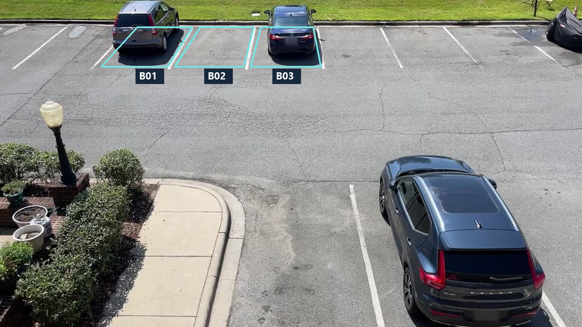
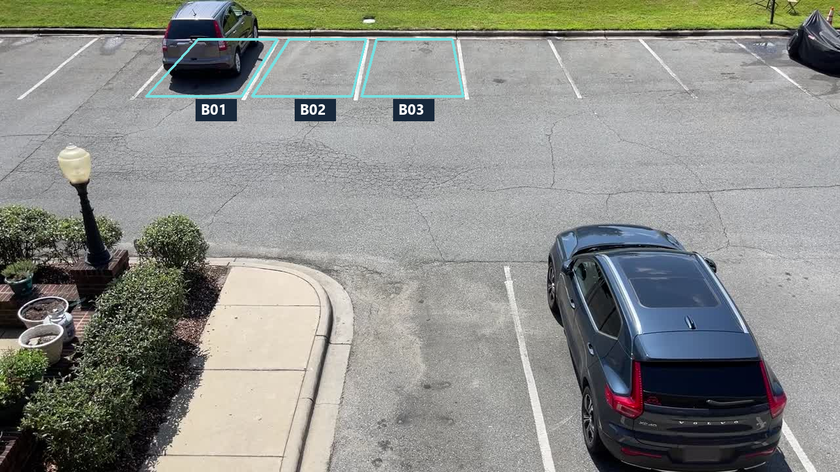
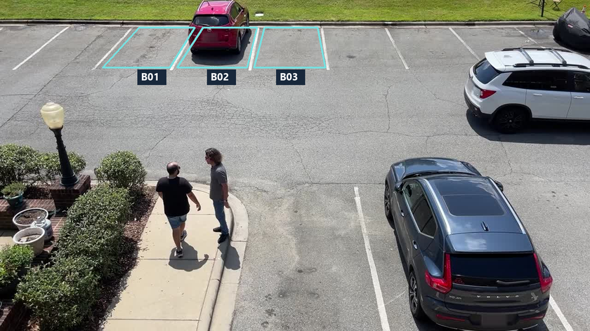
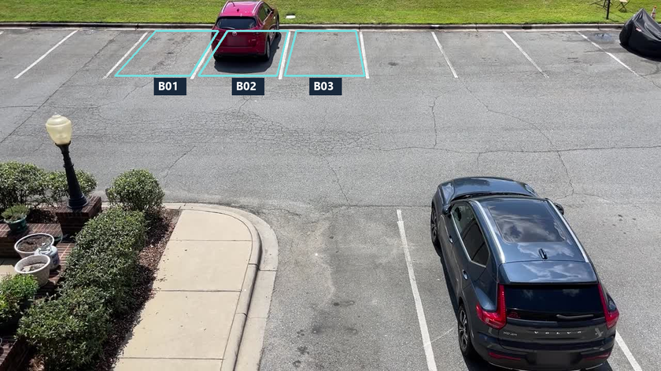
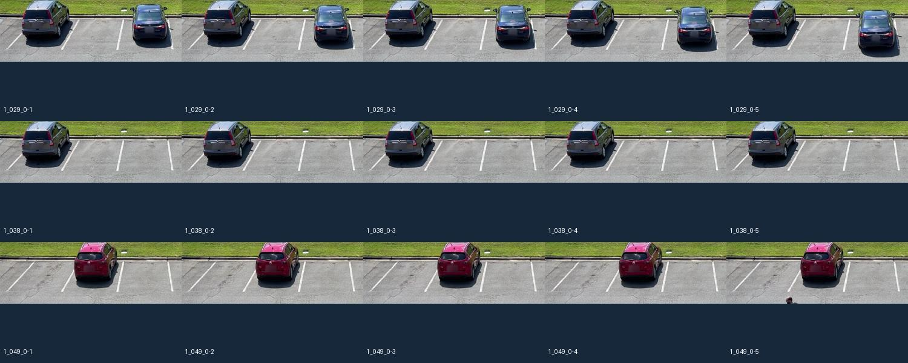
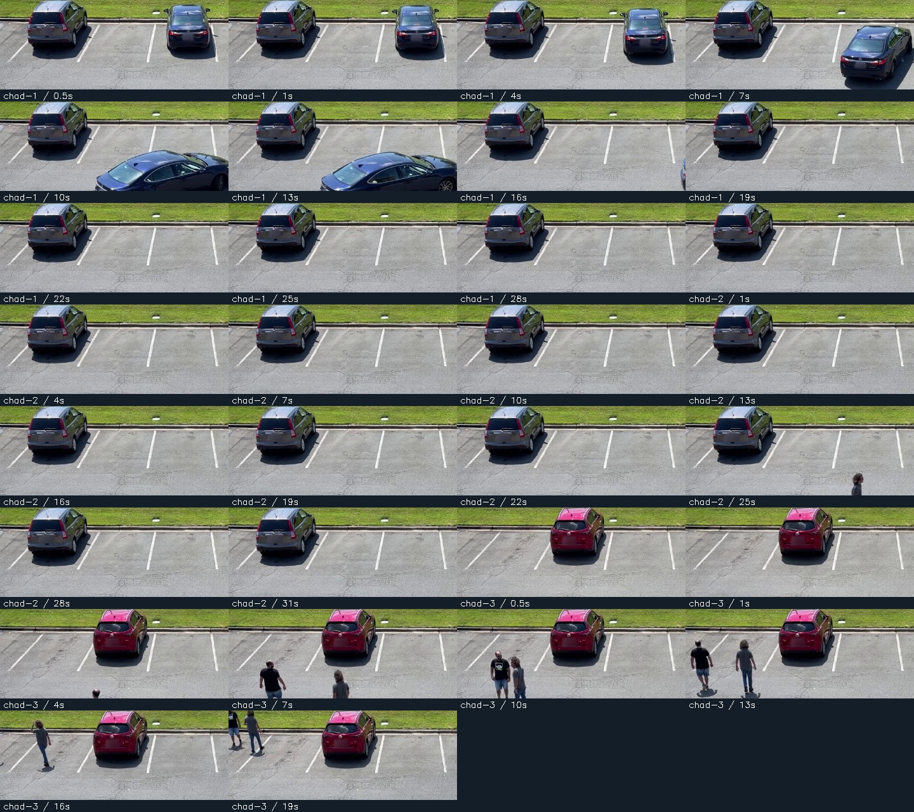

# Four elevated parking-camera recordings

**21 September:** empty reference examples were extracted and visually reviewed from these same cached videos. No substitute source, generic empty-lot image or model-generated reference was used. Exact bay IDs/times and crop galleries are in [EMPTY_REFERENCES.md](EMPTY_REFERENCES.md).

## Current selective-YOLO implementation — 19 September 2026

Normal Run now uses **Reference / MOG2 / YOLOv8 / Final estimate**. Matching definite classic results are retained; uncertain, missing or conflicting evidence triggers YOLOv8s. No qualifying detection remains uncertain. This supersedes the earlier SSD Vehicle/empty-bank decision rule and its vacancy counts below. CHAD mappings remain 9/5/4/3 bays across Cameras 1/2/3/4; overlapping periods are not fused.

The overhead site now maps **all 69 visible painted bays**, divided west 24 / middle 22 / east 23. Guarded registration corrects this clip's small drift; all ten samples remain usable. Only three bays have full classic calibration; YOLO verifies the others. The former three-bay subset and later-drift failure below are historical.

Current details: [YOLOV8.md](YOLOV8.md), [OVERHEAD_MAPPING.md](OVERHEAD_MAPPING.md), [FINAL_RESULTS.md](FINAL_RESULTS.md), [QUICK_START.md](QUICK_START.md). YOLO verification is now implemented; later probability fusion, temporal confirmation and persistence remain deferred.

## Earlier implementation and source history

The following dated record preserves the prior algorithms, measurements and source research. Its descriptions of no YOLO, Vehicle fallback, three overhead bays and unavailable later overhead frames are superseded above.

**19 September update:** all four actual CHAD cameras now have mapped occupancy results, with the approved OpenCV MobileNet-SSD model supplementing Reference/MOG2. See [CAMERA_MAPPING.md](CAMERA_MAPPING.md). The original media-only import descriptions and three-bay calibration below apply to the earlier terminal experiment. Video 4 is now also used for reviewed empty examples in the expanded Vehicle demo and is not its held-out evaluation.

**18 September update:** these four original files are all Camera 1 periods. The interface now also includes real CHAD Cameras 2–4 and a different overhead car park, with nine mapped CHAD bays (three calibrated). See [PARKING_AREAS.md](PARKING_AREAS.md) for current source links, exact files, area inventory and limitations. The three-bay previews/calibration below document the original calibrated subset, not the current nine-bay interface denominator.

Selected and checked on **15 September 2026**. All four are real recordings from **camera 1 of the same outdoor commercial car park** in the [CHAD publisher repository](https://github.com/TeCSAR-UNCC/CHAD). This fixed, elevated view shows several painted bays. It is an oblique downward CCTV view, not a perfectly vertical aerial view. Clear fixed bays were prioritized over the earlier low-angle indoor clip.

| Selector | Original recording | Duration | Dimensions | Download size |
| --- | --- | --- | --- | --- |
| Video 1 / `chad-1` | `1_029_0.mp4` | 30.00 s | 1920 × 1080 | 75.94 MB |
| Video 2 / `chad-2` | `1_038_0.mp4` | 33.00 s | 1920 × 1080 | 83.01 MB |
| Video 3 / `chad-3` | `1_049_0.mp4` | 19.99 s | 1920 × 1080 | 50.62 MB |
| Video 4 / `chad-4` | `1_054_0.mp4` | 33.00 s | 1920 × 1080 | 83.25 MB |

All four downloads passed pinned size, ZIP CRC32 and SHA-256 checks. A separate FFmpeg inspection decoded every frame successfully: **899, 989, 599 and 989 frames**, respectively, at approximately 29.97 fps. OpenCV subsequently processed occupancy samples from all four videos successfully after the earlier import block stopped occurring. See `VALIDATION.md` for measured results. Container creation dates describe encoded files and are not asserted as camera capture dates.

## Video access is already in the code

The [public video archive](https://drive.google.com/file/d/13am4hfhicErcozAYgkmQm02_K-cCmtkQ/view) is linked by the CHAD authors. `src/parking_probe/catalog.py` contains its public download URL and the four exact member names, byte locations and checksums. There is no API key, account, manual URL input, or YouTube extraction step.

The publisher distributes an approximately **87.97 GB ZIP**. The downloader requests only the compressed byte ranges for these four files (about **293 MB** altogether), then verifies each extracted MP4. It rejects servers that ignore HTTP Range instead of downloading the entire archive. If the publisher changes the archive, the code stops on range/header/hash checks; it does not silently switch footage.

Your local copies are in `data/chad/`. They can be opened in a video player independently of the detector. No third-party detection code, anomaly labels, or pickled annotations are used.

## Views and monitored area

The cyan polygons below are **configuration previews**, not computed occupancy states. The three adjacent far-row bays are B01, B02 and B03. The other visible spaces and foreground SUV are outside the monitored total.

### Video 1

### Video 2

### Video 3

### Video 4

## Reference and sample choices

The editable source recipe is `presets/chad-camera-1.json`. Analysis is at 1280 × 720, after validating the original 1920 × 1080 resolution. The setup view is Video 1 at 0 seconds.

| Bay | Verified empty reference | Original five vacant examples | Original five occupied examples |
| --- | --- | --- | --- |
| B01, gray SUV bay | Video 3, 0 s | Video 3, 1/2/3/4/5 s | Video 1, 1/2/3/4/5 s |
| B02, red SUV bay | Video 1, 0 s | Video 1, 1/2/3/4/5 s | Video 3, 1/2/3/4/5 s |
| B03, dark sedan bay | Video 2, 0 s | Video 2, 1/2/3/4/5 s | Video 1, 1/2/3/4/5 s |

First/middle/end views from all four clips and the original 15 unique calibration frames were visually inspected. The dark sedan leaves B03 in Video 1; intermediate departure observations may be uncertain. These are demonstration labels, not an independent accuracy test. The original first-five-second samples proved too narrow for later frames, so the recipe was expanded with the reviewed examples below. All three bays now pass the existing alignment, reference-separation and percentile calibration checks.

### Recipe version 2: wider calibration examples

Additional sample times are stored under `additional_samples` in `presets/chad-camera-1.json`. The unchanged 0-second references are not calibration samples. The recipe contains **99 labelled bay observations across 39 unique full frames**; all examples are from Videos 1–3. Video 4 is not used for calibration.

| Bay | Additional vacant examples | Additional occupied examples | Final vacant / occupied count |
| --- | --- | --- | --- |
| B01 | Video 3: 7, 10, 13, 16, 19 s | Video 1: 0.5, 7, 10, 13, 16, 19, 22, 25, 28 s; Video 2: 1, 4, 7, 10, 13, 16, 19, 22, 25, 28, 31 s | 10 / 25 |
| B02 | Video 1: 0.5, 19, 22, 25, 28 s; Video 2: 1, 4, 7, 10, 13, 16, 19, 22, 25, 28, 31 s | Video 3: 0.5, 7, 10, 13, 16, 19 s | 21 / 11 |
| B03 | Video 2: 7, 10, 13, 16, 19, 22, 25, 28, 31 s; Video 1: 19, 22, 25, 28 s; Video 3: 0.5, 1, 4, 7, 10, 13, 16, 19 s | Video 1: 0.5 s | 26 / 6 |

The extended review covers changes later in each clip and includes pedestrians in otherwise vacant bays. No moving-car departure frame is labelled as a confidently vacant B03 sample. Grayscale smoothing, polygons, references and the 95th/5th-percentile decision rules are unchanged.

The program generates its configuration, reference frames, sample CSV and `calibration-report.json` under `data/chad/preset-<signature>/` once OpenCV runs. Original recipes and references are never replaced because a car enters or the view changes. Threshold overlap, missing references or failed alignment must not be turned into guessed vacant/occupied states.

To extend counts to additional bays later, supply a verified empty reference and at least five examples of each state for each additional bay. The selected clips do not supply both states for every visible bay.

## Attribution

**CHAD: Charlotte Anomaly Dataset**, Armin Danesh Pazho, Ghazal Alinezhad Noghre, Babak Rahimi Ardabili, Christopher Neff and Hamed Tabkhi, SCIA 2023, pages 50–66. [Author repository](https://github.com/TeCSAR-UNCC/CHAD) · [Paper](https://arxiv.org/abs/2212.09258).

The publisher repository includes an [Apache 2.0 license](https://github.com/TeCSAR-UNCC/CHAD/blob/main/LICENSE); a copy is retained in `third_party/CHAD-LICENSE.txt`. The preview images are resized, labelled excerpts from the selected videos and remain attributed to CHAD. The original videos are cached unchanged. Refer to the publisher's terms before redistributing footage beyond this local academic experiment.
